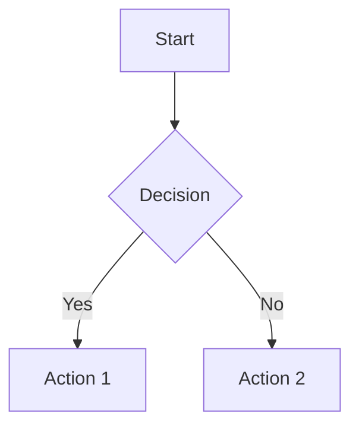
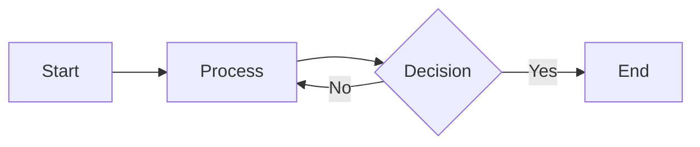
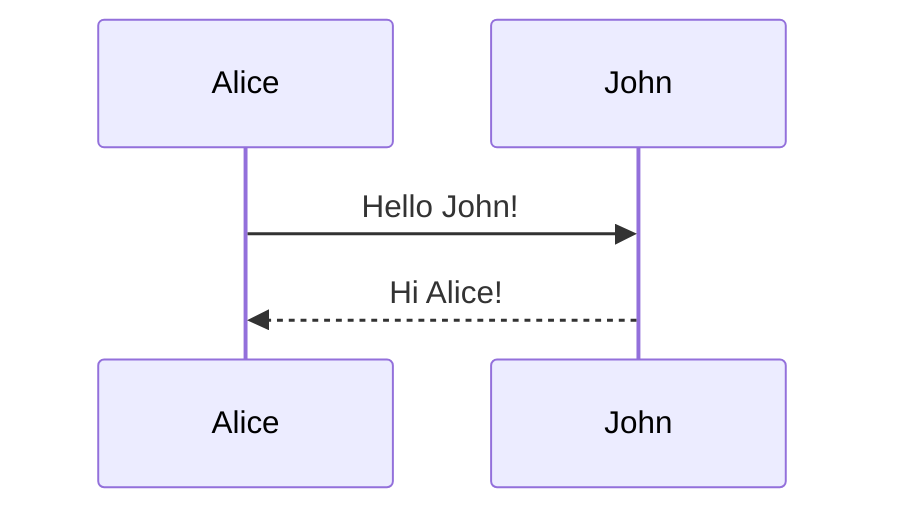
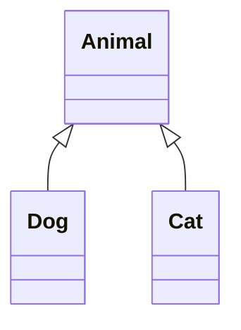
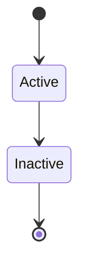
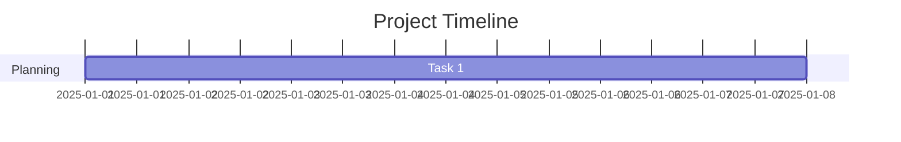
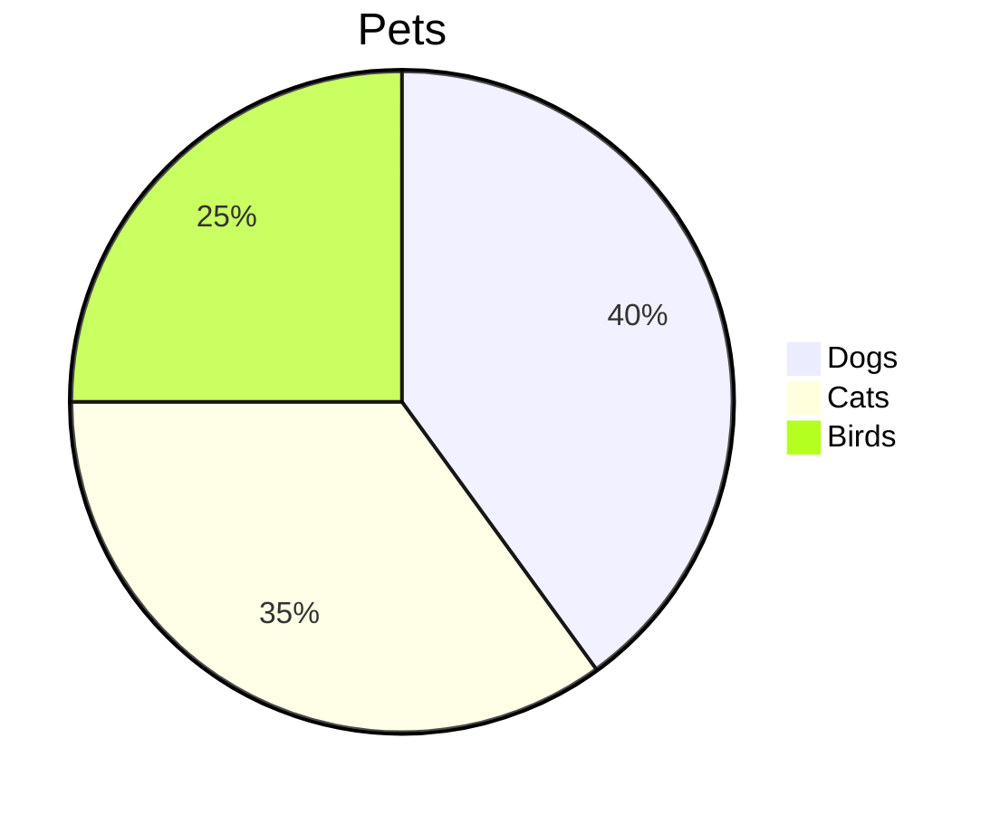
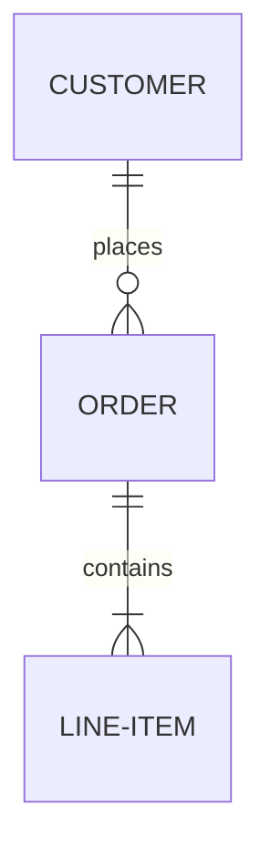
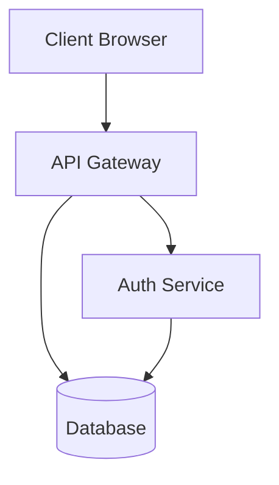

# Mermaid Chart Usage Guide

This site now supports **Mermaid.js** for creating diagrams and visualizations directly in Markdown!

## What is Mermaid?

Mermaid is a JavaScript-based diagramming and charting tool that uses Markdown-inspired text definitions to create and modify diagrams dynamically. It allows you to create flowcharts, sequence diagrams, class diagrams, and more using simple text syntax.

## How to Use Mermaid in Posts

Simply use a code fence with the `mermaid` language identifier:

````markdown

````

The chart will automatically render when the page loads!

## Implementation Details

### Files Modified

1. **`_config.yml`**
   - Added Kramdown configuration for proper code block handling
   - Uses GFM (GitHub Flavored Markdown) input

2. **`_layouts/default.html`**
   - Loads Mermaid.js v11 from jsDelivr CDN
   - Includes JavaScript to convert Kramdown-generated code blocks to Mermaid format
   - Automatically initializes and renders diagrams on page load

3. **`assets/css/style.css`**
   - Added styling for `.mermaid` class
   - Responsive design with horizontal scrolling for large diagrams
   - Light background and border for visual separation

4. **`assets/js/mermaid-init.js`**
   - Optional advanced configuration file
   - Contains examples for dark mode support and custom themes
   - Currently not loaded (using inline script for simplicity)

### How It Works

1. You write Mermaid code in a Markdown code fence with `language-mermaid`
2. Jekyll/Kramdown converts it to `<pre><code class="language-mermaid">...</code></pre>`
3. JavaScript runs on page load to find these code blocks
4. Code blocks are converted to `<div class="mermaid">...</div>` format
5. Mermaid.js renders the diagrams automatically

## Supported Diagram Types

### 1. Flowcharts



### 2. Sequence Diagrams



### 3. Class Diagrams



### 4. State Diagrams



### 5. Gantt Charts



### 6. Pie Charts



### 7. ER Diagrams



## Configuration

### Current Settings

```javascript
mermaid.initialize({
    startOnLoad: true,      // Auto-render on page load
    theme: 'default',       // Theme: default, dark, forest, neutral
    securityLevel: 'loose', // Allow more features
    fontFamily: 'inherit'   // Use site's font
});
```

### Advanced Customization

To enable advanced features (dark mode, custom themes, etc.):

1. Edit `_layouts/default.html` and remove the inline Mermaid script
2. Edit `assets/js/mermaid-init.js` and uncomment the configuration code
3. Add this line to `default.html`:
   ```html
   <script src="{{ '/assets/js/mermaid-init.js' | relative_url }}" type="module"></script>
   ```

## Examples and Testing

See the test post for live examples: [Mermaid Chart Test](/2025/10/19/mermaid-test.html)

This page contains:
- Flowchart examples
- Sequence diagrams
- Class diagrams
- Gantt charts
- State diagrams
- Pie charts
- ER diagrams

## Resources

- [Mermaid Official Documentation](https://mermaid.js.org/)
- [Mermaid Live Editor](https://mermaid.live/) - Test your diagrams before adding to posts
- [Mermaid Syntax Guide](https://mermaid.js.org/intro/)
- [Mermaid GitHub Repository](https://github.com/mermaid-js/mermaid)

## Troubleshooting

### Diagrams Not Rendering?

1. **Check browser console** for JavaScript errors
2. **Clear browser cache** and reload
3. **Verify syntax** using [Mermaid Live Editor](https://mermaid.live/)
4. **Check code fence** uses `mermaid` (not `Mermaid` or other variations)

### Diagram Too Wide?

Mermaid diagrams have horizontal scrolling enabled by default. For better mobile experience:
- Keep diagrams simple and concise
- Use `LR` (Left to Right) sparingly; prefer `TD` (Top Down)
- Test on mobile devices

### Need Different Theme?

Edit the `theme` value in `_layouts/default.html`:
- `default` - Standard Mermaid theme
- `dark` - Dark theme
- `forest` - Green theme
- `neutral` - Neutral gray theme

## Best Practices

1. **Test First**: Use [Mermaid Live Editor](https://mermaid.live/) to test complex diagrams
2. **Keep It Simple**: Complex diagrams may be hard to read on mobile
3. **Use Comments**: Add comments in your Mermaid code for clarity
4. **Responsive Design**: Consider how diagrams will look on different screen sizes
5. **Accessibility**: Provide text descriptions for screen readers when using complex diagrams

## Example Usage in Posts

````markdown
---
layout: post
title: "My Post with Diagrams"
date: 2025-10-19
categories: Programming
tags: [tutorial, architecture]
published: true
---

## System Architecture

Here's how our system works:



The diagram above shows the basic architecture...
````

## Version

- Mermaid.js: **v11** (Latest from jsDelivr CDN)
- Auto-updates to latest stable v11.x

---

**Last Updated:** 2025-10-19
