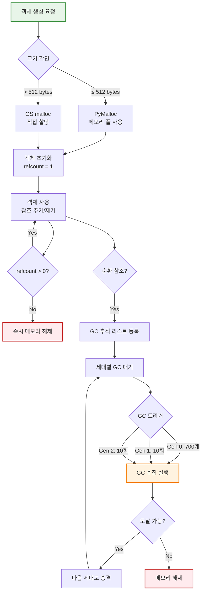
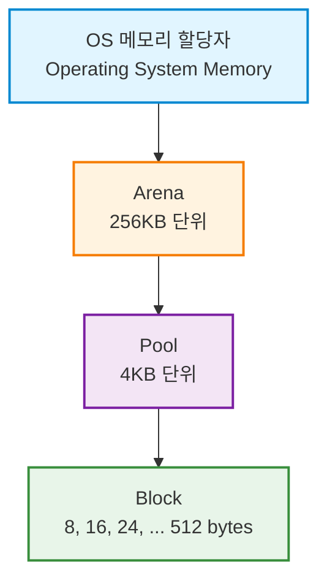
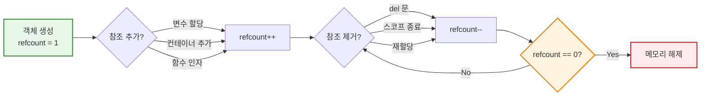
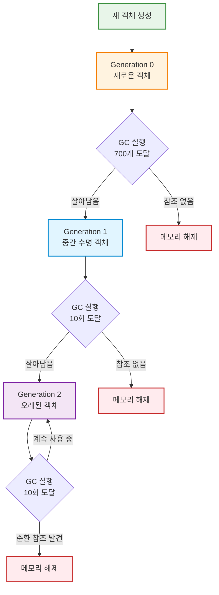
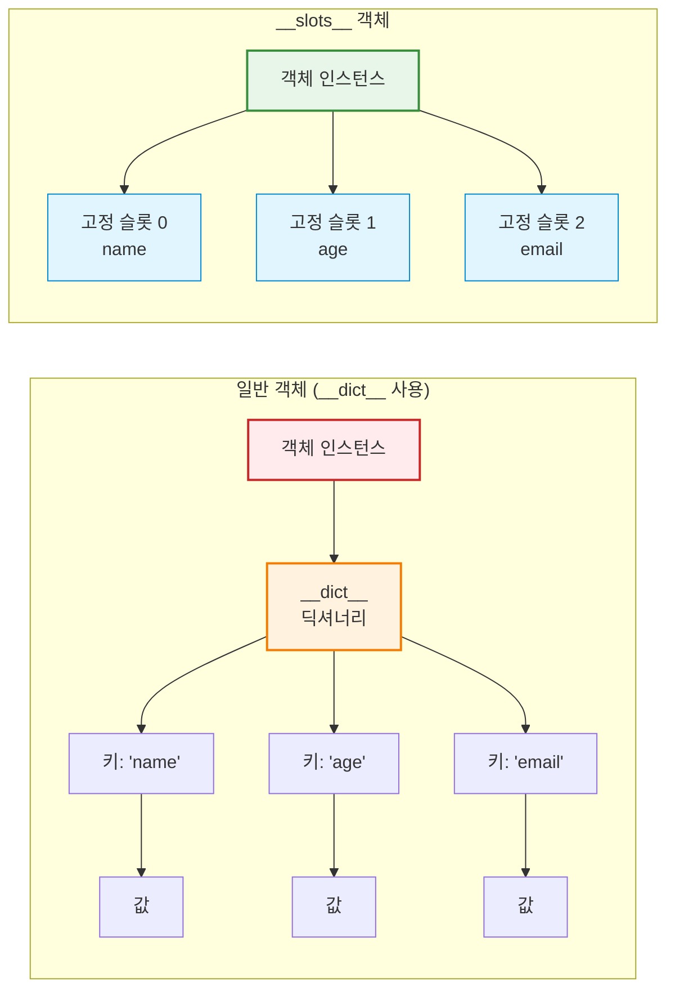
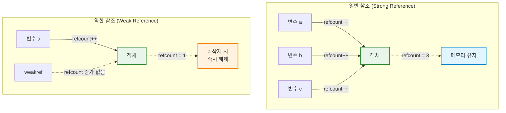

## 소개

Python의 메모리 구조와 객체 모델을 이해하는 것은 효율적이고 버그 없는 코드를 작성하는 데 필수적입니다. 이 글에서는 Python이 메모리를 관리하고, 객체를 처리하며, 다양한 내부 메커니즘을 통해 성능을 최적화하는 방법을 심층적으로 살펴봅니다.

<div class="post-summary-box" markdown="1">

### 📋 이 글에서 다루는 내용

#### 📚 주요 주제

- **객체 모델**: Python의 "모든 것은 객체" 철학과 id(), is, sys.getsizeof() 활용
- **메모리 아키텍처**: CPython의 계층적 메모리 구조 (Arena → Pool → Block)
- **참조 카운팅**: 객체 생명주기 관리와 메모리 해제 메커니즘
- **가비지 컬렉션**: 순환 참조 해결을 위한 세대별 GC
- **메모리 최적화**: **slots**, weakref, gc 모듈을 활용한 최적화 기법

#### 🎯 학습 목표

- CPython 내부 메모리 관리 방식 이해
- 참조 카운팅과 가비지 컬렉션의 동작 원리 파악
- 메모리 사용량을 50% 이상 절감하는 최적화 기법 습득
- 메모리 누수 디버깅 및 프로파일링 실전 활용

#### 📊 포함된 다이어그램

**6개의 Mermaid 다이어그램**으로 복잡한 개념을 시각화했습니다:

1. Python 객체 생명주기 전체 흐름
2. CPython 메모리 아키텍처 계층 구조
3. 참조 카운팅 증가/감소 흐름
4. 세대별 가비지 컬렉션 프로세스
5. **slots** vs **dict** 메모리 구조 비교
6. 강한 참조 vs 약한 참조 비교

#### ⏱️ 예상 읽기 시간

약 25-30분 (코드 예제 실습 포함 시 45분)

</div>

**Python 객체 생명주기 전체 흐름:**



## 1. 파이썬의 모든 것은 객체다: Object의 기본

### 1.1 파이썬의 객체 모델

Python에서 가장 중요한 개념 중 하나는 **"모든 것이 객체"**라는 것입니다. 변수는 단순한 메모리 공간이 아니라, **객체를 가리키는 이름(Name)** 또는 **참조(Reference)**입니다.

```python
# 변수는 객체를 가리키는 이름입니다
x = 42
y = x

# x와 y는 같은 객체를 가리킵니다
print(x is y)  # True
```

Python의 모든 객체는 세 가지 핵심 속성을 가집니다:

- **식별자 (Identity)**: 객체의 고유한 메모리 주소
- **타입 (Type)**: 객체의 자료형
- **값 (Value)**: 객체가 가진 데이터

```python
x = 42
print(f"식별자: {id(x)}")      # 메모리 주소
print(f"타입: {type(x)}")      # <class 'int'>
print(f"값: {x}")              # 42
```

### 1.2 id() 함수와 객체의 고유성

`id()` 함수는 객체의 메모리 주소(고유 식별자)를 반환합니다. 이는 `is` 연산자와 밀접한 관계가 있습니다.

```python
a = [1, 2, 3]
b = [1, 2, 3]
c = a

print(f"id(a): {id(a)}")
print(f"id(b): {id(b)}")
print(f"id(c): {id(c)}")

# is 연산자는 id가 같은지 확인합니다 (같은 객체인지)
print(a is c)  # True - 같은 객체
print(a is b)  # False - 다른 객체 (값은 같지만)

# == 연산자는 값이 같은지 확인합니다
print(a == b)  # True - 값이 같음
```

**is vs == 비교:**

- `is`: 두 변수가 **같은 객체**를 가리키는지 확인 (identity 비교)
- `==`: 두 객체의 **값**이 같은지 확인 (value 비교)

```python
# None, True, False는 싱글톤 객체입니다
a = None
b = None
print(a is b)  # True - 같은 None 객체

# 작은 정수는 캐싱됩니다 (-5 ~ 256)
x = 256
y = 256
print(x is y)  # True

x = 257
y = 257
print(x is y)  # False (CPython 구현에 따라 다를 수 있음)
```

### 1.3 sys.getsizeof() 함수와 객체의 크기

`sys.getsizeof()` 함수는 객체가 차지하는 메모리 크기를 바이트 단위로 반환합니다.

```python
import sys

# 다양한 타입의 메모리 크기 확인
print(f"int(0): {sys.getsizeof(0)} bytes")
print(f"int(100): {sys.getsizeof(100)} bytes")
print(f"int(10**100): {sys.getsizeof(10**100)} bytes")  # 큰 정수는 더 많은 메모리 사용

print(f"str(''): {sys.getsizeof('')} bytes")
print(f"str('hello'): {sys.getsizeof('hello')} bytes")

print(f"list([]): {sys.getsizeof([])} bytes")
print(f"list([1,2,3]): {sys.getsizeof([1,2,3])} bytes")


print(f"dict({{}}): {sys.getsizeof({})} bytes")
print(f"dict({{'a':1}}): {sys.getsizeof({'a':1})} bytes")

```

**getsizeof()의 한계점:**

`sys.getsizeof()`는 객체 자체의 크기만 반환하며, 객체가 참조하는 다른 객체의 크기는 포함하지 않습니다.

```python
import sys

# 리스트가 참조하는 객체들의 크기는 포함되지 않습니다
list1 = [1, 2, 3]
list2 = [[1, 2, 3], [4, 5, 6], [7, 8, 9]]

print(sys.getsizeof(list1))  # 작은 크기
print(sys.getsizeof(list2))  # list1과 크기 차이가 크지 않음

# 실제 총 크기를 계산하려면 재귀적으로 계산해야 합니다
def get_total_size(obj, seen=None):
    """재귀적으로 객체의 전체 크기 계산"""
    size = sys.getsizeof(obj)
    if seen is None:
        seen = set()

    obj_id = id(obj)
    if obj_id in seen:
        return 0

    seen.add(obj_id)

    if isinstance(obj, dict):
        size += sum([get_total_size(v, seen) for v in obj.values()])
        size += sum([get_total_size(k, seen) for k in obj.keys()])
    elif hasattr(obj, '__dict__'):
        size += get_total_size(obj.__dict__, seen)
    elif hasattr(obj, '__iter__') and not isinstance(obj, (str, bytes, bytearray)):
        size += sum([get_total_size(i, seen) for i in obj])

    return size

print(f"list2 전체 크기: {get_total_size(list2)} bytes")
```

## 2. CPython 메모리 관리의 비밀

### 2.1 CPython의 메모리 아키텍처

CPython은 효율적인 메모리 관리를 위해 계층적 구조를 사용합니다:



**계층 구조 설명:**

1. **Arena**: 256KB 크기의 메모리 블록, OS로부터 직접 할당받음
2. **Pool**: 4KB 크기, 같은 크기의 블록들로 구성
3. **Block**: 8바이트 단위로 증가 (8, 16, 24, ..., 512 bytes)

```python
# 작은 객체들은 메모리 풀에서 효율적으로 관리됩니다
# 512 bytes 이하의 객체는 pymalloc을 통해 관리
small_list = [1, 2, 3]  # Pool에서 할당

# 큰 객체는 OS의 malloc을 직접 사용
large_list = [i for i in range(1000000)]  # OS malloc 사용
```

### 2.2 참조 카운팅 (Reference Counting)

Python의 기본 메모리 관리 기법은 **참조 카운팅**입니다. 각 객체는 자신을 참조하는 변수의 개수를 추적합니다.

```python
import sys

a = []
print(sys.getrefcount(a))  # 2 (a 자체 + getrefcount의 임시 참조)

b = a
print(sys.getrefcount(a))  # 3 (참조 증가)

c = a
print(sys.getrefcount(a))  # 4 (참조 증가)

del b
print(sys.getrefcount(a))  # 3 (참조 감소)

del c
print(sys.getrefcount(a))  # 2 (참조 감소)

# 참조 카운트가 0이 되면 즉시 메모리 해제
```

**참조 카운트가 증가하는 경우:**

- 객체를 변수에 할당할 때
- 객체를 컨테이너(리스트, 딕셔너리 등)에 추가할 때
- 함수에 인자로 전달할 때

**참조 카운트가 감소하는 경우:**

- 변수가 스코프를 벗어날 때
- 변수에 다른 객체를 할당할 때
- `del` 문으로 변수를 삭제할 때
- 컨테이너에서 객체를 제거할 때

**참조 카운팅 흐름도:**



### 2.3 순환 참조 문제와 세대별 가비지 컬렉션

참조 카운팅만으로는 **순환 참조**를 해결할 수 없습니다.

```python
import gc
import sys

# 순환 참조 예제
class Node:
    def __init__(self, value):
        self.value = value
        self.next = None

# 순환 참조 생성
node1 = Node(1)
node2 = Node(2)
node1.next = node2
node2.next = node1  # 순환 참조!

print(f"node1 참조 카운트: {sys.getrefcount(node1)}")
print(f"node2 참조 카운트: {sys.getrefcount(node2)}")

# node1, node2를 삭제해도 서로를 참조하고 있어 메모리 해제 안 됨
del node1
del node2

# 가비지 컬렉터가 순환 참조를 정리
collected = gc.collect()
print(f"수거된 객체 수: {collected}")
```

**세대별 가비지 컬렉션 (Generational GC):**

Python의 `gc` 모듈은 세대별 가비지 컬렉션을 사용합니다:

- **Generation 0**: 새로 생성된 객체
- **Generation 1**: Generation 0에서 살아남은 객체
- **Generation 2**: Generation 1에서 살아남은 객체 (오래된 객체)



```python
import gc

# 현재 가비지 컬렉션 설정 확인
print(f"GC 임계값: {gc.get_threshold()}")  # (700, 10, 10)
# 의미: Gen0에 700개 객체가 쌓이면 수집, Gen0 수집 10번마다 Gen1 수집, Gen1 수집 10번마다 Gen2 수집

# 세대별 객체 수 확인
print(f"세대별 객체 수: {gc.get_count()}")  # (Gen0, Gen1, Gen2)

# 수동으로 가비지 컬렉션 실행
collected = gc.collect()
print(f"수거된 객체 수: {collected}")

# 추적 가능한 객체 목록
print(f"추적 중인 객체 수: {len(gc.get_objects())}")
```

## 3. 메모리 최적화 및 고급 관리 기법

### 3.1 **slots**를 이용한 메모리 절약

Python 객체는 기본적으로 `__dict__`를 사용하여 인스턴스 속성을 저장합니다. `__slots__`를 사용하면 `__dict__` 생성을 막아 메모리를 절약할 수 있습니다.

\***\*dict** vs **slots** 메모리 구조:\*\*



```python
import sys

# 일반 클래스 (__dict__ 사용)
class PersonNormal:
    def __init__(self, name, age):
        self.name = name
        self.age = age

# __slots__ 사용 클래스
class PersonSlots:
    __slots__ = ['name', 'age']

    def __init__(self, name, age):
        self.name = name
        self.age = age

# 메모리 사용량 비교
p1 = PersonNormal("Alice", 30)
p2 = PersonSlots("Bob", 25)

print(f"일반 객체 크기: {sys.getsizeof(p1)} bytes")
print(f"일반 객체 __dict__: {sys.getsizeof(p1.__dict__)} bytes")
print(f"__slots__ 객체 크기: {sys.getsizeof(p2)} bytes")

# 대량의 객체 생성 시 메모리 차이
import tracemalloc

tracemalloc.start()

# 일반 클래스로 100,000개 객체 생성
persons_normal = [PersonNormal(f"Person{i}", i) for i in range(100000)]
current1, peak1 = tracemalloc.get_traced_memory()

tracemalloc.clear_traces()

# __slots__ 클래스로 100,000개 객체 생성
persons_slots = [PersonSlots(f"Person{i}", i) for i in range(100000)]
current2, peak2 = tracemalloc.get_traced_memory()

print(f"\n일반 클래스 메모리: {current1 / 10**6:.2f}MB")
print(f"__slots__ 클래스 메모리: {current2 / 10**6:.2f}MB")
print(f"메모리 절감: {(current1 - current2) / 10**6:.2f}MB ({((current1-current2)/current1)*100:.1f}%)")

tracemalloc.stop()
```

\***\*slots**의 제약사항:\*\*

```python
class Person:
    __slots__ = ['name', 'age']

    def __init__(self, name, age):
        self.name = name
        self.age = age

p = Person("Alice", 30)

# 제약 1: __dict__가 없어 동적 속성 추가 불가
try:
    p.email = "alice@example.com"  # AttributeError
except AttributeError as e:
    print(f"오류: {e}")

# 제약 2: __weakref__가 없어 약한 참조 불가 (명시적으로 추가해야 함)
# __slots__ = ['name', 'age', '__weakref__']로 해결 가능

# 제약 3: 상속 시 주의 필요
class Employee(Person):
    __slots__ = ['employee_id']  # 부모의 __slots__와 합쳐짐

    def __init__(self, name, age, employee_id):
        super().__init__(name, age)
        self.employee_id = employee_id
```

### 3.2 weakref 모듈과 약한 참조

`weakref` 모듈은 객체를 참조하되 참조 카운트를 증가시키지 않는 **약한 참조**를 제공합니다. 이는 캐시나 순환 참조 방지에 유용합니다.

**일반 참조 vs 약한 참조:**



```python
import weakref
import sys

class Data:
    def __init__(self, value):
        self.value = value

    def __del__(self):
        print(f"Data({self.value}) 객체 삭제됨")

# 일반 참조
data = Data(42)
ref1 = data
print(f"참조 카운트: {sys.getrefcount(data)}")  # 3

# 약한 참조
weak_ref = weakref.ref(data)
print(f"참조 카운트: {sys.getrefcount(data)}")  # 3 (약한 참조는 카운트 증가 안 함)

# 약한 참조로 객체 접근
print(f"약한 참조로 접근: {weak_ref()}")  # Data 객체
print(f"값: {weak_ref().value}")  # 42

# 원본 객체 삭제
del data
del ref1

# 약한 참조는 None을 반환
print(f"약한 참조 (삭제 후): {weak_ref()}")  # None
```

**weakref를 사용한 캐시 구현:**

```python
import weakref

class ExpensiveObject:
    def __init__(self, name):
        self.name = name
        print(f"ExpensiveObject({name}) 생성 - 비용이 큰 작업 수행")

# WeakValueDictionary를 사용한 캐시
cache = weakref.WeakValueDictionary()

def get_object(name):
    """캐시에서 객체를 가져오거나 새로 생성"""
    if name in cache:
        print(f"캐시에서 {name} 가져옴")
        return cache[name]

    obj = ExpensiveObject(name)
    cache[name] = obj
    return obj

# 첫 번째 호출 - 객체 생성
obj1 = get_object("data1")

# 두 번째 호출 - 캐시에서 가져옴
obj2 = get_object("data1")
print(f"같은 객체? {obj1 is obj2}")  # True

# 참조 제거
del obj1
del obj2

# 약한 참조이므로 객체가 자동으로 삭제됨
print(f"캐시 크기: {len(cache)}")  # 0

# 다시 호출 - 새로 생성됨
obj3 = get_object("data1")
```

**순환 참조 방지:**

```python
import weakref

class Parent:
    def __init__(self, name):
        self.name = name
        self.children = []

    def add_child(self, child):
        self.children.append(child)
        child.parent = weakref.ref(self)  # 약한 참조 사용

class Child:
    def __init__(self, name):
        self.name = name
        self.parent = None

    def get_parent(self):
        return self.parent() if self.parent else None

# 순환 참조 없이 부모-자식 관계 설정
parent = Parent("Parent")
child = Child("Child")
parent.add_child(child)

print(f"자식의 부모: {child.get_parent().name}")

# 부모 객체 삭제
del parent

# 약한 참조로 인해 부모 객체가 완전히 삭제됨
print(f"부모 객체: {child.get_parent()}")  # None
```

### 3.3 gc 모듈 직접 제어하기

`gc` 모듈을 사용하여 가비지 컬렉션을 직접 제어하고 메모리 누수를 디버깅할 수 있습니다.

```python
import gc

# 가비지 컬렉션 비활성화/활성화
gc.disable()
print(f"GC 활성화 상태: {gc.isenabled()}")  # False

# 대량의 객체 생성 작업 수행
data = [i for i in range(1000000)]

# 작업 완료 후 수동으로 GC 실행
gc.enable()
collected = gc.collect()
print(f"수거된 객체 수: {collected}")

# GC 통계 확인
stats = gc.get_stats()
for i, stat in enumerate(stats):
    print(f"Generation {i}: {stat}")

# GC 임계값 조정
# 기본값: (700, 10, 10)
gc.set_threshold(1000, 15, 15)  # 더 느슨한 설정
print(f"새로운 임계값: {gc.get_threshold()}")
```

**메모리 누수 디버깅:**

```python
import gc
import sys

class LeakyClass:
    instances = []  # 클래스 변수에 저장 - 메모리 누수 가능성

    def __init__(self, value):
        self.value = value
        LeakyClass.instances.append(self)  # 자기 자신을 리스트에 추가

# 객체 생성
for i in range(100):
    obj = LeakyClass(i)

# obj 변수는 삭제되었지만 instances 리스트에 남아있음
print(f"메모리에 남아있는 인스턴스 수: {len(LeakyClass.instances)}")

# gc.get_referrers()로 객체를 참조하는 것 찾기
sample = LeakyClass.instances[0]
referrers = gc.get_referrers(sample)
print(f"참조자 수: {len(referrers)}")
for ref in referrers:
    print(f"참조 타입: {type(ref)}")

# 메모리 누수 해결
LeakyClass.instances.clear()
gc.collect()
```

**순환 참조 찾기:**

```python
import gc

# 순환 참조가 있는 객체들 찾기
def find_circular_references():
    gc.collect()  # 먼저 GC 실행

    # 가비지로 수집된 객체들 확인
    if gc.garbage:
        print(f"수거되지 않은 객체 수: {len(gc.garbage)}")
        for item in gc.garbage:
            print(f"- {type(item)}: {item}")
            # 참조 관계 확인
            referents = gc.get_referents(item)
            print(f"  참조하는 객체 수: {len(referents)}")
    else:
        print("순환 참조 없음")

# DEBUG 모드 활성화
gc.set_debug(gc.DEBUG_SAVEALL)

# 순환 참조 생성
class Node:
    def __init__(self):
        self.ref = None

a = Node()
b = Node()
a.ref = b
b.ref = a

del a
del b

gc.collect()
find_circular_references()

# DEBUG 모드 해제
gc.set_debug(0)
```

**메모리 프로파일링과 함께 사용:**

```python
import gc
import tracemalloc

def profile_memory_with_gc():
    """GC와 함께 메모리 프로파일링"""
    tracemalloc.start()

    # GC 비활성화하고 객체 생성
    gc.disable()
    data = [list(range(1000)) for _ in range(1000)]
    current, peak = tracemalloc.get_traced_memory()
    print(f"GC 비활성화 시: {current / 10**6:.2f}MB (peak: {peak / 10**6:.2f}MB)")

    # GC 활성화하고 수집
    gc.enable()
    collected = gc.collect()
    current, peak = tracemalloc.get_traced_memory()
    print(f"GC 실행 후: {current / 10**6:.2f}MB (수거: {collected}개)")

    tracemalloc.stop()

profile_memory_with_gc()
```

## 핵심 포인트

### 객체 모델의 이해

- Python에서 변수는 객체를 가리키는 **이름(Name)** 또는 **참조(Reference)**입니다
- 모든 객체는 **식별자(Identity)**, **타입(Type)**, **값(Value)** 세 가지 속성을 가집니다
- `id()` 함수로 객체의 메모리 주소를 확인하고, `is` 연산자로 객체 동일성을 비교합니다
- `sys.getsizeof()`는 객체 자체의 크기만 반환하며, 참조하는 객체는 포함하지 않습니다

### CPython 메모리 관리

- CPython은 **Arena → Pool → Block** 계층 구조로 메모리를 효율적으로 관리합니다
- **참조 카운팅(Reference Counting)**으로 객체의 생명주기를 추적합니다
- 순환 참조는 참조 카운팅만으로 해결할 수 없어 **세대별 가비지 컬렉션**이 필요합니다
- `gc` 모듈로 가비지 컬렉션을 제어하고 메모리 누수를 디버깅할 수 있습니다

### 메모리 최적화 기법

- `__slots__`를 사용하면 `__dict__` 생성을 막아 **메모리 사용량을 50% 이상 절감**할 수 있습니다
- `weakref` 모듈은 참조 카운트를 증가시키지 않는 **약한 참조**를 제공합니다
- 약한 참조는 캐시 구현과 순환 참조 방지에 유용합니다
- `gc.collect()`로 수동 가비지 컬렉션을 실행하고, `gc.get_referrers()`로 메모리 누수를 추적합니다

### 실무 적용

- 대량의 객체를 다룰 때는 `__slots__` 사용을 고려하세요
- 캐시 구현 시 `weakref.WeakValueDictionary`를 활용하세요
- 메모리 프로파일링(`tracemalloc`)과 가비지 컬렉션(`gc`)을 함께 사용하여 메모리 문제를 진단하세요
- 순환 참조가 의심될 때는 `gc.set_debug(gc.DEBUG_SAVEALL)`로 디버깅하세요

## 결론

Python의 메모리 구조와 객체 모델을 깊이 이해하는 것은 단순히 이론적 지식을 넘어 실무에서 직면하는 성능 문제와 메모리 이슈를 해결하는 핵심 역량입니다.

**이 글에서 다룬 내용:**

1. **객체 모델의 기본**: 변수는 객체를 가리키는 이름이며, `id()`, `is`, `sys.getsizeof()`로 객체의 속성을 확인할 수 있습니다.

2. **CPython의 메모리 관리**: 계층적 메모리 구조, 참조 카운팅, 세대별 가비지 컬렉션을 통해 효율적으로 메모리를 관리합니다.

3. **고급 최적화 기법**: `__slots__`, `weakref`, `gc` 모듈을 활용하여 메모리 사용량을 최적화하고 메모리 누수를 방지합니다.

이러한 개념들을 실무에 적용하면:

- 메모리 사용량이 많은 애플리케이션의 성능을 개선할 수 있습니다
- 순환 참조로 인한 메모리 누수를 사전에 방지할 수 있습니다
- 프로파일링 도구를 사용하여 병목 지점을 정확히 파악할 수 있습니다
- 대용량 데이터 처리 시 메모리를 효율적으로 관리할 수 있습니다

Python의 "자동" 메모리 관리가 모든 것을 해결해주는 것은 아닙니다. 내부 동작 원리를 이해하고 적절한 도구를 활용하는 것이 진정한 Python 전문가로 가는 길입니다.

### 다음 학습

이 글을 읽으셨다면 다음 주제로 넘어가보세요:

- **[Python GIL (Global Interpreter Lock)](/2025/10/22/python-gil.html)** ← 다음 추천
  - 메모리 구조를 이해했다면, 멀티스레딩 환경에서 Python이 어떻게 동작하는지 알아보세요
- [Python Bytecode](/2025/10/24/python-bytecode.html)
  - 바이트코드 수준에서 Python의 실행 메커니즘 이해
- Import 시스템 심화
- Exception Internals

## 참고 자료

- [Python Documentation - Data Model](https://docs.python.org/3/reference/datamodel.html)
- [Python Documentation - gc module](https://docs.python.org/3/library/gc.html)
- [Python Documentation - weakref module](https://docs.python.org/3/library/weakref.html)
- [CPython Source Code - Memory Management](https://github.com/python/cpython/blob/main/Objects/obmalloc.c)
- [PEP 412 - Key-Sharing Dictionary](https://www.python.org/dev/peps/pep-0412/)
- [Understanding Python Memory Management](https://realpython.com/python-memory-management/)
