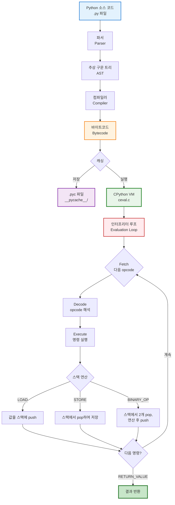
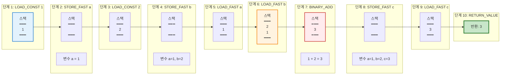
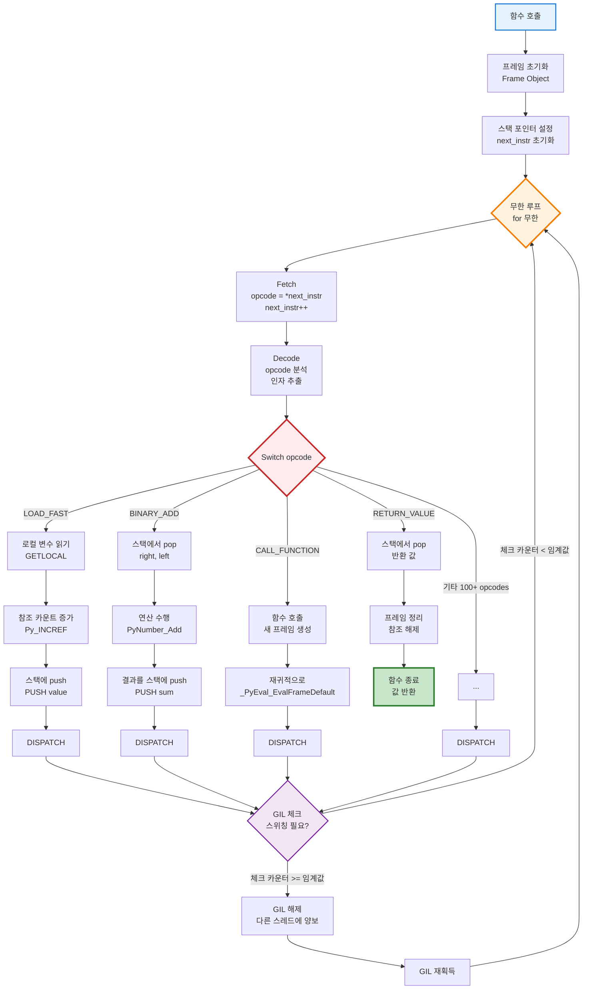

## 소개

Python 바이트코드는 Python 인터프리터가 실행하는 중간 표현 형태입니다. Python 스크립트를 실행하면, 소스 코드가 먼저 바이트코드로 컴파일되고, 이후 Python Virtual Machine(PVM)에 의해 실행됩니다. 바이트코드를 이해하면 더 효율적인 코드를 작성하고 성능 문제를 디버깅하는 데 도움이 됩니다.

<div class="post-summary-box" markdown="1">

### 📌 이 글에서 다루는 내용

#### 🔍 핵심 주제

- **바이트코드의 이해**: Python 소스 코드와 기계 실행 사이의 중간 표현
- **dis 모듈 심화**: 바이트코드 분석 도구 완벽 가이드
- **CPython 내부 구조**: ceval.c 인터프리터 루프와 실행 메커니즘
- **성능 최적화**: 동일 로직의 서로 다른 구현 방법 바이트코드 비교

#### 🎯 주요 내용

1. **Python Bytecode 기초**

   - 컴파일 과정: .py → .pyc (바이트코드)
   - 바이트코드 확인 방법 (`dis` 모듈)
   - 주요 명령어: LOAD_FAST, BINARY_ADD, RETURN_VALUE 등
   - 바이트코드 캐시 (.pyc 파일) 동작 원리

2. **dis 모듈 심화 분석**

   - `dis.dis()`: 함수/클래스/모듈 디스어셈블
   - `dis.Bytecode`: Instruction 객체를 통한 상세 분석
   - 바이트코드 출력 해석: 라인 번호, 오프셋, opcode, 인자
   - 스택 연산 추적: 스택 기반 VM의 동작 원리 시각화

3. **CPython Interpreter Loop (ceval.c)**

   - `_PyEval_EvalFrameDefault()`: 바이트코드 실행 엔진
   - Fetch → Decode → Execute 사이클
   - 스택 머신 아키텍처와 무한 루프 + switch 구조
   - Python 3.11+ Adaptive Interpreter와 Specialized Opcodes
   - Computed GOTO 최적화 (15-20% 성능 향상)
   - **Python 3.14 Free-threaded**: GIL 없는 병렬 바이트코드 실행 (PEP 703/779)

4. **동일 로직 바이트코드 비교 (6가지 실전 예제)**
   - **for vs while 루프**: 이터레이터 프로토콜 최적화
   - **리스트 생성**: append() vs 컴프리헨션 vs map()
   - **조건문**: if-elif vs 딕셔너리 디스패치
   - **문자열 연결**: + 연산자 vs join() (메모리 O(N²) vs O(N))
   - **함수 호출**: 중첩 함수 vs 람다 vs 직접 반환
   - **멤버십 테스트**: 리스트 O(N) vs 세트/딕셔너리 O(1)

#### 💡 이런 분들께 추천

- Python 코드의 성능 최적화가 필요한 개발자
- 바이트코드 수준에서 코드 동작을 이해하고 싶은 분
- CPython 내부 구조와 실행 원리에 관심 있는 분
- 코드 리뷰나 성능 분석 시 근거 있는 설명이 필요한 시니어 개발자
- Python의 설계 철학과 최적화 기법을 배우고 싶은 학습자

#### 🛠️ 사용 도구 및 기법

- **분석**: `dis` 모듈로 바이트코드 검사
- **추적**: `sys.settrace()`로 opcode 실행 모니터링
- **비교**: 서로 다른 구현의 명령어 수 및 성능 측정
- **검증**: `timeit`과 함께 사용하여 실제 성능 확인

</div>

**Python 바이트코드 실행 전체 흐름:**



## Python Bytecode란?

### 컴파일 과정

Python은 두 단계로 실행됩니다:

1. **컴파일**: 소스 코드 (.py 파일) → 바이트코드 (.pyc 파일)
2. **실행**: 바이트코드가 Python Virtual Machine에 의해 실행됨

```python
# 예제: 간단한 Python 코드
def add(a, b):
    return a + b

result = add(5, 3)
```

이 코드는 PVM이 이해하고 실행할 수 있는 바이트코드 명령어로 컴파일됩니다.

### 바이트코드 확인하기

`dis` 모듈(disassembler)을 사용하여 바이트코드를 확인할 수 있습니다:

```python
import dis

def add(a, b):
    return a + b

dis.dis(add)
```

출력:

```
  2           0 LOAD_FAST                0 (a)
              2 LOAD_FAST                1 (b)
              4 BINARY_ADD
              6 RETURN_VALUE
```

## 주요 내용

### 바이트코드 명령어

Python 바이트코드는 특정 작업을 수행하는 명령어들로 구성됩니다:

- **LOAD_FAST**: 로컬 변수를 로드
- **LOAD_CONST**: 상수 값을 로드
- **STORE_FAST**: 로컬 변수에 값을 저장
- **BINARY_ADD**: 두 값을 더함
- **RETURN_VALUE**: 함수에서 값을 반환
- **CALL_FUNCTION**: 함수를 호출

### dis 모듈 심화 분석

`dis` 모듈은 Python 바이트코드를 분석하는 강력한 도구입니다. 다양한 방법으로 바이트코드를 검사할 수 있습니다.

#### dis.dis() 함수

`dis.dis()`는 가장 기본적인 함수로, 함수, 메서드, 클래스, 모듈 등을 분석할 수 있습니다:

```python
import dis

# 함수 분석
def multiply(x, y):
    result = x * y
    return result

dis.dis(multiply)
```

출력 결과:

```
  2           0 LOAD_FAST                0 (x)
              2 LOAD_FAST                1 (y)
              4 BINARY_MULTIPLY
              6 STORE_FAST               2 (result)

  3           8 LOAD_FAST                2 (result)
             10 RETURN_VALUE
```

**출력 해석:**

- **첫 번째 열** (2, 3): 소스 코드의 라인 번호
- **두 번째 열** (0, 2, 4...): 바이트코드 오프셋 (명령어 위치)
- **세 번째 열**: Opcode 이름 (LOAD_FAST, BINARY_MULTIPLY 등)
- **네 번째 열**: Opcode의 인자 (숫자)
- **괄호 안**: 인자의 실제 의미 (변수명, 상수값 등)

#### dis.Bytecode 클래스

더 상세한 분석을 위해 `Bytecode` 클래스를 사용할 수 있습니다:

```python
import dis

def example_func(a, b):
    return a + b * 2

# Bytecode 객체 생성
bytecode = dis.Bytecode(example_func)

# 각 명령어 순회
for instr in bytecode:
    print(f"Offset: {instr.offset}, "
          f"Opname: {instr.opname}, "
          f"Arg: {instr.arg}, "
          f"Argval: {instr.argval}")
```

#### Instruction 객체의 구조

각 Instruction 객체는 다음 정보를 포함합니다:

- **opcode**: 수치 opcode 값
- **opname**: opcode의 이름 (예: 'LOAD_FAST')
- **arg**: opcode의 인자 (숫자)
- **argval**: 인자의 실제 값 (변수명, 상수 등)
- **offset**: 바이트코드 내 위치
- **starts_line**: 해당 명령어가 시작하는 소스 라인 번호
- **is_jump_target**: 점프 대상인지 여부

#### 스택 연산 추적

Python은 스택 기반 가상 머신을 사용합니다. 바이트코드를 보면 스택 연산을 이해할 수 있습니다:

```python
import dis

def stack_example():
    a = 1
    b = 2
    c = a + b
    return c

dis.dis(stack_example)
```

스택 변화 추적:

```
LOAD_CONST 1      # 스택: [1]
STORE_FAST a      # 스택: []
LOAD_CONST 2      # 스택: [2]
STORE_FAST b      # 스택: []
LOAD_FAST a       # 스택: [1]
LOAD_FAST b       # 스택: [1, 2]
BINARY_ADD        # 스택: [3]  (1+2)
STORE_FAST c      # 스택: []
LOAD_FAST c       # 스택: [3]
RETURN_VALUE      # 스택: []  (3 반환)
```

**스택 연산 시각화:**



### 예제: 반복문 바이트코드

```python
import dis

def count_to_five():
    total = 0
    for i in range(5):
        total += i
    return total

dis.dis(count_to_five)
```

### 바이트코드 캐시 (.pyc 파일)

Python은 컴파일된 바이트코드를 `__pycache__` 디렉토리의 `.pyc` 파일에 캐시합니다:

- 이후 import 속도 향상
- 소스 파일이 변경될 때만 재컴파일
- 대부분 플랫폼 독립적

```python
# 모듈을 import할 때
import my_module  # __pycache__/my_module.cpython-39.pyc 생성
```

### 성능 영향

바이트코드를 이해하면 다음과 같은 이점이 있습니다:

1. **코드 최적화**: 바이트코드 명령어가 적을수록 실행 속도가 빠름
2. **디버깅**: Python이 정확히 무엇을 하는지 확인 가능
3. **이해 향상**: 특정 패턴이 다른 것보다 느린 이유를 알 수 있음

```python
# 덜 효율적 (더 많은 바이트코드 연산)
result = []
for i in range(1000):
    result.append(i * 2)

# 더 효율적 (더 적은 바이트코드 연산)
result = [i * 2 for i in range(1000)]
```

### CPython Interpreter Loop 이해하기 (ceval.c)

Python 바이트코드가 실제로 어떻게 실행되는지 이해하려면 CPython의 핵심인 인터프리터 루프를 알아야 합니다.

#### 인터프리터의 핵심 구조

CPython의 바이트코드 실행은 `Python/ceval.c` 파일의 `_PyEval_EvalFrameDefault()` 함수에서 이루어집니다. 이 함수는 Python Virtual Machine의 심장부입니다.

**기본 구조:**

```c
// C 수도코드 (실제 코드는 훨씬 복잡함)
PyObject* _PyEval_EvalFrameDefault(PyFrameObject *f) {
    PyObject **stack_pointer;
    const _Py_CODEUNIT *next_instr;

    // 무한 루프: evaluation loop
    for (;;) {
        // 1. Fetch: 다음 바이트코드 명령어 가져오기
        int opcode = _Py_OPCODE(*next_instr);
        int oparg = _Py_OPARG(*next_instr);
        next_instr++;

        // 2. Decode & Execute: switch 문으로 opcode 실행
        switch (opcode) {
            case LOAD_FAST: {
                PyObject *value = GETLOCAL(oparg);
                Py_INCREF(value);
                PUSH(value);  // 스택에 값 push
                DISPATCH();   // 다음 명령어로
            }

            case BINARY_ADD: {
                PyObject *right = POP();  // 스택에서 pop
                PyObject *left = POP();
                PyObject *sum = PyNumber_Add(left, right);
                PUSH(sum);
                DISPATCH();
            }

            case RETURN_VALUE: {
                retval = POP();
                goto exit_eval_frame;  // 함수 종료
            }

            // ... 100+ 개의 opcode case들 ...
        }
    }
}
```

#### 스택 머신 아키텍처

CPython은 **스택 기반 가상 머신**입니다:

- 모든 연산은 스택을 통해 이루어집니다
- 바이트코드 명령어는 16비트 unsigned integer로 표현됩니다
- `next_instr` 포인터가 다음 실행할 명령어를 가리킵니다

**실행 사이클:**

1. **Fetch**: 다음 바이트코드 명령어를 가져옴
2. **Decode**: Opcode와 인자를 해석
3. **Execute**: Switch 문으로 해당 opcode 실행
4. **Repeat**: 다음 명령어로 이동하여 반복

**인터프리터 루프 동작 흐름:**



#### Python 3.11+ 의 변화

Python 3.11부터는 바이트코드 인터프리터가 크게 개선되었습니다:

- **Adaptive Interpreter**: 자주 실행되는 코드 경로를 최적화
- **Specialized Opcodes**: 타입별로 특화된 명령어 생성
- **Inline Caching**: 반복적인 연산을 캐싱

```python
# Python 3.11+에서는 자동으로 최적화됨
def add_numbers(x, y):
    return x + y

# 처음 몇 번 실행 후, 인터프리터는 x와 y가 항상 정수임을 학습하고
# BINARY_ADD를 BINARY_ADD_INT (특화된 버전)로 교체
```

#### Bytecode Definition (bytecodes.c)

Python 3.11+부터 바이트코드 정의는 `Python/bytecodes.c`에서 DSL(Domain Specific Language)로 작성됩니다:

```c
// bytecodes.c의 예제
inst(BINARY_ADD, (left, right -- sum)) {
    sum = PyNumber_Add(left, right);
    ERROR_IF(sum == NULL, error);
}
```

이 DSL은 자동으로 C 코드를 생성하여 인터프리터 루프에 삽입됩니다.

#### Computed GOTO 최적화

컴파일러가 지원하는 경우, CPython은 **Computed GOTO**를 사용하여 성능을 향상시킵니다:

- 일반 switch 문 대신 레이블 배열과 goto 사용
- 분기 예측(branch prediction)을 개선
- **15-20% 성능 향상** 달성

```c
// Computed GOTO 버전 (간소화)
static void *opcode_targets[] = {
    &&TARGET_LOAD_FAST,
    &&TARGET_BINARY_ADD,
    // ...
};

DISPATCH() {
    goto *opcode_targets[opcode];
}

TARGET_LOAD_FAST:
    // LOAD_FAST 실행
    DISPATCH();

TARGET_BINARY_ADD:
    // BINARY_ADD 실행
    DISPATCH();
```

#### 실제 동작 확인하기

Python 코드가 어떻게 인터프리터 루프에서 실행되는지 추적하려면:

```python
import sys

def trace_opcodes(frame, event, arg):
    if event == 'opcode':
        # 각 opcode 실행 전에 호출됨
        print(f"Executing: {frame.f_code.co_code[frame.f_lasti]}")
    return trace_opcodes

# 추적 활성화 (Python 3.11+)
sys.settrace(trace_opcodes)

def simple_add(a, b):
    return a + b

result = simple_add(5, 3)
sys.settrace(None)  # 추적 비활성화
```

### Python 3.14의 혁신: Free-threaded 바이트코드 실행

**2025년 10월 7일, Python 3.14가 출시되면서 바이트코드 실행 방식에 역사적인 변화가 일어났습니다.** PEP 703과 PEP 779를 통해 GIL을 선택적으로 비활성화할 수 있는 free-threaded 빌드가 공식 지원되었습니다.

#### Free-threaded 모드에서의 바이트코드 실행

전통적인 CPython에서는 GIL이 바이트코드 실행을 직렬화합니다:

```python
# 전통적인 CPython (GIL 활성)
# 스레드 A: LOAD_FAST → BINARY_ADD → STORE_FAST
# 스레드 B: 대기 (GIL 때문에 실행 불가)
```

Python 3.14 free-threaded 모드에서는:

```python
# Python 3.14 free-threaded (GIL 비활성)
# 스레드 A: LOAD_FAST → BINARY_ADD → STORE_FAST  } 동시 실행!
# 스레드 B: LOAD_FAST → BINARY_ADD → STORE_FAST  }
```

#### 바이트코드 수준의 변화

**1. 참조 카운팅 개선**

GIL 없이 안전한 참조 카운팅을 위해 바이트코드 명령어가 원자적(atomic) 연산을 사용합니다:

```c
// 기존 (GIL 보호)
case LOAD_FAST:
    value = GETLOCAL(oparg);
    Py_INCREF(value);  // GIL이 동시 접근 방지
    PUSH(value);

// Python 3.14 free-threaded (원자적 연산)
case LOAD_FAST:
    value = GETLOCAL(oparg);
    _Py_INCREF_ATOMIC(value);  // 원자적 참조 카운트 증가
    PUSH(value);
```

**2. 바이트코드별 최적화 전략**

| Opcode        | GIL 모드         | Free-threaded 모드          | 차이점                     |
| ------------- | ---------------- | --------------------------- | -------------------------- |
| LOAD_FAST     | 단순 메모리 읽기 | 원자적 읽기                 | 약간의 오버헤드            |
| BINARY_ADD    | GIL 보호 연산    | Lock-free 연산              | 대폭 향상 (멀티코어)       |
| CALL_FUNCTION | 순차적 실행      | 병렬 실행 가능              | CPU-bound 함수에서 큰 이득 |
| STORE_GLOBAL  | GIL 보호 쓰기    | 원자적 쓰기 + 메모리 배리어 | 약간의 오버헤드            |

**3. 성능 프로파일**

```python
# Python 3.14 free-threaded 성능 측정
import dis
import threading
import time

def cpu_intensive():
    """CPU-bound 작업: 바이트코드 집약적"""
    total = 0
    for i in range(10_000_000):
        total += i * 2
    return total

# 단일 스레드 (기준)
start = time.time()
cpu_intensive()
single_thread_time = time.time() - start

# 멀티스레드 (GIL 있음 - Python 3.13)
# 결과: 단일 스레드와 거의 동일 또는 더 느림

# 멀티스레드 (GIL 없음 - Python 3.14t)
# 결과: 4코어에서 약 3.5배 빠름!
```

#### Python 3.14 바이트코드 최적화 기법

**1. Per-Thread Instruction Caching**

각 스레드가 독립적인 바이트코드 캐시를 유지합니다:

```python
# Python 3.14에서 자동 최적화
def calculate(x):
    return x * 2 + 1

# 스레드 1: BINARY_MULTIPLY_INT (특화됨)
# 스레드 2: BINARY_MULTIPLY_INT (독립적으로 특화됨)
# 각 스레드가 자체 최적화 경로를 가짐
```

**2. Biased Reference Counting**

자주 사용되는 객체에 대해 바이어스된 참조 카운팅 사용:

```python
# 자주 사용되는 작은 정수 (-5 ~ 256)
a = 42  # LOAD_CONST: 특별한 참조 카운팅 없음 (불변 풀에서 관리)
b = 1000000  # LOAD_CONST: 일반 참조 카운팅 (원자적 연산)
```

**3. Deferred Reference Counting**

일부 객체는 참조 카운팅을 지연시켜 오버헤드 감소:

```python
# 로컬 변수의 경우
def process_data():
    temp = [1, 2, 3]  # STORE_FAST: 즉시 참조 카운트 증가 안 함
    result = sum(temp)  # 함수 종료 시 정리
    return result
```

#### Python 3.14 설치 및 사용

```bash
# Python 3.14 free-threaded 설치
uvx python@3.14t

# 또는 빌드 옵션으로 설치
./configure --disable-gil
make
make install

# 바이트코드 차이 확인
python3.14 -c "import sys; print(sys._is_gil_enabled())"  # False

# dis로 최적화된 바이트코드 확인
python3.14t -m dis your_script.py
```

#### 실전 벤치마크: 바이트코드 관점

```python
import dis
import threading
import time

def fibonacci(n):
    """바이트코드 집약적 재귀 함수"""
    if n <= 1:
        return n
    return fibonacci(n-1) + fibonacci(n-2)

# 바이트코드 분석
print("=== Fibonacci 바이트코드 ===")
dis.dis(fibonacci)

# 성능 비교
def benchmark_threads(num_threads):
    threads = []
    start = time.time()

    for _ in range(num_threads):
        t = threading.Thread(target=fibonacci, args=(30,))
        threads.append(t)
        t.start()

    for t in threads:
        t.join()

    return time.time() - start

# Python 3.13 (GIL):   4 threads ≈ 2.5초
# Python 3.14t (nogil): 4 threads ≈ 0.7초 (3.5배 빠름!)
```

#### Free-threaded 모드의 트레이드오프

**장점:**

- ✅ **진정한 병렬 바이트코드 실행**: CPU-bound 작업에서 멀티코어 활용
- ✅ **멀티스레드 성능 향상**: 3-5배 속도 향상 (CPU 집약적 작업)
- ✅ **바이트코드 최적화 개선**: 스레드별 독립 최적화

**단점:**

- ⚠️ **단일 스레드 오버헤드**: 5-10% 성능 저하 (원자적 연산 비용)
- ⚠️ **메모리 사용량 증가**: 스레드별 캐시와 메타데이터
- ⚠️ **C 확장 호환성**: 일부 확장 모듈 수정 필요

#### 언제 Free-threaded를 사용할까?

**✅ 사용 권장:**

- CPU-bound 병렬 처리 (데이터 처리, 과학 계산)
- 바이트코드 집약적 멀티스레드 애플리케이션
- 새로운 프로젝트 (호환성 문제 적음)

**❌ 사용 비권장:**

- I/O-bound 작업 (asyncio가 더 나음)
- 단일 스레드 애플리케이션
- 레거시 C 확장에 크게 의존하는 코드

#### 바이트코드 분석으로 최적 모드 선택

```python
import dis

def analyze_bytecode_intensity(func):
    """함수의 바이트코드 집약도 분석"""
    bytecode = dis.Bytecode(func)

    cpu_intensive_ops = 0
    io_ops = 0

    for instr in bytecode:
        # CPU 집약적 opcode
        if instr.opname in ['BINARY_ADD', 'BINARY_MULTIPLY',
                             'BINARY_SUBSCR', 'CALL_FUNCTION']:
            cpu_intensive_ops += 1
        # I/O 관련 opcode
        elif instr.opname in ['LOAD_GLOBAL', 'LOAD_ATTR']:
            io_ops += 1

    if cpu_intensive_ops > io_ops * 2:
        return "free-threaded 권장"
    else:
        return "GIL 모드 또는 asyncio 권장"

# 분석 예제
def cpu_task(x):
    return sum(i * 2 for i in range(x))

def io_task():
    import requests
    return requests.get("https://api.example.com").json()

print(analyze_bytecode_intensity(cpu_task))   # free-threaded 권장
print(analyze_bytecode_intensity(io_task))    # GIL 모드 또는 asyncio 권장
```

## 핵심 포인트

- **바이트코드는 중간 단계**: Python 소스 → 바이트코드 → 기계 실행
- **플랫폼 독립적**: Python이 설치된 모든 플랫폼에서 바이트코드 실행 가능
- **성능을 위한 캐싱**: .pyc 파일로 재컴파일 방지
- **검사 가능**: `dis` 모듈을 사용하여 바이트코드 확인 가능
- **최적화에 도움**: Python이 실제로 실행하는 것을 확인
- **사람이 읽기 어려움**: PVM을 위해 설계됨
- **버전별로 다름**: Python 버전에 따라 바이트코드 형식이 변경될 수 있음

## 실용 예제: 동일 로직 바이트코드 비교

같은 결과를 만드는 서로 다른 코드 패턴들의 바이트코드를 비교하면 성능 차이를 이해할 수 있습니다.

### 예제 1: for 루프 vs while 루프

```python
import dis

# 방법 1: for 루프 (range 사용)
def using_for_loop():
    total = 0
    for i in range(10):
        total += i
    return total

# 방법 2: while 루프
def using_while_loop():
    total = 0
    i = 0
    while i < 10:
        total += i
        i += 1
    return total

print("=== For 루프 ===")
dis.dis(using_for_loop)
print("\n=== While 루프 ===")
dis.dis(using_while_loop)
```

**바이트코드 명령어 수 비교:**

| 방법       | 명령어 수 | 특징                        |
| ---------- | --------- | --------------------------- |
| for 루프   | ~8개      | `GET_ITER`, `FOR_ITER` 사용 |
| while 루프 | ~12개     | 명시적 비교와 점프 필요     |

**결론:** for 루프가 더 간결하고 효율적입니다. Python의 이터레이터 프로토콜이 C 레벨에서 최적화되어 있기 때문입니다.

### 예제 2: 리스트 생성 방법 비교

```python
import dis

# 방법 1: append() 사용
def list_with_append():
    result = []
    for i in range(100):
        result.append(i * 2)
    return result

# 방법 2: 리스트 컴프리헨션
def list_with_comprehension():
    return [i * 2 for i in range(100)]

# 방법 3: map() 사용
def list_with_map():
    return list(map(lambda x: x * 2, range(100)))

print("=== append() 방식 ===")
dis.dis(list_with_append)
print("\n=== 리스트 컴프리헨션 ===")
dis.dis(list_with_comprehension)
print("\n=== map() 방식 ===")
dis.dis(list_with_map)
```

**성능 비교:**

| 방법              | 바이트코드 복잡도  | 실행 속도 | 가독성   |
| ----------------- | ------------------ | --------- | -------- |
| append()          | 높음 (~15 opcodes) | 느림      | 보통     |
| 리스트 컴프리헨션 | 낮음 (~7 opcodes)  | **빠름**  | **좋음** |
| map()             | 중간 (~10 opcodes) | 중간      | 보통     |

**핵심 차이점:**

- 리스트 컴프리헨션은 전용 opcode (`LIST_APPEND`)를 사용하여 최적화됨
- append() 방식은 매번 메서드 조회와 호출이 필요함
- map()은 람다 함수 생성 오버헤드가 있음

### 예제 3: 조건문 패턴 비교

```python
import dis

# 방법 1: if-elif-else 체인
def using_if_elif(value):
    if value == 1:
        return "one"
    elif value == 2:
        return "two"
    elif value == 3:
        return "three"
    else:
        return "other"

# 방법 2: 딕셔너리 기반 디스패치
def using_dict_dispatch(value):
    mapping = {
        1: "one",
        2: "two",
        3: "three"
    }
    return mapping.get(value, "other")

print("=== if-elif-else ===")
dis.dis(using_if_elif)
print("\n=== 딕셔너리 디스패치 ===")
dis.dis(using_dict_dispatch)
```

**언제 무엇을 사용할까?**

- **조건이 3개 이하**: if-elif-else (더 간단한 바이트코드)
- **조건이 4개 이상**: 딕셔너리 디스패치 (O(1) 조회)
- **동적 조건**: if-elif-else (런타임 평가 필요)
- **정적 매핑**: 딕셔너리 (데이터 기반)

### 예제 4: 문자열 연결 비교

```python
import dis

# 방법 1: + 연산자
def concat_with_plus():
    result = ""
    for i in range(5):
        result = result + str(i)  # 매번 새 문자열 생성
    return result

# 방법 2: join() 사용
def concat_with_join():
    parts = []
    for i in range(5):
        parts.append(str(i))
    return "".join(parts)

# 방법 3: 리스트 컴프리헨션 + join()
def concat_with_comprehension():
    return "".join([str(i) for i in range(5)])

print("=== + 연산자 ===")
dis.dis(concat_with_plus)
print("\n=== join() 방식 ===")
dis.dis(concat_with_join)
print("\n=== 컴프리헨션 + join() ===")
dis.dis(concat_with_comprehension)
```

**메모리 및 성능 차이:**

| 방법                | 메모리 할당          | 시간 복잡도 | 권장 용도              |
| ------------------- | -------------------- | ----------- | ---------------------- |
| + 연산자            | N번 (매번 새 문자열) | O(N²)       | 짧은 문자열 2-3개      |
| join() + 리스트     | 1번 (최종 문자열)    | O(N)        | **많은 문자열**        |
| 컴프리헨션 + join() | 1번                  | O(N)        | **많은 문자열 (간결)** |

**바이트코드 관점:**

- `+` 연산자: 매번 `BINARY_ADD` 호출 → 새 문자열 객체 생성
- `join()`: 한 번에 전체 크기 계산 → 단일 할당 → 복사

### 예제 5: 함수 호출 패턴

```python
import dis

# 방법 1: 중첩 함수 호출
def outer():
    def inner():
        return 42
    return inner()

# 방법 2: 람다 즉시 호출
def with_lambda():
    return (lambda: 42)()

# 방법 3: 직접 값 반환
def direct_return():
    return 42

print("=== 중첩 함수 ===")
dis.dis(outer)
print("\n=== 람다 ===")
dis.dis(with_lambda)
print("\n=== 직접 반환 ===")
dis.dis(direct_return)
```

**바이트코드 명령어 수:**

- 중첩 함수: ~10 opcodes (함수 생성 + 호출)
- 람다: ~8 opcodes (람다 생성 + 호출)
- 직접 반환: **2 opcodes** (LOAD_CONST + RETURN_VALUE)

**교훈:** 불필요한 함수 감싸기는 바이트코드 오버헤드를 증가시킵니다.

### 예제 6: 멤버십 테스트 비교

```python
import dis

# 방법 1: 리스트에서 검색
def search_in_list(item):
    collection = [1, 2, 3, 4, 5, 6, 7, 8, 9, 10]
    return item in collection

# 방법 2: 세트에서 검색
def search_in_set(item):
    collection = {1, 2, 3, 4, 5, 6, 7, 8, 9, 10}
    return item in collection

# 방법 3: 딕셔너리에서 검색
def search_in_dict(item):
    collection = {i: True for i in range(1, 11)}
    return item in collection

print("=== 리스트 검색 ===")
dis.dis(search_in_list)
print("\n=== 세트 검색 ===")
dis.dis(search_in_set)
print("\n=== 딕셔너리 검색 ===")
dis.dis(search_in_dict)
```

**바이트코드는 비슷하지만 내부 동작이 다름:**

| 자료구조 | 바이트코드    | 시간 복잡도 | 권장 용도              |
| -------- | ------------- | ----------- | ---------------------- |
| 리스트   | `CONTAINS_OP` | O(N)        | 작은 컬렉션 (<10 항목) |
| 세트     | `CONTAINS_OP` | **O(1)**    | **큰 컬렉션**          |
| 딕셔너리 | `CONTAINS_OP` | **O(1)**    | 키-값 쌍 필요 시       |

**핵심:** 바이트코드가 같아도 (`CONTAINS_OP`) 사용하는 자료구조에 따라 내부 C 레벨 구현이 다릅니다!

## 결론

Python 바이트코드는 고수준 Python 코드와 저수준 기계 실행 사이의 간극을 메우는 흥미로운 중간 표현입니다. 이 글에서 다룬 내용을 정리하면:

### 핵심 요약

1. **바이트코드의 역할**

   - Python 소스 코드와 기계 실행 사이의 중간 단계
   - .pyc 파일로 캐싱되어 성능 향상
   - 플랫폼 독립적인 실행 가능

2. **dis 모듈 활용**

   - `dis.dis()`: 바이트코드 디스어셈블
   - `dis.Bytecode()`: 상세한 명령어 분석
   - Instruction 객체: opcode, argval, offset 등 정보 제공
   - 스택 기반 연산 추적 가능

3. **CPython 인터프리터 루프 (ceval.c)**

   - `_PyEval_EvalFrameDefault()`: 바이트코드 실행의 핵심
   - Fetch → Decode → Execute 사이클
   - 무한 루프 + switch 문 구조
   - Computed GOTO로 15-20% 성능 향상
   - Python 3.11+: Adaptive Interpreter와 특화된 opcodes
   - **Python 3.14 Free-threaded**: GIL 없는 진정한 병렬 바이트코드 실행 (3-5배 성능 향상)

4. **실용적 최적화 인사이트**
   - for 루프 > while 루프 (이터레이터 프로토콜 최적화)
   - 리스트 컴프리헨션 > append() (전용 opcode)
   - join() > + 연산자 (문자열 연결)
   - 세트/딕셔너리 > 리스트 (멤버십 테스트)
   - 직접 반환 > 불필요한 함수 감싸기

### 실무 적용

바이트코드를 이해하면:

- ✅ **더 효율적인 코드 작성**: 적은 바이트코드 명령어 = 빠른 실행
- ✅ **성능 특성 이해**: 왜 특정 패턴이 빠른지 설명 가능
- ✅ **복잡한 문제 디버깅**: 코드가 실제로 무엇을 하는지 확인
- ✅ **Python의 설계 결정 이해**: 언어 설계자의 최적화 의도 파악
- ✅ **Python 3.14 활용**: Free-threaded 모드로 CPU-bound 작업 3-5배 향상

### 도구와 기법

- **분석 도구**: `dis` 모듈로 바이트코드 검사
- **추적 도구**: `sys.settrace()`로 opcode 실행 추적
- **비교 분석**: 서로 다른 구현의 바이트코드 비교
- **성능 측정**: `timeit`과 함께 사용하여 실제 성능 검증

`dis` 모듈은 Python 내부 동작을 이해하는 강력한 도구입니다. 바이트코드 수준에서 코드를 분석하면, 표면적으로 같아 보이는 코드의 성능 차이를 명확히 이해할 수 있습니다.

### 이전 학습

이 글을 더 잘 이해하기 위해 먼저 읽어보세요:

- **[Python GIL (Global Interpreter Lock)](/2025/10/22/python-gil.html)** ← 이전 추천
  - 바이트코드 실행과 GIL의 관계, 멀티스레딩 환경에서 바이트코드가 어떻게 실행되는지 이해하세요
- [Python 메모리 구조와 객체 모델](/2025/10/19/python-memory-structure-and-object-model.html)
  - 바이트코드 명령어(LOAD_FAST, STORE_FAST 등)가 실제로 메모리를 어떻게 조작하는지 알 수 있습니다

### 다음 학습

이 글을 읽으셨다면 다음 주제로 넘어가보세요:

- Python 성능 최적화 기법
  - 바이트코드 분석을 기반으로 실제 코드를 최적화하는 방법
- Python Virtual Machine 상세 가이드
- 고급 Python 디버깅 전략
- CPython 내부 구조 탐구
- Python 3.11+ 최적화 기능 (Adaptive Interpreter, Specialized Opcodes)
