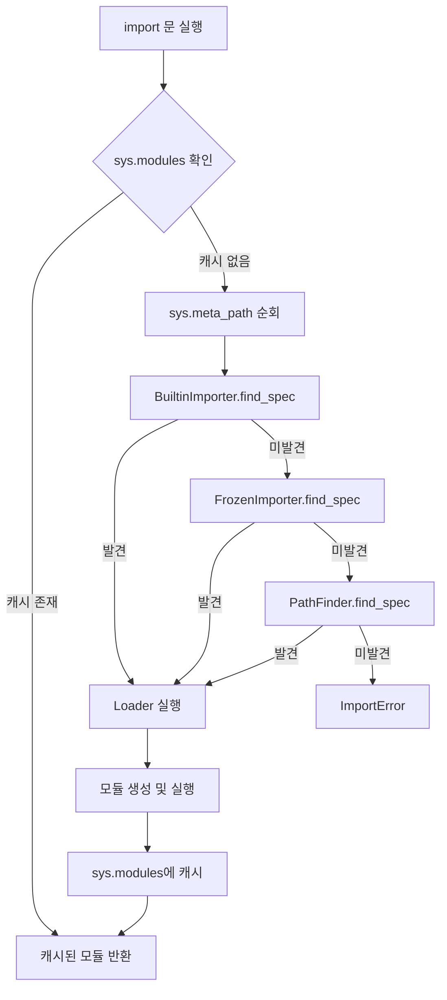

## Introduction

Python의 import 시스템은 모듈을 로드하고 관리하는 핵심 메커니즘입니다. 단순히 `import` 키워드를 사용하는 것을 넘어, Python이 어떻게 모듈을 찾고, 로드하고, 캐싱하는지 이해하면 더 효율적인 코드를 작성하고 복잡한 문제를 디버깅할 수 있습니다.

<div class="post-summary-box" markdown="1">

### 📌 이 글에서 다루는 내용

#### 🔍 핵심 주제

- **Import 메커니즘**: Python이 모듈을 찾고 로드하는 전체 과정
- **sys.modules와 캐싱**: 모듈 캐시 시스템의 동작 원리
- **importlib 심화**: Python의 import 구현 내부 살펴보기
- **Meta Path Finder**: 커스텀 import 훅 구현하기

#### 🎯 주요 내용

1. **Import 기초**

   - import vs from import 차이점
   - 절대 경로 vs 상대 경로 import
   - `__init__.py`의 역할과 패키지 구조

2. **Import 내부 동작**

   - sys.path와 모듈 검색 경로
   - sys.modules 캐시 메커니즘
   - import 프로세스의 5단계

3. **고급 Import 기법**

   - importlib 모듈 활용
   - 동적 import (\_\_import\_\_, importlib.import_module)
   - Lazy import로 시작 시간 최적화
   - Meta path finder 커스터마이징

4. **실전 활용**
   - 순환 import 문제 해결
   - 플러그인 시스템 구현
   - Import hook을 활용한 자동 reload

#### 💡 이런 분들께 추천

- Python 모듈 시스템을 깊이 이해하고 싶은 개발자
- Import 관련 오류를 자주 겪는 분
- 플러그인 아키텍처를 설계하는 엔지니어
- Python 패키지 개발자

</div>

## Import 기초 이해

### import vs from import

Python에서 모듈을 가져오는 두 가지 주요 방법이 있습니다:

```python
# 방법 1: import 문
import math
print(math.pi)  # 3.141592653589793

# 방법 2: from import 문
from math import pi
print(pi)  # 3.141592653589793

# 방법 3: 별칭 사용
import numpy as np
from collections import Counter as C
```

**차이점:**

- `import module`: 모듈 전체를 가져오고, 모듈 이름으로 접근
- `from module import name`: 모듈에서 특정 객체만 가져와 직접 접근
- 네임스페이스 관리 측면에서 `import module`이 더 명확함

### 절대 경로 vs 상대 경로 Import

```python
# 절대 경로 import (권장)
from mypackage.subpackage import module
from mypackage.utils import helper

# 상대 경로 import (패키지 내부에서만 사용)
from . import sibling_module       # 같은 디렉토리
from .. import parent_module       # 부모 디렉토리
from ..sibling import cousin       # 부모의 다른 자식
```

**프로젝트 구조 예시:**

```
mypackage/
├── __init__.py
├── module_a.py
├── module_b.py
└── subpackage/
    ├── __init__.py
    ├── module_c.py
    └── module_d.py
```

```python
# mypackage/subpackage/module_c.py
from .. import module_a           # 상대 경로
from mypackage import module_b    # 절대 경로 (권장)
```

### `__init__.py`의 역할

`__init__.py` 파일은 디렉토리를 Python 패키지로 만듭니다:

```python
# mypackage/__init__.py

# 패키지 초기화 코드
print("mypackage 로드됨")

# 하위 모듈을 패키지 레벨로 노출
from .module_a import ClassA
from .module_b import function_b

# __all__로 "from package import *" 제어
__all__ = ['ClassA', 'function_b']

# 패키지 메타데이터
__version__ = '1.0.0'
__author__ = 'Your Name'
```

**Python 3.3+ Namespace Packages:**

Python 3.3부터는 `__init__.py` 없이도 패키지 생성 가능 (PEP 420):

```
namespace_package/
├── subpackage_a/
│   └── module.py
└── subpackage_b/
    └── module.py
```

## Import 내부 동작 메커니즘

### sys.path와 모듈 검색

Python은 `sys.path`에 정의된 경로에서 모듈을 검색합니다:

```python
import sys

# sys.path 확인
for path in sys.path:
    print(path)

# 출력 예시:
# /current/working/directory
# /usr/lib/python3.11
# /usr/lib/python3.11/site-packages
# ...
```

**sys.path 순서:**

1. 현재 실행 중인 스크립트의 디렉토리
2. `PYTHONPATH` 환경 변수
3. 표준 라이브러리 디렉토리
4. site-packages 디렉토리 (pip로 설치한 패키지)

**동적으로 경로 추가:**

```python
import sys
import os

# 프로젝트 루트를 sys.path에 추가
project_root = os.path.dirname(os.path.abspath(__file__))
if project_root not in sys.path:
    sys.path.insert(0, project_root)

# 이제 프로젝트 루트 기준으로 import 가능
from mypackage import module
```

### sys.modules 캐시 시스템

Python은 한 번 로드된 모듈을 `sys.modules`에 캐싱합니다:

```python
import sys

# 모듈 import
import math

# sys.modules에서 확인
print('math' in sys.modules)  # True
print(sys.modules['math'])    # <module 'math' ...>

# 같은 모듈을 다시 import해도 캐시에서 가져옴
import math  # 실제로 다시 로드되지 않음
```

**캐시 제어:**

```python
import sys
import importlib

# 모듈 언로드
if 'mymodule' in sys.modules:
    del sys.modules['mymodule']

# 모듈 reload
import mymodule
importlib.reload(mymodule)  # 코드 변경 후 다시 로드

# 주의: reload는 이미 import된 객체에 영향 없음
from mymodule import MyClass
# mymodule을 reload해도 이미 가져온 MyClass는 변경 안 됨
```

### Import 프로세스 5단계

Python이 `import mypackage.module`을 실행할 때:

1. **Cache Check**: `sys.modules`에서 모듈 확인
2. **Find Module**: Finder로 모듈 위치 찾기
3. **Create Module**: 모듈 객체 생성
4. **Execute Module**: 모듈 코드 실행
5. **Cache Module**: `sys.modules`에 저장

```python
import sys
import importlib.util

def manual_import(module_name, file_path):
    """수동으로 모듈 import 과정 구현"""

    # 1. Cache check
    if module_name in sys.modules:
        return sys.modules[module_name]

    # 2-3. Find and create module
    spec = importlib.util.spec_from_file_location(module_name, file_path)
    module = importlib.util.module_from_spec(spec)

    # 4. Cache module (실행 전에 캐시하여 순환 import 방지)
    sys.modules[module_name] = module

    # 5. Execute module
    spec.loader.exec_module(module)

    return module

# 사용 예시
my_module = manual_import('my_module', '/path/to/my_module.py')
```

## sys.meta_path와 Import Hook 시스템

### sys.meta_path의 구조

`sys.meta_path`는 Python이 모듈을 찾을 때 사용하는 finder 객체들의 리스트입니다. Import 문이 실행되면 Python은 이 리스트를 순회하면서 모듈을 찾습니다.

```python
import sys

# 기본 meta_path 확인
for finder in sys.meta_path:
    print(f"{finder.__class__.__name__}: {finder}")

# 출력 예시:
# BuiltinImporter: <class '_frozen_importlib.BuiltinImporter'>
# FrozenImporter: <class '_frozen_importlib.FrozenImporter'>
# PathFinder: <class '_frozen_importlib_external.PathFinder'>
```

**기본 Finder들의 역할:**

1. **BuiltinImporter**: 내장 모듈(sys, builtins 등) 처리
2. **FrozenImporter**: 동결(frozen) 모듈 처리
3. **PathFinder**: sys.path 기반 파일 시스템 모듈 검색

**Import 검색 순서:**



### importlib 모듈 완전 분석

#### importlib 주요 컴포넌트

```python
import importlib
import importlib.util
import importlib.abc
import importlib.machinery

# 1. importlib.import_module - 동적 import
module = importlib.import_module('json')

# 2. importlib.util - 유틸리티 함수들
spec = importlib.util.find_spec('os')
print(f"모듈 이름: {spec.name}")
print(f"위치: {spec.origin}")
print(f"Loader: {spec.loader}")

# 3. importlib.abc - Abstract Base Classes
# MetaPathFinder, Loader 등의 추상 클래스 제공

# 4. importlib.machinery - Low-level 구현체
# SourceFileLoader, ExtensionFileLoader 등
```

#### ModuleSpec 객체 상세

ModuleSpec은 모듈의 메타데이터를 담고 있는 핵심 객체입니다:

```python
import importlib.util

# ModuleSpec 생성 방법들
spec1 = importlib.util.find_spec('json')  # 표준 라이브러리
spec2 = importlib.util.spec_from_file_location(
    'mymodule',
    '/path/to/mymodule.py'
)

# ModuleSpec 속성들
print(f"이름: {spec1.name}")           # 'json'
print(f"로더: {spec1.loader}")         # SourceFileLoader
print(f"위치: {spec1.origin}")         # /usr/lib/python3.11/json/__init__.py
print(f"서브모듈: {spec1.submodule_search_locations}")  # ['/usr/lib/python3.11/json']
print(f"캐시: {spec1.cached}")         # __pycache__ 경로
print(f"부모: {spec1.parent}")         # 패키지의 경우 부모 패키지명
```

#### 동적 Import 고급 기법

```python
import importlib.util
import sys

# 방법 1: importlib.import_module (간단)
def simple_dynamic_import(module_name):
    """간단한 동적 import"""
    return importlib.import_module(module_name)

# 방법 2: spec 기반 (세밀한 제어)
def advanced_dynamic_import(module_name, file_path):
    """파일 경로로부터 모듈 로드"""
    spec = importlib.util.spec_from_file_location(module_name, file_path)

    if spec is None:
        raise ImportError(f"Cannot load {module_name} from {file_path}")

    module = importlib.util.module_from_spec(spec)

    # 실행 전에 sys.modules에 추가 (순환 import 방지)
    sys.modules[module_name] = module

    try:
        spec.loader.exec_module(module)
    except Exception as e:
        # 실패 시 캐시에서 제거
        del sys.modules[module_name]
        raise

    return module

# 방법 3: 소스 코드로부터 직접 로드
def import_from_source(module_name, source_code):
    """소스 코드 문자열로부터 모듈 생성"""
    import types

    module = types.ModuleType(module_name)
    module.__file__ = f"<{module_name}>"

    # 소스 코드 실행
    exec(source_code, module.__dict__)

    sys.modules[module_name] = module
    return module

# 사용 예시
source = """
def hello():
    return "Hello from dynamic module!"

class DynamicClass:
    value = 42
"""

dynamic_mod = import_from_source('dynamic_module', source)
print(dynamic_mod.hello())  # "Hello from dynamic module!"
print(dynamic_mod.DynamicClass.value)  # 42
```

#### 플러그인 시스템 고급 구현

```python
import importlib.util
import importlib.abc
import sys
from pathlib import Path
from typing import Dict, Any, Type

class PluginRegistry:
    """플러그인 등록 및 관리 시스템"""

    def __init__(self):
        self.plugins: Dict[str, Any] = {}
        self._plugin_base_class = None

    def set_base_class(self, base_class: Type):
        """플러그인이 상속해야 할 기본 클래스 지정"""
        self._plugin_base_class = base_class

    def discover_plugins(self, plugin_dir: str):
        """플러그인 디렉토리 탐색 및 로드"""
        plugin_path = Path(plugin_dir)

        if not plugin_path.exists():
            raise ValueError(f"Plugin directory not found: {plugin_dir}")

        for file_path in plugin_path.glob('*.py'):
            if file_path.stem.startswith('_'):
                continue

            module_name = f"plugins.{file_path.stem}"
            self._load_plugin(module_name, str(file_path))

    def _load_plugin(self, module_name: str, file_path: str):
        """개별 플러그인 로드"""
        spec = importlib.util.spec_from_file_location(module_name, file_path)

        if spec is None or spec.loader is None:
            print(f"Warning: Cannot load {module_name}")
            return

        module = importlib.util.module_from_spec(spec)
        sys.modules[module_name] = module
        spec.loader.exec_module(module)

        # 플러그인 클래스 찾기
        for attr_name in dir(module):
            attr = getattr(module, attr_name)

            if (isinstance(attr, type) and
                self._plugin_base_class and
                issubclass(attr, self._plugin_base_class) and
                attr is not self._plugin_base_class):

                # 플러그인 등록
                plugin_instance = attr()
                self.plugins[attr_name] = plugin_instance
                print(f"Loaded plugin: {attr_name}")

    def get_plugin(self, name: str):
        """플러그인 가져오기"""
        return self.plugins.get(name)

    def execute_all(self, method_name: str, *args, **kwargs):
        """모든 플러그인의 특정 메서드 실행"""
        results = {}
        for name, plugin in self.plugins.items():
            if hasattr(plugin, method_name):
                results[name] = getattr(plugin, method_name)(*args, **kwargs)
        return results

# 사용 예시
class PluginBase:
    """플러그인 기본 클래스"""
    def process(self, data):
        raise NotImplementedError

# 플러그인 등록 및 사용
registry = PluginRegistry()
registry.set_base_class(PluginBase)
registry.discover_plugins('./plugins')

# 모든 플러그인 실행
results = registry.execute_all('process', data={'input': 'test'})
```

### Lazy Import 최적화 완전 가이드

#### 왜 Lazy Import인가?

```python
import time

# 문제: 무거운 모듈들을 모두 미리 로드
start = time.time()
import pandas as pd
import numpy as np
import matplotlib.pyplot as plt
import tensorflow as tf
print(f"Import 시간: {time.time() - start:.2f}초")  # 5-10초 소요

# 해결: 실제 사용 시점에만 로드
# 애플리케이션 시작 시간: 0.1초
```

**Lazy Import 효과 측정:**

```python
import time
import sys

def measure_import_time(module_name):
    """모듈 import 시간 측정"""
    # 캐시 제거
    if module_name in sys.modules:
        del sys.modules[module_name]

    start = time.time()
    __import__(module_name)
    elapsed = time.time() - start

    return elapsed

# 무거운 모듈들의 import 시간 측정
heavy_modules = ['pandas', 'numpy', 'matplotlib', 'scipy']
for module in heavy_modules:
    try:
        elapsed = measure_import_time(module)
        print(f"{module}: {elapsed:.3f}초")
    except ImportError:
        print(f"{module}: 설치되지 않음")
```

#### Lazy Import 구현 방법 비교

```python
# 방법 1: 함수 내부 import (가장 간단)
def process_with_pandas(data):
    import pandas as pd  # 함수 호출 시에만 로드
    return pd.DataFrame(data)

# 방법 2: __getattr__ 활용 (모듈 레벨)
# mymodule.py
def __getattr__(name):
    if name == 'pd':
        import pandas
        globals()['pd'] = pandas
        return pandas
    raise AttributeError(f"module has no attribute '{name}'")

# 방법 3: LazyLoader 활용
import importlib.util
import sys

def lazy_import_v1(module_name):
    """LazyLoader를 사용한 lazy import"""
    spec = importlib.util.find_spec(module_name)
    loader = importlib.util.LazyLoader(spec.loader)
    spec.loader = loader
    module = importlib.util.module_from_spec(spec)
    sys.modules[module_name] = module
    loader.exec_module(module)
    return module

# 사용
pandas = lazy_import_v1('pandas')
# 이 시점에서는 pandas가 로드되지 않음
df = pandas.DataFrame([1, 2, 3])  # 여기서 실제 로드됨
```

#### 프로덕션급 Lazy Import 구현

```python
import importlib
import sys
from typing import Any, Optional
import threading

class LazyImporter:
    """Thread-safe lazy import 구현"""

    def __init__(self, module_name: str):
        self._module_name = module_name
        self._module: Optional[Any] = None
        self._lock = threading.Lock()

    def _load(self):
        """실제 모듈 로드 (thread-safe)"""
        if self._module is not None:
            return

        with self._lock:
            # Double-check locking pattern
            if self._module is not None:
                return

            print(f"Loading {self._module_name}...")
            self._module = importlib.import_module(self._module_name)

    def __getattr__(self, name: str):
        """속성 접근 시 모듈 로드"""
        self._load()
        return getattr(self._module, name)

    def __dir__(self):
        """dir() 지원"""
        self._load()
        return dir(self._module)

    def __repr__(self):
        if self._module is None:
            return f"<LazyImporter for '{self._module_name}' (not loaded)>"
        return f"<LazyImporter for '{self._module_name}' (loaded)>"

# 사용 예시
pd = LazyImporter('pandas')
np = LazyImporter('numpy')

print(pd)  # <LazyImporter for 'pandas' (not loaded)>

# 실제 사용 시에만 로드됨
df = pd.DataFrame([1, 2, 3])  # 이때 pandas 로드
print(pd)  # <LazyImporter for 'pandas' (loaded)>
```

#### Lazy Import를 위한 데코레이터

```python
import functools
import importlib

def lazy_import_decorator(*module_names):
    """함수 실행 전에 필요한 모듈을 lazy import하는 데코레이터"""
    def decorator(func):
        @functools.wraps(func)
        def wrapper(*args, **kwargs):
            # 필요한 모듈들 import
            modules = {}
            for name in module_names:
                if name not in func.__globals__:
                    modules[name] = importlib.import_module(name)
                    func.__globals__[name] = modules[name]

            return func(*args, **kwargs)
        return wrapper
    return decorator

# 사용 예시
@lazy_import_decorator('pandas', 'numpy')
def analyze_data(data):
    # pandas와 numpy는 이 함수 호출 시 자동 import됨
    import pandas as pd  # type hint를 위해 여전히 필요
    import numpy as np

    df = pd.DataFrame(data)
    return np.mean(df.values)

# 함수 호출 시에만 pandas, numpy 로드
result = analyze_data([[1, 2], [3, 4]])
```

#### 애플리케이션 시작 시간 최적화 실전

```python
import time
import sys

class StartupOptimizer:
    """애플리케이션 시작 시간 최적화"""

    def __init__(self):
        self.import_times = {}
        self.lazy_modules = {}

    def profile_imports(self):
        """현재 import된 모듈들의 로딩 시간 프로파일"""
        import importlib.util

        print("=== Import Time Profile ===")
        for module_name in sorted(sys.modules.keys()):
            if module_name.startswith('_'):
                continue

            # 모듈 크기 추정
            module = sys.modules[module_name]
            if hasattr(module, '__file__') and module.__file__:
                size = len(dir(module))
                print(f"{module_name}: {size} attributes")

    def suggest_lazy_imports(self, threshold: int = 50):
        """Lazy import로 전환할 모듈 제안"""
        print(f"\n=== Lazy Import 권장 모듈 (속성 {threshold}개 이상) ===")

        candidates = []
        for module_name, module in sys.modules.items():
            if module_name.startswith('_'):
                continue

            if hasattr(module, '__file__') and module.__file__:
                attr_count = len(dir(module))
                if attr_count > threshold:
                    candidates.append((module_name, attr_count))

        for name, count in sorted(candidates, key=lambda x: x[1], reverse=True):
            print(f"  - {name}: {count} attributes")

        return candidates

    def create_lazy_module(self, module_name: str):
        """특정 모듈을 lazy import로 전환"""
        self.lazy_modules[module_name] = LazyImporter(module_name)
        return self.lazy_modules[module_name]

# 사용 예시
optimizer = StartupOptimizer()

# 시작 시간 측정
start = time.time()

# 필요한 모듈만 즉시 로드
import sys
import os

# 무거운 모듈은 lazy import
pd = optimizer.create_lazy_module('pandas')
np = optimizer.create_lazy_module('numpy')

startup_time = time.time() - start
print(f"Startup time: {startup_time:.3f}초")

# 나중에 실제 사용 시 로드
# df = pd.DataFrame(...)
```

## 고급 Import 기법

### Meta Path Finder 커스터마이징

Import 메커니즘을 확장하여 커스텀 로딩 로직 구현:

```python
import sys
import importlib.abc
import importlib.machinery

class CustomFinder(importlib.abc.MetaPathFinder):
    """커스텀 import finder"""

    def find_spec(self, fullname, path, target=None):
        if fullname.startswith('custom_'):
            # 커스텀 prefix를 가진 모듈만 처리
            print(f"CustomFinder: {fullname} 찾는 중...")
            # 실제 파일 경로 반환
            return importlib.machinery.ModuleSpec(
                fullname,
                CustomLoader(),
                origin='custom'
            )
        return None

class CustomLoader(importlib.abc.Loader):
    """커스텀 import loader"""

    def create_module(self, spec):
        return None  # 기본 모듈 생성 사용

    def exec_module(self, module):
        # 모듈 코드 실행
        print(f"CustomLoader: {module.__name__} 로딩 중...")
        module.custom_attribute = "This is a custom module"

# Finder 등록
sys.meta_path.insert(0, CustomFinder())

# 사용
import custom_module  # CustomFinder가 처리
print(custom_module.custom_attribute)
```

### Import Hook으로 자동 Reload

개발 중 코드 변경 시 자동으로 모듈 reload:

```python
import sys
import importlib
from importlib.abc import MetaPathFinder
from importlib.machinery import ModuleSpec

class AutoReloadFinder(MetaPathFinder):
    """변경 감지 시 자동 reload하는 finder"""

    def __init__(self):
        self.mtimes = {}

    def find_spec(self, fullname, path, target=None):
        # 기본 finder로 모듈 찾기
        spec = None
        for finder in sys.meta_path[1:]:  # 자신은 제외
            if hasattr(finder, 'find_spec'):
                spec = finder.find_spec(fullname, path, target)
                if spec:
                    break

        if spec and spec.origin:
            # 파일 수정 시간 확인
            import os
            mtime = os.path.getmtime(spec.origin)

            if fullname in self.mtimes:
                if mtime > self.mtimes[fullname]:
                    print(f"Reloading {fullname}...")
                    if fullname in sys.modules:
                        importlib.reload(sys.modules[fullname])

            self.mtimes[fullname] = mtime

        return spec

# 개발 모드에서만 활성화
if __debug__:
    sys.meta_path.insert(0, AutoReloadFinder())
```

## 실습: 모듈 로더 커스터마이징

### 실습 1: JSON 설정 파일 기반 모듈 로더

JSON 파일에서 설정을 읽어와 모듈을 동적으로 생성하는 로더를 만들어봅시다.

```python
import importlib.abc
import importlib.machinery
import sys
import json
from pathlib import Path

class JSONConfigLoader(importlib.abc.Loader):
    """JSON 설정 파일을 Python 모듈로 로드하는 커스텀 로더"""

    def __init__(self, fullname, path):
        self.fullname = fullname
        self.path = path

    def create_module(self, spec):
        """모듈 객체 생성"""
        return None  # 기본 모듈 생성 사용

    def exec_module(self, module):
        """모듈 실행 - JSON 파일을 읽어 모듈 속성으로 설정"""
        with open(self.path, 'r', encoding='utf-8') as f:
            config_data = json.load(f)

        # JSON 데이터를 모듈 속성으로 추가
        for key, value in config_data.items():
            setattr(module, key, value)

        # 메타데이터 추가
        module.__file__ = self.path
        module.__loader__ = self

class JSONConfigFinder(importlib.abc.MetaPathFinder):
    """JSON 설정 파일을 찾는 커스텀 finder"""

    def __init__(self, search_paths):
        self.search_paths = search_paths

    def find_spec(self, fullname, path, target=None):
        """모듈 검색"""
        # 'config.'로 시작하는 모듈만 처리
        if not fullname.startswith('config.'):
            return None

        # 실제 파일명 생성 (config.database -> database.json)
        module_name = fullname.split('.')[-1]
        json_filename = f"{module_name}.json"

        # 검색 경로에서 파일 찾기
        for search_path in self.search_paths:
            json_path = Path(search_path) / json_filename

            if json_path.exists():
                loader = JSONConfigLoader(fullname, str(json_path))
                return importlib.machinery.ModuleSpec(
                    fullname,
                    loader,
                    origin=str(json_path)
                )

        return None

# 실습: JSON 파일 생성 및 사용
if __name__ == '__main__':
    # 1. 설정 파일 생성
    config_dir = Path('./config_files')
    config_dir.mkdir(exist_ok=True)

    database_config = {
        'host': 'localhost',
        'port': 5432,
        'database': 'myapp',
        'username': 'admin',
        'connection_pool_size': 10
    }

    with open(config_dir / 'database.json', 'w') as f:
        json.dump(database_config, f, indent=2)

    # 2. Finder 등록
    finder = JSONConfigFinder(['./config_files'])
    sys.meta_path.insert(0, finder)

    # 3. JSON 파일을 모듈처럼 import
    import config.database

    print(f"Database Host: {config.database.host}")
    print(f"Database Port: {config.database.port}")
    print(f"Connection Pool: {config.database.connection_pool_size}")

    # 4. 모듈 정보 확인
    print(f"\nModule name: {config.database.__name__}")
    print(f"Module file: {config.database.__file__}")
```

### 실습 2: 암호화된 모듈 로더

암호화된 Python 소스 코드를 복호화하여 로드하는 보안 로더를 구현합니다.

```python
import importlib.abc
import importlib.machinery
import sys
from pathlib import Path
import base64

class EncryptedModuleLoader(importlib.abc.SourceLoader):
    """암호화된 Python 파일을 로드하는 커스텀 로더"""

    def __init__(self, fullname, path, encryption_key):
        self.fullname = fullname
        self.path = path
        self.encryption_key = encryption_key

    def get_filename(self, fullname):
        """모듈 파일 경로 반환"""
        return self.path

    def get_data(self, path):
        """파일 데이터 읽기"""
        with open(path, 'rb') as f:
            return f.read()

    def exec_module(self, module):
        """암호화된 모듈 실행"""
        # 암호화된 데이터 읽기
        encrypted_data = self.get_data(self.path)

        # 복호화 (간단한 XOR 예시, 실제로는 더 강력한 암호화 사용)
        decrypted_code = self._decrypt(encrypted_data)

        # 복호화된 코드 실행
        code = compile(decrypted_code, self.path, 'exec')
        module.__file__ = self.path
        module.__loader__ = self
        exec(code, module.__dict__)

    def _decrypt(self, data):
        """XOR 기반 간단한 복호화"""
        key_bytes = self.encryption_key.encode('utf-8')
        decrypted = bytearray()

        for i, byte in enumerate(data):
            decrypted.append(byte ^ key_bytes[i % len(key_bytes)])

        return decrypted.decode('utf-8')

    def _encrypt(self, source_code):
        """암호화 (유틸리티 메서드)"""
        key_bytes = self.encryption_key.encode('utf-8')
        encrypted = bytearray()

        for i, char in enumerate(source_code.encode('utf-8')):
            encrypted.append(char ^ key_bytes[i % len(key_bytes)])

        return bytes(encrypted)

class EncryptedModuleFinder(importlib.abc.MetaPathFinder):
    """암호화된 모듈을 찾는 커스텀 finder"""

    def __init__(self, search_path, encryption_key):
        self.search_path = Path(search_path)
        self.encryption_key = encryption_key

    def find_spec(self, fullname, path, target=None):
        """암호화된 모듈 검색"""
        if not fullname.startswith('secure_'):
            return None

        # secure_mymodule -> mymodule.pye (encrypted python)
        module_name = fullname.replace('secure_', '')
        encrypted_file = self.search_path / f"{module_name}.pye"

        if encrypted_file.exists():
            loader = EncryptedModuleLoader(
                fullname,
                str(encrypted_file),
                self.encryption_key
            )
            return importlib.machinery.ModuleSpec(
                fullname,
                loader,
                origin=str(encrypted_file)
            )

        return None

# 실습: 암호화된 모듈 생성 및 로드
if __name__ == '__main__':
    # 1. 암호화할 소스 코드
    secret_code = """
SECRET_API_KEY = "super-secret-key-12345"
SECRET_TOKEN = "confidential-token-xyz"

def get_secret():
    return f"API Key: {SECRET_API_KEY}"

class SecureConfig:
    def __init__(self):
        self.api_key = SECRET_API_KEY
        self.token = SECRET_TOKEN
"""

    # 2. 암호화 및 저장
    secure_dir = Path('./secure_modules')
    secure_dir.mkdir(exist_ok=True)

    encryption_key = "my-encryption-key"
    loader_temp = EncryptedModuleLoader('temp', 'temp', encryption_key)
    encrypted_data = loader_temp._encrypt(secret_code)

    with open(secure_dir / 'secrets.pye', 'wb') as f:
        f.write(encrypted_data)

    print("암호화된 파일 생성 완료")

    # 3. Finder 등록
    finder = EncryptedModuleFinder('./secure_modules', encryption_key)
    sys.meta_path.insert(0, finder)

    # 4. 암호화된 모듈 import
    import secure_secrets

    print(f"\nSecret: {secure_secrets.get_secret()}")
    config = secure_secrets.SecureConfig()
    print(f"Token: {config.token}")
```

### 실습 3: HTTP 기반 원격 모듈 로더

HTTP를 통해 원격 서버에서 모듈을 동적으로 로드하는 로더를 구현합니다.

```python
import importlib.abc
import importlib.machinery
import sys
import urllib.request
import hashlib
from pathlib import Path

class RemoteModuleLoader(importlib.abc.SourceLoader):
    """HTTP로 원격 모듈을 로드하는 커스텀 로더"""

    def __init__(self, fullname, url, cache_dir):
        self.fullname = fullname
        self.url = url
        self.cache_dir = Path(cache_dir)
        self.cache_dir.mkdir(exist_ok=True)

    def get_filename(self, fullname):
        """캐시된 파일 경로"""
        cache_file = self._get_cache_path()
        return str(cache_file)

    def get_data(self, path):
        """데이터 읽기 (캐시 또는 다운로드)"""
        cache_file = self._get_cache_path()

        # 캐시 확인
        if cache_file.exists():
            print(f"Loading from cache: {cache_file}")
            with open(cache_file, 'rb') as f:
                return f.read()

        # 원격에서 다운로드
        print(f"Downloading from: {self.url}")
        with urllib.request.urlopen(self.url) as response:
            data = response.read()

        # 캐시 저장
        with open(cache_file, 'wb') as f:
            f.write(data)

        return data

    def exec_module(self, module):
        """모듈 실행"""
        source_bytes = self.get_data(self.get_filename(self.fullname))
        source_code = source_bytes.decode('utf-8')

        code = compile(source_code, self.url, 'exec')
        module.__file__ = self.url
        module.__loader__ = self
        module.__cached__ = str(self._get_cache_path())

        exec(code, module.__dict__)

    def _get_cache_path(self):
        """캐시 파일 경로 생성"""
        # URL을 해시하여 파일명 생성
        url_hash = hashlib.md5(self.url.encode()).hexdigest()
        return self.cache_dir / f"{self.fullname}_{url_hash}.py"

class RemoteModuleFinder(importlib.abc.MetaPathFinder):
    """원격 모듈을 찾는 커스텀 finder"""

    def __init__(self, base_url, cache_dir='./remote_cache'):
        self.base_url = base_url.rstrip('/')
        self.cache_dir = cache_dir

    def find_spec(self, fullname, path, target=None):
        """원격 모듈 검색"""
        if not fullname.startswith('remote_'):
            return None

        # remote_utils -> utils.py
        module_name = fullname.replace('remote_', '')
        url = f"{self.base_url}/{module_name}.py"

        loader = RemoteModuleLoader(fullname, url, self.cache_dir)

        return importlib.machinery.ModuleSpec(
            fullname,
            loader,
            origin=url
        )

# 실습: 로컬 HTTP 서버에서 모듈 로드
if __name__ == '__main__':
    # 1. 테스트용 모듈 파일 생성 (실제로는 원격 서버에 배치)
    remote_modules_dir = Path('./remote_modules_server')
    remote_modules_dir.mkdir(exist_ok=True)

    utils_code = """
def format_number(n):
    return f"{n:,}"

def calculate_tax(amount, rate=0.1):
    return amount * rate

class MathUtils:
    @staticmethod
    def fibonacci(n):
        if n <= 1:
            return n
        return MathUtils.fibonacci(n-1) + MathUtils.fibonacci(n-2)
"""

    with open(remote_modules_dir / 'utils.py', 'w') as f:
        f.write(utils_code)

    # 2. 간단한 HTTP 서버 시뮬레이션 (file:// 프로토콜 사용)
    import os
    base_url = f"file://{os.path.abspath(remote_modules_dir)}"

    # 3. Finder 등록
    finder = RemoteModuleFinder(base_url)
    sys.meta_path.insert(0, finder)

    # 4. 원격 모듈 import
    import remote_utils

    print(f"\nFormatted number: {remote_utils.format_number(1234567)}")
    print(f"Tax: ${remote_utils.calculate_tax(100)}")
    print(f"Fibonacci(10): {remote_utils.MathUtils.fibonacci(10)}")

    # 5. 캐시 확인
    print(f"\nCached file: {remote_utils.__cached__}")
```

### 실습 4: 버전 관리가 있는 모듈 로더

여러 버전의 모듈을 동시에 로드하고 사용할 수 있는 버전 관리 시스템을 구현합니다.

```python
import importlib.abc
import importlib.machinery
import sys
from pathlib import Path
from typing import Dict

class VersionedModuleLoader(importlib.abc.SourceLoader):
    """버전별 모듈을 로드하는 로더"""

    def __init__(self, fullname, version, path):
        self.fullname = fullname
        self.version = version
        self.path = path

    def get_filename(self, fullname):
        return self.path

    def get_data(self, path):
        with open(path, 'rb') as f:
            return f.read()

    def exec_module(self, module):
        source_bytes = self.get_data(self.path)
        source_code = source_bytes.decode('utf-8')

        code = compile(source_code, self.path, 'exec')
        module.__file__ = self.path
        module.__loader__ = self
        module.__version__ = self.version

        exec(code, module.__dict__)

class VersionedModuleFinder(importlib.abc.MetaPathFinder):
    """버전별 모듈을 찾는 finder"""

    def __init__(self, versions_root):
        self.versions_root = Path(versions_root)

    def find_spec(self, fullname, path, target=None):
        """
        모듈명 형식: mylib_v1_2_3
        실제 파일: versions/mylib/1.2.3/mylib.py
        """
        parts = fullname.split('_v')
        if len(parts) != 2:
            return None

        module_name = parts[0]
        version = parts[1].replace('_', '.')

        # 버전별 디렉토리에서 모듈 찾기
        module_path = (
            self.versions_root /
            module_name /
            version /
            f"{module_name}.py"
        )

        if module_path.exists():
            loader = VersionedModuleLoader(fullname, version, str(module_path))
            return importlib.machinery.ModuleSpec(
                fullname,
                loader,
                origin=str(module_path)
            )

        return None

# 실습: 여러 버전의 모듈 생성 및 로드
if __name__ == '__main__':
    # 1. 버전별 모듈 생성
    versions_dir = Path('./module_versions')

    # 버전 1.0.0
    v1_dir = versions_dir / 'calculator' / '1.0.0'
    v1_dir.mkdir(parents=True, exist_ok=True)

    with open(v1_dir / 'calculator.py', 'w') as f:
        f.write("""
def add(a, b):
    return a + b

VERSION_INFO = "Basic calculator v1.0.0"
""")

    # 버전 2.0.0
    v2_dir = versions_dir / 'calculator' / '2.0.0'
    v2_dir.mkdir(parents=True, exist_ok=True)

    with open(v2_dir / 'calculator.py', 'w') as f:
        f.write("""
def add(a, b):
    return a + b

def multiply(a, b):
    return a * b

def power(a, b):
    return a ** b

VERSION_INFO = "Enhanced calculator v2.0.0"
""")

    # 2. Finder 등록
    finder = VersionedModuleFinder('./module_versions')
    sys.meta_path.insert(0, finder)

    # 3. 여러 버전 동시 사용
    import calculator_v1_0_0 as calc_v1
    import calculator_v2_0_0 as calc_v2

    print(f"V1 Info: {calc_v1.VERSION_INFO}")
    print(f"V1 add(5, 3): {calc_v1.add(5, 3)}")

    print(f"\nV2 Info: {calc_v2.VERSION_INFO}")
    print(f"V2 add(5, 3): {calc_v2.add(5, 3)}")
    print(f"V2 multiply(5, 3): {calc_v2.multiply(5, 3)}")
    print(f"V2 power(5, 3): {calc_v2.power(5, 3)}")

    # 4. 버전 정보 확인
    print(f"\nV1 version: {calc_v1.__version__}")
    print(f"V2 version: {calc_v2.__version__}")
```

### 실습 요약 및 응용

위 실습들을 통해 배운 핵심 개념:

1. **JSONConfigLoader**: 비-Python 파일을 모듈로 변환

   - 응용: YAML, TOML, XML 설정 파일 로더
   - 실무: 설정 관리 시스템 구축

2. **EncryptedModuleLoader**: 소스 코드 보안

   - 응용: 라이선스 관리, 지적 재산 보호
   - 실무: 상용 Python 애플리케이션 배포

3. **RemoteModuleLoader**: 원격 코드 실행

   - 응용: 플러그인 마켓플레이스, 동적 업데이트
   - 실무: 클라우드 기반 모듈 배포

4. **VersionedModuleLoader**: 버전 관리
   - 응용: A/B 테스트, 점진적 마이그레이션
   - 실무: 레거시 시스템과 신규 시스템 공존

**종합 연습 과제:**

위 4가지 로더를 결합하여 다음 기능을 가진 통합 모듈 관리 시스템을 만들어보세요:

- 원격 서버에서 암호화된 모듈을 다운로드
- 버전별로 캐싱
- JSON 설정 파일로 로드 정책 관리
- 로그 및 보안 감사 기능

## 실전 문제 해결

### 순환 Import 문제

**문제 상황:**

```python
# module_a.py
from module_b import ClassB

class ClassA:
    def use_b(self):
        return ClassB()

# module_b.py
from module_a import ClassA  # 순환 import!

class ClassB:
    def use_a(self):
        return ClassA()
```

**해결 방법 1: 함수 내부 import**

```python
# module_b.py
class ClassB:
    def use_a(self):
        from module_a import ClassA  # 지연 import
        return ClassA()
```

**해결 방법 2: 구조 재설계**

```python
# base.py
class ClassA:
    pass

class ClassB:
    pass

# module_a.py
from base import ClassA, ClassB

# module_b.py
from base import ClassA, ClassB
```

### 조건부 Import

플랫폼이나 Python 버전에 따른 import:

```python
import sys

# Python 버전별 import
if sys.version_info >= (3, 11):
    from typing import Self
else:
    from typing_extensions import Self

# 플랫폼별 import
if sys.platform == 'win32':
    import msvcrt
elif sys.platform == 'darwin':
    import readline
else:
    import readline

# Optional dependency
try:
    import pandas as pd
    HAS_PANDAS = True
except ImportError:
    HAS_PANDAS = False

def analyze_data(data):
    if not HAS_PANDAS:
        raise RuntimeError("pandas가 필요합니다: pip install pandas")
    return pd.DataFrame(data)
```

## 핵심 포인트

- **Import는 단순한 문법이 아니라 복잡한 시스템**: 5단계 프로세스를 거침
- **sys.modules 캐싱**: 모듈은 한 번만 로드되고 캐시됨
- **sys.path**: 모듈 검색 경로를 동적으로 조정 가능
- **importlib**: 동적 import와 커스텀 로딩 로직 구현 가능
- **Lazy import**: 시작 시간을 단축하는 최적화 기법
- **Meta Path Finder**: Import 메커니즘을 확장하여 플러그인 시스템 구현 가능
- **순환 import**: 함수 내부 import 또는 구조 재설계로 해결

## 결론

Python의 import 시스템은 단순해 보이지만 내부적으로는 매우 정교한 메커니즘을 가지고 있습니다. 이 글에서는 import의 기초부터 고급 기법까지 다루었습니다.

**주요 학습 내용:**

1. **Import 기초**: import vs from import, 절대/상대 경로, `__init__.py`
2. **내부 동작**: sys.path, sys.modules 캐싱, 5단계 import 프로세스
3. **고급 기법**: importlib 활용, lazy import, meta path finder
4. **실전 해결**: 순환 import, 플러그인 시스템, 자동 reload

이러한 지식을 바탕으로:

- 복잡한 프로젝트 구조를 효율적으로 관리할 수 있습니다
- Import 관련 오류를 빠르게 해결할 수 있습니다
- 플러그인 아키텍처를 설계하고 구현할 수 있습니다
- 시작 시간을 최적화하여 애플리케이션 성능을 향상시킬 수 있습니다

### 이전 학습

이 글을 더 잘 이해하기 위해 먼저 읽어보세요:

- **[Python Bytecode](/2025/10/24/python-bytecode.html)** ← 이전 추천
  - Import된 모듈이 어떻게 바이트코드로 컴파일되고 실행되는지 이해하세요

### 다음 학습

이 글을 읽으셨다면 다음 주제로 넘어가보세요:

- Python 패키지 구조 설계 패턴
- Python Metaclass와 클래스 생성 메커니즘
- Python 플러그인 아키텍처 설계
- Python 디버깅 고급 기법

## 참고 자료

- [Python Documentation - Import System](https://docs.python.org/3/reference/import.html)
- [PEP 302 - New Import Hooks](https://www.python.org/dev/peps/pep-0302/)
- [PEP 420 - Namespace Packages](https://www.python.org/dev/peps/pep-0420/)
- [PEP 690 - Lazy Imports](https://www.python.org/dev/peps/pep-0690/)
- [importlib Documentation](https://docs.python.org/3/library/importlib.html)
- [Understanding Python's Import System - Real Python](https://realpython.com/python-import/)
