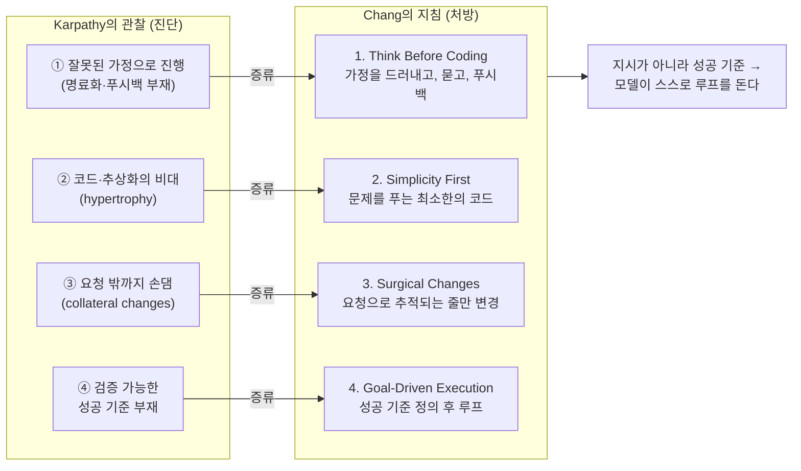

<figure class="post-figure post-figure--header">
<svg role="img" aria-label="LLM 코딩의 네 가지 실패 모드를 네 개의 함정으로, 그 위에 네 개의 가이드라인 표지판과 가드레일을 덮은 헤더 삽화 — 잘못된 가정·코드 비대·부수적 변경·성공 기준 부재의 함정 위에 Think Before Coding·Simplicity First·Surgical Changes·Goal-Driven Execution이 가드레일로 덮인다" viewBox="0 0 640 300" xmlns="http://www.w3.org/2000/svg">
  <title>네 가지 실패 모드(함정) 위에 덮인 네 가지 가이드라인(가드레일)</title>
  <!-- ground line -->
  <line x1="24" y1="208" x2="616" y2="208" stroke="currentColor" stroke-width="1.5" opacity="0.45"/>
  <!-- four pits in the ground = failure modes -->
  <g fill="var(--bg-panel)" stroke="var(--accent-color)" stroke-width="2.5">
    <path d="M58,208 L78,262 L122,262 L142,208 Z"/>
    <path d="M198,208 L218,262 L262,262 L282,208 Z"/>
    <path d="M358,208 L378,262 L422,262 L442,208 Z"/>
    <path d="M498,208 L518,262 L562,262 L582,208 Z"/>
  </g>
  <!-- pit hazard marks (the failure inside) -->
  <g fill="var(--accent-color)" font-size="20" text-anchor="middle" font-weight="700">
    <text x="100" y="252">?</text>
    <text x="240" y="252">↟</text>
    <text x="400" y="252">✶</text>
    <text x="540" y="252">∅</text>
  </g>
  <!-- pit labels (failure modes) -->
  <g fill="currentColor" font-size="11" text-anchor="middle" opacity="0.85">
    <text x="100" y="282">잘못된 가정</text>
    <text x="240" y="282">코드 비대</text>
    <text x="400" y="282">부수적 변경</text>
    <text x="540" y="282">성공 기준 부재</text>
  </g>
  <!-- four guardrail signposts over the pits = guidelines -->
  <g stroke="var(--gold)" stroke-width="3">
    <line x1="100" y1="208" x2="100" y2="150"/>
    <line x1="240" y1="208" x2="240" y2="150"/>
    <line x1="400" y1="208" x2="400" y2="150"/>
    <line x1="540" y1="208" x2="540" y2="150"/>
  </g>
  <!-- guardrail rail bridging every pit (protective cover) -->
  <path d="M60,150 L140,150 M200,150 L280,150 M360,150 L440,150 M500,150 L580,150"
        fill="none" stroke="var(--secondary-color)" stroke-width="4" stroke-linecap="round"/>
  <!-- signboard plates over each rail (the guideline) -->
  <g fill="var(--bg-panel)" stroke="var(--secondary-color)" stroke-width="2">
    <rect x="60" y="116" width="80" height="30" rx="3"/>
    <rect x="200" y="116" width="80" height="30" rx="3"/>
    <rect x="360" y="116" width="80" height="30" rx="3"/>
    <rect x="500" y="116" width="80" height="30" rx="3"/>
  </g>
  <g fill="currentColor" font-size="10.5" text-anchor="middle" font-weight="700">
    <text x="100" y="129">Think</text>
    <text x="100" y="141">Before</text>
    <text x="240" y="129">Simplicity</text>
    <text x="240" y="141">First</text>
    <text x="400" y="129">Surgical</text>
    <text x="400" y="141">Changes</text>
    <text x="540" y="129">Goal-Driven</text>
    <text x="540" y="141">Execution</text>
  </g>
  <!-- header caption strip -->
  <text x="320" y="36" text-anchor="middle" font-size="15" fill="currentColor" font-weight="700">관찰된 함정 위에, 덮어 두는 가드레일</text>
  <text x="320" y="58" text-anchor="middle" font-size="11.5" fill="currentColor" opacity="0.6">네 가지 실패 모드 → 네 가지 행동 지침</text>
</svg>
<figcaption>Karpathy가 관찰한 네 가지 실패 모드(잘못된 가정·코드 비대·부수적 변경·성공 기준 부재)는 땅에 파인 함정이고, Chang의 네 지침은 그 위에 상주시켜 덮어 두는 가드레일·표지판이다 — 이 글의 한 장.</figcaption>
</figure>

## 원문 정보

> - **제목**: A few random notes from claude coding quite a bit last few weeks (X 스레드) → *Behavioral Guidelines for LLM Coding* (스킬)
> - **원본 출처**: Andrej Karpathy (X, [@karpathy](https://x.com/karpathy/status/2015883857489522876))
> - **증류 스킬**: Forrest Chang, `multica-ai/andrej-karpathy-skills`의 `karpathy-guidelines/SKILL.md` ([github.com](https://github.com/multica-ai/andrej-karpathy-skills/blob/main/skills/karpathy-guidelines/SKILL.md))
> - **발행**: 원본 2026-01-26 · 약 5분 분량
> - **원문 링크**: <https://x.com/karpathy/status/2015883857489522876>

이 글은 두 단계의 자료를 한 묶음으로 읽는다. 먼저 Karpathy가 몇 주간 Claude로 코딩하며 **관찰한 실패 모드**가 있고, 그 위에 Forrest Chang이 그 관찰을 그대로 따라 **CLAUDE.md/스킬로 증류한 행동 지침**이 있다. 관찰이 진단이라면 스킬은 처방이다. LLM·코딩 에이전트를 실제로 다루는 실무 규율이라 Articles의 AI-Engineering에 담는다.

## 한 줄 요약 (TL;DR)

Karpathy는 LLM 코딩에서 **네 가지 실패 모드**를 관찰했고 — ① 검증 없이 잘못된 가정으로 진행, ② 코드·추상화의 비대(hypertrophy), ③ 요청하지 않은 곳까지 손대는 부수적 변경(collateral changes), ④ 검증 가능한 성공 기준의 부재 — Forrest Chang이 이를 **네 개의 행동 지침**(Think Before Coding / Simplicity First / Surgical Changes / Goal-Driven Execution)으로 증류했다. 핵심 통찰은 마지막에 있다. **"무엇을 하라고 지시하지 말고, 성공 기준을 주고 모델이 스스로 루프를 돌게 하라."**

## 왜 이 글을 골랐나

에이전트가 코드를 쏟아내기 시작하면서, 우리는 "더 좋은 프롬프트"를 찾는 데 매달려 왔다. 하지만 Karpathy의 관찰은 문제가 프롬프트의 표현력이 아니라 **에이전트의 기본 행동 성향**에 있음을 보여준다. 명료화하지 않고, 푸시백하지 않고, 트레이드오프를 제시하지 않으며, 묻지 않고 가정해 버리는 성향 말이다.

흥미로운 건 처방이 모두 **시니어 엔지니어가 후배에게 늘 하던 잔소리**라는 점이다. "코딩하기 전에 생각해라", "필요한 만큼만 짜라", "건드리지 않아도 될 건 건드리지 마라", "성공 기준부터 정하고 시작해라." LLM은 인간 코드 위에서 훈련됐으니 인간의 나쁜 버릇까지 닮았고, 그래서 처방도 인간에게 하던 것과 같다. 코드가 commodity가 된 시대에 무엇이 사람의 몫으로 남는가를 다룬 [Intent Debt](/2026/06/21/intent-debt.html), 에이전트를 둘러싼 루프를 설계하라는 [Loop Engineering](/2026/06/19/loop-engineering.html)과 정확히 같은 줄기에 있다. 이 글은 그 줄기를 **에이전트와 마주 앉은 순간의 구체적 행동 규칙**으로 끌어내린다.

### 한눈에 보기

이 글의 척추는 하나다 — Karpathy가 **관찰한** 네 가지 실패 모드가 Chang의 네 가지 **행동 지침**과 1:1로 포개지고, 그 모든 것이 맨 아래 한 줄("무엇을 하라고 지시하지 말고 → 성공 기준을 주면 → 모델이 스스로 루프를 돈다")로 수렴한다.

## 핵심 내용

스킬 본문은 네 가지 행동 지침과, 그 위에 깔린 하나의 트레이드오프 선언으로 이루어져 있다. 트레이드오프부터 보자.

> **이 지침들은 속도보다 신중함 쪽으로 편향되어 있다. 사소한 작업에는 판단껏 하라.**

즉 이 규율은 모든 작업에 기계적으로 적용하라는 게 아니라, **실수의 비용이 큰 작업일수록 강하게 적용하라**는 의도다. 그 전제 위에서 네 원칙이 온다.

### 1. Think Before Coding — 코딩하기 전에 생각하라

> 가정하지 마라. 혼란을 숨기지 마라. 트레이드오프를 드러내라.

첫 원칙은 구현에 들어가기 **전에** 멈춰 서는 습관을 요구한다. 깔고 가는 가정이 있으면 입 밖으로 꺼내 명시하고, 확신이 서지 않으면 추측 대신 묻는다. 요청이 여러 갈래로 해석된다면 그중 하나를 조용히 골라 진행하지 말고 가능한 해석을 **모두 펼쳐 보여야** 하며, 더 간단한 길이 보이면 그 길을 알린다. 근거가 충분하다면 사용자의 지시에도 **푸시백**할 수 있어야 하고, 무언가 불분명한 채로는 일단 멈춰 무엇이 헷갈리는지 이름 붙여 되묻는 것이 옳다.

이 원칙의 심장은 "혼란을 숨기지 마라(Don't hide confusion)"는 한 문장이다. 에이전트의 가장 위험한 버릇은 모르는 것을 모른다고 말하는 대신, 그럴듯한 가정으로 빈칸을 메우고 그냥 밀고 나가는 것이기 때문이다.

### 2. Simplicity First — 단순함을 먼저

> 문제를 푸는 최소한의 코드. 추측성 코드는 없다.

두 번째 원칙은 문제를 푸는 데 꼭 필요한 만큼의 코드만 쓰라고 말한다. 요청하지 않은 기능, 한 번 쓰고 말 코드에 두르는 추상화, 시키지도 않은 "유연성"이나 "설정 가능성", 결코 일어나지 않을 시나리오를 위한 방어 코드는 모두 군더더기다. 200줄을 짜고 보니 50줄로 충분했다면 다시 쓰는 편이 낫고, 매 순간 **"시니어 엔지니어가 이걸 보면 과하게 복잡하다고 할까?"**를 자문해 그렇다는 답이 나오면 덜어내야 한다.

이것이 Karpathy가 지목한 **hypertrophy(비대)** 에 대한 직접 처방이다. 에이전트는 "더 견고하게" 만든다는 명목으로 요청보다 큰 구조를 지어 올리는 경향이 있기 때문이다.

### 3. Surgical Changes — 외과적으로만 바꿔라

> 꼭 필요한 것만 건드려라. 네가 어지른 것만 치워라.

세 번째 원칙은 변경의 범위를 요청에 정확히 가두라고 요구한다. 옆에 놓인 코드나 주석, 포맷을 슬쩍 "개선"하지 않고, 멀쩡히 돌아가는 코드를 리팩터링하지 않으며, 내가 다르게 짰을 스타일이라도 **기존 스타일을 그대로 따른다**. 작업과 무관한 죽은 코드가 눈에 띄면 임의로 지우지 말고 **언급만** 하고, 손대도 되는 것은 오직 내 변경 때문에 더는 쓰이지 않게 된 import·변수·함수뿐이다. 예전부터 있던 죽은 코드는 따로 요청받지 않는 한 그대로 둔다. 판별 기준은 결국 하나로 모인다 — **변경된 모든 줄이 사용자의 요청으로 곧장 거슬러 올라가 추적되어야 한다.**

이것이 **collateral changes(부수적 변경)** 에 대한 처방이다. diff에 요청과 무관한 변경이 한 줄이라도 섞이는 순간, 리뷰 비용과 리스크가 함께 치솟기 때문이다.

### 4. Goal-Driven Execution — 목표 기반 실행

> 성공 기준을 정하라. 검증될 때까지 루프를 돌려라.

마지막 원칙의 출발점은 모호한 지시를 검증 가능한 목표로 번역하는 것이다. 같은 요청도 끝의 형태를 명시하면 전혀 다른 작업이 된다.

- "검증 추가해줘" → "잘못된 입력에 대한 테스트를 쓰고, 그 테스트를 통과시켜라."
- "버그 고쳐줘" → "버그를 재현하는 테스트를 쓰고, 그 테스트를 통과시켜라."
- "X를 리팩터링해줘" → "리팩터링 전후로 테스트가 통과함을 보장하라."

여러 단계가 얽힌 작업이라면 실행에 앞서 `[단계] → 검증: [확인]` 형태의 간단한 계획부터 말하게 한다. **강한 성공 기준은 모델이 사람을 부르지 않고 독립적으로 루프를 돌게 하지만, 약한 기준("일단 동작하게 해줘")은 매번 끊임없는 명료화를 요구한다.**

이 마지막 원칙이 Karpathy 원본의 결론과 직결된다. "LLM은 특정 목표를 만날 때까지 루프 도는 데 매우 능하다 — 무엇을 하라고 말하지 말고, 성공 기준을 주고 지켜보라."

### 지침이 작동하고 있다는 신호

스킬은 효과를 측정 가능한 형태로 닫는다. 이 지침들이 작동하고 있다면 — **diff에 불필요한 변경이 줄어들고, 과복잡화로 인한 재작성이 줄어들며, 명료화 질문이 실수 이후가 아니라 구현 이전에 나온다.**

## 분석과 인사이트

여기서부터는 원문 요약이 아니라 내 관점이다.

### 진단(관찰)과 처방(스킬)은 1:1로 대응한다

이 자료의 진짜 가치는 두 층이 깔끔하게 포개진다는 데 있다. Karpathy의 관찰은 *증상*이고, Chang의 스킬은 *치료*다.

| Karpathy의 실패 모드 (관찰) | Chang의 행동 지침 (처방) |
| --- | --- |
| ① 검증 없이 잘못된 가정으로 진행 (명료화·푸시백·트레이드오프 부재) | **1. Think Before Coding** — 가정을 드러내고, 묻고, 푸시백 |
| ② 코드·추상화의 비대(hypertrophy) | **2. Simplicity First** — 문제를 푸는 최소한의 코드 |
| ③ 요청하지 않은 곳까지 손대는 부수적 변경 | **3. Surgical Changes** — 요청으로 추적되는 줄만 변경 |
| ④ 검증 가능한 성공 기준의 부재 | **4. Goal-Driven Execution** — 성공 기준 정의 후 루프 |

<figure class="post-figure">
<svg role="img" aria-label="진단에서 처방으로 이어지는 4×4 대응표 — 왼쪽 증상(실패 모드) 카드 네 개가 오른쪽 처방(행동 지침) 카드 네 개로 각각 매칭 화살표로 이어진다" viewBox="0 0 640 400" xmlns="http://www.w3.org/2000/svg">
  <title>증상(실패 모드) → 처방(행동 지침) 4×4 대응표</title>
  <!-- column headers -->
  <text x="150" y="28" text-anchor="middle" font-size="14" fill="var(--accent-color)" font-weight="700">진단 — 증상</text>
  <text x="150" y="46" text-anchor="middle" font-size="10.5" fill="currentColor" opacity="0.6">Karpathy의 관찰</text>
  <text x="490" y="28" text-anchor="middle" font-size="14" fill="var(--secondary-color)" font-weight="700">처방 — 치료</text>
  <text x="490" y="46" text-anchor="middle" font-size="10.5" fill="currentColor" opacity="0.6">Chang의 지침</text>

  <!-- row 1 -->
  <rect x="20" y="64" width="260" height="60" rx="4" fill="var(--bg-panel)" stroke="var(--accent-color)" stroke-width="2"/>
  <text x="36" y="90" font-size="13" fill="var(--accent-color)" font-weight="700">①</text>
  <text x="54" y="90" font-size="12" fill="currentColor" font-weight="700">잘못된 가정으로 진행</text>
  <text x="54" y="108" font-size="10.5" fill="currentColor" opacity="0.75">명료화·푸시백·트레이드오프 부재</text>
  <rect x="360" y="64" width="260" height="60" rx="4" fill="var(--bg-panel)" stroke="var(--secondary-color)" stroke-width="2"/>
  <text x="376" y="90" font-size="12" fill="var(--secondary-color)" font-weight="700">1. Think Before Coding</text>
  <text x="376" y="108" font-size="10.5" fill="currentColor" opacity="0.75">가정을 드러내고, 묻고, 푸시백</text>

  <!-- row 2 -->
  <rect x="20" y="148" width="260" height="60" rx="4" fill="var(--bg-panel)" stroke="var(--accent-color)" stroke-width="2"/>
  <text x="36" y="174" font-size="13" fill="var(--accent-color)" font-weight="700">②</text>
  <text x="54" y="174" font-size="12" fill="currentColor" font-weight="700">코드·추상화의 비대</text>
  <text x="54" y="192" font-size="10.5" fill="currentColor" opacity="0.75">hypertrophy</text>
  <rect x="360" y="148" width="260" height="60" rx="4" fill="var(--bg-panel)" stroke="var(--secondary-color)" stroke-width="2"/>
  <text x="376" y="174" font-size="12" fill="var(--secondary-color)" font-weight="700">2. Simplicity First</text>
  <text x="376" y="192" font-size="10.5" fill="currentColor" opacity="0.75">문제를 푸는 최소한의 코드</text>

  <!-- row 3 -->
  <rect x="20" y="232" width="260" height="60" rx="4" fill="var(--bg-panel)" stroke="var(--accent-color)" stroke-width="2"/>
  <text x="36" y="258" font-size="13" fill="var(--accent-color)" font-weight="700">③</text>
  <text x="54" y="258" font-size="12" fill="currentColor" font-weight="700">요청 밖까지 손댐</text>
  <text x="54" y="276" font-size="10.5" fill="currentColor" opacity="0.75">collateral changes</text>
  <rect x="360" y="232" width="260" height="60" rx="4" fill="var(--bg-panel)" stroke="var(--secondary-color)" stroke-width="2"/>
  <text x="376" y="258" font-size="12" fill="var(--secondary-color)" font-weight="700">3. Surgical Changes</text>
  <text x="376" y="276" font-size="10.5" fill="currentColor" opacity="0.75">요청으로 추적되는 줄만 변경</text>

  <!-- row 4 -->
  <rect x="20" y="316" width="260" height="60" rx="4" fill="var(--bg-panel)" stroke="var(--accent-color)" stroke-width="2"/>
  <text x="36" y="342" font-size="13" fill="var(--accent-color)" font-weight="700">④</text>
  <text x="54" y="342" font-size="12" fill="currentColor" font-weight="700">성공 기준 부재</text>
  <text x="54" y="360" font-size="10.5" fill="currentColor" opacity="0.75">검증 가능한 끝의 정의 없음</text>
  <rect x="360" y="316" width="260" height="60" rx="4" fill="var(--bg-panel)" stroke="var(--secondary-color)" stroke-width="2"/>
  <text x="376" y="342" font-size="12" fill="var(--secondary-color)" font-weight="700">4. Goal-Driven Execution</text>
  <text x="376" y="360" font-size="10.5" fill="currentColor" opacity="0.75">성공 기준 정의 후 루프</text>

  <!-- four matching arrows: symptom → prescription -->
  <defs>
    <marker id="rxarrow" viewBox="0 0 10 10" refX="8" refY="5" markerWidth="7" markerHeight="7" orient="auto-start-reverse">
      <path d="M0,0 L10,5 L0,10 Z" fill="var(--gold)"/>
    </marker>
  </defs>
  <g stroke="var(--gold)" stroke-width="2.5" fill="none" marker-end="url(#rxarrow)">
    <line x1="284" y1="94" x2="356" y2="94"/>
    <line x1="284" y1="178" x2="356" y2="178"/>
    <line x1="284" y1="262" x2="356" y2="262"/>
    <line x1="284" y1="346" x2="356" y2="346"/>
  </g>
</svg>
<figcaption>네 지침은 추상적 미덕이 아니라 관찰된 네 증상에서 거꾸로 도출된 처방이다 — 그래서 진단(왼쪽)과 처방(오른쪽)이 1:1로 정확히 포개진다.</figcaption>
</figure>

이 대응이 우연이 아니라 설계라는 점이 중요하다. 좋은 규율은 추상적 미덕("깔끔한 코드를 짜라")이 아니라 **관찰된 구체적 실패에서 거꾸로 도출**될 때 힘을 가진다. 네 지침은 모두 "에이전트가 실제로 이렇게 망가지더라"를 뒤집은 형태다.

### 왜 프롬프트가 아니라 운영 규율인가

이 가이드라인을 단순히 "더 나은 프롬프트 문구"로 읽으면 핵심을 놓친다. 차이는 세 가지다.

- **재사용되는 규범이다.** 한 번의 요청에 끼워 넣는 문장이 아니라, CLAUDE.md나 스킬로 **상주시켜 모든 작업에 적용**되는 기본값이다. 프롬프트는 휘발하지만 규율은 남는다.
- **에이전트의 자율 루프를 통제하는 계약이다.** 4번이 특히 그렇다. 성공 기준을 주는 것은 표현의 문제가 아니라 **위임의 인터페이스**를 정하는 일이다. 기준이 강하면 에이전트는 사람을 부르지 않고 스스로 통과할 때까지 돈다. 약하면 사람이 매 턴 개입해야 한다. 즉 이 규율은 *얼마나 손을 떼도 되는가*를 결정한다.
- **검증으로 닫힌다.** 스킬이 "작동하는지"를 diff와 재작성 빈도로 측정 가능하게 만든 것은, 이것이 감상이 아니라 **운영 지표가 있는 프로세스**임을 뜻한다.

### 4번이 나머지 셋을 떠받친다

내가 보기에 네 원칙은 동등하지 않다. **Goal-Driven Execution이 척추**다. 성공 기준이 "테스트 통과"처럼 검증 가능하게 정의되면, 1·2·3번은 상당 부분 따라온다. 통과해야 할 테스트가 명확하면 추측성 코드(2번)는 테스트를 통과시키는 데 도움이 안 되니 줄고, 무관한 변경(3번)은 테스트와 무관하니 줄며, 모호함(1번)은 "그래서 어떤 테스트를 통과해야 하지?"라는 질문으로 자연히 드러난다. 이는 test-first가 설계 압력으로 작동한다는 [TDD by Example](/2026/06/19/tdd-by-example.html)의 논리와 정확히 같다 — 검증 기준이 행동을 규율한다.

### 한계와 균형

공정하게 보면 이 규율은 **신중함 쪽으로 편향**되어 있고, 스킬 스스로도 그렇게 밝힌다. 탐색적 프로토타이핑, 일회성 스크립트, "일단 돌려보고 버릴" 실험에서는 푸시백과 명료화 질문이 오히려 마찰이 된다. 그래서 "사소한 작업엔 판단껏"이라는 단서가 본문 맨 앞에 붙어 있는 것이다. 규율의 핵심은 *언제 강하게 적용할지*를 고르는 메타 판단이며, 그 판단만큼은 여전히 사람의 몫이다. 결국 이 글도 [Intent Debt](/2026/06/21/intent-debt.html)가 말한 "에이전트가 대신 갚아줄 수 없는 의도"와 [AI 엔지니어의 취향](/2026/06/19/ai-engineer-taste.html)이 말한 판단력으로 수렴한다.

## 적용 포인트

- **CLAUDE.md/스킬에 상주시켜라.** 네 지침을 매 프롬프트에 붙이지 말고 프로젝트 규범으로 한 번 박아두고, 프로젝트별 지침과 머지하라.
- **요청을 성공 기준으로 번역하는 습관을 들여라.** "고쳐줘" 대신 "이 테스트를 통과시켜줘"로. 에이전트에게 *무엇을 할지*가 아니라 *언제 끝난 것인지*를 줘라.
- **멀티스텝 작업엔 계획을 먼저 요구하라.** `[단계] → 검증: [확인]` 형식으로 계획을 말하게 한 뒤 실행시켜, 잘못된 가정을 코드 이전에 잡아라.
- **diff를 요청으로 추적되는지 기준으로 리뷰하라.** 요청과 무관한 "개선"·포맷 변경·기존 죽은 코드 삭제가 섞였으면 되돌리게 하라.
- **"시니어 엔지니어가 과복잡하다고 할까?" 체크를 강제하라.** 추측성 추상화·불필요한 설정 가능성·일어날 수 없는 에러 처리를 의심하라.
- **지표로 점검하라.** 불필요한 변경·재작성이 줄고, 명료화 질문이 실수 *이후*가 아니라 구현 *이전*에 나오는지를 본다.

## 마무리

Karpathy의 메모가 던지는 메시지는 단순하다. LLM은 인간 코드 위에서 배웠기에 인간의 나쁜 버릇 — 가정하고, 과하게 짓고, 엉뚱한 데를 건드리고, 끝을 정의하지 않는 — 까지 닮았다. 그래서 처방도 시니어가 후배에게 하던 것과 같다. 다만 이제 그 잔소리는 사람의 머릿속이 아니라 **CLAUDE.md와 스킬이라는 상주 규율**로 외부화되어야 한다. 그리고 그 규율의 정점은 명령이 아니라 **검증 가능한 성공 기준을 주고 모델이 스스로 루프를 돌게 하는 것**이다. 무엇을 하라고 말하는 사람에서, 무엇이 성공인지를 정의하고 지켜보는 사람으로 — 이 전환이 에이전트 시대 엔지니어의 일이다.

### 더 읽어보기

- [원문 — Andrej Karpathy, X 스레드 (2026-01-26)](https://x.com/karpathy/status/2015883857489522876) — 네 가지 실패 모드 관찰의 원본
- [karpathy-guidelines/SKILL.md — Forrest Chang (multica-ai/andrej-karpathy-skills)](https://github.com/multica-ai/andrej-karpathy-skills/blob/main/skills/karpathy-guidelines/SKILL.md) — 관찰을 증류한 행동 지침 스킬
- [Loop Engineering (Addy Osmani)](/2026/06/19/loop-engineering.html) — 에이전트를 프롬프트하는 대신 루프를 설계하라 (4번 원칙의 시스템 버전)
- [Intent Debt (Addy Osmani)](/2026/06/21/intent-debt.html) — 에이전트가 대신 갚아줄 수 없는 의도, 즉 성공 기준의 출처
- [코드가 공짜가 된 시대의 '취향'](/2026/06/19/ai-engineer-taste.html) — 규율을 언제 강하게 적용할지 고르는 판단력
- [신뢰할 수 있는 Agentic AI 시스템 만들기](/2026/06/19/reliable-agentic-ai-systems.html) — 컨텍스트·하니스로 에이전트를 통제하는 엔지니어링
- [TDD by Example](/2026/06/19/tdd-by-example.html) — 검증 기준이 행동을 규율한다는 test-first의 논리
