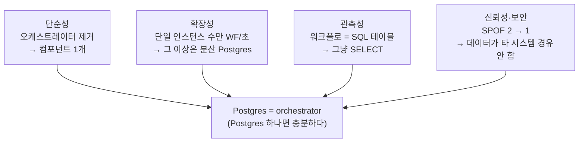
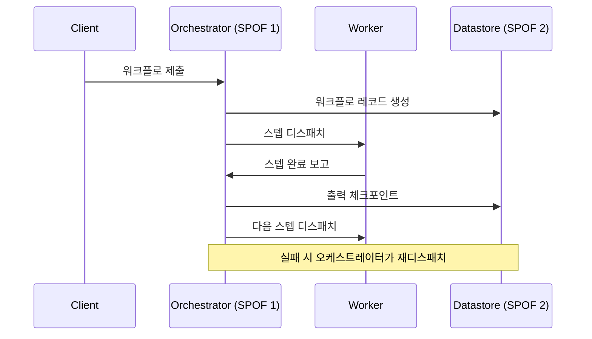
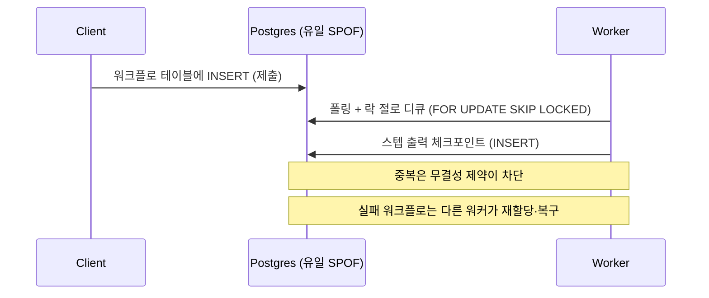

<figure class="post-figure post-figure--header">
<svg role="img" aria-label="왼쪽은 오케스트레이터와 데이터스토어 두 박스가 워커들 위에 군림하는 복잡한 구조(SPOF 2개), 오른쪽은 워커들이 가운데 Postgres 하나를 둘러싸고 직접 체크포인트하는 단순한 구조(SPOF 1개)." viewBox="0 0 680 340" xmlns="http://www.w3.org/2000/svg" shape-rendering="crispEdges">
  <title>SPOF 둘 → 하나: 외부 오케스트레이션 vs Postgres-backed durable execution</title>
  <!-- ===== LEFT: 복잡한 성채 — orchestrator + datastore 위에 군림 (SPOF 2) ===== -->
  <text x="150" y="26" font-size="15" font-weight="700" fill="currentColor" text-anchor="middle">기존 — 외부 오케스트레이션</text>

  <!-- Orchestrator box (SPOF) -->
  <rect x="70" y="44" width="160" height="42" fill="var(--bg-light)" stroke="var(--accent-color)" stroke-width="3"/>
  <text x="150" y="66" font-size="12" font-weight="700" fill="currentColor" text-anchor="middle">Orchestrator</text>
  <text x="150" y="80" font-size="9" fill="var(--accent-color)" text-anchor="middle">SPOF 1</text>

  <!-- Datastore box (SPOF) -->
  <rect x="70" y="100" width="160" height="40" fill="var(--bg-light)" stroke="var(--accent-color)" stroke-width="3"/>
  <text x="150" y="121" font-size="12" font-weight="700" fill="currentColor" text-anchor="middle">Datastore</text>
  <text x="150" y="133" font-size="9" fill="var(--accent-color)" text-anchor="middle">SPOF 2</text>
  <!-- orchestrator <-> datastore link -->
  <line x1="150" y1="86" x2="150" y2="100" stroke="currentColor" stroke-width="2"/>

  <!-- workers ruled from above -->
  <line x1="100" y1="140" x2="80" y2="178" stroke="currentColor" stroke-width="2"/>
  <line x1="150" y1="140" x2="150" y2="178" stroke="currentColor" stroke-width="2"/>
  <line x1="200" y1="140" x2="220" y2="178" stroke="currentColor" stroke-width="2"/>
  <g fill="var(--bg-light)" stroke="currentColor" stroke-width="2">
    <rect x="55" y="180" width="50" height="34"/>
    <rect x="125" y="180" width="50" height="34"/>
    <rect x="195" y="180" width="50" height="34"/>
  </g>
  <g font-size="10" fill="currentColor" text-anchor="middle">
    <text x="80" y="201">W</text>
    <text x="150" y="201">W</text>
    <text x="220" y="201">W</text>
  </g>
  <text x="150" y="234" font-size="10" fill="var(--text-light)" text-anchor="middle">워커는 오케스트레이터를 거쳐야 한다</text>
  <text x="150" y="252" font-size="13" font-weight="700" fill="var(--accent-color)" text-anchor="middle">실패점 2개 · 홉 많음</text>

  <!-- ===== divider arrow: 둘 → 하나 ===== -->
  <g stroke="var(--secondary-color)" stroke-width="3" fill="none">
    <line x1="312" y1="150" x2="356" y2="150"/>
    <polyline points="346,141 358,150 346,159"/>
  </g>
  <text x="334" y="135" font-size="13" font-weight="700" fill="var(--secondary-color)" text-anchor="middle">2 → 1</text>

  <!-- ===== RIGHT: 단순한 진영 — workers around one Postgres (SPOF 1) ===== -->
  <text x="528" y="26" font-size="15" font-weight="700" fill="currentColor" text-anchor="middle">제안 — Postgres-backed</text>

  <!-- Postgres elephant-ish drum at center (SPOF 1) -->
  <g>
    <rect x="476" y="118" width="104" height="74" rx="6" fill="var(--bg-light)" stroke="var(--secondary-color)" stroke-width="4"/>
    <!-- stacked DB cylinder hint -->
    <ellipse cx="528" cy="118" rx="52" ry="10" fill="var(--bg-panel)" stroke="var(--secondary-color)" stroke-width="3"/>
    <text x="528" y="152" font-size="13" font-weight="700" fill="currentColor" text-anchor="middle">Postgres</text>
    <text x="528" y="170" font-size="9" fill="var(--secondary-color)" text-anchor="middle">= orchestrator</text>
    <text x="528" y="184" font-size="9" fill="var(--secondary-color)" text-anchor="middle">SPOF 1 (유일)</text>
  </g>

  <!-- workers surround it, talking directly to DB -->
  <g fill="var(--bg-light)" stroke="currentColor" stroke-width="2">
    <rect x="402" y="92" width="46" height="30"/>
    <rect x="402" y="178" width="46" height="30"/>
    <rect x="608" y="92" width="46" height="30"/>
    <rect x="608" y="178" width="46" height="30"/>
  </g>
  <g font-size="10" fill="currentColor" text-anchor="middle">
    <text x="425" y="111">W</text>
    <text x="425" y="197">W</text>
    <text x="631" y="111">W</text>
    <text x="631" y="197">W</text>
  </g>
  <!-- direct checkpoint links -->
  <g stroke="currentColor" stroke-width="2">
    <line x1="448" y1="107" x2="478" y2="128"/>
    <line x1="448" y1="193" x2="478" y2="182"/>
    <line x1="608" y1="107" x2="578" y2="128"/>
    <line x1="608" y1="193" x2="578" y2="182"/>
  </g>
  <text x="528" y="234" font-size="10" fill="var(--text-light)" text-anchor="middle">워커가 DB와만 직접 대화한다</text>
  <text x="528" y="252" font-size="13" font-weight="700" fill="var(--secondary-color)" text-anchor="middle">실패점 1개 · 단순</text>
</svg>
<figcaption>둘 → 하나: 오케스트레이터와 데이터스토어 두 실패점을, 워커들이 직접 체크포인트하는 Postgres 하나로 줄인다.</figcaption>
</figure>

## 원문 정보

> - **제목**: Postgres is All You Need for Durable Workflows
> - **출처**: Peter Kraft — DBOS ([dbos.dev](https://www.dbos.dev/))
> - **발행**: 2026-05-20 · 약 6~8분 분량
> - **원문 링크**: <https://www.dbos.dev/blog/postgres-is-all-you-need-for-durable-execution>

`Articles` 카테고리는 읽을 만한 외부 아티클을 골라 핵심을 정리하고 내 관점으로 분석하는 공간이다. 이 글은 순수 백엔드/DB 시스템 글이면서 동시에 **agentic AI 인프라의 핵심 부품**을 다룬다. 비싼 LLM 호출을 처음부터 다시 돌리지 않게 하는 "실패 지점부터 재개"의 골격이 바로 durable execution이고, [신뢰할 수 있는 Agentic AI 시스템](/2026/06/19/reliable-agentic-ai-systems.html)의 PRINCE가 PostgreSQL을 LangGraph checkpointer로 쓴 것이 정확히 이 글이 일반화한 패턴이다.

## 한 줄 요약 (TL;DR)

Durable workflow를 만들 때 Temporal·Airflow·Step Functions 같은 **별도의 중앙 오케스트레이터는 필수가 아니다**. 워크플로 상태를 Postgres 테이블에 직접 체크포인트하고, 락 절(`FOR UPDATE` 류)과 무결성 제약으로 워커들이 DB를 통해 협력하게 하면, 오케스트레이터를 들어내고도 더 단순하고·관측 가능하고·신뢰할 수 있는 durable execution을 만들 수 있다. "Postgres 하나면 충분하다."

아래 도식이 이 글의 척추다. "왜 Postgres만으로 되는가"는 네 개의 기둥 — 단순성·확장성·관측성·신뢰성 — 이 "Postgres = orchestrator"라는 한 지붕을 받치는 구조로 읽으면 된다.

## 왜 이 글을 골랐나

"durable execution"은 요즘 백엔드와 AI 에이전트 양쪽에서 동시에 뜨거워진 주제다. 긴 작업, 재시도, 멱등성(idempotency), 실패 복구가 필요한 모든 시스템 — 결제 파이프라인, 주문 워크플로, 그리고 무엇보다 **여러 단계로 도구를 호출하는 AI 에이전트** — 이 같은 문제를 푼다. 보통의 정답은 "Temporal을 써라"이지만, 이 글은 그 통념에 정면으로 반론한다.

골라 읽을 가치가 있는 이유는 두 가지다. 첫째, **저자가 그 통념의 안쪽에 있는 사람**이다. DBOS는 Postgres 기반 durable execution을 파는 회사이므로 포지션 토크라는 점은 감안해야 하지만, 동시에 이 아키텍처를 가장 깊이 들여다본 당사자이기도 하다. 둘째, 이 글은 추상적 주장이 아니라 **"오케스트레이터가 하던 일을 DB의 어떤 기능이 대신하는가"를 메커니즘 단위로 매핑**한다. 디스패치 → 락 절, 체크포인트 → INSERT, 중복 실행 방지 → 무결성 제약, 복구 → 재할당. 이 매핑을 이해하면 [PostgreSQL 아키텍처 심층 분석](/2025/12/06/postgresql-architecture-deep-dive.html)에서 본 WAL·MVCC·잠금이 왜 "오케스트레이터를 들어낼 수 있는" 토대가 되는지가 보인다.

## 핵심 내용

원문의 구조를 따라 정리한다. 사실은 원문에 충실하게, 내 해석은 다음 절로 분리했다.

### Durable execution이란

원문의 정의는 단순하다. 프로그램이 실행되는 동안 **진행 상황을 주기적으로 데이터베이스에 체크포인트**한다. 프로그램이 크래시하거나 실패하면, 마지막 체크포인트에서 다시 로드해 **마지막으로 완료된 스텝부터 복구**한다. 원문의 비유 그대로 옮기면, 비디오 게임에서 진행을 세이브해 두는 것과 같다. 처음부터 다시 시작하지 않아도 된다.

### 기존 방식 — 외부 오케스트레이션

전통적인 durable workflow는 **중앙 오케스트레이터(central orchestrator)** 를 둔다. 흐름은 이렇다.

1. 오케스트레이터가 워크플로 레코드를 만들고 워커에게 디스패치한다.
2. 워커는 스텝을 실행하고 완료를 오케스트레이터에 보고한다.
3. 오케스트레이터가 출력을 체크포인트하고 다음 스텝을 디스패치한다.
4. 실패가 나면 오케스트레이터가 체크포인트로부터 워크플로를 재디스패치한다.

Temporal, Airflow, AWS Step Functions가 이 범주에 속한다. 문제는 **오케스트레이터 자체가 또 하나의 분산 시스템**이라는 점이다. 그것을 배포하고, 스케일링하고, 보안을 하드닝하고, 감사해야 한다. 게다가 오케스트레이터는 보통 자기 상태를 저장할 별도의 데이터스토어가 또 필요하다.

두 방식을 시퀀스로 나란히 두면 차이가 분명하다. **기존 방식**은 모든 스텝이 오케스트레이터를 경유하고, 그 오케스트레이터가 다시 별도 데이터스토어에 의존한다 — 홉이 많고 중앙 노드가 병목이다.

**제안 방식**에서는 오케스트레이터와 데이터스토어가 사라지고, 워커가 Postgres와만 직접 대화한다 — 한 시스템이 빠지면서 홉과 SPOF가 동시에 준다.

### 제안하는 방식 — Postgres-backed

핵심 전환은 **애플리케이션 서버가 오케스트레이터를 거치지 않고 Postgres와 직접 대화**하게 하는 것이다. 오케스트레이터가 하던 일을 DB 기능으로 하나씩 대체한다.

- **제출**: 클라이언트는 Postgres 워크플로 테이블에 엔트리를 만들어 워크플로를 제출한다.
- **디스패치 대체**: 애플리케이션 서버들이 **락 절(locking clause)** 로 워크플로를 폴링·디큐한다. 한 워크플로를 한 워커만 집어가도록 보장한다.
- **체크포인트**: 워커가 스텝 출력을 Postgres 테이블에 직접 기록한다.
- **중복 방지**: 여러 워커가 동시에 같은 일을 시도하면 **데이터베이스 무결성 제약(integrity constraints)** 이 중복 작업을 탐지한다.
- **복구**: 실패한 워커의 워크플로는 다른 서버가 자동으로 재할당·복구한다.

이 대체를 한 장으로 보면, durable execution의 네 가지 원시동작이 각각 Postgres가 원래 잘하는 기능 위에 정확히 얹힌다.

<figure class="post-figure">
<svg role="img" aria-label="Durable execution의 네 원시동작이 Postgres 기능으로 매핑되는 도식: 디스패치는 락 절 SELECT FOR UPDATE SKIP LOCKED로, 체크포인트는 트랜잭션 안의 INSERT로, 멱등성은 UNIQUE 제약으로, 복구는 다른 워커의 재할당으로." viewBox="0 0 680 320" xmlns="http://www.w3.org/2000/svg" shape-rendering="crispEdges">
  <title>오케스트레이터의 일 → Postgres 기능 매핑</title>
  <text x="158" y="26" font-size="14" font-weight="700" fill="currentColor" text-anchor="middle">오케스트레이터가 하던 일</text>
  <text x="528" y="26" font-size="14" font-weight="700" fill="currentColor" text-anchor="middle">Postgres 기능</text>

  <!-- Row 1: 디스패치 → 락 절 -->
  <rect x="44" y="46" width="228" height="48" fill="var(--bg-light)" stroke="currentColor" stroke-width="2"/>
  <text x="158" y="68" font-size="13" font-weight="700" fill="currentColor" text-anchor="middle">디스패치</text>
  <text x="158" y="84" font-size="10" fill="var(--text-light)" text-anchor="middle">한 워크플로 = 한 워커</text>
  <g stroke="var(--secondary-color)" stroke-width="3" fill="none">
    <line x1="280" y1="70" x2="400" y2="70"/>
    <polyline points="390,62 402,70 390,78"/>
  </g>
  <rect x="408" y="46" width="240" height="48" fill="var(--bg-light)" stroke="var(--secondary-color)" stroke-width="2"/>
  <text x="528" y="66" font-size="11" font-weight="700" fill="currentColor" text-anchor="middle">락 절로 디큐</text>
  <text x="528" y="83" font-size="9" fill="var(--secondary-color)" text-anchor="middle">SELECT … FOR UPDATE SKIP LOCKED</text>

  <!-- Row 2: 체크포인트 → INSERT -->
  <rect x="44" y="110" width="228" height="48" fill="var(--bg-light)" stroke="currentColor" stroke-width="2"/>
  <text x="158" y="132" font-size="13" font-weight="700" fill="currentColor" text-anchor="middle">체크포인트</text>
  <text x="158" y="148" font-size="10" fill="var(--text-light)" text-anchor="middle">스텝 출력 영속화</text>
  <g stroke="var(--secondary-color)" stroke-width="3" fill="none">
    <line x1="280" y1="134" x2="400" y2="134"/>
    <polyline points="390,126 402,134 390,142"/>
  </g>
  <rect x="408" y="110" width="240" height="48" fill="var(--bg-light)" stroke="var(--secondary-color)" stroke-width="2"/>
  <text x="528" y="130" font-size="11" font-weight="700" fill="currentColor" text-anchor="middle">트랜잭션 안의 INSERT</text>
  <text x="528" y="147" font-size="9" fill="var(--secondary-color)" text-anchor="middle">INSERT … (스텝 출력 행)</text>

  <!-- Row 3: 멱등성 → UNIQUE 제약 -->
  <rect x="44" y="174" width="228" height="48" fill="var(--bg-light)" stroke="currentColor" stroke-width="2"/>
  <text x="158" y="196" font-size="13" font-weight="700" fill="currentColor" text-anchor="middle">멱등성 / 중복 방지</text>
  <text x="158" y="212" font-size="10" fill="var(--text-light)" text-anchor="middle">같은 일 두 번 안 하기</text>
  <g stroke="var(--secondary-color)" stroke-width="3" fill="none">
    <line x1="280" y1="198" x2="400" y2="198"/>
    <polyline points="390,190 402,198 390,206"/>
  </g>
  <rect x="408" y="174" width="240" height="48" fill="var(--bg-light)" stroke="var(--secondary-color)" stroke-width="2"/>
  <text x="528" y="194" font-size="11" font-weight="700" fill="currentColor" text-anchor="middle">무결성 제약</text>
  <text x="528" y="211" font-size="9" fill="var(--secondary-color)" text-anchor="middle">UNIQUE constraint</text>

  <!-- Row 4: 복구 → 재할당 -->
  <rect x="44" y="238" width="228" height="48" fill="var(--bg-light)" stroke="currentColor" stroke-width="2"/>
  <text x="158" y="260" font-size="13" font-weight="700" fill="currentColor" text-anchor="middle">복구</text>
  <text x="158" y="276" font-size="10" fill="var(--text-light)" text-anchor="middle">죽은 워커의 일 이어받기</text>
  <g stroke="var(--secondary-color)" stroke-width="3" fill="none">
    <line x1="280" y1="262" x2="400" y2="262"/>
    <polyline points="390,254 402,262 390,270"/>
  </g>
  <rect x="408" y="238" width="240" height="48" fill="var(--bg-light)" stroke="var(--secondary-color)" stroke-width="2"/>
  <text x="528" y="258" font-size="11" font-weight="700" fill="currentColor" text-anchor="middle">다른 서버가 재할당</text>
  <text x="528" y="275" font-size="9" fill="var(--secondary-color)" text-anchor="middle">만료된 락 → 재디큐·복구</text>
</svg>
<figcaption>오케스트레이터가 하던 네 가지 일은 모두 Postgres가 원래 잘하는 기능 — 락 절·트랜잭션 INSERT·UNIQUE 제약·재할당 — 으로 그대로 매핑된다.</figcaption>
</figure>

원문의 핵심 주장은 이 한 문장이다. *"Replacing a central orchestrator with Postgres (or another database) makes durable workflows fundamentally simpler."* — 중앙 오케스트레이터를 Postgres로 대체하면 durable workflow가 **근본적으로 더 단순해진다**.

### 확장성과 가용성

용량의 상한은 데이터베이스 처리량으로 결정된다. 원문은 **단일 Postgres 서버가 수직 확장으로 초당 수만 개(tens of thousands per second)의 워크플로를 처리**할 수 있다고 말한다. 그 이상이 필요하면 분산 Postgres나 CockroachDB로 수평 확장한다. 가용성은 Postgres가 이미 가진 **스트리밍 복제 + 자동 페일오버**로 확보하고, 관리형 제공자의 멀티 AZ 배포를 그대로 쓸 수 있다. 요점은 "오케스트레이터의 HA를 새로 설계할 필요 없이, **DB가 수십 년 쌓아온 복제·페일오버를 그대로 상속**한다"는 것이다.

### 관측성 (Observability)

워크플로와 스텝이 전부 Postgres 테이블에 들어 있으므로 **관측성을 SQL로 공짜로 얻는다**. 워크플로를 실시간으로 들여다볼 수 있고, 원문은 "지난 한 달간 에러난 모든 워크플로를 가져오는" SQL 예시를 든다. 관계형 모델이라 복잡한 분석 질의도 **수십 년간 최적화된 쿼리 엔진** 위에서 돌릴 수 있다. 경쟁 오케스트레이터들이 흔히 쓰는 키-값 스토어로는 이런 임의(ad-hoc) 분석 질의가 어렵다는 점을 대비로 강조한다.

### 신뢰성과 보안

마지막 논거는 **single point of failure** 다. 외부 오케스트레이션은 SPOF가 둘이다 — 오케스트레이터 그 자체와, 그것이 의존하는 데이터스토어. 반면 Postgres-backed durable execution의 유일한 실패점은 Postgres 자신뿐이다. 원문 인용 그대로:

> By contrast, the only point of failure in Postgres-backed durable execution is Postgres itself, and all workflow data is stored directly in Postgres and never transits any other system. If an application already depends on Postgres, adopting durable execution does not add any new points of failure to the system nor introduce new surface area to secure.

즉 모든 워크플로 데이터가 Postgres 안에만 머물고 다른 시스템을 경유하지 않는다. **이미 Postgres에 의존하는 조직이라면, durable execution을 도입해도 새 실패점이나 새 공격 표면이 추가되지 않는다.** 별도 오케스트레이션 시스템을 하드닝·접근통제·감사해야 할 필요가 사라진다.

원문은 DBOS가 이 Postgres-backed durable execution을 "가능한 한 단순하고 성능 좋게" 만드는 것을 목표로 한다고 밝히며, Quickstart·GitHub·Discord 링크로 마무리한다.

## 분석과 인사이트

여기서부터는 원문 요약이 아니라 내 관점이다.

- **"X is all you need"는 한쪽 면만 비추는 헤드라인이다 — 그래도 그 면은 진짜다.** 포지션 토크라는 점은 분명히 깔고 봐야 한다. DBOS는 이 아키텍처를 파는 회사다. 하지만 "오케스트레이터가 하던 일을 DB 프리미티브로 매핑할 수 있다"는 기술적 주장 자체는 견고하다. 디스패치를 `SELECT ... FOR UPDATE SKIP LOCKED`로, 멱등성을 `UNIQUE` 제약으로, 체크포인트를 트랜잭션 안의 INSERT로 — 이건 마케팅이 아니라 [PostgreSQL 아키텍처](/2025/12/06/postgresql-architecture-deep-dive.html)에서 본 MVCC·잠금·WAL이 실제로 제공하는 보장이다. 결국 "오케스트레이터는 사실 특수화된 작업 큐 + 상태 머신이고, 그 둘 다 RDBMS가 원래 잘하는 일"이라는 통찰이다.

- **진짜 절감은 코드가 아니라 운영의 표면적이다.** 이 글이 줄이는 것은 LOC가 아니라 **운영 부담**이다. 오케스트레이터 하나를 들어내면 배포 대상 하나, 모니터링 대시보드 하나, 백업 전략 하나, 보안 감사 범위 하나, 온콜이 새벽에 깨워질 시스템 하나가 줄어든다. SPOF "2 → 1"의 무게는 가용성 산수보다 **인지 부하**에 있다. 이 점은 [SQLite 창시자 Richard Hipp 인터뷰](/2026/06/19/sqlite-richard-hipp-interview.html)가 보여준 "의존성을 줄이는 것이 곧 신뢰성"이라는 철학과 같은 결을 탄다 — 컴포넌트를 더하는 것은 언제나 비용이다.

- **이건 agentic AI 인프라의 가장 조용한 핵심 부품이다.** 멀티 스텝으로 도구를 호출하는 에이전트는 본질적으로 durable workflow다. 각 스텝(LLM 호출, 검색, 외부 API)은 비싸고, 비결정적이고, 실패할 수 있다. 처음부터 다시 돌리는 비용 = 돈과 지연. 그래서 [신뢰할 수 있는 Agentic AI 시스템](/2026/06/19/reliable-agentic-ai-systems.html)의 PRINCE는 PostgreSQL을 LangGraph checkpointer로 두고 **node-level recovery**를 구현했다. 이 글은 그 한 사례를 일반 원리로 끌어올린다 — "에이전트의 신뢰성은 모델이 아니라 모델 주변의 골격(harness)에서 나온다"는 [Loop Engineering](/2026/06/19/loop-engineering.html)·harness engineering 담론과 정확히 같은 지점이다.

- **단, "all you need"가 깨지는 경계는 따로 봐야 한다.** 원문은 단일 인스턴스 수만 워크플로/초를 강조하지만, 폴링 기반 디큐는 **워커가 많아질수록 DB 부하와 락 경합**을 만든다(이 지점에서 `SKIP LOCKED`와 폴링 주기 튜닝이 중요해진다). Temporal이 제공하는 복잡한 타이머·시그널·장기 실행(수개월) 워크플로, 또는 매우 높은 동시성 같은 영역에서는 전용 오케스트레이터가 여전히 합리적일 수 있다. 원문은 "더 단순하다"를 잘 논증하지만 "항상 더 낫다"를 논증하지는 않는다 — 이 둘을 섞어 읽지 않는 게 중요하다.

- **"이미 Postgres에 의존한다면"이라는 전제가 논거의 절반이다.** 신뢰성·보안 논거의 핵심은 *새 시스템을 추가하지 않는다*는 데 있다. 즉 이 글의 설득력은 "당신 스택에 이미 Postgres가 있다"는 매우 흔한 전제 위에 선다. 마침 대부분의 백엔드가 그렇기 때문에 강력하다 — [Django/Celery로 작업을 분산처리](/2025/11/10/django-와-celery-를-이용한-대규모-작업-분산처리.html)할 때 별도 브로커(RabbitMQ/Redis)를 들이는 대신, 이미 있는 Postgres를 큐 겸 상태 저장소로 쓰는 선택과 같은 트레이드오프 위에 있다.

## 적용 포인트

독자가 바로 적용할 수 있는 실천 항목.

- **새 워크플로 엔진을 도입하기 전에 "Postgres로 되나?"를 먼저 물어라.** 초당 수만 건 이하의 작업이고 이미 Postgres가 있다면, 전용 오케스트레이터는 과한 인프라일 수 있다.
- **디큐는 `SELECT ... FOR UPDATE SKIP LOCKED`로 시작하라.** 락 경합 없이 워커들이 같은 큐에서 서로 다른 행을 안전하게 집어가는 표준 패턴이다. 폴링 주기는 처리량과 DB 부하의 트레이드오프로 튜닝한다.
- **멱등성은 코드가 아니라 제약으로 보장하라.** 워크플로/스텝마다 고유 키에 `UNIQUE` 제약을 걸면, 중복 실행은 애플리케이션 로직이 아니라 DB가 막아 준다.
- **체크포인트와 비즈니스 변경을 한 트랜잭션에 묶어라.** 스텝 출력 기록과 실제 부수효과를 같은 트랜잭션으로 처리하면 "절반만 실행된" 상태를 원천 차단한다(가능한 경우).
- **관측성을 새로 만들지 말고 SQL로 뽑아라.** "최근 실패한 워크플로", "특정 스텝에서 멈춘 것들" 같은 질의는 대시보드 SaaS 없이 뷰 하나로 해결된다.
- **AI 에이전트를 만든다면 워크플로 상태를 처음부터 영속화하라.** 비싼 LLM/도구 호출을 실패 시 재시작하지 않도록, 스텝 경계마다 체크포인트를 둔다. checkpointer로 Postgres를 쓰면 위 모든 이점이 따라온다.

## 마무리

이 글의 메시지는 "Postgres를 숭배하라"가 아니라, **"오케스트레이션이라는 추상은 사실 RDBMS가 원래 잘하는 일(큐·상태·제약·트랜잭션)의 재포장일 때가 많다"** 는 통찰이다. 새 분산 시스템을 하나 더 세우기 전에, 이미 가진 DB가 그 일을 — 더 적은 SPOF와 공짜 관측성으로 — 해낼 수 있는지 먼저 묻게 만든다. AI 에이전트든 결제 파이프라인이든, durable execution의 본질은 화려한 엔진이 아니라 "마지막 세이브 포인트부터 다시 시작할 수 있다"는 단순한 약속이고, 그 약속을 지키는 가장 지루하고 견고한 방법이 바로 트랜잭션 데이터베이스다. 포지션 토크라는 단서를 달고 읽되, 그 안의 엔지니어링 논거는 진짜다.

### 더 읽어보기

- [원문 — Postgres is All You Need for Durable Workflows (DBOS)](https://www.dbos.dev/blog/postgres-is-all-you-need-for-durable-execution)
- [PostgreSQL 아키텍처 심층 분석](/2025/12/06/postgresql-architecture-deep-dive.html) — MVCC·잠금·WAL, durable execution을 떠받치는 토대
- [신뢰할 수 있는 Agentic AI 시스템](/2026/06/19/reliable-agentic-ai-systems.html) — PostgreSQL을 LangGraph checkpointer로 쓴 실제 durable workflow 사례
- [Loop Engineering](/2026/06/19/loop-engineering.html) — 에이전트의 신뢰성은 모델이 아니라 주변 골격에서 나온다
- [Django 와 Celery 를 이용한 대규모 작업 분산처리](/2025/11/10/django-와-celery-를-이용한-대규모-작업-분산처리.html) — 별도 브로커 vs DB-as-queue의 같은 트레이드오프
- [SQLite 창시자 Richard Hipp 인터뷰](/2026/06/19/sqlite-richard-hipp-interview.html) — 의존성을 줄이는 것이 곧 신뢰성이라는 철학
