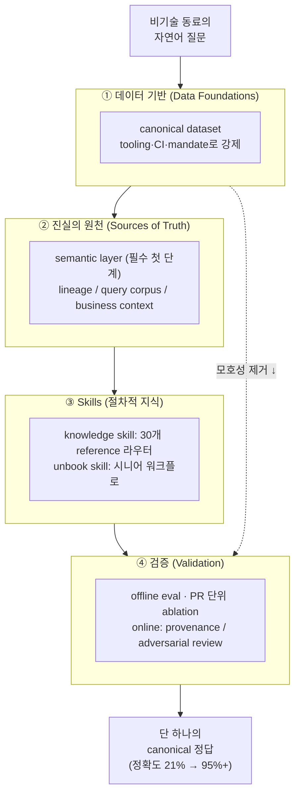

<figure class="post-figure post-figure--header">
<svg role="img" aria-label="비기술 동료의 자연어 질문이 데이터 기반·진실의 원천·skill·검증의 4단 정제 깔때기를 통과하며, 무질서한 수백 개 후보 필드가 하나의 canonical 정의로 수렴하는 헤더 삽화" viewBox="0 0 640 320" xmlns="http://www.w3.org/2000/svg">
  <title>자연어 질문 → 4단 정제 깔때기 → 단 하나의 canonical 정답</title>
  <!-- 입력: 비기술 동료의 자연어 질문 -->
  <g font-size="12" fill="currentColor" text-anchor="middle">
    <rect x="232" y="14" width="176" height="30" rx="6" fill="var(--bg-panel)" stroke="currentColor" stroke-width="1.5"/>
    <text x="320" y="33" font-weight="700">"지난달 매출 얼마였죠?"</text>
  </g>
  <!-- 무질서한 수백 개 후보 필드(점들) -->
  <g fill="var(--accent-color)" opacity="0.7">
    <circle cx="120" cy="64" r="3.5"/><circle cx="170" cy="58" r="3.5"/><circle cx="214" cy="70" r="3.5"/>
    <circle cx="262" cy="60" r="3.5"/><circle cx="320" cy="66" r="3.5"/><circle cx="378" cy="60" r="3.5"/>
    <circle cx="426" cy="70" r="3.5"/><circle cx="470" cy="58" r="3.5"/><circle cx="520" cy="64" r="3.5"/>
    <circle cx="148" cy="78" r="3.5"/><circle cx="296" cy="80" r="3.5"/><circle cx="444" cy="78" r="3.5"/>
    <circle cx="496" cy="80" r="3.5"/><circle cx="192" cy="82" r="3.5"/><circle cx="352" cy="82" r="3.5"/>
  </g>
  <text x="320" y="100" text-anchor="middle" font-size="11" fill="currentColor" opacity="0.65">수백 개 후보 필드 (revenue? net_rev? gmv? booked? …)</text>
  <!-- 깔때기 본체: 4단계로 좁아지는 사다리꼴 -->
  <path d="M104,112 H536 L300,300 H340 Z M104,112 L320,300 L536,112" fill="none"/>
  <polygon points="104,112 536,112 396,300 244,300" fill="var(--bg-panel)" stroke="var(--border-color)" stroke-width="1.5"/>
  <!-- 4단 정제 레이어 띠 -->
  <g font-size="12.5" fill="currentColor" text-anchor="middle" font-weight="700">
    <line x1="92" y1="112" x2="548" y2="112" stroke="currentColor" stroke-width="1" opacity="0.3"/>
    <text x="320" y="135">① 데이터 기반 — canonical dataset</text>
    <line x1="153" y1="160" x2="487" y2="160" stroke="currentColor" stroke-width="1" opacity="0.3"/>
    <text x="320" y="183">② 진실의 원천 — semantic layer</text>
    <line x1="200" y1="206" x2="440" y2="206" stroke="currentColor" stroke-width="1" opacity="0.3"/>
    <text x="320" y="229">③ skill — 절차적 지식</text>
    <line x1="240" y1="250" x2="400" y2="250" stroke="currentColor" stroke-width="1" opacity="0.3"/>
    <text x="320" y="272" font-size="11.5">④ 검증 — eval</text>
  </g>
  <!-- 수렴 화살표 -->
  <path d="M320,278 v14" fill="none" stroke="var(--secondary-color)" stroke-width="3"/>
  <polygon points="313,290 327,290 320,300" fill="var(--secondary-color)"/>
  <!-- 출력: 단 하나의 canonical 정답 -->
  <g text-anchor="middle">
    <rect x="232" y="300" width="176" height="18" rx="4" fill="var(--secondary-color)" opacity="0.18"/>
    <text x="320" y="313" font-size="12" fill="currentColor" font-weight="700">단 하나의 canonical 정답</text>
  </g>
  <!-- 우측 축: 모호성 제거 -->
  <g font-size="10.5" fill="currentColor" opacity="0.7" text-anchor="middle">
    <text x="578" y="120" transform="rotate(90 578 120)">모호함</text>
    <text x="578" y="270" transform="rotate(90 578 270)">명료함</text>
    <line x1="566" y1="116" x2="566" y2="292" stroke="currentColor" stroke-width="1.5" opacity="0.5"/>
    <polygon points="562,286 570,286 566,296" fill="currentColor"/>
  </g>
</svg>
<figcaption>비기술 동료의 자연어 질문은 ① 데이터 기반 → ② 진실의 원천(semantic layer) → ③ skill → ④ 검증이라는 정제 깔때기를 지나며, 무질서한 수백 개 후보 필드가 하나의 canonical 정답으로 수렴한다 — 이 글의 그림.</figcaption>
</figure>

## 원문 정보

> - **제목**: How Anthropic enables self-service data analytics with Claude
> - **출처**: Anthropic Data Science & Data Engineering 팀 — Chen Chang, Clement Peng, Justin Leder, Johanne Jiao, Josh Cherry ([claude.com](https://claude.com/blog))
> - **발행**: 2026-06-03 · 약 5분 분량 (Enterprise AI · Claude Code)
> - **원문 링크**: <https://claude.com/blog/how-anthropic-enables-self-service-data-analytics-with-claude>

`Articles` 카테고리는 읽을 만한 외부 아티클을 골라 핵심을 정리하고 내 관점으로 분석하는 공간이다. 앞선 [Building Reliable Agentic AI Systems](/2026/06/19/reliable-agentic-ai-systems.html)가 규제 도메인에서 agentic RAG의 신뢰성을 다뤘다면, 이 글은 Anthropic이 **자기 회사 안에서** Claude로 셀프서비스 데이터 분석을 어떻게 운영 가능한 수준으로 만들었는지를 1인칭 실무 기록으로 보여준다.

## 한 줄 요약 (TL;DR)

agentic 데이터 분석의 정확도는 **더 좋은 SQL 생성 능력**이 아니라 **모호성을 제거하는 일**에서 나온다. 수백 개 후보 엔티티를 하나의 canonical 정의로 합치고(데이터 기반), 그 정의를 진실의 원천으로 노출하고(semantic layer), 도메인을 탐색하는 절차적 지식을 skill로 감싸고, eval로 검증한다 — 이 네 계층을 갖추자 정확도가 21%에서 95% 이상(특정 도메인은 ~99%)으로 올랐고, 사내 분석 질의의 95%가 자동화됐다.

## 왜 이 글을 골랐나

"Text-to-SQL을 LLM에게 시키면 된다"는 이야기는 흔하다. 하지만 대부분 데모에서 멈춘다. 이 글의 가치는 **AI 회사가 자기 데이터로 직접 부딪힌 실패와, 그것을 production 정확도로 끌어올린 구체적 구조**를 공개한다는 점에 있다. 특히 직관에 반하는 결과 하나가 글 전체를 관통한다 — **과거 SQL 쿼리 코퍼스에 직접 접근할 수 있게 해도 정확도는 1점 미만으로 거의 움직이지 않았다.** 정보가 80%의 경우에 거기 있었는데도 말이다.

이건 LLM 시스템을 만드는 사람이라면 반드시 마주칠 교훈이다. 병목은 "정보 접근"이 아니라 "구조"였다는 것. RAG를 더 욱여넣는 대신 무엇을 구조화해야 하는지를 묻게 만든다. [Designing Data-Intensive Applications](/2026/06/19/designing-data-intensive-applications.html)가 말하는 데이터 모델링·진실의 원천 문제가 LLM 에이전트라는 새 소비자를 만나 다시 등장하는 셈이다.

### 한눈에 보기

글 전체를 관통하는 척추는 하나다 — 정확도는 더 좋은 SQL 생성이 아니라 **모호성을 제거하는 4계층 스택**에서 나온다. 자연어 질문이 아래 4계층을 위→아래로 통과할수록 선택지가 좁아지고(모호성↓) 정확도가 올라간다.

이 그림이 척추다 — 아래 핵심 내용은 이 4계층을 차례로 펼친 것이고, 오른쪽 "모호성 제거" 축이 정확도를 21%에서 95% 이상으로 끌어올린 지렛대다.

## 핵심 내용

원문은 "데이터는 소프트웨어가 아니다"라는 전제에서 출발해, 정확도를 만든 4계층 agentic 분석 스택을 설명한다.

### 데이터는 소프트웨어가 아니다

코딩은 모델의 창의성을 보상하는 열린 문제 공간이고, 문서와 테스트가 환각을 막는 자연스러운 가드레일이 되어 준다. 반면 분석에는 그런 결정적 증명 수단이 없다는 게 출발점이다. 단일한 올바른 source를 쓰는 단일한 올바른 답이 존재하는 경우가 많지만, 그것이 옳음을 결정적으로 증명할 방법은 없다. 그래서 비기술 동료를 위해 데이터를 넓고 비정규화된(wide, denormalized) 테이블로 풀어 주면, 사업이 커질수록 정의가 서로 어긋나는 겹치는 뷰가 양산된다. 전통적 셀프서비스의 두 갈래 — 비정규화 테이블이냐, 사일로화된 대시보드냐 — 가 모두 막다른 길이라는 진단이다.

### 핵심 문제 — 세 가지 실패 모드

중심 문제는 사용자의 질문을 데이터 모델 안의 구체적이고 최신인 엔티티로 매핑하고, 그것을 올바르게 다루는 방법까지 아는 능력으로 압축된다. 여기서 세 가지 실패 모드가 나온다.

- **개념 ↔ 엔티티 모호성**: 수백 개의 후보 필드 중 올바른 것을 고르기 어렵다.
- **데이터 staleness**: 스키마와 정의가 에이전트의 지식보다 빠르게 바뀐다.
- **검색 실패(retrieval failure)**: 올바른 정보가 존재하는데도 에이전트가 찾지 못한다.

### 4계층 agentic 분석 스택

#### 1. 데이터 기반 (Data Foundations)

모든 것의 토대는 **canonical dataset** — 단일 진실의 원천이다. 표준은 *권유*가 아니라 tooling·CI·mandate로 강제된다. 모델링·semantic layer·문서 같은 산출물을 하나의 저장소에 colocate하고, 메타데이터를 부차적 부산물이 아니라 **일급 제품(first-class product)** 으로 다룬다. 세 실패 모드 중 첫 번째(모호성)를 정면으로 줄이는 계층이다.

#### 2. 진실의 원천 (Sources of Truth)

에이전트가 참조하는 표면(reference surface)들이다.

- **Semantic layer**: 컴파일된 metric·dimension 정의. 에이전트가 **반드시 가장 먼저 거쳐야 하는 단계**다.
- **Lineage / transformation graph**: 상위 모델 의존성을 보여준다.
- **Query corpus**: 과거 SQL을 그대로 던지는 대신, 구조화된 reference 문서로 증류(distill)한다.
- **Business context**: 문서·로드맵·의사결정 로그를 담은 사내 knowledge graph.

여기서 글의 가장 중요한 실험이 등장한다. 과거 SQL에 **직접 접근**하게 했더니 정확도가 1점 미만으로 거의 움직이지 않았다. 원문의 문장이 통렬하다 — *"정보는 거기 있었고, 에이전트는 그것을 봤지만, 그래도 쓰지 않았다. 그 단 하나의 실험이 우리에게 말해 준 것은, 병목이 과거 작업에 대한 접근이 아니라 구조였다는 점이다."*

<figure class="post-figure">
<svg role="img" aria-label="병목은 접근이 아니라 구조라는 실험: 과거 SQL 코퍼스에 직접 접근시켜도 정확도는 1점 미만으로 거의 안 오르지만, 같은 정보를 구조화된 reference로 증류하면 정확도가 크게 오른다" viewBox="0 0 640 300" xmlns="http://www.w3.org/2000/svg">
  <title>병목은 접근이 아니라 구조 — 직접 접근 vs 구조화된 증류</title>
  <!-- 공통 입력: 과거 SQL 코퍼스 (정보는 80%의 경우 거기 있었다) -->
  <g text-anchor="middle" fill="currentColor">
    <rect x="244" y="14" width="152" height="40" rx="6" fill="var(--bg-panel)" stroke="currentColor" stroke-width="1.5"/>
    <text x="320" y="32" font-size="12" font-weight="700">과거 SQL 코퍼스</text>
    <text x="320" y="47" font-size="10.5" opacity="0.7">정보는 80%의 경우 거기 있었다</text>
  </g>
  <!-- 분기 화살표 -->
  <path d="M300,54 C260,72 200,80 168,96" fill="none" stroke="currentColor" stroke-width="1.5"/>
  <path d="M340,54 C380,72 440,80 472,96" fill="none" stroke="currentColor" stroke-width="1.5"/>

  <!-- 좌: 직접 접근 (실패 경로) -->
  <g text-anchor="middle">
    <rect x="56" y="100" width="224" height="34" rx="6" fill="var(--bg-panel)" stroke="var(--accent-color)" stroke-width="2"/>
    <text x="168" y="121" font-size="12" fill="currentColor" font-weight="700">A · 직접 접근 (raw)</text>
    <text x="168" y="152" font-size="10.5" fill="currentColor" opacity="0.75">"봤지만 쓰지 않았다"</text>
  </g>
  <!-- 좌 결과 게이지: 거의 안 움직임 -->
  <g>
    <rect x="80" y="170" width="176" height="16" rx="3" fill="var(--bg-panel)" stroke="currentColor" stroke-width="1" opacity="0.5"/>
    <rect x="80" y="170" width="6" height="16" rx="3" fill="var(--accent-color)"/>
    <text x="168" y="206" text-anchor="middle" font-size="11.5" fill="currentColor" font-weight="700">정확도 +1점 미만</text>
  </g>

  <!-- 우: 구조화된 증류 (성공 경로) -->
  <g text-anchor="middle">
    <rect x="360" y="100" width="224" height="34" rx="6" fill="var(--bg-panel)" stroke="var(--secondary-color)" stroke-width="2"/>
    <text x="472" y="121" font-size="12" fill="currentColor" font-weight="700">B · 구조화된 reference로 증류</text>
    <text x="472" y="152" font-size="10.5" fill="currentColor" opacity="0.75">semantic layer · skill 절차</text>
  </g>
  <!-- 우 결과 게이지: 크게 오름 -->
  <g>
    <rect x="384" y="170" width="176" height="16" rx="3" fill="var(--bg-panel)" stroke="currentColor" stroke-width="1" opacity="0.5"/>
    <rect x="384" y="170" width="167" height="16" rx="3" fill="var(--secondary-color)"/>
    <text x="472" y="206" text-anchor="middle" font-size="11.5" fill="currentColor" font-weight="700">정확도 크게 상승</text>
  </g>

  <!-- 결론 띠 -->
  <line x1="56" y1="234" x2="584" y2="234" stroke="currentColor" stroke-width="1" opacity="0.3"/>
  <text x="320" y="262" text-anchor="middle" font-size="13" fill="currentColor" font-weight="700">병목은 "접근"이 아니라 "구조"였다</text>
  <text x="320" y="284" text-anchor="middle" font-size="11" fill="currentColor" opacity="0.7">같은 정보라도, 절차로 엮어 주지 않으면 에이전트는 쓰지 못한다</text>
</svg>
<figcaption>같은 과거 SQL을 (A) 그대로 던지면 정확도가 1점 미만으로 거의 안 오르지만, (B) 구조화된 reference로 증류해 semantic layer·skill 절차에 엮으면 크게 오른다 — 병목은 정보 접근이 아니라 구조였다는, 글 전체를 정당화하는 실험.</figcaption>
</figure>

#### 3. Skills — 절차적 지식

skill은 어떤 source를 참조하고 모호성을 어떻게 헤쳐 나갈지라는 절차적 지식을 담는다. 두 종류가 소개된다.

- **Knowledge skill**: 최상위 라우터. 약 30개의 큐레이션된 reference 파일로 안내한다.
- **Unbook skill**: 시니어 분석가의 워크플로를 인코딩한다 — adversarial review와 재사용 가능한 패턴을 포함.

ablation 결과가 이 계층의 위력을 보여준다. **skill 없이 21%였던 정확도가, skill을 붙이자 꾸준히 95% 이상, 특정 도메인에서는 ~99%** 로 올랐다. 즉 정확도의 도약은 모델이나 raw 데이터 접근이 아니라 **도메인 탐색 로직을 skill로 감싼 데서** 나왔다.

#### 4. 검증 (Validation)

- **Offline eval**: 대시보드 기반(자동 생성 + 사람 검증)과 long-tail eval.
- **Ablation**: PR 단위로 before/after를 돌려, 어떤 변경이 정확도를 얼마나 움직였는지 측정한다.
- **Online 검증**: adversarial review, provenance footer(모든 응답에 출처 표기), 데이터 품질 체크, passive 모니터링, active 교정 수집(correction harvesting).

원문은 비용·지연의 트레이드오프도 솔직하게 공개한다. adversarial review는 정확도를 6% 올렸지만 **토큰을 32%, 지연을 72% 늘렸다.** 정확도가 공짜가 아님을 숫자로 보여준다.

### 성과

aggregate 기준 약 95% 정확도, 사내 분석 질의의 95%가 Claude로 자동화됐다. skill을 사내에 serving하는 데에는 MCP(Model Context Protocol)를 쓰고, 쿼리는 managed connection을 통해 실행하되 CLI fallback을 둔다.

## 분석과 인사이트

여기서부터는 원문 요약이 아니라 내 관점이다.

- **"접근"이 아니라 "구조"라는 발견이 이 글의 전부다.** 과거 SQL을 다 줘도 정확도가 안 올랐다는 결과는, RAG를 만드는 모두에게 보내는 경고다. 우리는 "정보를 더 많이, 더 가까이" 넣으면 똑똑해진다고 가정하는데, 이 실험은 정반대를 말한다. 에이전트가 정보를 *봐도* 쓰지 못하면 그 정보는 없는 것과 같다. 병목은 검색 리콜이 아니라 **그 정보를 어떻게 절차로 엮어 주는가**다. 이건 [Loop Engineering](/2026/06/19/loop-engineering.html)이 말한 "에이전트를 프롬프트하는 대신 에이전트를 프롬프트하는 시스템(루프)을 설계하라"와 정확히 같은 결의 통찰이다.

- **semantic layer를 "필수 첫 단계"로 강제한 것이 핵심 설계다.** 수백 개 후보 필드에서 하나를 고르는 모호성은, LLM을 더 똑똑하게 만들어서 푸는 문제가 아니라 **선택지 자체를 하나로 collapse해서** 푸는 문제다. canonical 정의로 합치고 그것을 의무 경유지로 두면, 에이전트가 "어떤 매출 정의를 쓸까?"를 고민할 일이 애초에 사라진다. 좋은 데이터 모델링이 곧 좋은 프롬프트라는 얘기다 — 컨텍스트 엔지니어링은 프롬프트 문구가 아니라 데이터 모델 단계에서 이미 시작된다.

- **메타데이터를 일급 제품으로 다룬다는 선언이 무겁다.** lineage·semantic 정의·문서를 코드와 colocate하고 CI로 강제한다는 건, 데이터 거버넌스를 "나중에 정리할 문서 작업"이 아니라 **빌드 파이프라인의 일부**로 끌어올린 것이다. 이건 [Intent Debt](/2026/06/21/intent-debt.html)가 말한 "에이전트가 대신 갚아줄 수 없는 의도 부채"와 닿아 있다. 에이전트는 SQL은 써 주지만, "이 매출이 무엇을 의미하는지"라는 의도는 사람이 정의해 두지 않으면 만들어 내지 못한다. canonical 정의와 메타데이터가 바로 그 의도를 코드화한 것이다.

- **eval과 ablation을 PR 단위로 돌린다는 점이 성숙도를 보여준다.** "skill을 하나 고쳤더니 정확도가 몇 점 움직였다"를 PR마다 측정한다는 건, LLM 시스템에도 [Testing-Refactoring Essential](/2026/06/19/testing-refactoring-essential-curriculum.html)의 회귀 테스트 규율이 그대로 적용된다는 뜻이다. 결정적 단위 테스트가 없는 자리에 ablation eval이 들어선다. "eval 없이 skill/프롬프트를 바꾸지 말라"가 새 원칙이 된다.

- **비용·지연 숫자를 공개한 정직함이 좋다.** adversarial review가 정확도 +6%에 토큰 +32%·지연 +72%라는 건, 정확도를 무조건 끝까지 밀어붙이지 않는다는 운영적 판단이다. 어디까지가 "충분히 정확한가"는 비용 곡선과 함께 정해야 하는 제품 결정이지, 엔지니어링만의 문제가 아니다.

## 적용 포인트

독자가 바로 적용할 수 있는 실천 항목.

- LLM에게 분석을 맡기기 전에 **"정보 접근"을 늘리기보다 "구조"를 먼저 점검하라.** 과거 쿼리·문서를 더 주는 것으로 정확도가 안 오른다면, 문제는 검색이 아니라 절차의 부재일 가능성이 높다.
- **semantic layer(또는 canonical 정의 집합)를 먼저 만들고, 에이전트가 반드시 거치게 강제하라.** 동의어·중복 정의를 하나로 collapse하는 것이 정확도의 가장 큰 지렛대다.
- 메타데이터·lineage·정의를 **코드와 같은 저장소에 두고 CI로 강제하라.** 거버넌스를 문서가 아니라 빌드의 일부로 만든다.
- 도메인 탐색 로직을 **skill(절차적 지식)로 인코딩하라** — "어떤 source를 어떤 순서로 보는가"를 라우터 + 큐레이션된 reference로 명시한다. raw 데이터를 던지는 것보다 효과가 크다.
- **PR 단위 ablation eval**을 도입하라. 변경마다 정확도가 얼마나 움직였는지 before/after로 측정하고, 회귀를 막는다.
- 모든 응답에 **provenance footer(출처/사용한 정의 표기)** 를 붙여 검증 가능성을 확보하라.
- adversarial review처럼 정확도를 올리는 장치는 **토큰·지연 비용과 함께** 저울질하고, "충분히 정확한" 지점을 비용 곡선 위에서 정하라.

## 마무리

이 글의 메시지는 한 문장으로 압축된다. **"agentic 분석의 정확도는 더 나은 코드 생성이 아니라 모호성의 제거에서 나온다."** Anthropic은 더 똑똑한 모델을 자랑하는 대신, 후보 엔티티를 하나의 canonical 정의로 합치고, 그것을 진실의 원천으로 노출하고, 도메인 탐색을 skill로 감싸고, eval로 검증하는 성실한 구조를 보여줬다. 과거 SQL을 다 줘도 정확도가 안 올랐다는 실험이 그 모든 결정을 정당화한다 — 에이전트의 병목은 접근이 아니라 구조다. 데이터는 소프트웨어가 아니므로, 그 위에 분석 에이전트를 세우려면 결정적 정답을 만들어 줄 골격을 사람이 먼저 깔아야 한다.

### 더 읽어보기

- [원문 — How Anthropic enables self-service data analytics with Claude](https://claude.com/blog/how-anthropic-enables-self-service-data-analytics-with-claude)
- [Building Reliable Agentic AI Systems](/2026/06/19/reliable-agentic-ai-systems.html) — 규제 도메인에서 agentic RAG의 신뢰성·평가를 만드는 법
- [Loop Engineering (Addy Osmani)](/2026/06/19/loop-engineering.html) — 에이전트를 프롬프트하는 대신 루프를 설계한다는 같은 결의 통찰
- [Intent Debt (Addy Osmani)](/2026/06/21/intent-debt.html) — 에이전트가 대신 갚아줄 수 없는 "의도"를 정의로 코드화하기
- [Designing Data-Intensive Applications](/2026/06/19/designing-data-intensive-applications.html) — 데이터 모델링·진실의 원천이라는 고전적 토대
- [Testing-Refactoring Essential Curriculum](/2026/06/19/testing-refactoring-essential-curriculum.html) — eval/ablation을 LLM 시스템의 회귀 테스트로 다루는 관점
- [The Founder's Playbook](/2026/06/19/the-founders-playbook.html) — 또 다른 Anthropic 발 실무 자료
