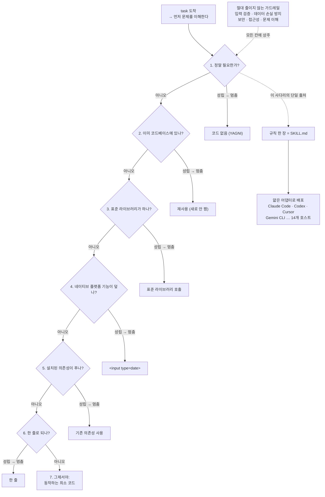
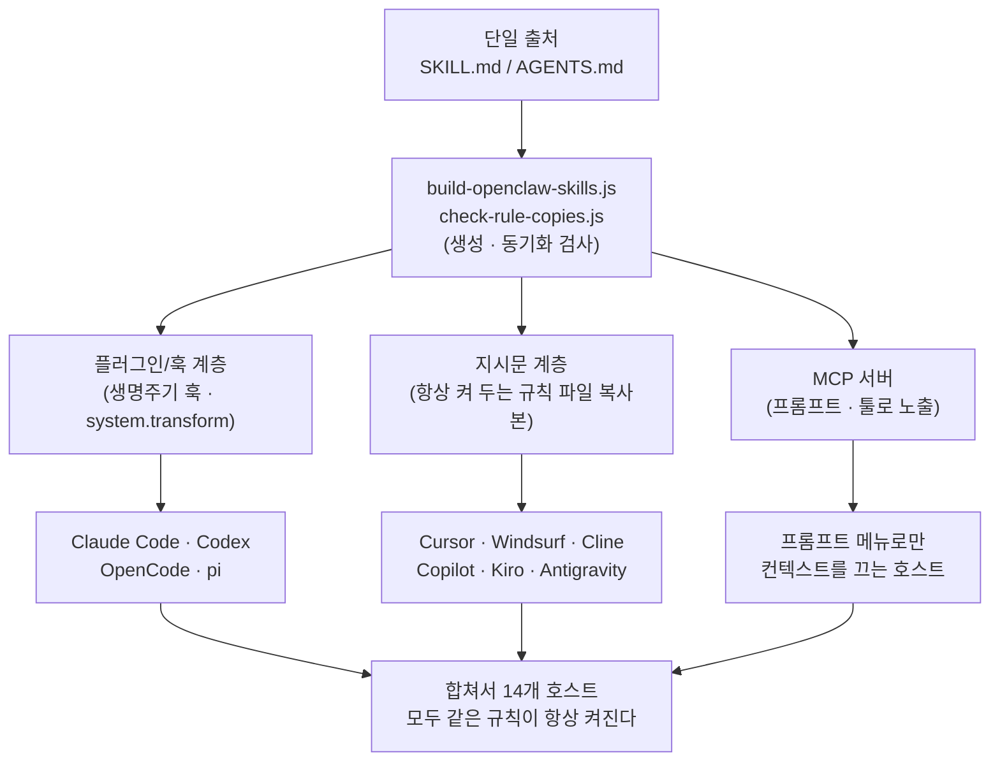

<figure class="post-figure post-figure--header">
<svg role="img" aria-label="머리를 묶은 시니어 오크 대장장이가 50줄짜리 거대한 부품 더미(date picker / cache class / abstraction)를 한 손으로 쓸어내 버리고, 모루 위에서 단 한 줄짜리 칼날 하나만 벼려 내미는 헤더 삽화 — 그 한 줄에는 <input type=date>가 새겨져 있다" viewBox="0 0 640 300" xmlns="http://www.w3.org/2000/svg">
  <title>게으른 시니어: 50줄 부품 더미를 쓸어내고 한 줄짜리 칼날만 벼린다</title>
  <!-- header caption strip -->
  <text x="320" y="30" text-anchor="middle" font-size="15" fill="currentColor" font-weight="700">안 쓴 코드가 최고의 코드</text>
  <text x="320" y="50" text-anchor="middle" font-size="11.5" fill="currentColor" opacity="0.6">50줄 부품 더미를 쓸어내고 → 한 줄을 벼린다</text>
  <!-- ground / anvil baseline -->
  <line x1="24" y1="248" x2="616" y2="248" stroke="currentColor" stroke-width="1.5" opacity="0.4"/>

  <!-- LEFT: the swept-away 50-line parts pile (toppling, being discarded) -->
  <g transform="rotate(-12 150 210)">
    <g fill="var(--bg-panel)" stroke="var(--accent-color)" stroke-width="2">
      <rect x="96"  y="196" width="116" height="14"/>
      <rect x="104" y="178" width="100" height="14"/>
      <rect x="92"  y="160" width="120" height="14"/>
      <rect x="110" y="142" width="92"  height="14"/>
      <rect x="100" y="124" width="108" height="14"/>
      <rect x="116" y="106" width="80"  height="14"/>
    </g>
    <g fill="var(--accent-color)" font-size="9" text-anchor="middle" opacity="0.9">
      <text x="154" y="206">date picker</text>
      <text x="154" y="188">cache class</text>
      <text x="152" y="170">abstraction</text>
      <text x="156" y="152">wrapper</text>
      <text x="154" y="134">+50 LOC</text>
    </g>
  </g>
  <!-- sweep motion lines (the smith brushes the pile aside) -->
  <g stroke="var(--accent-color)" stroke-width="2" stroke-linecap="round" opacity="0.5" fill="none">
    <path d="M214,120 q26,-6 50,2"/>
    <path d="M214,150 q30,-4 56,4"/>
    <path d="M214,180 q26,-2 50,6"/>
  </g>

  <!-- CENTER: the senior orc smith with a tied-back ponytail -->
  <g stroke="currentColor" stroke-width="2.5" fill="none" stroke-linecap="round" stroke-linejoin="round">
    <!-- head -->
    <circle cx="356" cy="120" r="20" fill="var(--orc-green)" stroke="currentColor"/>
    <!-- tied-back ponytail -->
    <path d="M338,114 q-22,-4 -30,8 q14,2 18,10" fill="var(--orc-green)" stroke="currentColor"/>
    <line x1="338" y1="113" x2="333" y2="118"/>
    <!-- tusks -->
    <path d="M349,132 l-3,6 M363,132 l3,6" stroke="var(--bone)"/>
    <!-- torso (apron) -->
    <path d="M340,140 L372,140 L380,210 L332,210 Z" fill="var(--bg-light)" stroke="currentColor"/>
    <!-- left arm sweeping the pile away -->
    <path d="M340,154 q-30,8 -54,2"/>
    <!-- right arm holding up the one-line blade -->
    <path d="M372,152 q34,-6 58,-22"/>
  </g>

  <!-- anvil under the smith -->
  <g fill="var(--steel)" stroke="currentColor" stroke-width="2">
    <path d="M330,222 L390,222 L384,236 L336,236 Z"/>
    <rect x="350" y="236" width="20" height="12"/>
  </g>

  <!-- RIGHT: the single forged one-line blade held aloft -->
  <g transform="rotate(-18 500 120)">
    <!-- blade body (one clean bar) -->
    <rect x="424" y="108" width="172" height="26" rx="3"
          fill="var(--bg-panel)" stroke="var(--secondary-color)" stroke-width="3"/>
    <!-- forge spark / edge glint -->
    <path d="M600,121 l16,-6 l-16,-1 l14,8 Z" fill="var(--gold)"/>
    <!-- the etched one line -->
    <text x="510" y="125" text-anchor="middle" font-size="12.5" fill="currentColor"
          font-weight="700" font-family="ui-monospace, monospace">&lt;input type=date&gt;</text>
  </g>
  <!-- "the browser already has one" tag under the blade -->
  <text x="512" y="166" text-anchor="middle" font-size="10" fill="currentColor" opacity="0.6">ponytail: browser has one</text>
</svg>
<figcaption>머리를 묶은(ponytail) 게으른 시니어는 50줄짜리 부품 더미(date picker · cache class · abstraction)를 쓸어내고, 모루 위에서 단 한 줄 — 플랫폼이 이미 가진 <code>&lt;input type=date&gt;</code> — 만 벼려 내민다. 게으름은 효율이지 부주의가 아니다.</figcaption>
</figure>

## 저장소 정보

> - **이름**: ponytail — *"He says nothing. He writes one line. It works."*
> - **저자**: Dietrich Gebert ([github.com/DietrichGebert](https://github.com/DietrichGebert))
> - **저장소**: [github.com/DietrichGebert/ponytail](https://github.com/DietrichGebert/ponytail)
> - **주요 언어**: JavaScript(훅·플러그인·테스트) + Python(벤치마크) · 규칙 본문은 Markdown
> - **라이선스**: MIT (README 표현으로 *"the shortest license that works"*)
> - **메타(조회 시점)**: 14개 에이전트 지원, 플러그인 버전 v4.x · 스타 수는 조회 시점 기준이며 변동

(코딩 에이전트를 **만들고 운영하는 실무** — 스킬·하니스·규칙 배포 — 에 해당하므로 Articles의 `AI-Engineering`에 담는다.)

## 한 줄 요약 (TL;DR)

ponytail은 "정말 필요한가 → 이미 있는가 → 표준 라이브러리가 하는가 → 플랫폼 기능이 있는가 → 설치된 의존성이 있는가 → 한 줄로 되는가 → 그제서야 최소 코드"라는 **7단계 사다리(ladder)** 한 장을, 14종의 코딩 에이전트(Claude Code, Codex, Cursor, Gemini CLI 등)에 **얇은 어댑터**로 주입해 항상 켜 두는 스킬 배포다. 핵심 가치는 코드가 아니라 *규칙 텍스트*이고, 그것을 정직한 agentic 벤치마크로 검증한다.

## 왜 이 글을 골랐나

대부분의 "AI 코딩 도구"는 **더 많이** 생성하는 쪽을 돕는다. ponytail은 정반대다. 에이전트가 과하게 만들지 못하도록 **덜 쓰게** 만드는 규율을 판다. 이 위키에는 이미 같은 결을 가진 글이 여럿 있다 — [Karpathy의 LLM 코딩 가이드라인](/2026/06/22/karpathy-llm-coding-guidelines.html)이 *Simplicity First*를 행동 지침으로 증류했고, [잘못된 추상화](/2026/06/22/the-wrong-abstraction.html)는 섣부른 추상화의 비용을, [직접 만들지 마세요](/2026/06/23/do-not-roll-your-own.html)는 브라우저가 이미 잘 하는 것을 자작하지 말라고 말한다. ponytail은 이 철학들을 **에이전트 안에서 실행 가능한 한 장의 규칙**으로 묶은 것에 가깝다. 그래서 "철학을 어떻게 운영 규율로 패키징하는가"의 좋은 사례 연구다.

여기에 더해, 이 저장소는 두 가지를 정직하게 보여 준다. 하나는 **벤치마크가 비판을 받고 스스로를 반증하도록 다시 설계된 과정**(아래 분석에서 다룸)이고, 다른 하나는 **하나의 행동을 14개 호스트로 이식하는 어댑터 패턴**이다. 둘 다 실무자가 가져갈 게 있다.

### 한눈에 보기

이 글의 척추는 하나다 — task가 들어오면 **7단계 사다리**를 위에서부터 내려오며 *처음으로 성립하는 칸에서 멈추고*, 그 칸에서 코드(또는 코드 없음)가 나온다. 옆에는 무엇을 짜든 **절대 줄이지 않는 가드레일**이 상주하고, 이 규칙 한 장(`SKILL.md`)이 14개 호스트에 얇은 어댑터로 배포된다.



이 도표가 글의 지도다 — 가운데 사다리(핵심 내용), 옆구리 가드레일(분석 2번 안전성 축), 아래 배포 구조(분석 3번 어댑터 패턴)가 각각 아래 절들로 펼쳐진다.

## 핵심 내용

### 무엇을 하는가 — 규칙 한 장이 곧 제품

ponytail의 본체는 코드가 아니라 `skills/ponytail/SKILL.md` 한 장이다. 이 문서가 에이전트에게 "너는 게으른 시니어 개발자다 — 게으름은 효율이지 부주의가 아니다(*Lazy means efficient, not careless*)"라는 페르소나를 주고, 코드를 쓰기 전에 다음 **사다리**의 *처음으로 성립하는 칸에서 멈추라*고 지시한다.

```
1. 이게 존재할 필요가 있나?        → 없으면 건너뛴다 (YAGNI)
2. 이 코드베이스에 이미 있나?       → 다시 쓰지 말고 재사용
3. 표준 라이브러리가 하나?         → 쓴다
4. 네이티브 플랫폼 기능이 덮나?     → 쓴다
5. 설치된 의존성이 푸나?           → 쓴다 (새로 추가하지 않는다)
6. 한 줄로 되나?                  → 한 줄
7. 그제서야: 동작하는 최소 코드
```

가장 자주 인용되는 예시가 날짜 선택기다. 에이전트에게 date picker를 요청하면 보통 flatpickr를 설치하고 래퍼 컴포넌트와 스타일시트를 만들고 타임존 토론을 시작한다. ponytail이 켜져 있으면 사다리 4번(네이티브 플랫폼 기능)에서 멈춘다.

```html
<!-- ponytail: browser has one -->
<input type="date">
```

중요한 건 이게 "토큰 최소화"가 아니라는 점이다. README가 못 박는다 — *"The rule was never 'fewest tokens.'"* 코드가 작아지는 건 그게 필요하기 때문이지 골프 치듯 줄였기 때문이 아니다. 그래서 `lite / full / ultra` 세 단계 강도가 있고(기본 `full`), `/ponytail-review`(현재 diff에서 지울 것 목록 반환), `/ponytail-audit`(저장소 전체 과설계 감사), `/ponytail-debt`(미뤄 둔 `ponytail:` 단축을 장부로 수확) 같은 명령이 딸려 온다.

### 어떻게 동작하는가 — 항상 켜 두는 주입 + 얇은 어댑터

규칙 한 장을 14개 호스트에 어떻게 "항상 켜 두는가"가 이 프로젝트의 엔지니어링 핵심이다. Claude Code/Codex의 경우, `SessionStart` 생명주기 훅 두 개가 매 세션 시작 시 동작한다. `ponytail-activate.js`는 (1) `~/.claude/.ponytail-active` 플래그 파일을 쓰고, (2) 현재 강도에 맞게 필터링한 규칙 본문을 *숨은 컨텍스트*로 주입하며, (3) 상태줄(statusline) 설정이 없으면 설정을 돕도록 에이전트를 슬쩍 찌른다.

흥미로운 설계 결정 하나는 **규칙 본문을 SKILL.md에서 직접 읽어 강도별로 필터링**한다는 점이다(`ponytail-instructions.js`). 강도에 따라 달라지는 부분은 사실상 강도 표의 행과 워크드 예시뿐이라, 코드는 "라벨이 모드 이름(lite/full/ultra)인 줄만 골라낸다"는 한 줄짜리 휴리스틱으로 그 부분만 추려 낸다. 일반 규칙 불릿은 라벨이 모드가 아니므로 그대로 보존된다 — 규칙의 **단일 출처(single source of truth)는 언제나 SKILL.md 한 장**이고, 훅은 그걸 얇게 가공만 한다. SKILL.md를 읽지 못하면 같은 내용을 손으로 박아 둔 fallback 문자열로 내려간다.

호스트마다 주입 지점이 다르기 때문에 어댑터도 다르다. `docs/agent-portability.md`가 이 매핑을 정리해 둔다.

- **플러그인/훅 계층**(Claude Code, Codex, OpenCode, pi): 생명주기 훅이나 매 턴 `system.transform`으로 규칙을 주입하고 `/ponytail` 명령·모드 전환을 더한다.
- **지시문 계층**(Cursor `.cursor/rules/`, Windsurf, Cline, Copilot `.github/copilot-instructions.md`, Kiro `.kiro/steering/`, Antigravity): 호스트가 "항상 켜 두는 규칙 파일"만 지원하므로, `AGENTS.md`와 동기화된 압축 규칙 텍스트 한 장을 복사해 둔다.
- **MCP 서버**(`ponytail-mcp/`): 프롬프트 메뉴를 통해서만 컨텍스트를 끌어올 수 있는 호스트를 위해, 같은 규칙을 stdio MCP의 프롬프트와 툴로 노출한다.

여기서 README가 명시한 *어댑터 규칙*이 핵심이다 — *"Keep adapters thin."* 호스트가 스킬/훅을 지원하면 기존 `skills/`·`hooks/` 파일을 가리키게만 하고, 지시문만 지원하면 복사본을 `AGENTS.md`와 맞춘다. 그래서 `scripts/check-rule-copies.js`가 복사본이 어긋났는지 검사하고, OpenClaw용 스킬 패키지는 `skills/`에서 *생성*되며(`build-openclaw-skills.js`), 어느 한쪽이 낡으면 테스트가 깨진다. 같은 규칙이 14곳에 흩어져도 한 곳만 손대면 되도록 묶어 둔 셈이다.

이 배포 구조를 한 장으로 보면 이렇다 — **단일 출처 한 곳**에서 규칙이 나와, 호스트가 무엇을 지원하느냐에 따라 **세 계층의 얇은 어댑터**로 갈라지고, 빌드·검사 스크립트가 그 사본들을 한 곳에 묶어 둔다.



핵심은 화살표의 방향이다 — 사본은 여러 갈래지만 *원본은 하나*이고, 어긋나면 검사 스크립트가 테스트를 깬다. 프롬프트·규칙을 "txt 흩뿌리기"가 아니라 버전 관리되는 빌드 산출물로 다루는 모습이다.

### 구조 — 본체는 얇고, 검증은 두껍다

저장소를 직접 읽고 본 구조는 "본체는 얇고 검증은 두껍다"로 요약된다.

- **규칙 본체**: `skills/*/SKILL.md`(ponytail, -review, -audit, -debt, -gain, -help)와 압축판 `AGENTS.md`.
- **런타임 글루**: `hooks/`의 Node.js 훅 몇 개(`-activate`, `-config`, `-runtime`, `-instructions`)와 상태줄 스크립트(`.sh`/`.ps1`). 의존성을 거의 두지 않고 `node`만 PATH에 있으면 되며, 없으면 "항상 켜 두는 주입만 조용히 꺼지고 스킬은 동작한다"고 한다.
- **어댑터들**: `.claude-plugin/`, `.codex-plugin/`, `.opencode/`, `pi-extension/`, `gemini-extension.json`, `.cursor/` … 호스트별 디렉토리.
- **검증**: `tests/`의 다수 테스트와 `benchmarks/`(JS의 단발 정확성·LOC 측정 + Python의 agentic 러너 `benchmarks/agentic/`). 마크다운 53개 중 상당수가 `benchmarks/results/`의 날짜별 실험 기록과 `examples/`의 before/after 사례다.

규칙 한 장짜리 프로젝트치고 테스트와 벤치마크 기록이 두꺼운 게 인상적이다. "덜 쓰자"를 파는 프로젝트가 정작 자기 주장을 측정으로 떠받친다.

## 분석과 인사이트

여기서부터는 원문 정리가 아니라 내 관점이다.

**1) 가장 흥미로운 건 벤치마크의 정직성이다.** 초기 ponytail은 단발(single-shot) 벤치마크로 "80–94% 코드 감소"를 자랑했다. 그런데 issue #126에서 Colin Eberhardt가 네 가지를 지적했다 — (a) 단발 완성은 에이전트의 실제 사용 방식이 아니다, (b) 베이스라인이 수다스러운 맨몸 모델이라 "답변 줄 수"에 산문·옵션이 섞여 부풀려졌다, (c) "한 줄 선호"가 안전장치를 깎을 수 있다, (d) 일곱 단어짜리 짧은 프롬프트로도 같은 효과가 날 수 있다. 저장소는 이 비판을 받아들여 **자기 주장을 반증할 수 있도록** 벤치마크를 다시 지었다(`benchmarks/results/2026-06-18-agentic.md`). 실제 오픈소스 레포(FastAPI + React 템플릿)에서 헤드리스 Claude Code 세션이 실제 티켓을 처리하게 하고, 베이스라인을 "스킬 없는 동일 에이전트"로 바꾸고, `git diff` 추가 줄로 LOC를 세고, **생성된 코드를 적대적 입력에 직접 실행해 안전성**까지 측정했다. 그 결과 평균 코드 감소는 −54%로 내려갔고(과설계 함정이 있는 곳에서 −94%, 이미 최소인 백엔드 CRUD에선 거의 0%), 정직하게 *작아진* 수치를 채택했다. 심지어 **자기 벤치마크가 베이스라인까지 몰래 ponytail을 돌리던 오염 버그**를 발견해 고친 과정도 적어 두었다. 도구의 효과보다 이 *방법론적 자기검증* 자체가 더 배울 만하다 — 이 위키의 [영원한 Sloptember](/2026/06/22/the-eternal-sloptember.html)가 "자기검증으로 가설을 스스로 기각"하는 태도를 높이 산 것과 정확히 같은 결의 미덕이다.

**2) 핵심 통찰: "한 줄 선호" 프롬프트와 ponytail은 다르다.** 벤치마크의 진짜 메시지는 안전성 축에 있다. Colin의 일곱 단어 프롬프트(`yagni-oneliner`)는 가장 적은 줄을 쓰지만, 신뢰 경계에서 경로 순회 검사를 빼먹어 4번 중 1번 안전하지 못했다(safe 95%). ponytail은 같은 작업에서 약 3줄을 *더* 썼는데, 그 3줄이 바로 경로 순회 가드였고 4/4 안전했다. 규칙에 "신뢰 경계의 입력 검증·데이터 손실 방지·보안·접근성은 절대 줄이지 않는다"가 못 박혀 있기 때문이다. 즉 ponytail의 진짜 주장은 "덜 쓰자"가 아니라 **"판단 있는 게으름(lazy, not negligent)"** 이다. 짧은 프롬프트는 그 판단이 없어서 가드를 깎는다. 이게 "스킬 한 장"이 "프롬프트 한 줄"보다 나은 이유를 데이터로 보여 준다.

**3) 어댑터 패턴은 그 자체로 좋은 엔지니어링 사례다.** 하나의 행동을 14개 호스트로 이식하면서 *복사본이 어긋나지 않게* 테스트로 강제하는 구조는, 규칙·프롬프트를 자산으로 관리하려는 팀이 그대로 베낄 만하다. 단일 출처(SKILL.md/AGENTS.md) → 생성·검사 스크립트 → 호스트별 얇은 어댑터. 프롬프트 엔지니어링이 "txt 파일 흩뿌리기"에서 "버전 관리되는 빌드 산출물"로 올라가는 모습이다.

**4) 비판적으로 볼 지점.** 이건 *모델의 협조에 의존하는 지시문*이다 — 컨텍스트로 주입한 규칙을 모델이 따른다는 전제이고, 강제(enforcement)가 아니다. 그래서 README도 솔직하게 적는다 — 추론에 thinking 토큰을 많이 쓰는 모델(예: GPT-5.5)에선 비용·지연이 오히려 늘 수 있고, 벤치마크도 Haiku 4.5 한 모델뿐이라 큰 모델에선 과설계 격차가 좁아질 수 있다고. 또 안전성 결과는 "20번 중 1번 차이"의 *바닥값*이지 보안의 증명이 아니다. 컨셉 자체(긴 머리 묶은 까칠한 시니어)는 밈에 가깝지만, 그 밈 아래의 측정과 어댑터 구조는 진지하다. 밈으로 주목을 끌고 데이터로 신뢰를 사는 전형적인 OSS 마케팅이라는 점도 같이 봐 둘 만하다.

## 적용 포인트

- **규칙은 단일 출처로 두고 복사본을 검사로 강제하라.** Cursor 룰, `CLAUDE.md`/`AGENTS.md`, Copilot 지시문을 따로 손으로 관리하지 말고, 한 곳에서 생성·동기화하고 어긋나면 CI가 깨지게 하라(`check-rule-copies.js` 패턴).
- **"덜 쓰자"에 가드레일을 명시하라.** 간결함을 추구하되 *"신뢰 경계 입력 검증·데이터 손실 방지·보안·접근성·문제 이해는 절대 줄이지 않는다"* 를 규칙에 박아 두면, 모델이 안전장치를 깎는 실패 모드를 줄일 수 있다.
- **자기 도구의 효과를 정직한 베이스라인으로 측정하라.** "맨몸 모델 vs 우리 도구"가 아니라 "같은 에이전트 ± 스킬"로, 단발이 아니라 실제 레포의 실제 티켓으로, 그리고 *주장을 반증할 수 있도록* 설계하라.
- **사다리를 그대로 빌려라.** 코드를 쓰기 전 "존재 필요? → 이미 있나? → 표준 라이브러리? → 플랫폼 기능? → 설치된 의존성? → 한 줄? → 최소 코드" 순으로 멈추는 체크리스트는 에이전트뿐 아니라 사람 리뷰에도 그대로 쓸 수 있다.
- **의도한 단축은 `ponytail:` 같은 마커로 남기고 장부로 수확하라.** 단축의 *한계와 업그레이드 경로*를 주석에 적어 두면 "나중에"가 "never"가 되지 않는다.

## 마무리

ponytail은 "긴 머리 묶은 까칠한 시니어"라는 밈으로 포장돼 있지만, 그 아래는 진지하다. 핵심 자산은 코드가 아니라 *7단계 사다리 규칙 한 장*이고, 그것을 14개 에이전트에 얇은 어댑터로 항상 켜 두며, 자기 주장을 정직하게 — 심지어 스스로를 반증하려고 — 측정한다. 가장 큰 교훈은 도구 자체보다 두 가지 방법론이다. 프롬프트·규칙을 **단일 출처에서 빌드·검사·배포하는 어댑터 패턴**, 그리고 **자기 효과를 정직한 베이스라인과 안전성 축으로 검증하는 벤치마크 태도**. "덜 쓰자"는 슬로건은 흔하지만, 그 슬로건에 *판단의 가드레일*을 달고 *측정으로 떠받친* 사례는 드물다.

### 더 읽어보기

- [ponytail — DietrichGebert/ponytail (GitHub)](https://github.com/DietrichGebert/ponytail) — 원 저장소
- [Agentic 벤치마크 풀 라이트업 (저장소 내 문서)](https://github.com/DietrichGebert/ponytail/blob/main/benchmarks/results/2026-06-18-agentic.md) — 비판을 받아 다시 지은 정직한 측정
- [Karpathy의 LLM 코딩 가이드라인](/2026/06/22/karpathy-llm-coding-guidelines.html) — *Simplicity First*를 행동 지침으로 증류한 같은 결의 스킬
- [잘못된 추상화: 중복보다 더 비싼 죄](/2026/06/22/the-wrong-abstraction.html) — ponytail이 사다리 1·2번에서 막으려는 바로 그 함정
- [직접 만들지 마세요](/2026/06/23/do-not-roll-your-own.html) — "플랫폼이 이미 잘 하는 걸 자작하지 마라"(사다리 4번)의 인간판 버전
- [영원한 Sloptember](/2026/06/22/the-eternal-sloptember.html) — 자기검증으로 가설을 기각하는, ponytail 벤치마크와 같은 결의 정직함
- [코드가 공짜가 된 시대의 '취향(taste)'](/2026/06/19/ai-engineer-taste.html) — 무엇을 *덜* 만들지 고르는 판단이 왜 값진가
