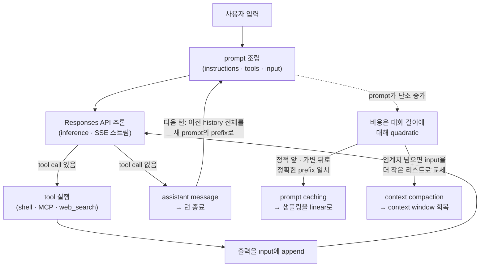

<figure class="post-figure post-figure--header">
<svg role="img" aria-label="Codex agent loop 다이어그램: 가운데 하니스(harness)가 오케스트레이터로 있고, 사용자 입력 → prompt 조립 → Responses API 추론 → tool call 실행 → 출력을 prompt에 append → 재추론으로 도는 원형 루프, assistant message로 턴이 종료된다." viewBox="0 0 720 440" xmlns="http://www.w3.org/2000/svg">
  <title>Codex agent loop — 하니스가 가운데서 LLM과 도구를 부리는 원형 루프</title>
  <defs>
    <marker id="loop-arrow" viewBox="0 0 10 10" refX="8" refY="5" markerWidth="7" markerHeight="7" orient="auto-start-reverse">
      <path d="M0 0 L10 5 L0 10 z" fill="currentColor"/>
    </marker>
  </defs>

  <!-- circular loop track -->
  <circle cx="360" cy="225" r="158" fill="none" stroke="currentColor" stroke-width="2" stroke-dasharray="3 7" opacity="0.5"/>

  <!-- five arcs of the loop, drawn between the node positions on r=158 -->
  <!-- node angles (deg, 0=right, CW): input 270(top), prompt 342, inference 54, tool 126, append 198 -->
  <g fill="none" stroke="currentColor" stroke-width="3" marker-end="url(#loop-arrow)">
    <path d="M404 75 A158 158 0 0 1 510 168"/>
    <path d="M516 287 A158 158 0 0 1 421 366"/>
    <path d="M299 366 A158 158 0 0 1 204 287"/>
    <path d="M210 168 A158 158 0 0 1 316 75"/>
  </g>

  <!-- central harness orchestrator -->
  <g>
    <rect x="278" y="186" width="164" height="78" rx="6" fill="var(--bg-light)" stroke="var(--accent-color)" stroke-width="3"/>
    <text x="360" y="214" text-anchor="middle" font-family="var(--font-body)" font-size="20" font-weight="700" fill="var(--accent-color)">하니스</text>
    <text x="360" y="238" text-anchor="middle" font-family="var(--font-body)" font-size="12" fill="currentColor">harness</text>
    <text x="360" y="254" text-anchor="middle" font-family="var(--font-body)" font-size="11" fill="currentColor" opacity="0.75">오케스트레이터</text>
  </g>

  <!-- thin spokes: harness drives LLM (inference) and tools -->
  <g stroke="var(--secondary-color)" stroke-width="1.5" stroke-dasharray="2 5" opacity="0.8">
    <line x1="442" y1="210" x2="538" y2="225"/>
    <line x1="278" y1="240" x2="182" y2="262"/>
  </g>

  <!-- LOOP NODE: user input (top) -->
  <g>
    <rect x="296" y="34" width="128" height="42" rx="5" fill="var(--bg-panel)" stroke="currentColor" stroke-width="2"/>
    <text x="360" y="52" text-anchor="middle" font-family="var(--font-body)" font-size="13" font-weight="700" fill="currentColor">① 사용자 입력</text>
    <text x="360" y="68" text-anchor="middle" font-family="var(--font-body)" font-size="10" fill="currentColor" opacity="0.7">user input</text>
  </g>

  <!-- LOOP NODE: build prompt (right-top) -->
  <g>
    <rect x="512" y="146" width="150" height="44" rx="5" fill="var(--bg-panel)" stroke="currentColor" stroke-width="2"/>
    <text x="587" y="165" text-anchor="middle" font-family="var(--font-body)" font-size="13" font-weight="700" fill="currentColor">② prompt 조립</text>
    <text x="587" y="181" text-anchor="middle" font-family="var(--font-body)" font-size="10" fill="currentColor" opacity="0.7">instructions·tools·input</text>
  </g>
  <!-- LLM inference label on the spoke -->
  <text x="587" y="225" text-anchor="middle" font-family="var(--font-body)" font-size="11" font-weight="700" fill="var(--secondary-color)">LLM</text>

  <!-- LOOP NODE: inference (right-bottom) -->
  <g>
    <rect x="498" y="262" width="164" height="44" rx="5" fill="var(--bg-panel)" stroke="currentColor" stroke-width="2"/>
    <text x="580" y="281" text-anchor="middle" font-family="var(--font-body)" font-size="13" font-weight="700" fill="currentColor">③ 추론 (inference)</text>
    <text x="580" y="297" text-anchor="middle" font-family="var(--font-body)" font-size="10" fill="currentColor" opacity="0.7">Responses API · SSE</text>
  </g>

  <!-- LOOP NODE: tool call (bottom) -->
  <g>
    <rect x="296" y="374" width="128" height="44" rx="5" fill="var(--bg-panel)" stroke="currentColor" stroke-width="2"/>
    <text x="360" y="393" text-anchor="middle" font-family="var(--font-body)" font-size="13" font-weight="700" fill="currentColor">④ tool call 실행</text>
    <text x="360" y="409" text-anchor="middle" font-family="var(--font-body)" font-size="10" fill="currentColor" opacity="0.7">shell · MCP · web_search</text>
  </g>

  <!-- LOOP NODE: append result (left-bottom) -->
  <g>
    <rect x="58" y="262" width="160" height="44" rx="5" fill="var(--bg-panel)" stroke="currentColor" stroke-width="2"/>
    <text x="138" y="281" text-anchor="middle" font-family="var(--font-body)" font-size="13" font-weight="700" fill="currentColor">⑤ 출력을 append</text>
    <text x="138" y="297" text-anchor="middle" font-family="var(--font-body)" font-size="10" fill="currentColor" opacity="0.7">input에 붙여 재추론</text>
  </g>

  <!-- exit: turn ends on an assistant message -->
  <g>
    <line x1="442" y1="225" x2="556" y2="225" stroke="var(--secondary-color)" stroke-width="0"/>
    <rect x="500" y="356" width="200" height="58" rx="5" fill="var(--bg-light)" stroke="var(--secondary-color)" stroke-width="2.5"/>
    <text x="600" y="378" text-anchor="middle" font-family="var(--font-body)" font-size="13" font-weight="700" fill="var(--secondary-color)">assistant message</text>
    <text x="600" y="396" text-anchor="middle" font-family="var(--font-body)" font-size="11" fill="currentColor">→ 턴 종료</text>
    <text x="600" y="410" text-anchor="middle" font-family="var(--font-body)" font-size="10" fill="currentColor" opacity="0.7">제어권을 사용자에게</text>
  </g>
  <!-- exit arrow from the loop (inference → assistant when no more tool calls) -->
  <path d="M564 306 Q588 330 595 354" fill="none" stroke="var(--secondary-color)" stroke-width="2.5" stroke-dasharray="4 4" marker-end="url(#loop-arrow)"/>
  <text x="640" y="330" text-anchor="middle" font-family="var(--font-body)" font-size="9.5" fill="var(--secondary-color)">tool call 없음</text>
</svg>
<figcaption>Codex agent loop — 사용자 입력에서 출발해 prompt 조립 → 추론 → tool call → 출력 append → 재추론으로 도는 원형 루프. 가운데 하니스가 LLM과 도구를 부리는 오케스트레이터이며, 모델이 더 이상 tool call을 내지 않으면 assistant message로 턴이 종료된다.</figcaption>
</figure>

## 원문 정보

> - **제목**: Unrolling the Codex agent loop
> - **출처**: OpenAI Engineering 블로그 · Michael Bolin (Member of the Technical Staff) ([openai.com](https://openai.com/ko-KR/index/unrolling-the-codex-agent-loop/))
> - **발행**: 2026-01-23 · 약 12분 분량
> - **원문 링크**: <https://openai.com/ko-KR/index/unrolling-the-codex-agent-loop/>

코딩 에이전트를 "만들고 운영하는" 쪽의 1차 자료라서 Articles의 `AI-Engineering`에 담는다. Codex 하니스가 LLM을 어떻게 호출하고, 컨텍스트를 어떻게 짜고 관리하는지를 만든 사람이 직접 코드·JSON 레벨로 펼쳐 보인 글이다.

## 한 줄 요약 (TL;DR)

코딩 에이전트의 심장은 모델이 아니라 **agent loop** — 즉 사용자 입력으로 prompt를 조립하고, 모델을 추론(inference)시키고, 모델이 요청한 tool call을 실행해 그 출력을 다시 prompt에 붙여 재질의하는 사이클 — 이며, Codex CLI 하니스는 이 루프를 **stateless**하게 돌리면서 **prompt caching**(정확한 prefix 일치)과 **context compaction**으로 본질적인 quadratic 비용을 길들인다.

## 왜 이 글을 골랐나

"에이전트를 잘 쓰는 법"을 다룬 글은 많지만, **하니스가 안에서 실제로 무엇을 하는지**를 만든 사람이 코드·JSON·HTTP 레벨까지 내려가 보여 주는 글은 드물다. 이 위키에서 [신뢰할 수 있는 Agentic AI 시스템](/2026/06/19/reliable-agentic-ai-systems.html)이 "context engineering과 harness engineering이 신뢰성의 두 축"이라고 개념적으로 짚었고, [Loop Engineering](/2026/06/19/loop-engineering.html)이 "에이전트를 프롬프트하지 말고 루프를 설계하라"고 주장했다면, 이 글은 그 **루프의 내부 구현을 실물로 해부**한다. 추상적인 "컨텍스트 엔지니어링"이라는 말이 실제로는 어떤 JSON 항목을 어떤 순서로 쌓고, 어디서 캐시가 깨지고, 어떻게 압축되는지로 환산되는 걸 볼 수 있다는 점에서 읽을 가치가 크다.

용어 정리 하나: OpenAI에서 "Codex"는 Codex CLI·Codex Cloud·VS Code 확장을 아우르는 제품군이고, 이 글이 다루는 건 그 모두의 기반이 되는 **Codex 하니스**(core agent loop + 실행 로직)다. 글에서는 편의상 "Codex"와 "Codex CLI"를 섞어 쓴다.

## 핵심 내용

아래 한 장이 이 글의 척추다 — 루프가 도는 동안 prompt가 **단조 증가**하고, 그래서 비용이 **quadratic**이 되며, 이를 **prompt caching**(정확한 prefix 일치)과 **context compaction**으로 길들이는 사슬이다.

### agent loop란 무엇인가

모든 AI 에이전트의 한가운데에는 agent loop가 있다. 단순화하면 이렇게 돈다.

1. 에이전트가 **사용자 입력**을 받아 모델에 보낼 텍스트 지시문, 곧 **prompt**를 준비한다.
2. 그 prompt를 모델에 보내 응답을 생성시킨다. 이 추론(inference) 과정에서 텍스트는 먼저 **input token**(모델 어휘를 가리키는 정수) 시퀀스로 변환되고, 이 토큰으로 모델을 샘플링해 **output token** 시퀀스를 만든 뒤 다시 텍스트로 되돌린다. 토큰이 점진적으로 생성되기 때문에 많은 LLM 앱이 스트리밍 출력을 보여 줄 수 있다.
3. 추론 결과로 모델은 둘 중 하나를 낸다 — (1) 사용자에게 줄 **최종 응답**, 또는 (2) 에이전트가 대신 수행할 **tool call**(예: "`ls`를 실행하고 출력을 보고하라"). (2)라면 에이전트가 그 도구를 실행하고 **출력을 prompt에 append**한 뒤, 이 새 정보를 반영해 모델을 다시 질의한다.
4. 모델이 더 이상 tool call을 내지 않고 사용자용 메시지(OpenAI 모델에선 **assistant message**)를 낼 때까지 이 과정이 반복된다.

소프트웨어 에이전트의 진짜 출력은 assistant message 그 자체가 아니라 **로컬에 쓰고 고친 코드**인 경우가 많다는 지적이 인상적이다. 그럼에도 모든 턴은 "요청하신 architecture.md를 추가했습니다" 같은 assistant message로 끝나며, 이것이 루프의 **종료 상태**를 신호한다. 에이전트 관점에서 일이 끝났고 제어권이 사용자에게 돌아간다는 뜻이다.

사용자 입력에서 에이전트 응답까지의 이 여정 하나를 대화의 **한 턴(turn)**(Codex에선 thread)이라 부른다. 한 턴 안에 추론과 tool call의 반복이 여러 번 들어갈 수 있다. 그리고 결정적으로, **기존 대화에 새 메시지를 보낼 때마다 이전 턴들의 메시지와 tool call을 포함한 대화 history 전체가 새 턴의 prompt에 들어간다.** 즉 대화가 길어질수록 모델을 샘플링하는 prompt도 길어진다. 이 길이가 중요한 건 모든 모델에 **context window**(한 번의 추론에 쓸 수 있는 최대 토큰 수, 입력+출력 합산)가 있기 때문이다. 에이전트가 한 턴에 수백 번 tool call을 하다 context window를 소진할 수도 있으니, 그 관리가 에이전트의 핵심 책무가 된다.

### Model inference — Responses API로 루프를 돌린다

Codex CLI는 추론을 위해 **Responses API**에 HTTP 요청을 보낸다. 엔드포인트는 설정 가능해서, Responses API를 구현한 어떤 엔드포인트와도 쓸 수 있다.

- ChatGPT 로그인으로 쓸 때: `https://chatgpt.com/backend-api/codex/responses`
- API 키 인증으로 OpenAI 호스팅 모델을 쓸 때: `https://api.openai.com/v1/responses`
- `--oss`로 ollama·LM Studio에서 gpt-oss를 로컬 구동할 때: 기본 `http://localhost:11434/v1/responses`
- Azure 같은 클라우드 제공자가 호스팅하는 Responses API도 사용 가능

엔드포인트가 추상화되어 있다는 게 포인트다. 하니스 입장에서 모델 추론은 "Responses API 규약을 따르는 HTTP 호출"로 일반화되어, 같은 agent loop가 클라우드 모델이든 로컬 오픈모델이든 동일하게 돈다.

### 첫 prompt를 조립하기 — instructions · tools · input

<figure class="post-figure">
<svg role="img" aria-label="초기 prompt의 항목 리스트 레이아웃: 서버가 순서를 정하는 앞쪽 세 항목(system·tools·instructions)에 이어 클라이언트가 짜는 input 리스트(샌드박스 permissions developer 메시지, 선택 developer_instructions, AGENTS.md/skills user 누적, environment_context user, 마지막에 실제 사용자 메시지)가 위에서 아래로 쌓인다. 위쪽(앞)은 정적이라 캐시 prefix가 되고, 아래쪽(뒤)으로 갈수록 가변이다." viewBox="0 0 700 540" xmlns="http://www.w3.org/2000/svg">
  <title>초기 prompt 조립 — role이 매겨진 항목 리스트와 정적(앞)→가변(뒤) 캐시 축</title>
  <defs>
    <marker id="axis-arrow" viewBox="0 0 10 10" refX="8" refY="5" markerWidth="7" markerHeight="7" orient="auto">
      <path d="M0 0 L10 5 L0 10 z" fill="currentColor"/>
    </marker>
  </defs>

  <!-- left axis: static (front) = cache prefix → variable (back) -->
  <line x1="44" y1="58" x2="44" y2="500" stroke="currentColor" stroke-width="2.5" marker-end="url(#axis-arrow)"/>
  <text x="30" y="120" text-anchor="middle" font-family="var(--font-body)" font-size="12.5" font-weight="700" fill="var(--secondary-color)" transform="rotate(-90 30 120)">정적(앞) = 캐시 prefix</text>
  <text x="30" y="430" text-anchor="middle" font-family="var(--font-body)" font-size="12.5" font-weight="700" fill="var(--accent-color)" transform="rotate(-90 30 430)">가변(뒤)</text>

  <!-- header: server-decided order, server-controlled content -->
  <text x="92" y="40" font-family="var(--font-body)" font-size="13" font-weight="700" fill="currentColor">▸ 서버가 순서 결정 — 앞쪽 세 항목</text>

  <!-- row 1: system (server controls content) -->
  <rect x="92" y="50" width="576" height="46" rx="5" fill="var(--bg-sunken)" stroke="var(--primary-color)" stroke-width="2"/>
  <text x="108" y="71" font-family="var(--font-body)" font-size="13" font-weight="700" fill="var(--primary-color)">system</text>
  <text x="108" y="88" font-family="var(--font-body)" font-size="11" fill="currentColor" opacity="0.8">서버가 내용·순서를 통제</text>
  <text x="652" y="79" text-anchor="end" font-family="var(--font-body)" font-size="10.5" fill="currentColor" opacity="0.65">role 우선순위 최상위</text>

  <!-- row 2: tools (client) -->
  <rect x="92" y="102" width="576" height="42" rx="5" fill="var(--bg-light)" stroke="currentColor" stroke-width="2"/>
  <text x="108" y="121" font-family="var(--font-body)" font-size="13" font-weight="700" fill="currentColor">tools</text>
  <text x="108" y="137" font-family="var(--font-body)" font-size="11" fill="currentColor" opacity="0.8">CLI · Responses API · MCP 도구를 한 스키마로</text>
  <text x="652" y="127" text-anchor="end" font-family="var(--font-body)" font-size="10.5" fill="var(--secondary-color)">클라이언트가 내용 결정</text>

  <!-- row 3: instructions (client) -->
  <rect x="92" y="150" width="576" height="42" rx="5" fill="var(--bg-light)" stroke="currentColor" stroke-width="2"/>
  <text x="108" y="169" font-family="var(--font-body)" font-size="13" font-weight="700" fill="currentColor">instructions</text>
  <text x="108" y="185" font-family="var(--font-body)" font-size="11" fill="currentColor" opacity="0.8">모델별 base_instructions / model_instructions_file</text>
  <text x="652" y="175" text-anchor="end" font-family="var(--font-body)" font-size="10.5" fill="var(--secondary-color)">클라이언트가 내용 결정</text>

  <!-- divider: input list begins -->
  <text x="92" y="222" font-family="var(--font-body)" font-size="13" font-weight="700" fill="currentColor">▸ input 리스트 — 사용자 메시지 앞에 먼저 쌓는 항목</text>

  <!-- input 1: developer = sandbox / permissions -->
  <rect x="92" y="232" width="576" height="44" rx="5" fill="var(--bg-light)" stroke="currentColor" stroke-width="2"/>
  <rect x="92" y="232" width="7" height="44" rx="0" fill="var(--primary-color)"/>
  <text x="112" y="252" font-family="var(--font-body)" font-size="12.5" font-weight="700" fill="currentColor">① developer — 샌드박스 설명</text>
  <text x="112" y="268" font-family="var(--font-body)" font-size="11" fill="currentColor" opacity="0.8">&lt;permissions instructions&gt; · shell 권한 · 쓰기 가능 폴더</text>

  <!-- input 2: (optional) developer_instructions -->
  <rect x="92" y="282" width="576" height="40" rx="5" fill="var(--bg-light)" stroke="currentColor" stroke-width="2" stroke-dasharray="5 4"/>
  <rect x="92" y="282" width="7" height="40" rx="0" fill="var(--primary-color)"/>
  <text x="112" y="300" font-family="var(--font-body)" font-size="12.5" font-weight="700" fill="currentColor">② developer — developer_instructions <tspan fill="currentColor" opacity="0.6" font-weight="400">(선택)</tspan></text>
  <text x="112" y="315" font-family="var(--font-body)" font-size="11" fill="currentColor" opacity="0.8">config.toml 값</text>

  <!-- input 3: (optional) user = AGENTS.md / skills, accumulated -->
  <rect x="92" y="328" width="576" height="48" rx="5" fill="var(--bg-light)" stroke="currentColor" stroke-width="2" stroke-dasharray="5 4"/>
  <rect x="92" y="328" width="7" height="48" rx="0" fill="var(--secondary-color)"/>
  <text x="112" y="347" font-family="var(--font-body)" font-size="12.5" font-weight="700" fill="currentColor">③ user — user instructions <tspan fill="currentColor" opacity="0.6" font-weight="400">(선택)</tspan></text>
  <text x="112" y="363" font-family="var(--font-body)" font-size="11" fill="currentColor" opacity="0.8">AGENTS.md 누적 · skills 메타데이터 — 더 구체적인 지시를 뒤에</text>

  <!-- input 4: user = environment_context -->
  <rect x="92" y="382" width="576" height="42" rx="5" fill="var(--bg-light)" stroke="currentColor" stroke-width="2"/>
  <rect x="92" y="382" width="7" height="42" rx="0" fill="var(--secondary-color)"/>
  <text x="112" y="401" font-family="var(--font-body)" font-size="12.5" font-weight="700" fill="currentColor">④ user — &lt;environment_context&gt;</text>
  <text x="112" y="417" font-family="var(--font-body)" font-size="11" fill="currentColor" opacity="0.8">cwd · 사용자 셸</text>

  <!-- input 5: user = the actual user message -->
  <rect x="92" y="430" width="576" height="48" rx="5" fill="var(--bg-sunken)" stroke="var(--accent-color)" stroke-width="2.5"/>
  <rect x="92" y="430" width="7" height="48" rx="0" fill="var(--accent-color)"/>
  <text x="112" y="450" font-family="var(--font-body)" font-size="12.5" font-weight="700" fill="var(--accent-color)">⑤ user — 실제 사용자 메시지</text>
  <text x="112" y="466" font-family="var(--font-body)" font-size="11" fill="currentColor" opacity="0.85">"Add an architecture diagram to the README.md" — 이 뒤로 대화가 자란다</text>
</svg>
<figcaption>초기 prompt의 "항목 리스트" 레이아웃. 앞쪽 세 항목(system·tools·instructions)은 서버가 순서를 정하고 그중 system 내용만 서버가 통제한다. 이어 input 리스트가 사용자 메시지 앞에 developer(샌드박스) → (선택) developer_instructions → (선택) user(AGENTS.md·skills) → user(environment_context) 순으로 쌓이고, 맨 뒤에 실제 사용자 메시지가 붙는다. 위(앞)일수록 정적이라 캐시 prefix가 되고, 아래(뒤)로 갈수록 가변이다 — 그래서 정적 콘텐츠를 앞에, 가변 콘텐츠를 뒤에 둔다.</figcaption>
</figure>

여기가 글의 백미다. 엔드유저는 모델을 샘플링하는 prompt를 글자 그대로 지정하지 않는다. 대신 여러 **input type**을 질의에 담아 보내면, **Responses API 서버**가 그 정보를 모델이 소비할 prompt로 구조화한다. prompt는 일종의 "항목 리스트(list of items)"라고 생각하면 된다.

이 리스트의 모든 항목에는 **role**이 붙고, role은 해당 내용에 얼마만큼의 가중치를 둘지를 가리킨다. 우선순위가 높은 순서로 **`system` › `developer` › `user` › `assistant`** 네 가지다. 즉 "컨텍스트 엔지니어링"이란 결국 *어떤 내용을 어떤 role로, 리스트의 어느 위치에 놓을지*를 설계하는 일이다.

Codex가 보내는 Responses API JSON 페이로드에서 주목할 세 필드는 이렇다.

- **`instructions`**: 모델 컨텍스트에 삽입되는 system(또는 developer) 메시지. Codex에선 `~/.codex/config.toml`의 `model_instructions_file`을 읽거나, 없으면 모델별 `base_instructions`를 쓴다. 모델별 지시문(예: `gpt-5.2-codex_prompt.md`)은 Codex 저장소에 들어 있고 CLI에 번들된다.
- **`tools`**: 모델이 응답을 생성하며 호출할 수 있는 도구 정의 리스트. ① Codex CLI가 제공하는 도구(예: 로컬에서 프로세스를 띄우는 기본 `shell` 도구, 계획용 `update_plan`), ② Responses API가 제공하는 도구(예: `web_search`), ③ 사용자가 보통 **MCP 서버**로 제공하는 도구(예: `mcp__weather__get-forecast`)가 한 스키마로 합쳐진다.
- **`input`**: 모델에 줄 텍스트·이미지·파일 입력 리스트.

`input`을 짜는 순서가 특히 구체적이다. Codex는 사용자 메시지를 붙이기 **전에** 다음 항목들을 먼저 넣는다.

1. `role=developer` 메시지 하나 — **샌드박스 설명**. 단, 이 샌드박스는 Codex가 제공하는 `shell` 도구에만 적용된다. MCP 서버 등 다른 도구는 Codex가 샌드박싱하지 않으며 각자 가드레일을 책임진다. 이 메시지는 CLI에 번들된 마크다운 조각(`workspace_write.md`, `on_request.md` 등)으로 만든 `<permissions instructions>` 블록 — 파일 권한·네트워크 접근 설명, 셸 명령 권한을 사용자에게 물을 시점, 쓰기 가능한 폴더 목록 — 으로 구성된다.
2. (선택) `role=developer` 메시지 — `config.toml`의 `developer_instructions` 값.
3. (선택) `role=user` 메시지 — **"user instructions"**. 단일 파일이 아니라 여러 출처에서 모으며, **더 구체적인 지시가 뒤에 오도록** 쌓는다.
   - `$CODEX_HOME`의 `AGENTS.override.md`·`AGENTS.md`
   - cwd의 Git/프로젝트 루트부터 cwd까지 각 폴더에서, 기본 32 KiB 한도 안에서 `AGENTS.override.md`·`AGENTS.md` 또는 `config.toml`의 `project_doc_fallback_filenames` 파일 내용
   - **skills**가 설정돼 있으면: 스킬에 대한 짧은 서문 + 각 스킬의 메타데이터 + 스킬 사용법 섹션
4. `role=user` 메시지 — 현재 작업 환경(cwd, 사용자 셸)을 적은 `<environment_context>` 블록.

이 모든 계산이 끝난 **뒤에야** 사용자 메시지를 붙여 대화를 시작한다. `input`의 각 원소는 `type`·`role`·`content`를 가진 JSON 객체다(예: 사용자 메시지는 `type:message, role:user, content:[{type:input_text, text:"Add an architecture diagram to the README.md"}]`).

Codex가 전체 JSON 페이로드를 완성하면 `config.toml`의 엔드포인트 설정에 맞는 `Authorization` 헤더를 붙여 HTTP POST를 보낸다. 그러면 OpenAI Responses API 서버가 이 JSON으로부터 모델용 prompt를 만든다. 여기서 **클라이언트/서버 책임의 경계**가 드러난다 — prompt 앞쪽 세 항목의 **순서는 서버가 정하고**, 그중 **`system` 메시지의 내용만 서버가 통제**하며, `tools`와 `instructions`의 내용은 **클라이언트가 정한다**. 그 뒤에 페이로드의 `input`이 이어 붙어 prompt가 완성된다.

### 첫 턴 — SSE 스트림과 prefix 일치

이 HTTP 요청이 대화의 첫 턴을 시작한다. 서버는 **Server-Sent Events(SSE)** 스트림으로 답한다. 각 이벤트 데이터는 `"type"`이 `"response"`로 시작하는 JSON이다(`response.reasoning_summary_text.delta`, `response.output_item.added`, `response.output_text.delta`, `response.completed` 등). Codex는 이 스트림을 소비해 내부 이벤트 객체로 다시 발행한다 — `response.output_text.delta`는 UI 스트리밍에 쓰고, `response.output_item.added` 같은 건 객체로 변환해 **다음 호출의 `input`에 append**한다.

가령 첫 응답에 `type=reasoning` 항목 하나와 `type=function_call` 항목 하나가 들어 있다면, tool call 결과로 모델을 다시 질의할 때 이 둘을 `input`에 표현해야 한다. reasoning 항목은 요약 텍스트와 함께 **`encrypted_content`**(암호화된 추론 내용)를 들고 다니고, function_call 항목과 그 실행 결과인 `function_call_output`(같은 `call_id`로 묶임)이 뒤따른다.

그렇게 만든 새 prompt에서 결정적인 성질은 이것이다 — **옛 prompt가 새 prompt의 정확한 prefix가 된다.** 이는 의도된 설계이며, **prompt caching**을 활용해 후속 요청을 훨씬 효율적으로 만들기 위함이다. 루프는 추론과 tool call을 여러 번 오가며 prompt를 계속 키우다가, 마침내 assistant message(`response.output_text.done`)를 받으면 턴이 끝난다. CLI는 이 메시지를 사용자에게 보여 주고 입력창에 포커스를 줘서 "이제 당신 차례"임을 알린다. 사용자가 답하면 직전 턴의 assistant message와 새 user 메시지를 **둘 다** `input`에 append해 새 턴을 시작한다 — 그래서 보내는 `input`의 길이는 계속 증가한다.

### Performance considerations — quadratic, caching, compaction

여기서 자연스러운 의문이 생긴다. *"agent loop는 대화 동안 Responses API로 보내는 JSON 양에 대해 quadratic 아닌가?"* 맞다. Responses API에는 이를 완화할 선택적 **`previous_response_id`** 파라미터가 있지만, **Codex는 지금 쓰지 않는다.** 이유는 두 가지 — 요청을 완전히 **stateless**하게 유지하고, **Zero Data Retention(ZDR)** 구성을 지원하기 위해서다. `previous_response_id`를 지원하려면 그에 필요한 데이터를 저장해야 하는데, 이는 ZDR과 정면으로 충돌한다. 흥미로운 디테일: ZDR 고객도 이전 턴의 독점 reasoning 메시지 혜택을 포기하지 않는다 — `encrypted_content`를 서버에서 복호화할 수 있기 때문이다(OpenAI는 ZDR 고객의 *복호화 키*는 보관하되 *데이터*는 보관하지 않는다).

비용 구조의 핵심은 따로 있다. **네트워크 트래픽 비용보다 모델 샘플링 비용이 지배적**이라, 효율화의 1차 타깃은 샘플링이다. 그래서 **prompt caching**이 결정적이다 — 캐시가 적중하면 이전 추론의 계산을 재사용하므로 샘플링이 quadratic이 아니라 **linear**가 된다. 다만 캐시 적중은 **정확한 prefix 일치에서만** 가능하다. 그러니 정적 콘텐츠(instructions, 예시)는 prompt 앞에, 가변 콘텐츠(사용자별 정보)는 뒤에 둬야 하고, 이미지와 tools도 요청 간 동일해야 한다.

이 제약이 그대로 **cache miss를 유발하는 작업** 목록이 된다.

- 대화 도중 모델이 쓸 수 있는 **tools를 바꾸는 것**
- Responses API 요청의 대상 **모델을 바꾸는 것**(실제로는 모델별 instructions를 담은 prompt 셋째 항목이 바뀜)
- **샌드박스 설정·승인 모드·cwd를 바꾸는 것**

그래서 Codex 팀은 신기능을 넣을 때 prompt caching을 깨지 않도록 무척 조심해야 한다. 글에 솔직히 적힌 실제 버그가 좋은 예다 — 초기 MCP 도구 지원에서 **도구를 일관된 순서로 나열하지 못해** 캐시 미스가 났다. MCP는 특히 까다로운데, MCP 서버가 `notifications/tools/list_changed` 알림으로 도구 목록을 **실행 중에 바꿀 수 있기** 때문이다. 긴 대화 중간에 이 알림을 그대로 반영하면 값비싼 캐시 미스가 난다.

해법의 패턴이 일관적이다 — 도중에 생긴 설정 변경은 **이전 메시지를 수정하는 대신 새 메시지를 `input`에 append**해 반영한다. 샌드박스·승인 모드가 바뀌면 원래 `<permissions instructions>`와 같은 형식의 `role=developer` 메시지를 새로 끼워 넣고, cwd가 바뀌면 원래 `<environment_context>`와 같은 형식의 `role=user` 메시지를 새로 끼워 넣는다. prefix를 건드리지 않으니 캐시가 유지된다.

마지막 관리 대상은 **context window**다. 토큰 수가 임계치를 넘으면 대화를 **compaction(압축)**한다 — `input`을 대화를 대표하는 더 작은 항목 리스트로 교체해, 에이전트가 지금까지의 맥락을 이해한 채로 계속하게 한다. 초기 구현은 사용자가 `/compact`를 수동 호출하면 기존 대화 + 요약 지시로 Responses API를 질의하고, 그 요약 assistant message를 새 `input`으로 쓰는 방식이었다. 이후 Responses API에 전용 **`/responses/compact` 엔드포인트**가 생겨 더 효율적으로 압축한다 — 이전 `input`을 대체할 항목 리스트를 돌려주는데, 여기엔 모델의 잠재적(latent) 이해를 보존하는 불투명한 `encrypted_content`를 담은 특수 `type=compaction` 항목이 들어 있다. 이제 Codex는 `auto_compact_limit`을 넘으면 이 엔드포인트로 **자동 압축**한다.

### Coming next

이 글은 시리즈의 1편이며, 앞으로 CLI 아키텍처, tool use 구현, Codex 샌드박싱 모델을 더 깊이 다룰 예정이라고 예고한다.

## 분석과 인사이트

원문이 사실로 제시한 내용은 위까지다. 아래는 내 해석이다.

**첫째, "컨텍스트 엔지니어링"이라는 추상어가 여기서 구체적인 자료구조 설계로 환산된다.** 이 위키의 다른 글들이 개념으로 말한 것 — context engineering, 루프 설계 — 이 Codex에서는 *role 우선순위가 매겨진 항목 리스트를 어떤 순서로 쌓느냐*는 매우 구체적인 문제로 바뀐다. `system›developer›user›assistant`라는 가중치 순서, "더 구체적인 지시를 뒤에 둔다"는 `AGENTS.md` 누적 규칙, 정적 콘텐츠를 앞·가변 콘텐츠를 뒤에 두라는 캐시 규칙 — 이 셋이 서로 맞물려 하나의 일관된 prompt 레이아웃 원칙을 이룬다. "프롬프트를 잘 쓴다"가 아니라 "prompt를 *조립하는 시스템*을 잘 설계한다"는 [Loop Engineering](/2026/06/19/loop-engineering.html)의 주장이 실물로 어떻게 생겼는지 보여 주는 셈이다.

**둘째, stateless를 택한 대가와 보상이 명확하다.** `previous_response_id`를 안 쓰는 결정은 공짜가 아니다 — 대가는 매 턴 history 전체를 다시 보내는 quadratic한 네트워크 트래픽이다. 그런데 OpenAI는 "샘플링 비용이 트래픽 비용을 지배한다"는 사실에 베팅해, 트래픽의 quadratic을 감수하는 대신 **prompt caching으로 샘플링을 linear로** 만들어 더 비싼 쪽을 잡는다. 그러면서 statelessness가 ZDR 지원이라는 신뢰성·규제 요건까지 떨어뜨려 준다. 비용 모델을 정확히 읽고 "어느 quadratic을 감수하고 어느 것을 죽일지"를 고른, 잘 짜인 트레이드오프다.

**셋째, 캐시 규율이 곧 기능 개발의 제약이 된다.** 가장 실용적인 교훈은 MCP 도구 정렬 버그 일화다. "도구를 일관된 순서로 나열하지 못해 캐시가 깨졌다"는 건, prompt caching이 단순한 최적화가 아니라 **하니스가 지켜야 할 불변식(invariant)**임을 뜻한다. prefix 안정성이라는 제약이 신기능을 어떻게 설계할지(설정 변경을 *수정*이 아니라 *append*로 반영한다)를 거꾸로 규정한다. [신뢰할 수 있는 Agentic AI 시스템](/2026/06/19/reliable-agentic-ai-systems.html)에서 말한 "harness engineering"의 구체적 얼굴이 바로 이런 불변식 관리다.

**넷째, 압축은 "맥락의 손실 압축"이라는 새 신뢰성 변수다.** compaction은 context window를 살리는 대신 대화를 손실 압축한다. `type=compaction` 항목의 `encrypted_content`가 모델의 잠재적 이해를 "보존한다"고 하지만, 무엇이 요약되고 무엇이 버려졌는지는 사용자에게 불투명하다. 길고 자율적인 에이전트 실행에서 **무엇이 압축되어 사라졌는가**는 [Intent Debt](/2026/06/21/intent-debt.html)가 말한 "의도가 코드/맥락에서 증발하는" 문제와 한 줄로 이어진다. 압축은 공짜가 아니라 관측성과 의도 보존을 일부 내주는 거래다.

이견이라기보다 한계 지적: 이 글은 의도적으로 **agent loop 한 겹**만 펼친다. 도구가 *어떻게* 안전하게 실행되는지(샌드박싱), tool 출력이 *얼마나* 컨텍스트를 잡아먹는지, compaction이 *무엇을* 버리는지 같은 운영의 매운 부분은 후속 편으로 미뤄 뒀다. 그래서 이 글만으로 "에이전트를 운영"하기엔 부족하고, [Karpathy의 LLM 코딩 가이드라인](/2026/06/22/karpathy-llm-coding-guidelines.html) 같은 운영 규율과 함께 읽어야 한 그림이 완성된다.

## 적용 포인트

- **prompt를 "항목 리스트 + role"로 모델링하라.** 자기 에이전트의 컨텍스트를 막연한 텍스트 덩어리가 아니라 *role이 매겨진 정렬된 리스트*로 설계하라. 더 구체적인 지시일수록 뒤에 둔다.
- **정적 앞·가변 뒤 규칙을 캐시 불변식으로 못박아라.** instructions·tools·예시 같은 정적 콘텐츠는 prompt 앞에, 사용자별·세션별 가변 콘텐츠는 뒤에. 이미지와 tool 정의도 요청 간 동일하게.
- **tools를 항상 결정적(deterministic) 순서로 직렬화하라.** 특히 MCP처럼 동적으로 목록이 바뀔 수 있는 도구는 정렬 순서를 고정하라. 순서가 흔들리면 prefix가 깨지고 캐시가 통째로 미스난다.
- **설정 변경은 수정이 아니라 append로 반영하라.** 샌드박스·승인 모드·cwd 같은 중간 변경은 이전 메시지를 고치지 말고 같은 형식의 새 메시지를 `input` 끝에 붙여라. prefix를 보존해 캐시를 지킨다.
- **비용을 트래픽이 아니라 샘플링 기준으로 측정하라.** "JSON을 많이 보낸다"가 아니라 "토큰을 다시 샘플링하느냐"가 진짜 비용이다. 캐시 적중률을 1급 지표로 추적하라.
- **stateless 설계를 기본값으로 고려하라.** 매 요청을 self-contained하게 만들면 ZDR 같은 데이터 보존 요건과 멀티 백엔드(클라우드·로컬 오픈모델) 지원이 따라온다. 그 대가인 트래픽은 caching으로 상쇄 가능한지 먼저 따져라.
- **compaction에 관측성을 붙여라.** 자동 압축을 켜되 "무엇이 압축되었는가"를 로그로 남겨, 길고 자율적인 실행에서 의도·맥락이 소리 없이 증발하지 않게 하라.

## 마무리

이 글의 가치는 "에이전트의 심장은 모델이 아니라 그 모델을 부리는 **루프(하니스)**"라는 명제를, 추상이 아니라 코드·JSON·HTTP로 증명해 보인 데 있다. prompt는 role이 매겨진 항목 리스트이고, 그 리스트를 *어떤 순서로 쌓고 prefix를 어떻게 보존하느냐*가 곧 비용과 신뢰성을 가른다. stateless를 택해 quadratic 트래픽을 감수하는 대신 prompt caching으로 더 비싼 샘플링을 linear로 만들고, context window는 compaction으로 길들인다 — 이 일관된 트레이드오프의 사슬이 하니스 엔지니어링의 정체다. 에이전트를 *쓰는* 글이 넘쳐나는 지금, 에이전트를 *만드는* 사람이 자기 루프를 한 겹 펼쳐 보여 준 보기 드문 1차 자료다.

### 더 읽어보기

- [원문 — Unrolling the Codex agent loop (OpenAI, Michael Bolin)](https://openai.com/ko-KR/index/unrolling-the-codex-agent-loop/) — Codex 하니스의 agent loop를 코드·JSON 레벨로 펼쳐 본 시리즈 1편
- [신뢰할 수 있는 Agentic AI 시스템 만들기](/2026/06/19/reliable-agentic-ai-systems.html) — "harness engineering·context engineering"이 신뢰성의 두 축이라는 개념을, 이 글이 구현으로 보여 준다
- [Loop Engineering (Addy Osmani)](/2026/06/19/loop-engineering.html) — "에이전트가 아니라 루프를 설계하라"는 주장의 실제 루프 내부
- [Karpathy의 LLM 코딩 가이드라인](/2026/06/22/karpathy-llm-coding-guidelines.html) — 하니스를 잘 만든 다음 필요한 운영 규율
- [Intent Debt (Addy Osmani)](/2026/06/21/intent-debt.html) — compaction이 맥락을 손실 압축할 때 증발하기 쉬운 "의도"
- [바이브 코딩과 에이전틱 엔지니어링 (Simon Willison)](/2026/06/25/vibe-coding-and-agentic-engineering.html) — 하니스가 믿을 만해질수록 사람의 검증 책임은 어디로 가는가
