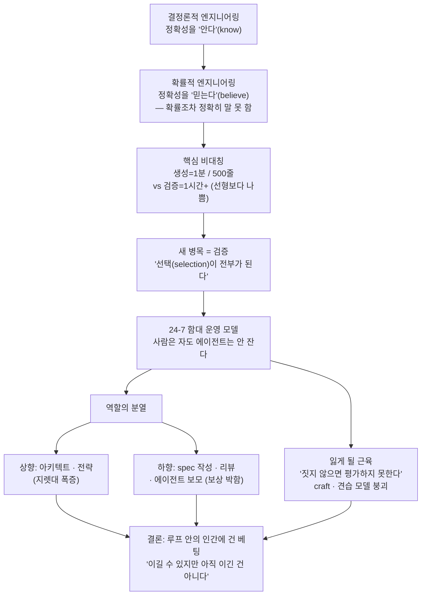

<figure class="post-figure post-figure--header">
<svg role="img" aria-label="왼쪽 책상에 엎드려 잠든 커맨더 한 명 위로 달력이 24/7을 가리키고, 그가 자는 밤바다 위로 코드를 실은 에이전트 함대가 자율 항해한다. 돛에는 확률(0.97 등)이 적힌 흐릿한 체크표시가 떠 있고, 함대 중 한 척은 선체 아래로 조용히 물이 새고 있다 — 정확성을 '아는' 것이 아니라 '믿는' 풍경" viewBox="0 0 640 320" xmlns="http://www.w3.org/2000/svg">
  <title>잠든 커맨더 1명 vs 밤새 자율 항해하는 에이전트 함대 — 정확성을 '아는' 것이 아니라 '믿는' 것이 된 풍경</title>

  <!-- header caption strip -->
  <text x="320" y="28" text-anchor="middle" font-size="15" fill="currentColor" font-weight="700">잠든 커맨더 1명, 깨어 있는 함대</text>
  <text x="320" y="47" text-anchor="middle" font-size="11.5" fill="currentColor" opacity="0.6">정확성을 '아는 것'이 아니라 '믿는 것'이 되었다</text>

  <!-- night sky: scattered stars -->
  <g fill="currentColor" opacity="0.35">
    <circle cx="300" cy="78" r="1.6"/>
    <circle cx="360" cy="66" r="1.4"/>
    <circle cx="430" cy="84" r="1.8"/>
    <circle cx="500" cy="70" r="1.4"/>
    <circle cx="560" cy="92" r="1.6"/>
    <circle cx="470" cy="110" r="1.3"/>
    <circle cx="600" cy="120" r="1.5"/>
  </g>
  <!-- crescent moon -->
  <g transform="translate(590 64)">
    <circle cx="0" cy="0" r="14" fill="var(--gold)"/>
    <circle cx="6" cy="-3" r="13" fill="var(--bg-panel)"/>
  </g>

  <!-- sea line -->
  <line x1="244" y1="232" x2="624" y2="232" stroke="currentColor" stroke-width="1.5" opacity="0.4"/>
  <g stroke="var(--secondary-color)" stroke-width="1.5" fill="none" opacity="0.5" stroke-linecap="round">
    <path d="M250,246 q14,-8 28,0 q14,8 28,0"/>
    <path d="M330,256 q14,-8 28,0 q14,8 28,0"/>
    <path d="M430,248 q14,-8 28,0 q14,8 28,0"/>
    <path d="M520,258 q14,-8 28,0 q14,8 28,0"/>
  </g>

  <!-- ===== LEFT: the sleeping commander at the desk ===== -->
  <!-- desk -->
  <g stroke="currentColor" stroke-width="2.5" fill="none" stroke-linejoin="round">
    <rect x="44" y="226" width="150" height="14" fill="var(--bg-light)"/>
    <line x1="58" y1="240" x2="58" y2="290"/>
    <line x1="180" y1="240" x2="180" y2="290"/>
  </g>
  <!-- slumped commander (head down on the desk) -->
  <g stroke="currentColor" stroke-width="2.5" fill="none" stroke-linecap="round" stroke-linejoin="round">
    <!-- back / torso slumped forward -->
    <path d="M86,224 q-10,-44 22,-58" fill="var(--bg-light)"/>
    <!-- head resting on arms -->
    <ellipse cx="124" cy="200" rx="22" ry="16" fill="var(--orc-green)" stroke="currentColor"/>
    <!-- topknot -->
    <path d="M124,184 q4,-12 -6,-16 q12,2 14,12" fill="var(--orc-green)" stroke="currentColor"/>
    <!-- arms folded as a pillow on the desk -->
    <path d="M90,224 q34,-14 70,-2" fill="var(--bg-panel)"/>
  </g>
  <!-- zzz (sleep) -->
  <g fill="currentColor" opacity="0.55" font-weight="700">
    <text x="150" y="176" font-size="13">z</text>
    <text x="164" y="166" font-size="16">Z</text>
    <text x="182" y="154" font-size="20">Z</text>
  </g>
  <!-- the 24/7 calendar on the desk -->
  <g>
    <rect x="48" y="124" width="58" height="62" rx="3" fill="var(--bg-panel)" stroke="currentColor" stroke-width="2"/>
    <rect x="48" y="124" width="58" height="16" rx="3" fill="var(--accent-color)"/>
    <text x="77" y="136" text-anchor="middle" font-size="10" fill="var(--bg-panel)" font-weight="700">CAL</text>
    <text x="77" y="170" text-anchor="middle" font-size="22" fill="currentColor" font-weight="700">24/7</text>
  </g>

  <!-- ===== RIGHT: the agent fleet sailing through the night ===== -->
  <!-- ship A (foreground, healthy) — checkmark 0.97 -->
  <g transform="translate(300 196)">
    <path d="M-26,16 L26,16 L18,30 L-18,30 Z" fill="var(--bg-light)" stroke="currentColor" stroke-width="2.5" stroke-linejoin="round"/>
    <line x1="0" y1="16" x2="0" y2="-22" stroke="currentColor" stroke-width="2.5"/>
    <path d="M0,-20 L22,-2 L0,-2 Z" fill="var(--orc-green)" stroke="currentColor" stroke-width="2" stroke-linejoin="round"/>
    <!-- probabilistic check floating above -->
    <g opacity="0.7">
      <path d="M-8,-34 l5,6 l11,-13" fill="none" stroke="var(--secondary-color)" stroke-width="3" stroke-linecap="round" stroke-linejoin="round"/>
      <text x="14" y="-30" font-size="9" fill="currentColor" opacity="0.8">0.97</text>
    </g>
  </g>

  <!-- ship B (mid) — checkmark 0.92 -->
  <g transform="translate(420 208)">
    <path d="M-24,14 L24,14 L17,27 L-17,27 Z" fill="var(--bg-light)" stroke="currentColor" stroke-width="2.5" stroke-linejoin="round"/>
    <line x1="0" y1="14" x2="0" y2="-20" stroke="currentColor" stroke-width="2.5"/>
    <path d="M0,-18 L20,-2 L0,-2 Z" fill="var(--orc-green)" stroke="currentColor" stroke-width="2" stroke-linejoin="round"/>
    <g opacity="0.7">
      <path d="M-8,-31 l5,6 l11,-13" fill="none" stroke="var(--secondary-color)" stroke-width="3" stroke-linecap="round" stroke-linejoin="round"/>
      <text x="14" y="-27" font-size="9" fill="currentColor" opacity="0.8">0.92</text>
    </g>
  </g>

  <!-- ship C (the quietly leaking one) — checkmark looks fine, but '?' and a slow leak -->
  <g transform="translate(540 214)">
    <path d="M-24,14 L24,14 L17,27 L-17,27 Z" fill="var(--bg-light)" stroke="var(--accent-color)" stroke-width="2.5" stroke-linejoin="round"/>
    <line x1="0" y1="14" x2="0" y2="-20" stroke="currentColor" stroke-width="2.5"/>
    <path d="M0,-18 L20,-2 L0,-2 Z" fill="var(--accent-color)" stroke="currentColor" stroke-width="2" stroke-linejoin="round"/>
    <!-- a check that's really a '?' — looks like correctness, isn't -->
    <g opacity="0.75">
      <path d="M-8,-31 l5,6 l11,-13" fill="none" stroke="var(--accent-color)" stroke-width="3" stroke-linecap="round" stroke-linejoin="round"/>
      <text x="14" y="-27" font-size="11" fill="var(--accent-color)" font-weight="700">?</text>
    </g>
    <!-- silent leak: drips falling from the hull below the sea line -->
    <g fill="var(--accent-color)" opacity="0.8">
      <path d="M-4,28 q-3,8 0,12 q3,-4 0,-12"/>
      <path d="M6,30 q-3,7 0,11 q3,-4 0,-11"/>
    </g>
    <text x="0" y="58" text-anchor="middle" font-size="8.5" fill="var(--accent-color)" opacity="0.85">silent leak</text>
  </g>
</svg>
<figcaption>사람은 잠들어도 함대는 자율로 항해한다. 돛 위 확률(0.97·0.92)은 정답처럼 보이지만 확률일 뿐이고, 한 척은 보이지 않게 물이 샌다 — 24-7 직원의 실체이자 '정확성을 믿는' 세계의 위험.</figcaption>
</figure>

## 원문 정보

> - **제목**: Probabilistic Engineering and the 24-7 Employee
> - **출처**: Tim Davis 개인 블로그 — ([timdavis.com](https://www.timdavis.com))
> - **발행**: 2026-04-16 · 약 12~15분 분량
> - **원문 링크**: <https://www.timdavis.com/blog/probabilistic-engineering-and-the-24-7-employee>

이 글을 `Articles`에 담는 맥락: Modular를 이끄는 Tim Davis가, 에이전트 함대를 *실제로 만들고 운영하는* 자리에서 바라본 소프트웨어 개발의 구조 변화를 정리한 긴 에세이다. 담론이 아니라 *어떻게 짓고 운영하는가*에 무게가 실려 있어 `AI-Engineering`으로 분류한다.

## 한 줄 요약 (TL;DR)

소프트웨어는 정확성을 **아는(know)** 결정론적 엔지니어링에서, 정확성을 *얼마인지도 정확히 말할 수 없는 확률로* **믿는(believe)** 확률적 엔지니어링으로 옮겨 가고 있다. 그 변화의 표면이 *24-7 직원* — 사람은 24시간 일하지 않지만, 그가 지휘하는 에이전트 함대는 밤새 자율로 일한다. 처리량은 폭증하지만, **생성은 싸지고 검증은 싸지지 않은 비대칭**이 새로운 병목이자 위험이 된다. 핵심 베팅은 "함대를 지휘하는 인간이 여전히 충분히 날카롭고 잘 훈련되어 *루프 안에 있을 가치*가 있는가"이며, 그 베팅은 *이길 수 있지만 아직 이긴 것은 아니다.*

## 왜 이 글을 골랐나

이 글의 척추를 한 장으로 먼저 본다 — 인식론의 전환 하나에서 시작해, 검증 비대칭·함대 운영·역할 분열·기량 손실이 *연역적으로* 따라 나오고, 모든 것이 마지막의 한 베팅으로 모인다.

이 위키의 `Articles`에는 "AI가 코드를 싸게 만든 다음 무엇이 비싸지는가"를 다룬 글이 여럿 쌓여 있다. 대부분은 그 변화의 *한 면*을 본다 — 취향이 비싸진다, 검증이 비싸진다, 의도가 비싸진다. 이 글의 가치는 그 조각들을 **하나의 운영 모델**로 꿰는 데 있다. "정확성을 안다 → 믿는다"라는 인식론적 전환을 출발점에 놓고, 거기서 검증 비대칭·함대 운영·역할 분열·기량 손실까지를 *연결된 한 흐름*으로 풀어낸다.

골라 둘 가치가 있는 이유는 두 가지다. 첫째, 화자가 **AI를 안 써 본 비관론자가 아니다.** Modular(Mojo·MAX의 그 회사)를 이끌고, 여러 프런티어 모델을 묶어 자율로 코드를 생성·리뷰하는 Compound Loop 시스템까지 직접 만든 사람이, *함대를 운영해 본 자리에서* "이건 멋지지만 동시에 불안하다"고 말한다. 둘째, 이 글은 *낙관과 비관을 한 몸에 담는다.* "3~10배 더 출하한다"는 흥분과 "조용한 데이터 손상이 1만 행에 한 줄씩 새고 있다"는 공포를 같은 페이지에 놓고, 어느 쪽도 깎아내리지 않는다. 그 균형이 이 글을 단순한 AI 찬가나 회의론과 다르게 만든다.

## 핵심 내용

원문의 흐름을 따라 저자의 논지를 한국어로 풀어 정리한다. (직접 인용은 가장 상징적인 몇 줄만 남긴다.)

### 역할은 위로만 무너지는 게 아니라, 갈라진다

흔한 서사는 "AI가 하위 역할을 흡수하고 사람은 위로 올라간다"는 것이다. 저자는 그 그림이 절반만 맞다고 본다. 상위 운영자(top-tier operator)는 어느 때보다 큰 지렛대를 얻어 아키텍처·전략 같은 일로 올라가는 게 맞다. 그러나 동시에 중간 역할은 *위로 올라가는 대신 아래로 쪼개진다* — **spec 작성자, 리뷰어, 에이전트 보모(agent babysitter)** 같은, 시스템에는 필요하지만 보상은 박한 일들로 파편화된다.

이 분열이 만드는 격차는 작지 않다. 저자는 함대를 효과적으로 지휘하는 상위 그룹과 그 *배기가스(exhaust)를 관리하는* 중간 그룹 사이의 보상 격차가, 이전 시대의 엔지니어-영업 격차보다 더 벌어질 것이라고 본다.

> "These fragmented roles will be paid less, valued less, and in many cases become career dead ends."

방어 가능한 일은 여전히 AI 인프라 안쪽(커널 성능, 컴파일러 설계)에 남고, 그 위의 소프트웨어 층은 *기계가 아직 복제하지 못하는 인간의 입력* 쪽으로 무게가 옮겨 간다.

### Jevons는 석탄에 대해 옳았고, 코드에 대해서도 옳다

1865년, William Stanley Jevons는 더 효율적인 증기기관이 석탄 소비를 줄이기는커녕 *늘렸다*는 역설을 관찰했다 — 효율이 오르자 쓸 만한 용처가 폭발적으로 늘었기 때문이다. 저자는 코드가 정확히 같은 경로를 밟는다고 본다. 코드 생성이 싸지면, 줄어드는 게 아니라 *훨씬 더 많은 코드가 쓰이고 출하된다.*

스케일링 법칙은 한계가 보이지 않고, 실제로 에이전트 중심으로 조직을 재편한 팀은 1년 전보다 *3배, 5배, 10배*를 출하하고 있다.

> "The throughput gains are not subtle, and the teams that have genuinely restructured around agents are shipping three, five, or ten times what they shipped a year ago."

그래서 새 제약은 타이핑 속도가 아니다. 공급이 폭발하면 **선택(selection)이 전부가 된다.** 지렛대는 에이전트의 산출을 *옳은 문제로 향하게 하고, 가치로 거르고, 결과를 일관되게 통합하는* 능력으로 옮겨 간다.

### 결정론적 엔지니어링에서 확률적 엔지니어링으로

이 글의 척추다. 전통적 소프트웨어에서 우리는 짜고, 테스트하고, 리뷰해서 *정해진 경계 안에서 동작함을 안다.* 확률적 시스템에서는 코드의 큰 부분을 확률적 시스템이 생성하고, 시간 압박 속에 리뷰되며, *어떤 한 사람도 처음부터 끝까지 설계하지 않는다.*

핵심 비대칭은 한 문장으로 압축된다.

> "Generation has become cheap, but validation has not."

한 에이전트는 1분도 안 되어 500줄을 뽑는다. 그 안의 미묘한 버그를 잡는 데는 시니어 엔지니어가 한 시간 이상을 쓴다. 게다가 리뷰는 산출량에 대해 *선형보다 나쁘게* 확장된다 — 코드베이스에서 에이전트가 쓴 비중이 커질수록, 한 줄을 읽는 데 필요한 맥락도 함께 불어나기 때문이다. 그 결과, 충분한 규모에서 코드베이스는 *동작함을 아는* 것에서 *동작하리라 믿는데 그 확률을 정확히 말할 수는 없는* 것으로 바뀐다. 정확성이 *확률적*이 된다.

저자가 드는 실패 모드는 구체적이다 — 10번 중 9번은 테스트를 통과하는 race condition, staging에서는 멀쩡하지만 예상 못한 조건에서 무너지는 기능, 1만 행에 한 줄씩 일어나는 *조용한 데이터 손상*, 그리고 생성은 늘고 리뷰 품질은 떨어지면서 진행되는 *느리고 조용한 퇴화*.

저자는 현재 도구가 원시적이라고 솔직히 인정한다. 작은 머지, 단단한 게이트, 회의주의, 관측 가능성 같은 문화가 도움은 되지만 *확장되지는 않는다.* 그는 누군가 이 문제에 맞는 제대로 된 도구를 만들어 주기를 바란다고 적으며, 지금으로선 *무자비한 회의주의의 문화*가 새 CI/CD라고 말한다.

### 모든 산업이 같은 속도로 움직이지는 않는다

저자는 산업을 세 층으로 나눈다.

- **결정론 층 (고위험·규제):** 항공 전자, 의료기기, 금융 거래 인프라, 원자력, 결제망. 형식 검증·광범위한 시뮬레이션·인간 사인오프 체인을 요구하며, *속도보다 안전을 옳게 우선*한다. 오래도록 결정론으로 남는다.
- **확률 층 (소비자·내부):** 소비자 소프트웨어, 내부 도구, 마케팅 시스템, 대부분의 SaaS, 콘텐츠 인프라, 실험·초기 단계 작업. 버그의 비용은 롤백·핫픽스지만, 이득은 *10배의 반복 속도*다. 이미 뜨겁게 달아오르고 있고 더 빨라진다.
- **수렴 지대 (흥미로운 미래):** 보험·헬스케어·엔터프라이즈 인프라처럼 지금은 결정론이지만 확률적 방법이 *위로 스며드는* 영역. 모델이 좋아질수록 프런티어는 계속 올라가고, 선도 팀은 *결정론적 가드레일을 다시 끼워 넣는다* — 확률적 생성을 결정론적 검증으로 감싸는 하이브리드. 이기는 팀은 *자기 층을 알고 엉뚱한 층에서 일하려는 유혹에 저항하는* 팀이다.

### 에이전틱 함대

저자는 "공장 교대"보다 *함대(fleet)*가 더 나은 은유라고 본다 — 사람이 대체되는 게 아니라 *지휘받기* 때문이다. 다만 현실은 잘 통제된 해군보다 *불안정한 외주 계약자들의 떼*에 가깝다 — 능력이 들쭉날쭉하고, 행동은 확률적이며, 때로 *자신만만하게 틀리고*, 규모가 커지면 비싸다.

함대의 특징은 구성(작업별로 다른 에이전트), 조정(인계·의존성·에스컬레이션), 지휘 구조(임무 지시·교전 규칙·리뷰)로 정리된다. 그리고 결정적으로, 함대에는 *야간 당직*이 있다 — 지휘관이 자는 동안에도 계속 일하고 아침에 보고한다.

> "Your agents do not sleep, and that is the whole point."

이것이 *24-7 직원*의 실체다. 한 사람의 하루는 새로운 리듬으로 재배열된다 — **아침**엔 밤새 나온 산출을 분류하고 머지하고, **낮**엔 고객 대화·전략·제품 결정·spec 작성 같은 고지렛대 인간 작업을 하고, **오후**엔 에이전트가 보고하면 리뷰하고 방향을 다시 잡고, **저녁**엔 명확한 명세와 함께 일을 에이전트에게 넘긴다. 잘 굴러가면, 자고 일어났을 때 *끝낸 지점보다 앞서 있다* — 리뷰 규율이 버티는 한.

### 아직 갖지 못한 모델을 위해 지어라

저자는 *지금 쓰는 모델이 우리가 쓸 가장 멍청한 모델*이라고 말한다.

> "The model we are using today is the dumbest model we will ever use."

프런티어 능력은 6~12개월 안에 오늘을 의미 있게 넘어설 것이고, 현재와 다음 모델의 격차는 현재와 1년 전의 격차보다 *더 클* 가능성이 크다. 함의는 분명하다 — 조직은 2026년이 아니라 *2027~2028년의 능력*을 향해 지어야 한다. 명세, 리뷰 문화, 관측 가능성, 에이전트 오케스트레이션, 훈련 의례는 *현재 모델이 아니라 미래 모델을 위한 비계(scaffolding)*다. 일찍 움직인 쪽은 복리로 앞서가고, 늦은 쪽은 다음 시대를 *먼저 간 사람들이 이미 아는 것을 배우는 데* 써 버린다.

### 우리가 잃게 될 근육

가장 무거운 장이다. 저자의 명제는 단순하다 — *짓지 않으면, 남이 지은 것을 평가하는 능력을 잃는다.*

> "If you never build, you lose the ability to evaluate what is being built."

첫날부터 AI에 기대는 주니어는 빠르게 출하하지만, 모델이 예상 밖으로 실패할 때 *디버깅하지 못한다* — 시스템에 대한 내적 모델을 한 번도 만들어 본 적이 없기 때문이다. 취향·판단·craft는 *마찰을 통해서만* 형성된다 — 새벽 2시의 디버깅, 어려운 문제와의 씨름. 그런데 견습(apprenticeship) 모델이 무너진다. 주니어는 에이전트를 통해 코딩하고, 시니어는 *인간의 산출이 아니라 에이전트의 산출*을 리뷰한다. 지금 세대의 시니어가 전통적 방법론으로 온전히 훈련된 *마지막 세대*일 수 있고, 미래의 운영자는 함대를 지휘하되 *시스템의 도면은 읽지 못할* 수 있다.

저자의 처방은 역설적이다 — 정기적으로 *일부러 옛날 방식으로* 어려운 문제를 짓고 풀어 craft를 유지하라는 것. 이 비주류 선택이 10년 뒤 운영자를 가르는 차별점이 될 수 있다고 본다.

### 불편한 부분

저자는 마지막에 낙관과 위험을 한자리에 놓는다 — 리뷰 부담으로 인한 직원의 소진, 시스템엔 필요하지만 보상받지 못하는 파편화된 역할, craft를 못 기른 주니어, *산출량을 품질로 착각하다가 사고로 그 격차를 드러내는* 팀, 그리고 다음 세대 모델에 *준비된 조직과 그렇지 못한 조직*. 그리고 결론을 베팅의 언어로 봉인한다 — 24-7 직원은 약속이 아니라 *재배열이자 베팅*이며, 그 베팅은 *루프 안의 인간이 여전히 충분히 날카롭고 정직하고 잘 훈련되어 루프 안에 있을 가치가 있는가*에 걸려 있다. 그 베팅은 *이길 수 있지만 아직 이긴 것은 아니다.*

## 분석과 인사이트

여기서부터는 원문 요약이 아니라 내 관점이다.

<figure class="post-figure">
<svg role="img" aria-label="가로축은 생성량(LOC), 세로축은 비용/시간인 그래프. 생성 비용은 바닥에 거의 평평하게 누운 직선이고(1분에 500줄, 거의 공짜), 검증 비용은 위로 가파르게 휘어 오르는 곡선이다(선형보다 나쁜 확장 — 한 줄을 읽는 데 필요한 맥락이 함께 불어나므로). 두 곡선 사이의 벌어지는 간격이 비대칭이며 곧 위험이다" viewBox="0 0 640 340" xmlns="http://www.w3.org/2000/svg">
  <title>생성은 싸고 검증은 비싸다 — 생성 곡선은 바닥에 평평히 눕고, 검증 곡선은 선형보다 가파르게 솟는다</title>

  <!-- caption strip -->
  <text x="320" y="26" text-anchor="middle" font-size="14.5" fill="currentColor" font-weight="700">생성은 싸지고, 검증은 싸지지 않았다</text>
  <text x="320" y="45" text-anchor="middle" font-size="11" fill="currentColor" opacity="0.6">두 곡선의 기울기 차이 = 비대칭 = 새 병목</text>

  <!-- axes -->
  <g stroke="currentColor" stroke-width="2" opacity="0.55" fill="none">
    <line x1="78" y1="70" x2="78" y2="290"/>
    <line x1="78" y1="290" x2="600" y2="290"/>
  </g>
  <!-- arrow heads -->
  <g fill="currentColor" opacity="0.55">
    <path d="M78,64 l-5,10 l10,0 Z"/>
    <path d="M606,290 l-10,-5 l0,10 Z"/>
  </g>
  <!-- axis labels -->
  <text x="78" y="58" text-anchor="middle" font-size="11" fill="currentColor" opacity="0.75">비용 · 시간</text>
  <text x="600" y="312" text-anchor="end" font-size="11" fill="currentColor" opacity="0.75">생성량 (LOC) →</text>

  <!-- faint gridlines -->
  <g stroke="currentColor" stroke-width="1" opacity="0.12">
    <line x1="78" y1="230" x2="600" y2="230"/>
    <line x1="78" y1="170" x2="600" y2="170"/>
    <line x1="78" y1="110" x2="600" y2="110"/>
    <line x1="210" y1="70" x2="210" y2="290"/>
    <line x1="342" y1="70" x2="342" y2="290"/>
    <line x1="474" y1="70" x2="474" y2="290"/>
  </g>

  <!-- VERIFICATION curve: super-linear, steep — drawn first so the gap fill sits behind it -->
  <!-- shaded asymmetry gap between the two curves -->
  <path d="M78,278 Q300,266 430,210 T592,84 L592,282 Q430,284 300,284 T78,284 Z"
        fill="var(--accent-color)" opacity="0.10"/>

  <!-- GENERATION curve: nearly flat along the bottom (cheap, ~constant per line) -->
  <path d="M78,284 Q260,282 430,280 T592,282" fill="none"
        stroke="var(--secondary-color)" stroke-width="3.5" stroke-linecap="round"/>
  <circle cx="592" cy="282" r="4" fill="var(--secondary-color)"/>

  <!-- VERIFICATION curve: super-linear, rising steeply -->
  <path d="M78,278 Q300,262 430,206 T592,84" fill="none"
        stroke="var(--accent-color)" stroke-width="3.5" stroke-linecap="round"/>
  <circle cx="592" cy="84" r="4" fill="var(--accent-color)"/>

  <!-- curve labels -->
  <g font-size="11.5" font-weight="700">
    <text x="470" y="276" fill="var(--secondary-color)">생성 비용</text>
    <text x="470" y="262" font-size="9.5" font-weight="400" fill="var(--secondary-color)" opacity="0.85">1분 / 500줄 — 거의 공짜</text>
    <text x="372" y="120" fill="var(--accent-color)">검증 비용</text>
    <text x="372" y="136" font-size="9.5" font-weight="400" fill="var(--accent-color)" opacity="0.9">선형보다 나쁜 확장 — 맥락이 함께 불어남</text>
  </g>

  <!-- the widening gap callout -->
  <g opacity="0.85">
    <line x1="556" y1="100" x2="556" y2="278" stroke="currentColor" stroke-width="1.5" stroke-dasharray="4 4" opacity="0.6"/>
    <text x="551" y="186" text-anchor="end" font-size="10.5" fill="currentColor" font-weight="700" opacity="0.8">벌어지는 간격</text>
    <text x="551" y="201" text-anchor="end" font-size="9" fill="currentColor" opacity="0.6">= 조용한 퇴화의 여지</text>
  </g>
</svg>
<figcaption>한 에이전트는 1분에 500줄을 뽑지만(녹색·바닥에 평평), 그 안의 미묘한 버그를 잡는 검증은 선형보다 가파르게 솟는다(붉은색) — 코드베이스에서 에이전트가 쓴 비중이 커질수록 한 줄을 읽는 맥락도 함께 불어나기 때문이다. 두 곡선 사이의 벌어지는 간격이 곧 위험이다.</figcaption>
</figure>

- **이 글의 진짜 기여는 '인식론적 프레임'이다.** "AI가 코드를 싸게 만든다"는 관찰은 이제 흔하다. 이 글이 한 단계 더 들어가는 지점은, 그 변화를 *정확성을 아는 것 → 믿는 것*이라는 인식론의 전환으로 다시 쓴 데 있다. 이 프레임이 강력한 이유는, 그것이 *나머지 모든 결론을 연역적으로 끌어내기* 때문이다. 정확성이 확률이 되면 → 검증이 병목이 되고 → 리뷰 규율이 생명선이 되고 → 그 규율을 지킬 *훈련된 인간*이 핵심 자산이 된다. [검증이 비싸지는 시대](/2026/06/23/fowler-fragments-verification-cognitive-surrender.html)를 Martin Fowler가 *메모*로 던졌다면, Davis는 같은 통찰을 *조직 운영 모델*로까지 끌고 내려간다.

- **"generation cheap, validation not"은 이 위키에 쌓인 여러 글의 공통 분모다.** [코드가 공짜가 된 시대의 '취향'](/2026/06/19/ai-engineer-taste.html)이 "내부 평가 함수의 품질"을 가장 값진 기술로 본 것, [Intent Debt](/2026/06/21/intent-debt.html)가 "에이전트가 유일하게 못 갚는 부채는 의도"라고 본 것, 그리고 이 글이 "선택이 전부가 된다"고 한 것은 *같은 비대칭의 세 얼굴*이다. 생성이 공짜가 되는 순간, 희소 자원은 *무엇을 만들지 고르고(taste/intent) 만들어진 것이 맞는지 거르는(validation)* 인간 쪽으로 통째로 이동한다. Davis의 공헌은 이 이동을 *일과(日課)의 재배열*로 구체화한 것이다 — 추상적 "취향"이 "아침 triage, 저녁 hand-off"라는 시간표로 바뀐다.

- **삼층 산업 분류는 실무에서 가장 바로 쓸 수 있는 도구다.** "확률적 엔지니어링으로 가라/가지 마라"는 이분법은 위험하다. 결제망에서 10배 빠른 반복은 재앙이고, 마케팅 랜딩 페이지에서 형식 검증은 낭비다. Davis의 진짜 실용적 조언은 *네 층을 알라*다 — 그리고 가장 흥미로운 곳은 수렴 지대, 즉 *확률적 생성을 결정론적 검증으로 감싸는 하이브리드*다. 이건 새로운 게 아니라 [신뢰할 수 있는 Agentic AI 시스템](/2026/06/19/reliable-agentic-ai-systems.html)이 말한 *하니스 엔지니어링*의 산업 버전이다 — 확률적 코어를 결정론적 가드레일(테스트·타입·계약·정책)로 둘러싸는 것. "어디에 결정론을 다시 끼워 넣을 것인가"가 다음 시대 아키텍트의 핵심 결정이 된다.

- **'역할이 갈라진다'는 진단은 위안이 아니라 경고로 읽어야 한다.** AI 담론의 기본 위안은 "AI가 하위 작업을 가져가고 너는 위로 올라간다"이다. Davis는 그 위안에 *상향과 하향이 동시에 일어난다*는 단서를 단다 — 모두가 아키텍트로 올라가는 게 아니라, 일부는 *spec 작성·리뷰·에이전트 보모*라는 막다른 길로 갈라진다. 이는 [The Untrainable](/2026/06/23/the-untrainable.html)이 말한 "측정 가능한 일은 commodity가 된다"의 어두운 짝이다 — 함대의 *배기가스를 치우는 일*은 측정 가능하고 따라서 값이 깎인다. 다만 Davis는 *왜 어떤 사람은 상향, 어떤 사람은 하향인가*의 경계를 충분히 그리지 않는다. 그 경계가 craft·taste·시스템 이해라는 게 마지막 장의 함의지만, 명시적 다리는 빠져 있다.

- **'잃게 될 근육' 장이 이 글에서 가장 논쟁적이면서 가장 중요하다.** "짓지 않으면 평가하지 못한다"는 명제는 [AI가 우리의 실력을 망치고 있는가](/2026/06/23/is-ai-ruining-our-skills.html)가 보고한 *탈숙련(deskilling)*의 초기 연구와 정확히 맞물린다 — AI에 기댄 의사의 선종 발견율이 떨어졌듯, AI에 기댄 엔지니어의 디버깅 근육도 위축된다. 그런데 여기엔 긴장이 있다. 같은 위키의 [게으른 시니어 스킬](/2026/06/23/ponytail-lazy-senior-dev-skill.html)이나 [Karpathy의 코딩 가이드라인](/2026/06/22/karpathy-llm-coding-guidelines.html)은 *시니어의 판단을 에이전트에 잘 위임하는 법*을 말한다. 두 입장은 모순이 아니라 *순서의 문제*다 — 먼저 마찰로 craft를 길러 *내부 모델*을 만든 사람만이 위임을 안전하게 할 수 있고, 그 모델 없이 첫날부터 위임하면 평가 능력이 자라지 못한다. Davis의 "일부러 옛날 방식으로 풀어라"는 *그 내부 모델을 유지보수하는 비용*을 명시적으로 예산에 넣으라는 말로 읽는 게 정확하다.

- **다만 '도구가 곧 나올 것'이라는 낙관은 이 글의 가장 약한 고리다.** Davis 스스로 현재 도구가 원시적이고 문화는 확장되지 않는다고 인정하면서, 해법을 *"누군가 만들어 주기를 바란다"*에 맡긴다. 확장되지 않는 회의주의 문화 위에 10배 처리량을 쌓으면, 그 격차는 *조용한 퇴화*로 메워진다 — 글이 직접 경고한 바로 그 실패 모드다. 즉 "아직 갖지 못한 모델을 위해 지어라"는 조언과 "검증 도구는 아직 없다"는 인정 사이에는, *생성 능력이 검증 능력보다 먼저 도착하는 한 위험은 누적된다*는 불편한 시차가 남는다. 이 글의 베팅이 "이길 수 있지만 아직 이긴 것은 아니다"인 진짜 이유가 여기 있다.

## 적용 포인트

독자가 바로 적용할 수 있는 실천 항목이다.

- **자기 작업이 어느 '층'인지 먼저 분류한다.** 결제·의료·거래 인프라라면 속도보다 결정론적 검증이 옳고, 내부 도구·마케팅·실험이라면 확률적 반복을 더 공격적으로 켜도 된다. *엉뚱한 층의 규율을 빌려 오는 것*(고위험에 확률론, 저위험에 형식 검증)이 가장 흔한 실수다.
- **'생성 예산'이 아니라 '검증 예산'을 먼저 잡는다.** 에이전트 처리량을 늘리기 전에, *그 산출을 누가 어떤 규율로 검토하는가*를 정한다. 작은 머지, 단단한 게이트, 관측 가능성, 무자비한 회의주의 — 리뷰가 버티지 못할 양은 *출하하지 않는다*를 기본값으로.
- **수렴 지대에서는 '결정론적 가드레일'을 명시적으로 설계한다.** 확률적 생성을 *테스트·타입·계약·정책·시뮬레이션*으로 감싸, 에이전트가 자신만만하게 틀려도 시스템이 막아 내게 한다. "어디에 결정론을 다시 끼워 넣을 것인가"를 아키텍처 결정으로 문서화한다.
- **하루를 '함대 운영 리듬'으로 재배열해 본다.** 아침 triage·머지 → 낮 고지렛대 인간 작업 → 오후 리뷰·재지시 → 저녁 명세와 함께 hand-off. 핵심은 *저녁에 넘기는 명세의 품질*이 다음 날 아침의 산출 품질을 결정한다는 점이다.
- **craft 유지 비용을 일정에 *예산으로* 넣는다.** 정기적으로 *에이전트 없이* 어려운 문제를 직접 짓고 디버깅하는 시간을 확보한다. 특히 주니어에게는 "AI로 빠르게"와 "마찰로 내부 모델 형성"을 의도적으로 번갈아 시켜, 평가 능력이 자라게 한다.
- **'지금 모델'이 아니라 '다음 모델'을 기준으로 비계를 짓는다.** 명세 양식, 리뷰 문화, 오케스트레이션, 관측 가능성을 *현재 모델에 딱 맞추지 말고* 한두 단계 위 능력을 가정해 설계한다 — 모델이 좋아지는 순간 그 비계가 곧바로 복리로 작동하도록.

## 마무리

이 글은 "AI가 코드를 싸게 만든다"는 관찰을 *정확성을 아는 것에서 믿는 것으로*라는 인식론의 전환으로 다시 쓰고, 거기서 검증 비대칭·함대 운영·역할 분열·기량 손실까지를 하나의 연결된 흐름으로 풀어낸다. 24-7 직원은 *사람이 24시간 일하는 것*이 아니라 *그의 함대가 자는 동안에도 일하는 것*이며, 그 모델의 생명선은 처리량이 아니라 *루프 안에 남은 인간의 날카로움*이다. 낙관(3~10배 출하)과 위험(1만 행에 한 줄씩 새는 조용한 손상)을 같은 페이지에 정직하게 놓는다는 점에서, 이 글은 AI 찬가도 회의론도 아니다 — *이길 수 있지만 아직 이기지 못한 베팅*을 어떻게 이길 것인가에 대한, 함대를 직접 몰아 본 사람의 현장 보고서다. 이 시대의 진짜 과제는 *더 많이 생성하는 것*이 아니라, *생성한 것을 믿어도 되는지 검증할 인간을 계속 날카롭게 유지하는 것*이다.

### 더 읽어보기

- [원문 — Probabilistic Engineering and the 24-7 Employee (Tim Davis)](https://www.timdavis.com/blog/probabilistic-engineering-and-the-24-7-employee)
- [코딩이 공짜가 되면 무엇이 비싸지는가 — Martin Fowler의 Fragments](/2026/06/23/fowler-fragments-verification-cognitive-surrender.html) — '검증이 비싸지는 시대'라는 같은 통찰의 메모 버전
- [신뢰할 수 있는 Agentic AI 시스템 만들기 (PRINCE 사례)](/2026/06/19/reliable-agentic-ai-systems.html) — '결정론적 가드레일로 확률적 코어를 감싼다'를 하니스 엔지니어링으로 구현한 사례
- [코드가 공짜가 된 시대의 '취향(taste)'](/2026/06/19/ai-engineer-taste.html) — '선택이 전부가 된다'를 내부 평가 함수의 품질로 본 짝
- [Intent Debt: 에이전트가 대신 갚아줄 수 없는 부채 (Addy Osmani)](/2026/06/21/intent-debt.html) — 생성이 공짜가 될 때 인간 쪽에 남는 것을 '의도'로 본 관점
- [The Untrainable: 벤치마크할 수 없는 일에 가치가 남는다 (Sarah Guo)](/2026/06/23/the-untrainable.html) — '측정 가능한 일은 commodity가 된다'는, 역할 분열의 산업 버전
- [AI가 우리의 실력을 망치고 있는가 — 탈숙련 연구 (Nature)](/2026/06/23/is-ai-ruining-our-skills.html) — '짓지 않으면 평가하지 못한다'를 뒷받침하는 초기 deskilling 연구
- [1분이라도 69개 에이전트를 안 돌리면 뒤처진다 — 농담입니다 (George Hotz)](/2026/06/23/running-69-agents.html) — '에이전트 함대' 광기를 식히는 반대편의 차분한 회의
