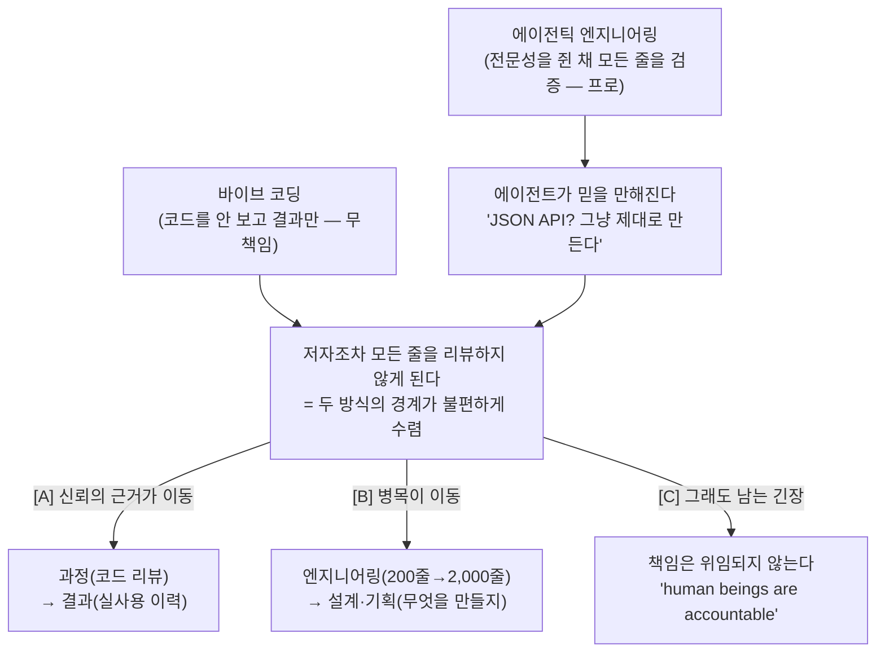

<figure class="post-figure post-figure--header">
<svg role="img" aria-label="왼쪽의 '바이브 코딩'(코드를 안 보는 길)과 오른쪽의 '에이전틱 엔지니어링'(모든 줄을 검증하는 길)을 가르던 경계선이 점선으로 흐려지며 가운데 한 점으로 수렴하고, 그 자리에 한 손엔 '리뷰 안 한 코드', 다른 손엔 '책임은 내 것'을 든 불편한 표정의 커맨더가 서 있는 그림" viewBox="0 0 640 320">
  <title>흐려지는 경계 위에 선 커맨더</title>

  <!-- LEFT PATH — 바이브 코딩 (코드를 안 보고 결과만) -->
  <g fill="none" stroke="var(--secondary-color)" stroke-width="3" stroke-linecap="round">
    <path d="M16 70 H150 Q210 70 250 150" opacity="0.95"/>
  </g>
  <g fill="var(--secondary-color)" opacity="0.55">
    <rect x="30" y="56" width="10" height="10"/>
    <rect x="46" y="56" width="10" height="10"/>
    <rect x="62" y="56" width="6" height="10"/>
    <rect x="30" y="78" width="14" height="10"/>
    <rect x="50" y="78" width="8" height="10"/>
  </g>
  <text x="20" y="40" font-family="var(--font-body)" font-size="15" font-weight="700" fill="var(--secondary-color)">바이브 코딩</text>
  <text x="20" y="108" font-family="var(--font-body)" font-size="11" fill="currentColor" opacity="0.75">코드를 안 보고 결과만</text>

  <!-- RIGHT PATH — 에이전틱 엔지니어링 (모든 줄을 검증) -->
  <g fill="none" stroke="var(--primary-color)" stroke-width="3" stroke-linecap="round">
    <path d="M624 70 H490 Q430 70 390 150" opacity="0.95"/>
  </g>
  <g fill="var(--primary-color)" opacity="0.6">
    <!-- 한 줄씩 검증하는 체크 표식 -->
    <path d="M574 58 l5 6 l11 -12" fill="none" stroke="var(--primary-color)" stroke-width="3" stroke-linecap="round" stroke-linejoin="round"/>
    <path d="M574 78 l5 6 l11 -12" fill="none" stroke="var(--primary-color)" stroke-width="3" stroke-linecap="round" stroke-linejoin="round"/>
  </g>
  <text x="620" y="40" text-anchor="end" font-family="var(--font-body)" font-size="15" font-weight="700" fill="var(--primary-color)">에이전틱 엔지니어링</text>
  <text x="620" y="108" text-anchor="end" font-family="var(--font-body)" font-size="11" fill="currentColor" opacity="0.75">전문가가 모든 줄을 검증</text>

  <!-- BLURRING / CONVERGING BOUNDARY — 두 길이 가운데로 수렴, 경계는 점선으로 흐려진다 -->
  <line x1="320" y1="120" x2="320" y2="232" stroke="currentColor" stroke-width="2" stroke-dasharray="3 9" opacity="0.4"/>
  <path d="M250 150 Q300 178 320 196" fill="none" stroke="var(--secondary-color)" stroke-width="3" stroke-linecap="round" stroke-dasharray="2 7" opacity="0.7"/>
  <path d="M390 150 Q340 178 320 196" fill="none" stroke="var(--primary-color)" stroke-width="3" stroke-linecap="round" stroke-dasharray="2 7" opacity="0.7"/>

  <!-- COMMANDER — 수렴점에 선, 살짝 인상을 쓴 커맨더 -->
  <g transform="translate(320 232)">
    <!-- shoulders / torso -->
    <path d="M-30 60 Q-30 26 0 22 Q30 26 30 60 Z" fill="currentColor" opacity="0.9"/>
    <!-- head -->
    <circle cx="0" cy="2" r="17" fill="currentColor" opacity="0.9"/>
    <!-- topknot tuft (orc commander) -->
    <path d="M-3 -14 Q0 -26 5 -15" fill="none" stroke="currentColor" stroke-width="3" stroke-linecap="round" opacity="0.9"/>
    <!-- furrowed, uneasy brow (panel bg cut-out reads in both themes) -->
    <path d="M-9 -2 l7 3 M9 -2 l-7 3" stroke="var(--bg-panel)" stroke-width="2.5" stroke-linecap="round"/>
    <!-- unsettled mouth -->
    <path d="M-5 12 Q0 9 5 12" fill="none" stroke="var(--bg-panel)" stroke-width="2" stroke-linecap="round"/>
  </g>

  <!-- LEFT HAND — '리뷰 안 한 코드' (crimson alert tag) -->
  <g transform="translate(244 250)">
    <rect x="-58" y="-16" width="116" height="34" rx="3" fill="none" stroke="var(--accent-color)" stroke-width="2.5"/>
    <path d="M-46 -2 l-6 5 l6 5 M46 -2 l6 5 l-6 5" fill="none" stroke="var(--accent-color)" stroke-width="2" stroke-linecap="round" stroke-linejoin="round"/>
    <text x="0" y="5" text-anchor="middle" font-family="var(--font-body)" font-size="11.5" font-weight="700" fill="var(--accent-color)">리뷰 안 한 코드</text>
  </g>

  <!-- RIGHT HAND — '책임은 내 것' (the seal that stays) -->
  <g transform="translate(396 250)">
    <rect x="-50" y="-16" width="100" height="34" rx="3" fill="var(--accent-color)"/>
    <text x="0" y="5" text-anchor="middle" font-family="var(--font-body)" font-size="11.5" font-weight="700" fill="var(--bg-panel)">책임은 내 것</text>
  </g>
</svg>
<figcaption>칼같이 갈라 두었던 두 길 — 코드를 안 보는 '바이브 코딩'과 모든 줄을 검증하는 '에이전틱 엔지니어링' — 의 경계가 점선처럼 흐려지며 한곳으로 수렴하고, 그 자리에 '리뷰 안 한 코드'와 '책임은 내 것'을 한 손씩 쥔 불편한 커맨더가 선다.</figcaption>
</figure>

## 원문 정보

> - **제목**: Vibe coding and agentic engineering are getting closer than I'd like
> - **출처**: Simon Willison ([simonwillison.net](https://simonwillison.net/2026/May/6/vibe-coding-and-agentic-engineering/))
> - **발행**: 2026-05-06 · 약 6분 분량
> - **원문 링크**: <https://simonwillison.net/2026/May/6/vibe-coding-and-agentic-engineering/>

이 글을 `Articles`에 담는 맥락: "vibe coding"이라는 말을 만든 Andrej Karpathy의 정의를 가장 부지런히 다듬고 전파해 온 사람이 Simon Willison이다. 그가 *직접 코딩 에이전트를 운영하는 자리에서* 자기가 그어 둔 경계가 흔들리는 것을 고백하는 글이라, 담론이 아니라 *어떻게 짓고 신뢰하는가*에 무게가 실린다. 그래서 `AI-Engineering`으로 분류한다.

## 한 줄 요약 (TL;DR)

Willison은 줄곧 두 가지를 칼같이 구분해 왔다 — **바이브 코딩**(코드를 보지도 이해하지도 않고 결과만 받는, 개인용으로만 괜찮은 무책임한 방식)과 **에이전틱 엔지니어링**(보안·유지보수·운영·성능에 대한 전문성을 쥔 채 AI로 더 좋은 시스템을 더 빨리 짓는 프로다운 방식). 그런데 에이전트가 믿을 만해지면서 *자기조차도* 프로덕션 코드의 모든 줄을 리뷰하지 않게 되었고, 그 순간 두 방식의 경계가 불편하게 가까워졌다. 그는 이 불편을 *"다른 엔지니어링 팀의 결과물을 한 줄씩 검증하지 않고 신뢰하듯, 에이전트도 입증된 역량을 근거로 신뢰한다"*는 유비로 봉합한다. 그러나 그 봉합에는 *"사람은 자기가 한 일에 책임을 진다"*는 가시가 남는다.

## 왜 이 글을 골랐나

먼저 글 전체를 관통하는 척추를 한 장으로 본다. 칼같이 갈라 두었던 두 정의에서 출발해, 에이전트가 믿을 만해지자 경계가 수렴하고, 거기서 세 갈래의 함의가 뻗어 나온다.

이 위키의 `Articles`에는 "AI가 코드를 싸게 만든 다음 무엇이 비싸지는가"를 다룬 글이 한 무더기 쌓여 있다 — [코드가 공짜가 된 시대의 '취향'](/2026/06/19/ai-engineer-taste.html), [Intent Debt](/2026/06/21/intent-debt.html), [검증이 비싸지는 시대](/2026/06/23/fowler-fragments-verification-cognitive-surrender.html), 그리고 같은 날 올린 [확률적 엔지니어링과 24-7 직원](/2026/06/25/probabilistic-engineering-and-the-24-7-employee.html)까지. 그 글들이 *생성이 싸지면 검증·취향·의도가 비싸진다*는 큰 그림을 그렸다면, Willison의 이 글은 그 그림 안에서 가장 사적이고 솔직한 한 장면을 보여 준다 — **"나는 검증을 안 하기 시작했다, 그리고 그게 불편하다."**

골라 둘 가치가 있는 이유는 세 가지다. 첫째, **화자가 바로 이 어휘의 표준을 만든 사람**이다. "vibe coding"의 정의를 가장 엄격하게 지켜 온 사람이 *자기 정의가 흔들린다*고 말하는 것은 무게가 다르다. 둘째, 이 글은 *주장*이 아니라 *고백*이다 — "이렇게 해야 한다"가 아니라 "나는 이렇게 하고 있고, 이게 옳은지 잘 모르겠다"는 톤이라, 같은 위키의 강한 주장들([에이전트는 프로그래밍을 못 한다](/2026/06/22/the-eternal-sloptember.html)부터 [게으른 시니어 스킬](/2026/06/23/ponytail-lazy-senior-dev-skill.html)까지) 사이에서 *균형추* 역할을 한다. 셋째, 짧다. 6분짜리 메모가 던지는 질문 — *"코드를 안 봤다면, 그 코드의 품질을 무엇으로 판단할 것인가"* — 은 길이에 비해 오래 남는다.

## 핵심 내용

원문의 흐름을 따라 저자의 논지를 한국어로 풀어 정리한다. (직접 인용은 가장 상징적인 몇 줄만 남긴다.)

### 두 정의: 무책임한 바이브 코딩, 프로다운 에이전틱 엔지니어링

먼저 Willison이 오래 지켜 온 두 정의를 분명히 해 둔다. **바이브 코딩**은 코드를 보지도, 이해하지도 않고 *결과만* 받아 쓰는 방식이다. 개인용 도구라면 괜찮지만, 남에게 영향을 주는 시스템에 쓰면 무책임하다. **에이전틱 엔지니어링**은 정반대다 — 보안·유지보수·운영·성능에 대한 전문가의 판단을 *유지한 채로* AI 도구를 동원해 더 높은 품질의 시스템을 더 빨리 짓는다. 핵심 구분선은 *코드를 모델이 만들었는가*가 아니라 *그 결과에 대한 전문가의 책임이 살아 있는가*였다.

### 경계가 겹치기 시작한다

그런데 문제가 생겼다. 코딩 에이전트가 믿을 만해지면서, **저자 자신이 에이전트가 쓴 모든 줄을 더는 리뷰하지 않게 된 것**이다.

> "The problem is that as the coding agents get more reliable, I'm not reviewing every line of code that they write anymore."

그는 이게 비합리적인 게으름이 아니라는 걸 안다. Claude Code에게 JSON API 엔드포인트를 만들라고 시키면 *그냥 제대로 만든다*는 것을 충분히 경험으로 안다. 직관적인 작업일수록 결과는 안정적이다. 하지만 *프로덕션 시스템*의 코드를 한 줄씩 보지 않는다는 사실은 여전히 불편하다 — 그건 그가 정의한 '무책임한 바이브 코딩'에 한 발 가까워지는 일이기 때문이다.

그는 이 긴장을 *조직 안에서 다른 팀을 신뢰하는 방식*에 빗대 봉합한다. 우리는 동료 엔지니어링 팀의 산출물을 한 줄씩 검증하지 않는다 — *입증된 역량*을 근거로 신뢰한다. 에이전트도 같은 방식으로 대하기 시작했다는 것이다. 다만 그는 이 봉합이 완전하지 않다는 것을 곧바로 인정한다.

> "I'm starting to treat the agents in the same way. And it still feels uncomfortable, because human beings are accountable for what they do."

동료는 자기가 한 일에 *책임을 진다*. 에이전트는 책임을 지지 않는다 — 책임은 결국 그것을 머지한 사람에게 남는다. 그래서 불편함이 사라지지 않는다.

### 소프트웨어를 평가하는 새로운 난제

여기서 더 큰 문제가 따라 나온다. AI가 생성한 프로젝트는 이제 *공들여 만든 저장소와 겉으로 구별되지 않는다.* 깔끔한 커밋 히스토리, 충실한 문서, 높은 테스트 커버리지 — 이 모든 신뢰 신호가 손쉽게 생성된다. 코드 자체로는 품질을 가늠하기 어려워졌다는 뜻이다.

Willison이 제시하는 새로운 판별 기준은 *코드*가 아니라 *실사용 이력*이다.

> "If you've got a vibe coded thing which you have used every day for the past two weeks, that's much more valuable."

지난 2주 동안 매일 써 온 바이브 코딩 결과물은, 화려한 테스트 스위트를 가졌지만 아무도 쓰지 않은 결과물보다 훨씬 신뢰할 만하다는 것이다. 즉 신뢰의 근거가 *과정(코드 리뷰)*에서 *결과(검증된 사용)*로 옮겨 간다.

### 병목이 이동했다

생산성이 오르면서 — 저자는 *하루 200줄에서 2,000줄로*라는 규모 변화를 든다 — 전통적인 개발 워크플로의 어긋남이 드러난다. 엔지니어링 작업이 비쌌던 시절을 전제로 설계된 신중한 설계·기획 절차는, 이제 *불필요하게 조심스러울* 수 있다. 가장 비싼 단계가 바뀌면, 그 단계를 보호하려고 세운 절차도 다시 맞춰야 한다.

### 커리어 걱정이 근거가 약한 이유

마지막으로 저자는 흔한 불안 — "이러다 엔지니어가 필요 없어지는 것 아니냐" — 에 짧게 답한다. AI 도구는 기존 전문성을 *대체*하는 게 아니라 *증폭*한다. 소프트웨어 개발은 여전히 근본적으로 어렵고, 도구가 대신해 줄 수 없는 전문가의 판단을 요구한다. 그는 Matthew Yglesias의 말을 빌려 자기 입장을 분명히 한다.

> "I don't want to vibecode—I want professionally managed software companies to use AI coding assistance to make more/better/cheaper software." (Matthew Yglesias)

바이브 코딩 자체가 목표가 아니라, *프로답게 운영되는 회사가 AI를 도구로 써서 더 많고·더 좋고·더 싼 소프트웨어를 만드는 것* — 그게 그가 바라는 그림이라는 것이다.

## 분석과 인사이트

여기서부터는 원문 요약이 아니라 내 관점이다.

<figure class="post-figure">
<svg role="img" aria-label="신뢰의 무게중심이 왼쪽 '과정 기반 신뢰'(코드 리뷰로 모든 줄을 읽어 동작함을 안다)에서 오른쪽 '결과 기반 신뢰'(2주간 매일 써서 동작함을 믿는다)로 옮겨 가는 그림. 단 오른쪽 결과 기반 신뢰는 입증된 사용 범위 안에서만 유효하고, 아직 안 밟아 본 엣지 케이스는 빈칸으로 남는다" viewBox="0 0 640 300">
  <title>신뢰의 근거가 과정에서 결과로 이동한다</title>

  <!-- LEFT PANEL — 과정 기반 신뢰 (코드 리뷰) -->
  <g transform="translate(20 36)">
    <rect x="0" y="0" width="248" height="170" rx="4" fill="none" stroke="var(--primary-color)" stroke-width="2"/>
    <text x="124" y="26" text-anchor="middle" font-family="var(--font-body)" font-size="14" font-weight="700" fill="var(--primary-color)">과정 기반 신뢰</text>
    <text x="124" y="46" text-anchor="middle" font-family="var(--font-body)" font-size="11" fill="currentColor" opacity="0.7">코드 리뷰 · 모든 줄을 읽는다</text>
    <!-- code lines, each ticked off (line-by-line review) -->
    <g stroke="var(--primary-color)" stroke-width="2.5" stroke-linecap="round" fill="none">
      <path d="M28 78 l5 5 l9 -10"/><line x1="56" y1="78" x2="210" y2="78" opacity="0.45"/>
      <path d="M28 100 l5 5 l9 -10"/><line x1="56" y1="100" x2="186" y2="100" opacity="0.45"/>
      <path d="M28 122 l5 5 l9 -10"/><line x1="56" y1="122" x2="204" y2="122" opacity="0.45"/>
      <path d="M28 144 l5 5 l9 -10"/><line x1="56" y1="144" x2="170" y2="144" opacity="0.45"/>
    </g>
    <text x="124" y="166" text-anchor="middle" font-family="var(--font-body)" font-size="12" font-weight="700" fill="currentColor">동작함을 '안다'</text>
  </g>

  <!-- CENTER — 무게중심 이동 화살표 -->
  <g transform="translate(320 121)">
    <text x="0" y="-18" text-anchor="middle" font-family="var(--font-body)" font-size="11" fill="var(--text-light)">신뢰의 근거 이동</text>
    <line x1="-26" y1="0" x2="22" y2="0" stroke="var(--accent-color)" stroke-width="3.5" stroke-linecap="round"/>
    <path d="M22 -7 l12 7 l-12 7" fill="none" stroke="var(--accent-color)" stroke-width="3.5" stroke-linecap="round" stroke-linejoin="round"/>
  </g>

  <!-- RIGHT PANEL — 결과 기반 신뢰 (실사용 이력) -->
  <g transform="translate(372 36)">
    <rect x="0" y="0" width="248" height="170" rx="4" fill="none" stroke="var(--secondary-color)" stroke-width="2"/>
    <text x="124" y="26" text-anchor="middle" font-family="var(--font-body)" font-size="14" font-weight="700" fill="var(--secondary-color)">결과 기반 신뢰</text>
    <text x="124" y="46" text-anchor="middle" font-family="var(--font-body)" font-size="11" fill="currentColor" opacity="0.7">실사용 이력 · 2주간 매일 썼다</text>
    <!-- proven-path: 14 filled day-marks (밟아 본 경로) + edge-case blank -->
    <g fill="var(--secondary-color)">
      <rect x="28" y="74" width="13" height="13" rx="2"/><rect x="48" y="74" width="13" height="13" rx="2"/>
      <rect x="68" y="74" width="13" height="13" rx="2"/><rect x="88" y="74" width="13" height="13" rx="2"/>
      <rect x="108" y="74" width="13" height="13" rx="2"/><rect x="128" y="74" width="13" height="13" rx="2"/>
      <rect x="148" y="74" width="13" height="13" rx="2"/>
      <rect x="28" y="94" width="13" height="13" rx="2"/><rect x="48" y="94" width="13" height="13" rx="2"/>
      <rect x="68" y="94" width="13" height="13" rx="2"/><rect x="88" y="94" width="13" height="13" rx="2"/>
      <rect x="108" y="94" width="13" height="13" rx="2"/><rect x="128" y="94" width="13" height="13" rx="2"/>
      <rect x="148" y="94" width="13" height="13" rx="2"/>
    </g>
    <text x="94" y="130" text-anchor="middle" font-family="var(--font-body)" font-size="10.5" fill="currentColor" opacity="0.7">밟아 본 경로 = 검증됨</text>
    <text x="124" y="166" text-anchor="middle" font-family="var(--font-body)" font-size="12" font-weight="700" fill="currentColor">동작함을 '믿는다'</text>

    <!-- WARNING — 안 밟아 본 엣지 케이스는 빈칸 -->
    <g transform="translate(186 74)">
      <rect x="0" y="0" width="50" height="33" rx="2" fill="none" stroke="var(--accent-color)" stroke-width="1.8" stroke-dasharray="3 3"/>
      <text x="25" y="22" text-anchor="middle" font-family="var(--font-body)" font-size="20" font-weight="700" fill="var(--accent-color)">?</text>
    </g>
  </g>

  <!-- BOTTOM CAVEAT BAR -->
  <g transform="translate(320 264)">
    <path d="M-12 -14 l12 -16 l12 16 Z" fill="none" stroke="var(--accent-color)" stroke-width="2" stroke-linejoin="round"/>
    <rect x="-1.5" y="-22" width="3" height="6" fill="var(--accent-color)"/>
    <rect x="-1.5" y="-13" width="3" height="3" fill="var(--accent-color)"/>
    <text x="0" y="14" text-anchor="middle" font-family="var(--font-body)" font-size="12" fill="currentColor">결과 기반 신뢰는 <tspan font-weight="700" fill="var(--accent-color)">입증된 사용 범위 안에서만</tspan> 유효 — 안 밟아 본 엣지는 빈칸</text>
  </g>
</svg>
<figcaption>신뢰의 근거가 '과정'(코드 리뷰로 모든 줄을 읽어 <strong>안다</strong>)에서 '결과'(2주간 매일 써서 <strong>믿는다</strong>)로 옮겨 간다. 다만 결과 기반 신뢰는 밟아 본 경로만 보장하고, 아직 안 밟아 본 엣지 케이스(?)는 빈칸으로 남는다.</figcaption>
</figure>

- **이 글의 핵심은 '신뢰의 근거가 바뀌었다'는 한 문장이다.** 전통적 엔지니어링에서 우리는 *코드를 읽어 동작함을 안다.* Willison이 고백하는 변화는, 신뢰의 근거가 *과정(line-by-line 리뷰)*에서 *결과(검증된 실사용)*로 옮겨 갔다는 것이다. 이건 [확률적 엔지니어링과 24-7 직원](/2026/06/25/probabilistic-engineering-and-the-24-7-employee.html)이 *"정확성을 아는 것에서 믿는 것으로"*라고 부른 바로 그 인식론적 전환의, 한 개인의 작업대 버전이다. Tim Davis가 그 전환을 *조직 운영 모델*로 그렸다면, Willison은 같은 전환이 *한 사람의 머지 버튼 앞에서* 어떻게 느껴지는지를 보여 준다 — 불편하지만, 멈출 수 없는.

- **'다른 팀을 신뢰하듯 에이전트를 신뢰한다'는 유비는 강력하지만 한 군데서 샌다.** 동료 팀을 한 줄씩 검증하지 않는 것은 합리적이다 — 그들이 *책임을 지기* 때문이다. 무언가 잘못되면 그 팀이 호출당하고, 배우고, 고친다. 그 *책임의 피드백 루프*가 신뢰를 정당화한다. 에이전트에는 그 루프가 없다. 에이전트는 자신만만하게 틀려도 부끄러워하지 않고, 같은 실수에서 (세션을 넘어) 배우지도 않는다. Willison 자신이 *"human beings are accountable"*이라며 이 균열을 정확히 짚는다. 그러니 유비의 결론은 "에이전트를 동료처럼 믿어도 된다"가 아니라 *"책임은 위임되지 않으므로, 신뢰를 위임한 만큼 검증 책임을 다른 형태로라도 떠안아야 한다"*가 되어야 한다. 그 다른 형태가 바로 그가 말한 *실사용 이력*이다.

- **'실사용 이력'은 코드 리뷰의 대체재가 아니라 *다른 종류의 테스트*다.** "2주간 매일 썼다"가 신뢰의 근거라는 말은 매력적이지만, 그것이 보장하는 범위는 정확히 *내가 밟아 본 경로*뿐이다. 매일 쓰는 해피 패스는 검증되지만, 동시성 버그·드문 입력·악의적 입력 같은 *안 밟아 본 엣지*는 그대로 빈칸으로 남는다. [확률적 엔지니어링](/2026/06/25/probabilistic-engineering-and-the-24-7-employee.html) 글이 경고한 *"10번 중 9번 통과하는 race condition"*이나 *"1만 행에 한 줄씩 새는 조용한 손상"*은 바로 이 빈칸에 산다. 그래서 실사용 이력은 코드 리뷰를 *대체*하는 게 아니라, 결정론적 검증으로 감싸야 할 *위험 표면을 줄여 주는 보조 신호*로 읽는 게 안전하다 — [신뢰할 수 있는 Agentic AI 시스템](/2026/06/19/reliable-agentic-ai-systems.html)이 말한 하니스(테스트·타입·계약)가 여전히 필요한 이유다.

- **'200줄 → 2,000줄'에서 진짜 통찰은 병목이 *어디로* 갔느냐다.** 생산성이 10배가 되면 가장 비싼 단계가 바뀐다. 엔지니어링이 더는 가장 비싼 단계가 아니라면, 그 다음 비싼 단계 — *무엇을 만들지 정하는 것*과 *만든 것이 맞는지 거르는 것* — 으로 병목이 이동한다. 이건 이 위키가 반복해 온 주제다. [취향(taste)](/2026/06/19/ai-engineer-taste.html)이 "무엇을 만들지 고르는 내부 평가 함수"를, [Intent Debt](/2026/06/21/intent-debt.html)가 "에이전트가 못 갚는 유일한 부채는 의도"를 말한 것과 한 줄로 이어진다. Willison의 기여는 이걸 *워크플로 차원*으로 옮긴 것이다 — "비싼 엔지니어링을 전제로 짠 신중한 설계 절차가 이제 과잉일 수 있다"는 관찰은, *프로세스 자체를 새 병목에 맞춰 다시 설계하라*는 실무적 숙제로 읽힌다.

- **이 글의 미덕은 '불편함을 봉합하지 않고 남겨 둔' 데 있다.** 같은 어휘를 다루는 글들은 보통 한쪽으로 기운다 — [Sloptember](/2026/06/22/the-eternal-sloptember.html)는 "에이전트는 프로그래밍을 못 한다"는 회의로, [Karpathy 가이드라인](/2026/06/22/karpathy-llm-coding-guidelines.html)이나 [게으른 시니어 스킬](/2026/06/23/ponytail-lazy-senior-dev-skill.html)은 "잘 위임하는 법"이라는 실용으로. Willison은 어느 쪽도 택하지 않는다. 그는 *위임이 합리적임을 인정하면서도, 그 합리성이 책임의 균열을 메우지 못한다는 것을 동시에 인정한다.* 이 '두 진실을 한 손에 쥐는' 태도가, 결론보다 더 정직하고 더 유용하다 — 우리 대부분이 실제로 매일 서 있는 자리가 바로 그 회색지대이기 때문이다.

- **다만 '커리어 걱정은 근거가 약하다'는 결론은 이 글에서 가장 빠르게 지나간다.** "AI는 전문성을 증폭하지 대체하지 않는다"는 말은 옳지만, 그 증폭이 *모두에게 고르게* 일어나지는 않는다. [확률적 엔지니어링](/2026/06/25/probabilistic-engineering-and-the-24-7-employee.html)이 경고한 *역할의 분열*(상향하는 아키텍트 vs 하향하는 에이전트 보모)이나, [AI가 우리의 실력을 망치고 있는가](/2026/06/23/is-ai-ruining-our-skills.html)가 보고한 *탈숙련*을 함께 놓으면, "전문성이 증폭된다"는 명제에는 *"이미 전문성을 가진 사람의"*라는 단서가 붙어야 한다. 코드를 안 보고 신뢰할 수 있으려면, 먼저 *코드를 봐야 했던 시절에 길러 둔 판단*이 있어야 한다. Willison이 *"if you ask Claude Code to build a JSON API endpoint, it's just going to do it right"*고 *알 수 있는* 것은, 그가 수많은 JSON API를 직접 짜 봤기 때문이다. 그 내부 모델이 없는 사람에게는 같은 위임이 전혀 다른 위험이 된다.

## 적용 포인트

독자가 바로 적용할 수 있는 실천 항목이다.

- **'리뷰 안 함'을 *암묵적 디폴트*가 아니라 *의식적 결정*으로 만든다.** 어떤 종류의 작업은 리뷰 없이 신뢰하고(예: 잘 다져진 패턴의 CRUD 엔드포인트), 어떤 종류는 반드시 한 줄씩 본다(예: 인증·결제·동시성·데이터 마이그레이션)를 *미리 선을 그어* 둔다. Willison의 불편함은 그 선이 *없을 때* 가장 커진다.
- **신뢰의 근거를 '실사용 이력'으로 옮길 땐 그 범위를 명시한다.** "2주간 매일 썼다"가 보장하는 것은 *밟아 본 경로*뿐이다. 핵심 시스템이라면 실사용 신호에 더해 *안 밟아 본 엣지*(드문 입력·동시성·악의적 입력)를 결정론적 테스트로 따로 감싼다.
- **AI가 만든 저장소의 '신뢰 신호'를 액면가로 믿지 않는다.** 깔끔한 커밋·문서·높은 커버리지는 이제 손쉽게 생성된다. 외부 의존성(라이브러리·도구)을 고를 때 *코드 품질 신호*보다 *실사용 채택·운영 이력*을 더 무겁게 본다.
- **병목이 엔지니어링에서 *설계·기획*으로 옮겨 갔다고 가정하고 프로세스를 다시 본다.** 비싼 엔지니어링을 전제로 짠 무거운 사전 설계 단계가 이제 과잉인지 점검한다. 동시에, 싸진 생성 앞에서 *무엇을 만들지 고르는* 단계에는 오히려 더 많은 시간을 배분한다.
- **위임의 전제 조건인 '내부 모델'을 유지보수한다.** 코드를 안 보고 신뢰하려면 *봤어야 알 수 있는 판단*이 먼저 있어야 한다. 주기적으로 직접 짜고 디버깅해, "이건 그냥 제대로 만들 것"이라고 *근거 있게* 말할 수 있는 영역을 넓혀 둔다.

## 마무리

Willison의 글이 정직한 이유는, 그것이 *해법*이 아니라 *증상*을 기록했기 때문이다. 그는 바이브 코딩과 에이전틱 엔지니어링을 누구보다 또렷하게 갈라 둔 사람이고, 바로 그 사람이 *자기 경계가 흐려지는 것*을 실시간으로 보고한다. 그 보고의 핵심은 신뢰의 근거가 *코드를 읽어 아는 것*에서 *써 보고 믿는 것*으로 옮겨 갔다는 것, 그리고 그 이동이 합리적이면서도 *책임은 여전히 사람의 몫*이라 불편하다는 것이다. 이 위키에 쌓인 다른 글들이 그 이동의 *큰 그림*(생성이 싸지면 검증·취향·의도가 비싸진다)을 그렸다면, 이 6분짜리 메모는 그 그림 안에서 우리 대부분이 매일 서 있는 *회색지대*를 가장 솔직하게 비춘다. 이 시대의 실력은 "코드를 안 보고도 신뢰할 수 있는가"가 아니라, *"무엇을 안 보고 신뢰해도 되는지를 근거 있게 가를 수 있는가"*다 — 그리고 그 판단은 봤어야 알 수 있다.

### 더 읽어보기

- [원문 — Vibe coding and agentic engineering are getting closer than I'd like (Simon Willison)](https://simonwillison.net/2026/May/6/vibe-coding-and-agentic-engineering/)
- [Anthropic과 OpenAI는 PMF를 찾았다 (Simon Willison)](/2026/06/22/anthropic-openai-product-market-fit.html) — 같은 저자의 다른 글, "에이전트가 비용이자 매출이 되는" 산업 면을 짝으로
- [확률적 엔지니어링과 24-7 직원 (Tim Davis)](/2026/06/25/probabilistic-engineering-and-the-24-7-employee.html) — '정확성을 아는 것에서 믿는 것으로'를 조직 운영 모델로 그린 같은 전환의 큰 버전
- [코딩이 공짜가 되면 무엇이 비싸지는가 — Martin Fowler의 Fragments](/2026/06/23/fowler-fragments-verification-cognitive-surrender.html) — '검증이 비싸지는 시대'라는 같은 통찰의 메모
- [신뢰할 수 있는 Agentic AI 시스템 만들기 (PRINCE 사례)](/2026/06/19/reliable-agentic-ai-systems.html) — 실사용 신호를 결정론적 가드레일로 감싸는 하니스 엔지니어링
- [코드가 공짜가 된 시대의 '취향(taste)'](/2026/06/19/ai-engineer-taste.html) — 병목이 '무엇을 만들지 고르는' 쪽으로 옮겨 간다는 짝
- [Intent Debt: 에이전트가 대신 갚아줄 수 없는 부채 (Addy Osmani)](/2026/06/21/intent-debt.html) — 생성이 공짜가 될 때 인간 쪽에 남는 '의도'와 책임
- [영원한 Sloptember: 에이전트는 프로그래밍을 못 한다 (George Hotz)](/2026/06/22/the-eternal-sloptember.html) — '위임이 위험하다'는 반대편 회의, 균형추로
