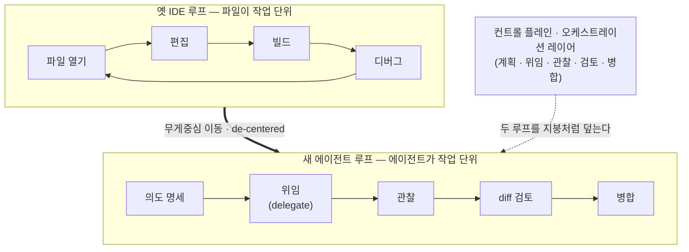

<figure class="post-figure post-figure--header">
<svg role="img" aria-label="오크 커맨더가 파일 편집기 대신, 병렬 에이전트의 상태·diff·알림을 지휘하는 컨트롤 플레인(관제 콘솔) 앞에 선다. 컨트롤 플레인이 새 정문이 되고 편집기는 옆으로 밀려나 여러 계기 중 하나가 된다." viewBox="0 0 760 300" xmlns="http://www.w3.org/2000/svg">
  <title>컨트롤 플레인이 새 정문이 되고, 편집기는 옆으로 밀려난다</title>
  <defs>
    <marker id="ide-hdr-arrow" markerWidth="9" markerHeight="9" refX="7" refY="4.5" orient="auto">
      <path d="M0 0 L9 4.5 L0 9 Z" fill="currentColor"/>
    </marker>
  </defs>

  <!-- 오크 커맨더 -->
  <g>
    <path d="M90 40 h12 l-3 22 h-6 z" fill="currentColor"/>
    <rect x="70" y="60" width="52" height="46" rx="7" fill="var(--secondary-color)" stroke="currentColor" stroke-width="2"/>
    <rect x="80" y="76" width="12" height="5" rx="1" fill="currentColor"/>
    <rect x="100" y="76" width="12" height="5" rx="1" fill="currentColor"/>
    <path d="M83 106 l4 0 l-2 11 z" fill="var(--bg-panel)" stroke="currentColor" stroke-width="1.5"/>
    <path d="M105 106 l4 0 l-2 11 z" fill="var(--bg-panel)" stroke="currentColor" stroke-width="1.5"/>
    <path d="M58 116 L134 116 L148 214 L44 214 Z" fill="none" stroke="currentColor" stroke-width="2"/>
    <circle cx="58" cy="132" r="12" fill="var(--accent-color)" opacity="0.85"/>
    <circle cx="134" cy="132" r="12" fill="var(--accent-color)" opacity="0.85"/>
    <line x1="132" y1="150" x2="182" y2="146" stroke="currentColor" stroke-width="5" stroke-linecap="round"/>
    <text x="96" y="238" text-anchor="middle" font-size="12.5" font-weight="700" fill="currentColor">오크 커맨더</text>
    <text x="96" y="256" text-anchor="middle" font-size="10.5" fill="currentColor" opacity="0.75">지휘 · 위임 · 검토</text>
  </g>

  <!-- 지휘 화살표 -->
  <g>
    <line x1="176" y1="150" x2="244" y2="150" stroke="currentColor" stroke-width="2" marker-end="url(#ide-hdr-arrow)"/>
    <text x="210" y="142" text-anchor="middle" font-size="10.5" fill="currentColor" opacity="0.8">지휘</text>
  </g>

  <!-- 새 정문: 컨트롤 플레인(관제 콘솔) -->
  <g>
    <path d="M232 252 L232 100 Q232 78 254 78 L474 78 Q496 78 496 100 L496 252" fill="none" stroke="var(--gold)" stroke-width="3"/>
    <text x="364" y="66" text-anchor="middle" font-size="12.5" font-weight="700" fill="var(--primary-color)">새 정문 · front door</text>
    <rect x="250" y="92" width="228" height="150" rx="5" fill="var(--bg-panel)" stroke="currentColor" stroke-width="2"/>
    <text x="358" y="112" text-anchor="middle" font-size="12.5" font-weight="700" fill="currentColor">컨트롤 플레인 · 관제 콘솔</text>
    <circle cx="470" cy="94" r="12" fill="var(--accent-color)"/>
    <text x="470" y="98" text-anchor="middle" font-size="11" font-weight="700" fill="var(--bg-panel)">3</text>
    <g font-size="10">
      <rect x="262" y="124" width="204" height="30" rx="3" fill="none" stroke="currentColor" stroke-width="1.5"/>
      <circle cx="278" cy="139" r="4.5" fill="var(--secondary-color)"/>
      <text x="292" y="143" fill="currentColor">agent · 랜딩 페이지 · 실행중</text>
      <rect x="262" y="160" width="204" height="30" rx="3" fill="none" stroke="currentColor" stroke-width="1.5"/>
      <circle cx="278" cy="175" r="4.5" fill="var(--gold)"/>
      <text x="292" y="179" fill="currentColor">agent · 백엔드 · 검토 대기</text>
      <rect x="262" y="196" width="204" height="30" rx="3" fill="none" stroke="currentColor" stroke-width="1.5"/>
      <circle cx="278" cy="211" r="4.5" fill="var(--accent-color)"/>
      <text x="292" y="215" fill="currentColor">agent · 이메일 연동 · diff</text>
    </g>
  </g>

  <!-- 밀려남 화살표 -->
  <g>
    <line x1="500" y1="164" x2="586" y2="164" stroke="currentColor" stroke-width="2" stroke-dasharray="4 4" marker-end="url(#ide-hdr-arrow)"/>
    <text x="543" y="156" text-anchor="middle" font-size="10.5" fill="currentColor" opacity="0.8">밀려남</text>
  </g>

  <!-- 옆으로 밀려난 편집기 -->
  <g opacity="0.85">
    <g transform="rotate(7 655 172)">
      <rect x="596" y="118" width="122" height="52" rx="3" fill="none" stroke="currentColor" stroke-width="1.5"/>
      <rect x="596" y="118" width="40" height="14" rx="2" fill="var(--bg-panel)" stroke="currentColor" stroke-width="1.5"/>
      <line x1="608" y1="136" x2="660" y2="136" stroke="currentColor" stroke-width="3" opacity="0.6"/>
      <line x1="608" y1="146" x2="700" y2="146" stroke="var(--secondary-color)" stroke-width="3"/>
      <line x1="608" y1="156" x2="670" y2="156" stroke="var(--accent-color)" stroke-width="3"/>
    </g>
    <text x="657" y="200" text-anchor="middle" font-size="11.5" font-weight="700" fill="currentColor">편집기 · 파일 탭</text>
    <text x="657" y="218" text-anchor="middle" font-size="10" fill="currentColor" opacity="0.75">여러 계기 중 하나</text>
  </g>
</svg>
<figcaption>무대가 바뀐다 &mdash; 오크 커맨더가 파일을 한 줄씩 편집하는 대신, 병렬 에이전트의 상태·diff·알림을 지휘하는 <strong>컨트롤 플레인</strong> 앞에 선다. 컨트롤 플레인이 새 &lsquo;정문(front door)&rsquo;이 되고, 편집기는 옆으로 밀려나 여러 계기 중 하나가 된다.</figcaption>
</figure>

## 원문 정보

> - **제목**: Death of the IDE?
> - **출처**: Addy Osmani · Elevate ([addyo.substack.com](https://addyo.substack.com))
> - **발행**: 2026-03-20 · 약 8~10분 분량
> - **원문 링크**: <https://addyo.substack.com/p/death-of-the-ide>

『Beyond Vibe Coding』의 저자이자 구글 크롬 엔지니어링 리드인 Addy Osmani가, AI 코딩 에이전트가 개발자의 **주 작업 무대 자체**를 어떻게 재편하는지를 도구 관점에서 관찰한 글이다. "무엇으로 코딩하느냐"가 아니라 "어디서 일하느냐"의 문제이기에 Articles/AI-Engineering에 담는다.

## 한 줄 요약 (TL;DR)

IDE는 사라지지 않는다. 다만 **중심에서 밀려난다(de-centered).** 개발의 무게중심이 파일을 한 줄씩 편집하는 편집기에서, 자율 에이전트를 **계획·위임·관찰·검토·병합**하는 오케스트레이션 레이어(컨트롤 플레인)로 옮겨 가고 있다. 편집기는 없어지지 않지만 더 이상 "정문"이 아니라, 정밀 조사와 어려운 문제 해결을 위한 여러 계기 중 하나가 된다.

개발의 무게중심이 어디로 옮겨 가는지를 한 장으로 본다. **파일이 아니라 에이전트가 작업의 단위**이며, 두 루프 위를 컨트롤 플레인이 지붕처럼 덮는다.

## 왜 이 글을 골랐나

지난 몇 주 이 위키가 다룬 흐름은 대체로 "AI에 손을 놓지 마라"는 **규율·경고**의 담론이었다 — [바이브 코딩과 에이전틱 엔지니어링의 경계](/2026/06/25/vibe-coding-and-agentic-engineering.html), [짧은 목줄로 통제하기](/2026/07/06/short-leash-ai-coding.html), [에이전틱 코딩은 함정이다](/2026/07/03/agentic-coding-is-a-trap.html). 이 글은 결이 다르다. 개별 프롬프트 기법이나 리뷰 규율이 아니라, **그 모든 일이 벌어지는 "표면(surface)" 자체가 어디로 이동하는가**를 도구 지형도로 그린다.

특히 저자 Addy Osmani는 이 위키가 이미 다룬 [Loop Engineering](/2026/06/19/loop-engineering.html)의 저자이기도 하다. "에이전트를 프롬프트하는 대신 에이전트를 프롬프트하는 **루프를 설계**하라"던 그 주장의 연장선에서, 이번엔 그 루프를 담아내는 **UI/작업 무대**가 IDE에서 오케스트레이션 대시보드로 넘어가는 현장을 보고한다. "무엇이 죽고 무엇이 살아남는가"를 냉정하게 가른다는 점에서 지금 읽을 가치가 크다.

## 핵심 내용

### IDE는 죽었는가 — "컨트롤 플레인"이 전면으로

저자의 답은 자극적인 제목과 달리 신중하다. IDE가 죽는 게 아니라 **컨트롤 플레인(에이전트를 오케스트레이션하는 인터페이스)이 주 표면(primary surface)으로 올라서고, 편집기는 그 아래 여러 계기 중 하나로 내려앉는다**는 것이다.

> "The control plane is becoming the primary surface, and the editor is becoming one of several instruments underneath it."

이 변화는 한 도구의 유행이 아니라 여러 제품에서 동시에 나타나는 **수렴 현상**이다. 저자는 Conductor, Claude Code(웹·데스크톱), GitHub Copilot Agent, Google Jules, Vibe Kanban, cmux 같은 도구들을 증거로 든다. 상징적인 사례가 Cursor다. 새 인터페이스(원문의 "Glass")를 두고 사용자들이 "이제 **IDE라기보다 에이전트 오케스트레이터처럼 느껴진다**"고 말한다는 것이다.

### 파일 편집에서 워크스트림 조종으로

핵심 전환은 **작업 루프의 모양**이 바뀌는 데 있다.

- **옛 IDE 루프**: 파일 열기 → 편집 → 빌드 → 디버그 → 반복
- **새 에이전트 루프**: 의도 명세 → 위임(delegate) → 관찰 → diff 검토 → 병합

차이를 만드는 두 축은 **도구를 쓸 줄 아는 자율성(tool-using autonomy)**과 **통제 가능한 인터페이스(governable interface)**다. 저자는 실제 도구로 이를 예시한다. Claude Code는 격리된 클라우드 에이전트에 작업을 넘기고, Copilot Agent는 멀티 파일 변경을 **계획**하고 브랜치를 만들고 테스트를 돌리고 PR을 올린다. Conductor는 여러 Claude Code 에이전트를 격리 워크스페이스에서 동시에 굴리고, Jules는 비동기 백그라운드 작업을 맡는다. 이 모든 것을 한 문장으로 압축한 것이 이 글의 표어다.

> "The agent is the unit of work, not the file."
> (작업의 단위는 파일이 아니라 에이전트다.)

<figure class="post-figure">
<svg role="img" aria-label="옛 IDE 루프(열기→편집→빌드→디버그→반복)에서는 손이 키보드 위에서 한 줄씩 타이핑하고, 새 에이전트 루프(의도→위임→관찰→diff 검토→병합)에서는 손이 지휘봉을 들고 감독한다." viewBox="0 0 760 320" xmlns="http://www.w3.org/2000/svg">
  <title>키보드에서 지휘봉으로 — 옛 IDE 루프 vs 새 에이전트 루프</title>
  <defs>
    <marker id="ide-loop-arrow" markerWidth="9" markerHeight="9" refX="7" refY="4.5" orient="auto">
      <path d="M0 0 L9 4.5 L0 9 Z" fill="currentColor"/>
    </marker>
  </defs>

  <!-- 옛 IDE 루프 -->
  <text x="185" y="26" text-anchor="middle" font-size="13.5" font-weight="700" fill="var(--primary-color)">옛 IDE 루프</text>
  <circle cx="185" cy="158" r="88" fill="none" stroke="currentColor" stroke-width="2" stroke-dasharray="3 5" opacity="0.55"/>
  <path d="M258 118 a88 88 0 0 1 8 30" fill="none" stroke="currentColor" stroke-width="2" opacity="0.55" marker-end="url(#ide-loop-arrow)"/>
  <path d="M112 198 a88 88 0 0 1 -8 -30" fill="none" stroke="currentColor" stroke-width="2" opacity="0.55" marker-end="url(#ide-loop-arrow)"/>
  <g font-size="11" text-anchor="middle">
    <g fill="var(--bg-panel)" stroke="currentColor" stroke-width="1.5">
      <rect x="152" y="58" width="66" height="26" rx="4"/>
      <rect x="245" y="145" width="66" height="26" rx="4"/>
      <rect x="152" y="232" width="66" height="26" rx="4"/>
      <rect x="59" y="145" width="66" height="26" rx="4"/>
    </g>
    <text x="185" y="75" fill="currentColor">열기</text>
    <text x="278" y="162" fill="currentColor">편집</text>
    <text x="185" y="249" fill="currentColor">빌드</text>
    <text x="92" y="162" fill="currentColor">디버그</text>
  </g>
  <!-- 키보드 + 손 -->
  <g>
    <rect x="150" y="150" width="70" height="26" rx="3" fill="none" stroke="currentColor" stroke-width="1.5"/>
    <g fill="currentColor" opacity="0.5">
      <rect x="156" y="156" width="10" height="6"/>
      <rect x="170" y="156" width="10" height="6"/>
      <rect x="184" y="156" width="10" height="6"/>
      <rect x="198" y="156" width="10" height="6"/>
      <rect x="163" y="165" width="10" height="6"/>
      <rect x="177" y="165" width="10" height="6"/>
      <rect x="191" y="165" width="10" height="6"/>
    </g>
    <ellipse cx="185" cy="134" rx="15" ry="10" fill="var(--secondary-color)" opacity="0.85" stroke="currentColor" stroke-width="1.5"/>
    <line x1="178" y1="143" x2="176" y2="152" stroke="currentColor" stroke-width="2"/>
    <line x1="185" y1="144" x2="185" y2="152" stroke="currentColor" stroke-width="2"/>
    <line x1="192" y1="143" x2="194" y2="152" stroke="currentColor" stroke-width="2"/>
  </g>
  <text x="185" y="300" text-anchor="middle" font-size="10.5" fill="currentColor" opacity="0.78">손은 키보드 위 — 한 줄씩 타이핑</text>

  <!-- 전환 화살표 -->
  <line x1="308" y1="158" x2="452" y2="158" stroke="currentColor" stroke-width="2.5" marker-end="url(#ide-loop-arrow)"/>
  <text x="380" y="148" text-anchor="middle" font-size="11" font-weight="700" fill="var(--primary-color)">키보드 → 지휘봉</text>
  <text x="380" y="176" text-anchor="middle" font-size="10" fill="currentColor" opacity="0.75">무게중심 이동</text>

  <!-- 새 에이전트 루프 -->
  <text x="575" y="26" text-anchor="middle" font-size="13.5" font-weight="700" fill="var(--primary-color)">새 에이전트 루프</text>
  <circle cx="575" cy="158" r="88" fill="none" stroke="currentColor" stroke-width="2" stroke-dasharray="3 5" opacity="0.55"/>
  <path d="M648 118 a88 88 0 0 1 8 30" fill="none" stroke="currentColor" stroke-width="2" opacity="0.55" marker-end="url(#ide-loop-arrow)"/>
  <path d="M502 198 a88 88 0 0 1 -8 -30" fill="none" stroke="currentColor" stroke-width="2" opacity="0.55" marker-end="url(#ide-loop-arrow)"/>
  <g font-size="10.5" text-anchor="middle">
    <g fill="var(--bg-panel)" stroke="currentColor" stroke-width="1.5">
      <rect x="546" y="52" width="58" height="26" rx="4"/>
      <rect x="632" y="112" width="66" height="26" rx="4"/>
      <rect x="600" y="214" width="58" height="26" rx="4"/>
      <rect x="492" y="214" width="72" height="26" rx="4"/>
      <rect x="454" y="112" width="58" height="26" rx="4"/>
    </g>
    <text x="575" y="69" fill="currentColor">의도</text>
    <text x="665" y="129" fill="currentColor">위임</text>
    <text x="629" y="231" fill="currentColor">관찰</text>
    <text x="528" y="231" fill="currentColor">diff 검토</text>
    <text x="483" y="129" fill="currentColor">병합</text>
  </g>
  <!-- 지휘봉 -->
  <g>
    <line x1="556" y1="176" x2="596" y2="138" stroke="currentColor" stroke-width="4" stroke-linecap="round"/>
    <circle cx="554" cy="178" r="6" fill="var(--gold)" stroke="currentColor" stroke-width="1.5"/>
    <path d="M600 128 q10 6 6 18" fill="none" stroke="var(--secondary-color)" stroke-width="2"/>
    <path d="M608 122 q16 10 10 30" fill="none" stroke="var(--secondary-color)" stroke-width="2" opacity="0.6"/>
  </g>
  <text x="575" y="300" text-anchor="middle" font-size="10.5" fill="currentColor" opacity="0.78">손은 지휘봉 — 위임하고 감독</text>
</svg>
<figcaption>같은 &lsquo;일&rsquo;, 다른 손놀림 &mdash; 옛 루프에서는 손이 키보드 위에서 코드를 한 줄씩 두드리지만, 새 루프에서는 손이 지휘봉을 들고 병렬 에이전트를 위임·감독한다. 열기·편집·빌드·디버그의 반복이 의도·위임·관찰·diff 검토·병합의 지휘로 바뀐다.</figcaption>
</figure>

### 형태를 갖추는 오케스트레이션 레이어 — 다섯 가지 수렴 패턴

이 글에서 가장 실무적인 대목이다. 저자는 여러 도구가 **서로 베낀 것도 아닌데 같은 방향으로 수렴하는** 다섯 가지 인터페이스 패턴을 정리한다.

1. **작업 격리를 기본 요소로(Work isolation as a primitive).** 병렬 에이전트는 서로 충돌하지 않도록 격리가 필수다. 표준 해법은 Git worktree(또는 유사 기법)로, Conductor는 각 에이전트 세션을 격리 워크스페이스에 매핑하고 Vibe Kanban도 칸반 흐름에 같은 방식을 쓴다.
2. **계획과 작업 상태가 곧 주 UI(Planning and task state as primary UI).** "탭과 파일" 대신 "**작업(task)과 상태(state)**"가 화면의 주인이 된다. 랜딩 페이지·백엔드 서비스·이메일 연동 같은 **작업 카드**가 늘어서고, 자율 에이전트로 이뤄진 "팀"을 가벼운 프로젝트 보드처럼 관리한다.
3. **백그라운드 에이전트와 비동기 우선 설계(Background agents & async-first).** 에이전트는 개발자가 지켜보지 않아도 돌아간다. 의도를 정의하고 자리를 뜬 뒤, 끝나면 검토한다. 개발자의 **주의(attention)를 귀한 자원으로 인정**하는 설계이며, IDE의 실시간·동기 피드백과 결별한다.
4. **병렬 에이전트를 위한 주의 관리(Attention management).** 진짜 병목은 "**지금 어느 에이전트가 나를 필요로 하는가**"를 아는 일이다. Conductor는 여러 세션의 진행 상황을 실시간으로 보여 주고, cmux는 알림 링과 안 읽음 배지를 도입했다. "에이전트가 사람의 개입을 필요로 함"이 일급 이벤트(first-class event)가 된다.
5. **소프트웨어 생애주기에 심어진 에이전트(Embedded into the lifecycle).** Copilot은 GitHub Actions와 통합되고 컨트롤 레이어로 보호되며, 실제 출시 과정(이슈 → PR → CI → 병합)에 연결된다.

병렬 워크스페이스, diff 우선 리뷰, 작업 상태, 백그라운드 실행, 생애주기 통합 — 이 다섯이 맞물려 하나의 **오케스트레이션 생태계**를 이룬다는 것이 저자의 관찰이다.

> "Your attention is too valuable to spend watching a progress bar."
> (진행 막대나 쳐다보며 쓰기엔 당신의 주의가 너무 귀하다.)

<figure class="post-figure">
<svg role="img" aria-label="다섯 가지 수렴 패턴 — 작업 격리(worktree), 작업·상태 보드, 백그라운드·비동기, 주의 라우팅, 생애주기 통합 — 이 하나의 컨트롤 플레인(오케스트레이션 레이어) 아래 부품처럼 조립된다." viewBox="0 0 760 320" xmlns="http://www.w3.org/2000/svg">
  <title>다섯 수렴 패턴이 컨트롤 플레인 아래 부품처럼 조립된다</title>
  <!-- 지붕: 컨트롤 플레인 -->
  <rect x="40" y="40" width="680" height="46" rx="5" fill="var(--bg-panel)" stroke="var(--gold)" stroke-width="3"/>
  <text x="380" y="69" text-anchor="middle" font-size="14" font-weight="700" fill="var(--primary-color)">컨트롤 플레인 · 오케스트레이션 레이어</text>

  <!-- 조립 연결선 -->
  <g stroke="currentColor" stroke-width="2" opacity="0.5">
    <line x1="108.5" y1="86" x2="108.5" y2="150"/>
    <line x1="243.5" y1="86" x2="243.5" y2="150"/>
    <line x1="378.5" y1="86" x2="378.5" y2="150"/>
    <line x1="513.5" y1="86" x2="513.5" y2="150"/>
    <line x1="648.5" y1="86" x2="648.5" y2="150"/>
  </g>
  <g fill="var(--gold)">
    <rect x="103.5" y="146" width="10" height="6"/>
    <rect x="238.5" y="146" width="10" height="6"/>
    <rect x="373.5" y="146" width="10" height="6"/>
    <rect x="508.5" y="146" width="10" height="6"/>
    <rect x="643.5" y="146" width="10" height="6"/>
  </g>

  <!-- 부품 블록 -->
  <g fill="var(--bg-panel)" stroke="currentColor" stroke-width="2">
    <rect x="48" y="152" width="121" height="146" rx="5"/>
    <rect x="183" y="152" width="121" height="146" rx="5"/>
    <rect x="318" y="152" width="121" height="146" rx="5"/>
    <rect x="453" y="152" width="121" height="146" rx="5"/>
    <rect x="588" y="152" width="121" height="146" rx="5"/>
  </g>

  <!-- 번호 배지 -->
  <g>
    <circle cx="68" cy="174" r="12" fill="var(--accent-color)"/><text x="68" y="178" text-anchor="middle" font-size="12" font-weight="700" fill="var(--bg-panel)">1</text>
    <circle cx="203" cy="174" r="12" fill="var(--accent-color)"/><text x="203" y="178" text-anchor="middle" font-size="12" font-weight="700" fill="var(--bg-panel)">2</text>
    <circle cx="338" cy="174" r="12" fill="var(--accent-color)"/><text x="338" y="178" text-anchor="middle" font-size="12" font-weight="700" fill="var(--bg-panel)">3</text>
    <circle cx="473" cy="174" r="12" fill="var(--accent-color)"/><text x="473" y="178" text-anchor="middle" font-size="12" font-weight="700" fill="var(--bg-panel)">4</text>
    <circle cx="608" cy="174" r="12" fill="var(--accent-color)"/><text x="608" y="178" text-anchor="middle" font-size="12" font-weight="700" fill="var(--bg-panel)">5</text>
  </g>

  <!-- ① worktree 아이콘 -->
  <g fill="none" stroke="currentColor" stroke-width="1.5">
    <path d="M108.5 192 v6 M108.5 198 q-13 0 -13 10 M108.5 198 q13 0 13 10"/>
    <rect x="88" y="208" width="15" height="10" rx="2"/>
    <rect x="114" y="208" width="15" height="10" rx="2"/>
  </g>
  <!-- ② kanban 아이콘 -->
  <g stroke="currentColor" stroke-width="1.5" fill="none">
    <rect x="231" y="192" width="9" height="22" rx="1.5"/>
    <rect x="243" y="192" width="9" height="22" rx="1.5"/>
    <rect x="255" y="192" width="9" height="22" rx="1.5"/>
  </g>
  <rect x="232.5" y="195" width="6" height="5" fill="var(--secondary-color)"/>
  <!-- ③ clock 아이콘 -->
  <g fill="none" stroke="currentColor" stroke-width="1.5">
    <circle cx="378.5" cy="203" r="13"/>
    <path d="M378.5 203 v-8 M378.5 203 l7 4"/>
  </g>
  <!-- ④ bell 아이콘 -->
  <g>
    <path d="M505 210 q0 -16 9 -16 q9 0 9 16 l3 4 h-24 z" fill="none" stroke="currentColor" stroke-width="1.5"/>
    <circle cx="514" cy="218" r="2.5" fill="currentColor"/>
    <circle cx="524" cy="192" r="4" fill="var(--accent-color)"/>
  </g>
  <!-- ⑤ lifecycle 아이콘 -->
  <g>
    <line x1="631" y1="203" x2="667" y2="203" stroke="currentColor" stroke-width="1.5"/>
    <circle cx="631" cy="203" r="3.5" fill="none" stroke="currentColor" stroke-width="1.5"/>
    <circle cx="643" cy="203" r="3.5" fill="none" stroke="currentColor" stroke-width="1.5"/>
    <circle cx="655" cy="203" r="3.5" fill="none" stroke="currentColor" stroke-width="1.5"/>
    <circle cx="667" cy="203" r="3.5" fill="var(--accent-color)"/>
  </g>

  <!-- 제목 & 태그 -->
  <g text-anchor="middle">
    <text x="108.5" y="250" font-size="11.5" font-weight="700" fill="currentColor">작업 격리</text>
    <text x="108.5" y="272" font-size="9.5" fill="currentColor" opacity="0.72">git worktree</text>
    <text x="243.5" y="250" font-size="11.5" font-weight="700" fill="currentColor">작업·상태 보드</text>
    <text x="243.5" y="272" font-size="9.5" fill="currentColor" opacity="0.72">task·state 중심 UI</text>
    <text x="378.5" y="250" font-size="11.5" font-weight="700" fill="currentColor">백그라운드·비동기</text>
    <text x="378.5" y="272" font-size="9.5" fill="currentColor" opacity="0.72">자리 비워도 실행</text>
    <text x="513.5" y="250" font-size="11.5" font-weight="700" fill="currentColor">주의 라우팅</text>
    <text x="513.5" y="272" font-size="9.5" fill="currentColor" opacity="0.72">알림·안읽음 배지</text>
    <text x="648.5" y="250" font-size="11.5" font-weight="700" fill="currentColor">생애주기 통합</text>
    <text x="648.5" y="272" font-size="9.5" fill="currentColor" opacity="0.72">이슈→PR→CI→병합</text>
  </g>
</svg>
<figcaption>서로 베낀 것도 아닌데 같은 방향으로 &mdash; 다섯 가지 인터페이스 패턴(작업 격리 · 작업·상태 보드 · 백그라운드·비동기 · 주의 라우팅 · 생애주기 통합)이 맞물려 하나의 <strong>오케스트레이션 레이어</strong> 아래 부품처럼 조립된다.</figcaption>
</figure>

### 그럼에도 개발자가 여전히 IDE를 찾는 이유

저자는 "IDE는 죽었다"는 명제에 대한 **가장 강한 반론**을 스스로 제시한다. IDE는 여러 어려운 문제를 **고해상도 피드백 루프**로 압축해 준다 — 정밀한 코드 내비게이션, 국소적 추론(local reasoning), 인터랙티브 디버깅, 그리고 이해를 위해 시스템을 **직접 만지는** 조작. 야심 찬 오케스트레이션 도구들조차 "diff 검토 → 코멘트 → 편집기에서 열기" 같은 **탈출구(escape hatch)**, 곧 수동 편집 경로를 남겨 둔다.

현재 에이전트의 한계도 분명하다. 대형 저장소에서의 멀티 파일 리팩터링은 여전히 어렵고, 시스템의 멘털 모델을 붙잡는 데는 인터랙티브 내비게이션과 사람의 판단이 아직 필수다. 특히 위험한 실패 양식이 있다.

> 에이전트가 "**90% 맞지만 미묘하게 틀린(90% correct and subtly broken)**" 결과를 낼 때, 그 오류를 찾아내는 비용이 처음부터 직접 짜는 비용을 넘어서곤 한다.

### 새로운 비용 — 리뷰 피로와 거버넌스 오버헤드

무대가 바뀌면 비용도 옮겨 간다. 저자는 이를 **노동의 반전(labor inversion)**으로 짚는다. 코드를 **쓰는** 일에서, 병렬 에이전트가 쏟아 내는 결과물을 **검토하는** 일로 무게가 이동한다는 것이다. 그래서 새로 등장하는 부담이 두 가지다.

- **리뷰 피로(review fatigue).** 여러 diff를 동시에 검토하는 일이 새로운 병목이자 피로원이 된다.
- **거버넌스 오버헤드.** 에이전트가 도구·저장소·외부 시스템 접근 권한을 얻을수록 **보안 표면**이 넓어진다. 이제 "무엇을 할 수 있는가(capabilities)"만큼 "**무엇을 허용하는가(permissions)**"가 중요해지고, CI를 건드리는 비동기 에이전트에는 관측 가능성(observability)과 통제가 필수가 된다. **거버넌스는 선택이 아니다.**

그래서 잘 만든 도구들은 완전 자율이 아니라 **주의 라우팅, 구조화된 계획, 리뷰 우선 게이트(review-first gate)**를 강조한다.

### 무엇이 살아남는가 — IDE인가, 컨트롤 플레인인가, 둘 다인가

저자는 결론을 두 가지 프레이밍으로 제시한다.

- **버전 1 — 탈중심화된 IDE.** IDE는 더 이상 주 작업 무대가 아니라, 표적 조사·디버깅·마지막 편집을 위한 종속 계기가 된다. 계획·오케스트레이션·리뷰·에이전트 관리는 대시보드, 이슈 트래커, 관측 터미널, 클라우드 컨트롤 플레인으로 빠져나간다. *"파일 편집기는 여전히 거기 있다. 다만 더 이상 정문이 아닐 뿐이다."*
- **버전 2 — 더 커진 IDE.** 새로운 "IDE"가 멀티 에이전트 오케스트레이션, 격리 워크스페이스, 권한/감사 로그, diff 우선 리뷰, 도구 연결, 주의 라우팅을 모두 품는다. 편집기는 남지만 중심은 아니다.

어느 쪽으로 부르든 결론은 같다. **IDE는 죽는 게 아니라 중심에서 밀려난다.** 일은 바깥의 오케스트레이션 표면으로 흘러가고, 사람은 의도를 정의하고 병렬 런타임에 위임하며 감독·검토·통제한다 — 끊임없이 타이핑하는 대신에.

<figure class="post-figure">
<svg role="img" aria-label="버전 1은 탈중심화된 IDE로, 편집기가 작아지고 계획·오케스트레이션·리뷰가 대시보드·이슈 트래커·관측 터미널·클라우드 컨트롤 플레인으로 빠져나간다. 버전 2는 더 커진 IDE로, 하나의 확장된 IDE가 멀티 에이전트 오케스트레이션·격리 워크스페이스·권한 감사·diff 리뷰·주의 라우팅을 모두 품고 편집기는 그 안의 한 모듈이 된다. 공통 결론은 편집기는 남지만 정문은 아니라는 것이다." viewBox="0 0 760 340" xmlns="http://www.w3.org/2000/svg">
  <title>버전 1(탈중심화된 IDE) vs 버전 2(더 커진 IDE) — 공통 결론: 편집기는 남지만 정문은 아니다</title>
  <defs>
    <marker id="ide-v-arrow" markerWidth="9" markerHeight="9" refX="7" refY="4.5" orient="auto">
      <path d="M0 0 L9 4.5 L0 9 Z" fill="currentColor"/>
    </marker>
  </defs>

  <!-- 버전 1: 탈중심화된 IDE -->
  <text x="195" y="26" text-anchor="middle" font-size="13" font-weight="700" fill="var(--primary-color)">버전 1 · 탈중심화된 IDE</text>
  <g font-size="9.5" text-anchor="middle">
    <g fill="var(--bg-panel)" stroke="currentColor" stroke-width="1.5">
      <rect x="30" y="58" width="96" height="32" rx="4"/>
      <rect x="252" y="58" width="96" height="32" rx="4"/>
      <rect x="30" y="212" width="96" height="32" rx="4"/>
      <rect x="240" y="212" width="108" height="32" rx="4"/>
    </g>
    <text x="78" y="78" fill="currentColor">대시보드</text>
    <text x="300" y="78" fill="currentColor">이슈 트래커</text>
    <text x="78" y="232" fill="currentColor">관측 터미널</text>
    <text x="294" y="232" fill="currentColor">클라우드 컨트롤</text>
  </g>
  <rect x="162" y="130" width="66" height="42" rx="4" fill="var(--bg-panel)" stroke="currentColor" stroke-width="2" opacity="0.9"/>
  <text x="195" y="150" text-anchor="middle" font-size="10.5" font-weight="700" fill="currentColor">편집기</text>
  <text x="195" y="164" text-anchor="middle" font-size="8.5" fill="currentColor" opacity="0.7">종속 계기</text>
  <g stroke="currentColor" stroke-width="1.5" opacity="0.75" marker-end="url(#ide-v-arrow)">
    <line x1="170" y1="132" x2="110" y2="92"/>
    <line x1="220" y1="132" x2="285" y2="92"/>
    <line x1="170" y1="170" x2="110" y2="210"/>
    <line x1="222" y1="170" x2="282" y2="210"/>
  </g>
  <text x="195" y="284" text-anchor="middle" font-size="10" fill="currentColor" opacity="0.78">일이 바깥 표면으로 빠져나간다</text>

  <!-- 구분선 -->
  <line x1="380" y1="44" x2="380" y2="256" stroke="currentColor" stroke-width="1" stroke-dasharray="3 5" opacity="0.4"/>

  <!-- 버전 2: 더 커진 IDE -->
  <text x="560" y="26" text-anchor="middle" font-size="13" font-weight="700" fill="var(--primary-color)">버전 2 · 더 커진 IDE</text>
  <rect x="400" y="42" width="320" height="214" rx="6" fill="none" stroke="var(--gold)" stroke-width="3"/>
  <text x="560" y="62" text-anchor="middle" font-size="11.5" font-weight="700" fill="var(--primary-color)">확장된 IDE</text>
  <g font-size="9.5" text-anchor="middle">
    <g fill="var(--bg-panel)" stroke="currentColor" stroke-width="1.5">
      <rect x="412" y="74" width="140" height="30" rx="3"/>
      <rect x="412" y="112" width="140" height="30" rx="3"/>
      <rect x="412" y="150" width="140" height="30" rx="3"/>
      <rect x="412" y="188" width="140" height="30" rx="3"/>
      <rect x="562" y="74" width="146" height="30" rx="3"/>
      <rect x="562" y="112" width="146" height="30" rx="3"/>
      <rect x="562" y="150" width="146" height="30" rx="3"/>
    </g>
    <text x="482" y="93" fill="currentColor">멀티 에이전트</text>
    <text x="482" y="131" fill="currentColor">격리 워크스페이스</text>
    <text x="482" y="169" fill="currentColor">권한·감사 로그</text>
    <text x="482" y="207" fill="currentColor">주의 라우팅</text>
    <text x="635" y="93" fill="currentColor">diff 우선 리뷰</text>
    <text x="635" y="131" fill="currentColor">도구 연결</text>
  </g>
  <rect x="562" y="188" width="146" height="30" rx="3" fill="var(--bg-panel)" stroke="var(--accent-color)" stroke-width="2"/>
  <text x="635" y="207" text-anchor="middle" font-size="9.5" fill="currentColor">편집기 · 중심은 아님</text>

  <!-- 공통 결론 배너 -->
  <line x1="195" y1="292" x2="330" y2="300" stroke="currentColor" stroke-width="1.5" opacity="0.7" marker-end="url(#ide-v-arrow)"/>
  <line x1="560" y1="264" x2="452" y2="300" stroke="currentColor" stroke-width="1.5" opacity="0.7" marker-end="url(#ide-v-arrow)"/>
  <rect x="150" y="300" width="460" height="34" rx="5" fill="var(--bg-panel)" stroke="var(--gold)" stroke-width="2.5"/>
  <g transform="translate(174 309)">
    <rect x="0" y="0" width="14" height="18" rx="1.5" fill="none" stroke="var(--primary-color)" stroke-width="1.5"/>
    <circle cx="10.5" cy="9" r="1.4" fill="var(--primary-color)"/>
  </g>
  <text x="404" y="322" text-anchor="middle" font-size="12.5" font-weight="700" fill="var(--primary-color)">편집기는 남지만 정문은 아니다</text>
</svg>
<figcaption>부르는 이름은 둘, 결론은 하나 &mdash; <strong>버전 1</strong>은 편집기가 작아지고 계획·리뷰·오케스트레이션이 바깥 표면으로 빠져나간 &lsquo;탈중심화된 IDE&rsquo;, <strong>버전 2</strong>는 그 모든 것을 삼킨 &lsquo;더 커진 IDE&rsquo;다. 어느 쪽이든 편집기는 남지만 더 이상 정문이 아니다.</figcaption>
</figure>

## 분석과 인사이트

**"죽음"이라는 제목은 낚시지만, 진단은 정확하다.** 이 글의 미덕은 유행어("IDE는 끝났다")를 팔지 않고, 그 표현을 **"탈중심화"라는 더 정밀한 단어로 교정**한다는 데 있다. 사라지는 것은 IDE가 아니라 "IDE가 곧 개발의 중심"이라는 전제다. 실제로 개발자가 하루에 열어 두는 첫 화면이 편집기에서 작업 보드/에이전트 대시보드로 바뀌고 있다면, 그것만으로도 "중심의 이동"은 이미 일어나는 중이다.

**다섯 패턴은 "무엇을 배워야 하는가"의 지도이기도 하다.** 작업 격리(worktree), 작업/상태 UI, 비동기 설계, 주의 라우팅, 생애주기 통합 — 이 목록은 곧 **에이전트 시대에 가치가 오르는 엔지니어링 역량**이다. Git worktree를 능숙히 다루고, CI/CD와 권한 모델을 이해하며, 관측 가능성을 설계할 줄 아는 사람이 "에이전트 함대의 관제사"로 유리해진다. 이는 이 위키가 [Codex의 agent loop](/2026/06/25/codex-agent-loop.html)에서 본 "하니스가 LLM을 부리는 방식", [확률적 엔지니어링과 24-7 직원](/2026/06/25/probabilistic-engineering-and-the-24-7-employee.html)에서 본 "밤새 도는 에이전트 함대"와 정확히 같은 그림의 UI 버전이다.

**동의하는 지점 — 병목은 생성이 아니라 검토와 주의다.** 저자가 "주의 관리"를 다섯 패턴의 하나로, "리뷰 피로"를 새 비용으로 못 박은 것은 옳다. 생성이 공짜에 가까워질수록 병목은 **사람의 검증 대역폭**으로 이동한다. 이는 [검증이 비싸지고 인지적 항복이 온다](/2026/06/23/fowler-fragments-verification-cognitive-surrender.html)에서 본 비대칭과 같은 결이다. "90% 맞지만 미묘하게 틀린" 실패 양식은 이 병목이 왜 자동화로 쉽게 사라지지 않는지를 설명한다 — 틀린 10%를 찾는 비용이 처음부터 짜는 비용을 넘어설 수 있기 때문이다.

**이견 혹은 유보 — "정문이 바뀐다"와 "역량이 밀려난다"는 다르다.** 무대가 오케스트레이션으로 옮겨 가는 것과, 그래서 **국소적 추론·디버깅 역량이 덜 중요해지는 것**은 다른 얘기다. 오히려 저자 스스로 인정하듯, 에이전트가 "미묘하게 틀릴" 때 그것을 잡아내려면 IDE가 주던 고해상도 이해력이 **더** 필요하다. 컨트롤 플레인이 정문이 될수록, 편집기에서만 길러지는 그 근육이 없는 관제사는 위험하다. [에이전틱 코딩은 함정이다](/2026/07/03/agentic-coding-is-a-trap.html)가 경고한 스킬 위축과 겹쳐 읽으면, "탈중심화"는 축복인 동시에 함정이다.

**이 글은 관찰이지 처방이 아니다.** 저자는 도구 지형을 스케치할 뿐, "그래서 손을 놓아도 되는가"에는 답하지 않는다. 그 빈칸을 채우는 것이 [짧은 목줄 방법](/2026/07/06/short-leash-ai-coding.html) 같은 운영 규율이다. 무대가 컨트롤 플레인으로 바뀌어도, **매 diff를 사람이 승인/거부하는 리뷰 우선 게이트**는 사라지지 않는다 — 오히려 저자가 말한 "review-first gate"가 그 규율의 UI적 구현이다.

## 적용 포인트

- **첫 화면을 의식적으로 재배치하라.** 편집기만 열지 말고, "지금 어떤 작업이 어느 상태인가"를 보여 주는 **작업 보드/에이전트 대시보드**를 하루의 정문으로 실험해 보라. 무대가 바뀌는지 직접 느껴 본다.
- **Git worktree를 손에 익혀라.** 병렬 에이전트의 전제는 격리다. worktree(또는 격리 워크스페이스) 없이 여러 에이전트를 굴리면 충돌로 무너진다.
- **"리뷰 우선 게이트"를 기본값으로.** 완전 자율이 아니라, 변경마다 사람이 승인/거부하는 흐름을 기본으로 두라. 리뷰 피로를 줄이려면 diff를 작게, 작업 카드를 명확하게 쪼갠다.
- **주의를 라우팅하라.** "모든 에이전트를 지켜보기"는 불가능하다. 알림/배지로 "**지금 나를 필요로 하는 에이전트**"만 표면으로 올리는 설정을 갖춰라.
- **권한을 능력만큼 설계하라.** 에이전트에 도구·저장소·CI 접근을 줄 때 최소 권한, 감사 로그, 관측 가능성을 함께 건다. 거버넌스는 나중이 아니라 처음부터.
- **편집기 근육을 버리지 마라.** 오케스트레이션으로 무게가 옮겨 가도, "미묘하게 틀린 10%"를 잡는 힘은 여전히 국소적 추론·디버깅에서 나온다. 그 역량을 계속 벼려 둔다.

## 마무리

"IDE의 죽음?"이라는 물음표는 정직하다. Addy Osmani의 답은 부고가 아니라 **좌표 이동의 보고서**다. 개발의 중심은 파일을 한 줄씩 다듬는 편집기에서, 병렬 에이전트를 계획·위임·검토·통제하는 컨트롤 플레인으로 옮겨 가고 있다. 편집기는 정문 자리를 내주지만, 정확성과 이해와 "에이전트가 아직 못 푸는 어려운 문제"를 위한 필수 계기로 남는다. 무대가 바뀌었다면, 이제 우리에게 필요한 것은 더 빠른 타이핑이 아니라 **더 나은 감독**이다.

### 더 읽어보기

- [원문 — Death of the IDE? (Addy Osmani, Elevate)](https://addyo.substack.com/p/death-of-the-ide)
- [Loop Engineering — 에이전트를 프롬프트하는 대신 루프를 설계하라 (Addy Osmani)](/2026/06/19/loop-engineering.html) — 같은 저자가 그린 "루프 설계"의 UI 버전이 이 글이다
- [Codex의 agent loop를 펼쳐 보기](/2026/06/25/codex-agent-loop.html) — 컨트롤 플레인 아래에서 하니스가 LLM을 부리는 방식
- [확률적 엔지니어링과 24-7 직원 (Tim Davis)](/2026/06/25/probabilistic-engineering-and-the-24-7-employee.html) — "밤새 도는 에이전트 함대"의 노동 모델
- [짧은 목줄 방법 (Greg Slepak)](/2026/07/06/short-leash-ai-coding.html) — 무대가 바뀌어도 사라지지 않는 리뷰 우선 규율
- [에이전틱 코딩은 함정이다 (Lars Faye)](/2026/07/03/agentic-coding-is-a-trap.html) — 탈중심화의 그림자: 스킬 위축과 감독의 역설
- [검증이 비싸지고 인지적 항복이 온다 (Martin Fowler fragments)](/2026/06/23/fowler-fragments-verification-cognitive-surrender.html) — 병목이 생성에서 검토로 옮겨 가는 비대칭
