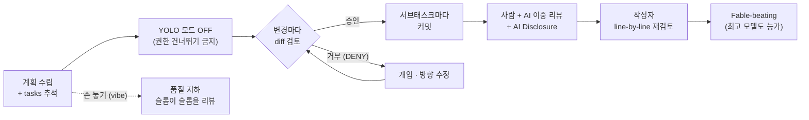

<figure class="post-figure post-figure--header">
<svg role="img" aria-label="왼쪽에는 오크 커맨더가 'AI' 골렘을 짧은 목줄에 바짝 매어 두고 골렘이 내미는 diff 두루마리를 돋보기로 검사하는 통제된 장면, 오른쪽에는 목줄을 놓고 해변 의자에 누운 개발자와 제멋대로 흩어진 12개의 작은 에이전트가 흐릿하게 대비되는 헤더 삽화" viewBox="0 0 720 400" xmlns="http://www.w3.org/2000/svg">
  <title>통제된 한 마리 vs 풀어놓은 열두 마리 — 짧은 목줄</title>

  <!-- section titles -->
  <text x="215" y="30" text-anchor="middle" font-family="var(--font-body)" font-size="16" font-weight="700" fill="var(--accent-color)">짧은 목줄 — 통제된 한 마리</text>
  <text x="590" y="30" text-anchor="middle" font-family="var(--font-body)" font-size="16" font-weight="700" fill="var(--text-light)">풀어놓기 — 열두 마리</text>

  <!-- vertical divider -->
  <line x1="448" y1="48" x2="448" y2="384" stroke="currentColor" stroke-width="2" stroke-dasharray="3 8" opacity="0.28"/>

  <!-- ===== LEFT: the controlled one ===== -->
  <!-- orc commander body + head -->
  <g stroke="currentColor" stroke-width="2.5" stroke-linejoin="round">
    <rect x="64" y="172" width="56" height="88" rx="9" fill="var(--secondary-color)"/>
    <circle cx="92" cy="140" r="26" fill="var(--secondary-color)"/>
    <path d="M 92 114 L 92 100" stroke-linecap="round"/>
  </g>
  <circle cx="92" cy="97" r="5" fill="currentColor"/>
  <!-- angry brow + eyes -->
  <g stroke="currentColor" stroke-width="2" stroke-linecap="round">
    <path d="M 78 132 L 88 136 M 106 136 L 96 132"/>
  </g>
  <g fill="currentColor">
    <circle cx="84" cy="141" r="2.6"/>
    <circle cx="100" cy="141" r="2.6"/>
  </g>
  <!-- tusks -->
  <g stroke="currentColor" stroke-width="2" fill="var(--bg-panel)" stroke-linejoin="round">
    <path d="M 84 152 L 81 163 L 89 156 Z"/>
    <path d="M 100 152 L 103 163 L 95 156 Z"/>
  </g>
  <!-- arm + fist gripping the leash -->
  <path d="M 118 196 L 150 192" stroke="currentColor" stroke-width="6" stroke-linecap="round"/>
  <circle cx="152" cy="192" r="6" fill="var(--secondary-color)" stroke="currentColor" stroke-width="2"/>

  <!-- SHORT leash to the golem's collar -->
  <path d="M 157 192 Q 186 190 210 190" stroke="var(--accent-color)" stroke-width="3" fill="none" stroke-linecap="round"/>
  <text x="184" y="180" text-anchor="middle" font-family="var(--font-body)" font-size="12" font-weight="700" fill="var(--accent-color)">목줄</text>

  <!-- 'AI' golem, tethered close -->
  <g stroke="currentColor" fill="none" stroke-linejoin="round">
    <rect x="212" y="176" width="76" height="86" rx="6" stroke-width="3"/>
    <rect x="228" y="140" width="44" height="34" rx="4" stroke-width="3"/>
    <rect x="240" y="170" width="20" height="8" rx="2" stroke-width="2" fill="var(--accent-color)"/>
    <path d="M 250 140 L 250 128" stroke-width="2.5" stroke-linecap="round"/>
  </g>
  <circle cx="250" cy="125" r="3.5" fill="currentColor"/>
  <g fill="var(--accent-color)">
    <rect x="236" y="152" width="8" height="8" rx="1"/>
    <rect x="256" y="152" width="8" height="8" rx="1"/>
  </g>
  <text x="250" y="233" text-anchor="middle" font-family="var(--font-body)" font-size="26" font-weight="700" fill="currentColor">AI</text>

  <!-- golem hands the diff over -->
  <path d="M 226 264 L 200 286" stroke="currentColor" stroke-width="2" fill="none" stroke-dasharray="2 5" opacity="0.5"/>
  <path d="M 200 286 l 9 -2 l -3 8 z" fill="currentColor" opacity="0.5"/>

  <!-- diff scroll being inspected -->
  <text x="171" y="283" text-anchor="middle" font-family="var(--font-body)" font-size="12" fill="var(--text-light)">diff를 눈앞에서 검사</text>
  <rect x="96" y="288" width="150" height="100" rx="4" fill="var(--bg-panel)" stroke="currentColor" stroke-width="2.5"/>
  <line x1="120" y1="292" x2="120" y2="384" stroke="currentColor" stroke-width="1.5" opacity="0.5"/>
  <g stroke-linecap="round">
    <line x1="130" y1="306" x2="232" y2="306" stroke="var(--secondary-color)" stroke-width="6"/>
    <line x1="130" y1="322" x2="210" y2="322" stroke="var(--accent-color)" stroke-width="6"/>
    <line x1="130" y1="338" x2="228" y2="338" stroke="var(--secondary-color)" stroke-width="6"/>
    <line x1="130" y1="354" x2="198" y2="354" stroke="currentColor" stroke-width="6" opacity="0.32"/>
    <line x1="130" y1="370" x2="222" y2="370" stroke="var(--accent-color)" stroke-width="6"/>
  </g>
  <g font-family="var(--font-body)" font-size="13" font-weight="700" text-anchor="middle">
    <text x="108" y="311" fill="var(--secondary-color)">+</text>
    <text x="108" y="327" fill="var(--accent-color)">−</text>
    <text x="108" y="343" fill="var(--secondary-color)">+</text>
    <text x="108" y="375" fill="var(--accent-color)">−</text>
  </g>
  <!-- magnifier -->
  <circle cx="286" cy="340" r="26" fill="none" stroke="currentColor" stroke-width="3"/>
  <line x1="305" y1="359" x2="323" y2="377" stroke="currentColor" stroke-width="5" stroke-linecap="round"/>

  <!-- ===== RIGHT: the unleashed twelve (faded contrast) ===== -->
  <g opacity="0.42">
    <!-- beach ground -->
    <path d="M 470 314 Q 520 306 570 314 T 700 314" stroke="currentColor" stroke-width="2" fill="none" opacity="0.7"/>
    <!-- lounge chair -->
    <g stroke="currentColor" stroke-width="3" fill="none" stroke-linecap="round" stroke-linejoin="round">
      <path d="M 486 314 L 512 314 L 556 270 L 578 270"/>
      <path d="M 496 314 L 492 332 M 548 314 L 552 332"/>
    </g>
    <!-- reclining dev -->
    <circle cx="566" cy="260" r="11" fill="none" stroke="currentColor" stroke-width="2.5"/>
    <path d="M 556 270 L 520 302" stroke="currentColor" stroke-width="6" stroke-linecap="round"/>
    <!-- dropped, unattached leash -->
    <path d="M 520 304 Q 500 318 512 332 Q 524 344 506 354" stroke="currentColor" stroke-width="2.5" fill="none" stroke-linecap="round" stroke-dasharray="1 6"/>
    <text x="540" y="376" text-anchor="middle" font-family="var(--font-body)" font-size="12" fill="currentColor">목줄을 놓은 개발자</text>

    <!-- 12 scattered agents drifting off -->
    <g stroke="currentColor" stroke-width="2" fill="none">
      <g><rect x="593" y="93" width="14" height="14" rx="2"/><circle cx="600" cy="100" r="2" fill="currentColor" stroke="none"/></g>
      <g transform="rotate(16 642 92)"><rect x="635" y="85" width="14" height="14" rx="2"/><circle cx="642" cy="92" r="2" fill="currentColor" stroke="none"/></g>
      <g transform="rotate(-13 684 106)"><rect x="677" y="99" width="14" height="14" rx="2"/><circle cx="684" cy="106" r="2" fill="currentColor" stroke="none"/></g>
      <g transform="rotate(-9 598 150)"><rect x="591" y="143" width="14" height="14" rx="2"/><circle cx="598" cy="150" r="2" fill="currentColor" stroke="none"/></g>
      <g transform="rotate(14 640 142)"><rect x="633" y="135" width="14" height="14" rx="2"/><circle cx="640" cy="142" r="2" fill="currentColor" stroke="none"/></g>
      <g><rect x="679" y="145" width="14" height="14" rx="2"/><circle cx="686" cy="152" r="2" fill="currentColor" stroke="none"/></g>
      <g transform="rotate(-14 606 196)"><rect x="599" y="189" width="14" height="14" rx="2"/><circle cx="606" cy="196" r="2" fill="currentColor" stroke="none"/></g>
      <g transform="rotate(12 650 190)"><rect x="643" y="183" width="14" height="14" rx="2"/><circle cx="650" cy="190" r="2" fill="currentColor" stroke="none"/></g>
      <g transform="rotate(-8 694 200)"><rect x="687" y="193" width="14" height="14" rx="2"/><circle cx="694" cy="200" r="2" fill="currentColor" stroke="none"/></g>
      <g transform="rotate(10 600 240)"><rect x="593" y="233" width="14" height="14" rx="2"/><circle cx="600" cy="240" r="2" fill="currentColor" stroke="none"/></g>
      <g transform="rotate(-11 648 240)"><rect x="641" y="233" width="14" height="14" rx="2"/><circle cx="648" cy="240" r="2" fill="currentColor" stroke="none"/></g>
      <g transform="rotate(15 692 246)"><rect x="685" y="239" width="14" height="14" rx="2"/><circle cx="692" cy="246" r="2" fill="currentColor" stroke="none"/></g>
    </g>
    <text x="645" y="290" text-anchor="middle" font-family="var(--font-body)" font-size="12" fill="currentColor">제멋대로 흩어진 12 에이전트</text>
  </g>
</svg>
<figcaption>왼쪽 — 오크 커맨더가 'AI' 골렘을 짧은 목줄에 바짝 매어 두고, 골렘이 내미는 diff를 돋보기로 하나하나 검사한다(통제된 한 마리). 오른쪽 흐릿한 대비 — 목줄을 놓고 해변에 누운 개발자와 제멋대로 흩어지는 12개의 에이전트(풀어놓은 열두 마리).</figcaption>
</figure>

## 원문 정보

> - **제목**: The Short Leash AI Coding Method For Beating Fable
> - **출처**: Greg Slepak · okTurtles Blog ([blog.okturtles.org](https://blog.okturtles.org))
> - **발행**: 2026-07-02 · 약 6~8분 분량
> - **원문 링크**: <https://blog.okturtles.org/2026/07/short-leash-ai-method/>

보안이 중요한 소프트웨어를 유지보수하는 개발자가 1년 넘게 AI 에이전트를 파고든 끝에 정리한 실전 방법론이다. "AI를 어떻게 쓰느냐"를 아키텍처가 아니라 **운영 규율**의 문제로 놓기에 Articles/AI-Engineering에 담는다.

## 한 줄 요약 (TL;DR)

프론티어 모델조차 품질 좋은 코드를 저절로 내주지는 못한다. 전문 개발자가 AI를 **"짧은 목줄"**에 매어 — 권한 프롬프트의 diff를 매번 눈으로 확인하고, 자동 실행을 끄고, 마음에 안 드는 변경은 즉시 거부하고, 서브태스크마다 커밋하고, 마지막에 사람과 AI가 함께 리뷰하며 — 통제하면, **약한 모델을 쓰더라도** 최고 모델의 결과물을 능가할 수 있다.

이 글의 척추를 한 줄로 펼치면 이렇다 — 계획에서 시작해 **매 diff마다 사람이 승인/거부하는 짧은 목줄 루프**를 통과하고, 이중 리뷰와 작성자 재검토를 거쳐 최고 모델을 능가한다. 반대편으로 갈라지는 점선은 "손 놓기(vibe)" 우회로, 곧 품질 저하로 빠지는 길이다.

## 왜 이 글을 골랐나

지난 몇 주 이 위키에서 다룬 흐름 — [바이브 코딩과 에이전틱 엔지니어링의 경계가 흐려진다](/2026/06/25/vibe-coding-and-agentic-engineering.html), [에이전틱 코딩은 함정이다](/2026/07/03/agentic-coding-is-a-trap.html), [코딩이 공짜가 되면 검증이 비싸진다](/2026/06/23/fowler-fragments-verification-cognitive-surrender.html) — 는 대부분 "위험을 경고"하는 담론이었다. 이 글은 방향이 다르다. **경고에서 멈추지 않고, 실제로 어떻게 손을 놓지 않을지를 체크리스트 수준의 절차로 못 박는다.** "AI를 쓰되 품질을 포기하지 않으려면 매 순간 무엇을 해야 하는가"에 대한, 드물게 구체적인 실무 답안이라서 골랐다.

또 하나. 저자는 스스로 AI 리뷰 도구를 만들고 코딩 에이전트(Crush)를 포크해 쓰는 사람이다. "AI 반대론"이 아니라 **"AI를 깊이 써 본 사람의 통제론"**이라는 점이 이 글의 무게를 만든다.

## 핵심 내용

### "Fable"이라는 기준점, 그리고 이 글이 겨냥하는 독자

제목의 "Fable"은 저자가 **당대 최고의 프론티어 모델**을 가리키기 위해 쓰는 이름이다(본문의 "Fable 5"). 실존 제품을 특정한다기보다 "지금 가장 좋다는 그 모델"을 세워 두고, **그 최고 모델의 결과물조차 이기겠다(beating Fable)**는 것이 글의 목표다. 원문이 이 이름의 정체를 더 설명하지는 않으므로, 여기서도 "최고 모델의 대역"으로만 읽는다.

독자 범위도 저자가 못 박는다. 이 방법은 **"자기 전문 영역에서 어떤 프론티어 모델보다도 앞서는 소수의 전문 개발자"**를 위한 것이다. AI가 학습을 방해하기에 많은 개발자는 오히려 AI를 멀리해야 한다고까지 말한다 — 이 글은 그들을 위한 것이 아니라, 품질을 조금도 양보하지 않으면서 성능을 끌어올리고 싶은 전문가를 위한 것이다.

### 현재 접근법의 문제 — "슬롭이 슬롭을 리뷰한다"

저자가 겨냥하는 표적은 분명하다. 조회수 수십만짜리 영상에서 유튜버들이 자랑하는 **"오케스트레이터가 관리하는 12개 병렬 에이전트"** 방식, 개발자가 코딩 과정에서 자신을 빼내고 해변에 눕거나 커피를 홀짝이는 동안 시스템이 알아서 돌아간다는 그림이다. 저자는 이를 **"슬롭이 슬롭을 쓰고 리뷰하는(slop writing and reviewing slop)"** 광경이라 부른다.

문제의 본질은 두 가지다.

- **코드베이스에 대한 이해가 쌓이지 않는다.** 이런 "바이브" 방식으로는 자기 코드베이스에 대한 이해를 스스로 세우는 것이 인간적으로 불가능하다. 에이전트는 세션 중 여러 번 "탈선(off the rails)"하는데, 그 사실은 나중에 소프트웨어를 실제로 써 볼 때가 되어서야 눈에 띈다.
- **모델은 학습 데이터 너머를 사고하지 못한다.** 최고 모델("Fable 5")이 쓰거나 리뷰한 코드조차 "작동은 하지만 지독하게 비효율적이고 볼품없다." 특히 학습 데이터가 적은 틈새(niche) 영역일수록 더 그렇다. 일부 CEO의 마케팅과 달리, 이 모델들은 자기 학습 데이터를 넘어 사고하지 못한다는 것이 저자의 진단이다.

품질을 신경 쓰지 않는 상황이라면 바이브 방식도 괜찮다. 하지만 **품질을 신경 쓴다면** 다른 접근이 필요하다는 것이 이 글의 출발점이다.

### Short Leash 방법 — AI를 짧은 목줄에 매어 두기

<figure class="post-figure">
<svg role="img" aria-label="짧은 목줄 루프: AI가 변경을 제안하면 권한 프롬프트가 diff를 표시하고, 사람이 감독하며 승인하면 서브태스크마다 커밋하고 거부(DENY)하면 개입해 방향을 수정한 뒤 다시 제안으로 돌아가는 순환. 루프 바깥에는 YOLO·권한 건너뛰기 스위치가 회색으로 꺼져 있다" viewBox="0 0 680 420" xmlns="http://www.w3.org/2000/svg">
  <title>Short Leash 루프 — 사람이 매 변경을 승인/거부하는 순환, YOLO는 루프 바깥에서 OFF</title>

  <!-- OFF switch, greyed, outside the loop (top) -->
  <g opacity="0.5">
    <rect x="60" y="20" width="60" height="26" rx="13" fill="none" stroke="currentColor" stroke-width="2.5"/>
    <circle cx="75" cy="33" r="9" fill="currentColor"/>
    <text x="132" y="30" font-family="var(--font-body)" font-size="13" font-weight="700" fill="var(--text-light)">YOLO / dangerously-skip-permissions = OFF</text>
    <text x="132" y="46" font-family="var(--font-body)" font-size="12" fill="var(--text-light)">— 루프 바깥, "게임하는 동안" 자동 실행 금지</text>
  </g>

  <!-- ===== the loop ===== -->
  <!-- boxes -->
  <rect x="64" y="66" width="176" height="54" rx="6" fill="none" stroke="currentColor" stroke-width="2.5"/>
  <text x="152" y="98" text-anchor="middle" font-family="var(--font-body)" font-size="14" font-weight="600" fill="currentColor">AI가 변경 제안</text>

  <rect x="398" y="66" width="214" height="54" rx="6" fill="none" stroke="currentColor" stroke-width="2.5"/>
  <text x="505" y="88" text-anchor="middle" font-family="var(--font-body)" font-size="13" fill="currentColor">권한 프롬프트에</text>
  <text x="505" y="107" text-anchor="middle" font-family="var(--font-body)" font-size="13" font-weight="700" fill="currentColor">diff 표시</text>

  <rect x="64" y="208" width="176" height="54" rx="6" fill="none" stroke="var(--accent-color)" stroke-width="2.5"/>
  <text x="152" y="240" text-anchor="middle" font-family="var(--font-body)" font-size="14" font-weight="600" fill="currentColor">개입 · 방향 수정</text>

  <rect x="406" y="332" width="200" height="54" rx="6" fill="none" stroke="var(--secondary-color)" stroke-width="2.5"/>
  <text x="506" y="364" text-anchor="middle" font-family="var(--font-body)" font-size="14" font-weight="600" fill="currentColor">서브태스크마다 커밋</text>

  <!-- decision diamond -->
  <polygon points="505,192 571,234 505,276 439,234" fill="none" stroke="var(--accent-color)" stroke-width="2.5"/>
  <text x="505" y="239" text-anchor="middle" font-family="var(--font-body)" font-size="13" font-weight="600" fill="currentColor">승인 / 거부?</text>

  <!-- central watching eye (사람 = 감독) -->
  <g stroke="currentColor" stroke-width="1.6" stroke-linecap="round">
    <line x1="308" y1="146" x2="304" y2="138"/>
    <line x1="322" y1="143" x2="322" y2="134"/>
    <line x1="336" y1="146" x2="340" y2="138"/>
  </g>
  <path d="M 288 166 Q 322 144 356 166 Q 322 188 288 166 Z" fill="var(--bg-panel)" stroke="currentColor" stroke-width="2.5"/>
  <circle cx="322" cy="166" r="11" fill="var(--secondary-color)"/>
  <circle cx="322" cy="166" r="4.5" fill="currentColor"/>
  <text x="322" y="206" text-anchor="middle" font-family="var(--font-body)" font-size="13" font-weight="700" fill="var(--secondary-color)">사람 = 감독</text>
  <text x="322" y="224" text-anchor="middle" font-family="var(--font-body)" font-size="12" fill="var(--text-light)">항상 루프 안</text>

  <!-- arrows -->
  <g stroke="currentColor" stroke-width="2.5" fill="none">
    <line x1="240" y1="93" x2="392" y2="93"/>
    <line x1="505" y1="120" x2="505" y2="186"/>
    <line x1="505" y1="276" x2="505" y2="326"/>
    <line x1="439" y1="234" x2="248" y2="235"/>
    <line x1="152" y1="208" x2="152" y2="126"/>
  </g>
  <g fill="currentColor">
    <path d="M 396 93 l -11 -5 l 0 10 z"/>
    <path d="M 505 190 l -5 -11 l 10 0 z"/>
    <path d="M 505 330 l -5 -11 l 10 0 z"/>
    <path d="M 242 235 l 11 -5 l 0 10 z"/>
    <path d="M 152 122 l -5 11 l 10 0 z"/>
  </g>

  <!-- edge labels -->
  <text x="528" y="306" font-family="var(--font-body)" font-size="13" font-weight="700" fill="var(--secondary-color)">승인</text>
  <text x="344" y="224" text-anchor="middle" font-family="var(--font-body)" font-size="13" font-weight="700" fill="var(--accent-color)">거부 (DENY)</text>
  <text x="100" y="170" text-anchor="middle" font-family="var(--font-body)" font-size="12" fill="var(--text-light)">다시 제안</text>
</svg>
<figcaption>짧은 목줄 루프 — AI가 변경을 제안하면 권한 프롬프트가 diff를 들이대고, 사람(감독)이 승인하면 서브태스크마다 커밋, 거부(DENY)하면 개입해 방향을 고쳐 다시 제안으로 돌아온다. YOLO·권한 건너뛰기 스위치는 루프 바깥에서 꺼진 채로 둔다.</figcaption>
</figure>

핵심 원리는 이름 그대로다. **AI를 짧은 목줄에 매어 두고, 통제권을 사람이 쥔다.** 저자가 나열하는 절차는 다음과 같다.

- **계획 단계 + 태스크 추적.** 작업을 조사해 계획을 세우고, 저자의 [tasks skill](https://github.com/taoeffect/tasks) 같은 도구로 큰 작업을 단계로 쪼개 진행을 추적한다. (이 한 가지는 여러 "바이브 엔지니어링" 방법과 겹치는 지점이라고 저자도 인정한다 — 나머지에서 갈라진다.)
- **"YOLO" 모드 금지.** 이른바 "위험하게 권한 건너뛰기(dangerously skip permissions)" 모드는 절대 쓰지 않는다.
- **사람이 자리를 지킨다.** AI가 "네가 게임하는 동안" 일하게 두지 않는다.
- **diff를 보여 주는 에이전트를 쓴다.** 변경을 적용하기 직전, 권한 프롬프트에 diff를 표시하는 코딩 에이전트를 쓴다.
- **그 diff를 실제로 분석한다.** "20세기에서 온 미친 사람처럼" 앉아서, AI가 제안하는 변경을 직접 뜯어본다.
- **항상 루프 안에 남는다.** 유튜버들이 부추기는 "자신을 루프에서 빼내는" 흐름에 반대해, 언제나 스스로를 루프 안에 둔다.
- **diff를 학습 수단으로 쓴다.** 권한 프롬프트의 diff는 코드베이스에 대한 자기 이해를 최신으로 유지하고 AI를 짧은 목줄에 붙들어 두는 도구다.
- **원치 않는 행동은 즉시 거부한다.** AI가 하려는 일이 마음에 안 들면 **권한을 DENY** 한다.
- **자주 개입한다.** 탈선을 막기 위해 필요할 때마다 적극적으로 끼어든다.
- **서브태스크마다 커밋한다.** AI가 앞서 한 작업을 망가뜨리거나 지워 버리는 사고(저자는 Opus가 그러는 것을 봤다고 한다)에 대비해, 서브태스크가 끝날 때마다 커밋해 둔다.
- **마지막에 리뷰한다.**

요컨대 "손을 놓는(hands-off)" 자동화의 정반대다. 저자는 감독을 자동화의 걸림돌이 아니라 **품질을 만드는 본체**로 본다.

### AI 리뷰하는 법 — 린터로서의 AI와 "AI Disclosure"

<figure class="post-figure">
<svg role="img" aria-label="PR 리뷰의 이중 체: 하나의 PR이 먼저 AI 린터 체로 흔한 실수를 거르고, 다음 사람 체로 상위 수준·방향성을 거른 뒤, AI Disclosure 라벨이 붙고 작성자가 line-by-line 재검토 도장을 찍어야 maintainer 검토로 넘어간다" viewBox="0 0 680 400" xmlns="http://www.w3.org/2000/svg">
  <title>PR 리뷰의 이중 체 — AI(린터) → 사람(방향성) → AI Disclosure → 작성자 재검토 → maintainer</title>

  <!-- incoming PR document -->
  <text x="66" y="82" text-anchor="middle" font-family="var(--font-body)" font-size="13" font-weight="700" fill="currentColor">PR</text>
  <rect x="44" y="92" width="44" height="58" rx="3" fill="var(--bg-panel)" stroke="currentColor" stroke-width="2.5"/>
  <g stroke="currentColor" stroke-width="2" opacity="0.5" stroke-linecap="round">
    <line x1="52" y1="108" x2="80" y2="108"/>
    <line x1="52" y1="120" x2="80" y2="120"/>
    <line x1="52" y1="132" x2="72" y2="132"/>
  </g>

  <!-- ===== sieve 1 — AI (linter) ===== -->
  <text x="240" y="56" text-anchor="middle" font-family="var(--font-body)" font-size="14" font-weight="700" fill="currentColor">① AI 린터</text>
  <text x="240" y="78" text-anchor="middle" font-family="var(--font-body)" font-size="12" fill="var(--text-light)">흔한 실수를 촘촘히 거름</text>
  <!-- caught mistakes resting in the sieve -->
  <g stroke="var(--accent-color)" stroke-width="2.5" stroke-linecap="round">
    <path d="M 214 98 l 8 8 M 222 98 l -8 8"/>
    <path d="M 236 93 l 8 8 M 244 93 l -8 8"/>
    <path d="M 258 98 l 8 8 M 266 98 l -8 8"/>
  </g>
  <line x1="182" y1="116" x2="298" y2="116" stroke="currentColor" stroke-width="3" stroke-linecap="round"/>
  <path d="M 182 116 Q 240 172 298 116" fill="none" stroke="currentColor" stroke-width="3"/>
  <g stroke="currentColor" stroke-width="1.5" opacity="0.45">
    <line x1="200" y1="116" x2="200" y2="130"/>
    <line x1="220" y1="116" x2="220" y2="134"/>
    <line x1="240" y1="116" x2="240" y2="136"/>
    <line x1="260" y1="116" x2="260" y2="134"/>
    <line x1="280" y1="116" x2="280" y2="130"/>
  </g>
  <g fill="currentColor" opacity="0.4">
    <circle cx="228" cy="162" r="2.5"/>
    <circle cx="240" cy="168" r="2.5"/>
    <circle cx="252" cy="162" r="2.5"/>
  </g>

  <!-- ===== sieve 2 — human (direction) ===== -->
  <text x="440" y="56" text-anchor="middle" font-family="var(--font-body)" font-size="14" font-weight="700" fill="currentColor">② 사람 리뷰</text>
  <text x="440" y="78" text-anchor="middle" font-family="var(--font-body)" font-size="12" fill="var(--text-light)">상위 수준 · 방향성 판단</text>
  <g stroke="var(--secondary-color)" stroke-width="2.5" stroke-linecap="round">
    <path d="M 414 98 l 8 8 M 422 98 l -8 8"/>
    <path d="M 436 93 l 8 8 M 444 93 l -8 8"/>
    <path d="M 458 98 l 8 8 M 466 98 l -8 8"/>
  </g>
  <line x1="382" y1="116" x2="498" y2="116" stroke="currentColor" stroke-width="3" stroke-linecap="round"/>
  <path d="M 382 116 Q 440 172 498 116" fill="none" stroke="currentColor" stroke-width="3"/>
  <g stroke="currentColor" stroke-width="1.5" opacity="0.45">
    <line x1="400" y1="116" x2="400" y2="130"/>
    <line x1="420" y1="116" x2="420" y2="134"/>
    <line x1="440" y1="116" x2="440" y2="136"/>
    <line x1="460" y1="116" x2="460" y2="134"/>
    <line x1="480" y1="116" x2="480" y2="130"/>
  </g>
  <g fill="currentColor" opacity="0.4">
    <circle cx="428" cy="162" r="2.5"/>
    <circle cx="440" cy="168" r="2.5"/>
    <circle cx="452" cy="162" r="2.5"/>
  </g>

  <!-- top-tier arrows: PR → sieve1 → sieve2 -->
  <g stroke="currentColor" stroke-width="2.5" fill="none">
    <line x1="92" y1="120" x2="176" y2="118"/>
    <line x1="302" y1="116" x2="376" y2="116"/>
  </g>
  <g fill="currentColor">
    <path d="M 178 118 l -11 -4 l 0 10 z"/>
    <path d="M 380 116 l -11 -5 l 0 10 z"/>
  </g>

  <!-- connector: filtered PR exits sieve 2, drops to the finishing gate -->
  <path d="M 500 128 L 528 128 Q 542 128 542 142 L 542 244 Q 542 262 526 262 L 166 262 Q 150 262 150 280 L 150 302" fill="none" stroke="currentColor" stroke-width="2.5" stroke-dasharray="6 5"/>
  <path d="M 150 304 l -5 -11 l 10 0 z" fill="currentColor"/>
  <text x="332" y="255" text-anchor="middle" font-family="var(--font-body)" font-size="12" fill="var(--text-light)">두 체를 모두 통과한 PR</text>

  <!-- ===== finishing gate: label → author stamp → maintainer ===== -->
  <!-- AI Disclosure label (tag) -->
  <path d="M 96 312 L 210 312 L 210 350 L 96 350 L 80 331 Z" fill="none" stroke="var(--gold)" stroke-width="2.5" stroke-linejoin="round"/>
  <circle cx="94" cy="331" r="3" fill="none" stroke="var(--gold)" stroke-width="2"/>
  <text x="151" y="336" text-anchor="middle" font-family="var(--font-body)" font-size="13" font-weight="700" fill="currentColor">AI Disclosure</text>
  <text x="150" y="372" text-anchor="middle" font-family="var(--font-body)" font-size="12" fill="var(--text-light)">사용 모델 명시</text>

  <!-- author line-by-line stamp -->
  <circle cx="370" cy="330" r="30" fill="none" stroke="var(--secondary-color)" stroke-width="3"/>
  <circle cx="370" cy="330" r="23" fill="none" stroke="var(--secondary-color)" stroke-width="1" stroke-dasharray="2 4" opacity="0.6"/>
  <path d="M 356 330 l 9 11 l 20 -24" fill="none" stroke="var(--secondary-color)" stroke-width="4" stroke-linecap="round" stroke-linejoin="round"/>
  <text x="370" y="376" text-anchor="middle" font-family="var(--font-body)" font-size="12" fill="var(--text-light)">작성자 line-by-line 재검토</text>

  <!-- maintainer keep -->
  <g fill="currentColor">
    <rect x="550" y="302" width="12" height="10"/>
    <rect x="569" y="302" width="12" height="10"/>
    <rect x="588" y="302" width="12" height="10"/>
  </g>
  <rect x="550" y="310" width="50" height="42" fill="none" stroke="currentColor" stroke-width="2.5"/>
  <path d="M 568 352 L 568 337 Q 575 328 582 337 L 582 352" fill="none" stroke="currentColor" stroke-width="2"/>
  <text x="575" y="372" text-anchor="middle" font-family="var(--font-body)" font-size="12" fill="var(--text-light)">maintainer 검토 요청</text>

  <!-- finishing-gate arrows -->
  <g stroke="currentColor" stroke-width="2.5" fill="none">
    <line x1="212" y1="330" x2="336" y2="330"/>
    <line x1="401" y1="330" x2="544" y2="330"/>
  </g>
  <g fill="currentColor">
    <path d="M 338 330 l -11 -5 l 0 10 z"/>
    <path d="M 546 330 l -11 -5 l 0 10 z"/>
  </g>
</svg>
<figcaption>PR 리뷰의 이중 체 — 모든 PR이 먼저 AI(린터) 체로 흔한 실수를 걸러내고, 이어 사람 체로 상위 수준·방향성을 거른다. 두 체를 모두 통과한 뒤에야 "AI Disclosure" 라벨이 붙고, 작성자 본인이 남의 PR 보듯 line-by-line 재검토 도장을 찍어야 비로소 maintainer에게 넘어간다.</figcaption>
</figure>

리뷰에 대한 저자의 원칙은 하나의 관찰에서 출발한다. **사람만, 혹은 AI만 리뷰한 PR보다, 둘 다 리뷰한 PR에 실수가 더 적다.** AI는 린터(linter)처럼 다뤄진다 — 흔한 실수를 빠르게 잡아 주고, 사람은 상위 수준의 문제와 방향 전환을 잡는다. 구체적인 규칙은 이렇다.

- **모든 PR을 AI로 리뷰한다.** 예외 없이.
- **AI에 충분한 컨텍스트를 준다.** 이슈, PR 설명, 코드베이스, 그리고 실제 변경(diff)까지 접근할 수 있어야 한다.
- **가장 최신의 좋은 모델로 리뷰한다.**
- **"AI Disclosure" 섹션으로 사용 모델을 밝힌다.** PR 설명에 **어떤 모델을 (썼다면) 정확히 어떤 것을** 썼는지 명시하는 "AI Disclosure" 항목을 둔다. 이유는 셋이다 — ① maintainer에게 AI 사용 사실을 알리고, ② 약한 모델을 썼다면 더 나은 모델을 권할 여지를 주며, ③ "AI를 몰래 끼워 넣지 않는" 정직한 개발자임을 신호한다.
- **가장 중요한 것: AI를 썼다면 작성자 본인이 리뷰한다.** 저자의 프레이밍이 날카롭다. **AI가 도운 PR은 사실 "AI가 낸 PR을 사람이 도운 것"**이다. 그러니 PR을 제출하는 사람은 자기가 무엇을 내는지 이해해야 하고, AI가 쓴 코드를 읽지 않고서는 그럴 수 없다. 따라서 **남의 PR을 리뷰하듯 자기 PR을 한 줄씩(line-by-line) 리뷰**한 뒤에야 스스로 승인하고 maintainer의 검토를 요청한다. 이 과정 자체가 코드베이스에 대한 이해를 쌓고 증명한다.

글은 okTurtles의 공식 [AI Usage Policy]를 언급하며 닫힌다. 그리고 마지막 줄에서 저자는 자기 원칙을 스스로에게 적용한다 — **"AI Disclosure: 이 글은 전적으로 인간의 두뇌에 연결된 인간의 손가락으로 쓰였다. 발행 전 AI식 '맞춤법 검사'를 한 번 거쳤다."**

## 분석과 인사이트

여기부터는 원문 요약이 아니라 내 해석이다.

**첫째, 이 글의 진짜 주장은 "AI를 쓰지 말라"가 아니라 "감독을 자동화하지 말라"다.** 바이브 코딩 비판은 이제 흔하지만, 대부분은 "그러다 실력 준다"는 스킬 관점([탈숙련 논의](/2026/06/23/is-ai-ruining-our-skills.html))이나 "인지 부채가 쌓인다"는 담론에서 멈춘다. Slepak은 한 발 더 나가, **감독을 어디에 배치하면 감독이 실제로 일어나는가**를 묻는다. 그의 답은 인터페이스에 있다 — **권한 프롬프트의 diff**. 사후 코드 리뷰는 건너뛰기 쉽지만, 변경을 적용하기 직전에 diff를 들이대고 승인/거부를 강제하면 감독이 워크플로에 물리적으로 박힌다. 이것이 [Karpathy의 코딩 가이드라인](/2026/06/22/karpathy-llm-coding-guidelines.html)이 말한 "프롬프트가 아니라 운영 규율"과 정확히 같은 통찰이다. 규율을 의지가 아니라 **도구의 기본 동작**으로 옮겨야 지켜진다.

**둘째, "AI가 도운 PR = AI가 낸 PR을 사람이 도운 것"이라는 재정의가 이 글에서 가장 값지다.** 책임의 방향을 뒤집기 때문이다. 보통 우리는 "내가 짠 코드에 AI가 조금 도와줬다"고 여기지만, Slepak은 저자성(authorship)을 AI 쪽에 놓아 버림으로써 **사람에게 "남의 코드를 인수하는 리뷰어"의 부담**을 지운다. 이 프레이밍의 아름다움은, 책임이 자동으로 따라온다는 데 있다. 내 것이 아닌 코드를 내 이름으로 내보내려면 line-by-line으로 읽을 수밖에 없다. 이것은 [바이브 코딩 글](/2026/06/25/vibe-coding-and-agentic-engineering.html)이 지적한 "신뢰가 코드 리뷰(과정)에서 실사용 이력(결과)으로 옮겨 가며 책임이 붕 뜨는" 문제에 대한, 규범 차원의 해독제다.

**셋째, "AI Disclosure"는 과소평가된 실무 제안이다.** 사용 모델을 PR에 명시하자는 이 작은 관행은 세 가지를 동시에 푼다 — 팀의 신뢰(몰래 끼워 넣지 않음), 품질 피드백 루프(약한 모델을 썼음이 드러나면 교정 가능), 그리고 사후 감사 가능성(어떤 모델이 어떤 버그를 냈는지 추적). 커밋 메시지 컨벤션처럼 **가볍지만 복리로 쌓이는 규율**이다. 오늘 당장 팀 PR 템플릿에 한 줄 추가할 수 있다.

**이견 지점도 있다.** 이 방법은 저자 스스로 인정하듯 **전문가 전용**이고, 나아가 **혼자서는 확장되지 않는다.** 모든 diff를 사람이 눈으로 승인한다는 것은, AI가 주는 처리량 이득의 상당 부분을 감독 대역폭으로 되돌려 준다는 뜻이다. "Fable을 이긴다"는 것은 **품질** 축에서의 승리지 **속도·규모** 축에서의 승리가 아니다. 보안이 중요한 프로토콜 코드에는 완벽한 트레이드오프지만, "AI로 10배 빠르게"를 기대하고 온 사람에게는 이 글이 정직하게 찬물을 끼얹는다. 또한 "탈선은 나중에야 눈에 띈다"는 관찰이 사실이라면, 짧은 목줄조차 diff 하나하나에서 미묘한 논리 오류까지 다 잡아낸다는 보장은 없다 — 목줄은 **탈선의 빈도와 발견 시점**을 당겨 줄 뿐, 사람의 판단력을 대체하지는 못한다. 그래서 이 방법의 성패는 결국 "그 자리를 지키는 전문가가 얼마나 좋은 리뷰어인가"로 되돌아온다.

## 적용 포인트

- **YOLO/`--dangerously-skip-permissions` 모드를 끈다.** 그리고 **변경 직전 diff를 권한 프롬프트에 띄우는** 에이전트/설정을 기본값으로 삼는다. 감독을 의지가 아니라 도구 기본 동작으로 만든다.
- **AI가 일하는 동안 자리를 뜨지 않는다.** 병렬 에이전트로 "손 떼기"를 추구하기 전에, 먼저 한 에이전트를 짧은 목줄로 통제하는 근육을 만든다.
- **서브태스크마다 커밋한다.** 에이전트가 앞선 작업을 지워 버리는 사고에 대비한 값싼 보험이다.
- **PR 템플릿에 "AI Disclosure" 한 줄을 추가한다.** 사용 모델을 명시하고, "몰래 끼워 넣지 않음"을 팀 규범으로 만든다.
- **모든 PR을 사람+AI 이중 리뷰로 통과시킨다.** AI에는 이슈·PR 설명·코드베이스·diff까지 컨텍스트를 충분히 주고, AI는 린터로, 사람은 상위 수준·방향성 판단자로 역할을 나눈다.
- **자기 AI-assisted PR을 "남의 PR"처럼 line-by-line으로 리뷰한다.** 이해하지 못한 코드는 자기 이름으로 내보내지 않는다는 규칙을 세운다.

## 마무리

Slepak의 글은 "AI를 쓰느냐 마느냐"라는 진부한 이분법을 지나, **"AI를 쓰되 감독을 어디에 어떻게 박아 넣느냐"**라는 실무 질문으로 논의를 옮긴다. 그의 답 — 권한 프롬프트의 diff, YOLO 금지, 서브태스크 커밋, AI Disclosure, 작성자 본인의 line-by-line 리뷰 — 은 화려하지 않다. 오히려 "20세기에서 온 미친 사람처럼 앉아서 diff를 읽으라"는 말이 이 글의 핵심 정서다. 속도와 규모를 원한다면 이 방법은 답이 아니다. 그러나 **품질을 조금도 양보할 수 없는 코드**에서, AI를 지렛대로 쓰되 통제권을 놓지 않는 법을 이만큼 구체적으로 적어 둔 글은 드물다. 짧은 목줄의 반대편 끝을 쥔 것은 언제나 사람이어야 한다는 것 — 그것이 이 글이 남기는 한 문장이다.

### 더 읽어보기

- [원문 — The Short Leash AI Coding Method For Beating Fable (Greg Slepak, okTurtles)](https://blog.okturtles.org/2026/07/short-leash-ai-method/)
- [tasks skill (taoeffect/tasks, GitHub)](https://github.com/taoeffect/tasks) — 저자가 계획·진행 추적에 쓰는 도구
- [바이브 코딩과 에이전틱 엔지니어링이 가까워지고 있다 (Simon Willison)](/2026/06/25/vibe-coding-and-agentic-engineering.html) — 코드를 안 보는 바이브와 전문성을 쥔 에이전틱의 경계, 그리고 책임의 문제
- [에이전틱 코딩은 함정이다 (Lars Faye)](/2026/07/03/agentic-coding-is-a-trap.html) — "사람=오케스트레이터, AI=코딩" 서사의 위험을 짚는 글과 짝을 이룬다
- [Karpathy의 LLM 코딩 가이드라인 (Andrej Karpathy)](/2026/06/22/karpathy-llm-coding-guidelines.html) — "프롬프트가 아니라 운영 규율"이라는 같은 통찰
- [코딩이 공짜가 되면 무엇이 비싸지는가 (Martin Fowler)](/2026/06/23/fowler-fragments-verification-cognitive-surrender.html) — 검증이 비싸지는 시대, 그리고 '인지적 항복'
- [Ponytail: '게으른 시니어'를 코딩 에이전트에 심는 스킬](/2026/06/23/ponytail-lazy-senior-dev-skill.html) — 판단 규율을 에이전트에 주입하는 또 다른 접근
- [AI가 우리의 실력을 망치고 있는가 (Nature)](/2026/06/23/is-ai-ruining-our-skills.html) — "AI는 개발자의 학습에 적일 수 있다"는 저자의 경고와 이어진다
