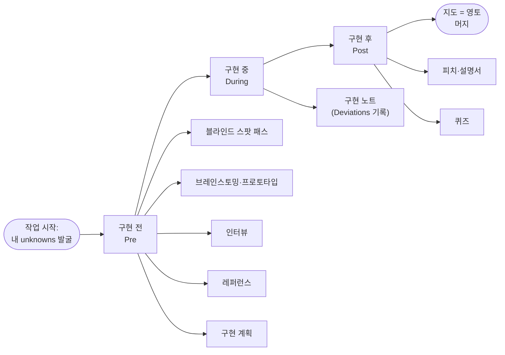

<figure class="post-figure post-figure--header">
<svg role="img" aria-label="왼쪽에는 정찰병의 손에 든 지도(map)가 있고, 그 위에 시작점에서 목표 깃발까지 곧게 뻗은 점선 계획 경로가 그려져 있다. 가운데에는 같지 않음(≠) 기호가 있고, 오른쪽에는 실제 영토(territory)인 협곡이 있다. 협곡에는 물음표가 새겨진 바위들과 막다른 갈림길이 흩어져 있고, 실제 경로는 그 사이를 굽이치며 목표 깃발에 닿는다. 지도의 곧은 계획과 실제 협곡의 굽이친 길이 어긋나는 '지도와 영토의 불일치'를 한 장으로 보여준다." viewBox="0 0 680 300" xmlns="http://www.w3.org/2000/svg">
  <defs>
    <marker id="fable-hd-arrow" viewBox="0 0 10 10" refX="8" refY="5" markerWidth="6" markerHeight="6" orient="auto-start-reverse">
      <path d="M 0 1 L 9 5 L 0 9 z" fill="var(--accent-color)"/>
    </marker>
  </defs>

  <text x="162" y="40" text-anchor="middle" font-size="13" fill="currentColor" font-weight="700" opacity="0.85">지도 (map) — 내 계획</text>
  <text x="510" y="40" text-anchor="middle" font-size="13" fill="currentColor" font-weight="700" opacity="0.85">영토 (territory) — 실제 협곡</text>

  <!-- MAP scroll -->
  <rect x="36" y="60" width="252" height="200" rx="6" fill="var(--bg-light)" stroke="var(--border-color)" stroke-width="2.5"/>
  <line x1="36" y1="112" x2="288" y2="112" stroke="currentColor" stroke-width="1" opacity="0.14"/>
  <line x1="36" y1="164" x2="288" y2="164" stroke="currentColor" stroke-width="1" opacity="0.14"/>
  <line x1="36" y1="216" x2="288" y2="216" stroke="currentColor" stroke-width="1" opacity="0.14"/>
  <line x1="120" y1="60" x2="120" y2="260" stroke="currentColor" stroke-width="1" opacity="0.14"/>
  <line x1="204" y1="60" x2="204" y2="260" stroke="currentColor" stroke-width="1" opacity="0.14"/>
  <!-- straight dotted planned path -->
  <line x1="78" y1="226" x2="250" y2="98" stroke="var(--secondary-color)" stroke-width="3" stroke-dasharray="7 6" stroke-linecap="round"/>
  <circle cx="78" cy="226" r="7" fill="var(--secondary-color)"/>
  <text x="78" y="250" text-anchor="middle" font-size="9.5" fill="currentColor" opacity="0.8">시작</text>
  <!-- goal flag on map -->
  <line x1="250" y1="98" x2="250" y2="74" stroke="currentColor" stroke-width="2"/>
  <path d="M 250 74 L 270 80 L 250 87 z" fill="var(--secondary-color)"/>
  <text x="248" y="112" text-anchor="end" font-size="9.5" fill="currentColor" opacity="0.8">목표</text>

  <!-- mismatch symbol -->
  <text x="322" y="176" text-anchor="middle" font-size="26" fill="var(--accent-color)" font-weight="700">&#8800;</text>

  <!-- TERRITORY canyon -->
  <rect x="356" y="60" width="288" height="200" rx="6" fill="var(--bg-panel)" stroke="var(--border-color)" stroke-width="2.5"/>
  <!-- canyon rock silhouettes -->
  <path d="M 356 60 L 392 96 L 428 62 L 470 100 L 356 100 z" fill="var(--bg-light)" opacity="0.6"/>
  <path d="M 644 60 L 610 100 L 566 66 L 644 66 z" fill="var(--bg-light)" opacity="0.6"/>
  <path d="M 356 260 L 400 222 L 452 258 L 356 258 z" fill="var(--bg-light)" opacity="0.6"/>
  <path d="M 644 260 L 600 224 L 548 260 z" fill="var(--bg-light)" opacity="0.6"/>
  <!-- winding real path -->
  <path d="M 384 232 Q 428 214 420 180 Q 412 150 466 144 Q 516 138 516 114 Q 516 96 604 102" fill="none" stroke="var(--accent-color)" stroke-width="3" stroke-dasharray="5 6" stroke-linecap="round"/>
  <circle cx="384" cy="232" r="7" fill="var(--accent-color)"/>
  <!-- a dead-end fork -->
  <path d="M 420 180 Q 456 190 470 214" fill="none" stroke="var(--accent-color)" stroke-width="2" stroke-dasharray="4 5" opacity="0.65"/>
  <path d="M 516 114 Q 548 122 560 150" fill="none" stroke="var(--accent-color)" stroke-width="2" stroke-dasharray="4 5" opacity="0.65"/>
  <!-- goal flag on territory -->
  <line x1="604" y1="102" x2="604" y2="78" stroke="currentColor" stroke-width="2"/>
  <path d="M 604 78 L 624 84 L 604 91 z" fill="var(--secondary-color)"/>
  <!-- question-mark boulders -->
  <g font-weight="700">
    <circle cx="470" cy="220" r="14" fill="var(--bg-light)" stroke="var(--accent-color)" stroke-width="2"/>
    <text x="470" y="225" text-anchor="middle" font-size="15" fill="var(--accent-color)">?</text>
    <circle cx="562" cy="156" r="14" fill="var(--bg-light)" stroke="var(--accent-color)" stroke-width="2"/>
    <text x="562" y="161" text-anchor="middle" font-size="15" fill="var(--accent-color)">?</text>
    <circle cx="430" cy="120" r="14" fill="var(--bg-light)" stroke="var(--accent-color)" stroke-width="2"/>
    <text x="430" y="125" text-anchor="middle" font-size="15" fill="var(--accent-color)">?</text>
  </g>
</svg>
<figcaption>지도(내가 주는 프롬프트·계획)의 곧은 점선과 영토(실제 코드베이스·현실)의 굽이친 길 사이의 간극 — 그 물음표들이 이 글이 말하는 unknowns다.</figcaption>
</figure>

## 원문 정보

> - **제목**: A field guide to Claude Fable 5: Finding your unknowns
> - **출처**: Thariq Shihipar — Anthropic 기술 스태프 (claude.com/blog)
> - **발행**: 약 6분 분량
> - **원문 링크**: <https://claude.com/blog/a-field-guide-to-claude-fable-finding-your-unknowns>

Anthropic 내부에서 실제로 Claude Code를 쓰는 사람이, 최신 모델(코드네임 Fable)과 일하며 얻은 실전 감각을 정리한 글이다. 프롬프트 잘 쓰는 요령을 넘어, "에이전트 시대에 좋은 코더의 스킬이란 무엇인가"를 다시 정의하기에 Articles에 담는다.

## 한 줄 요약 (TL;DR)

Fable부터는 작업 품질의 병목이 모델의 능력이 아니라 **내가 나의 unknowns(모르는 것들)를 얼마나 명확히 해 주느냐**로 옮겨 왔고, 그 unknowns는 구현 전·중·후에 걸쳐 Claude를 도구 삼아 **값싸게 미리 발굴**할 수 있다.

**한눈에 보기** — unknowns를 값싸게 먼저, 비싸지기 전에 발굴하는 구현 전·중·후의 척추와 각 단계에 매달리는 패턴들:

## 왜 이 글을 골랐나

지금까지 코딩 에이전트 관련 글의 초점은 "어떻게 에이전트를 잘 통제하고 검증하느냐"였다. [짧은 목줄 방법](/2026/07/06/short-leash-ai-coding.html)이나 [Karpathy의 실패 모드 가이드라인](/2026/06/22/karpathy-llm-coding-guidelines.html)처럼 대부분 **모델의 결함을 막는 규율**에 대한 이야기였다.

이 글은 반대 방향에서 접근한다. 모델이 충분히 좋아진 시점에서 결과물이 틀렸다면, 문제는 대개 모델이 아니라 **내가 명확히 전달하지 못한 나의 무지**라는 것이다. 즉 병목이 사람 쪽으로 넘어왔다. 이 관점은 [Intent Debt](/2026/06/21/intent-debt.html)나 [코드가 공짜가 된 시대의 '취향'](/2026/06/19/ai-engineer-taste.html) 논의와 정확히 같은 지점을 가리킨다. 그리고 이 글의 강점은 그 추상적 통찰을 **바로 복사해 쓸 수 있는 프롬프트 패턴**으로 내려놓았다는 데 있다.

## 핵심 내용

### 지도와 영토(the map and the territory)

저자는 Claude Code와 일할 때 **지도와 영토의 차이**를 자주 떠올린다고 말한다.

- **지도(map)**: 내가 Claude에게 주는 것 — 프롬프트, 스킬, 컨텍스트. 해야 할 일에 대한 나의 표상.
- **영토(territory)**: 실제 작업이 일어나는 곳 — 코드베이스, 현실, 그 진짜 제약들.

이 둘 사이의 간극이 바로 저자가 말하는 **unknowns**다. Claude가 unknown에 부딪히면, 내가 무엇을 원하는지 최선의 추측으로 결정을 내려야 한다. 작업이 클수록 부딪히는 unknown도 많아진다.

<figure class="post-figure">
<svg role="img" aria-label="위 레인에는 계획된 경로(지도)가 시작점에서 목표까지 곧은 점선으로 뻗어 있다. 아래 레인에는 실제 경로(영토)가 물음표 바위 장애물과 막다른 갈림길을 피해 굽이치며 같은 목표에 닿는다. 두 경로가 벌어진 가운데 틈에 세로 화살표들과 함께 'unknowns'라는 라벨이 붙어, 계획과 현실 사이의 간극이 곧 unknowns임을 보여준다." viewBox="0 0 640 300" xmlns="http://www.w3.org/2000/svg">
  <!-- top lane: planned path -->
  <text x="20" y="42" text-anchor="start" font-size="12" fill="currentColor" font-weight="700" opacity="0.8">계획된 경로 (지도)</text>
  <line x1="60" y1="66" x2="560" y2="66" stroke="var(--secondary-color)" stroke-width="3" stroke-dasharray="8 7" stroke-linecap="round"/>
  <circle cx="60" cy="66" r="7" fill="var(--secondary-color)"/>
  <line x1="562" y1="66" x2="562" y2="46" stroke="currentColor" stroke-width="2"/>
  <path d="M 562 46 L 584 52 L 562 60 z" fill="var(--secondary-color)"/>

  <!-- gap / unknowns -->
  <line x1="150" y1="80" x2="150" y2="196" stroke="var(--accent-color)" stroke-width="1.6" stroke-dasharray="3 4" opacity="0.7"/>
  <line x1="320" y1="80" x2="320" y2="150" stroke="var(--accent-color)" stroke-width="1.6" stroke-dasharray="3 4" opacity="0.7"/>
  <line x1="470" y1="80" x2="470" y2="210" stroke="var(--accent-color)" stroke-width="1.6" stroke-dasharray="3 4" opacity="0.7"/>
  <rect x="252" y="132" width="136" height="34" rx="5" fill="var(--bg-light)" stroke="var(--accent-color)" stroke-width="2"/>
  <text x="320" y="154" text-anchor="middle" font-size="14" fill="var(--accent-color)" font-weight="700">unknowns</text>
  <text x="320" y="122" text-anchor="middle" font-size="10" fill="currentColor" opacity="0.75">지도와 영토의 간극</text>

  <!-- bottom lane: real path -->
  <text x="20" y="286" text-anchor="start" font-size="12" fill="currentColor" font-weight="700" opacity="0.8">실제 경로 (영토)</text>
  <path d="M 60 234 Q 120 234 130 210 Q 142 182 200 200 Q 262 218 300 200 Q 344 178 400 212 Q 452 244 500 216 Q 548 190 560 234" fill="none" stroke="var(--accent-color)" stroke-width="3" stroke-dasharray="5 6" stroke-linecap="round"/>
  <circle cx="60" cy="234" r="7" fill="var(--accent-color)"/>
  <line x1="560" y1="234" x2="560" y2="254" stroke="currentColor" stroke-width="2"/>
  <path d="M 560 254 L 582 248 L 560 240 z" fill="var(--accent-color)"/>
  <!-- ? boulder obstacles -->
  <g font-weight="700">
    <circle cx="150" cy="228" r="13" fill="var(--bg-light)" stroke="var(--accent-color)" stroke-width="2"/>
    <text x="150" y="233" text-anchor="middle" font-size="14" fill="var(--accent-color)">?</text>
    <circle cx="320" cy="176" r="13" fill="var(--bg-light)" stroke="var(--accent-color)" stroke-width="2"/>
    <text x="320" y="181" text-anchor="middle" font-size="14" fill="var(--accent-color)">?</text>
    <circle cx="470" cy="238" r="13" fill="var(--bg-light)" stroke="var(--accent-color)" stroke-width="2"/>
    <text x="470" y="243" text-anchor="middle" font-size="14" fill="var(--accent-color)">?</text>
  </g>
</svg>
<figcaption>같은 시작·목표라도 지도의 곧은 계획과 영토의 굽이친 현실은 어긋난다. 그 벌어진 틈에 놓인 물음표들이 unknowns이고, Claude가 여기 부딪히면 최선의 추측으로 결정한다.</figcaption>
</figure>

핵심 주장은 이것이다. **Fable은 작업 품질이 나의 unknown 해소 능력에 의해 병목이 걸리는 첫 모델이다.** 그리고 미리 계획을 세우는 것만으로는 부족하다. unknown은 구현 깊숙한 곳에서 튀어나오기도 하고, 때로는 "애초에 다른 방식으로 문제를 풀었어야 한다"는 사실을 가리키기도 한다. 그래서 Fable과 일하는 것은 구현 전·중·후에 걸쳐 unknown을 계속 발견해 나가는 반복 과정이 된다.

### 당신의 unknowns를 안다는 것

저자는 문제를 마주하면 네 가지로 쪼갠다. Johari Window를 코딩 에이전트 맥락으로 옮긴 2x2다.

- **Known Knowns (아는 것을 안다)**: 본질적으로 내 프롬프트에 담기는 것. 에이전트에게 "이걸 원한다"고 말하는 내용.
- **Known Unknowns (모르는 것을 안다)**: 아직 못 정했지만, 못 정했다는 사실은 인지하는 것.
- **Unknown Knowns (아는 줄 모르고 아는 것)**: 너무 당연해서 굳이 적지 않지만, 보면 바로 알아보는 것(I-know-it-when-I-see-it).
- **Unknown Unknowns (모르는 줄도 모르는 것)**: 아예 고려조차 못 한 것. 내가 인식하지 못한 지식, "이게 얼마나 좋아질 수 있는지"조차 모르는 영역.

<figure class="post-figure">
<svg role="img" aria-label="Johari Window를 코딩 에이전트 맥락으로 옮긴 2x2 매트릭스. 가로축은 '내가 인지하는가'로 왼쪽이 인지함, 오른쪽이 인지 못 함이다. 세로축은 '내가 아는가'로 위가 앎, 아래가 모름이다. 왼쪽 위 칸은 Known Knowns로 프롬프트에 담기는 것, 오른쪽 위 칸은 Unknown Knowns로 보면 바로 아는 것, 왼쪽 아래 칸은 Known Unknowns로 아직 못 정했지만 못 정한 줄 아는 것, 오른쪽 아래 칸은 Unknown Unknowns로 고려조차 못 한 것이다." viewBox="0 0 620 400" xmlns="http://www.w3.org/2000/svg">
  <!-- axis labels -->
  <text x="330" y="24" text-anchor="middle" font-size="12" fill="currentColor" font-weight="700" opacity="0.8">가로축: 내가 인지하는가</text>
  <text x="205" y="48" text-anchor="middle" font-size="11" fill="currentColor" opacity="0.7">인지함</text>
  <text x="455" y="48" text-anchor="middle" font-size="11" fill="currentColor" opacity="0.7">인지 못 함</text>
  <text x="24" y="230" text-anchor="middle" font-size="12" fill="currentColor" font-weight="700" opacity="0.8" transform="rotate(-90 24 230)">세로축: 내가 아는가</text>
  <text x="52" y="150" text-anchor="middle" font-size="11" fill="currentColor" opacity="0.7">앎</text>
  <text x="52" y="330" text-anchor="middle" font-size="11" fill="currentColor" opacity="0.7">모름</text>

  <!-- top-left: Known Knowns -->
  <rect x="80" y="60" width="250" height="150" rx="6" fill="var(--bg-light)" stroke="var(--secondary-color)" stroke-width="2.5"/>
  <text x="205" y="118" text-anchor="middle" font-size="15" fill="currentColor" font-weight="700">Known Knowns</text>
  <text x="205" y="140" text-anchor="middle" font-size="12" fill="currentColor" opacity="0.85">아는 것을 안다</text>
  <text x="205" y="168" text-anchor="middle" font-size="11.5" fill="var(--secondary-color)" font-weight="700">→ 프롬프트에 담김</text>

  <!-- top-right: Unknown Knowns -->
  <rect x="336" y="60" width="250" height="150" rx="6" fill="var(--bg-panel)" stroke="var(--gold)" stroke-width="2.5"/>
  <text x="461" y="118" text-anchor="middle" font-size="15" fill="currentColor" font-weight="700">Unknown Knowns</text>
  <text x="461" y="140" text-anchor="middle" font-size="12" fill="currentColor" opacity="0.85">아는 줄 모르고 안다</text>
  <text x="461" y="168" text-anchor="middle" font-size="11.5" fill="var(--gold)" font-weight="700">→ 보면 안다</text>

  <!-- bottom-left: Known Unknowns -->
  <rect x="80" y="216" width="250" height="150" rx="6" fill="var(--bg-panel)" stroke="var(--gold)" stroke-width="2.5"/>
  <text x="205" y="274" text-anchor="middle" font-size="15" fill="currentColor" font-weight="700">Known Unknowns</text>
  <text x="205" y="296" text-anchor="middle" font-size="12" fill="currentColor" opacity="0.85">모르는 것을 안다</text>
  <text x="205" y="324" text-anchor="middle" font-size="11.5" fill="var(--gold)" font-weight="700">→ 아직 못 정함</text>

  <!-- bottom-right: Unknown Unknowns -->
  <rect x="336" y="216" width="250" height="150" rx="6" fill="var(--bg-light)" stroke="var(--accent-color)" stroke-width="3"/>
  <text x="461" y="274" text-anchor="middle" font-size="15" fill="currentColor" font-weight="700">Unknown Unknowns</text>
  <text x="461" y="296" text-anchor="middle" font-size="12" fill="currentColor" opacity="0.85">모르는 줄도 모른다</text>
  <text x="461" y="324" text-anchor="middle" font-size="11.5" fill="var(--accent-color)" font-weight="700">→ 고려조차 못 함</text>
</svg>
<figcaption>문제를 인지 여부(가로)와 지식 여부(세로)로 쪼갠 2x2. 어느 칸이 비어 있는지가 다음에 꺼낼 프롬프트를 정한다.</figcaption>
</figure>

저자는 최고의 에이전틱 코더들(Boris, Jarred 같은 이름을 든다)은 unknown이 상대적으로 적다고 관찰한다. 이들은 자기가 원하는 것을 세부까지 알고 있고, 코드베이스와 모델 행동 양쪽에 깊이 동기화되어 있다. 하지만 동시에 그들은 **unknown이 있으리라고 가정한다.** 결국 unknown을 줄이고 그것에 대비하는 것이 에이전틱 코딩의 스킬 그 자체이며, 다행히 이건 Claude와 일하면서 **연습으로 늘릴 수 있는** 스킬이다.

### Claude가 당신을 돕게 하라

Claude에게 지시하는 것은 미묘한 균형이다.

- **너무 구체적이면**: 방향을 트는 게 더 나은 상황에서도 Claude가 내 지시를 그대로 따른다.
- **너무 모호하면**: Claude가 내 작업에 안 맞을 수도 있는 '업계 베스트 프랙티스'로 선택과 가정을 채운다.

unknown을 고려하지 않으면 이 두 방향 모두에서 실패한다. 길이 장애물로 막혀 있을 때를 모르고, 길이 뻥 뚫려 있는데도 Claude가 방향을 틀어 주길 바라야 할 때를 모른다.

그런데 Claude는 unknown을 **더 빨리 발견하도록** 도울 수 있다. 코드베이스와 인터넷을 극도로 빠르게 뒤지고, 평균적인 주제에 대해 나보다 훨씬 많이 알며, 실패로부터 더 빠르게 반복한다. 이 과정에서 가장 중요한 것은 **내 출발점에 대한 컨텍스트를 주는 것** — 내가 사고 과정의 어디쯤 있는지 말하고, 이 문제와 코드베이스에 대한 내 경험을 밝히고, Claude를 사고 파트너처럼 대하는 것이다.

### unknown을 발굴하는 패턴들

원문의 실질적 알맹이는 단계별 프롬프트 패턴이다.

**구현 전(Pre-implementation)**

- **블라인드 스팟 패스(Blind spot pass)**: unknown unknowns를 찾아 설명해 달라고 요청한다. "blind spot pass"와 "unknown unknowns"라는 문구를 문자 그대로 쓰라고 조언한다. 예: *"이 코드베이스의 auth 모듈을 하나도 모르는 상태로 새 auth provider를 붙이려 한다. blind spot pass를 해서 내 unknown unknowns를 짚어 주고, 내가 너를 더 잘 프롬프트하게 도와 달라."*
- **브레인스토밍과 프로토타입**: unknown knowns(보면 안다) 영역을 겨냥한다. 구현 중에 발견하면 비싸지만 프로토타이핑 단계에서 발견하면 값싸다. 예: *"이 데이터로 대시보드를 원하는데 시각적 감각이 없고 뭐가 가능한지 모른다. 완전히 다른 4개의 디자인 방향을 HTML 한 장에 만들어 내가 반응할 수 있게 해 달라."*
- **인터뷰**: 모호한 지점을 **한 번에 한 질문씩** 인터뷰하게 한다. 예: *"모호한 것들을 한 번에 한 질문씩 인터뷰해 달라. 내 답변이 아키텍처를 바꿀 질문을 우선해 달라."*
- **레퍼런스**: 최고의 레퍼런스는 스크린샷·다이어그램이 아니라 **소스 코드**다. 다른 언어의 폴더를 가리켜도 된다. 예: *"vendor/rate-limiter의 이 Rust crate가 내가 원하는 backoff 동작을 정확히 구현한다. 읽고 같은 시맨틱을 우리 TypeScript API 클라이언트에 다시 구현해 달라."*
- **구현 계획**: 계획서를 **바뀔 가능성이 큰 부분(데이터 모델, 타입 인터페이스, UX 흐름)을 앞에, 기계적 리팩터링을 맨 뒤에** 두는 순서로 요청한다. 예: *"구현 계획을 HTML로 써 주되, 내가 만질 가능성이 큰 결정 — 데이터 모델 변경, 새 타입 인터페이스, 사용자 노출 부분 — 을 앞세워 달라. 기계적 리팩터링은 맨 아래로 묻어 달라. 그 부분은 너를 믿는다."*

<figure class="post-figure">
<svg role="img" aria-label="구현 전 5개 패턴을 unknowns 2x2의 어느 사분면을 겨냥하는지로 잇는 매핑 도표. 왼쪽에 다섯 패턴 상자가 있고 오른쪽에 세 사분면 상자가 있다. 블라인드 스팟 패스는 Unknown Unknowns로, 브레인스토밍·프로토타입은 Unknown Knowns로 이어진다. 인터뷰·레퍼런스·구현 계획 세 패턴은 모두 Known Unknowns를 명료화하는 것으로 이어진다." viewBox="0 0 640 360" xmlns="http://www.w3.org/2000/svg">
  <defs>
    <marker id="fable-map-arrow" viewBox="0 0 10 10" refX="8" refY="5" markerWidth="7" markerHeight="7" orient="auto-start-reverse">
      <path d="M 0 1 L 9 5 L 0 9 z" fill="var(--secondary-color)"/>
    </marker>
  </defs>

  <text x="130" y="24" text-anchor="middle" font-size="12" fill="currentColor" font-weight="700" opacity="0.8">구현 전 패턴</text>
  <text x="510" y="24" text-anchor="middle" font-size="12" fill="currentColor" font-weight="700" opacity="0.8">겨냥하는 사분면</text>

  <!-- left: 5 patterns -->
  <g font-size="12.5" font-weight="700">
    <rect x="20" y="40" width="220" height="42" rx="5" fill="var(--bg-light)" stroke="var(--border-color)" stroke-width="2"/>
    <text x="130" y="66" text-anchor="middle" fill="currentColor">블라인드 스팟 패스</text>
    <rect x="20" y="98" width="220" height="42" rx="5" fill="var(--bg-light)" stroke="var(--border-color)" stroke-width="2"/>
    <text x="130" y="124" text-anchor="middle" fill="currentColor">브레인스토밍·프로토타입</text>
    <rect x="20" y="156" width="220" height="42" rx="5" fill="var(--bg-light)" stroke="var(--border-color)" stroke-width="2"/>
    <text x="130" y="182" text-anchor="middle" fill="currentColor">인터뷰</text>
    <rect x="20" y="214" width="220" height="42" rx="5" fill="var(--bg-light)" stroke="var(--border-color)" stroke-width="2"/>
    <text x="130" y="240" text-anchor="middle" fill="currentColor">레퍼런스</text>
    <rect x="20" y="272" width="220" height="42" rx="5" fill="var(--bg-light)" stroke="var(--border-color)" stroke-width="2"/>
    <text x="130" y="298" text-anchor="middle" fill="currentColor">구현 계획</text>
  </g>

  <!-- right: 3 quadrants -->
  <rect x="400" y="40" width="220" height="66" rx="6" fill="var(--bg-panel)" stroke="var(--accent-color)" stroke-width="3"/>
  <text x="510" y="70" text-anchor="middle" font-size="13.5" fill="currentColor" font-weight="700">Unknown Unknowns</text>
  <text x="510" y="90" text-anchor="middle" font-size="10.5" fill="var(--accent-color)" font-weight="700">고려조차 못 함</text>

  <rect x="400" y="128" width="220" height="66" rx="6" fill="var(--bg-panel)" stroke="var(--gold)" stroke-width="2.5"/>
  <text x="510" y="158" text-anchor="middle" font-size="13.5" fill="currentColor" font-weight="700">Unknown Knowns</text>
  <text x="510" y="178" text-anchor="middle" font-size="10.5" fill="var(--gold)" font-weight="700">보면 안다</text>

  <rect x="400" y="216" width="220" height="98" rx="6" fill="var(--bg-panel)" stroke="var(--gold)" stroke-width="2.5"/>
  <text x="510" y="254" text-anchor="middle" font-size="13.5" fill="currentColor" font-weight="700">Known Unknowns</text>
  <text x="510" y="274" text-anchor="middle" font-size="10.5" fill="var(--gold)" font-weight="700">아직 못 정함 · 명료화</text>

  <!-- connectors -->
  <g fill="none" stroke="var(--secondary-color)" stroke-width="2.2">
    <path d="M 240 61 L 400 73" marker-end="url(#fable-map-arrow)"/>
    <path d="M 240 119 L 400 161" marker-end="url(#fable-map-arrow)"/>
    <path d="M 240 177 C 320 177 330 250 400 255" marker-end="url(#fable-map-arrow)"/>
    <path d="M 240 235 C 320 235 340 262 400 265" marker-end="url(#fable-map-arrow)"/>
    <path d="M 240 293 C 320 293 350 278 400 275" marker-end="url(#fable-map-arrow)"/>
  </g>
</svg>
<figcaption>같은 "프롬프트를 잘 쓰라"가 아니라, 지금 비어 있는 사분면을 진단하고 거기 맞는 패턴을 꺼낸다 — 이 매핑이 이 글의 핵심 기여다.</figcaption>
</figure>

**구현 중(During implementation)**

- **구현 노트(Implementation notes)**: 앞의 산출물들을 들고 새 세션을 시작한다. 임시 `implementation-notes.md`에 결정과 이탈을 기록하게 한다. 예: *"implementation-notes.md 파일을 유지해 달라. 계획에서 벗어나야 하는 엣지 케이스를 만나면 보수적인 쪽을 택하고, 'Deviations' 항목에 기록한 뒤 계속 진행해 달라."*

**구현 후(Post-implementation)**

- **피치와 설명서(Pitches and explainers)**: 리뷰어도 내가 처음 가졌던 unknown에서 출발하므로, 이해와 승인을 앞당기는 피치/설명 산출물을 만든다. 예: *"프로토타입·스펙·구현 노트를 Slack에 던질 문서 하나로 묶어 달라. 데모 GIF를 맨 앞에."*
- **퀴즈(Quizzes)**: 긴 세션 뒤, 내가 변경 사항을 실제로 이해했는지 Claude에게 **퀴즈를 내게** 하고 통과한 뒤에만 머지한다. 예: *"이 변경에서 일어난 모든 것을 이해하고 싶다. 맥락·직관·무엇을 했는지 담은 HTML 리포트를 주고, 맨 아래에 내가 반드시 통과해야 하는 퀴즈를 붙여 달라."*

### 실제로 합쳐지는 방식: Fable 런칭

Fable 런칭 영상은 처음부터 끝까지 Claude Code로 편집됐다 — 저자에게는 새로운 영역이었다. 그는 **known known**(Claude가 코드로 영상을 편집·전사할 수 있다)에서 출발했다. 이어 Whisper 전사가 어떻게 동작하는지, ffmpeg로 '음…'이나 침묵 구간을 잘라낼 수 있는지 Claude에게 설명을 청했다. 말소리에 타이밍을 맞춘 UI를 원했지만 가능한지 몰라 Remotion + 전사로 프로토타입을 요청했다. 영상 색이 칙칙해 보였지만(color grading) '좋은' 색 보정이 뭔지 몰랐기에, **color grading을 가르쳐 달라고 해서 자신의 unknown을 발굴**했다.

### 지도와 영토를 맞추기

모델이 좋아질수록 올바른 접근으로 이룰 수 있는 것도 커진다. 긴 호흡의 작업이 틀린 채 돌아온다면, 십중팔구 unknown을 정의하는 데, 혹은 그 unknown을 헤쳐 나가며 나와 Claude가 함께 적응할 수 있는 구현 계획을 짜는 데 더 시간을 써야 한다는 신호다. 모든 설명서·브레인스토밍·인터뷰·프로토타입·레퍼런스는 **비싸지기 전에** 내가 몰랐던 것을 값싸게 알아내는 방법이다.

## 분석과 인사이트

원문의 요약과 별개로, 개발자 관점에서 인상적인 지점을 짚는다.

**병목의 이동을 정직하게 인정한다.** 이 글의 진짜 전제는 "모델이 이제 웬만큼 잘한다"이다. 그래서 실패의 원인을 모델이 아니라 사용자의 무지로 재배치한다. 불편하지만 정확하다. [Intent Debt](/2026/06/21/intent-debt.html)가 "에이전트가 대신 갚아줄 수 없는 단 하나의 부채는 의도"라고 했던 것과 정확히 같은 결론이며, 이 글은 그 부채를 갚는 **구체적 절차**를 제시한다.

**Johari Window의 재발견이 실전 도구가 된다.** 2x2 자체는 오래된 프레임이지만, 각 사분면에 **서로 다른 프롬프트 패턴**을 매핑한 게 이 글의 기여다. Unknown Unknowns에는 블라인드 스팟 패스, Unknown Knowns에는 프로토타입, Known Unknowns에는 인터뷰·레퍼런스·계획. 막연히 "프롬프트를 잘 쓰라"가 아니라, "지금 부족한 게 어느 사분면인지 진단하고 거기에 맞는 도구를 꺼내라"로 바뀐다.

**"값싸게 먼저, 비싸지기 전에"가 핵심 경제학이다.** 프로토타이핑 단계의 HTML 목업 4종은 몇 분이면 나오지만, 같은 취향 판단을 실제 구현 뒤에 하면 롤백 비용이 든다. 이건 소프트웨어 공학의 오래된 격언 — 결함은 늦게 발견될수록 비싸다 — 의 에이전트 버전이다. 다만 여기서 '결함'은 버그가 아니라 **명료화되지 않은 나의 의도**다.

**한편, 이건 통제 규율과 대립하지 않고 보완한다.** [짧은 목줄 방법](/2026/07/06/short-leash-ai-coding.html)이 "생성된 diff를 매번 직접 검토하라"는 사후 검증의 규율이라면, 이 글은 **작업이 시작되기 전에** 오해의 표면적을 줄이는 사전 규율이다. 둘을 합치면: unknown을 앞에서 발굴해 잘못된 방향 자체를 줄이고, 그럼에도 남는 것은 짧은 목줄로 잡는다. 앞단을 잘하면 뒷단에서 검토할 diff의 밀도가 낮아진다.

**과신을 경계할 지점도 있다.** '한 번에 한 질문씩 인터뷰'나 '퀴즈로 이해를 검증'은 훌륭하지만, 결국 Claude가 낸 질문·퀴즈의 범위 안에서만 검증된다. 모델이 놓친 unknown unknown은 블라인드 스팟 패스로도 안 잡힐 수 있다. 이 패턴들은 무지를 **줄이는** 도구이지 **없애는** 도구가 아니며, 최종 책임은 여전히 사람에게 있다. [취향(taste)](/2026/06/19/ai-engineer-taste.html)이 왜 여전히 병목인지와 같은 맥락이다.

## 적용 포인트

- 새 작업을 시작하기 전, 문제를 **Known Knowns / Known Unknowns / Unknown Knowns / Unknown Unknowns** 2x2로 30초 안에 나눠 본다. 어느 칸이 비어 있는지가 다음 프롬프트를 정한다.
- 낯선 코드베이스·도메인이면 첫 프롬프트로 **블라인드 스팟 패스**를 요청한다. "blind spot pass", "unknown unknowns"를 문자 그대로 넣는다.
- 취향·시각·UX가 걸린 일은 구현 전에 **HTML 목업 여러 개**를 뽑아 반응한다. 실제 앱을 건드리기 전에 반응할 대상을 만든다.
- 아키텍처를 바꿀 만한 모호함은 **"한 번에 한 질문씩 인터뷰해 달라, 답이 아키텍처를 바꿀 질문 우선"**으로 뽑아낸다.
- 원하는 동작의 레퍼런스가 있으면 스크린샷 대신 **소스 코드 폴더**를 가리킨다. 언어가 달라도 된다.
- 구현 계획은 **바뀔 결정(데이터 모델·타입·UX)을 앞에, 기계적 리팩터링을 뒤에** 두게 요청한다.
- 긴 세션에서는 `implementation-notes.md`에 **Deviations를 기록**하게 하고, 새 세션은 그 산출물을 들고 시작한다.
- 머지 전, Claude에게 **변경 사항 퀴즈**를 내게 하고 통과 못 하면 아직 이해 못 한 것으로 간주한다.

## 마무리

에이전트 시대의 좋은 코더는 타이핑이 빠른 사람도, 지시를 촘촘히 쓰는 사람도 아니다. **자기가 무엇을 모르는지 빨리 알아내는 사람**이다. 이 글은 그 능력을 타고난 재능이 아니라 연습 가능한 절차 — 블라인드 스팟 패스, 프로토타입, 인터뷰, 레퍼런스, 구현 노트, 퀴즈 — 로 분해해 놓았다. 다음 프로젝트를 시작할 때, 첫 프롬프트를 "이걸 구현해 줘"가 아니라 **"내가 뭘 모르는지 먼저 찾게 도와 줘"**로 바꿔 보는 것 — 그것이 지도와 영토를 맞추는 시작이다.

### 더 읽어보기

- [원문 — A field guide to Claude Fable 5: Finding your unknowns (Thariq Shihipar, Anthropic)](https://claude.com/blog/a-field-guide-to-claude-fable-finding-your-unknowns)
- [Intent Debt: 에이전트가 대신 갚아줄 수 없는 단 하나의 부채 (Addy Osmani)](/2026/06/21/intent-debt.html) — unknown 해소는 결국 '의도'를 갚는 일이다
- [짧은 목줄(Short Leash) 방법 — AI 코딩 에이전트를 통제하며 (Greg Slepak)](/2026/07/06/short-leash-ai-coding.html) — 사전 발굴과 짝을 이루는 사후 검증의 규율
- [Karpathy의 LLM 코딩 가이드라인: 실패 모드 관찰을 행동 지침으로 (Andrej Karpathy)](/2026/06/22/karpathy-llm-coding-guidelines.html) — 모델 행동을 알고 프롬프트를 설계한다는 같은 감각
- [코드가 공짜가 된 시대의 '취향(taste)' (Pratik Bhavsar)](/2026/06/19/ai-engineer-taste.html) — 왜 판단·취향이 여전히 사람의 병목인가
- [Loop Engineering: 에이전트를 프롬프트하는 대신 프롬프트하는 시스템을 설계하라 (Addy Osmani)](/2026/06/19/loop-engineering.html) — unknown 발굴을 반복 가능한 시스템으로
