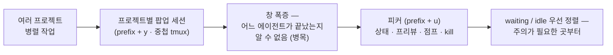
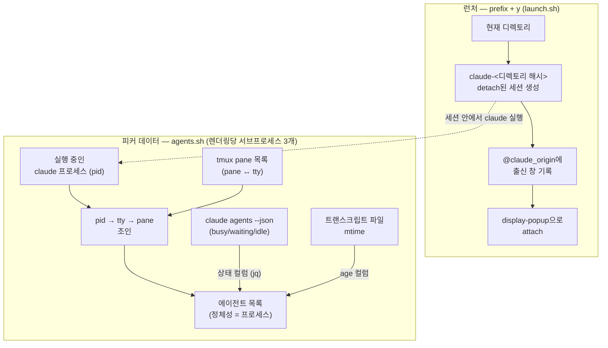

<figure class="post-figure post-figure--header">
<svg role="img" aria-label="tmux 격자 위에 흩어진 여섯 개의 에이전트 창이 각각 working, waiting, idle 상태 불빛을 켜고 있고, 중앙의 관제탑(피커)이 모든 창의 상태를 한 리스트로 모아 내려다본다 — 많은 세션, 하나의 관제탑" viewBox="0 0 760 320" xmlns="http://www.w3.org/2000/svg">
  <title>많은 세션, 하나의 관제탑</title>

  <!-- tmux 격자 배경 -->
  <g stroke="currentColor" stroke-width="1" opacity="0.1">
    <line x1="0" y1="80" x2="760" y2="80"/>
    <line x1="0" y1="160" x2="760" y2="160"/>
    <line x1="0" y1="240" x2="760" y2="240"/>
    <line x1="190" y1="0" x2="190" y2="320"/>
    <line x1="380" y1="0" x2="380" y2="320"/>
    <line x1="570" y1="0" x2="570" y2="320"/>
  </g>

  <!-- 관제탑 → 각 창으로 향하는 시선 -->
  <g stroke="currentColor" stroke-width="1.5" stroke-dasharray="4 4" opacity="0.5">
    <line x1="298" y1="70" x2="153" y2="53"/>
    <line x1="298" y1="105" x2="169" y2="145"/>
    <line x1="298" y1="140" x2="153" y2="237"/>
    <line x1="462" y1="70" x2="607" y2="53"/>
    <line x1="462" y1="105" x2="591" y2="145"/>
    <line x1="462" y1="140" x2="607" y2="237"/>
  </g>

  <!-- 에이전트 창 1: inkdrop (working) -->
  <g>
    <rect x="24" y="44" width="140" height="70" fill="var(--bg-panel)" stroke="currentColor" stroke-width="2"/>
    <line x1="24" y1="60" x2="164" y2="60" stroke="currentColor" stroke-width="1" opacity="0.5"/>
    <text x="34" y="56" font-size="9.5" fill="currentColor" opacity="0.75">~/inkdrop</text>
    <circle cx="153" cy="52" r="4.5" fill="var(--orc-green)"/>
    <line x1="34" y1="76" x2="130" y2="76" stroke="currentColor" stroke-width="2.5" opacity="0.4"/>
    <line x1="34" y1="88" x2="110" y2="88" stroke="currentColor" stroke-width="2.5" opacity="0.4"/>
    <line x1="34" y1="100" x2="76" y2="100" stroke="currentColor" stroke-width="2.5" opacity="0.4"/>
  </g>

  <!-- 에이전트 창 2: blog (waiting) -->
  <g>
    <rect x="40" y="136" width="140" height="70" fill="var(--bg-panel)" stroke="currentColor" stroke-width="2"/>
    <line x1="40" y1="152" x2="180" y2="152" stroke="currentColor" stroke-width="1" opacity="0.5"/>
    <text x="50" y="148" font-size="9.5" fill="currentColor" opacity="0.75">~/blog</text>
    <circle cx="169" cy="144" r="4.5" fill="var(--gold)"/>
    <line x1="50" y1="168" x2="150" y2="168" stroke="currentColor" stroke-width="2.5" opacity="0.4"/>
    <line x1="50" y1="180" x2="96" y2="180" stroke="currentColor" stroke-width="2.5" opacity="0.4"/>
    <line x1="50" y1="192" x2="128" y2="192" stroke="currentColor" stroke-width="2.5" opacity="0.4"/>
  </g>

  <!-- 에이전트 창 3: docs (idle) -->
  <g opacity="0.75">
    <rect x="24" y="228" width="140" height="70" fill="var(--bg-panel)" stroke="currentColor" stroke-width="2"/>
    <line x1="24" y1="244" x2="164" y2="244" stroke="currentColor" stroke-width="1" opacity="0.5"/>
    <text x="34" y="240" font-size="9.5" fill="currentColor" opacity="0.75">~/docs</text>
    <circle cx="153" cy="236" r="4.5" fill="currentColor" opacity="0.35"/>
    <line x1="34" y1="260" x2="118" y2="260" stroke="currentColor" stroke-width="2.5" opacity="0.35"/>
    <line x1="34" y1="272" x2="90" y2="272" stroke="currentColor" stroke-width="2.5" opacity="0.35"/>
  </g>

  <!-- 에이전트 창 4: api (waiting) -->
  <g>
    <rect x="596" y="44" width="140" height="70" fill="var(--bg-panel)" stroke="currentColor" stroke-width="2"/>
    <line x1="596" y1="60" x2="736" y2="60" stroke="currentColor" stroke-width="1" opacity="0.5"/>
    <text x="620" y="56" font-size="9.5" fill="currentColor" opacity="0.75">~/api</text>
    <circle cx="607" cy="52" r="4.5" fill="var(--gold)"/>
    <line x1="606" y1="76" x2="710" y2="76" stroke="currentColor" stroke-width="2.5" opacity="0.4"/>
    <line x1="606" y1="88" x2="668" y2="88" stroke="currentColor" stroke-width="2.5" opacity="0.4"/>
    <line x1="606" y1="100" x2="694" y2="100" stroke="currentColor" stroke-width="2.5" opacity="0.4"/>
  </g>

  <!-- 에이전트 창 5: web (working) -->
  <g>
    <rect x="580" y="136" width="140" height="70" fill="var(--bg-panel)" stroke="currentColor" stroke-width="2"/>
    <line x1="580" y1="152" x2="720" y2="152" stroke="currentColor" stroke-width="1" opacity="0.5"/>
    <text x="604" y="148" font-size="9.5" fill="currentColor" opacity="0.75">~/web</text>
    <circle cx="591" cy="144" r="4.5" fill="var(--orc-green)"/>
    <line x1="590" y1="168" x2="690" y2="168" stroke="currentColor" stroke-width="2.5" opacity="0.4"/>
    <line x1="590" y1="180" x2="654" y2="180" stroke="currentColor" stroke-width="2.5" opacity="0.4"/>
    <line x1="590" y1="192" x2="672" y2="192" stroke="currentColor" stroke-width="2.5" opacity="0.4"/>
  </g>

  <!-- 에이전트 창 6: cli (idle) -->
  <g opacity="0.75">
    <rect x="596" y="228" width="140" height="70" fill="var(--bg-panel)" stroke="currentColor" stroke-width="2"/>
    <line x1="596" y1="244" x2="736" y2="244" stroke="currentColor" stroke-width="1" opacity="0.5"/>
    <text x="620" y="240" font-size="9.5" fill="currentColor" opacity="0.75">~/cli</text>
    <circle cx="607" cy="236" r="4.5" fill="currentColor" opacity="0.35"/>
    <line x1="606" y1="260" x2="700" y2="260" stroke="currentColor" stroke-width="2.5" opacity="0.35"/>
    <line x1="606" y1="272" x2="660" y2="272" stroke="currentColor" stroke-width="2.5" opacity="0.35"/>
  </g>

  <!-- 관제탑: 피커 -->
  <g>
    <!-- 탑신 -->
    <path d="M340 158 L420 158 L432 262 L328 262 Z" fill="none" stroke="currentColor" stroke-width="2"/>
    <line x1="336" y1="196" x2="424" y2="196" stroke="currentColor" stroke-width="1.5" opacity="0.5"/>
    <line x1="332" y1="230" x2="428" y2="230" stroke="currentColor" stroke-width="1.5" opacity="0.5"/>
    <rect x="316" y="262" width="128" height="12" fill="none" stroke="currentColor" stroke-width="2"/>
    <!-- 관제실(피커 패널) -->
    <rect x="298" y="40" width="164" height="118" fill="var(--bg-panel)" stroke="currentColor" stroke-width="2"/>
    <text x="380" y="58" text-anchor="middle" font-size="12" font-weight="700" fill="var(--primary-color)">피커 · prefix + u</text>
    <rect x="306" y="66" width="148" height="24" fill="none" stroke="currentColor" stroke-width="1.5"/>
    <circle cx="318" cy="78" r="4.5" fill="var(--gold)"/>
    <text x="330" y="82" font-size="10" fill="currentColor">blog · waiting</text>
    <rect x="306" y="94" width="148" height="24" fill="none" stroke="currentColor" stroke-width="1.5"/>
    <circle cx="318" cy="106" r="4.5" fill="currentColor" opacity="0.35"/>
    <text x="330" y="110" font-size="10" fill="currentColor">docs · idle</text>
    <rect x="306" y="122" width="148" height="24" fill="none" stroke="currentColor" stroke-width="1.5"/>
    <circle cx="318" cy="134" r="4.5" fill="var(--orc-green)"/>
    <text x="330" y="138" font-size="10" fill="currentColor">inkdrop · working</text>
  </g>

  <!-- 상태 범례 -->
  <g font-size="10.5" fill="currentColor">
    <circle cx="128" cy="313" r="4.5" fill="var(--orc-green)"/>
    <text x="139" y="317">working — 작업 중</text>
    <circle cx="330" cy="313" r="4.5" fill="var(--gold)"/>
    <text x="341" y="317">waiting — 응답 대기</text>
    <circle cx="532" cy="313" r="4.5" fill="currentColor" opacity="0.35"/>
    <text x="543" y="317">idle — 유휴</text>
  </g>
</svg>
<figcaption>많은 세션, 하나의 관제탑 — 흩어진 에이전트 창들의 상태 불빛(working·waiting·idle)을 피커 하나가 내려다보고, 주의가 필요한 waiting/idle부터 리스트에 모은다</figcaption>
</figure>

## 원문 정보

> - **제목**: tmux-claude-session-manager (GitHub) · "I made a Claude Code session manager for tmux" (YouTube)
> - **출처**: Takuya Matsuyama — craftzdog ([github.com](https://github.com/craftzdog) · devas.life / devaslife 채널)
> - **발행**: 저장소 2026-06-12 생성(정리 시점 스타 289개, MIT) · 영상 2026-06-14 업로드, 14분 45초
> - **원문 링크**: [GitHub 저장소](https://github.com/craftzdog/tmux-claude-session-manager) · [YouTube 데모 영상](https://youtu.be/NnTV6r4l5D0)

노트 앱 Inkdrop을 10년째 혼자 만들어 온 개발자이자, 터미널 중심 개발 워크플로우 영상으로 유명한 craftzdog가 자신의 AI 워크플로우를 위해 직접 만든 도구다. 이번 포스트는 글이 아니라 **저장소 + 제작자 데모 영상**을 한데 묶어 도구 소개형 article로 정리한다.

> *정리 방식 메모: 영상 내용은 YouTube 자동 생성 영어 자막(auto-generated subtitle)을 yt-dlp로 추출해 정리했다. 저장소 쪽은 README와 스크립트 구성을 직접 확인했다. 흥미롭게도 영상(6월 14일)이 설명하는 구현과 현재 README의 구현이 다른데, 이 차이 자체가 분석 거리라 본문에서 따로 다룬다.*

## 한 줄 요약 (TL;DR)

프로젝트마다 하나씩 띄운 Claude Code 세션이 열 개를 넘어가면 "어느 게 끝났고 어느 게 아직 돌고 있는지"를 창을 일일이 열어 봐야만 알 수 있다 — tmux-claude-session-manager는 `prefix + u` 한 번으로 모든 에이전트를 상태(`working`/`waiting`/`idle`)와 라이브 프리뷰까지 붙여 나열하고, 엔터로 점프하고, `ctrl-x`로 죽이는 **fzf 기반 관제탑**이다. 데몬도 서버도 없이 셸 스크립트 5개로 끝난다.

이 도구가 태어난 인과 사슬을 한 장으로 보면 이렇다.



## 왜 이 글을 골랐나

이 위키에서 [IDE의 죽음?](/2026/07/06/death-of-the-ide.html)을 다루며 "개발의 중심이 편집기에서 에이전트를 계획·위임·검토·통제하는 컨트롤 플레인으로 옮겨 간다"는 흐름을 정리했다. Conductor 같은 전용 오케스트레이션 앱이 그 담론의 한쪽 끝이라면, 이 도구는 정반대 끝에 있다 — **tmux + fzf + jq + bash 스크립트 5개**로 같은 문제를 푸는, 지극히 터미널다운 해법이다. "에이전트 함대를 어떻게 관제할 것인가"라는 질문에 무거운 플랫폼 없이 답한 사례라서, 그리고 제작자가 영상에서 도구 자체보다 먼저 **피드백 루프 개선**이라는 배경 철학을 길게 깔아 주는 점이 좋아서 골랐다.

## 핵심 내용

### 문제의식 — "열고 닫고, 열고 닫고, prefix N, prefix P"

Matsuyama는 tmux 위에서 여러 프로젝트를 동시에 오가며 각 프로젝트에 Claude Code 세션을 하나씩 돌린다. 몇 달 전 그는 `prefix + y`를 누르면 현재 디렉토리의 Claude Code가 **팝업 창 + 중첩 tmux 세션**으로 뜨는 설정을 공유한 적이 있다. 팝업을 닫아도 세션은 살아 있으니, 프롬프트 하나 던지고 닫고, 다른 프로젝트로 넘어가 또 열고 던지고 닫는 식으로 — 프로젝트마다 별도 tmux 창을 만들지 않고도 여러 에이전트를 유지할 수 있었다.

<figure class="post-figure">
<svg role="img" aria-label="왼쪽: 바깥 tmux 창 위에 display-popup이 떠 있고 그 안에 중첩 tmux 세션 claude-a1b2가 붙어 있다. 오른쪽: 팝업을 닫아도 그 세션은 tmux 서버에 detach된 채 백그라운드에서 계속 실행되고, prefix + y로 같은 세션에 다시 접속한다" viewBox="0 0 760 320" xmlns="http://www.w3.org/2000/svg">
  <title>팝업은 닫혀도 세션은 살아남는다</title>
  <defs>
    <marker id="pop-arrow" markerWidth="9" markerHeight="9" refX="7" refY="4.5" orient="auto">
      <path d="M0 0 L9 4.5 L0 9 Z" fill="currentColor"/>
    </marker>
  </defs>

  <!-- ① 팝업이 떠 있는 동안 -->
  <g>
    <text x="180" y="32" text-anchor="middle" font-size="12.5" font-weight="700" fill="currentColor">① 팝업이 떠 있는 동안</text>
    <!-- 바깥 tmux 창 -->
    <rect x="24" y="48" width="312" height="216" fill="none" stroke="currentColor" stroke-width="2"/>
    <line x1="36" y1="68" x2="200" y2="68" stroke="currentColor" stroke-width="2.5" opacity="0.35"/>
    <line x1="36" y1="80" x2="160" y2="80" stroke="currentColor" stroke-width="2.5" opacity="0.35"/>
    <rect x="26" y="242" width="308" height="20" fill="currentColor" opacity="0.12"/>
    <text x="36" y="256" font-size="9.5" fill="currentColor" opacity="0.75">[project-a] 0:nvim  1:server*</text>
    <!-- display-popup (하드 섀도 + 팝업) -->
    <rect x="76" y="94" width="220" height="132" fill="currentColor" opacity="0.2"/>
    <rect x="70" y="88" width="220" height="132" fill="var(--bg-panel)" stroke="var(--gold)" stroke-width="3"/>
    <text x="180" y="108" text-anchor="middle" font-size="11.5" font-weight="700" fill="currentColor">팝업 · display-popup</text>
    <line x1="78" y1="116" x2="282" y2="116" stroke="currentColor" stroke-width="1" opacity="0.4"/>
    <circle cx="92" cy="134" r="5" fill="var(--orc-green)"/>
    <text x="104" y="138" font-size="10.5" fill="currentColor">claude-a1b2 · 중첩 tmux 세션</text>
    <line x1="92" y1="156" x2="240" y2="156" stroke="currentColor" stroke-width="2.5" opacity="0.4"/>
    <line x1="92" y1="170" x2="210" y2="170" stroke="currentColor" stroke-width="2.5" opacity="0.4"/>
    <text x="180" y="206" text-anchor="middle" font-size="10" fill="currentColor" opacity="0.75">prefix + y 로 열림</text>
    <text x="180" y="284" text-anchor="middle" font-size="10.5" fill="currentColor" opacity="0.8">바깥 창(프로젝트 A) 위에 팝업으로 attach</text>
  </g>

  <!-- 가운데: 닫기 / 재접속 -->
  <g>
    <line x1="342" y1="120" x2="418" y2="120" stroke="currentColor" stroke-width="2" marker-end="url(#pop-arrow)"/>
    <text x="380" y="108" text-anchor="middle" font-size="10.5" font-weight="700" fill="currentColor">팝업 닫기</text>
    <line x1="418" y1="238" x2="342" y2="238" stroke="currentColor" stroke-width="2" stroke-dasharray="4 4" marker-end="url(#pop-arrow)"/>
    <text x="380" y="226" text-anchor="middle" font-size="10.5" font-weight="700" fill="currentColor">prefix + y</text>
    <text x="380" y="256" text-anchor="middle" font-size="9.5" fill="currentColor" opacity="0.8">같은 세션에 재접속</text>
  </g>

  <!-- ② 팝업을 닫은 뒤 -->
  <g>
    <text x="580" y="32" text-anchor="middle" font-size="12.5" font-weight="700" fill="currentColor">② 팝업을 닫은 뒤</text>
    <!-- 바깥 tmux 창 (팝업 없음) -->
    <rect x="424" y="48" width="312" height="110" fill="none" stroke="currentColor" stroke-width="2"/>
    <line x1="436" y1="68" x2="600" y2="68" stroke="currentColor" stroke-width="2.5" opacity="0.35"/>
    <line x1="436" y1="80" x2="560" y2="80" stroke="currentColor" stroke-width="2.5" opacity="0.35"/>
    <line x1="436" y1="92" x2="640" y2="92" stroke="currentColor" stroke-width="2.5" opacity="0.35"/>
    <line x1="436" y1="104" x2="580" y2="104" stroke="currentColor" stroke-width="2.5" opacity="0.35"/>
    <rect x="426" y="136" width="308" height="20" fill="currentColor" opacity="0.12"/>
    <text x="436" y="150" font-size="9.5" fill="currentColor" opacity="0.75">[project-a] 0:nvim  1:server*</text>
    <!-- tmux 서버 (백그라운드) -->
    <text x="436" y="184" font-size="10.5" fill="currentColor" opacity="0.75">tmux 서버 — 화면 밖(백그라운드)</text>
    <rect x="424" y="192" width="312" height="96" fill="none" stroke="currentColor" stroke-width="1.5" stroke-dasharray="5 4"/>
    <rect x="448" y="208" width="264" height="64" fill="var(--bg-panel)" stroke="currentColor" stroke-width="2"/>
    <circle cx="466" cy="228" r="5" fill="var(--orc-green)"/>
    <text x="478" y="232" font-size="10.5" font-weight="700" fill="currentColor">claude-a1b2 세션 — 계속 working</text>
    <text x="466" y="256" font-size="10" fill="currentColor" opacity="0.75">detach된 채 살아남아 작업을 이어 간다</text>
  </g>
</svg>
<figcaption>display-popup 안의 중첩 tmux 세션 — 팝업(창)을 닫아도 claude-&lt;해시&gt; 세션은 tmux 서버에 detach된 채 계속 실행되고, prefix + y가 같은 세션에 다시 붙는다</figcaption>
</figure>

그런데 이 워크플로우에도 한계가 왔다. 창은 이미 잔뜩이고, `prefix + n`, `prefix + p`를 반복하며 창을 순회하고, 창 번호로 점프하고, 각 프로젝트에서 `prefix + y`로 열어 확인하고 `prefix + d`로 빠져나오기를 되풀이해야 **어느 세션이 끝났는지** 겨우 알 수 있었다. 영상의 표현을 빌리면, 끝났는지 아직 도는지를 확인하는 일 자체가 워크플로우의 병목이 된 것이다.

### 배경 철학 — 엄격한 가드레일과 빠른 피드백 루프

도구를 소개하기 전에 Matsuyama는 자신에게 영감을 준 Christoph Nakazawa의 글을 인용한다. 요지는 이렇다: **코딩 에이전트와 일하는 것은 큰 조직에서 일하는 것과 같다.** 코드베이스 맥락이 없는 신입 엔지니어가 끊임없이 투입되는 상황과 마찬가지이므로, 린트 규칙·자동 테스트 같은 빠른 검증 수단을 코드에 많이 걸어 둘수록 사람이든 에이전트든 더 빨리 반복하고 더 빨리 일을 끝낸다는 것이다.

이 관점에서 그는 도구를 만들기 전에 먼저 **단일 프로젝트의 피드백 루프**부터 손봤다:

- **빌드 툴체인**: 10년 된 Inkdrop 데스크톱 앱의 Webpack + Grunt를 electron-vite(베타, Vite 8 + Rolldown 기반)로 이전 — 프로덕션 빌드가 약 10배 빨라지고 개발 빌드는 거의 즉시 뜬다.
- **타입 체크**: Go로 재작성된 TypeScript 컴파일러 `tsgo` 도입 — 기존 `tsc`가 10초 걸리던 검사가 몇 초로 줄었다. AI가 태스크마다 타입 체크를 돌리기 때문에 체감 효과가 크다.
- **린터·포매터**: ESLint → oxlint, prettier → oxfmt(둘 다 Rust 구현)로 교체.
- **리뷰**: Neovim 안에서 snacks의 lazygit 통합으로 변경을 빠르게 훑고, 파일이 많을 땐 codediff.nvim의 side-by-side diff를 쓴다. 탐색기에서 선택만 바꿔도 diff가 자동으로 열리도록 옵션을 직접 추가해 원본 프로젝트에 머지시키기도 했다.

에이전트는 코드를 매우 빨리 쓰기 때문에, **툴체인이 빨라야 에이전트도 빨라진다** — 이 전제가 깔린 뒤에야 "그럼 여러 프로젝트에 걸친 에이전트들은 어떻게 관리하나"라는 이 도구의 질문이 나온다.

### 도구 — 피커 하나로 나열·상태·프리뷰·점프·kill

tmux-claude-session-manager가 제공하는 것은 명료하다.

- **런처(`prefix + y`)**: 현재 디렉토리용 Claude 세션을 팝업으로 열거나, 이미 있으면 다시 붙는다.
- **중앙 피커(`prefix + u`)**: 실행 중인 **모든** Claude 에이전트를 fzf 리스트로 띄운다. 한 프로젝트 안에서 여러 개를 돌려도 각각 따로 나오고, 플러그인 없이 일반 pane에서 수동으로 띄운 Claude도 잡힌다.
- **라이브 상태**: 각 에이전트 옆에 `working` / `waiting` / `idle` 상태가 붙는다. 사용자의 주의가 필요한 `waiting`과 `idle`이 리스트 상단으로 정렬된다.
- **라이브 프리뷰**: 피커 안에서 선택한 에이전트의 화면이 `capture-pane`으로 실시간 미리보기 된다.
- **스마트 점프**: 엔터를 치면 그 에이전트를 띄웠던 원래 창으로 클라이언트를 전환한 뒤, 그 위에 팝업으로 세션을 재개한다.
- **즉시 정리**: `ctrl-x`로 끝난 에이전트를 피커에서 바로 죽인다.

요구사항은 tmux 3.2 이상(`display-popup`), fzf, jq, 그리고 `claude agents` 명령이 생긴 Claude Code 2.1.139 이상. 설치는 tpm에 한 줄이면 된다.

```tmux
set -g @plugin 'craftzdog/tmux-claude-session-manager'
```

키 바인딩, 실행 명령과 추가 인자(`@claude_args`, 예: `--dangerously-skip-permissions`), 세션 이름 접두사, 팝업 크기, fzf 옵션까지 tmux 옵션으로 조정할 수 있고, README에는 `j`/`k` 탐색과 필터 모드를 오가는 vim 스타일 fzf 바인딩 예시까지 실려 있다.

### 동작 원리 — 그리고 영상과 저장소의 흥미로운 차이

영상(6월 14일 시점)에서 Matsuyama가 설명하는 구현은 **Claude Code hooks 기반**이다. 프롬프트를 보내면 훅이 발화해 "일 시작"을 알리고, 권한 요청이나 답변 대기 상태에서도 각각 훅이 호출되며, `state.sh`가 그 상태를 tmux 옵션으로 저장해 두는 방식 — "데몬도 서버도 없는 bash 스크립트 5개"라는 설명이 여기서 나온다.

그런데 현재 저장소의 README는 다르게 말한다. **훅을 설치할 필요가 아예 없다.** Claude Code 2.1.139부터 생긴 `claude agents --json` 명령이 각 에이전트의 상태(`busy`/`waiting`/`idle`)를 공식적으로 발행하므로, 피커는 그걸 jq로 읽기만 하면 된다. 스크립트 구성도 `agents.sh`, `helpers.sh`, `launch.sh`, `list.sh`, `picker.sh`의 5개로 정리되어 있다.

세부 설계도 셸 스크립트치고 꼼꼼하다.

- 런처는 `claude-<디렉토리 해시>` 이름의 detach된 세션을 만들고, 출신 창을 `@claude_origin` 옵션에 기록한 뒤 팝업으로 붙는다.
- 에이전트의 정체성은 tmux 세션이 아니라 **프로세스**다. `agents.sh`가 pid → tty → pane 조인으로 실행 중인 Claude와 그것이 사는 pane을 짝짓는다. macOS에서 pane이 자식 `claude` 프로세스가 아니라 부모 셸만 보고하는 문제를 우회하는 설계이자, 한 프로젝트의 에이전트 여러 개가 각각 한 줄씩 잡히는 이유다. 세션·pane 수와 무관하게 렌더링당 서브프로세스 3개면 끝난다.
- age 컬럼은 `claude agents --json`이 알려 주지 않는 "마지막 활동 시각"을 **트랜스크립트 파일의 mtime**으로 대신한다.
- 세션 팝업 안에서 `prefix + u`를 누르면 팝업 속 팝업으로 찌그러지는 대신, 지금 팝업을 먼저 detach하고 바깥 클라이언트에 피커를 전체 크기로 다시 연다.

현재 구현의 두 축 — 런처의 세션 생성과 `agents.sh`의 조인 — 을 정리하면 다음과 같다.



**첫째, "에이전트 관리 = 조직 관리" 메타포가 도구로 구체화된 좋은 표본이다.** [확률적 엔지니어링과 24-7 직원](/2026/06/25/probabilistic-engineering-and-the-24-7-employee.html)에서 다룬 "사람이 에이전트 함대를 지휘한다"는 그림이나, [IDE의 죽음?](/2026/07/06/death-of-the-ide.html)의 컨트롤 플레인 담론은 자칫 추상적으로 들리는데, 이 도구는 그 담론을 "어느 부하가 내 결재를 기다리고 있나"를 보여 주는 상태 컬럼 하나로 환원한다. `waiting`과 `idle`이 위로 정렬된다는 사소해 보이는 결정이 사실 핵심이다 — 관제탑의 존재 이유는 실행이 아니라 **사람의 주의(attention)를 어디에 쓸지 결정하는 것**이기 때문이다.

**둘째, 무거운 플랫폼 없이 조합으로 푸는 해법이라는 점이 인상적이다.** 같은 문제를 푸는 상용·전용 도구들이 Electron 앱이나 웹 대시보드로 가는 동안, 이 도구는 이미 손에 있는 tmux의 세션·팝업·옵션, fzf의 피커, jq의 파싱을 조합했다. 데몬이 없으니 죽을 것도 없고, 상태의 원천은 Claude Code 자신이다. 다만 뒤집어 말하면 이 해법은 **tmux 생활자에게만 열려 있다**. 터미널 멀티플렉서 기반 워크플로우가 없는 사람에게는 진입 장벽이 도구보다 크다.

**셋째, 영상과 저장소의 구현 차이가 시사하는 바가 있다.** 6월 14일 영상은 훅 기반 상태 추적을 설명했지만, 현재 저장소는 훅을 버리고 `claude agents --json`으로 갈아탔다. 불과 몇 주 사이에 "내가 훅을 심어 상태를 기록한다"에서 "플랫폼이 발행하는 상태를 구독한다"로 바뀐 것이다. 에이전트의 상태가 각자 우회로로 긁어모으는 정보가 아니라 **플랫폼의 1급 API**가 되어 가는 흐름, 그리고 이런 생태계 도구는 플랫폼의 진화 속도에 맞춰 빠르게 재설계될 각오를 해야 한다는 현실을 동시에 보여 준다.

**넷째, 도구 소개 영상인데 절반이 피드백 루프 이야기라는 구성 자체가 교훈이다.** 빌드 10배, 타입 체크 10초→수초, Rust 린터 — 이 개선들은 에이전트가 없어도 좋은 일이지만, "에이전트는 태스크마다 타입 체크를 돌린다"는 순간 성격이 바뀐다. 사람이라면 하루 수십 번 겪을 지연을 에이전트는 수백 번 겪고, 그 비용은 고스란히 반복 속도로 돌아온다. [Loop Engineering](/2026/06/19/loop-engineering.html)이 말한 "에이전트가 아니라 에이전트가 도는 루프를 설계하라"의 가장 물질적인 버전 — **루프의 바닥은 툴체인 속도다** — 를 이 영상은 실증한다.

마지막으로 균형을 위해 짚자면, 이 도구가 늘리는 것은 병렬성이지 품질이 아니다. 세션을 열 개 돌리기 쉬워질수록 [짧은 목줄](/2026/07/06/short-leash-ai-coding.html)에서 다룬 검토 규율의 부담은 오히려 커진다. `--dangerously-skip-permissions`를 `@claude_args`로 손쉽게 전역 설정할 수 있다는 점도 편의와 동시에 그 긴장을 상징한다. 관제탑은 검토를 대신해 주지 않는다 — 검토할 대상을 빨리 찾아 줄 뿐이다.

## 적용 포인트

- **에이전트 도입 전에 툴체인 속도부터 점검하자.** 빌드·타입 체크·린트가 느리면 에이전트의 반복도 느리다. tsgo, oxlint 같은 재작성 도구들은 에이전트 시대에 투자 대비 효과가 재평가될 만하다.
- **tmux 사용자라면 그대로 얹어 볼 수 있다.** tpm 한 줄 + fzf/jq 설치가 전부다. `prefix + y`(디렉토리별 세션)와 `prefix + u`(피커)의 조합만 익혀도 창 순회가 사라진다.
- **"주의가 필요한 것부터 정렬"이라는 설계를 자기 워크플로우에 훔쳐 오자.** 에이전트든 CI든 알림이든, 다중 작업 대시보드의 1순위 정보는 진행률이 아니라 "지금 내가 개입해야 하는 것"이다.
- **생태계 도구는 플랫폼 API를 우선하자.** 훅으로 직접 긁는 것보다 `claude agents --json`처럼 플랫폼이 공식 발행하는 상태를 구독하는 쪽이 유지보수가 산다 — 이 저장소의 진화가 그 실례다.
- 셸 스크립트 5개짜리 코드베이스라 **에이전트 관제 도구의 최소 구현을 공부하기에도 좋다.** `agents.sh`의 pid→tty→pane 조인 하나만 읽어도 얻는 게 있다.

### 후속 예고

이 포스트는 저장소와 영상을 기준으로 한 소개·분석까지다. 마침 나도 tmux 위에서 여러 Claude Code 세션을 병렬로 굴리는 워크플로우를 쓰고 있어서, **조만간 이 플러그인을 실제 환경에 붙여 써 본 뒤 — 어떤 점이 실제로 병목을 없앴고 어떤 점이 기대와 달랐는지 — 실사용 후기를 후속 포스트로 업데이트할 예정**이다.

## 마무리

tmux-claude-session-manager는 기능만 보면 소박한 tmux 플러그인이지만, 그 안에 2026년 에이전트 워크플로우의 단면이 압축되어 있다. 에이전트와 일하는 것은 조직을 운영하는 것과 같고, 조직 운영의 시작은 "누가 무엇을 하고 있고 누가 나를 기다리는지"를 아는 것이며, 그 관제탑은 거창한 플랫폼이 아니라 셸 스크립트 5개로도 세울 수 있다 — 단, 빠른 툴체인과 검토 규율이라는 기초 위에서만. 도구보다 그 순서가 이 소스들의 진짜 내용이다.

### 더 읽어보기

- [원문 — tmux-claude-session-manager (GitHub)](https://github.com/craftzdog/tmux-claude-session-manager)
- [원문 — I made a Claude Code session manager for tmux (YouTube, 14:45)](https://youtu.be/NnTV6r4l5D0)
- [IDE의 죽음? — 편집기에서 '에이전트 오케스트레이터'로](/2026/07/06/death-of-the-ide.html) — 이 도구가 속한 '컨트롤 플레인' 담론의 큰 그림
- [Loop Engineering (Addy Osmani)](/2026/06/19/loop-engineering.html) — "에이전트가 도는 루프를 설계하라"; 툴체인 속도는 그 루프의 바닥이다
- [확률적 엔지니어링과 24-7 직원 (Tim Davis)](/2026/06/25/probabilistic-engineering-and-the-24-7-employee.html) — 에이전트 함대를 지휘하는 노동 모델의 이론편
- [짧은 목줄(Short Leash) 방법 (Greg Slepak)](/2026/07/06/short-leash-ai-coding.html) — 병렬성이 늘수록 무거워지는 검토 규율의 반대추
