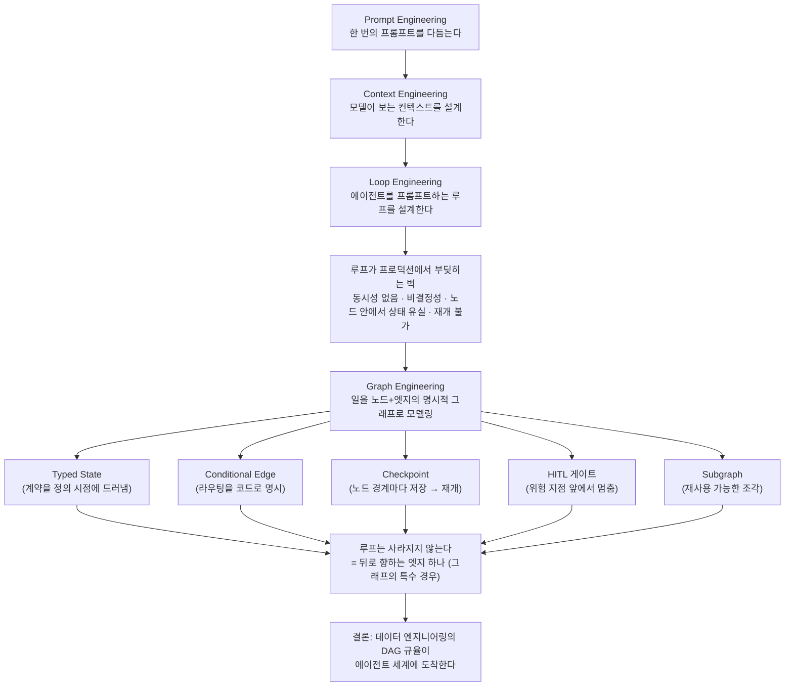
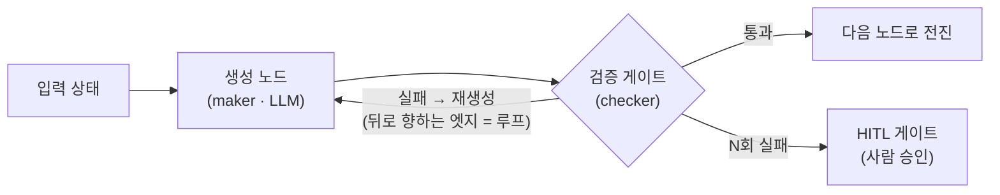

<figure class="post-figure post-figure--header">
<svg role="img" aria-label="Loop에서 Graph로의 진화. 왼쪽은 자기 자신으로 돌아오는 단일 원형 루프(loop engineering). 중앙에서 사람이 그래프를 설계한다. 오른쪽은 노드와 방향 있는 엣지로 이루어진 그래프 — 병렬로 갈라지는 fan-out, 다시 합쳐지는 fan-in, 조건부로 갈라지는 분기, 그리고 뒤로 향하는 엣지 하나가 루프가 그래프의 특수한 경우임을 보여준다. 체크포인트(디스크)와 HITL(사람) 게이트 아이콘이 함께 있다." viewBox="0 0 640 340" xmlns="http://www.w3.org/2000/svg">
  <title>Loop에서 Graph로 — 루프는 그래프의 특수한 경우</title>
  <!-- section titles -->
  <text x="110" y="28" text-anchor="middle" font-size="13" font-weight="700" fill="currentColor" opacity="0.65">Loop Engineering</text>
  <text x="478" y="28" text-anchor="middle" font-size="13" font-weight="700" fill="currentColor">Graph Engineering</text>

  <!-- LEFT: single loop -->
  <circle cx="110" cy="180" r="54" fill="none" stroke="var(--accent-color)" stroke-width="4"/>
  <path d="M110,126 l-9,-7 l3,12 z" fill="var(--accent-color)"/>
  <path d="M110,234 l9,7 l-3,-12 z" fill="var(--accent-color)"/>
  <text x="110" y="176" text-anchor="middle" font-size="13" font-weight="700" fill="currentColor">루프</text>
  <text x="110" y="194" text-anchor="middle" font-size="10" fill="currentColor" opacity="0.8">단일 사이클</text>

  <!-- divider -->
  <line x1="198" y1="46" x2="198" y2="290" stroke="currentColor" stroke-width="1.5" opacity="0.28" stroke-dasharray="4 5"/>

  <!-- CENTER: person designs the graph -->
  <circle cx="248" cy="168" r="13" fill="none" stroke="currentColor" stroke-width="2.5"/>
  <line x1="248" y1="181" x2="248" y2="212" stroke="currentColor" stroke-width="2.5"/>
  <text x="248" y="233" text-anchor="middle" font-size="11" font-weight="700" fill="currentColor">사람</text>
  <line x1="270" y1="180" x2="308" y2="180" stroke="var(--secondary-color)" stroke-width="2.5" marker-end="url(#gh-arrow)"/>
  <text x="289" y="169" text-anchor="middle" font-size="10" fill="currentColor" opacity="0.85">설계</text>

  <!-- RIGHT: directed graph -->
  <!-- backward edge (loop = special case) drawn first so nodes overlay -->
  <path d="M560,166 C560,58 340,58 340,166" fill="none" stroke="var(--gold)" stroke-width="2.5" stroke-dasharray="5 4" marker-end="url(#gh-back)"/>
  <text x="450" y="50" text-anchor="middle" font-size="10.5" font-weight="700" fill="currentColor">뒤로 향하는 엣지 = 루프</text>

  <!-- fan-out edges -->
  <line x1="362" y1="172" x2="422" y2="128" stroke="var(--secondary-color)" stroke-width="2.5" marker-end="url(#gh-arrow)"/>
  <line x1="352" y1="198" x2="378" y2="228" stroke="var(--secondary-color)" stroke-width="2.5" marker-end="url(#gh-arrow)"/>
  <text x="372" y="150" text-anchor="middle" font-size="10" fill="currentColor" opacity="0.8">fan-out</text>
  <!-- conditional diamond on the lower branch -->
  <polygon points="392,224 407,239 392,254 377,239" fill="var(--bg-light)" stroke="var(--gold)" stroke-width="2"/>
  <text x="392" y="243" text-anchor="middle" font-size="9" fill="currentColor" font-weight="700">조건</text>
  <line x1="407" y1="239" x2="424" y2="250" stroke="var(--secondary-color)" stroke-width="2.5" marker-end="url(#gh-arrow)"/>
  <text x="392" y="278" text-anchor="middle" font-size="9.5" fill="currentColor" opacity="0.8">조건부 분기</text>

  <!-- fan-in edges -->
  <line x1="470" y1="128" x2="538" y2="172" stroke="var(--secondary-color)" stroke-width="2.5" marker-end="url(#gh-arrow)"/>
  <line x1="470" y1="250" x2="538" y2="196" stroke="var(--secondary-color)" stroke-width="2.5" marker-end="url(#gh-arrow)"/>
  <text x="512" y="150" text-anchor="middle" font-size="10" fill="currentColor" opacity="0.8">fan-in</text>

  <!-- nodes -->
  <rect x="318" y="166" width="44" height="30" rx="3" fill="var(--bg-light)" stroke="currentColor" stroke-width="2"/>
  <text x="340" y="185" text-anchor="middle" font-size="10" font-weight="700" fill="currentColor">시작</text>
  <rect x="426" y="102" width="44" height="30" rx="3" fill="var(--bg-light)" stroke="currentColor" stroke-width="2"/>
  <text x="448" y="121" text-anchor="middle" font-size="10" font-weight="700" fill="currentColor">노드</text>
  <rect x="426" y="240" width="44" height="30" rx="3" fill="var(--bg-light)" stroke="currentColor" stroke-width="2"/>
  <text x="448" y="259" text-anchor="middle" font-size="10" font-weight="700" fill="currentColor">노드</text>
  <rect x="540" y="166" width="44" height="30" rx="3" fill="var(--bg-light)" stroke="currentColor" stroke-width="2"/>
  <text x="562" y="185" text-anchor="middle" font-size="10" font-weight="700" fill="currentColor">합류</text>

  <!-- checkpoint disk on a node boundary -->
  <g transform="translate(500,158)">
    <ellipse cx="0" cy="-4" rx="7" ry="3" fill="var(--bg-panel)" stroke="var(--gold)" stroke-width="2"/>
    <path d="M-7,-4 v8 a7,3 0 0 0 14,0 v-8" fill="none" stroke="var(--gold)" stroke-width="2"/>
  </g>
  <!-- HITL person icon before the risky merge node -->
  <g transform="translate(562,138)">
    <circle cx="0" cy="-6" r="4.5" fill="none" stroke="currentColor" stroke-width="2"/>
    <line x1="0" y1="-1.5" x2="0" y2="7" stroke="currentColor" stroke-width="2"/>
  </g>

  <!-- legend -->
  <g transform="translate(322,314)">
    <ellipse cx="0" cy="-3" rx="6" ry="2.6" fill="var(--bg-panel)" stroke="var(--gold)" stroke-width="1.8"/>
    <path d="M-6,-3 v7 a6,2.6 0 0 0 12,0 v-7" fill="none" stroke="var(--gold)" stroke-width="1.8"/>
  </g>
  <text x="336" y="317" font-size="9.5" fill="currentColor" opacity="0.8">체크포인트(노드 경계)</text>
  <g transform="translate(470,314)">
    <circle cx="0" cy="-3" r="4" fill="none" stroke="currentColor" stroke-width="1.8"/>
    <line x1="0" y1="1" x2="0" y2="9" stroke="currentColor" stroke-width="1.8"/>
  </g>
  <text x="482" y="317" font-size="9.5" fill="currentColor" opacity="0.8">HITL 게이트(위험 지점)</text>

  <defs>
    <marker id="gh-arrow" markerWidth="8" markerHeight="8" refX="6" refY="4" orient="auto">
      <path d="M0,0 L8,4 L0,8 z" fill="var(--secondary-color)"/>
    </marker>
    <marker id="gh-back" markerWidth="8" markerHeight="8" refX="6" refY="4" orient="auto">
      <path d="M0,0 L8,4 L0,8 z" fill="var(--gold)"/>
    </marker>
  </defs>
</svg>
<figcaption>레버리지가 "루프를 설계하는 사람"에서 "실행 그래프를 설계하는 사람"으로 한 번 더 이동한다 — 루프(왼쪽)는 사라지지 않고, 그래프의 뒤로 향하는 엣지 하나(오른쪽)로 흡수된다. fan-out·fan-in·조건부 분기·체크포인트·HITL 게이트가 그래프의 프리미티브다.</figcaption>
</figure>

## 주요 출처

> 이 글은 한 편의 아티클 분석이 아니라, 2026년 상반기 Reddit·Hacker News·엔지니어링 블로그에서 **"loop engineering 다음"** 으로 반복 등장하는 *graph engineering* 흐름을 조사해 **정의하고 정리**하는 글이다. 참고한 주요 출처는 다음과 같다.

> - **개념 정착**: *Graph-Based Agent Workflow Orchestration in Production: The 2026 Landscape* — Zylos Research (2026-04-14) · <https://zylos.ai/research/2026-04-14-graph-based-agent-workflow-orchestration-production/>
> - **이론적 골격**: *From Agent Loops to Structured Graphs: A Scheduler-Theoretic Framework for LLM Agent Execution* — arXiv 2604.11378
> - **현장 신호(HN)**: *Statewright — Visual state machines that make AI agents reliable* (Hacker News, 126 points) · *LangGraph vs Temporal: Durable Execution Architecture Beyond For Loops* — Data Science Collective
> - **선행 글(이 위키)**: [Loop Engineering — 에이전트를 프롬프트하는 대신 프롬프트하는 시스템을 설계하라](/2026/06/19/loop-engineering.html)

## 한 줄 요약 (TL;DR)

**Graph engineering이란, 에이전트가 할 일을 하나의 무한 루프가 아니라 노드(node)와 방향 있는 엣지(edge)로 이루어진 명시적 그래프로 모델링하고 운영하는 규율이다.** 각 노드는 LLM 호출이나 도구 실행 같은 한 단계이고, 엣지는 "다음에 무엇이 실행될 수 있는가"라는 전이 규칙이다. 여기에 **타입된 상태(typed state)·조건부 엣지(conditional edge)·체크포인트(checkpoint)·human-in-the-loop 게이트·서브그래프(subgraph)** 라는 다섯 프리미티브가 붙는다. [loop engineering](/2026/06/19/loop-engineering.html)이 "에이전트를 프롬프트하는 루프를 설계하라"였다면, graph engineering은 그 루프가 프로덕션에서 부딪히는 벽(동시성 없음·비결정성·재개 불가)을 넘기 위해 **루프를 그래프의 특수한 경우로 흡수**한다. 핵심 통찰: 데이터 엔지니어링이 이미 10년 전에 파이프라인을 DAG로 다뤄 온 그 규율이, 이제 에이전트 세계에 도착하고 있다.

### 한눈에 보기

이 글의 척추는 하나의 진화 사슬이다 — 레버리지가 *프롬프트*에서 *컨텍스트*로, *루프*로, 이제 *그래프*로 옮겨간다. 각 단계는 앞 단계를 부정하지 않고 **감싼다**: 그래프의 노드 안에 여전히 프롬프트가 있고, 그래프의 뒤로 향하는 엣지가 곧 루프다.

## 왜 이 주제를 골랐나

나는 [loop engineering 글](/2026/06/19/loop-engineering.html) 끝에, 프롬프트 엔지니어링 → AI-assisted engineering → loop engineering으로 레버리지가 이동한다고 정리했다. 그런데 loop engineering을 실제 프로덕션에 밀어 넣은 팀들의 회고가 2026년 상반기에 하나의 방향으로 수렴하기 시작했다 — **"무한 루프(`while True: prompt → tool → re-prompt`)만으로는 프로덕션이 안 된다."** Reddit의 r/LLMDevs, Hacker News의 프레임워크 스레드, 그리고 여러 엔지니어링 블로그가 같은 단어를 꺼냈다: *graph*.

이 흐름이 흥미로운 이유는 두 가지다. 첫째, 이건 새 발명이 아니라 **오래된 규율의 재수입**이다. 데이터 엔지니어가 Airflow DAG로 파이프라인을 다뤄 온 방식([오케스트레이션](/2026/06/25/orchestration.html)·[Airflow DAG](/2026/07/13/airflow-dag-operators-tasks.html))이 거의 그대로 에이전트 실행에 적용된다. 이 위키에 이미 그 토대 글이 있으니, 두 세계를 잇는 정리를 남길 좋은 기회였다. 둘째, loop engineering이 강조한 "검증은 위임되지 않는다"는 명제가 graph engineering에서는 **HITL 게이트라는 구조**로 굳는다 — 관점이 아니라 아키텍처가 된다.

## 핵심 내용

### Graph Engineering의 정의

여러 출처를 관통하는 정의를 한 문장으로 모으면 이렇다.

> **Graph engineering은, ad hoc한 에이전트 체인을 타입된 상태·조건부 라우팅·체크포인트 실행·계층적 관찰가능성을 갖춘 명시적 방향 그래프(directed graph)로 대체하는 것이다.** (Zylos Research, 2026)

질문 자체가 옮겨갔다. 2023~2024년의 물음은 "에이전트가 복잡한 일을 해낼 수 있는가?"였다. 2026년의 물음은 **"우리가 그 실행 그래프를 어떻게 모델링하고 통치(govern)할 것인가?"** 다. "할 수 있는가"에서 "어떻게 다스리는가"로의 이동 — 이게 graph engineering이라는 이름이 가리키는 성숙이다.

### 왜 루프는 벽에 부딪히는가

2023~2024년의 LLM 생태계는 에이전트를 사실상 **화려한 for 루프**로 다뤘다: 모델을 프롬프트하고, 도구 호출을 파싱하고, 실행하고, 다시 프롬프트한다. 이 패턴은 프로덕션에 들어가는 순간 벽에 부딪힌다. arXiv 2604.11378(*From Agent Loops to Structured Graphs*)과 여러 현장 회고가 짚는 실패 모드는 일관된다.

- **동시성 제어가 없다.** 순차 루프는 독립적인 작업도 한 줄로 세워 실행한다. 서로 의존하지 않는 두 서브태스크를 병렬로 돌릴 방법이 루프 안에는 없다.
- **결정성이 없다.** 루프는 매번 다른 경로로 흘러 같은 입력에 같은 실행 트레이스를 보장하지 못한다. 디버깅과 검증이 어렵다.
- **노드 *안에서* 상태가 유실된다.** 체크포인트는 노드 *사이*의 상태만 저장한다. 한 노드 안의 `for` 루프가 1만 건을 처리하다 API 레이트리밋이나 파드 축출(pod eviction)로 죽으면, 그 안의 진행분은 통째로 날아간다(*Beyond For Loops*, Data Science Collective).
- **재개가 불가능하다.** 오래 도는 워크플로가 중간에 죽으면 처음부터 다시 시작한다. 비싼 API 호출이 반복된다.

핵심은 이것이다 — **loop engineering이 설계하라던 그 "루프"는, 프리미티브로서는 프로덕션의 무게를 견디지 못한다.** 루프는 좋은 *개념*이지만, 나쁜 *실행 모델*이다.

<figure class="post-figure">
<svg role="img" aria-label="노드 안의 for 루프와 fan-out의 상태 유실 비교. 왼쪽: 한 노드 안에서 1만 건을 도는 for 루프가 중간에 죽으면 그 노드 안의 진행분이 통째로 유실된다. 체크포인트는 노드 사이만 저장하기 때문이다. 오른쪽: 같은 배치를 fan-out으로 여러 노드로 쪼개면 노드 경계마다 체크포인트가 찍혀, 하나가 죽어도 그 청크만 재개하면 되고 손실 지점이 노드 밖으로 밀려난다." viewBox="0 0 640 350" xmlns="http://www.w3.org/2000/svg">
  <title>노드 안에서 상태가 유실된다 — for 루프 vs fan-out</title>
  <!-- section titles -->
  <text x="160" y="26" text-anchor="middle" font-size="12.5" font-weight="700" fill="currentColor" opacity="0.7">한 노드 안의 for 루프</text>
  <text x="478" y="26" text-anchor="middle" font-size="12.5" font-weight="700" fill="currentColor">fan-out으로 쪼갬</text>

  <!-- divider -->
  <line x1="318" y1="44" x2="318" y2="308" stroke="currentColor" stroke-width="1.5" opacity="0.28" stroke-dasharray="4 5"/>

  <!-- LEFT: one node with an inner loop dying mid-batch -->
  <!-- checkpoint disks at node boundaries (before / after) -->
  <g transform="translate(38,150)">
    <ellipse cx="0" cy="-4" rx="8" ry="3.4" fill="var(--bg-panel)" stroke="var(--gold)" stroke-width="2"/>
    <path d="M-8,-4 v9 a8,3.4 0 0 0 16,0 v-9" fill="none" stroke="var(--gold)" stroke-width="2"/>
  </g>
  <g transform="translate(282,150)">
    <ellipse cx="0" cy="-4" rx="8" ry="3.4" fill="var(--bg-panel)" stroke="var(--gold)" stroke-width="2"/>
    <path d="M-8,-4 v9 a8,3.4 0 0 0 16,0 v-9" fill="none" stroke="var(--gold)" stroke-width="2"/>
  </g>
  <line x1="46" y1="150" x2="72" y2="150" stroke="var(--secondary-color)" stroke-width="2.5" marker-end="url(#gn-arrow)"/>
  <line x1="248" y1="150" x2="274" y2="150" stroke="var(--secondary-color)" stroke-width="2.5" marker-end="url(#gn-arrow)"/>
  <!-- the node -->
  <rect x="74" y="86" width="174" height="128" rx="6" fill="var(--bg-light)" stroke="currentColor" stroke-width="2"/>
  <text x="161" y="106" text-anchor="middle" font-size="11" font-weight="700" fill="currentColor">노드</text>
  <!-- inner for-loop -->
  <circle cx="161" cy="156" r="34" fill="none" stroke="var(--accent-color)" stroke-width="3" stroke-dasharray="5 4"/>
  <path d="M161,122 l-8,-6 l3,11 z" fill="var(--accent-color)"/>
  <text x="161" y="152" text-anchor="middle" font-size="10" font-weight="700" fill="currentColor">for</text>
  <text x="161" y="166" text-anchor="middle" font-size="9.5" fill="currentColor" opacity="0.85">1만 건</text>
  <!-- crash X -->
  <line x1="180" y1="134" x2="204" y2="158" stroke="var(--accent-color)" stroke-width="3.5"/>
  <line x1="204" y1="134" x2="180" y2="158" stroke="var(--accent-color)" stroke-width="3.5"/>
  <text x="161" y="234" text-anchor="middle" font-size="10" fill="currentColor" opacity="0.85">레이트리밋 · 파드 축출 → 죽음</text>
  <text x="161" y="252" text-anchor="middle" font-size="10.5" font-weight="700" fill="var(--accent-color)">노드 안 진행분 통째 유실</text>
  <text x="161" y="284" text-anchor="middle" font-size="9.5" fill="currentColor" opacity="0.7">체크포인트는 노드 *사이*만 저장한다</text>

  <!-- RIGHT: fan-out into parallel nodes, each checkpointed -->
  <rect x="344" y="132" width="52" height="36" rx="4" fill="var(--bg-light)" stroke="currentColor" stroke-width="2"/>
  <text x="370" y="151" text-anchor="middle" font-size="9.5" font-weight="700" fill="currentColor">fan-out</text>
  <text x="370" y="163" text-anchor="middle" font-size="8.5" fill="currentColor" opacity="0.75">청크 분배</text>
  <!-- worker nodes -->
  <rect x="470" y="70" width="52" height="34" rx="4" fill="var(--bg-light)" stroke="currentColor" stroke-width="2"/>
  <text x="496" y="91" text-anchor="middle" font-size="9.5" font-weight="700" fill="currentColor">청크 1</text>
  <rect x="470" y="133" width="52" height="34" rx="4" fill="var(--bg-light)" stroke="currentColor" stroke-width="2"/>
  <text x="496" y="154" text-anchor="middle" font-size="9.5" font-weight="700" fill="currentColor">청크 2</text>
  <rect x="470" y="196" width="52" height="34" rx="4" fill="var(--bg-light)" stroke="currentColor" stroke-width="2"/>
  <text x="496" y="217" text-anchor="middle" font-size="9.5" font-weight="700" fill="currentColor">청크 3</text>
  <!-- edges with checkpoint disks at each boundary -->
  <line x1="396" y1="146" x2="466" y2="92" stroke="var(--secondary-color)" stroke-width="2.5" marker-end="url(#gn-arrow)"/>
  <line x1="398" y1="150" x2="466" y2="150" stroke="var(--secondary-color)" stroke-width="2.5" marker-end="url(#gn-arrow)"/>
  <line x1="396" y1="154" x2="466" y2="208" stroke="var(--secondary-color)" stroke-width="2.5" marker-end="url(#gn-arrow)"/>
  <g transform="translate(433,101)"><ellipse cx="0" cy="-3" rx="6" ry="2.6" fill="var(--bg-panel)" stroke="var(--gold)" stroke-width="1.8"/><path d="M-6,-3 v7 a6,2.6 0 0 0 12,0 v-7" fill="none" stroke="var(--gold)" stroke-width="1.8"/></g>
  <g transform="translate(433,142)"><ellipse cx="0" cy="-3" rx="6" ry="2.6" fill="var(--bg-panel)" stroke="var(--gold)" stroke-width="1.8"/><path d="M-6,-3 v7 a6,2.6 0 0 0 12,0 v-7" fill="none" stroke="var(--gold)" stroke-width="1.8"/></g>
  <g transform="translate(433,199)"><ellipse cx="0" cy="-3" rx="6" ry="2.6" fill="var(--bg-panel)" stroke="var(--gold)" stroke-width="1.8"/><path d="M-6,-3 v7 a6,2.6 0 0 0 12,0 v-7" fill="none" stroke="var(--gold)" stroke-width="1.8"/></g>
  <!-- one chunk dies -->
  <line x1="527" y1="140" x2="543" y2="156" stroke="var(--accent-color)" stroke-width="3"/>
  <line x1="543" y1="140" x2="527" y2="156" stroke="var(--accent-color)" stroke-width="3"/>
  <text x="558" y="152" text-anchor="start" font-size="8.5" fill="currentColor" opacity="0.8">죽음</text>
  <text x="480" y="256" text-anchor="middle" font-size="10.5" font-weight="700" fill="var(--secondary-color)">그 청크만 재개</text>
  <text x="480" y="274" text-anchor="middle" font-size="9.5" fill="currentColor" opacity="0.75">손실 지점이 노드 *밖*으로 밀려난다</text>

  <defs>
    <marker id="gn-arrow" markerWidth="8" markerHeight="8" refX="6" refY="4" orient="auto">
      <path d="M0,0 L8,4 L0,8 z" fill="var(--secondary-color)"/>
    </marker>
  </defs>
</svg>
<figcaption>체크포인트는 노드 *사이*의 상태만 저장한다. 그래서 한 노드 안의 for 루프가 1만 건을 돌다 죽으면 그 진행분은 통째로 날아간다(왼쪽). 같은 배치를 fan-out으로 쪼개면 노드 경계마다 체크포인트가 찍혀, 하나가 죽어도 그 청크만 재개하면 되고 손실 지점이 노드 밖으로 밀려난다(오른쪽).</figcaption>
</figure>

### 그래프가 사는 것: 다섯 프리미티브

성숙한 프레임워크들(LangGraph, Temporal, Microsoft Agent Framework, Mastra)은 이름은 달라도 같은 다섯 프리미티브로 수렴한다(Zylos Research).

- **Typed State (타입된 상태)**: 느슨한 딕셔너리 대신 구조화된 상태 객체. 계약 위반을 *정의 시점*에 드러낸다.
- **Conditional Edge (조건부 엣지)**: 라우팅을 LLM의 자유 생성에 맡기지 않고, 상태에 대한 함수로 *코드에 명시*한다. "이 조건이면 리뷰 노드로, 아니면 배포 노드로."
- **Checkpoint (체크포인트)**: 모든 노드 실행을 영속 저장소에 기록한다. 크래시 복구와 time-travel 디버깅이 가능해진다.
- **Human-in-the-Loop 인터럽트**: 위험한 행동 앞에서 스레드를 잡아먹지 않고 멈춘다. 상태를 통째로 직렬화해 리뷰어에게 맥락을 넘긴다.
- **Subgraph (서브그래프)**: 재사용 가능한 그래프 조각. 복잡한 워크플로를 분해한다.

그리고 결정적인 사실 — **루프는 사라지지 않는다.** 그래프에서 엣지는 뒤로도 향할 수 있고, 뒤로 향하는 엣지가 바로 루프다. 평범한 선형 체인은 루프를 못 만들지만 그래프는 만든다. 즉 **graph engineering은 loop engineering을 부정하는 게 아니라, 루프를 그래프의 특수한 경우로 흡수한다.**

### 반복되는 그래프 패턴

현장에서 검증된 패턴들도 이름을 얻었다(Zylos Research).

- **Hybrid Backbone (결정적 뼈대)**: 결정적 오케스트레이션이 흐름을 잡고, 특정 단계에서만 LLM 지능을 부른다. 완료되면 제어권이 뼈대로 돌아온다. Anthropic 계열 가이드가 "2026년의 승리 패턴"이라 부른 형태다.
- **Orchestrator-Worker**: 플래너가 목표를 서브태스크로 쪼개 전문 워커들에게 병렬 분배하고, 결과를 종합한다.
- **Sequential Pipeline + Validation Gate**: 각 단계 출력을 다음으로 넘기기 전에 검증하는 게이트. 잘못된 LLM 출력이 하류로 전파되는 걸 막는다.
- **Fan-Out / Fan-In**: 청크 병렬화. 지연 시간이 전체 작업량이 아니라 *가장 긴 가지의 깊이*에 비례한다.

<figure class="post-figure">
<svg role="img" aria-label="Hybrid Backbone(결정적 뼈대) 패턴. 아래쪽에 결정적 오케스트레이션 뼈대가 왼쪽에서 오른쪽으로 흐르는 노드들의 사슬로 놓여 있다. 특정 단계에서만 비결정적 LLM 노드를 위로 호출하고, 완료되면 제어권이 다시 뼈대로 돌아온다. 지능은 예측 불가능하지만 그 지능이 흐르는 물길(그래프 구조와 라우팅)은 예측 가능하다." viewBox="0 0 640 300" xmlns="http://www.w3.org/2000/svg">
  <title>비결정적 노드를 결정적 뼈대로 감싼다 — Hybrid Backbone</title>
  <!-- top label: nondeterministic intelligence -->
  <text x="320" y="26" text-anchor="middle" font-size="11" font-weight="700" fill="currentColor" opacity="0.75">특정 단계에서만 LLM 지능을 부른다 (비결정적)</text>

  <!-- LLM nodes (nondeterministic, dashed accent) -->
  <rect x="188" y="52" width="84" height="46" rx="6" fill="var(--bg-light)" stroke="var(--accent-color)" stroke-width="2.5" stroke-dasharray="6 4"/>
  <text x="230" y="74" text-anchor="middle" font-size="11" font-weight="700" fill="currentColor">LLM</text>
  <text x="230" y="89" text-anchor="middle" font-size="9" fill="currentColor" opacity="0.8">비결정</text>
  <rect x="368" y="52" width="84" height="46" rx="6" fill="var(--bg-light)" stroke="var(--accent-color)" stroke-width="2.5" stroke-dasharray="6 4"/>
  <text x="410" y="74" text-anchor="middle" font-size="11" font-weight="700" fill="currentColor">LLM</text>
  <text x="410" y="89" text-anchor="middle" font-size="9" fill="currentColor" opacity="0.8">비결정</text>

  <!-- call / return between backbone and LLM (gold dashed) -->
  <line x1="212" y1="188" x2="212" y2="102" stroke="var(--gold)" stroke-width="2.2" stroke-dasharray="4 4" marker-end="url(#hb-call)"/>
  <text x="196" y="146" text-anchor="middle" font-size="9" fill="currentColor" opacity="0.8">호출</text>
  <line x1="248" y1="102" x2="248" y2="188" stroke="var(--gold)" stroke-width="2.2" stroke-dasharray="4 4" marker-end="url(#hb-call)"/>
  <text x="266" y="146" text-anchor="middle" font-size="9" fill="currentColor" opacity="0.8">복귀</text>
  <line x1="392" y1="188" x2="392" y2="102" stroke="var(--gold)" stroke-width="2.2" stroke-dasharray="4 4" marker-end="url(#hb-call)"/>
  <text x="376" y="146" text-anchor="middle" font-size="9" fill="currentColor" opacity="0.8">호출</text>
  <line x1="428" y1="102" x2="428" y2="188" stroke="var(--gold)" stroke-width="2.2" stroke-dasharray="4 4" marker-end="url(#hb-call)"/>
  <text x="446" y="146" text-anchor="middle" font-size="9" fill="currentColor" opacity="0.8">복귀</text>

  <!-- deterministic backbone (solid) -->
  <line x1="96" y1="210" x2="560" y2="210" stroke="var(--secondary-color)" stroke-width="3"/>
  <rect x="52" y="190" width="80" height="40" rx="4" fill="var(--bg-panel)" stroke="currentColor" stroke-width="2.5"/>
  <text x="92" y="214" text-anchor="middle" font-size="10" font-weight="700" fill="currentColor">단계 1</text>
  <rect x="190" y="190" width="80" height="40" rx="4" fill="var(--bg-panel)" stroke="currentColor" stroke-width="2.5"/>
  <text x="230" y="214" text-anchor="middle" font-size="10" font-weight="700" fill="currentColor">단계 2</text>
  <rect x="370" y="190" width="80" height="40" rx="4" fill="var(--bg-panel)" stroke="currentColor" stroke-width="2.5"/>
  <text x="410" y="214" text-anchor="middle" font-size="10" font-weight="700" fill="currentColor">단계 3</text>
  <rect x="508" y="190" width="80" height="40" rx="4" fill="var(--bg-panel)" stroke="currentColor" stroke-width="2.5"/>
  <text x="548" y="214" text-anchor="middle" font-size="10" font-weight="700" fill="currentColor">단계 4</text>
  <!-- forward arrowheads along the backbone -->
  <path d="M190,210 l-12,-5 l0,10 z" fill="var(--secondary-color)"/>
  <path d="M370,210 l-12,-5 l0,10 z" fill="var(--secondary-color)"/>
  <path d="M508,210 l-12,-5 l0,10 z" fill="var(--secondary-color)"/>

  <text x="320" y="268" text-anchor="middle" font-size="11" font-weight="700" fill="var(--secondary-color)">결정적 뼈대 — 흐름·라우팅은 예측 가능, 제어권은 늘 뼈대로 복귀</text>
  <text x="320" y="286" text-anchor="middle" font-size="9.5" fill="currentColor" opacity="0.72">지능은 예측 불가능한 채로 두되, 그 지능이 흐르는 물길은 예측 가능하게 판다</text>

  <defs>
    <marker id="hb-call" markerWidth="8" markerHeight="8" refX="6" refY="4" orient="auto">
      <path d="M0,0 L8,4 L0,8 z" fill="var(--gold)"/>
    </marker>
  </defs>
</svg>
<figcaption>Hybrid Backbone: 결정적 오케스트레이션이 흐름을 잡고, 특정 단계에서만 비결정적 LLM을 호출한 뒤 제어권을 뼈대로 되돌린다. graph engineering의 결정성은 노드 *내부*가 아니라 그래프 *구조와 라우팅*의 결정성이다.</figcaption>
</figure>

### 현장 신호: 프레임워크와 커뮤니티

이 흐름은 담론이 아니라 코드로 나타나고 있다.

- **LangGraph** — 2025년 10월 1.0(파괴적 변경 0), 2026년 4월 기준 GitHub 12.6만 스타. LLM-네이티브 그래프 오케스트레이션의 사실상 표준. durable execution·streaming·HITL·memory를 런타임으로 안정화했다.
- **Temporal** — LLM 전용이 아닌 범용 durable execution. 멀티리전 복제에서 99.99% SLA. 엔터프라이즈 크래시 내성의 표준 선택지. (이 위키의 [Postgres durable workflow(DBOS)](/2026/06/22/postgres-durable-execution.html) 글이 같은 문제를 중앙 오케스트레이터 없이 푸는 반대편 접근이다.)
- **Microsoft Agent Framework 1.0** — 2026년 4월 GA. AutoGen과 Semantic Kernel을 합쳐 컴파일 타임 타입 안전 방향 그래프 엔진을 제공한다.
- **Hacker News** — *Statewright(비주얼 상태 기계로 에이전트를 신뢰 가능하게)* 가 126포인트를 받았다. 형식적 상태 기계로 에이전트 행동을 제약하고, "실패 경로·재시도 루프·승인 게이트"를 시각적으로 드러낸다는 발상 — graph engineering의 커뮤니티 버전이다.

## 분석과 인사이트

여기서부터는 출처 요약이 아니라 내 관점이다.

- **이건 "새 규율"이 아니라 데이터 엔지니어링의 귀환이다.** graph engineering의 다섯 프리미티브를 데이터 엔지니어는 다른 이름으로 이미 안다. Typed state = 스키마, conditional edge = 브랜치 오퍼레이터, checkpoint = 태스크 경계 재시도, HITL 게이트 = 수동 승인 태스크, subgraph = SubDAG/TaskGroup. 내가 [오케스트레이션 글](/2026/06/25/orchestration.html)에서 정리한 "DAG·스케줄링·idempotency·재시도"가 바로 이것이다. [Airflow의 backfill·catchup·idempotency](/2026/07/13/airflow-backfill-catchup-idempotency.html)가 데이터 파이프라인에서 풀었던 문제를, 에이전트 프레임워크가 지금 다시 발명하고 있다. **에이전트 엔지니어가 배워야 할 다음 교과서는 새 LLM 논문이 아니라, 성숙한 워크플로 오케스트레이션의 20년 규율일지 모른다.**

- **단, 에이전트 그래프는 데이터 DAG와 결정적으로 다르다 — 노드가 비결정적이다.** Airflow DAG의 노드는 (대체로) 결정적 함수다. 에이전트 그래프의 노드는 LLM 호출이라 같은 입력에 다른 출력을 낸다. 그래서 arXiv 논문이 강조하는 "결정성"은 *노드 내부*가 아니라 *그래프 구조와 라우팅*의 결정성이다. 즉 graph engineering의 진짜 기여는 **비결정적 노드를 결정적 뼈대(hybrid backbone)로 감싸는 것** — 지능은 예측 불가능한 채로 두되, 그 지능이 흐르는 물길은 예측 가능하게 판다. 이건 [Codex의 agent loop를 펼쳐 본 글](/2026/06/25/codex-agent-loop.html)에서 본 "하니스가 LLM을 부린다"는 구도의 상위 버전이다.

- **HITL 게이트는 loop engineering의 도덕을 아키텍처로 굳힌 것이다.** loop engineering 글의 결론은 "검증·이해·책임은 위임되지 않는다(comprehension debt·cognitive surrender 경계)"였다. 그건 규범적 호소였다. graph engineering에서 그 호소는 **그래프의 특정 엣지 앞에 놓인 인터럽트 노드**가 된다 — 위험한 행동 앞에서 실행이 *구조적으로* 멈추고 사람의 승인을 기다린다. 관점을 코드로 강제한다는 점에서, [신뢰할 수 있는 Agentic AI 시스템](/2026/06/19/reliable-agentic-ai-systems.html)의 reflection(생성·검증 분리)·guardrail이 그래프의 노드·게이트로 물화(物化)되는 셈이다.

- **maker/checker가 서브그래프가 된다.** loop engineering이 말한 "생성 에이전트와 검증 에이전트를 분리하라"는 조언은, 그래프에서 *생성 노드 → 검증 게이트 → (실패 시) 뒤로 향하는 엣지*라는 재사용 가능한 서브그래프로 표준화된다. 조언이 패턴이 되고, 패턴이 프리미티브가 된다. 이 궤적 자체가 한 분야가 성숙하는 방식이다.

- **위험은 "그래프 과설계(over-graphing)"다.** loop engineering에 loopmaxxing(루프 남발)이 있었듯, graph engineering에는 모든 것을 노드로 쪼개 관리 불가능한 그래프를 만드는 함정이 있다. 출처들의 메타 권고가 일관되게 절제를 말하는 이유다 — *"작동하는 가장 단순한 아키텍처에서 시작하고, 충분히 계측하고, 관찰된 실패 모드에 반응해서만 복잡도를 더하라."* [에이전틱 코딩은 함정](/2026/07/03/agentic-coding-is-a-trap.html)과 [바이브 코딩과 에이전틱 엔지니어링](/2026/06/25/vibe-coding-and-agentic-engineering.html)이 경계한 과잉 자동화와 같은 자리다.

## 적용 포인트

- **일회성이면 프롬프트, 반복이면 루프, 프로덕션이면 그래프.** [loop engineering 글](/2026/06/19/loop-engineering.html)의 "반복 가능한가?"에 한 단계를 더한다 — "실패해도 재개돼야 하는가? 병렬로 갈라지는가? 위험한 행동이 있는가?" 셋 중 하나라도 예면 루프가 아니라 그래프로 설계한다.
- **상태를 딕셔너리가 아니라 타입으로 정의한다.** 그래프의 첫 설계 결정은 노드가 아니라 노드들이 주고받는 **상태의 스키마**다. 여기서 계약을 못 박으면 하류의 절반이 자동으로 정리된다.
- **라우팅을 LLM에게 맡기지 말고 conditional edge로 코드에 적는다.** "매니저 에이전트가 자유 대화로 다음을 정하는" 구조 대신, 상태에 대한 명시적 분기 함수를 둔다. 비결정적 노드는 그대로 두되 물길은 결정적으로.
- **노드 경계마다 체크포인트를 켜고, 노드 *안*에서 대량 반복을 돌리지 않는다.** 1만 건 배치는 한 노드의 `for`가 아니라 fan-out으로 쪼갠다. 상태 유실 지점을 노드 밖으로 밀어낸다.
- **위험한 엣지 앞에 HITL 게이트를 명시한다.** 배포·삭제·외부 전송·비용 발생 행동 앞에 인터럽트 노드를 둔다. 검증 책임을 규범이 아니라 구조로 강제한다.
- **데이터 엔지니어링 오케스트레이션을 교과서로 삼는다.** DAG·idempotency·재시도·backfill을 [오케스트레이션](/2026/06/25/orchestration.html)·[Airflow 시리즈](/2026/07/13/airflow-dag-operators-tasks.html)에서 먼저 익히면, 에이전트 그래프 프레임워크의 개념 절반은 이미 아는 것이다.
- **관찰가능성을 처음부터 깐다.** 토큰·지연·상태 diff·인터럽트를 노드 단위로 추적한다. 그래프는 계측 없이는 디버깅 불가능한 복잡도를 금세 만든다.

## 마무리

레버리지는 한 번 더 이동한다 — 프롬프트하는 사람에서, 루프를 설계하는 사람으로, 이제 **실행 그래프를 설계하는 사람**으로. 하지만 loop engineering이 그랬듯 graph engineering도 일을 줄여주지 않는다. 오히려 설계 대상이 "한 번의 대화"에서 "상태·전이·게이트·재개 정책을 가진 시스템"으로 커진다. 위임할 수 있는 것(생성·반복·병렬 실행)과 위임할 수 없는 것(구조·게이트·책임)을 가르는 안목은 그대로다 — graph engineering은 그 안목을 *관점*에서 *아키텍처*로 옮겨 적었을 뿐이다.

그리고 이 이야기의 가장 큰 아이러니는, 가장 새로워 보이는 규율이 사실 가장 오래된 규율의 귀환이라는 점이다. 에이전트를 그래프로 다스리는 법을 배우고 싶다면, 최신 프레임워크 문서를 열기 전에 데이터 엔지니어가 파이프라인을 DAG로 다스려 온 방식을 먼저 읽어라. 새 물결의 이름은 graph engineering이지만, 그 물이 흐르는 강바닥은 오래전에 파여 있었다.

### 더 읽어보기

- [Loop Engineering — 에이전트를 프롬프트하는 대신 프롬프트하는 시스템을 설계하라 (Addy Osmani)](/2026/06/19/loop-engineering.html) — 이 글의 직접적 선행 단계
- [신뢰할 수 있는 Agentic AI 시스템](/2026/06/19/reliable-agentic-ai-systems.html) — reflection·guardrail이 그래프의 노드·게이트로 굳는다
- [Codex의 agent loop를 펼쳐 보기 (OpenAI, Michael Bolin)](/2026/06/25/codex-agent-loop.html) — 하니스가 비결정적 노드를 부리는 하위 구조
- [Postgres 하나면 충분하다: Durable Workflow (DBOS)](/2026/06/22/postgres-durable-execution.html) — 체크포인트·재개를 중앙 오케스트레이터 없이 푸는 접근
- [오케스트레이션: DAG·스케줄링과 견고한 파이프라인](/2026/06/25/orchestration.html) — 에이전트 그래프가 다시 발명하고 있는 데이터 엔지니어링의 원본 규율
- [Airflow DAG · 오퍼레이터 · 태스크](/2026/07/13/airflow-dag-operators-tasks.html) · [backfill·catchup·idempotency](/2026/07/13/airflow-backfill-catchup-idempotency.html) — 그래프 실행의 재시도·재개를 데이터 파이프라인에서 먼저 익히기
- [에이전틱 코딩은 함정 / 바이브 코딩과 에이전틱 엔지니어링](/2026/07/03/agentic-coding-is-a-trap.html) — 그래프 과설계(over-graphing)를 경계하는 균형 감각
