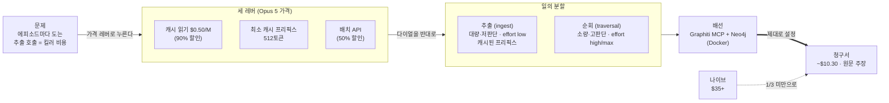

<figure class="post-figure post-figure--header">
<svg role="img" aria-label="오크 대장간의 두 화로 은유. 왼쪽 화로는 '추출(ingest)'로 effort low에 캐시된 스키마 프리픽스가 재사용되는 낮고 꾸준한 불꽃이며, 왼쪽에서 여러 개의 에피소드 조각이 쉴 새 없이 흘러 들어간다. 오른쪽 화로는 '순회(traversal)'로 effort high 또는 max의 드물지만 크게 타오르는 불꽃이다. 두 화로가 가운데의 지식 그래프(노드와 엣지)를 함께 키운다. 화로 사이 아래에는 'effort를 세션 중 바꾸면 캐시가 깨진다'는 경고 표식이 있다." viewBox="0 0 640 340" xmlns="http://www.w3.org/2000/svg">
  <title>싼 대량 추출과 드문 정밀 순회 — 두 화로로 그래프 메모리를 키운다</title>

  <!-- section titles -->
  <text x="118" y="30" text-anchor="middle" font-size="13" font-weight="700" fill="currentColor">추출 · Ingest</text>
  <text x="118" y="46" text-anchor="middle" font-size="10" fill="currentColor" opacity="0.8">effort low · 캐시된 프리픽스</text>
  <text x="522" y="30" text-anchor="middle" font-size="13" font-weight="700" fill="currentColor">순회 · Traversal</text>
  <text x="522" y="46" text-anchor="middle" font-size="10" fill="currentColor" opacity="0.8">effort high / max</text>

  <!-- LEFT: episode chips streaming in (cheap, endless) -->
  <g opacity="0.85">
    <rect x="10" y="120" width="26" height="16" rx="2" fill="none" stroke="currentColor" stroke-width="1.6"/>
    <rect x="10" y="150" width="26" height="16" rx="2" fill="none" stroke="currentColor" stroke-width="1.6"/>
    <rect x="10" y="180" width="26" height="16" rx="2" fill="none" stroke="currentColor" stroke-width="1.6"/>
  </g>
  <line x1="40" y1="128" x2="70" y2="150" stroke="var(--secondary-color)" stroke-width="2" marker-end="url(#f-arrow)"/>
  <line x1="40" y1="158" x2="70" y2="158" stroke="var(--secondary-color)" stroke-width="2" marker-end="url(#f-arrow)"/>
  <line x1="40" y1="188" x2="70" y2="166" stroke="var(--secondary-color)" stroke-width="2" marker-end="url(#f-arrow)"/>
  <text x="30" y="112" text-anchor="middle" font-size="9.5" fill="currentColor" opacity="0.7">에피소드</text>

  <!-- LEFT furnace: low, steady flame -->
  <g transform="translate(118,190)">
    <path d="M-52,66 L-52,-8 Q-52,-28 -30,-28 L30,-28 Q52,-28 52,-8 L52,66 Z" fill="var(--bg-light)" stroke="var(--gold)" stroke-width="2.5"/>
    <path d="M-28,66 L-28,6 Q-28,-14 0,-14 Q28,-14 28,6 L28,66 Z" fill="var(--bg-panel)" stroke="currentColor" stroke-width="1.8"/>
    <!-- low steady flame -->
    <path d="M0,58 Q-12,40 -7,26 Q-2,36 0,24 Q3,34 7,26 Q12,40 0,58 Z" fill="var(--secondary-color)" opacity="0.9"/>
    <rect x="-52" y="66" width="104" height="10" rx="2" fill="var(--gold)" opacity="0.55"/>
  </g>
  <text x="118" y="288" text-anchor="middle" font-size="10" fill="currentColor" opacity="0.85">대량 · 저판단 (수천 번)</text>

  <!-- CENTER: the knowledge graph being grown -->
  <g stroke="currentColor" stroke-width="1.8" opacity="0.9">
    <line x1="292" y1="150" x2="348" y2="120"/>
    <line x1="292" y1="150" x2="352" y2="186"/>
    <line x1="348" y1="120" x2="352" y2="186"/>
    <line x1="352" y1="186" x2="320" y2="228"/>
  </g>
  <g>
    <circle cx="292" cy="150" r="12" fill="var(--bg-panel)" stroke="var(--gold)" stroke-width="2.5"/>
    <circle cx="348" cy="120" r="12" fill="var(--bg-panel)" stroke="var(--gold)" stroke-width="2.5"/>
    <circle cx="352" cy="186" r="12" fill="var(--bg-panel)" stroke="var(--gold)" stroke-width="2.5"/>
    <circle cx="320" cy="228" r="12" fill="var(--bg-panel)" stroke="var(--gold)" stroke-width="2.5"/>
  </g>
  <text x="322" y="96" text-anchor="middle" font-size="11" font-weight="700" fill="currentColor">지식 그래프</text>
  <text x="322" y="256" text-anchor="middle" font-size="9.5" fill="currentColor" opacity="0.8">노드 · 엣지 · 타임스탬프</text>

  <!-- feeding arrows from each furnace into the graph -->
  <line x1="170" y1="176" x2="278" y2="158" stroke="var(--secondary-color)" stroke-width="2.2" marker-end="url(#f-arrow)"/>
  <line x1="470" y1="176" x2="366" y2="158" stroke="var(--accent-color)" stroke-width="2.2" marker-end="url(#f-arrow-hot)"/>

  <!-- RIGHT furnace: tall hot flame, rare -->
  <g transform="translate(522,190)">
    <path d="M-52,66 L-52,-8 Q-52,-28 -30,-28 L30,-28 Q52,-28 52,-8 L52,66 Z" fill="var(--bg-light)" stroke="var(--gold)" stroke-width="2.5"/>
    <path d="M-28,66 L-28,6 Q-28,-14 0,-14 Q28,-14 28,6 L28,66 Z" fill="var(--bg-panel)" stroke="currentColor" stroke-width="1.8"/>
    <!-- tall hot flame -->
    <path d="M0,60 Q-18,34 -10,4 Q-4,20 -2,-8 Q2,14 8,-4 Q16,26 10,40 Q18,30 12,50 Q6,58 0,60 Z" fill="var(--accent-color)" opacity="0.92"/>
    <rect x="-52" y="66" width="104" height="10" rx="2" fill="var(--gold)" opacity="0.55"/>
  </g>
  <text x="522" y="288" text-anchor="middle" font-size="10" fill="currentColor" opacity="0.85">소량 · 고판단 (드물게)</text>

  <!-- WARNING banner: don't toggle effort mid-session -->
  <g transform="translate(320,312)">
    <path d="M-16,-12 L0,-24 L16,-12 L16,10 L-16,10 Z" fill="none" stroke="var(--accent-color)" stroke-width="2" transform="translate(-140,0) scale(0.62)"/>
    <text x="-140" y="4" text-anchor="middle" font-size="15" font-weight="700" fill="var(--accent-color)">!</text>
    <text x="14" y="4" text-anchor="middle" font-size="10.5" font-weight="700" fill="currentColor">effort를 세션 중 바꾸면 캐시가 깨진다</text>
  </g>

  <defs>
    <marker id="f-arrow" markerWidth="8" markerHeight="8" refX="6" refY="4" orient="auto">
      <path d="M0,0 L8,4 L0,8 z" fill="var(--secondary-color)"/>
    </marker>
    <marker id="f-arrow-hot" markerWidth="8" markerHeight="8" refX="6" refY="4" orient="auto">
      <path d="M0,0 L8,4 L0,8 z" fill="var(--accent-color)"/>
    </marker>
  </defs>
</svg>
<figcaption>같은 모델(Opus 5), 반대 방향의 다이얼. 왼쪽 화로는 값싼 대량 추출(effort low, 캐시된 스키마 프리픽스)이 쉴 새 없이 에피소드를 삼키고, 오른쪽 화로는 드물지만 뜨거운 정밀 순회(effort high/max)만 가끔 타오른다 — 그리고 한 세션 안에서 그 다이얼을 돌리는 순간 캐시가 깨진다.</figcaption>
</figure>

## 원문 정보

> - **제목**: How to Do Graph Engineering With Opus 5 (Exact Config Inside)
> - **출처**: rody ([@0x_rody](https://x.com/0x_rody)) · X(트위터) 스레드
> - **발행**: 2026-07-27 · 약 6분 분량
> - **원문 링크**: <https://x.com/i/status/2081664256571810178>

이 위키의 [Graph Engineering 글](/2026/07/19/graph-engineering.html)이 "에이전트의 *실행*을 그래프로 설계하라"였다면, 이 글은 그 그래프가 기대는 *기억*(temporal knowledge graph)을 **Opus 5로 저비용 구축하는 실무 설정**을 다룬다. 담론이 아니라 복붙 가능한 config에 가까운 글이라, AI-Engineering(에이전트를 만들고 운영하는 실무)에 담는다.

## 한 줄 요약 (TL;DR)

**그래프 메모리의 유일한 킬러 비용은 "에피소드 하나를 넣을 때마다 도는 추출(extraction) 호출"인데, Opus 5가 바로 그 단계를 후려칠 레버를 정확히 내놨다.** 스키마·지시문이 매번 똑같이 반복되는 추출 프리픽스를 **프롬프트 캐싱**으로 $5 → $0.50/M(90% 할인)에 태우고, **effort를 두 갈래로 분리**(추출=low / traversal=high·max)하고, 역사 백필은 **배치 API**(50% 할인)로 돌린다. 그러면 5,000 에피소드 백필이 나이브하게 짤 때의 3분의 1 미만으로 떨어지고 — 원문 주장으로는 **temporal 그래프를 먹이는 비용이 같은 코퍼스를 벡터 스토어에 임베딩하는 비용보다 싸진다.**

## 왜 이 글을 골랐나

지식 그래프를 에이전트 메모리로 쓰자는 이야기는 이 위키에도 이미 여러 갈래로 깔려 있다 — [Agentic Knowledge Graph(그래프를 도구이자 기억으로, temporal KG)](/2026/07/21/kg-agentic-knowledge-graph.html), [LLM 기반 그래프 구축](/2026/07/21/kg-llm-graph-construction.html), 그리고 실행을 그래프로 보는 [Graph Engineering](/2026/07/19/graph-engineering.html). 그런데 이 글들이 대부분 "왜/어떻게 설계하나"에 머무는 데 반해, rody의 스레드는 **"그래서 그거 매달 얼마 나오는데?"** 라는, 프로덕션에서 진짜 발목을 잡는 질문을 정면으로 친다.

지식 그래프 메모리가 벡터 RAG 대비 늘 밀렸던 이유가 정확히 이 비용이다. 대화·문서를 넣을 때마다 엔티티·관계를 뽑는 추출 패스가 돌고, 그걸 프론티어 모델 정가로 돌리면 금세 감당이 안 된다. 이 글은 그 한 단계를 모델 벤더가 내준 세 가지 가격 레버로 어떻게 무력화하는지를 **설정 값 단위로** 보여준다. 관점이 아니라 숫자와 config라 옮겨 둘 가치가 있고, 이 위키의 KG·그래프 글들과 곧바로 맞물린다.

## 핵심 내용

원문의 논지는 하나의 사슬이다 — *비용의 뿌리(추출)를 짚고 → 두 갈래로 일을 쪼개고 → 각 갈래에 정확한 설정을 박고 → 배선하고 → 청구서로 증명한다.*



### 왜 그래프와 Opus 5가 맞물리나

지식 그래프는 에이전트에게 **compaction을 견디는 기억**을 준다 — 컨텍스트를 매번 다시 읽는 대신, 엔티티·관계·타임스탬프를 저장해 두고 *순회(traverse)* 한다. 문제는 늘 구축 비용이었다. 넣는 모든 대화·문서가 추출 패스를 한 번씩 돌리고, 프론티어 정가에서 이게 빠르게 쌓인다. Opus 5는 바로 그 단계의 계산식을 바꾼다(원문 주장).

- **캐시 읽기 $0.50/M — $5 기본가 대비 90% 할인.** 그래프 ingestion은 매 에피소드마다 같은 스키마·지시문을 다시 보낸다. 이 반복 프리픽스가 이제 10분의 1 가격에 청구된다.
- **최소 캐시 가능 프리픽스 512토큰 — Opus 4.8이 요구하던 것의 절반.** 예전엔 너무 짧아 캐시가 안 걸리던 짧은 추출 프롬프트가, **코드 변경 0으로** 이제 캐시 대상이 된다.
- **배치 API 50% 할인 — 캐싱과 스택된다.** 1년치 역사를 그래프에 백필하는 건 교과서적 배치 작업이다: 시간에 안 쫓기고, 물량 많고, 완벽하게 캐시 가능하다.

결론은 이렇다 — 그래프 메모리를 비싸게 만들던 그 한 연산이, 이제 Opus 5가 하는 것 중 가장 싼 축이 된다.

### 핵심 분할: 싼 추출, 신중한 순회

그래프 엔지니어링에는 모델을 부르는 두 종류의 일이 있고, 둘은 **정반대의 설정**을 원한다.

- **추출(대량·저판단)**: 원문에서 엔티티와 타입된 관계를 뽑는다. *모든* 에피소드마다, 수천 번 돈다. → **낮은 effort + 안정적으로 캐시된 프리픽스**를 원한다.
- **순회 추론(소량·고판단)**: multi-hop 질문에 답하려고 그래프를 걸어 다니며 종합한다. *드물게* 돌지만 결과가 크게 중요하다. → **높은(혹은 max) effort**를 원한다.

추출을 max effort로 돌리면 기계적인 일에 프론티어 토큰을 태우는 것이고, traversal을 low effort로 돌리면 multi-hop 답이 게을러진다. 같은 모델을 쓰되 다이얼을 반대로 돌리는 게 이 글의 뼈대다.

### 추출 config (그대로 복사)

```python
import anthropic

client = anthropic.Anthropic()

# Stable prefix: identical every call = $0.50/M cache reads
EXTRACTION_SYSTEM = """Extract a knowledge graph from the text.
Return JSON only:
{
  "entities": [{"name", "type", "description"}],
  "edges": [{"source", "target", "relation", "valid_from"}]
}
Rules:
- Canonical names only (resolve "Buzz Aldrin" = "Edwin Aldrin")
- Every edge needs a valid_from date if the text implies one
- Never invent relations not stated in the text
"""

def extract(episode_text, occurred_at):
    return client.messages.create(
        model="claude-opus-5",
        max_tokens=2000,
        system=[{
            "type": "text",
            "text": EXTRACTION_SYSTEM,
            "cache_control": {"type": "ephemeral"},   # cache the prefix
        }],
        messages=[{"role": "user", "content":
            f"reference_time: {occurred_at}\n\n{episode_text}"}],
        extra_headers={"effort": "low"},   # mechanical work, low effort
    )
```

청구서를 가르는 세 가지 디테일이 여기 다 들어 있다.

- **`cache_control`을 system 블록에 건다** — 이게 매 반복에서 $5를 $0.50로 바꾼다.
- **`effort: low`** — 추출은 결국 패턴 매칭이라서.
- **변하는 부분은 맨 뒤에** — 에피소드 텍스트와 타임스탬프는 매번 바뀌고, 스키마는 절대 안 바뀐다. **안정적인 것 먼저, 변하는 것 나중(stable-first, variable-last)** 이라야 프리픽스가 캐시 가능한 상태로 유지된다.

### 순회 config (CLAUDE.md)

```markdown
## Graph routing (CLAUDE.md)

Ingestion (writing to the graph):
- Model: Opus 5, effort low
- Always cache the extraction schema prefix
- Batch historical backfills, never run them synchronously

Traversal (querying the graph):
- Model: Opus 5, effort high (max for deep multi-hop)
- Force a retrieval step: pull the relevant subgraph first,
  then reason only over those facts
- Every answer cites the specific edges it used

Never:
- Run extraction at high effort (burns tokens on mechanics)
- Run traversal at low effort (lazy multi-hop answers)
- Change effort mid-session (it invalidates your cache)
```

마지막 줄이 진짜 함정이다. **`effort`는 프롬프트-캐시 키의 일부다.** 대화 도중에 이걸 뒤집으면, 다음 턴이 캐시 없는 정가로 컨텍스트 전체를 다시 읽는다. 그래서 ingestion과 traversal은 **서로 다른 세션**으로 분리해야 한다.

<figure class="post-figure">
<svg role="img" aria-label="effort가 프롬프트-캐시 키의 일부라는 함정을 두 패널로 비교한다. 왼쪽은 한 세션 안에서 effort를 low에서 high로 토글하는 경우다. 토글 전 턴들은 캐시 히트로 싸지만, 다이얼을 돌리는 순간 캐시 키가 바뀌어 재사용되던 프리픽스가 무효화되고, 그 다음 턴은 전체 컨텍스트를 정가로 다시 읽는다. 오른쪽은 ingest 세션과 traversal 세션을 분리한 경우다. Ingest 세션은 계속 effort low라 모든 턴이 캐시 히트이고, traversal 세션은 계속 effort high라 그 세션 안에서도 캐시가 유지된다." viewBox="0 0 640 320" xmlns="http://www.w3.org/2000/svg">
  <title>effort는 캐시 키의 일부 — 한 세션에서 다이얼을 돌리지 마라</title>

  <!-- panel titles -->
  <text x="160" y="26" text-anchor="middle" font-size="12.5" font-weight="700" fill="currentColor">한 세션에서 effort 토글</text>
  <text x="480" y="26" text-anchor="middle" font-size="12.5" font-weight="700" fill="currentColor">두 세션으로 분리</text>

  <!-- divider -->
  <line x1="320" y1="42" x2="320" y2="300" stroke="currentColor" stroke-width="1.5" opacity="0.28" stroke-dasharray="4 5"/>

  <!-- LEFT: single session timeline low -> high toggle -->
  <line x1="34" y1="150" x2="286" y2="150" stroke="currentColor" stroke-width="1.6" opacity="0.5"/>
  <text x="34" y="70" font-size="10" fill="currentColor" opacity="0.85">세션 1개</text>

  <!-- cache-hit turns (low) -->
  <g>
    <rect x="34" y="120" width="34" height="24" rx="3" fill="none" stroke="var(--secondary-color)" stroke-width="2"/>
    <text x="51" y="136" text-anchor="middle" font-size="9" fill="currentColor">low</text>
    <rect x="76" y="120" width="34" height="24" rx="3" fill="none" stroke="var(--secondary-color)" stroke-width="2"/>
    <text x="93" y="136" text-anchor="middle" font-size="9" fill="currentColor">low</text>
  </g>
  <text x="72" y="112" text-anchor="middle" font-size="9" fill="var(--secondary-color)" font-weight="700">캐시 히트 · 저가</text>

  <!-- toggle point -->
  <g transform="translate(140,132)">
    <circle cx="0" cy="0" r="13" fill="none" stroke="var(--accent-color)" stroke-width="2"/>
    <line x1="0" y1="0" x2="0" y2="-9" stroke="var(--accent-color)" stroke-width="2"/>
    <line x1="0" y1="0" x2="7" y2="4" stroke="var(--accent-color)" stroke-width="2"/>
  </g>
  <text x="140" y="164" text-anchor="middle" font-size="9" fill="var(--accent-color)" font-weight="700">effort ↻ low→high</text>

  <!-- cache invalidated -->
  <path d="M162,132 L182,132" stroke="var(--accent-color)" stroke-width="2" marker-end="url(#c-arrow-hot)"/>
  <g transform="translate(232,132)">
    <rect x="-46" y="-14" width="92" height="52" rx="4" fill="var(--bg-light)" stroke="var(--accent-color)" stroke-width="2.2"/>
    <text x="0" y="2" text-anchor="middle" font-size="9.5" font-weight="700" fill="var(--accent-color)">캐시 무효화</text>
    <text x="0" y="16" text-anchor="middle" font-size="9" fill="currentColor">전체 컨텍스트</text>
    <text x="0" y="29" text-anchor="middle" font-size="9" fill="currentColor">정가 재청구</text>
  </g>
  <text x="160" y="216" text-anchor="middle" font-size="10" fill="currentColor" opacity="0.85">다이얼 하나에 다음 턴이 정가로</text>

  <!-- RIGHT: two separate sessions, both stay cache-hot -->
  <!-- ingest session -->
  <rect x="352" y="70" width="248" height="66" rx="6" fill="var(--bg-light)" stroke="var(--secondary-color)" stroke-width="2"/>
  <text x="366" y="88" font-size="10.5" font-weight="700" fill="currentColor">Ingest 세션 · 계속 low</text>
  <g>
    <rect x="366" y="98" width="30" height="24" rx="3" fill="none" stroke="var(--secondary-color)" stroke-width="1.8"/>
    <rect x="404" y="98" width="30" height="24" rx="3" fill="none" stroke="var(--secondary-color)" stroke-width="1.8"/>
    <rect x="442" y="98" width="30" height="24" rx="3" fill="none" stroke="var(--secondary-color)" stroke-width="1.8"/>
    <rect x="480" y="98" width="30" height="24" rx="3" fill="none" stroke="var(--secondary-color)" stroke-width="1.8"/>
  </g>
  <text x="558" y="114" text-anchor="middle" font-size="9" fill="var(--secondary-color)" font-weight="700">전부 히트</text>

  <!-- traversal session -->
  <rect x="352" y="152" width="248" height="66" rx="6" fill="var(--bg-light)" stroke="var(--gold)" stroke-width="2"/>
  <text x="366" y="170" font-size="10.5" font-weight="700" fill="currentColor">Traversal 세션 · 계속 high</text>
  <g>
    <rect x="366" y="180" width="30" height="24" rx="3" fill="none" stroke="var(--gold)" stroke-width="1.8"/>
    <rect x="404" y="180" width="30" height="24" rx="3" fill="none" stroke="var(--gold)" stroke-width="1.8"/>
    <rect x="442" y="180" width="30" height="24" rx="3" fill="none" stroke="var(--gold)" stroke-width="1.8"/>
  </g>
  <text x="546" y="196" text-anchor="middle" font-size="9" fill="var(--gold)" font-weight="700">캐시 유지</text>

  <text x="480" y="244" text-anchor="middle" font-size="10" fill="currentColor" opacity="0.85">키가 안 바뀌니 캐시가 산다</text>

  <defs>
    <marker id="c-arrow-hot" markerWidth="8" markerHeight="8" refX="6" refY="4" orient="auto">
      <path d="M0,0 L8,4 L0,8 z" fill="var(--accent-color)"/>
    </marker>
  </defs>
</svg>
<figcaption>왼쪽: 한 세션 안에서 effort를 low→high로 토글하면 캐시 키가 바뀌어, 다음 턴이 전체 컨텍스트를 정가로 다시 읽는다. 오른쪽: ingest(계속 low)와 traversal(계속 high)을 서로 다른 세션으로 나누면 각 세션의 캐시가 그대로 산다 — 쓰기 경로와 읽기 경로의 분리(CQRS와 같은 결).</figcaption>
</figure>

### Claude Code에 배선하기 — Graphiti MCP 서버

Graphiti는 MCP 서버를 함께 배포한다. Claude Code에 아래 블록을 꽂으면 된다.

```json
{
  "mcpServers": {
    "graphiti": {
      "command": "uvx",
      "args": ["graphiti-mcp"],
      "env": {
        "NEO4J_URI": "bolt://localhost:7687",
        "NEO4J_PASSWORD": "${NEO4J_PASSWORD}",
        "MODEL_NAME": "claude-opus-5",
        "MODEL_EFFORT": "low"
      }
    }
  }
}
```

개발용 그래프라면 Neo4j는 Docker 컨테이너 하나면 충분하다.

### 청구서, 실제로 계산해 보면

5,000 에피소드를 백필한다고 하자. 각 에피소드는 텍스트 약 800토큰, 그 앞에 붙는 캐시된 스키마 프리픽스 약 600토큰.

- **나이브(정가·캐시 없음·high effort)**: 5,000 × 1,400토큰 × $5/M = **입력 $35.00**, 여기에 무거운 추론 출력이 $25/M로 추가된다.
- **Opus 5를 제대로(캐시된 프리픽스·low effort·배치)**: 스키마 600토큰 × $0.50/M(캐시 읽기) + 텍스트 800토큰 × $2.50/M(배치 입력) = **입력 약 $10.30**(원문 주장), 출력은 low effort라 미미하다.

한 가지 짚을 점: 이 분해식을 그대로 검산하면 5,000 × (600 × $0.50/M + 800 × $2.50/M) ≈ **$11.50**로, 원문이 제시한 $10.30과 약 $1 어긋난다. 원문이 캐시 쓰기/읽기 비율 등 다른 가정을 깔았을 수 있는데 스레드에는 드러나 있지 않다. 어느 값이든 **"나이브 대비 3분의 1 미만"이라는 결론 자체는 흔들리지 않는다.** 원문 결론은 여기서 한 걸음 더 나간다 — **temporal 그래프를 먹이는 게 이제 같은 코퍼스를 벡터 스토어에 임베딩하는 것보다 싸다.**

### 흔한 실수와 20분 셋업

원문이 꼽는 가장 비싼 습관들:

- 추출을 high effort로 돌리기 (가장 돈 새는 습관)
- 스키마에 `cache_control`을 안 걸기
- 동기(synchronous) 백필 → 배치 50% 할인을 통째로 버림
- 세션 도중 effort 토글 (캐시 키의 일부)
- `reference_time` 생략 → 타임스탬프 없는 정적 온톨로지가 되어 시간이 지나며 썩는다

그리고 "20분 셋업" 레시피: (1) Docker로 Neo4j + Graphiti MCP 블록, effort low (5분) → (2) 추출 스키마를 캐시된 프리픽스로, 변하는 텍스트는 맨 뒤 (5분) → (3) 역사 백필을 동기 말고 Batch API로 (4분) → (4) traversal 라우팅을 CLAUDE.md에, 질의는 high effort (3분) → (5) multi-hop 질문 하나를 던져 답이 실제 엣지를 인용하는지 확인 (3분).

## 분석과 인사이트

여기서부터는 원문 요약이 아니라 내 관점이다.

- **이 글의 진짜 통찰은 "캐시 할인"이 아니라 "일을 두 가격대로 쪼개는 것"이다.** 벤더 할인율(90%·50%)은 시간이 지나면 바뀌는 숫자다. 반면 *"대량·저판단 작업과 소량·고판단 작업은 다른 다이얼을 원한다"* 는 명제는 모델·벤더가 바뀌어도 남는다. 추출은 사실상 구조화된 파싱이라 판단력이 거의 필요 없고, traversal은 여러 홉을 종합하는 진짜 추론이다. 이 분할은 이 위키의 [Graph Engineering 글](/2026/07/19/graph-engineering.html)이 말한 "결정적 뼈대 안에서만 지능을 호출한다(hybrid backbone)"와 정확히 같은 뼈대다 — 값싼 기계 노동과 비싼 판단을 **구조로** 갈라놓는다.

- **`effort`가 캐시 키의 일부라는 사실은 가격 최적화를 넘어 아키텍처를 강제한다.** 원문은 이걸 "함정"으로만 말하지만, 함의는 더 크다. ingestion과 traversal을 물리적으로 다른 세션·다른 프로세스로 나눠야 한다는 뜻이고, 이는 곧 **쓰기 경로(write path)와 읽기 경로(read path)의 분리** — CQRS와 같은 결이다. 캐시 이코노미가 시스템 경계를 대신 그어 주는 셈이다. 이건 우연히 좋은 설계로 미는 제약이라, 오히려 반갑다.

- **"벡터 임베딩보다 싸다"는 비교는 조심해서 읽어야 한다.** 원문의 $10.30 vs $35 계산은 *입력 토큰 비용*만의 비교다. 실제 총소유비용에는 Neo4j 운영, 그래프 유지보수, 엔티티 해소(entity resolution)의 품질 관리, 그리고 무엇보다 **traversal 질의의 (비싼 high-effort) 비용**이 빠져 있다. 벡터 스토어는 질의가 싸고(임베딩 1회 + ANN 검색), 그래프는 질의가 비싸다. 즉 이 글은 *쓰기(ingest) 비용*에서 그래프가 역전했다는 주장이지, 워크로드 전체가 싸다는 주장으로 확대하면 과장이 된다. 읽기가 많고 쓰기가 적은 워크로드라면 결론이 뒤집힐 수 있다.

- **숫자들은 "원문 주장"으로 받아 두는 게 안전하다.** 캐시 읽기 $0.50/M, 최소 프리픽스 512토큰, 배치 입력 $2.50/M 같은 값은 rody가 제시한 것이고, 벤더 공식 가격표로 교차검증하기 전까지는 그대로 신뢰하기보다 *설정의 방향*을 취하는 용도로 쓰는 게 맞다. 특히 배치·캐시 할인은 정책이 자주 바뀌는 영역이다. 다만 핵심 레버(캐시된 안정 프리픽스 + effort 분리 + 배치)는 값이 바뀌어도 유효하다.

- **어디에 진짜 유용한가.** 이 설정이 빛나는 지점은 명확하다 — *대량의 역사 데이터를 한 번 백필*해야 하는 초기 구축, 그리고 *대화가 쌓일수록 계속 ingest가 도는* 장기 에이전트 메모리. 반대로 소량 데이터·일회성이라면 이 배선(Neo4j + Graphiti + 세션 분리)의 운영 오버헤드가 절감액을 잡아먹는다. [GraphRAG 글](/2026/07/21/kg-graphrag.html)에서 정리한 "언제 그래프가 벡터를 이기나"의 판단이 여기서도 그대로 선행 조건이다.

## 적용 포인트

- **추출 프롬프트를 stable-first / variable-last로 다시 짠다.** 스키마·규칙은 system 프리픽스에 고정하고 `cache_control`을 걸고, 에피소드 텍스트와 `reference_time`은 user 메시지 맨 끝으로 민다. 이 순서 하나가 캐시 히트 여부를 가른다.
- **ingest와 query를 다른 세션으로 분리한다.** `effort`가 캐시 키의 일부이므로, 한 세션 안에서 low↔high를 토글하지 않는다. 쓰기 경로는 계속 low, 읽기 경로는 계속 high로 고정한다.
- **역사 백필은 무조건 Batch API로.** 동기 백필은 50% 배치 할인을 버리는 것이다. 시간에 안 쫓기는 대량 작업은 전부 배치로 돌린다.
- **`reference_time`(valid_from)을 절대 빼먹지 않는다.** 타임스탬프가 없으면 temporal 그래프가 아니라 시간이 지나며 썩는 정적 온톨로지가 된다. 이건 [Agentic Knowledge Graph의 temporal KG](/2026/07/21/kg-agentic-knowledge-graph.html) 논의와 직결된다.
- **읽기 비용을 먼저 추산하고 그래프 여부를 정한다.** 이 글은 쓰기 비용을 낮추지만 읽기(traversal)는 여전히 high effort로 비싸다. 워크로드의 읽기:쓰기 비율을 재고, 읽기가 지배적이면 벡터/하이브리드도 저울에 올린다.
- **개발 그래프는 Docker Neo4j 한 컨테이너로 시작한다.** 인프라를 키우기 전에 20분 셋업으로 multi-hop 질문 하나가 실제 엣지를 인용하는지부터 확인한다.

## 마무리

이 스레드의 값어치는 "Opus 5 싸다"가 아니라, **그래프 메모리의 비용이 어디에 응축돼 있는지를 정확히 지목하고(에피소드마다 도는 추출), 그 한 점을 세 개의 레버로 눌러 없앤다**는 진단의 명료함에 있다. 캐시된 안정 프리픽스로 반복 비용을 죽이고, effort를 일의 성격에 맞춰 두 가격대로 가르고, 대량 작업은 배치로 미룬다 — 벤더 할인율이 바뀌어도 이 세 원칙은 남는다.

다만 "벡터보다 싸다"는 헤드라인은 *쓰기 경로*에 한정된 승리로 읽는 게 정직하다. 그래프는 여전히 읽을 때 비싸고, 운영도 무겁다. 그럼에도 이 글은 지식 그래프 메모리를 "이론상 좋지만 비싸서 못 쓰는 것"에서 "특정 워크로드(대량 백필 + 장기 ingest)에서는 실제로 값을 매길 수 있는 것"으로 끌어내렸다. [실행을 그래프로 설계하는](/2026/07/19/graph-engineering.html) 흐름과, [그래프를 기억으로 쓰는](/2026/07/21/kg-agentic-knowledge-graph.html) 흐름이 만나는 자리에, 이제 청구서까지 놓였다.

### 더 읽어보기

- [원문 — How to Do Graph Engineering With Opus 5 (rody, @0x_rody)](https://x.com/i/status/2081664256571810178) — 이 글이 분석한 X 스레드
- [Graph Engineering — 에이전트의 일을 그래프로 설계하라](/2026/07/19/graph-engineering.html) — 실행을 그래프로 보는 상위 규율. 이 글은 그 그래프가 기대는 *기억* 쪽 비용 문제
- [Agentic Knowledge Graph — 그래프를 도구이자 기억으로, temporal KG](/2026/07/21/kg-agentic-knowledge-graph.html) — `reference_time`/valid_from이 왜 필수인지, temporal 그래프의 개념적 토대
- [LLM 기반 그래프 구축 — 스키마 유도 추출·검증·휴먼인더루프](/2026/07/21/kg-llm-graph-construction.html) — 이 글의 추출 config가 실제로 하는 일(엔티티·관계 추출)의 원리
- [지식 그래프 구축 기초 — 엔티티·관계 추출, 스키마 설계, 엔티티 해소](/2026/07/21/kg-construction-entity-relation-extraction.html) — 추출 프롬프트의 "canonical names" 규칙(Buzz Aldrin = Edwin Aldrin)이 곧 엔티티 해소
- [GraphRAG — 벡터 RAG의 한계를 그래프로 메우다](/2026/07/21/kg-graphrag.html) — "언제 그래프가 벡터를 이기나"의 판단, 이 글의 비용 비교를 읽는 전제
