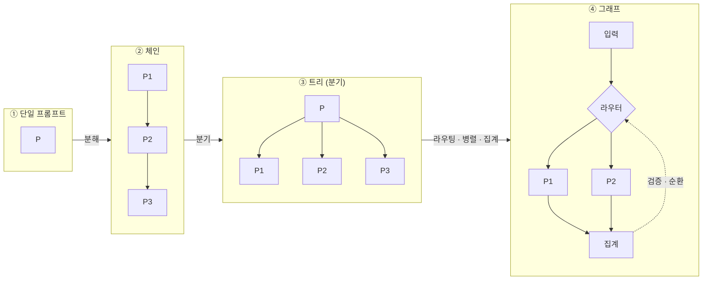

<figure class="post-figure post-figure--header">
<svg role="img" aria-label="단일 문자열 프롬프트가 구조를 가진 계산 그래프로 승격되는 장면. 왼쪽에는 '하나의 문자열'이라 적힌 납작한 프롬프트 알약 하나가 홀로 놓여 있다. 가운데의 굵은 화살표와 '승격' 글자가 그것을 오른쪽의 그래프로 밀어 넣는다. 오른쪽에는 입력 노드에서 시작해 R이라 표시된 라우터 마름모로 들어가고, 거기서 P1·P2·P3 세 개의 프롬프트 노드로 병렬로 갈라진 뒤, 다시 A라 표시된 집계 노드로 모여 출력으로 나가는 계산 그래프가 그려져 있다. 집계 노드에서 라우터로 되돌아가는 점선 화살표는 검증과 순환을 나타낸다. 각 구간에는 라우팅·병렬·집계·검증·순환이라는 이름이 붙어 있다." viewBox="0 0 680 300" xmlns="http://www.w3.org/2000/svg">
  <title>단일 문자열 프롬프트 → 라우팅·병렬·집계·검증·순환을 가진 계산 그래프</title>
  <defs>
    <marker id="pg-head" markerWidth="9" markerHeight="9" refX="7" refY="3" orient="auto">
      <path d="M0 0 L7 3 L0 6 z" fill="currentColor"/>
    </marker>
    <marker id="pg-head-accent" markerWidth="9" markerHeight="9" refX="7" refY="3" orient="auto">
      <path d="M0 0 L7 3 L0 6 z" fill="var(--accent-color)"/>
    </marker>
  </defs>

  <!-- ===== LEFT: a single string ===== -->
  <text x="86" y="96" text-anchor="middle" font-size="12" fill="currentColor" font-weight="700" opacity="0.75">하나의 문자열</text>
  <rect x="26" y="120" width="120" height="34" rx="17" fill="var(--bg-light)" stroke="currentColor" stroke-width="1.8" opacity="0.9"/>
  <text x="86" y="142" text-anchor="middle" font-size="12" fill="currentColor" opacity="0.85">"prompt"</text>
  <text x="86" y="184" text-anchor="middle" font-size="10" fill="currentColor" opacity="0.55">구조 없음</text>

  <!-- ===== CENTER: promotion arrow ===== -->
  <text x="205" y="126" text-anchor="middle" font-size="11" fill="var(--accent-color)" font-weight="700">승격</text>
  <line x1="158" y1="137" x2="250" y2="137" stroke="var(--accent-color)" stroke-width="2.4" marker-end="url(#pg-head-accent)"/>

  <!-- ===== RIGHT: the graph ===== -->
  <!-- edges (draw first, under nodes) -->
  <!-- input -> router -->
  <line x1="300" y1="137" x2="336" y2="137" stroke="currentColor" stroke-width="1.8" opacity="0.8" marker-end="url(#pg-head)"/>
  <!-- router -> P1/P2/P3 (routing + parallel) -->
  <line x1="392" y1="137" x2="446" y2="60"  stroke="currentColor" stroke-width="1.6" opacity="0.8" marker-end="url(#pg-head)"/>
  <line x1="392" y1="137" x2="446" y2="137" stroke="currentColor" stroke-width="1.6" opacity="0.8" marker-end="url(#pg-head)"/>
  <line x1="392" y1="137" x2="446" y2="214" stroke="currentColor" stroke-width="1.6" opacity="0.8" marker-end="url(#pg-head)"/>
  <!-- P1/P2/P3 -> A (aggregate) -->
  <line x1="492" y1="60"  x2="556" y2="128" stroke="currentColor" stroke-width="1.6" opacity="0.8" marker-end="url(#pg-head)"/>
  <line x1="502" y1="137" x2="556" y2="137" stroke="currentColor" stroke-width="1.6" opacity="0.8" marker-end="url(#pg-head)"/>
  <line x1="492" y1="214" x2="556" y2="146" stroke="currentColor" stroke-width="1.6" opacity="0.8" marker-end="url(#pg-head)"/>
  <!-- A -> out -->
  <line x1="600" y1="137" x2="648" y2="137" stroke="currentColor" stroke-width="1.8" opacity="0.8" marker-end="url(#pg-head)"/>
  <!-- verify / cycle: A back to router (dashed) -->
  <path d="M578 162 q-6 78 -114 78 q-108 0 -114 -78" fill="none" stroke="var(--secondary-color)" stroke-width="1.8" stroke-dasharray="5 4" marker-end="url(#pg-head)"/>

  <!-- nodes -->
  <!-- input -->
  <circle cx="286" cy="137" r="15" fill="var(--bg-panel)" stroke="currentColor" stroke-width="1.8"/>
  <text x="286" y="141" text-anchor="middle" font-size="9" fill="currentColor" opacity="0.85">입력</text>
  <!-- router diamond -->
  <polygon points="364,113 392,137 364,161 336,137" fill="var(--bg-light)" stroke="var(--accent-color)" stroke-width="2"/>
  <text x="364" y="141" text-anchor="middle" font-size="12" fill="currentColor" font-weight="700">R</text>
  <!-- P1 P2 P3 -->
  <circle cx="470" cy="60" r="18" fill="var(--bg-panel)" stroke="currentColor" stroke-width="1.8"/>
  <text x="470" y="65" text-anchor="middle" font-size="12" fill="currentColor" font-weight="700">P1</text>
  <circle cx="470" cy="137" r="18" fill="var(--bg-panel)" stroke="currentColor" stroke-width="1.8"/>
  <text x="470" y="142" text-anchor="middle" font-size="12" fill="currentColor" font-weight="700">P2</text>
  <circle cx="470" cy="214" r="18" fill="var(--bg-panel)" stroke="currentColor" stroke-width="1.8"/>
  <text x="470" y="219" text-anchor="middle" font-size="12" fill="currentColor" font-weight="700">P3</text>
  <!-- aggregator -->
  <circle cx="578" cy="137" r="18" fill="var(--bg-light)" stroke="var(--secondary-color)" stroke-width="2.2"/>
  <text x="578" y="142" text-anchor="middle" font-size="12" fill="currentColor" font-weight="700">A</text>

  <!-- labels -->
  <text x="352" y="98"  text-anchor="middle" font-size="9.5" fill="var(--accent-color)" font-weight="700">라우팅</text>
  <text x="470" y="255" text-anchor="middle" font-size="9.5" fill="currentColor" opacity="0.7" font-weight="700">병렬 · 프롬프트 노드</text>
  <text x="600" y="98"  text-anchor="middle" font-size="9.5" fill="var(--secondary-color)" font-weight="700">집계</text>
  <text x="464" y="285" text-anchor="middle" font-size="9.5" fill="var(--secondary-color)" font-weight="700" opacity="0.9">검증 · 순환</text>
</svg>
<figcaption>프롬프트 그래프 — 하나의 문자열이 라우팅(R)·병렬(P1·P2·P3)·집계(A)·검증·순환을 가진 계산 그래프로 승격된다.</figcaption>
</figure>

## 원문 정보

> - **제목**: *What makes prompts a graph: necessary and sufficient conditions for prompt graph engineering*
> - **출처**: Sandeco Macedo (Sanderson Oliveira de Macedo), Federal Institute of Goiás (브라질) · arXiv:2607.27578v1 [cs.AI]
> - **발행**: 2026-07-30 (표기일 July 31, 2026) · 본문 14쪽, 약 30분 분량
> - **원문 링크**: <https://arxiv.org/abs/2607.27578>

이 위키 자체가 Claude Code 서브에이전트(`article-manager`·`post-illustrator` 등)로 굴러가고 `/pages/graph.html` 지식 그래프를 갖고 있는데, 이 논문은 바로 그 "Claude Code 서브에이전트"를 자기 정의의 **의도적 반례**로 배제한다. 우리가 매일 쓰는 도구가 왜 '프롬프트 그래프'가 아닌지를 정확히 짚어 주기에 Articles에 담는다.

## 한 줄 요약 (TL;DR)

프롬프트는 더 이상 하나의 문자열이 아니라 검색→계획→라우팅→병렬 호출→집계→검증으로 여러 모델 호출을 엮는 **그래프**다. 이 논문은 새 프레임워크를 제안하지 않고, 실무가 이미 매일 하면서도 정확히 명명하지 못한 그 규율 — **prompt graph engineering(PGE)** — 을 4개 조건(G1–G4)으로 정의하고, 후보를 넣고 뺄 수 있는 4개 판정 테스트(T1–T4)로 만든다.

이 논문 전체를 관통하는 척추는 "프롬프트가 어떻게 문자열에서 그래프로 자랐는가"다. Figure 2의 4단계 진화를 한눈에 보면 이렇다.

## 왜 이 글을 골랐나

이 논문의 가치는 "이미 알던 것에 이름을 붙였다"는 데 있다. 저자 스스로 밝히듯 이 글은 **정의적(definitional)** 논문이다 — 벤치마크도, 새 시스템도 없다. 대신 산업이 매일 실천하지만 어휘가 뒤처져 뒤죽박죽 부르던 대상에 "공유 어휘 + 재현 가능한 판정 테스트"를 준다.

세 가지 이유로 이 위키 맥락과 정확히 맞물린다.

1. **저자의 인접 연구 라인이 우리가 다뤄 온 스택 그 자체다.** 같은 저자가 쓴 *What makes a harness a harness*(하니스의 필요충분조건, [7])와 *loop engineering*([32])이 있고, 이 논문은 그 위계에서 한 층을 맡는다: **프롬프트 → 컨텍스트 → 하니스 → 루프** 스택에서 PGE는 "루프가 바깥에서 에이전트를 몰 때, 안쪽에서 호출 합성을 구조화하는 그래프" 층이다. 우리가 [Loop Engineering](/2026/06/19/loop-engineering.html)과 [Graph Engineering](/2026/07/19/graph-engineering.html)에서 실무 관점으로 다룬 것을, 이 논문은 학술적 정의로 못 박는다.
2. **우리가 쓰는 Claude Code 서브에이전트가 반례다.** 논문은 이 하니스를 "PGE가 아님"으로 **의도적으로 배제한다** — 위임이 창발적이기 때문이다. 왜 우리 도구가 '프롬프트 그래프'가 아닌지 알면, 그것이 무엇인지도 선명해진다.
3. **바로 어제 쓴 리팩터링 포스트와 연결된다.** 이 논문 RQ5의 '등가(equivalence)' 문제 — "두 프롬프트 그래프가 언제 같은 프로그램인가, 분포적으로 동작을 보존하는 리팩터링은 무엇인가" — 는 [리팩터링의 경제적 이점](/2026/08/03/refactoring-economic-benefit.html)이 다룬 '동작 보존 정리'와 정확히 같은 질문의 LLM 버전이다.

## 핵심 내용

논문은 순서를 거꾸로 간다. 먼저 **계보**로 이 개념이 어디서 왔는지 복원하고, 그다음 **4조건**으로 정의하고, **판정 테스트**로 도구화한 뒤, **6개 이웃 개념**과 경계를 긋고, **실제 6개 시스템**에 적용하고, **4개 긴장 축**의 연구 어젠다로 닫는다. 5개 연구질문(RQ1 계보 · RQ2 구성적 정의 · RQ3 경계 · RQ4 적용 · RQ5 어젠다)이 이 구조를 지탱한다.

### 계보: 그래프-as-계산은 프롬프트보다 반세기 앞선다 (RQ1)

"계산을 그래프로 그린다"는 발상은 프롬프트보다 반세기 오래됐다. Dataflow(1974, Dennis) → Make(1979, Feldman) → 과학 워크플로(2009)로 이어지는 전통에서 그래프는 세 가지를 했다: **오케스트레이션을 계산에서 분리**하고, **의존성을 명시**해 독립 작업을 병렬화하고, 실행 전 검사·실패 후 점검이 가능한 **아티팩트**가 됐다.

프롬프트는 이 모든 것과 무관하게 시작했다 — 단일 문자열, few-shot 예시. 첫 균열은 **분해(decomposition)**였다. least-to-most, decomposed prompting이 한 과제를 여러 호출로 쪼개자 "어느 호출이 어느 호출을 먹이는가"를 말해야 했고, 아무도 그리지 않았어도 **구조가 도착했다**. 이후 두 계보로 갈라진다.

- **모델의 추론 안쪽**: Chain-of-Thought → Self-Consistency → Tree-of-Thoughts → Graph-of-Thoughts. 여기서 그래프는 "모델이 생각하는 것"을 서술하고, 노드는 모델이 생성한 thought다.
- **엔지니어의 손**: AI Chains → PromptChainer(시각 에디터) → Language Model Cascades(확률 프로그램) → DSPy·LMQL·PDL·SGLang·LLMCompiler → 에이전트 물결(MetaGPT·StateFlow·Flows) → 그래프를 탐색·최적화하는 GPTSwarm·ADAS·AFlow. 제품도 합류했다 — LangGraph는 상태 그래프를, Prompt Flow는 DAG를 중심 API로 노출한다.

여기서 저자의 예리한 관찰: **실천은 chaining에서 연속적으로 자랐지만, "graph"라는 단어는 2023년 Graph-of-Thoughts에서 공유 어휘로 진입한 뒤 몇 달 만에 엔지니어링 쪽이 전유했다.** 단어의 주인이 수학 → 추론 위상 → 엔지니어링 아티팩트로 바뀐 것이다. 이 어휘 지체가 논문이 푸는 문제다: "graph"는 최소 3가지(사고 위상 / 멀티에이전트 대화 / 오케스트레이션 아티팩트)를 뒤섞어 가리키고, "prompt engineering"은 여전히 좋은 문자열 하나 쓰기를 연상시킨다.

### 4개 조건 (G1–G4): 구성적 정의 (RQ2)

논문의 심장. 저자는 PGE를 예시가 아니라 **조건으로** 정의한다.

> 프롬프트 그래프 엔지니어링은 프롬프트 매개 LLM 계산을 명시적 그래프로 **표현·구성·실행**하는 규율이다. 이때 (i) 노드는 저작된(authored) 계산 단위 — 프롬프트로 파라미터화된 모델 호출이나 결정적 변환 — 이고, 엣지는 그들 사이의 데이터/제어 의존성이며, (ii) 그래프의 구조가 노드의 프롬프트 내용과 분리되어 서로를 다시 쓰지 않고 독립적으로 바뀔 수 있고, (iii) 그래프는 노드를 스케줄링·출력 라우팅·공유 상태 관리(분기·병렬·순환 포함)하는 실행 의미를 가지며, (iv) 그래프는 특정 실행과 독립적으로 검사·버전관리·검증·최적화할 수 있는 일급 엔지니어링 아티팩트다.

이를 네 조건으로 부른다.

- **G1 — 명시적 구조(explicit structure)**: 노드 = 저작된 계산 단위, 엣지 = 데이터/제어 의존성. dataflow 전통을 상속한다.
- **G2 — 구조/내용 분리(separation of structure and content)**: 구조와 프롬프트 내용이 서로를 다시 쓰지 않고 독립적으로 바뀔 수 있다. DSPy가 이를 급진화했다 — 고정된 프로그램 구조에 대해 프롬프트 텍스트를 **컴파일**한다.
- **G3 — 실행 의미(executable semantics)**: 런타임이 노드를 스케줄링하고 출력을 라우팅하며 공유 상태를 관리한다(분기·병렬·순환 포함). 이것이 "돌아가지 않는 아키텍처 다이어그램"과 "프로그램"을 가르는 조건이다.
- **G4 — 일급 아티팩트(first-class artifact)**: 특정 실행과 독립적으로 검사·버전관리·검증·최적화할 수 있는 객체. 최적화 계보(검색·미분·리팩터링) 전체가 이 객체의 존재를 전제한다.

핵심 논증은 **각 조건이 필요하다는 것**이다. 하나씩 빼 보면 왜인지 드러난다: G1을 빼면 흐름이 코드 경로나 대화 턴으로 후퇴해 스크립트 쓰기로 붕괴하고, G2를 빼면 구조 변경이 프롬프트 재작성을 강제해 재사용·컴파일이 불가능해지며, G3을 빼면 그저 그림이고, G4를 빼면 그래프가 런타임 트레이스로만 존재해 최적화 계보 전체를 잃는다. 그리고 넷은 **함께 충분**하다. 저자는 못을 박는다 — **다섯 번째 조건은 없다.** 관측성·캐싱·비용 제어·human-in-the-loop 노드은 모두 이 넷의 특수화일 뿐이다.

<figure class="post-figure">
<svg role="img" aria-label="중앙의 PROMPT GRAPH를 네 개의 조건이 둘러싼 해부도. 가운데에 PROMPT GRAPH라 적힌 핵심 상자가 있고, 네 모서리에서 각 조건 카드가 중앙으로 선을 뻗는다. 왼쪽 위 G1은 명시적 구조로 노드는 저작된 계산 단위, 엣지는 의존성이다. 오른쪽 위 G2는 구조와 내용의 분리로 구조와 프롬프트 내용이 서로를 다시 쓰지 않고 독립적으로 바뀐다. 왼쪽 아래 G3은 실행 의미로 런타임이 스케줄링·라우팅·상태를 관리하며 분기·병렬·순환을 포함한다. 오른쪽 아래 G4는 일급 아티팩트로 특정 실행과 독립적으로 검사·버전관리·검증·최적화된다. 네 조건은 각각 필요하고 함께 충분하며, 다섯 번째 조건은 없다고 적혀 있다." viewBox="0 0 680 360" xmlns="http://www.w3.org/2000/svg">
  <title>프롬프트 그래프 엔지니어링의 해부 — G1·G2·G3·G4</title>

  <!-- connector lines (center to each anchor) -->
  <line x1="270" y1="150" x2="180" y2="66"  stroke="currentColor" stroke-width="1.6" opacity="0.5"/>
  <line x1="410" y1="150" x2="500" y2="66"  stroke="currentColor" stroke-width="1.6" opacity="0.5"/>
  <line x1="270" y1="210" x2="180" y2="294" stroke="currentColor" stroke-width="1.6" opacity="0.5"/>
  <line x1="410" y1="210" x2="500" y2="294" stroke="currentColor" stroke-width="1.6" opacity="0.5"/>

  <!-- center -->
  <rect x="270" y="150" width="140" height="60" rx="6" fill="var(--bg-light)" stroke="var(--accent-color)" stroke-width="2.4"/>
  <text x="340" y="176" text-anchor="middle" font-size="13" fill="currentColor" font-weight="700">PROMPT</text>
  <text x="340" y="194" text-anchor="middle" font-size="13" fill="currentColor" font-weight="700">GRAPH</text>

  <!-- G1 top-left -->
  <rect x="34" y="34" width="252" height="64" rx="5" fill="var(--bg-panel)" stroke="currentColor" stroke-width="1.8"/>
  <text x="48" y="56" font-size="12" fill="var(--secondary-color)" font-weight="700">G1 · 명시적 구조</text>
  <text x="48" y="74" font-size="10" fill="currentColor" opacity="0.82">노드 = 저작된 계산 단위</text>
  <text x="48" y="89" font-size="10" fill="currentColor" opacity="0.82">엣지 = 데이터/제어 의존성</text>

  <!-- G2 top-right -->
  <rect x="394" y="34" width="252" height="64" rx="5" fill="var(--bg-panel)" stroke="currentColor" stroke-width="1.8"/>
  <text x="408" y="56" font-size="12" fill="var(--secondary-color)" font-weight="700">G2 · 구조/내용 분리</text>
  <text x="408" y="74" font-size="10" fill="currentColor" opacity="0.82">구조와 프롬프트 내용이</text>
  <text x="408" y="89" font-size="10" fill="currentColor" opacity="0.82">독립적으로 변경 (DSPy 컴파일)</text>

  <!-- G3 bottom-left -->
  <rect x="34" y="262" width="252" height="64" rx="5" fill="var(--bg-panel)" stroke="currentColor" stroke-width="1.8"/>
  <text x="48" y="284" font-size="12" fill="var(--secondary-color)" font-weight="700">G3 · 실행 의미</text>
  <text x="48" y="302" font-size="10" fill="currentColor" opacity="0.82">런타임이 스케줄·라우팅·상태</text>
  <text x="48" y="317" font-size="10" fill="currentColor" opacity="0.82">관리 (분기·병렬·순환)</text>

  <!-- G4 bottom-right -->
  <rect x="394" y="262" width="252" height="64" rx="5" fill="var(--bg-panel)" stroke="currentColor" stroke-width="1.8"/>
  <text x="408" y="284" font-size="12" fill="var(--secondary-color)" font-weight="700">G4 · 일급 아티팩트</text>
  <text x="408" y="302" font-size="10" fill="currentColor" opacity="0.82">실행 밖에서 검사·버전관리</text>
  <text x="408" y="317" font-size="10" fill="currentColor" opacity="0.82">·검증·최적화되는 객체</text>

  <text x="340" y="240" text-anchor="middle" font-size="10" fill="var(--accent-color)" font-weight="700" opacity="0.9">각각 필요 · 함께 충분 · 다섯 번째 조건은 없다</text>
</svg>
<figcaption>PGE의 해부 — 네 조건(G1–G4)이 중앙의 프롬프트 그래프를 규정한다. 하나라도 빠지면 스크립트·다이어그램·창발적 대화로 붕괴한다.</figcaption>
</figure>

### 판정 테스트 (T1–T4): 정의를 도구로 (RQ2)

정의는 판정 절차가 될 때 도구가 된다. 후보 실천/시스템에 순서대로 물어 넷 다 yes면 PGE다.

| 테스트 | 질문 | no이면 → |
| --- | --- | --- |
| **T1** | 프롬프트 단위가 노드, 의존성이 엣지인 표현이 있고, 시스템을 실행하지 않고도 열거 가능한가? | 모놀리식 프롬프트 · 불투명 스크립트 · 창발적 대화 |
| **T2** | 구조와 프롬프트 내용이 서로 독립적으로 바뀔 수 있나? | 용접된 체인 · 모델이 저작한 노드 |
| **T3** | 런타임이 스케줄링·라우팅·상태로 그래프를 실행하나? | 돌아가지 않는 아키텍처 다이어그램 |
| **T4** | 그래프가 단일 실행 너머의 객체로 검사·개선 가능한가? | 휘발성 트레이스 |

저자는 두 가지 오독을 미리 막는다.

- **멤버십은 이진, 품질은 점진적.** 3노드짜리 YAML 그래프도 넷을 통과하면 (미숙할지언정) 정당한 PGE 인스턴스다. 옵티마이저가 붙은 컴파일 DSPy와의 차이는 **멤버십이 아니라 성숙도**(특히 G4)다. "테스트는 *whether*를 판정하고, 앵커 조건은 *how developed*를 잰다. 이 둘을 뒤섞는 데서 대부분의 용어 소음이 나온다."
- **T1은 복수성 이상을, T3은 순차 이상을 요구한다.** 문자열 두 개를 접합한 2호출은 정신적으론 체인이지만 명시적 표현은 아니다(T1 실패). T3은 "그래프가 다음에 무엇을 실행할지 결정"할 것을 요구하지만, 동적 그래프도 구성 규칙이 명시적이면 통과한다(LLMCompiler처럼 태스크마다 DAG를 만드는 시스템도 OK).

### 경계: 6개 이웃, 각자 실패하는 조건 (RQ3)

정의는 가장자리에서 자기를 증명한다. 각 이웃 개념이 **어느 조건에서 걸리는지**를 이름 붙인다.

- **고전적 프롬프트 엔지니어링** → **T1 실패**. 프롬프트 하나엔 구조가 없다. 관계는 경쟁이 아니라 **포함(containment)**: 그래프의 모든 노드는 좋은 프롬프트 엔지니어링을 받을 자격이 있다. *"그래프는 문구를 무의미하게 만들지 않는다. 국소적(local)으로 만든다."*
- **사고 위상(CoT/ToT/GoT)** → **T2 실패**. 노드가 엔지니어가 저작한 프롬프트가 아니라 **모델이 생성한 thought**다. 내용이 곧 모델 출력이라 구조와 내용이 독립적으로 못 바뀐다. 경계선은 **저작권(authorship)**: PGE는 엔지니어가 노드를 소유하고, 사고 위상은 모델이 소유한다. (사고 전략은 프롬프트 그래프의 한 노드 *안에* 감쌀 수 있다.)
- **에이전트 오케스트레이션** → 자유 대화 멀티에이전트는 **T1 실패**(상호작용 형태가 턴마다 창발). 흐름이 reify될 때 — MetaGPT의 절차, StateFlow의 상태기계, Flows의 합성 추상 — 만 경계를 넘는다. 입도도 다르다: 오케스트레이션은 에이전트(목표·메모리·도구)를 합성하고, PGE는 더 세밀한 프롬프트 파라미터화 호출을 합성한다.
- **프롬프트 프로그래밍(LMQL·PDL·DSP·DSPy)** → 배제 대상이 아니라 개념의 **코드 형태**. DSPy는 네 테스트를 다 통과한다: 모듈=노드(T1), 시그니처가 구조/텍스트를 분리하고 컴파일러가 텍스트를 생성(T2 급진화), 실행=모듈 합성 해석(T3), 프로그램=옵티마이저가 소비하는 아티팩트(T4). 정의가 **문법이 아니라 구조**에 관한 것임을 보여 준다.
- **RAG 파이프라인** → 부분 사례. 애플리케이션 코드에 하드와이어된 고정 retrieve→generate는 **T1 실패**. 프레임워크 객체로 선언되면(2~3노드) 퇴화적으로 T1을 통과하나 보통 T4(·T2)에서 걸린다. 그러나 **적응형 RAG(그래프 런타임 위에서 도는)**는 흐름이 명시적 그래프로 들어올려질 때 정확히 PGE가 된다.
- **고전 워크플로 엔진(Make·dataflow·과학 워크플로)** → 자기 노드 종류로는 T1~T4를 다 통과하지만 정의의 **객체 절(object clause)**을 놓친다 — 노드가 프롬프트 파라미터화 모델 호출이 아니다. 그 노드는 확률적 출력, 자연어 파라미터화, 호출당 비용/지연을 갖고, exit code로 정확성을 판정할 수 없다.

이를 **유(genus) + 종차(differentia)**로 정리한다. **유** = dataflow 전통(명시적·실행가능·일급 그래프), **종차** = 노드(저작된 프롬프트 파라미터화 모델 호출). 그래서: 사고 위상 = 저작권 없는 그래프, 자유 대화 = 구조 없는 프롬프트, 고전 엔진 = 프롬프트 없는 구조, 단일 프롬프트 = 둘 다 없음. PGE는 워크플로 엔지니어링을 새 노드 타입에 그대로 적용한 게 아니라, **그래프 규율을 상속하고 새 노드 의미가 요구하는 규율을 더한 것**이다(의미적 등가를 따지는 캐싱, 텍스트를 판정하는 검증, 플래그가 아니라 프롬프트를 다시 쓰는 최적화).

### 적용: 실제 6개 시스템 판정 (RQ4)

"종이 위에서만 되는 정의는 슬로건이다." 저자는 T1~T4를 실제 6개 시스템에 적용한다(2026년 7월 문헌 스냅샷 기준).

| 시스템 | T1 | T2 | T3 | T4 | 판정 |
| --- | :-: | :-: | :-: | :-: | --- |
| **LangGraph** | ✓ | ✓ | ✓ | ✓ | 포함. G3(상태·순환·human-in-the-loop 인터럽트)에서 가장 강함 |
| **DSPy** | ✓ | ✓ | ✓ | ✓ | 포함. G4(아티팩트·최적화)에서 여섯 중 가장 강함 — 캔버스 불필요, 그래프가 코드 안에 삶 |
| **Prompt Flow** | ✓ | ✓ | ✓ | ✓ | 포함. 가장 문자 그대로의 DAG. 네이티브 순환 없어 G3(reflective 패턴) 약함 |
| **AutoGen** | 부분 | ✓ | 부분 | 부분 | GraphFlow 모드는 포함, 대화 모드는 T1(+T4) 실패 |
| **CrewAI** | 부분 | ✓ | 부분 | 부분 | Flows는 포함, crew delegation은 창발 → 배제 |
| **Claude Code 서브에이전트** | ✗ | 부분 | ✗ | ✗ | **배제** — 저작된 노드는 있으나 흐름이 런타임에 창발 |

**Claude Code 서브에이전트가 의도적 반례**다. 하니스는 오케스트레이팅 에이전트에게 저작된 서브에이전트(프롬프트 파라미터화 단위)에게 위임한다 — 서브에이전트 정의가 파일로 저작되므로 T2의 정신은 만족한다. 그러나 *언제·무엇을·누구에게* 위임할지는 런타임에 오케스트레이터 모델이 턴마다 결정한다. 그래서 어떤 표현도 흐름을 미리 열거하지 못하고(T1 실패), 런타임은 그래프가 아니라 도구 호출을 실행하며(T3 실패), 남는 건 트레이스뿐(T4 실패)이다. 위임 위상은 실재하지만 **창발적**이라 멀티에이전트 자유 대화에 더 가깝다.

저자의 태도가 중요하다: *"배제는 흠이 아니다. 하니스는 다른 문제를 푼다. 그것을 포함시킨 정의였다면 개념을 녹여 버렸을 것이다."* 연구 프론티어(GPTSwarm·AFlow·ADAS·LLMCompiler)는 테스트를 최대로 통과하고 — 그래프를 연구 대상으로 다룬다 — 반대 극단의 일상 반례도 예상대로 실패한다(2 API 접합 스크립트 = T1·T4 실패, 서베이의 아키텍처 다이어그램 = T3 실패). 한계도 정직하게 밝힌다: 단일 분석가의 분류라 inter-rater 합의가 미검증이고, 제품 분류는 회색 문헌 기반의 날짜 스냅샷이다.

<figure class="post-figure">
<svg role="img" aria-label="6개 시스템을 T1부터 T4까지 네 판정 테스트로 매긴 매트릭스. 열은 T1 표현, T2 분리, T3 실행, T4 아티팩트이고, 채운 원은 통과, 반만 채운 원은 부분, 빈 원과 가위표는 실패를 뜻한다. LangGraph·DSPy·Prompt Flow 세 시스템은 네 테스트를 모두 통과해 포함이다. AutoGen과 CrewAI는 T2만 통과하고 T1·T3·T4는 부분으로, 모드에 따라 갈린다. 맨 아래 Claude Code 서브에이전트는 T2만 부분이고 T1·T3·T4가 모두 실패라 유일하게 배제된다." viewBox="0 0 680 360" xmlns="http://www.w3.org/2000/svg">
  <title>6개 시스템 × T1–T4 판정 매트릭스</title>

  <!-- Claude Code row highlight -->
  <rect x="14" y="268" width="652" height="40" rx="4" fill="var(--accent-color)" opacity="0.1"/>

  <!-- column headers -->
  <text x="300" y="36" text-anchor="middle" font-size="12" fill="currentColor" font-weight="700">T1</text>
  <text x="300" y="50" text-anchor="middle" font-size="9"  fill="currentColor" opacity="0.65">표현</text>
  <text x="372" y="36" text-anchor="middle" font-size="12" fill="currentColor" font-weight="700">T2</text>
  <text x="372" y="50" text-anchor="middle" font-size="9"  fill="currentColor" opacity="0.65">분리</text>
  <text x="444" y="36" text-anchor="middle" font-size="12" fill="currentColor" font-weight="700">T3</text>
  <text x="444" y="50" text-anchor="middle" font-size="9"  fill="currentColor" opacity="0.65">실행</text>
  <text x="516" y="36" text-anchor="middle" font-size="12" fill="currentColor" font-weight="700">T4</text>
  <text x="516" y="50" text-anchor="middle" font-size="9"  fill="currentColor" opacity="0.65">아티팩트</text>
  <text x="600" y="36" text-anchor="middle" font-size="11" fill="currentColor" font-weight="700" opacity="0.8">판정</text>
  <line x1="14" y1="60" x2="666" y2="60" stroke="currentColor" stroke-width="1.4" opacity="0.4"/>

  <!-- Row 1: LangGraph  ● ● ● ●  포함 -->
  <text x="20" y="92" font-size="11" fill="currentColor" font-weight="700">LangGraph</text>
  <circle cx="300" cy="88" r="9" fill="var(--secondary-color)"/>
  <circle cx="372" cy="88" r="9" fill="var(--secondary-color)"/>
  <circle cx="444" cy="88" r="9" fill="var(--secondary-color)"/>
  <circle cx="516" cy="88" r="9" fill="var(--secondary-color)"/>
  <text x="600" y="92" text-anchor="middle" font-size="10" fill="var(--secondary-color)" font-weight="700">포함</text>

  <!-- Row 2: DSPy  ● ● ● ●  포함 -->
  <text x="20" y="132" font-size="11" fill="currentColor" font-weight="700">DSPy</text>
  <circle cx="300" cy="128" r="9" fill="var(--secondary-color)"/>
  <circle cx="372" cy="128" r="9" fill="var(--secondary-color)"/>
  <circle cx="444" cy="128" r="9" fill="var(--secondary-color)"/>
  <circle cx="516" cy="128" r="9" fill="var(--secondary-color)"/>
  <text x="600" y="132" text-anchor="middle" font-size="10" fill="var(--secondary-color)" font-weight="700">포함</text>

  <!-- Row 3: Prompt Flow  ● ● ● ●  포함 -->
  <text x="20" y="172" font-size="11" fill="currentColor" font-weight="700">Prompt Flow</text>
  <circle cx="300" cy="168" r="9" fill="var(--secondary-color)"/>
  <circle cx="372" cy="168" r="9" fill="var(--secondary-color)"/>
  <circle cx="444" cy="168" r="9" fill="var(--secondary-color)"/>
  <circle cx="516" cy="168" r="9" fill="var(--secondary-color)"/>
  <text x="600" y="172" text-anchor="middle" font-size="10" fill="var(--secondary-color)" font-weight="700">포함</text>

  <!-- Row 4: AutoGen  ◐ ● ◐ ◐  모드별 -->
  <text x="20" y="212" font-size="11" fill="currentColor" font-weight="700">AutoGen</text>
  <circle cx="300" cy="208" r="9" fill="none" stroke="var(--secondary-color)" stroke-width="1.8"/><path d="M300 199 A9 9 0 0 0 300 217 Z" fill="var(--secondary-color)"/>
  <circle cx="372" cy="208" r="9" fill="var(--secondary-color)"/>
  <circle cx="444" cy="208" r="9" fill="none" stroke="var(--secondary-color)" stroke-width="1.8"/><path d="M444 199 A9 9 0 0 0 444 217 Z" fill="var(--secondary-color)"/>
  <circle cx="516" cy="208" r="9" fill="none" stroke="var(--secondary-color)" stroke-width="1.8"/><path d="M516 199 A9 9 0 0 0 516 217 Z" fill="var(--secondary-color)"/>
  <text x="600" y="212" text-anchor="middle" font-size="10" fill="currentColor" font-weight="700" opacity="0.85">모드별</text>

  <!-- Row 5: CrewAI  ◐ ● ◐ ◐  모드별 -->
  <text x="20" y="252" font-size="11" fill="currentColor" font-weight="700">CrewAI</text>
  <circle cx="300" cy="248" r="9" fill="none" stroke="var(--secondary-color)" stroke-width="1.8"/><path d="M300 239 A9 9 0 0 0 300 257 Z" fill="var(--secondary-color)"/>
  <circle cx="372" cy="248" r="9" fill="var(--secondary-color)"/>
  <circle cx="444" cy="248" r="9" fill="none" stroke="var(--secondary-color)" stroke-width="1.8"/><path d="M444 239 A9 9 0 0 0 444 257 Z" fill="var(--secondary-color)"/>
  <circle cx="516" cy="248" r="9" fill="none" stroke="var(--secondary-color)" stroke-width="1.8"/><path d="M516 239 A9 9 0 0 0 516 257 Z" fill="var(--secondary-color)"/>
  <text x="600" y="252" text-anchor="middle" font-size="10" fill="currentColor" font-weight="700" opacity="0.85">모드별</text>

  <!-- Row 6: Claude Code 서브에이전트  ✗ ◐ ✗ ✗  배제 -->
  <text x="20" y="292" font-size="11" fill="currentColor" font-weight="700">Claude Code 서브에이전트</text>
  <circle cx="300" cy="288" r="9" fill="none" stroke="currentColor" stroke-width="1.4" opacity="0.4"/><text x="300" y="293" text-anchor="middle" font-size="14" fill="var(--accent-color)" font-weight="700">×</text>
  <circle cx="372" cy="288" r="9" fill="none" stroke="var(--secondary-color)" stroke-width="1.8"/><path d="M372 279 A9 9 0 0 0 372 297 Z" fill="var(--secondary-color)"/>
  <circle cx="444" cy="288" r="9" fill="none" stroke="currentColor" stroke-width="1.4" opacity="0.4"/><text x="444" y="293" text-anchor="middle" font-size="14" fill="var(--accent-color)" font-weight="700">×</text>
  <circle cx="516" cy="288" r="9" fill="none" stroke="currentColor" stroke-width="1.4" opacity="0.4"/><text x="516" y="293" text-anchor="middle" font-size="14" fill="var(--accent-color)" font-weight="700">×</text>
  <text x="600" y="292" text-anchor="middle" font-size="10" fill="var(--accent-color)" font-weight="700">배제</text>

  <!-- legend -->
  <line x1="14" y1="322" x2="666" y2="322" stroke="currentColor" stroke-width="1" opacity="0.3"/>
  <circle cx="30" cy="344" r="7" fill="var(--secondary-color)"/>
  <text x="44" y="348" font-size="10" fill="currentColor" opacity="0.8">통과</text>
  <circle cx="120" cy="344" r="7" fill="none" stroke="var(--secondary-color)" stroke-width="1.6"/><path d="M120 337 A7 7 0 0 0 120 351 Z" fill="var(--secondary-color)"/>
  <text x="134" y="348" font-size="10" fill="currentColor" opacity="0.8">부분</text>
  <circle cx="224" cy="344" r="7" fill="none" stroke="currentColor" stroke-width="1.4" opacity="0.4"/><text x="224" y="349" text-anchor="middle" font-size="11" fill="var(--accent-color)" font-weight="700">×</text>
  <text x="238" y="348" font-size="10" fill="currentColor" opacity="0.8">실패</text>
</svg>
<figcaption>T1–T4 적용 (2026년 7월 스냅샷) — LangGraph·DSPy·Prompt Flow는 클린 통과, AutoGen·CrewAI는 모드별로 갈리고, Claude Code 서브에이전트만 유일하게 배제된다.</figcaption>
</figure>

### 연구 어젠다: 4개 긴장 축 (RQ5)

테스트를 적용하자 시스템들이 **어디서 서로 다른지**가 드러났고, 그 불일치가 열린 설계 질문이 된다.

1. **명시적 ↔ 창발적 구조.** 창발은 적응성을 사지만, 명시성은 검사·검증·최적화를 산다. 열린 질문: 창발 흐름을 기록해 명시적 그래프로 들어올려 재생·정제할 수 있나(창발을 발견 모드로)? **아직 trace → 버전화·최적화 그래프 루프를 닫은 시스템은 없다.**
2. **정적 ↔ 동적 구조.** Prompt Flow(실행 전 고정) ↔ LLMCompiler(태스크마다 그래프 생성) ↔ 사고 위상(문제마다 재구성). "정적 골격 + 동적 인스턴스화" 영역의 계약이 거의 미탐구다.
3. **프롬프트 입도 ↔ 에이전트 입도 노드.** 미세하면 분석 가능(DSPy), 조립하면 캡슐화·역할 명료(에이전트 사회). 열린 문제: 입도를 가로지르는 합성 — **노드가 그 자체로 그래프인(중첩) 그래프**.
4. **수동 ↔ 자동 개선.** 손튜닝 ↔ 프롬프트 최적화·텍스트 그래디언트·컴파일 파이프라인·구조 탐색. 자동화는 G4를 전제하고 보상한다(정의의 가장 깊은 논거). 단, 확률적·비싼 노드 위의 탐색은 고전 AutoML이 겪지 않은 문제를 낳는다(적합도 호출마다 평가 노이즈, 비용 상한, 벤치마크 특이점 착취 위험).

이를 가로지르는 **세 횡단 문제**: **검증**(엣지 타입 호환·순환 종료·비용/지연 한계·텍스트의 의미 판정을 정적으로 어떻게?), **컨텍스트 규율**(노드 분해 = 컨텍스트 관리 전략 — 각 노드가 누적 이력이 아닌 큐레이팅된 창을 봄), **등가**(두 프롬프트 그래프가 언제 같은 프로그램인가, 분포적으로 동작을 보존하는 리팩터링은 무엇인가).

<figure class="post-figure">
<svg role="img" aria-label="네 개의 긴장 축 위에 6개 시스템을 배치한 스펙트럼. 첫 축은 명시적에서 창발적으로, Prompt Flow·DSPy·LangGraph는 명시적 쪽에 모이고 AutoGen·CrewAI는 가운데, Claude Code는 창발적 끝에 있다. 둘째 축은 정적에서 동적으로, Prompt Flow가 가장 정적이고 Claude Code가 가장 동적이다. 셋째 축은 프롬프트 입도에서 에이전트 입도로, DSPy가 가장 미세한 프롬프트 입도, 에이전트 계열이 오른쪽에 있다. 넷째 축은 수동 개선에서 자동 개선으로, 대부분 수동 쪽에 있고 DSPy만 자동 개선 끝에 홀로 있다. 시스템은 두 글자 약호로 표시된다." viewBox="0 0 680 380" xmlns="http://www.w3.org/2000/svg">
  <title>4개 긴장 축에 놓인 6개 시스템</title>
  <defs>
    <marker id="ax-head" markerWidth="8" markerHeight="8" refX="6" refY="3" orient="auto-start-reverse">
      <path d="M0 0 L6 3 L0 6 z" fill="currentColor"/>
    </marker>
  </defs>

  <!-- ===== Axis 1: 명시적 <-> 창발적 (y=70) ===== -->
  <text x="152" y="74" text-anchor="end"   font-size="10" fill="currentColor" font-weight="700" opacity="0.85">명시적</text>
  <text x="568" y="74" text-anchor="start" font-size="10" fill="currentColor" font-weight="700" opacity="0.85">창발적</text>
  <line x1="160" y1="70" x2="560" y2="70" stroke="currentColor" stroke-width="1.4" opacity="0.55" marker-start="url(#ax-head)" marker-end="url(#ax-head)"/>
  <circle cx="184" cy="70" r="4.5" fill="var(--secondary-color)"/><text x="184" y="88" text-anchor="middle" font-size="9" fill="currentColor">PF</text>
  <circle cx="212" cy="70" r="4.5" fill="var(--secondary-color)"/><text x="212" y="58" text-anchor="middle" font-size="9" fill="currentColor">DS</text>
  <circle cx="240" cy="70" r="4.5" fill="var(--secondary-color)"/><text x="240" y="88" text-anchor="middle" font-size="9" fill="currentColor">LG</text>
  <circle cx="380" cy="70" r="4.5" fill="currentColor"/><text x="380" y="88" text-anchor="middle" font-size="9" fill="currentColor">AG</text>
  <circle cx="404" cy="70" r="4.5" fill="currentColor"/><text x="404" y="58" text-anchor="middle" font-size="9" fill="currentColor">CA</text>
  <circle cx="540" cy="70" r="4.5" fill="var(--accent-color)"/><text x="540" y="88" text-anchor="middle" font-size="9" fill="var(--accent-color)" font-weight="700">CC</text>

  <!-- ===== Axis 2: 정적 <-> 동적 (y=140) ===== -->
  <text x="152" y="144" text-anchor="end"   font-size="10" fill="currentColor" font-weight="700" opacity="0.85">정적</text>
  <text x="568" y="144" text-anchor="start" font-size="10" fill="currentColor" font-weight="700" opacity="0.85">동적</text>
  <line x1="160" y1="140" x2="560" y2="140" stroke="currentColor" stroke-width="1.4" opacity="0.55" marker-start="url(#ax-head)" marker-end="url(#ax-head)"/>
  <circle cx="180" cy="140" r="4.5" fill="var(--secondary-color)"/><text x="180" y="158" text-anchor="middle" font-size="9" fill="currentColor">PF</text>
  <circle cx="248" cy="140" r="4.5" fill="var(--secondary-color)"/><text x="248" y="128" text-anchor="middle" font-size="9" fill="currentColor">DS</text>
  <circle cx="392" cy="140" r="4.5" fill="var(--secondary-color)"/><text x="392" y="158" text-anchor="middle" font-size="9" fill="currentColor">LG</text>
  <circle cx="440" cy="140" r="4.5" fill="currentColor"/><text x="440" y="128" text-anchor="middle" font-size="9" fill="currentColor">AG</text>
  <circle cx="452" cy="140" r="4.5" fill="currentColor"/><text x="452" y="158" text-anchor="middle" font-size="9" fill="currentColor">CA</text>
  <circle cx="540" cy="140" r="4.5" fill="var(--accent-color)"/><text x="540" y="128" text-anchor="middle" font-size="9" fill="var(--accent-color)" font-weight="700">CC</text>

  <!-- ===== Axis 3: 프롬프트 입도 <-> 에이전트 입도 (y=210) ===== -->
  <text x="152" y="214" text-anchor="end"   font-size="10" fill="currentColor" font-weight="700" opacity="0.85">프롬프트 입도</text>
  <text x="568" y="214" text-anchor="start" font-size="10" fill="currentColor" font-weight="700" opacity="0.85">에이전트 입도</text>
  <line x1="160" y1="210" x2="560" y2="210" stroke="currentColor" stroke-width="1.4" opacity="0.55" marker-start="url(#ax-head)" marker-end="url(#ax-head)"/>
  <circle cx="180" cy="210" r="4.5" fill="var(--secondary-color)"/><text x="180" y="228" text-anchor="middle" font-size="9" fill="currentColor">DS</text>
  <circle cx="240" cy="210" r="4.5" fill="var(--secondary-color)"/><text x="240" y="198" text-anchor="middle" font-size="9" fill="currentColor">PF</text>
  <circle cx="296" cy="210" r="4.5" fill="var(--secondary-color)"/><text x="296" y="228" text-anchor="middle" font-size="9" fill="currentColor">LG</text>
  <circle cx="456" cy="210" r="4.5" fill="currentColor"/><text x="456" y="198" text-anchor="middle" font-size="9" fill="currentColor">AG</text>
  <circle cx="480" cy="210" r="4.5" fill="currentColor"/><text x="480" y="228" text-anchor="middle" font-size="9" fill="currentColor">CA</text>
  <circle cx="520" cy="210" r="4.5" fill="var(--accent-color)"/><text x="520" y="198" text-anchor="middle" font-size="9" fill="var(--accent-color)" font-weight="700">CC</text>

  <!-- ===== Axis 4: 수동 개선 <-> 자동 개선 (y=280) ===== -->
  <text x="152" y="284" text-anchor="end"   font-size="10" fill="currentColor" font-weight="700" opacity="0.85">수동 개선</text>
  <text x="568" y="284" text-anchor="start" font-size="10" fill="currentColor" font-weight="700" opacity="0.85">자동 개선</text>
  <line x1="160" y1="280" x2="560" y2="280" stroke="currentColor" stroke-width="1.4" opacity="0.55" marker-start="url(#ax-head)" marker-end="url(#ax-head)"/>
  <circle cx="188" cy="280" r="4.5" fill="var(--accent-color)"/><text x="188" y="298" text-anchor="middle" font-size="9" fill="var(--accent-color)" font-weight="700">CC</text>
  <circle cx="220" cy="280" r="4.5" fill="currentColor"/><text x="220" y="268" text-anchor="middle" font-size="9" fill="currentColor">AG</text>
  <circle cx="236" cy="280" r="4.5" fill="currentColor"/><text x="236" y="298" text-anchor="middle" font-size="9" fill="currentColor">CA</text>
  <circle cx="280" cy="280" r="4.5" fill="var(--secondary-color)"/><text x="280" y="268" text-anchor="middle" font-size="9" fill="currentColor">LG</text>
  <circle cx="304" cy="280" r="4.5" fill="var(--secondary-color)"/><text x="304" y="298" text-anchor="middle" font-size="9" fill="currentColor">PF</text>
  <circle cx="528" cy="280" r="4.5" fill="var(--secondary-color)"/><text x="528" y="268" text-anchor="middle" font-size="9" fill="currentColor">DS</text>

  <!-- legend -->
  <line x1="14" y1="322" x2="666" y2="322" stroke="currentColor" stroke-width="1" opacity="0.3"/>
  <text x="20" y="344" font-size="9.5" fill="currentColor" opacity="0.85">LG LangGraph · DS DSPy · PF Prompt Flow · AG AutoGen · CA CrewAI ·</text>
  <text x="20" y="360" font-size="9.5" fill="var(--accent-color)" font-weight="700">CC Claude Code 서브에이전트 (창발 극단)</text>
</svg>
<figcaption>4개 긴장 축의 스펙트럼 — 같은 정의 안에서도 시스템은 명시성·동적성·입도·자동화 정도가 다르다. Claude Code(CC)는 창발·동적·에이전트 입도 극단에, DSPy(DS)는 자동 개선 극단에 홀로 선다. (본문 근거를 바탕으로 한 개략 배치)</figcaption>
</figure>

## 분석과 인사이트

여기서부터는 원문 요약이 아니라 내 관점이다.

**이 논문의 진짜 기여는 "개념 위생(conceptual hygiene)"이다.** 저자도 결론에서 이 표현을 쓴다. 새로운 것을 만든 게 아니라, 뒤섞여 있던 것을 **분리**했다. 나는 이게 과소평가되기 쉬운 종류의 기여라고 본다. 우리는 "AI 엔지니어링"을 이야기할 때 프롬프트 튜닝, 사고 위상 유도, 멀티에이전트 오케스트레이션, 그래프 컴파일을 한 단어로 뭉뚱그려 말하다가 서로 다른 것을 비교하는 오류에 자주 빠진다. G1–G4는 그 대화에 좌표계를 준다.

**가장 설득력 있는 대목은 "각 조건이 실무가 이미 원하는 것의 전제조건"이라는 논증이다.** 검사하려면 명시적 구조가 있어야 하고(G1), 재사용·컴파일하려면 구조/내용 분리가 있어야 하며(G2), 실행하려면 의미가 있어야 하고(G3), 최적화 계보 전체는 아티팩트를 전제한다(G4). 즉 이 정의는 규범을 위에서 내리찍은 게 아니라, 실무가 이미 향하던 방향을 뒤에서 이름 붙인 것이다. 정의가 실천에 봉사하는 좋은 예다.

**Claude Code 서브에이전트를 배제한 판정이 이 논문에서 가장 값지다.** 우리 위키를 굴리는 바로 그 메커니즘이 "프롬프트 그래프가 아니다"라고 선언하는 건, 언뜻 반직관적이다. 서브에이전트 정의는 분명 파일로 저작돼 있으니까(그래서 T2의 정신은 통과한다). 하지만 저자의 구분은 정확하다 — **"저작된 노드가 있다"와 "저작된 그래프가 있다"는 다르다.** 노드는 우리가 쓰지만, 어느 노드가 언제 어떤 순서로 불릴지는 오케스트레이터 모델이 런타임에 창발적으로 정한다. 이건 흠이 아니라 **설계 선택**이다. 코딩 하니스는 "미리 그릴 수 없는, 열린 과제"를 풀기에 창발적 위임을 택했다. 반대로 프로덕션 LLM 파이프라인이 라우팅·병렬·검증을 **미리 열거**하고 싶다면 LangGraph/DSPy 쪽으로 가야 한다. 이 스펙트럼(창발 ↔ 명시)이 RQ5의 첫 축인 것도 우연이 아니다.

**한편 이 논문의 가장 흥미로운 미해결 문제는 "등가(equivalence)"다.** "두 프롬프트 그래프가 언제 같은 프로그램인가? 분포적으로 동작을 보존하는 리팩터링은 무엇인가?" — 이건 [리팩터링의 경제적 이점](/2026/08/03/refactoring-economic-benefit.html)이 다룬 Fowler식 "동작을 보존하며 내부 구조를 개선한다"의 **확률적 버전**이다. 결정적 코드에서 리팩터링의 안전망은 "테스트가 그대로 통과함"이지만, 노드가 확률적 출력을 내는 프롬프트 그래프에서 "동작 보존"은 **분포적 등가**로만 정의될 수 있다. 나는 이게 향후 LLM 시스템 엔지니어링의 핵심 난제가 될 것이라 본다 — 우리는 프롬프트 그래프를 리팩터링하고 싶지만, 그것이 "같은 그래프"인지 판정할 이론이 아직 없다.

**약점도 있다.** 저자 스스로 인정하듯 (1) 분류가 단일 분석가 판단이라 재현성이 검증되지 않았고, (2) 제품 분류가 회색 문헌 기반 날짜 스냅샷이라 프레임워크가 진화하면 셀이 움직인다. 정의적 논문의 숙명이지만, "T3 임계값(순차 이상 vs 그래프가 다음을 결정)"처럼 미묘한 판정은 재현자마다 갈릴 여지가 있다. inter-rater 신뢰도 측정이 명백한 다음 실증 과제라는 저자의 지적에 동의한다.

**메타적으로도 눈여겨볼 각주가 하나 있다.** 저자는 "Declaration on the Use of Generative AI"에서 Grammarly와 **Claude Opus 4.8**을 텍스트 구조화·영어 번역에 사용했다고 밝힌다. "프롬프트 그래프"를 정의하는 논문을 쓰는 데 LLM을 도구로 썼다는 사실 자체가, 이 분야가 얼마나 자기지시적으로 굴러가는지 보여 준다.

## 적용 포인트

- **LLM 파이프라인을 설계할 때 G1–G4를 체크리스트로 써라.** "이 흐름이 명시적으로 열거되는가(G1)? 구조를 안 건드리고 프롬프트만 바꿀 수 있나(G2)? 런타임이 실제로 실행하나(G3)? 실행 밖에서 검사·버전관리할 객체가 있나(G4)?" 넷 중 하나라도 no면, 당신이 만든 건 프롬프트 그래프가 아니라 스크립트거나 다이어그램이거나 창발적 대화다.
- **"창발 vs 명시"를 의식적으로 선택하라.** 열린·예측 불가 과제(코딩 에이전트)라면 창발적 위임(하니스)이 적합하다. 라우팅·병렬·검증이 예측 가능한 프로덕션 파이프라인이라면 명시적 그래프(LangGraph/DSPy)로 들어올려 검사·최적화 가능성을 확보하라.
- **프롬프트를 국소화하라.** "그래프는 문구를 무의미하게 만들지 않고 국소적으로 만든다." 좋은 프롬프트 엔지니어링은 사라지지 않고, **각 노드 안으로** 들어간다. 노드 단위로 프롬프트 품질을 관리하라.
- **노드 분해 = 컨텍스트 관리다.** 각 노드가 누적 이력이 아니라 큐레이팅된 창을 보게 설계하면, 그래프 분해 자체가 컨텍스트 엔지니어링 전략이 된다([신뢰할 수 있는 Agentic AI 시스템](/2026/06/19/reliable-agentic-ai-systems.html)의 컨텍스트·하니스 관점과 연결).
- **아티팩트가 있어야 최적화가 시작된다(G4).** 프롬프트 그래프를 버전관리·직렬화 가능한 객체로 만들어 두면, 나중에 프롬프트 최적화·구조 탐색·자동 컴파일이라는 계보 전체가 열린다. 최적화하고 싶다면 먼저 객체부터 만들어라.
- **프롬프트 그래프를 리팩터링할 땐 '분포적 동작 보존'을 기준으로 삼아라.** 결정적 코드처럼 "테스트 통과"로는 부족하다. 변경 전후 출력 분포가 보존되는지를 평가셋으로 확인하라 — 이것이 확률적 노드 세계의 안전망이다.

## 마무리

실천이 어휘를 앞질렀다. 엔지니어는 이미 매일 라우팅·병렬·순환 구조로 프롬프트를 조립하고, 프레임워크는 그 구조를 중심 추상으로 노출하는데, 규율에는 정의가 없었다. 이 논문은 순서를 뒤집어 — 계보를 재구성하고, 4조건으로 정의하고, 포함/배제 테스트로 도구화하고, 이웃과의 경계를 "명명 가능한 이유"로 그었다. 본질적 기여는 엔지니어링 이득이 있는 **개념 위생**이다. 그리고 정의가 못 답하는 열린 질문도 함께 연다: 시스템 품질이 얼마나 구조에 살고 얼마나 프롬프트에 사는가, 창발 흐름을 명시 그래프로 들어올리는 게 언제 수지타산인가. PGE가 무엇인지 아는 것이 그 가치를 재는 필요한 첫걸음이다.

### 더 읽어보기

- [원문 — What makes prompts a graph (arXiv:2607.27578)](https://arxiv.org/abs/2607.27578) — Sandeco Macedo의 정의적 논문 원문
- [Graph Engineering: Loop Engineering 다음, 에이전트의 일을 그래프로 설계하라](/2026/07/19/graph-engineering.html) — 같은 "그래프로 설계" 발상을 실무 관점에서 다룬 자매 글
- [Loop Engineering (Addy Osmani)](/2026/06/19/loop-engineering.html) — 저자 Macedo의 인접 연구(하니스·루프) 라인과 맞물리는 "루프가 바깥, 그래프가 안쪽" 스택
- [Codex의 agent loop를 펼쳐 보기](/2026/06/25/codex-agent-loop.html) — 하니스가 LLM을 부리는 창발적 실행 층 — PGE가 배제하는 바로 그 지점
- [신뢰할 수 있는 Agentic AI 시스템 만들기](/2026/06/19/reliable-agentic-ai-systems.html) — 노드 분해 = 컨텍스트 관리 전략의 실전 사례
- [리팩터링의 경제적 이점](/2026/08/03/refactoring-economic-benefit.html) — RQ5의 '등가(equivalence)' 문제와 정확히 연결되는 '동작 보존' 리팩터링
