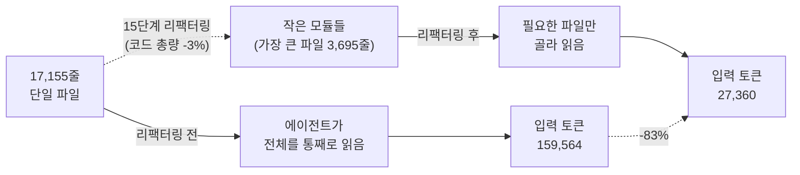

<figure class="post-figure post-figure--header">
<svg role="img" aria-label="왼쪽에는 17,155줄짜리 거대한 단일 Rust 파일이 빽빽한 코드 줄로 가득 찬 하나의 높은 블록으로 서 있다. 가운데에는 오크 대장장이가 Gorehowl 도끼를 들고 그 모놀리스를 내리쳐, 화살표를 따라 오른쪽의 작고 초점이 맞은 여러 모듈 상자로 쪼갠다. 오른쪽 상자들 중 하나에만 강조 테두리가 둘려 있고, AI 골렘이 그 상자 하나만 빛나는 눈으로 들여다본다. 골렘 아래에는 토큰 코인이 단 두 개만 놓여, 필요한 상자 하나만 읽어 훨씬 적은 토큰을 지불함을 보여준다." viewBox="0 0 680 300" xmlns="http://www.w3.org/2000/svg">
  <title>거대한 단일 파일 → 오크 대장장이가 작은 모듈로 분해 → AI 골렘은 필요한 상자 하나만 읽어 토큰을 적게 지불</title>

  <!-- ===== LEFT: the monolith (one giant file) ===== -->
  <text x="86" y="32" text-anchor="middle" font-size="11" fill="currentColor" font-weight="700" opacity="0.8">거대한 단일 파일</text>
  <rect x="36" y="46" width="100" height="208" rx="3" fill="var(--bg-sunken)" stroke="currentColor" stroke-width="2"/>
  <!-- dense code lines -->
  <g stroke="currentColor" stroke-width="2" opacity="0.35">
    <line x1="48" y1="60" x2="118" y2="60"/><line x1="48" y1="70" x2="106" y2="70"/>
    <line x1="48" y1="80" x2="124" y2="80"/><line x1="48" y1="90" x2="98" y2="90"/>
    <line x1="48" y1="100" x2="120" y2="100"/><line x1="48" y1="110" x2="110" y2="110"/>
    <line x1="48" y1="120" x2="124" y2="120"/><line x1="48" y1="130" x2="100" y2="130"/>
    <line x1="48" y1="140" x2="116" y2="140"/><line x1="48" y1="150" x2="108" y2="150"/>
    <line x1="48" y1="160" x2="122" y2="160"/><line x1="48" y1="170" x2="96" y2="170"/>
    <line x1="48" y1="180" x2="118" y2="180"/><line x1="48" y1="190" x2="112" y2="190"/>
    <line x1="48" y1="200" x2="124" y2="200"/><line x1="48" y1="210" x2="102" y2="210"/>
  </g>
  <!-- crack from the axe strike -->
  <polyline points="92,46 80,110 100,150 84,210 94,254" fill="none" stroke="var(--accent-color)" stroke-width="2.5"/>
  <rect x="42" y="226" width="88" height="22" rx="2" fill="var(--bg-panel)" stroke="currentColor" stroke-width="1.4" opacity="0.95"/>
  <text x="86" y="241" text-anchor="middle" font-size="10" fill="currentColor" font-weight="700">17,155줄</text>

  <!-- ===== CENTER: orc blacksmith with Gorehowl ===== -->
  <!-- axe: haft + head, raised -->
  <line x1="214" y1="66" x2="180" y2="150" stroke="currentColor" stroke-width="4" stroke-linecap="round"/>
  <path d="M196 60 q26 -14 40 6 q-22 6 -30 24 q-14 -14 -10 -30 z" fill="var(--steel)" stroke="var(--border-strong)" stroke-width="1.6"/>
  <path d="M236 66 q10 8 8 22 q-16 -2 -24 -14 z" fill="var(--gold)" stroke="var(--border-strong)" stroke-width="1.2"/>
  <!-- orc body -->
  <path d="M196 250 l6 -70 q0 -22 22 -22 h6 q22 0 22 22 l6 70 z" fill="var(--orc-green)" stroke="var(--border-strong)" stroke-width="2"/>
  <!-- orc head -->
  <circle cx="227" cy="128" r="22" fill="var(--orc-green)" stroke="var(--border-strong)" stroke-width="2"/>
  <!-- angry brow -->
  <path d="M212 120 l12 4 M242 120 l-12 4" stroke="var(--border-strong)" stroke-width="2.4" stroke-linecap="round" fill="none"/>
  <!-- eyes -->
  <circle cx="220" cy="128" r="2.2" fill="var(--border-strong)"/>
  <circle cx="234" cy="128" r="2.2" fill="var(--border-strong)"/>
  <!-- tusks -->
  <path d="M221 140 l-3 8 l4 -2 z" fill="var(--bone)" stroke="var(--border-strong)" stroke-width="0.8"/>
  <path d="M233 140 l3 8 l-4 -2 z" fill="var(--bone)" stroke="var(--border-strong)" stroke-width="0.8"/>

  <!-- transformation arrow -->
  <line x1="150" y1="150" x2="300" y2="150" stroke="currentColor" stroke-width="2" opacity="0.55" stroke-dasharray="6 5"/>
  <path d="M300 150 l-12 -6 v12 z" fill="currentColor" opacity="0.7"/>
  <text x="278" y="140" text-anchor="middle" font-size="10" fill="currentColor" opacity="0.7" font-weight="700">분해</text>

  <!-- ===== RIGHT: small module boxes ===== -->
  <text x="398" y="32" text-anchor="middle" font-size="11" fill="currentColor" font-weight="700" opacity="0.8">작은 모듈들</text>
  <g fill="var(--bg-light)" stroke="currentColor" stroke-width="1.8">
    <rect x="326" y="52" width="66" height="40" rx="3"/>
    <rect x="402" y="52" width="66" height="40" rx="3"/>
    <rect x="326" y="102" width="66" height="40" rx="3"/>
    <rect x="326" y="152" width="66" height="40" rx="3"/>
    <rect x="402" y="152" width="66" height="40" rx="3"/>
  </g>
  <!-- highlighted module being read -->
  <rect x="402" y="102" width="66" height="40" rx="3" fill="var(--bg-panel)" stroke="var(--gold)" stroke-width="3"/>
  <g stroke="currentColor" stroke-width="1.4" opacity="0.4">
    <line x1="410" y1="114" x2="452" y2="114"/><line x1="410" y1="122" x2="446" y2="122"/><line x1="410" y1="130" x2="456" y2="130"/>
  </g>
  <text x="435" y="210" text-anchor="middle" font-size="9" fill="currentColor" opacity="0.7">각 300~650줄</text>

  <!-- ===== FAR RIGHT: AI golem reads one box ===== -->
  <!-- reading beam -->
  <line x1="524" y1="118" x2="470" y2="122" stroke="var(--gold)" stroke-width="1.6" stroke-dasharray="4 4" opacity="0.85"/>
  <!-- golem body -->
  <rect x="524" y="86" width="72" height="88" rx="4" fill="var(--bg-light)" stroke="var(--border-strong)" stroke-width="2"/>
  <rect x="536" y="70" width="48" height="26" rx="3" fill="var(--bg-light)" stroke="var(--border-strong)" stroke-width="2"/>
  <!-- glowing eye -->
  <circle cx="560" cy="83" r="7" fill="var(--accent-color)" stroke="var(--border-strong)" stroke-width="1.4"/>
  <circle cx="560" cy="83" r="2.4" fill="var(--bg-panel)"/>
  <!-- golem panel lines -->
  <g stroke="currentColor" stroke-width="1.4" opacity="0.4">
    <line x1="536" y1="118" x2="584" y2="118"/><line x1="536" y1="132" x2="576" y2="132"/><line x1="536" y1="146" x2="584" y2="146"/>
  </g>
  <text x="560" y="192" text-anchor="middle" font-size="9" fill="currentColor" opacity="0.75" font-weight="700">AI 골렘</text>

  <!-- token coins: only a few -->
  <g>
    <circle cx="540" cy="228" r="13" fill="var(--badge-fill)" stroke="var(--border-strong)" stroke-width="1.6"/>
    <text x="540" y="232" text-anchor="middle" font-size="11" fill="var(--border-strong)" font-weight="700">T</text>
    <circle cx="566" cy="228" r="13" fill="var(--badge-fill)" stroke="var(--border-strong)" stroke-width="1.6"/>
    <text x="566" y="232" text-anchor="middle" font-size="11" fill="var(--border-strong)" font-weight="700">T</text>
  </g>
  <text x="606" y="232" font-size="10" fill="currentColor" opacity="0.8" font-weight="700">토큰 ↓</text>
</svg>
<figcaption>오크 대장장이가 17,155줄짜리 모놀리스를 작은 모듈로 분해하면, AI 골렘은 필요한 상자 하나만 읽어 토큰을 훨씬 적게 지불한다.</figcaption>
</figure>

## 원문 정보

> - **제목**: The Economic Benefit of Refactoring
> - **출처**: martinfowler.com — "Exploring Gen AI" 시리즈 · 저자 Giles Edwards-Alexander (Thoughtworks, CTO for Europe, Middle East and India)
> - **발행**: 2026-07-30 · 약 12~15분 분량
> - **원문 링크**: <https://martinfowler.com/articles/exploring-gen-ai/refactoring-economic-benefit.html>

리팩터링은 오랫동안 "지금은 값을 못 매기지만 나중에 이롭다"는, 신념에 가까운 실천이었다. 이 글은 에이전트가 코드를 만드는 시대에 그 이점을 **토큰 단위의 숫자로 측정**해 보인다. 그래서 Articles의 AI-Engineering — 에이전트 코드베이스를 만들고 운영하는 실무 — 에 담는다.

## 한 줄 요약 (TL;DR)

AI 에이전트가 작성한 17,155줄짜리 단일 Rust 파일을 Martin Fowler의 리팩터링 패턴을 따라 15단계로 정리하자, **동일한 기능을 추가하는 데 드는 입력 토큰이 159,564개에서 27,360개로 83% 줄었다.** 코드의 총량은 거의 그대로였는데도(오히려 3%만 감소) 비용이 급감한 이유는, 잘 구조화된 코드에서는 에이전트가 **전체를 훑지 않고 필요한 작은 파일만 읽어도 되기 때문**이다. 리팩터링은 이제 "미래의 토큰 소비를 낮추기 위해 지금 토큰을 쓰는" 계산 가능한 투자다.

#### 한눈에 보기: 왜 같은 코드가 더 싸졌나

*코드의 총량은 거의 그대로(-3%)인데, 에이전트가 **읽어야 할 양**이 줄어 입력 토큰이 83% 감소한다.*

## 왜 이 글을 골랐나

에이전트로 코드를 짜는 팀이라면 누구나 마주치는 질문이 있다. **"AI가 만든 코드도 정리해야 하나? 어차피 AI가 다시 짤 텐데?"** 사람 개발자에게 리팩터링의 이점은 "가독성", "유지보수성" 같은 정성적 언어로 정당화돼 왔고, 그래서 늘 우선순위 싸움에서 밀렸다.

이 글이 특별한 건 그 이점을 **돈으로 환산**했다는 점이다. 게다가 실험 설계가 영리하다. 저자는 "에이전트는 사람과 달리 학습하지 않는다"는 성질을 역이용한다. 사람은 같은 작업을 반복하면 익숙해져 측정이 오염되지만, 에이전트는 매번 백지 상태에서 시작하므로 **깨끗한 A/B 테스트가 가능**하다. 리팩터링 단계마다 동일한 기능 추가를 다시 시켜 토큰을 재는, 사람으로는 불가능했던 통제 실험이다.

우리 위키에는 이미 [Intent Debt — 에이전트가 대신 갚아줄 수 없는 부채](/2026/06/21/intent-debt.html)나 [잘못된 추상화: 중복보다 더 비싼 죄](/2026/06/22/the-wrong-abstraction.html)처럼 "AI 시대의 코드 품질"을 다룬 글이 있다. 이 글은 거기에 **정량적 근거**를 더해준다.

## 핵심 내용

### 실험의 무대: 리뷰 없이 에이전트로 만든 15만 줄 애플리케이션

저자는 약 15만 줄 규모의 애플리케이션을 **코드를 직접 리뷰하지 않고** 전적으로 AI 에이전트(대부분 Claude Code, 일부 Cursor)로 만들었다. 이 중 약 12만 줄이 Rust이고 나머지는 TypeScript와 Terraform이다. 개발 과정에서 데이터 접근 계층(data access layer) 하나가 **17,155줄짜리 단일 파일**로 부풀어 올랐다 — 전형적인 리팩터링 후보다.

### 실험 설계: 학습하지 않는 에이전트를 이용한 통제 실험

핵심 방법론은 다음과 같다.

1. 엄격한 규율을 따르는 리팩터링 계획을 먼저 수립한다.
2. **대표 기능**을 하나 정한다 — 세 개의 메서드를 가진 `ItemWatchStore` 트레이트를 추가하는 변경.
3. 리팩터링 전 상태에서 이 변경의 **기준선(baseline) 토큰 비용**을 측정한다.
4. 15개의 리팩터링 단계를 순차적으로 적용한다.
5. **각 단계가 끝날 때마다 동일한 변경을 다시 실행**하고 토큰 소비를 측정한다.
6. 매 측정 후 구현을 **폐기**해 에이전트가 "학습"으로 오염되는 것을 막는다.

토큰은 tiktoken 대신 문자 수를 4로 나눈 근사치를 프록시로 썼다(저자도 이 근사의 한계를 인정한다).

### 결과: 코드는 그대로인데 비용은 83% 감소

| 지표 | 기준선 | 최종(15단계) | 변화 |
| --- | --- | --- | --- |
| 입력 토큰 | 159,564 | 27,360 | **-83%** (132,204 절감) |
| 출력 토큰 | 1,705 | 2,113 | +24% |
| 데이터 계층 총 LoC | 17,155 | 16,608 | -3% |
| 가장 큰 파일 LoC | 17,155 | 3,695 | **-78%** |

가장 중요한 통찰은 **코드 총량은 거의 변하지 않았다는 점**이다(-3%). 그런데도 입력 토큰이 83% 줄었다. 저자의 표현을 빌리면:

> "This saving is because the agent has to read less code. But it is not because there is less code to read."
> (이 절감은 에이전트가 더 적은 코드를 읽어야 하기 때문이지, 읽을 코드가 줄었기 때문이 아니다.)

즉 잘 분해된 구조에서는 에이전트가 거대한 모놀리스를 통째로 스캔하는 대신, **작고 초점이 맞은 파일만 식별해 읽는다.** 가장 큰 파일이 17,155줄에서 3,695줄로 줄어든 것이 이 "외과적 읽기(surgical reading)"를 가능케 했다.

<figure class="post-figure">
<svg role="img" aria-label="세 지표를 기준선 대비 최종값으로 비교한 가로 막대 차트. 각 지표는 기준선을 100%로 놓은 흐린 전체 폭 트랙 위에, 최종값만큼 채워진 막대로 표시된다. 입력 토큰은 17%까지 급감(-83%), 가장 큰 파일 LoC는 22%까지 급감(-78%)한 반면, 데이터 계층 총 LoC는 97%로 거의 그대로다(-3%). 비용 지표 두 개는 크게 줄었지만 코드 총량은 사실상 변하지 않은 '총량 불변, 비용 급감'의 역설을 보여준다." viewBox="0 0 680 300" xmlns="http://www.w3.org/2000/svg">
  <title>총량 불변, 비용 급감 — 입력 토큰 -83%, 가장 큰 파일 -78%인데 총 LoC는 -3%</title>

  <text x="20" y="26" font-size="12" fill="currentColor" font-weight="700">기준선 대비 최종값 (기준선 = 100%)</text>

  <!-- ===== Row 1: input tokens -83% ===== -->
  <text x="200" y="72" text-anchor="end" font-size="12" fill="currentColor" font-weight="700">입력 토큰</text>
  <text x="200" y="87" text-anchor="end" font-size="9" fill="currentColor" opacity="0.65">159,564 → 27,360</text>
  <rect x="212" y="62" width="400" height="30" rx="3" fill="var(--bg-light)" stroke="currentColor" stroke-width="1.2" opacity="0.45"/>
  <rect x="212" y="62" width="68" height="30" rx="3" fill="var(--accent-color)"/>
  <text x="620" y="82" font-size="13" fill="var(--accent-color)" font-weight="700">-83%</text>

  <!-- ===== Row 2: largest file LoC -78% ===== -->
  <text x="200" y="142" text-anchor="end" font-size="12" fill="currentColor" font-weight="700">가장 큰 파일 LoC</text>
  <text x="200" y="157" text-anchor="end" font-size="9" fill="currentColor" opacity="0.65">17,155 → 3,695</text>
  <rect x="212" y="132" width="400" height="30" rx="3" fill="var(--bg-light)" stroke="currentColor" stroke-width="1.2" opacity="0.45"/>
  <rect x="212" y="132" width="88" height="30" rx="3" fill="var(--accent-color)"/>
  <text x="620" y="152" font-size="13" fill="var(--accent-color)" font-weight="700">-78%</text>

  <!-- ===== Row 3: total LoC -3% (unchanged) ===== -->
  <text x="200" y="212" text-anchor="end" font-size="12" fill="currentColor" font-weight="700">데이터 계층 총 LoC</text>
  <text x="200" y="227" text-anchor="end" font-size="9" fill="currentColor" opacity="0.65">17,155 → 16,608</text>
  <rect x="212" y="202" width="400" height="30" rx="3" fill="var(--bg-light)" stroke="currentColor" stroke-width="1.2" opacity="0.45"/>
  <rect x="212" y="202" width="388" height="30" rx="3" fill="currentColor" opacity="0.4"/>
  <text x="620" y="222" font-size="13" fill="currentColor" font-weight="700" opacity="0.75">-3%</text>

  <!-- baseline reference line -->
  <line x1="612" y1="52" x2="612" y2="242" stroke="currentColor" stroke-width="1.4" opacity="0.5" stroke-dasharray="4 4"/>

  <text x="340" y="278" text-anchor="middle" font-size="11" fill="currentColor" opacity="0.8" font-weight="700">코드 총량은 그대로인데(-3%), 읽어야 할 양이 줄어 비용은 급감한다</text>
</svg>
<figcaption>총량 불변, 비용 급감의 역설 — 총 LoC는 -3%로 사실상 그대로지만, 입력 토큰(-83%)과 가장 큰 파일 LoC(-78%)는 급감했다.</figcaption>
</figure>

### 15단계 리팩터링: 지역적 추출에서 모듈 분해로

모든 단계는 Martin Fowler의 *Refactoring* 2판 패턴을 따랐고, 대략 세 국면으로 나뉜다.

- **1~6단계 — 지역적 추출(Local Extraction)**: `FirestoreClient` 전송 계층을 Extract Class로 분리, `extract_doc_id`·`new_link` 같은 함수 추출, Firestore 값 생성자 인라인 대체, 문서 인코딩용 `FieldsBuilder` 클래스 추출 등. 먼저 지역적 중복을 제거한다.
- **7~12단계 — 모듈 분해(Module Decomposition)**: 상수·타입 정의를 `queries.rs`로, 트레이트 정의를 `traits.rs`로 옮긴 뒤 이를 다시 도메인별 네 파일(각 300~650줄)로 분리. 인코더/디코더는 `codec.rs`로, 약 4,700줄짜리 `fake_store.rs`를 별도로 추출, `FirestoreStore` 구현을 도메인별 10개 파일로 분할.
- **13~15단계 — 테스트 정리(Test Organization)**: 테스트를 각 모듈과 같은 위치로 옮겨 관심사를 완전히 분리.

핵심 순서는 **"먼저 지역적 중복 제거 → 그다음 구조적 분해"**다. 아무 파일이나 잘게 쪼개는 것으로는 이득이 없다.

### 과정에서 관찰한 것: 사람이 여전히 설계자다

저자는 Claude의 한계를 솔직히 기록한다.

> "Claude is unable to look at code, look at refactorings in general and work out which are suitable to apply: a human needs to actively guide it."
> (Claude는 코드를 보고 일반적인 리팩터링들을 검토해 무엇이 적합한지 스스로 판단하지 못한다. 사람이 능동적으로 이끌어야 한다.)

에이전트는 **명시적이고 상세한 지시를 받았을 때만** 잘 해냈다. 흥미롭게도 계획 수립에서는 Claude Code보다 Claude.ai(웹 채팅)가 더 나았다고 한다.

### 숨은 비용과 남은 질문

실험 자체는 무인 실행으로 약 8시간, 계획과 실행에 최대 500만 토큰가량이 들었을 수 있다. 단일 변경 하나로 회수되는 비용이 아니다. Sonnet 5 가격($3/MTok) 기준으로 대표 변경당 절감액은 **약 39.7센트**. 개별로는 소액이지만, 앞으로의 수천 번 변경(기능 개발·디버깅·추가 리팩터링)에 걸쳐 **복리로 누적**된다. 저자는 이 실험이 그린필드 프로젝트 위의 단일 사례임을 인정하며, 레거시 시스템·복잡한 변경·지속적 리팩터링 전략으로의 확장 검증을 남은 과제로 제시한다.

## 분석과 인사이트

여기부터는 원문 요약이 아니라 내 관점이다.

**1. "코드 품질"이 드디어 손익계산서로 들어왔다.** 사람 개발자에게 리팩터링은 늘 "미래의 나를 위한 선의"였고, 그래서 스프린트 압박 앞에서 가장 먼저 희생됐다. 이 글의 진짜 기여는 83%라는 숫자 자체가 아니라, **리팩터링의 이점을 재무 지표로 번역하는 방법론**을 제시했다는 점이다. 이제 "이 리팩터링을 하면 이 코드베이스에 대한 향후 에이전트 작업 비용이 N% 낮아진다"고 말할 수 있다. 정성적 논쟁이 정량적 예산 항목이 된다.

**2. 메커니즘이 핵심이다: 비용은 '코드 양'이 아니라 '읽어야 하는 양'에 걸린다.** 총 LoC가 3%만 줄었는데 토큰이 83% 줄었다는 대비가 이 글의 심장이다. 이는 [컨텍스트 엔지니어링](/2026/06/25/vibe-coding-and-agentic-engineering.html)의 관점과 정확히 맞닿는다 — 에이전트에게 중요한 건 코드베이스의 절대 크기가 아니라 **한 작업을 위해 컨텍스트 창에 얼마나 밀어 넣어야 하는가**다. 잘 분해된 모듈 경계는 곧 "에이전트가 무시해도 되는 코드"를 만들어 주는 것이고, 이것이 인간 유지보수성과 에이전트 비용이 **같은 방향**을 가리키는 이유다.

**3. 단, 파일을 잘게 쪼개는 것 ≠ 리팩터링.** 저자가 못 박듯, 도메인 경계 없이 파일만 잘게 나누면 에이전트가 여러 작은 파일을 뒤지느라 비슷한 비용을 치를 수 있다. **응집도 높은 경계 설정**이 관건이다. 이 지점에서 [잘못된 추상화](/2026/06/22/the-wrong-abstraction.html)의 교훈이 그대로 유효하다 — 잘못 그은 경계는 중복보다 비싸다. 즉 AI 시대에도 "좋은 설계"의 정의는 바뀌지 않았고, 다만 그 대가가 더 즉각적으로 청구될 뿐이다.

**4. 인간의 자리가 명확해졌다.** 에이전트는 리팩터링을 **실행**할 수 있지만 무엇을·언제·어떻게 리팩터링할지 **판단**하지는 못했다. 이건 [짧은 목줄 방법](/2026/07/06/short-leash-ai-coding.html)이나 [Intent Debt](/2026/06/21/intent-debt.html)가 말하는 것과 같은 결론이다 — 설계 의도와 구조적 판단은 여전히 사람의 몫이고, 에이전트는 그 판단을 값싸게 집행하는 도구다. "리뷰 없이 15만 줄을 만들었다"는 도발적 전제와, "그런데 리팩터링 방향은 사람이 일일이 지시해야 했다"는 결론 사이의 긴장이 이 글에서 가장 정직한 부분이다.

**5. 한계는 분명하다.** 문자 수 ÷ 4라는 토큰 근사치, 단일 그린필드 사례, 단일 변경 유형이라는 조건은 결과를 일반화하기엔 좁다. 리팩터링에 든 500만 토큰과 8시간이 실제로 언제 회수되는지 — 손익분기 분석이 빠져 있다. 그럼에도 **방향성**은 설득력 있다: 에이전트 코드베이스에서 구조는 곧 비용이다.

## 적용 포인트

- **리팩터링을 비용 관점으로 재프레이밍하라.** 팀에 리팩터링을 제안할 때 "깨끗해진다" 대신 "이 모듈에 대한 향후 에이전트 작업의 입력 토큰이 줄어든다"로 말하라. 예산 회의에서 이기는 언어다.
- **모놀리식 거대 파일을 우선 타깃으로.** 수천 줄짜리 단일 파일은 에이전트가 매 작업마다 통째로 읽어야 하는 상습 비용 지점이다. 가장 큰 파일부터 도메인 경계로 분해하라.
- **순서를 지켜라: 지역적 중복 제거 먼저, 구조적 분해는 그다음.** 아무 파일이나 잘게 쪼개는 것은 오히려 탐색 비용을 늘릴 수 있다.
- **리팩터링은 에이전트에게 명시적·단계적으로 지시하라.** "이 코드 리팩터링해줘" 같은 열린 지시로는 에이전트가 무엇이 적합한지 판단하지 못한다. Fowler의 명명된 패턴(Extract Class, Move Function 등)을 단계별로 지정하라.
- **A/B로 측정하라.** 에이전트는 학습하지 않으므로, 리팩터링 전후에 동일 작업을 재실행해 토큰을 재면 구조 변경의 효과를 실제로 검증할 수 있다. 이건 사람 팀에서는 불가능했던 이점이다.
- **계획은 다른 도구를 써보라.** 저자는 실행용 Claude Code보다 계획 수립에서 Claude.ai가 나았다고 한다. 리팩터링 설계와 집행의 도구를 분리해 실험해 볼 가치가 있다.

## 마무리

이 글은 "AI가 짠 코드는 정리할 필요가 없다"는 흔한 직관을 정면으로 반박한다. 오히려 반대다 — 에이전트가 코드를 다룰 때, 잘 구조화된 코드는 **매 작업마다 토큰으로 배당금을 지급**한다. 리팩터링의 오래된 미덕(응집도, 명확한 경계, 작은 단위)은 하나도 바뀌지 않았지만, 그 이점은 이제 정성적 신념이 아니라 **청구서에 찍히는 숫자**가 되었다. 그리고 그 숫자를 만들어 내는 판단은 여전히 사람의 손에 있다.

### 더 읽어보기

- [원문 — The Economic Benefit of Refactoring (Giles Edwards-Alexander, martinfowler.com)](https://martinfowler.com/articles/exploring-gen-ai/refactoring-economic-benefit.html)
- [Intent Debt: 에이전트가 대신 갚아줄 수 없는 단 하나의 부채 (Addy Osmani)](/2026/06/21/intent-debt.html) — AI가 코드를 짜도 남는 부채의 본질
- [잘못된 추상화: 중복보다 더 비싼 죄 (Sandi Metz)](/2026/06/22/the-wrong-abstraction.html) — 왜 "파일 쪼개기 ≠ 좋은 경계"인지의 원리
- [짧은 목줄(Short Leash) 방법 — AI 코딩 에이전트를 통제하며 고품질 코드 만들기 (Greg Slepak)](/2026/07/06/short-leash-ai-coding.html) — 에이전트를 이끄는 사람의 역할
- [바이브 코딩과 에이전틱 엔지니어링 (Simon Willison)](/2026/06/25/vibe-coding-and-agentic-engineering.html) — 컨텍스트를 다루는 에이전트 개발의 감각
- [Refactoring: 동작을 지키며 설계를 개선하는 규율](/2026/06/19/refactoring-improving-design.html) — 이 실험이 따른 Fowler 리팩터링 패턴의 원전 정리
