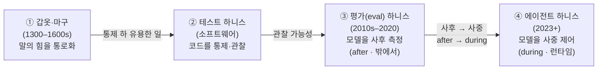

<figure class="post-figure post-figure--header">
<svg role="img" aria-label="야생마처럼 통제되지 않는 언어 모델이 왼쪽에서 원시 힘을 뿜어낸다. 가운데의 하니스 패널이 T1(루프)·T2(도구)·T3(컨텍스트)·T4(제어) 네 가닥의 가죽끈으로 그 힘을 감싼다. 위에서는 오크의 손이 고삐를 쥐어 런타임에 통제하고, 하니스를 통과한 힘은 오른쪽으로 '통로화'되어 전장의 과제 목표로 통제되어 나간다." viewBox="0 0 680 320" xmlns="http://www.w3.org/2000/svg">
  <title>하니스 — 야생의 언어 모델(원시 힘)을 T1–T4 네 가닥으로 감싸 통제된 유용한 일로 통로화한다</title>
  <defs>
    <marker id="hn-head" markerWidth="9" markerHeight="9" refX="7" refY="3" orient="auto">
      <path d="M0 0 L7 3 L0 6 z" fill="currentColor"/>
    </marker>
    <marker id="hn-head-sec" markerWidth="10" markerHeight="10" refX="7" refY="3" orient="auto">
      <path d="M0 0 L7 3 L0 6 z" fill="var(--secondary-color)"/>
    </marker>
  </defs>

  <!-- ===== TOP: 오크의 손이 고삐를 쥔다 (rein + gauntlet) ===== -->
  <text x="472" y="20" text-anchor="middle" font-size="10" fill="var(--secondary-color)" font-weight="700">오크가 고삐를 쥔다 · 런타임 통제</text>
  <path d="M336 112 Q 388 46 456 50" fill="none" stroke="var(--secondary-color)" stroke-width="1.8" opacity="0.85"/>
  <path d="M490 50 Q 556 62 604 116" fill="none" stroke="var(--secondary-color)" stroke-width="1.8" opacity="0.85"/>
  <!-- gauntlet fist -->
  <rect x="456" y="36" width="34" height="22" rx="4" fill="var(--bg-light)" stroke="currentColor" stroke-width="1.6"/>
  <rect x="459" y="30" width="7" height="8" rx="2" fill="var(--secondary-color)"/>
  <rect x="469" y="30" width="7" height="8" rx="2" fill="var(--secondary-color)"/>
  <rect x="479" y="30" width="7" height="8" rx="2" fill="var(--secondary-color)"/>
  <rect x="450" y="42" width="8" height="14" rx="2" fill="var(--bg-light)" stroke="currentColor" stroke-width="1.4"/>

  <!-- ===== LEFT: 야생마 = 원시 언어 모델 ===== -->
  <text x="104" y="92" text-anchor="middle" font-size="11" fill="currentColor" font-weight="700" opacity="0.8">언어 모델 · 원시 힘</text>
  <!-- wild energy spikes -->
  <line x1="66" y1="158" x2="50" y2="158" stroke="currentColor" stroke-width="1.6" opacity="0.45"/>
  <line x1="74" y1="138" x2="62" y2="124" stroke="currentColor" stroke-width="1.6" opacity="0.45"/>
  <line x1="88" y1="130" x2="78" y2="116" stroke="currentColor" stroke-width="1.6" opacity="0.45"/>
  <line x1="104" y1="124" x2="104" y2="108" stroke="currentColor" stroke-width="1.6" opacity="0.45"/>
  <line x1="74" y1="178" x2="62" y2="192" stroke="currentColor" stroke-width="1.6" opacity="0.45"/>
  <line x1="104" y1="192" x2="104" y2="206" stroke="currentColor" stroke-width="1.6" opacity="0.45"/>
  <line x1="120" y1="188" x2="130" y2="202" stroke="currentColor" stroke-width="1.6" opacity="0.45"/>
  <circle cx="104" cy="158" r="30" fill="var(--bg-light)" stroke="currentColor" stroke-width="2"/>
  <text x="104" y="163" text-anchor="middle" font-size="15" fill="currentColor" font-weight="700">LM</text>
  <text x="104" y="228" text-anchor="middle" font-size="10" fill="currentColor" opacity="0.55">야생마 · 통제 불가</text>

  <!-- wild jagged arrow orb -> harness -->
  <polyline points="142,158 162,146 182,170 202,144 222,168 240,158" fill="none" stroke="currentColor" stroke-width="1.8" opacity="0.7" marker-end="url(#hn-head)"/>
  <text x="192" y="132" text-anchor="middle" font-size="9.5" fill="currentColor" opacity="0.6" font-weight="700">원시 힘</text>

  <!-- ===== CENTER: 하니스 ===== -->
  <rect x="248" y="112" width="176" height="96" rx="10" fill="var(--bg-panel)" stroke="var(--accent-color)" stroke-width="2.4"/>
  <text x="336" y="138" text-anchor="middle" font-size="15" fill="var(--accent-color)" font-weight="700">하니스</text>
  <text x="336" y="154" text-anchor="middle" font-size="9" fill="currentColor" opacity="0.7">HARNESS · 런타임 레이어</text>
  <!-- 4 straps -->
  <rect x="258" y="170" width="36" height="28" rx="5" fill="var(--bg-light)" stroke="currentColor" stroke-width="1.4"/>
  <text x="276" y="188" text-anchor="middle" font-size="11" fill="currentColor" font-weight="700">T1</text>
  <rect x="300" y="170" width="36" height="28" rx="5" fill="var(--bg-light)" stroke="currentColor" stroke-width="1.4"/>
  <text x="318" y="188" text-anchor="middle" font-size="11" fill="currentColor" font-weight="700">T2</text>
  <rect x="342" y="170" width="36" height="28" rx="5" fill="var(--bg-light)" stroke="currentColor" stroke-width="1.4"/>
  <text x="360" y="188" text-anchor="middle" font-size="11" fill="currentColor" font-weight="700">T3</text>
  <rect x="384" y="170" width="36" height="28" rx="5" fill="var(--bg-light)" stroke="currentColor" stroke-width="1.4"/>
  <text x="402" y="188" text-anchor="middle" font-size="11" fill="currentColor" font-weight="700">T4</text>

  <!-- ===== channel arrow harness -> objective ===== -->
  <text x="484" y="140" text-anchor="middle" font-size="11" fill="var(--secondary-color)" font-weight="700">통로화</text>
  <text x="484" y="180" text-anchor="middle" font-size="9" fill="currentColor" opacity="0.6">통제된 유용한 일</text>
  <line x1="428" y1="158" x2="540" y2="158" stroke="var(--secondary-color)" stroke-width="3" marker-end="url(#hn-head-sec)"/>

  <!-- ===== RIGHT: 전장 목표 (target + Orgrimmar banner) ===== -->
  <circle cx="580" cy="158" r="26" fill="none" stroke="var(--gold)" stroke-width="1.8" opacity="0.8"/>
  <circle cx="580" cy="158" r="14" fill="none" stroke="var(--gold)" stroke-width="1.8" opacity="0.8"/>
  <circle cx="580" cy="158" r="5" fill="var(--accent-color)"/>
  <line x1="606" y1="116" x2="606" y2="212" stroke="currentColor" stroke-width="2"/>
  <polygon points="606,116 646,128 606,140" fill="var(--gold)" opacity="0.9"/>
  <text x="588" y="234" text-anchor="middle" font-size="10" fill="currentColor" opacity="0.7" font-weight="700">전장 · 과제</text>
</svg>
<figcaption>하니스 — 야생의 언어 모델(원시 힘)을 T1–T4 네 가닥의 가죽끈으로 감싸, 오크가 고삐를 쥔 채 통제된 유용한 일(전장의 과제)로 통로화한다.</figcaption>
</figure>

## 원문 정보

> - **제목**: *What makes a harness a harness: necessary and sufficient conditions for an agent harness*
> - **출처**: Sanderson Oliveira de Macedo, Federal Institute of Goiás (브라질) · arXiv:2606.10106v1 [cs.SE / cs.AI]
> - **발행**: 2026-06-08 제출 · DOI 10.48550/arXiv.2606.10106
> - **원문 링크**: <https://arxiv.org/abs/2606.10106>

이 위키 자체가 Claude Code 서브에이전트(`article-manager`·`post-illustrator` 등)로 굴러가는데, 그 Claude Code가 바로 이 논문이 "유효한 하니스"로 **포함**하는 대표 사례다. 우리가 매일 쓰는 도구가 왜 하니스인지를 조건으로 못 박아 주기에 Articles에 담는다. 그리고 이 글은 방금 정리한 [프롬프트는 언제 '그래프'가 되는가](/2026/08/03/prompt-graph-engineering.html)의 **자매편**이다 — 같은 저자가 같은 방법론으로 인접 레이어를 정의한다.

## 한 줄 요약 (TL;DR)

"에이전트 하니스"는 하나 이상의 언어 모델을 감싸 **외부 환경에서 과제를 수행하는 에이전트로 바꾸는 런타임 엔지니어링 레이어**다. 이 논문은 새 프레임워크나 벤치마크를 제안하지 않고, 널리 쓰이지만 정의가 없던 이 용어를 **4개 필요충분조건**(T1 에이전트 루프 · T2 도구 인터페이스 · T3 컨텍스트 관리 · T4 제어 메커니즘)으로 규정하고, 후보 시스템을 넣고 뺄 수 있는 포함/배제 테스트로 만든다.

이 논문을 관통하는 척추는 "하니스라는 단어가 갑옷에서 에이전트 런타임으로 어떻게 자랐는가"다. 네 정거장을 한눈에 보면 이렇다.

## 왜 이 글을 골랐나

이 논문의 가치는 자매편과 똑같이 "**이미 하던 것에 이름을 붙였다**"는 데 있다. 저자 스스로 밝히듯 정의적(definitional) 논문 — 벤치마크도 새 시스템도 없다. 대신 산업이 매일 만들고 운영하지만 어휘가 뒤처져 뒤죽박죽 부르던 "하니스"에 공유 어휘 + 재현 가능한 판정 테스트를 준다.

세 가지 이유로 이 위키 맥락과 정확히 맞물린다.

1. **저자의 스택이 우리가 다뤄 온 층 그 자체다.** 같은 저자 Sandeco Macedo(= [prompt graph engineering 논문](/2026/08/03/prompt-graph-engineering.html)의 저자)는 하나의 위계를 정의해 왔다 — **프롬프트 → 컨텍스트 → 하니스 → 루프**. prompt graph engineering이 하니스 *안쪽*에서 여러 모델 호출의 합성을 그래프로 구조화하는 층이라면, **harness는 모델 하나를 에이전트로 바꾸는 런타임 바깥 층**이다. 우리가 [Loop Engineering](/2026/06/19/loop-engineering.html)·[Codex의 agent loop](/2026/06/25/codex-agent-loop.html)에서 실무로 다룬 것을 이 논문은 학술적 정의로 못 박는다.
2. **결정적 대비: 같은 도구, 다른 판정.** Claude Code는 이 harness 논문에서 T1–T4를 **모두 통과해 '유효한 하니스'로 포함**된다. 그런데 자매편 prompt-graph 논문에서는 서브에이전트 위임이 창발적이라 '프롬프트 그래프'에서 **배제**됐다. 같은 도구가 한 정의에는 들고 다른 정의에는 안 든다 — 두 정의가 설계 공간을 서로 다른 각도로 자르기 때문이다.
3. **우리 위키가 그 하니스 위에서 굴러간다.** `article-manager`가 이 글을 쓰는 지금 이 순간이 T1–T4의 살아 있는 예시다. 왜 이게 하니스인지 알면 우리가 매일 무엇을 운영하는지도 선명해진다.

## 핵심 내용

논문은 자매편과 같은 순서로 간다. 먼저 **계보**로 개념의 출처를 복원하고, **4조건**으로 정의하고, **포함/배제 테스트**로 도구화한 뒤, **이웃 개념**과 경계를 긋고, **실제 6개 시스템**에 적용하고, **4개 긴장 축**의 연구 어젠다로 닫는다. 다섯 연구질문(RQ1 계보 · RQ2 구성적 정의 · RQ3 경계 · RQ4 적용 · RQ5 어젠다)이 이 구조를 지탱한다.

### 계보: 갑옷에서 런타임 제어까지 (RQ1)

"하니스"는 프롬프트보다 700년 오래된 단어다. 저자는 그 이동을 복원한다.

- **어원**: 고대 프랑스어 *harneis*(12세기, 전쟁 장비·갑옷) → ~1300년 영어에서 군사적 의미(갑옷) → 14세기 초 견인 동물을 수레에 잇는 가죽끈(마구) → 17세기 비유적 동사("바람을 harness하다").
- **네 정거장**: (1) 갑옷/마구(1300–1600s) — 힘을 안전하게 통로화 → (2) 소프트웨어 **테스트 하니스** — 스크립트·목·스텁으로 코드를 통제·관찰 가능하게 실행 → (3) ML **평가(eval) 하니스**(2010s–2020) — 실행 *후* 밖에서 결과를 측정(SWE-bench가 과제 완수를 사후 채점) → (4) **에이전트 하니스**(2023+) — 실행 *중* 런타임에 제어.

관통하는 실 하나: **각 하니스는 힘(말·코드·모델)을 통제 하에 유용한 일로 통로화한다.** 에이전트 감각의 차별점은 그 제어가 **런타임에** 작동한다는 것이다. 저자가 콕 집는 대목: 평가 하니스는 실행이 끝난 *뒤*(after the fact) 밖에서 관찰하지만, 에이전트 하니스는 실행 *도중*(during the fact) 안에서 제어한다. 이 시간의 절(temporal clause)이 왜 "에이전트 하니스"가 독자적 정의를 요구하는지를 봉인한다.

### 4개 조건 (T1–T4): 구성적 정의 (RQ2)

논문의 심장. 저자는 하니스를 예시가 아니라 **조건으로** 정의한다.

> "에이전트 하니스는 하나 이상의 언어 모델을 감싸 외부 환경에서 과제를 수행하는 에이전트로 바꾸는 **런타임 엔지니어링 레이어**로, 모델에 다음을 결합한다: (i) 추론·행동·관찰을 교차하는 에이전트 루프, (ii) 모델이 환경을 지각·변경하게 하는 도구 인터페이스, (iii) 무엇이 모델 윈도에 들고 나는지 결정하는 컨텍스트 관리, (iv) 실행을 더 신뢰할 수 있고 감사 가능하며 통제되게 만드는 제어 메커니즘 — 한계·검증·결정적 행동."

이를 네 조건으로 부른다.

- **T1 — 에이전트 루프(agent loop)**: 런타임에 추론→행동→관찰을 교차하는 루프를 유지하는가? **부재 → 단일 패스 생성기**(에이전트 아님).
- **T2 — 도구 인터페이스(tool interface)**: 모델에게 외부 환경을 지각·변경할 인터페이스를 주는가? **부재 → 고립된 모델**, 또는 루프를 아직 안 조립한 SDK.
- **T3 — 컨텍스트 관리(context management)**: 무엇이 모델 컨텍스트에 들고 나는지 능동적으로 결정하는가? **부재 → 이력을 그냥 쏟아붓는 순진한 래퍼**로 긴 과제에서 취약. 기준은 버퍼 크기가 아니라 **과제 내용·현재 관찰**에 따라 결정하느냐다.
- **T4 — 제어 메커니즘(control mechanisms)**: 모델과 독립적인 제어 장치를 최소 하나 포함하는가? **부재 → 보장 없는 데모**로 모델의 말만 믿는다. 기준은 **효과가 모델의 협조에 의존하지 않아야** 한다는 것 — 가드레일은 통과, "로그를 출력하라"는 지시는 실패.

핵심 논증은 **네 조건이 각각 필요하며 함께 충분**하다는 것이다. 하나씩 빼 보면 왜인지 드러난다: T1을 빼면 고정 파이프라인으로 후퇴하고, T2를 빼면 환경과 격리되며, T3을 빼면 긴 과제에서 무너지고, T4를 빼면 아무 보장 없는 데모가 된다. 그리고 저자는 다섯 번째 조건을 두지 않는다 — 관측성·비용 제어 같은 성질은 모두 이 넷의 특수화다.

<figure class="post-figure">
<svg role="img" aria-label="중앙의 AGENT HARNESS를 네 개의 조건이 둘러싼 해부도. 가운데에 AGENT HARNESS라 적힌 핵심 상자가 있고, 네 모서리에서 각 조건 카드가 중앙으로 선을 뻗는다. 왼쪽 위 T1은 에이전트 루프로 런타임에 추론·행동·관찰을 교차하며, 부재하면 단일 패스 생성기로 붕괴한다. 오른쪽 위 T2는 도구 인터페이스로 모델이 환경을 지각·변경하게 하며, 부재하면 고립된 모델이나 조립 전 SDK로 붕괴한다. 왼쪽 아래 T3은 컨텍스트 관리로 무엇이 모델 윈도에 들고 나는지 능동적으로 결정하며, 부재하면 이력을 쏟아붓는 순진한 래퍼로 붕괴한다. 오른쪽 아래 T4는 제어 메커니즘으로 모델의 협조 없이도 작동하는 제어를 최소 하나 두며, 부재하면 보장 없는 데모로 붕괴한다. 네 조건은 각각 필요하고 함께 충분하며, 다섯 번째 조건은 없다." viewBox="0 0 680 360" xmlns="http://www.w3.org/2000/svg">
  <title>에이전트 하니스의 해부 — T1·T2·T3·T4</title>

  <!-- connector lines (center to each anchor) -->
  <line x1="270" y1="150" x2="180" y2="66"  stroke="currentColor" stroke-width="1.6" opacity="0.5"/>
  <line x1="410" y1="150" x2="500" y2="66"  stroke="currentColor" stroke-width="1.6" opacity="0.5"/>
  <line x1="270" y1="210" x2="180" y2="294" stroke="currentColor" stroke-width="1.6" opacity="0.5"/>
  <line x1="410" y1="210" x2="500" y2="294" stroke="currentColor" stroke-width="1.6" opacity="0.5"/>

  <!-- center -->
  <rect x="270" y="150" width="140" height="60" rx="6" fill="var(--bg-light)" stroke="var(--accent-color)" stroke-width="2.4"/>
  <text x="340" y="176" text-anchor="middle" font-size="13" fill="currentColor" font-weight="700">AGENT</text>
  <text x="340" y="194" text-anchor="middle" font-size="13" fill="currentColor" font-weight="700">HARNESS</text>

  <!-- T1 top-left -->
  <rect x="34" y="34" width="252" height="64" rx="5" fill="var(--bg-panel)" stroke="currentColor" stroke-width="1.8"/>
  <text x="48" y="56" font-size="12" fill="var(--secondary-color)" font-weight="700">T1 · 에이전트 루프</text>
  <text x="48" y="74" font-size="10" fill="currentColor" opacity="0.82">런타임에 추론→행동→관찰 교차</text>
  <text x="48" y="90" font-size="10" fill="var(--accent-color)" opacity="0.95">부재 → 단일 패스 생성기</text>

  <!-- T2 top-right -->
  <rect x="394" y="34" width="252" height="64" rx="5" fill="var(--bg-panel)" stroke="currentColor" stroke-width="1.8"/>
  <text x="408" y="56" font-size="12" fill="var(--secondary-color)" font-weight="700">T2 · 도구 인터페이스</text>
  <text x="408" y="74" font-size="10" fill="currentColor" opacity="0.82">모델이 환경을 지각·변경</text>
  <text x="408" y="90" font-size="10" fill="var(--accent-color)" opacity="0.95">부재 → 고립된 모델 / 조립 전 SDK</text>

  <!-- T3 bottom-left -->
  <rect x="34" y="262" width="252" height="64" rx="5" fill="var(--bg-panel)" stroke="currentColor" stroke-width="1.8"/>
  <text x="48" y="284" font-size="12" fill="var(--secondary-color)" font-weight="700">T3 · 컨텍스트 관리</text>
  <text x="48" y="302" font-size="10" fill="currentColor" opacity="0.82">무엇이 윈도에 들고 나는지 결정</text>
  <text x="48" y="318" font-size="10" fill="var(--accent-color)" opacity="0.95">부재 → 순진한 래퍼</text>

  <!-- T4 bottom-right -->
  <rect x="394" y="262" width="252" height="64" rx="5" fill="var(--bg-panel)" stroke="currentColor" stroke-width="1.8"/>
  <text x="408" y="284" font-size="12" fill="var(--secondary-color)" font-weight="700">T4 · 제어 메커니즘</text>
  <text x="408" y="302" font-size="10" fill="currentColor" opacity="0.82">모델 협조 없이 작동하는 제어</text>
  <text x="408" y="318" font-size="10" fill="var(--accent-color)" opacity="0.95">부재 → 보장 없는 데모</text>

  <text x="340" y="240" text-anchor="middle" font-size="10" fill="var(--accent-color)" font-weight="700" opacity="0.9">각각 필요 · 함께 충분 · 다섯 번째 조건은 없다</text>
</svg>
<figcaption>에이전트 하니스의 해부 — 네 조건(T1–T4)이 중앙의 하니스를 규정한다. 하나라도 빠지면 생성기·고립 모델·순진한 래퍼·보장 없는 데모로 붕괴한다.</figcaption>
</figure>

### 포함/배제 테스트: 정의를 도구로 (RQ2)

정의는 판정 절차가 될 때 도구가 된다. 후보 시스템에 T1–T4를 순서대로 물어 **넷 다 yes면 하니스**다. 각 no는 후보를 이웃 범주로 밀어낸다 — T1 no는 고정 파이프라인/생성기로, T2 no는 고립 모델/SDK로, T3 no는 순진한 래퍼로, T4 no는 데모로.

### 경계: 이웃 개념, 각자 실패하는 조건 (RQ3)

정의는 가장자리에서 자기를 증명한다. 저자는 각 이웃 개념이 **어느 조건에서 걸리는지** 이름 붙인다.

- **에이전트 프레임워크** → 여러 에이전트를 *합성*한다. 하니스는 각 에이전트 *아래* 레이어다. (프레임워크는 최소 하니스를 각 에이전트 안에 내장할 수 있다.)
- **에이전트 SDK** → 원재료(프리미티브)만 제공. 개발자가 조립하기 전엔 도는 루프가 없다 → **T1 실패**.
- **IDE 플러그인(자동완성)** → 커서 위치에서 코드를 제안할 뿐 과제 상태를 유지하거나 레포를 조작하지 않는다 → **T1·T2 실패**.
- **평가(eval) 하니스** → 에이전트를 과제에 돌려 각 과제 종료 *후* 밖에서 결과를 측정한다. T1의 루프는 단일 과제 *내부*의 추론·행동·관찰 루프인데, eval 하니스는 관찰로 다음 단계를 결정하지 않고 시스템의 결정을 기록만 한다 → **T1 실패**. 시간의 절이 구분을 봉인한다: eval은 사후, 에이전트 하니스는 사중.
- **오케스트레이터** → 고정 그래프 파이프라인, 선택이 관찰 기반이 아니고 루프가 적응적이지 않다 → **T1 실패**.
- **가드레일 vs 하니스** → 가드레일은 하니스의 *부분*이지 반대가 아니다. 가드레일은 *제한*하고, 하니스는 *가능케 한다*. 가드레일은 T4의 한 인스턴스일 뿐 별도 이웃이 아니다.

### 적용: 실제 6개 시스템 판정 (RQ4)

"종이 위에서만 되는 정의는 슬로건이다." 저자는 다양한 설계의 실제 6개 시스템에 T1–T4를 적용하고, **모두 하니스로 포함**하되 각자가 어느 조건을 가장 잘 보여 주는지로 배열한다.

| 시스템 | 무엇을 대표하는가 (T1–T4 모두 통과) |
| --- | --- |
| **Claude Code** | 런타임 가드레일 — 파괴적 행동 전 확인을 요청 (T4의 대표) |
| **Codex CLI** | 등급별 권한 모드를 런타임 제어로 (T4) |
| **Aider** | 버전 관리로 감사·되돌리기 가능성 확보 (T4의 검증) |
| **Cline** | 민감 행동 전 사람 승인, 적응 루프 유지 (T1+T4) |
| **OpenHands** | 샌드박스 실행 — 결정적 격리를 주 제어 전략으로 (T4의 강한 형태) |
| **SWE-agent** | 한계를 둔 구조화된 에이전트-컴퓨터 인터페이스 (T2의 최고 모범) |

배제된 경계 사례도 예상대로 실패한다: 인라인 자동완성(Copilot·Tabnine)은 적응 루프도 환경 변경도 없어 **T1·T2 실패**, 고정 오케스트레이션 파이프라인(retrieve→generate→format)은 관찰 기반 경로 선택이 없어 **T1·T3 실패**.

<figure class="post-figure">
<svg role="img" aria-label="6개 시스템을 T1부터 T4까지 네 조건으로 매긴 판정 매트릭스. 열은 T1 루프, T2 도구, T3 컨텍스트, T4 제어이고, 여섯 시스템은 모두 네 조건을 통과해 전원 하니스로 포함된다. 다만 각자 가장 잘 보여 주는 강점 조건이 강조돼 있다. Claude Code는 T4 런타임 가드레일, Codex CLI는 T4 권한 모드, Aider는 T4 버전 되돌리기, Cline은 T1과 T4 승인과 적응 루프, OpenHands는 T4 샌드박스 격리, SWE-agent는 T2 구조화 인터페이스가 강점이다. 강점의 대부분이 T4에 몰려 있어 T4 열이 배경으로 강조돼 있다. 아래 배제 사례로 인라인 자동완성(Copilot·Tabnine)은 T1과 T2에서 실패하고, 고정 오케스트레이션 파이프라인은 T1과 T3에서 실패한다." viewBox="0 0 680 420" xmlns="http://www.w3.org/2000/svg">
  <title>6개 시스템 × T1–T4 판정 매트릭스 — 전원 포함, 강점만 다름</title>

  <!-- T4 column highlight (T4가 설계를 가장 크게 가른다) -->
  <rect x="492" y="70" width="48" height="188" rx="4" fill="var(--accent-color)" opacity="0.09"/>

  <!-- column headers -->
  <text x="300" y="36" text-anchor="middle" font-size="12" fill="currentColor" font-weight="700">T1</text>
  <text x="300" y="50" text-anchor="middle" font-size="9"  fill="currentColor" opacity="0.65">루프</text>
  <text x="372" y="36" text-anchor="middle" font-size="12" fill="currentColor" font-weight="700">T2</text>
  <text x="372" y="50" text-anchor="middle" font-size="9"  fill="currentColor" opacity="0.65">도구</text>
  <text x="444" y="36" text-anchor="middle" font-size="12" fill="currentColor" font-weight="700">T3</text>
  <text x="444" y="50" text-anchor="middle" font-size="9"  fill="currentColor" opacity="0.65">컨텍스트</text>
  <text x="516" y="36" text-anchor="middle" font-size="12" fill="currentColor" font-weight="700">T4</text>
  <text x="516" y="50" text-anchor="middle" font-size="9"  fill="currentColor" opacity="0.65">제어</text>
  <text x="606" y="43" text-anchor="middle" font-size="10" fill="currentColor" font-weight="700" opacity="0.8">강점</text>
  <line x1="14" y1="60" x2="666" y2="60" stroke="currentColor" stroke-width="1.4" opacity="0.4"/>

  <!-- Row 1: Claude Code — strength T4 -->
  <text x="20" y="92" font-size="11" fill="currentColor" font-weight="700">Claude Code</text>
  <circle cx="300" cy="88" r="8" fill="var(--secondary-color)"/>
  <circle cx="372" cy="88" r="8" fill="var(--secondary-color)"/>
  <circle cx="444" cy="88" r="8" fill="var(--secondary-color)"/>
  <circle cx="516" cy="88" r="8" fill="var(--accent-color)"/><circle cx="516" cy="88" r="12" fill="none" stroke="var(--accent-color)" stroke-width="1.6"/>
  <text x="548" y="92" font-size="9.5" fill="currentColor" opacity="0.85">T4 런타임 가드레일</text>

  <!-- Row 2: Codex CLI — strength T4 -->
  <text x="20" y="124" font-size="11" fill="currentColor" font-weight="700">Codex CLI</text>
  <circle cx="300" cy="120" r="8" fill="var(--secondary-color)"/>
  <circle cx="372" cy="120" r="8" fill="var(--secondary-color)"/>
  <circle cx="444" cy="120" r="8" fill="var(--secondary-color)"/>
  <circle cx="516" cy="120" r="8" fill="var(--accent-color)"/><circle cx="516" cy="120" r="12" fill="none" stroke="var(--accent-color)" stroke-width="1.6"/>
  <text x="548" y="124" font-size="9.5" fill="currentColor" opacity="0.85">T4 등급별 권한 모드</text>

  <!-- Row 3: Aider — strength T4 -->
  <text x="20" y="156" font-size="11" fill="currentColor" font-weight="700">Aider</text>
  <circle cx="300" cy="152" r="8" fill="var(--secondary-color)"/>
  <circle cx="372" cy="152" r="8" fill="var(--secondary-color)"/>
  <circle cx="444" cy="152" r="8" fill="var(--secondary-color)"/>
  <circle cx="516" cy="152" r="8" fill="var(--accent-color)"/><circle cx="516" cy="152" r="12" fill="none" stroke="var(--accent-color)" stroke-width="1.6"/>
  <text x="548" y="156" font-size="9.5" fill="currentColor" opacity="0.85">T4 버전 되돌리기</text>

  <!-- Row 4: Cline — strength T1 + T4 -->
  <text x="20" y="188" font-size="11" fill="currentColor" font-weight="700">Cline</text>
  <circle cx="300" cy="184" r="8" fill="var(--accent-color)"/><circle cx="300" cy="184" r="12" fill="none" stroke="var(--accent-color)" stroke-width="1.6"/>
  <circle cx="372" cy="184" r="8" fill="var(--secondary-color)"/>
  <circle cx="444" cy="184" r="8" fill="var(--secondary-color)"/>
  <circle cx="516" cy="184" r="8" fill="var(--accent-color)"/><circle cx="516" cy="184" r="12" fill="none" stroke="var(--accent-color)" stroke-width="1.6"/>
  <text x="548" y="188" font-size="9.5" fill="currentColor" opacity="0.85">T1·T4 사람 승인 + 적응 루프</text>

  <!-- Row 5: OpenHands — strength T4 -->
  <text x="20" y="220" font-size="11" fill="currentColor" font-weight="700">OpenHands</text>
  <circle cx="300" cy="216" r="8" fill="var(--secondary-color)"/>
  <circle cx="372" cy="216" r="8" fill="var(--secondary-color)"/>
  <circle cx="444" cy="216" r="8" fill="var(--secondary-color)"/>
  <circle cx="516" cy="216" r="8" fill="var(--accent-color)"/><circle cx="516" cy="216" r="12" fill="none" stroke="var(--accent-color)" stroke-width="1.6"/>
  <text x="548" y="220" font-size="9.5" fill="currentColor" opacity="0.85">T4 샌드박스 격리 (강한 형태)</text>

  <!-- Row 6: SWE-agent — strength T2 -->
  <text x="20" y="252" font-size="11" fill="currentColor" font-weight="700">SWE-agent</text>
  <circle cx="300" cy="248" r="8" fill="var(--secondary-color)"/>
  <circle cx="372" cy="248" r="8" fill="var(--accent-color)"/><circle cx="372" cy="248" r="12" fill="none" stroke="var(--accent-color)" stroke-width="1.6"/>
  <circle cx="444" cy="248" r="8" fill="var(--secondary-color)"/>
  <circle cx="516" cy="248" r="8" fill="var(--secondary-color)"/>
  <text x="548" y="252" font-size="9.5" fill="currentColor" opacity="0.85">T2 구조화 ACI (최고 모범)</text>

  <!-- divider -->
  <line x1="14" y1="270" x2="666" y2="270" stroke="currentColor" stroke-width="1" opacity="0.3"/>
  <text x="20" y="292" font-size="10.5" fill="var(--accent-color)" font-weight="700">배제 사례 — 예상대로 실패</text>

  <!-- Exclusion 1: 인라인 자동완성 -->
  <text x="20" y="322" font-size="10.5" fill="currentColor" font-weight="700">인라인 자동완성 (Copilot·Tabnine)</text>
  <circle cx="300" cy="318" r="8" fill="none" stroke="currentColor" stroke-width="1.3" opacity="0.4"/><text x="300" y="323" text-anchor="middle" font-size="13" fill="var(--accent-color)" font-weight="700">×</text>
  <circle cx="372" cy="318" r="8" fill="none" stroke="currentColor" stroke-width="1.3" opacity="0.4"/><text x="372" y="323" text-anchor="middle" font-size="13" fill="var(--accent-color)" font-weight="700">×</text>
  <text x="444" y="323" text-anchor="middle" font-size="12" fill="currentColor" opacity="0.4">–</text>
  <text x="516" y="323" text-anchor="middle" font-size="12" fill="currentColor" opacity="0.4">–</text>
  <text x="548" y="322" font-size="9.5" fill="var(--accent-color)" opacity="0.9">T1·T2 실패 — 적응 루프·환경 변경 없음</text>

  <!-- Exclusion 2: 고정 오케스트레이션 파이프라인 -->
  <text x="20" y="354" font-size="10.5" fill="currentColor" font-weight="700">고정 오케스트레이션 파이프라인</text>
  <circle cx="300" cy="350" r="8" fill="none" stroke="currentColor" stroke-width="1.3" opacity="0.4"/><text x="300" y="355" text-anchor="middle" font-size="13" fill="var(--accent-color)" font-weight="700">×</text>
  <text x="372" y="355" text-anchor="middle" font-size="12" fill="currentColor" opacity="0.4">–</text>
  <circle cx="444" cy="350" r="8" fill="none" stroke="currentColor" stroke-width="1.3" opacity="0.4"/><text x="444" y="355" text-anchor="middle" font-size="13" fill="var(--accent-color)" font-weight="700">×</text>
  <text x="516" y="355" text-anchor="middle" font-size="12" fill="currentColor" opacity="0.4">–</text>
  <text x="548" y="354" font-size="9.5" fill="var(--accent-color)" opacity="0.9">T1·T3 실패 — 관찰 기반 경로 선택 없음</text>

  <!-- legend -->
  <line x1="14" y1="372" x2="666" y2="372" stroke="currentColor" stroke-width="1" opacity="0.3"/>
  <circle cx="30" cy="394" r="7" fill="var(--secondary-color)"/>
  <text x="44" y="398" font-size="10" fill="currentColor" opacity="0.8">통과</text>
  <circle cx="120" cy="394" r="7" fill="var(--accent-color)"/><circle cx="120" cy="394" r="10.5" fill="none" stroke="var(--accent-color)" stroke-width="1.4"/>
  <text x="138" y="398" font-size="10" fill="currentColor" opacity="0.8">강점</text>
  <circle cx="214" cy="394" r="7" fill="none" stroke="currentColor" stroke-width="1.3" opacity="0.4"/><text x="214" y="399" text-anchor="middle" font-size="11" fill="var(--accent-color)" font-weight="700">×</text>
  <text x="228" y="398" font-size="10" fill="currentColor" opacity="0.8">실패</text>
  <text x="470" y="398" font-size="9" fill="currentColor" opacity="0.6">강점의 대부분이 T4 — 제어가 설계를 가장 크게 가른다</text>
</svg>
<figcaption>T1–T4 적용 — 여섯 시스템은 모두 하니스로 포함되고 강점만 다르다(강조된 열이 강점). 강점 대부분이 T4에 몰려 "제어가 설계를 가장 크게 가른다"를 보여 준다. 아래 두 배제 사례는 예상대로 T1을 필두로 실패한다.</figcaption>
</figure>

<figure class="post-figure">
<svg role="img" aria-label="하나의 과제 실행 타임라인 위에서 두 하니스가 언제 작동하는지를 대비한 그림. 가운데 넓은 상자가 하나의 과제 실행 구간이고, 그 안에서 에이전트 하니스는 추론·행동·관찰의 루프를 돌리며 위쪽 제어 배지에서 실행 도중(during) 루프 안으로 제어 화살표를 내린다. 실행 종료를 나타내는 세로 점선 오른쪽 바깥에는 eval 채점 상자가 있고, 거기서 왼쪽으로 실행 종료 지점을 향해 채점 화살표가 나간다 — eval 하니스는 실행이 끝난 뒤(after) 밖에서 결과만 측정한다. 아래 시간 축이 실행 시작·실행 종료·eval 순서를 표시한다. 이 시간의 절이 T1을 가른다." viewBox="0 0 680 340" xmlns="http://www.w3.org/2000/svg">
  <title>eval 하니스(사후·after) vs 에이전트 하니스(사중·during) — T1을 가르는 시간축</title>
  <defs>
    <marker id="tl-head" markerWidth="9" markerHeight="9" refX="7" refY="3" orient="auto">
      <path d="M0 0 L7 3 L0 6 z" fill="currentColor"/>
    </marker>
    <marker id="tl-head-acc" markerWidth="9" markerHeight="9" refX="7" refY="3" orient="auto">
      <path d="M0 0 L7 3 L0 6 z" fill="var(--accent-color)"/>
    </marker>
    <marker id="tl-head-sec" markerWidth="9" markerHeight="9" refX="7" refY="3" orient="auto">
      <path d="M0 0 L7 3 L0 6 z" fill="var(--secondary-color)"/>
    </marker>
  </defs>

  <!-- execution span -->
  <rect x="150" y="64" width="280" height="196" rx="8" fill="var(--bg-light)" stroke="currentColor" stroke-width="1.6" opacity="0.9"/>
  <text x="290" y="52" text-anchor="middle" font-size="11" fill="currentColor" font-weight="700" opacity="0.85">하나의 과제 실행 (execution)</text>

  <!-- execution end boundary -->
  <line x1="430" y1="56" x2="430" y2="292" stroke="var(--accent-color)" stroke-width="1.8" stroke-dasharray="5 4" opacity="0.9"/>
  <text x="430" y="46" text-anchor="middle" font-size="10" fill="var(--accent-color)" font-weight="700">실행 종료</text>

  <!-- ===== 에이전트 하니스: 사중 (during), inside ===== -->
  <text x="290" y="86" text-anchor="middle" font-size="10.5" fill="var(--secondary-color)" font-weight="700">에이전트 하니스 · 사중(during) — 루프 안에서 제어</text>

  <!-- control badge + arrow into loop -->
  <rect x="256" y="98" width="68" height="22" rx="5" fill="var(--bg-panel)" stroke="var(--accent-color)" stroke-width="1.6"/>
  <text x="290" y="113" text-anchor="middle" font-size="10" fill="var(--accent-color)" font-weight="700">제어 (T4)</text>
  <line x1="290" y1="120" x2="290" y2="146" stroke="var(--accent-color)" stroke-width="1.8" marker-end="url(#tl-head-acc)"/>

  <!-- loop nodes 추론 -> 행동 -> 관찰 -> (back) -->
  <circle cx="212" cy="186" r="24" fill="var(--bg-panel)" stroke="currentColor" stroke-width="1.8"/>
  <text x="212" y="190" text-anchor="middle" font-size="10" fill="currentColor" font-weight="700">추론</text>
  <circle cx="290" cy="186" r="24" fill="var(--bg-panel)" stroke="currentColor" stroke-width="1.8"/>
  <text x="290" y="190" text-anchor="middle" font-size="10" fill="currentColor" font-weight="700">행동</text>
  <circle cx="368" cy="186" r="24" fill="var(--bg-panel)" stroke="currentColor" stroke-width="1.8"/>
  <text x="368" y="190" text-anchor="middle" font-size="10" fill="currentColor" font-weight="700">관찰</text>
  <line x1="236" y1="186" x2="262" y2="186" stroke="currentColor" stroke-width="1.6" marker-end="url(#tl-head)"/>
  <line x1="314" y1="186" x2="340" y2="186" stroke="currentColor" stroke-width="1.6" marker-end="url(#tl-head)"/>
  <path d="M368 210 q0 34 -78 34 q-78 0 -78 -34" fill="none" stroke="currentColor" stroke-width="1.6" opacity="0.85" marker-end="url(#tl-head)"/>
  <text x="290" y="256" text-anchor="middle" font-size="9" fill="currentColor" opacity="0.6">관찰이 다음 단계를 결정 (적응 루프)</text>

  <!-- ===== eval 하니스: 사후 (after), outside/right ===== -->
  <rect x="470" y="150" width="120" height="46" rx="6" fill="var(--bg-panel)" stroke="var(--secondary-color)" stroke-width="1.8"/>
  <text x="530" y="170" text-anchor="middle" font-size="11" fill="currentColor" font-weight="700">eval 채점</text>
  <text x="530" y="186" text-anchor="middle" font-size="9" fill="currentColor" opacity="0.7">결과만 측정</text>
  <!-- scoring arrow: from box back to execution end -->
  <line x1="468" y1="173" x2="434" y2="173" stroke="var(--secondary-color)" stroke-width="2" marker-end="url(#tl-head-sec)"/>
  <text x="530" y="214" text-anchor="middle" font-size="10.5" fill="var(--secondary-color)" font-weight="700">사후(after) · 밖에서</text>
  <text x="530" y="230" text-anchor="middle" font-size="9" fill="currentColor" opacity="0.6">다음 단계를 결정하지 않음</text>

  <!-- time axis -->
  <line x1="40" y1="300" x2="650" y2="300" stroke="currentColor" stroke-width="1.4" opacity="0.6" marker-end="url(#tl-head)"/>
  <text x="60" y="320" text-anchor="middle" font-size="9.5" fill="currentColor" opacity="0.7">시간(time) →</text>
  <line x1="150" y1="295" x2="150" y2="305" stroke="currentColor" stroke-width="1.4" opacity="0.6"/>
  <text x="150" y="320" text-anchor="middle" font-size="9" fill="currentColor" opacity="0.6">실행 시작</text>
  <line x1="430" y1="295" x2="430" y2="305" stroke="currentColor" stroke-width="1.4" opacity="0.6"/>
  <text x="430" y="320" text-anchor="middle" font-size="9" fill="currentColor" opacity="0.6">실행 종료</text>
  <line x1="530" y1="295" x2="530" y2="305" stroke="currentColor" stroke-width="1.4" opacity="0.6"/>
  <text x="530" y="320" text-anchor="middle" font-size="9" fill="currentColor" opacity="0.6">eval 채점</text>
</svg>
<figcaption>시간의 절이 T1을 가른다 — 에이전트 하니스는 실행 <em>도중</em>(during) 루프 안에서 제어하고, eval 하니스는 실행이 끝난 <em>뒤</em>(after) 밖에서 결과만 측정한다. 관찰로 다음 단계를 결정하느냐가 경계선이다.</figcaption>
</figure>

### 연구 어젠다: 4개 긴장 축 (RQ5)

핵심 T1–T4는 6개 시스템이 다 통과한다. 갈라지는 곳은 **선택적 성질**이며, 그 불일치가 열린 설계 질문이 된다.

1. **자율성 ↔ 제어.** 속도 vs 안전. Cline(행동마다 사람 승인) ↔ 완전 자율. 열린 질문: 과제 클래스별 최적 자율 지점을 어떻게 측정하나? 자율성과 함께 확장돼 병목이 안 되는 검증자를 어떻게 설계하나?
2. **넓은 ↔ 큐레이팅된 컨텍스트.** 긴 컨텍스트에서 유용 정보가 희석되면 성능이 떨어진다. 큐레이션엔 비용이 든다(레포 맵·RAG·메모리). 열린 질문: 토큰당 성능을 극대화하는 컨텍스트 정책은? 컨텍스트 관리를 모델과 분리해 평가할 수 있나?
3. **범용 ↔ 특화.** 범용 하니스(OpenHands·Claude Code) vs 도메인 특화 검증자·핸들러. 효과적 제어는 문제-특수적이다. 열린 질문: 하니스가 도메인 간 얼마나 재사용되나? 범용 제어 코어 + 도메인 확장을 어떻게 합성하나?
4. **열린 권한 ↔ 격리.** 사용자 권한 ↔ 샌드박스(OpenHands). 강도 위계: 결정적 격리 > 권한 제한 > 프롬프트 가드레일(가장 약함). 열린 질문: 강한 격리 + 높은 유용성을, 정당한 과제를 차단하지 않으면서 어떻게 합성하나?

두 개의 횡단 발견이 특히 날카롭다. **첫째, T4(제어)가 설계를 가장 크게 가르면서도 문헌에서 가장 덜 정착됐다.** 흥미롭게도 모델-하니스 분리가 전략적이다 — 좋은 하니스일수록 덜 모델-특수적이라, **모델을 교체하는 것 자체가 하나의 제어 수단**이 된다. **둘째, 평가 격차**: 오늘의 벤치마크는 모델-하니스 *쌍*을 측정하지 하니스의 기여를 고립해 측정하지 못한다.

<figure class="post-figure">
<svg role="img" aria-label="네 개의 긴장 축 위에 6개 시스템을 배치한 스펙트럼. 첫 축은 자율성에서 제어로, OpenHands·Aider가 자율성 쪽, SWE-agent·Codex CLI·Claude Code가 가운데, Cline이 제어 끝(행동마다 사람 승인)에 있다. 둘째 축은 넓은 컨텍스트에서 큐레이팅된 컨텍스트로, Claude Code·OpenHands가 넓은 쪽, SWE-agent·Aider가 큐레이팅 쪽(레포 맵·구조화 인터페이스)이다. 셋째 축은 범용에서 특화로, OpenHands·Claude Code·Codex CLI·Cline이 범용 쪽, Aider·SWE-agent가 특화 쪽이다. 넷째 축은 열린 권한에서 격리로, Claude Code·Aider가 열린 권한 쪽, Cline·Codex CLI가 가운데, OpenHands가 격리 끝(샌드박스)에 홀로 있다. 시스템은 두 글자 약호로 표시된다." viewBox="0 0 680 380" xmlns="http://www.w3.org/2000/svg">
  <title>4개 긴장 축에 놓인 6개 하니스</title>
  <defs>
    <marker id="hx-head" markerWidth="8" markerHeight="8" refX="6" refY="3" orient="auto-start-reverse">
      <path d="M0 0 L6 3 L0 6 z" fill="currentColor"/>
    </marker>
  </defs>

  <!-- ===== Axis 1: 자율성 <-> 제어 (y=70) ===== -->
  <text x="152" y="74" text-anchor="end"   font-size="10" fill="currentColor" font-weight="700" opacity="0.85">자율성</text>
  <text x="568" y="74" text-anchor="start" font-size="10" fill="currentColor" font-weight="700" opacity="0.85">제어</text>
  <line x1="160" y1="70" x2="560" y2="70" stroke="currentColor" stroke-width="1.4" opacity="0.55" marker-start="url(#hx-head)" marker-end="url(#hx-head)"/>
  <circle cx="196" cy="70" r="4.5" fill="var(--accent-color)"/><text x="196" y="88" text-anchor="middle" font-size="9" fill="var(--accent-color)" font-weight="700">OH</text>
  <circle cx="236" cy="70" r="4.5" fill="var(--secondary-color)"/><text x="236" y="58" text-anchor="middle" font-size="9" fill="currentColor">AD</text>
  <circle cx="356" cy="70" r="4.5" fill="var(--secondary-color)"/><text x="356" y="88" text-anchor="middle" font-size="9" fill="currentColor">SW</text>
  <circle cx="416" cy="70" r="4.5" fill="var(--secondary-color)"/><text x="416" y="58" text-anchor="middle" font-size="9" fill="currentColor">CX</text>
  <circle cx="452" cy="70" r="4.5" fill="var(--secondary-color)"/><text x="452" y="88" text-anchor="middle" font-size="9" fill="currentColor">CC</text>
  <circle cx="540" cy="70" r="4.5" fill="var(--accent-color)"/><text x="540" y="58" text-anchor="middle" font-size="9" fill="var(--accent-color)" font-weight="700">CL</text>

  <!-- ===== Axis 2: 넓은 컨텍스트 <-> 큐레이팅된 컨텍스트 (y=140) ===== -->
  <text x="152" y="144" text-anchor="end"   font-size="10" fill="currentColor" font-weight="700" opacity="0.85">넓은 컨텍스트</text>
  <text x="568" y="144" text-anchor="start" font-size="10" fill="currentColor" font-weight="700" opacity="0.85">큐레이팅된 컨텍스트</text>
  <line x1="160" y1="140" x2="560" y2="140" stroke="currentColor" stroke-width="1.4" opacity="0.55" marker-start="url(#hx-head)" marker-end="url(#hx-head)"/>
  <circle cx="200" cy="140" r="4.5" fill="var(--secondary-color)"/><text x="200" y="158" text-anchor="middle" font-size="9" fill="currentColor">CC</text>
  <circle cx="240" cy="140" r="4.5" fill="var(--secondary-color)"/><text x="240" y="128" text-anchor="middle" font-size="9" fill="currentColor">OH</text>
  <circle cx="336" cy="140" r="4.5" fill="var(--secondary-color)"/><text x="336" y="158" text-anchor="middle" font-size="9" fill="currentColor">CX</text>
  <circle cx="372" cy="140" r="4.5" fill="var(--secondary-color)"/><text x="372" y="128" text-anchor="middle" font-size="9" fill="currentColor">CL</text>
  <circle cx="480" cy="140" r="4.5" fill="var(--secondary-color)"/><text x="480" y="158" text-anchor="middle" font-size="9" fill="currentColor">SW</text>
  <circle cx="524" cy="140" r="4.5" fill="var(--secondary-color)"/><text x="524" y="128" text-anchor="middle" font-size="9" fill="currentColor">AD</text>

  <!-- ===== Axis 3: 범용 <-> 특화 (y=210) ===== -->
  <text x="152" y="214" text-anchor="end"   font-size="10" fill="currentColor" font-weight="700" opacity="0.85">범용</text>
  <text x="568" y="214" text-anchor="start" font-size="10" fill="currentColor" font-weight="700" opacity="0.85">특화</text>
  <line x1="160" y1="210" x2="560" y2="210" stroke="currentColor" stroke-width="1.4" opacity="0.55" marker-start="url(#hx-head)" marker-end="url(#hx-head)"/>
  <circle cx="196" cy="210" r="4.5" fill="var(--secondary-color)"/><text x="196" y="228" text-anchor="middle" font-size="9" fill="currentColor">OH</text>
  <circle cx="234" cy="210" r="4.5" fill="var(--secondary-color)"/><text x="234" y="198" text-anchor="middle" font-size="9" fill="currentColor">CC</text>
  <circle cx="288" cy="210" r="4.5" fill="var(--secondary-color)"/><text x="288" y="228" text-anchor="middle" font-size="9" fill="currentColor">CX</text>
  <circle cx="326" cy="210" r="4.5" fill="var(--secondary-color)"/><text x="326" y="198" text-anchor="middle" font-size="9" fill="currentColor">CL</text>
  <circle cx="472" cy="210" r="4.5" fill="var(--secondary-color)"/><text x="472" y="228" text-anchor="middle" font-size="9" fill="currentColor">AD</text>
  <circle cx="528" cy="210" r="4.5" fill="var(--secondary-color)"/><text x="528" y="198" text-anchor="middle" font-size="9" fill="currentColor">SW</text>

  <!-- ===== Axis 4: 열린 권한 <-> 격리 (y=280) ===== -->
  <text x="152" y="284" text-anchor="end"   font-size="10" fill="currentColor" font-weight="700" opacity="0.85">열린 권한</text>
  <text x="568" y="284" text-anchor="start" font-size="10" fill="currentColor" font-weight="700" opacity="0.85">격리</text>
  <line x1="160" y1="280" x2="560" y2="280" stroke="currentColor" stroke-width="1.4" opacity="0.55" marker-start="url(#hx-head)" marker-end="url(#hx-head)"/>
  <circle cx="196" cy="280" r="4.5" fill="var(--secondary-color)"/><text x="196" y="298" text-anchor="middle" font-size="9" fill="currentColor">CC</text>
  <circle cx="240" cy="280" r="4.5" fill="var(--secondary-color)"/><text x="240" y="268" text-anchor="middle" font-size="9" fill="currentColor">AD</text>
  <circle cx="300" cy="280" r="4.5" fill="var(--secondary-color)"/><text x="300" y="298" text-anchor="middle" font-size="9" fill="currentColor">SW</text>
  <circle cx="388" cy="280" r="4.5" fill="var(--secondary-color)"/><text x="388" y="268" text-anchor="middle" font-size="9" fill="currentColor">CL</text>
  <circle cx="428" cy="280" r="4.5" fill="var(--secondary-color)"/><text x="428" y="298" text-anchor="middle" font-size="9" fill="currentColor">CX</text>
  <circle cx="540" cy="280" r="4.5" fill="var(--accent-color)"/><text x="540" y="268" text-anchor="middle" font-size="9" fill="var(--accent-color)" font-weight="700">OH</text>

  <!-- legend -->
  <line x1="14" y1="322" x2="666" y2="322" stroke="currentColor" stroke-width="1" opacity="0.3"/>
  <text x="20" y="344" font-size="9.5" fill="currentColor" opacity="0.85">CC Claude Code · CX Codex CLI · AD Aider · CL Cline · OH OpenHands · SW SWE-agent</text>
  <text x="20" y="360" font-size="9.5" fill="var(--accent-color)" font-weight="700">극단(강조): CL 제어 끝 · OH 격리 끝 — T4가 설계를 가장 크게 가른다</text>
  <text x="20" y="374" font-size="9" fill="currentColor" opacity="0.55">(본문 근거를 바탕으로 한 개략 배치)</text>
</svg>
<figcaption>4개 긴장 축의 스펙트럼 — 핵심 T1–T4는 여섯이 다 통과하고, 갈라지는 곳은 선택적 성질이다. Cline(CL)은 제어 끝, OpenHands(OH)는 격리 끝에 홀로 서며 T4가 설계를 가장 크게 가른다. (본문 근거를 바탕으로 한 개략 배치)</figcaption>
</figure>

## 분석과 인사이트

여기서부터는 원문 요약이 아니라 내 관점이다.

**두 논문을 나란히 읽으면 저자의 방법론이 곧 주장이 된다.** Macedo는 "정의 없이 중심이 된 용어"를 골라, 계보 → 필요충분조건 → 포함/배제 테스트 → 경계 → 적용 → 어젠다라는 **똑같은 틀**을 프롬프트 그래프와 하니스 양쪽에 적용한다. 이건 우연이 아니라 방법론적 선언이다 — AI 엔지니어링의 각 레이어는 새 프레임워크를 더 만들기 전에 **개념 위생(conceptual hygiene)**부터 필요하다는 것. 나는 이 자매 논문 쌍이 개별 논문보다 더 큰 걸 말한다고 본다: 프롬프트 → 컨텍스트 → 하니스 → 루프라는 스택 전체를 조건으로 정의하려는 프로그램이다.

**가장 값진 대목은 자매편과의 '같은 도구, 다른 판정'이다.** Claude Code는 이 harness 논문에선 T1–T4를 모두 통과해 대표 하니스로 포함되지만, prompt-graph 논문에선 서브에이전트 위임이 창발적이라 **배제**된다. 처음엔 모순처럼 보이지만, 정확히 두 정의가 **다른 것을 묻기 때문**이다. Harness 논문은 "이 시스템이 모델을 에이전트로 바꿔 런타임에 제어하는가?"를 묻고 — Claude Code는 루프·도구·컨텍스트·가드레일을 다 갖췄으니 yes. Prompt-graph 논문은 "실행 전에 열거할 수 있는 저작된 그래프가 있는가?"를 묻고 — Claude Code의 위임 위상은 오케스트레이터 모델이 런타임에 창발적으로 정하니 no. **같은 시스템의 '루프가 도는 방식'을 한 정의는 자격으로, 다른 정의는 결격으로 읽는 것이다.** 이 이중성은 설계 공간에 두 개의 독립적인 축이 있음을 보여 준다: (축 A) 모델을 에이전트로 만드는 런타임 레이어가 있는가(harness), (축 B) 그 레이어 안의 호출 합성이 명시적 그래프인가 창발적 대화인가(prompt graph). Claude Code는 축 A에서 yes, 축 B에서 no인 사분면에 산다. LangGraph 위에 세운 프로덕션 파이프라인은 둘 다 yes다.

**T4가 "가장 크게 가르지만 가장 덜 정착됐다"는 진단이 실무적으로 가장 중요하다.** 나는 이게 현재 코딩 에이전트 경쟁의 진짜 전장이라고 본다. T1·T2·T3은 이제 상향 평준화됐다 — 루프·도구·컨텍스트 관리는 어느 하니스나 갖췄다. 차별화는 **제어**에서 난다: 결정적 격리(OpenHands 샌드박스)냐, 권한 등급(Codex CLI)이냐, 사람 승인(Cline)이냐, 버전 관리 되돌리기(Aider)냐. 저자의 강도 위계 — 결정적 격리 > 권한 제한 > 프롬프트 가드레일 — 는 "모델에게 하지 말라고 부탁하는" 가장 약한 제어에 의존하는 데모들에 대한 냉정한 경고다. **"효과가 모델의 협조에 의존하면 그건 제어가 아니다"**는 T4의 기준은, 프롬프트로 안전을 확보하려는 수많은 프로덕션 시스템이 통과하지 못하는 문턱이다.

**'모델 교체가 곧 제어 수단'이라는 관찰이 가장 반직관적이면서 깊다.** 좋은 하니스일수록 덜 모델-특수적이라, 모델을 갈아끼우는 것 자체가 통제 레버가 된다는 것. 이건 우리 위키 운영에도 그대로 적용된다 — `article-manager`가 특정 모델에 하드코딩돼 있지 않고 하니스(서브에이전트 정의 + 도구 + 승인 게이트)로 추상화돼 있으면, 모델을 바꿔도 하니스는 그대로다. 하니스의 품질이 모델 독립성으로 측정된다는 통찰은, "어느 모델을 쓰느냐"보다 "어떤 하니스로 감싸느냐"가 더 오래가는 자산임을 시사한다.

**약점도 자매편과 같다.** 단일 분석가의 분류라 inter-rater 합의가 미검증이고, 제품 분류는 회색 문헌 기반 날짜 스냅샷이다. 그리고 저자 스스로 남기는 마지막 질문 — **"하니스의 기여를 그것이 감싼 모델과 분리해 어떻게 측정하는가?"** — 은 이 논문이 못 답하는, 그러나 가장 중요한 실증 과제다. 벤치마크가 모델-하니스 쌍만 재는 한, 우리는 "좋은 하니스"에 얼마를 투자해야 하는지 근거를 갖지 못한다.

## 적용 포인트

- **에이전트 시스템을 만들 때 T1–T4를 체크리스트로 써라.** "런타임에 추론→행동→관찰 루프를 도는가(T1)? 모델이 환경을 지각·변경하나(T2)? 컨텍스트에 무엇이 들고 나는지 능동적으로 정하나(T3)? 모델 협조 없이도 작동하는 제어가 하나라도 있나(T4)?" 넷 중 하나라도 no면, 당신이 만든 건 하니스가 아니라 생성기·SDK·순진한 래퍼·데모다.
- **제어(T4)에 설계 예산을 몰아라.** 루프·도구·컨텍스트는 상향 평준화됐다. 차별화는 제어에서 난다. 강도 위계를 기억하라 — **결정적 격리(샌드박스) > 권한 제한 > 프롬프트 가드레일.** 프롬프트로만 안전을 확보하려 하지 마라.
- **"효과가 모델의 협조에 의존하는가"로 제어를 검증하라.** "위험하면 멈추라고 프롬프트에 썼다"는 T4를 통과하지 못한다. 모델이 지시를 무시해도 강제되는 장치(승인 게이트·샌드박스·버전 되돌리기)여야 진짜 제어다.
- **컨텍스트 관리를 버퍼 크기가 아니라 과제 기반으로 설계하라(T3).** 이력을 그냥 쏟아붓지 말고, 현재 관찰·과제 내용에 따라 무엇을 넣고 뺄지 결정하라. 이 지점은 자매편의 "노드 분해 = 컨텍스트 관리" 관점과 만난다 — [prompt graph engineering](/2026/08/03/prompt-graph-engineering.html)의 각 노드가 큐레이팅된 창을 보게 하는 것과 같은 규율이다.
- **하니스를 모델 독립적으로 만들어 '모델 교체'를 제어 레버로 확보하라.** 좋은 하니스일수록 덜 모델-특수적이다. 특정 모델에 로직을 용접하지 말고 하니스로 추상화하면, 모델을 갈아끼우는 것 자체가 안전·비용·성능의 조정 수단이 된다.
- **"창발 vs 명시"를 의식적으로 고르라.** 열린·예측 불가 과제(코딩 에이전트)엔 창발적 위임(하니스)이 맞다. 라우팅·병렬·검증이 예측 가능한 프로덕션 파이프라인이라면 명시적 그래프([prompt graph](/2026/08/03/prompt-graph-engineering.html))로 들어올려 검사·최적화 가능성을 확보하라. 두 정의가 이 선택의 양 끝이다.

## 마무리

실천이 어휘를 앞질렀다 — "에이전트 하니스"는 정의가 되기 전에 소프트웨어 엔지니어링의 중심이 됐고, 저자는 그 순서를 뒤집는다. 갑옷에서 마구로, 테스트 하니스에서 평가 하니스로, 그리고 실행 *도중* 제어하는 에이전트 하니스로 이어지는 계보를 복원하고, 4조건으로 정의하고, 포함/배제 테스트로 도구화하고, 이웃 다섯과의 경계를 "명명 가능한 이유"로 그은 뒤, 설계가 제각각인 6개 하니스를 하나의 어휘로 일관되게 분류했다. 자매편 [prompt graph engineering](/2026/08/03/prompt-graph-engineering.html)과 나란히 놓으면 이 논문은 더 큰 그림의 한 조각이다: **프롬프트 → 컨텍스트 → 하니스 → 루프**라는 AI 엔지니어링 스택을, 각 층마다 필요충분조건으로 못 박으려는 프로그램. 남긴 다음 질문은 이 분야 전체의 숙제이기도 하다 — **하니스의 기여를 그것이 감싼 모델과 분리해 어떻게 측정할 것인가.**

### 더 읽어보기

- [원문 — What makes a harness a harness (arXiv:2606.10106)](https://arxiv.org/abs/2606.10106) — Sanderson Oliveira de Macedo의 정의적 논문 원문
- [프롬프트는 언제 '그래프'가 되는가: Prompt Graph Engineering의 필요충분조건](/2026/08/03/prompt-graph-engineering.html) — **자매편.** 같은 저자가 같은 방법론으로 하니스 *안쪽* 층(호출 합성 그래프)을 정의한다. Claude Code가 여기선 배제되고 harness에선 포함되는 대비가 핵심
- [Loop Engineering (Addy Osmani)](/2026/06/19/loop-engineering.html) — 스택의 가장 바깥 층(루프)을 실무 관점에서 다룬 글 — 하니스가 그 루프를 어떻게 담는지와 맞물린다
- [Codex의 agent loop를 펼쳐 보기](/2026/06/25/codex-agent-loop.html) — T1(에이전트 루프)·T2(도구 인터페이스)가 실제 코딩 하니스에서 어떻게 도는지의 실무 사례
- [신뢰할 수 있는 Agentic AI 시스템 만들기](/2026/06/19/reliable-agentic-ai-systems.html) — T3(컨텍스트 관리)·T4(제어)를 신뢰성 관점에서 다룬 실전 사례
