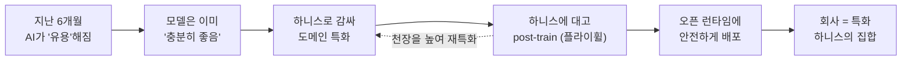

<figure class="post-figure post-figure--header">
<svg role="img" aria-label="오크 대장장이가 범용 LLM 원석을 하니스 갑옷으로 감싸 도메인 특화 슈퍼 에이전트 전사로 벼려내는 대장간 장면" viewBox="0 0 640 300" xmlns="http://www.w3.org/2000/svg">
  <!-- 대장간 바닥선 -->
  <line x1="24" y1="252" x2="616" y2="252" stroke="currentColor" stroke-width="2" opacity="0.35"/>

  <!-- 1) 범용 LLM 원석 (raw gem) -->
  <g>
    <polygon points="86,150 118,128 150,150 118,214 86,150" fill="var(--bg-sunken)" stroke="currentColor" stroke-width="2.5"/>
    <polygon points="86,150 118,128 118,214 86,150" fill="var(--secondary-color)" opacity="0.28"/>
    <line x1="118" y1="128" x2="118" y2="214" stroke="currentColor" stroke-width="1.5" opacity="0.5"/>
    <text x="118" y="240" text-anchor="middle" font-family="sans-serif" font-size="14" fill="currentColor">범용 LLM 원석</text>
  </g>

  <!-- 변형 화살표 1 -->
  <g stroke="var(--accent-color)" stroke-width="3" fill="none">
    <line x1="164" y1="150" x2="204" y2="150"/>
    <polyline points="196,143 206,150 196,157" stroke-linecap="round" stroke-linejoin="round"/>
  </g>

  <!-- 2) 모루 위 하니스 갑옷 (harness armor on anvil) -->
  <g>
    <!-- 모루 -->
    <rect x="238" y="200" width="128" height="18" fill="var(--steel)" stroke="currentColor" stroke-width="2"/>
    <rect x="286" y="218" width="32" height="30" fill="var(--steel)" stroke="currentColor" stroke-width="2"/>
    <polygon points="238,200 216,200 238,182" fill="var(--steel)" stroke="currentColor" stroke-width="2"/>
    <!-- 벼려지는 갑옷 판(하니스) -->
    <rect x="266" y="126" width="72" height="66" rx="4" fill="var(--bg-light)" stroke="currentColor" stroke-width="2.5"/>
    <line x1="266" y1="150" x2="338" y2="150" stroke="currentColor" stroke-width="1.5" opacity="0.5"/>
    <line x1="266" y1="170" x2="338" y2="170" stroke="currentColor" stroke-width="1.5" opacity="0.5"/>
    <circle cx="284" cy="138" r="3" fill="var(--gold)"/>
    <circle cx="320" cy="138" r="3" fill="var(--gold)"/>
    <circle cx="284" cy="182" r="3" fill="var(--gold)"/>
    <circle cx="320" cy="182" r="3" fill="var(--gold)"/>
    <!-- 불꽃 -->
    <polygon points="302,110 296,124 308,124" fill="var(--accent-color)"/>
    <polygon points="290,116 286,126 296,126" fill="var(--gold-bright)" opacity="0.85"/>
    <!-- 망치 -->
    <line x1="360" y1="96" x2="330" y2="138" stroke="currentColor" stroke-width="4" stroke-linecap="round"/>
    <rect x="350" y="80" width="34" height="20" rx="2" fill="var(--steel)" stroke="currentColor" stroke-width="2"/>
    <text x="302" y="240" text-anchor="middle" font-family="sans-serif" font-size="14" fill="currentColor">하니스로 벼리기</text>
  </g>

  <!-- 변형 화살표 2 -->
  <g stroke="var(--accent-color)" stroke-width="3" fill="none">
    <line x1="398" y1="150" x2="438" y2="150"/>
    <polyline points="430,143 440,150 430,157" stroke-linecap="round" stroke-linejoin="round"/>
  </g>

  <!-- 3) 도메인 특화 슈퍼 에이전트 전사 -->
  <g>
    <!-- 머리 -->
    <circle cx="512" cy="118" r="20" fill="var(--orc-green)" stroke="currentColor" stroke-width="2.5"/>
    <!-- 엄니 -->
    <polygon points="504,128 501,138 508,130" fill="var(--bone)" stroke="currentColor" stroke-width="1"/>
    <polygon points="520,128 523,138 516,130" fill="var(--bone)" stroke="currentColor" stroke-width="1"/>
    <!-- 몸통 갑옷 -->
    <rect x="486" y="142" width="52" height="66" rx="4" fill="var(--bg-light)" stroke="currentColor" stroke-width="2.5"/>
    <path d="M486 142 L512 156 L538 142" fill="none" stroke="currentColor" stroke-width="2"/>
    <circle cx="512" cy="176" r="8" fill="var(--accent-color)" opacity="0.85"/>
    <!-- 도끼(고어함마 오마주) -->
    <line x1="556" y1="96" x2="556" y2="210" stroke="currentColor" stroke-width="4" stroke-linecap="round"/>
    <path d="M556 100 q26 8 22 30 q-14 -8 -22 -6 Z" fill="var(--steel)" stroke="currentColor" stroke-width="2"/>
    <text x="512" y="240" text-anchor="middle" font-family="sans-serif" font-size="14" fill="currentColor">특화 슈퍼 에이전트</text>
  </g>
</svg>
<figcaption>범용 LLM 원석 → 하니스로 벼리기 → 도메인 특화 슈퍼 에이전트: 승부는 모델이 아니라 그 모델을 감싸는 하니스에서 갈린다.</figcaption>
</figure>

## 원문 정보

> - **제목**: Jensen Huang: Why companies need open agent systems
> - **출처**: LangChain (YouTube 채널) · 해리슨 체이스(Harrison Chase, LangChain CEO)와 젠슨 황(Jensen Huang, NVIDIA CEO)의 대담
> - **발행**: 2026-07-08 · 약 27분 분량 (영상)
> - **원문 링크**: <https://www.youtube.com/watch?v=Yy3JH6dDugc>

이 대담은 "왜 기업은 **오픈** 에이전트 스택이 필요한가"를 하드웨어·모델·프레임워크의 세 관점이 한자리에서 짚는 드문 자료다. 코딩 에이전트를 만들고 운영하는 실무 관점에서 `Articles/AI-Engineering`에 담는다.

## 한 줄 요약 (TL;DR)

LLM은 '충분히 똑똑'해졌고, 이제 승부는 그 모델을 감싸는 **하니스(harness)**와 그 안에 넣는 **도메인 지식·도구·런타임**에서 갈린다. 오픈 웨이트 모델(Nemotron 3 Ultra)을 오픈 하니스(LangChain Deep Agents) 안에서 벼려 만든 **도메인 특화 슈퍼 에이전트**가 곧 기업의 '왕관 보석(crown jewels)'이 되며, 미래의 회사는 비즈니스 프로세스가 아니라 하니스 위에 세워진다는 것.

## 왜 이 글을 골랐나

이 대담의 논지는 한 줄의 인과 척추로 읽을 수 있다. AI가 유용해진 순간에서 출발해, 회사 자체가 하니스의 집합이 되는 미래로 이어진다.

이 위키에는 이미 하니스를 다룬 글이 여럿 있다. [무엇이 하니스를 하니스로 만드는가](/2026/08/03/what-makes-a-harness-a-harness.html)가 하니스의 **정의(T1–T4)**를, [Codex의 agent loop를 펼쳐 보기](/2026/06/25/codex-agent-loop.html)가 하니스의 **내부 동작**을, [신뢰할 수 있는 Agentic AI 시스템](/2026/06/19/reliable-agentic-ai-systems.html)이 하니스의 **운영 신뢰성**을 다뤘다. 이 대담은 거기에 세 번째 축을 더한다 — **하드웨어·인프라 벤더가 왜 '오픈' 스택에 베팅하는가**, 그리고 그 스택이 기업 조직에 어떤 의미인가.

또 하나, 젠슨 황과 해리슨 체이스는 각각 GPU와 에이전트 프레임워크의 최상류에 있다. 이들이 '모델은 이미 충분히 좋다, 이제 하니스와 컨텍스트가 병목'이라고 한목소리를 낼 때, 그건 마케팅 이상의 신호다. 개발자가 어디에 시간을 쓸지를 가리키는 지도다.

한 가지는 분명히 하고 읽자. 이 영상은 NVIDIA(Nemotron)·LangChain(Deep Agents)의 신제품 블루프린트 발표를 겸한 **홍보성 대담**이다. 벤치마크 수치와 제품 우위 주장은 그 맥락에서 걸러 읽되, 그 아래 깔린 **구조적 관점**은 벤더 중립적으로 새겨볼 가치가 있다.

## 핵심 내용

### "지난 6개월이 모든 걸 바꿨다" — AI가 드디어 '유용'해진 순간

황은 15년간 AI를 해왔지만 "지난 6개월이 모든 것을 바꿨다"고 말한다. 스케일링, 옴니 모델, 멀티모달리티 — 다 훌륭했지만, 그 모든 게 **하나로 합쳐져 AI가 마침내 '유용(useful)'해진 것**이 최근 6개월이라는 진단이다. AI가 유용해지자 세상 모든 기업이 손에 넣고 싶어 하고, 이제 질문은 "그래서 어떻게(how)?"로 바뀌었다.

그 '어떻게'의 답이 하니스다. 황은 LangChain의 궤적을 이렇게 요약한다 — 처음엔 LLM을 **promptable API**로 바꾸는 도구였고, 다음엔 **RAG**를 짓는 데 썼고, 그게 한 걸음씩 오늘의 **에이전트**로 이어졌다. 지난 6개월의 돌파구는 "정보와 지식에 grounding되고, 검색 같은 **도구를 쓰며**, **메모리**를 관리하고, **안전장치(safeguards)**를 갖추고, 일이 끝날 때까지 **반복(iterate)**할 수 있는" agentic 시스템이다. Claude Code가 그 상상력에 불을 붙였고, 여러 조각이 합쳐져 "쾅, 여기까지 왔다".

### 왜 '오픈'인가 — 특화된 지능은 아웃소싱할 수 없다

NVIDIA가 오픈 에이전트 생태계에 투자하는 이유는 단순하다. AI는 **근본 기술(fundamental technology)**이라, 무수히 많은 도메인에 적용돼야만 유용하기 때문이다. 과학자·디지털 생물학자·디자이너·로보틱스 엔지니어·기업 IT — 저마다 외부에 없는 **특화 도메인 지식**을 AI에 심어(imbue) 넣어야 한다. 앤트로픽·OpenAI·구글의 파운데이션 모델은 훌륭하지만, 그 위에 각자의 특화·독점 AI를 지으려면 **오픈 도구**가 필요하다는 논리다.

여기서 이 대담의 가장 날카로운 문장이 나온다.

> "모든 회사는 근본적으로 특화된 지적 재산(intellectual property) 위에 세워진다. 우리가 그걸 '지적' 재산이라 부르는 이유는, 그게 곧 지능(intelligence)이기 때문이다. 당신 회사의 지능이 곧 당신이 누구인가다. 그걸 어떻게 통제하고 개선하지 않을 수 있겠나. 그 지능을 아웃소싱한다는 건 — 개인이든 회사든 국가든 — 내겐 말이 안 된다."

파이썬·C++로 코딩하는 것처럼 **일반 기술(general skill)**은 클라우드의 파운데이션 모델에 맡기되, 그 위에 얹는 **특화 역량**은 회사 안에서 직접 통제·개선해야 한다는 것. 그래서 '오픈'은 이념이 아니라 **통제권(control)**의 문제다.

### 특화의 3층 — 모델 · 하니스 · 컨텍스트

특화는 어디서 일어나는가? 체이스가 "순수하게 모델인가, 아니면 하니스와 바깥 컨텍스트인가"를 묻자 황은 세 층을 모두 짚는다.

<figure class="post-figure">
<svg role="img" aria-label="특화의 3층 구조: 아래에서 위로 모델, 하니스, 컨텍스트·환경 층이 쌓이고, 오른쪽에서 post-training 화살표가 하니스 층을 되먹인다" viewBox="0 0 640 320" xmlns="http://www.w3.org/2000/svg">
  <!-- 3층 스택 -->
  <!-- 3층: 컨텍스트/환경 -->
  <g>
    <rect x="120" y="46" width="360" height="66" rx="4" fill="var(--bg-sunken)" stroke="currentColor" stroke-width="2.5"/>
    <text x="300" y="78" text-anchor="middle" font-family="sans-serif" font-size="17" font-weight="700" fill="currentColor">③ 컨텍스트 · 환경</text>
    <text x="300" y="99" text-anchor="middle" font-family="sans-serif" font-size="13" fill="currentColor" opacity="0.8">하니스에 대고 post-training · 도구 · 정보</text>
  </g>
  <!-- 2층: 하니스 -->
  <g>
    <rect x="120" y="128" width="360" height="66" rx="4" fill="var(--bg-light)" stroke="currentColor" stroke-width="2.5"/>
    <text x="300" y="160" text-anchor="middle" font-family="sans-serif" font-size="17" font-weight="700" fill="var(--accent-color)">② 하니스</text>
    <text x="300" y="181" text-anchor="middle" font-family="sans-serif" font-size="13" fill="currentColor" opacity="0.8">모델을 감싸 도메인 정보에 grounding</text>
  </g>
  <!-- 1층: 모델 -->
  <g>
    <rect x="120" y="210" width="360" height="66" rx="4" fill="var(--bg-light)" stroke="currentColor" stroke-width="2.5"/>
    <text x="300" y="242" text-anchor="middle" font-family="sans-serif" font-size="17" font-weight="700" fill="var(--secondary-color)">① 모델</text>
    <text x="300" y="263" text-anchor="middle" font-family="sans-serif" font-size="13" fill="currentColor" opacity="0.8">'충분히 좋은' 지능 (Nemotron 3 Ultra)</text>
  </g>

  <!-- 토대 라벨 -->
  <text x="300" y="298" text-anchor="middle" font-family="sans-serif" font-size="13" fill="currentColor" opacity="0.6">토대 — 위로 갈수록 회사 고유의 특화</text>

  <!-- 쌓임 화살표(아래→위) -->
  <g stroke="currentColor" stroke-width="2.5" fill="none" opacity="0.6">
    <line x1="90" y1="270" x2="90" y2="70"/>
    <polyline points="83,84 90,70 97,84" stroke-linecap="round" stroke-linejoin="round"/>
  </g>

  <!-- post-training 되먹임: 컨텍스트 → 하니스 -->
  <g stroke="var(--accent-color)" stroke-width="2.5" fill="none">
    <path d="M500 79 C 560 79, 560 161, 500 161"/>
    <polyline points="508,154 500,161 508,168" stroke-linecap="round" stroke-linejoin="round"/>
  </g>
  <text x="566" y="124" text-anchor="middle" font-family="sans-serif" font-size="12" fill="var(--accent-color)" transform="rotate(90 566 124)">환경을 조정</text>
</svg>
<figcaption>특화의 3층 — 모델은 재료(①), 하니스가 감싸 grounding하고(②), 하니스에 대고 post-train해 환경을 조정한다(③). "모델만 조정하는 게 아니라 환경을 조정한다."</figcaption>
</figure>

- **모델**: 우선 "충분히 좋은(good enough)" 지능이 있어야 한다. Nemotron 3 Ultra가 그 출발점.
- **하니스**: 그 모델을 LangChain 프레임워크로 감싸 **도메인 정보에 grounding**한다. "똑똑한 사람도 중요한 정보에 접근할 수 있을 때 초유용해진다"는 비유.
- **컨텍스트/환경**: 나아가 **하니스에 대고 모델을 post-training**해서, 모델이 그 하니스를 잘 다루도록 만든다.

체이스는 실측을 덧붙인다. Deep Agents에서 하니스를 튜닝(모델마다 다른 프롬프트·도구가 필요하다는 발견)하자, 내부 벤치마크에서 Nemotron 3 Ultra가 **86%**까지 올라갔다 — 비교 대상인 Claude Opus가 87%, DeepSeek·Minimax 계열이 82–83%. 그런데 **Opus보다 10배 싸다**. 오픈 웨이트 모델이 성능과 비용의 균형점에 도달하기 시작했다는 것이다. (수치는 발표사 내부 벤치마크임을 감안.)

핵심 통찰은 이 대목이다. **"환경을 조정하는 것이지, 모델만 조정하는 게 아니다."** 프론티어 근처의 모델을, 주변 환경(하니스·도구·정보)을 맞춰줌으로써 **프론티어급 성능으로 끌어올린다**. 인간을 뽑을 때 가장 똑똑한 사람을 뽑는 데 그치지 않고, 도구·정보·환경을 갖춰 잠재력을 끌어내는 것과 같다.

### 비용이 판을 바꾼다 — 싸고 빠르면 더 넓게 탐색한다

비용의 이점은 단순히 싸다는 게 아니다. 황의 논리는 **탐색 공간(search space)**이다. 지능이 저렴하면 사람들은 더 많이 쓰고, 에이전트가 저렴하면 **더 넓은 탐색 공간을 반복**할 수 있어 **답 자체가 더 좋아진다**. Nemotron이 저렴한 건 빠르고 연산 효율이 높기 때문이고, 빠르게 생각할수록 더 많은 공간을 탐색해 더 나은 답을 찾는다 — "사람이 빨리 생각하면 더 많은 걸 시도해볼 수 있는 것과 같다".

체이스도 자신이 과소평가했던 것으로 "지능과 토큰에 대한 수요의 크기"를 꼽는다. 모델이 좋아지고 빠르고 싸질수록 시장은 오히려 폭발적으로 커진다는 것.

### 프론티어에서 시작해서 특화로 — 슈퍼 서브 에이전트

그럼 오픈 모델만 쓰면 되나? 황의 답은 "아니오, 상보적"이다. 그의 실전 원칙은 **"나는 언제나 프론티어에서 시작한다"** — Claude Code, Codex로 가능한 한 오래 간다. 잠재력을 알 수 있고, 돈은 조금 더 들어도 **일을 끝내는 시간이 빠르기** 때문이다.

그러다 특정 지점에서 **서브 에이전트**를 붙인다. NVIDIA 내부의 공급망 최적화, 칩 설계·플로어플래닝 최적화 같은 문제는 범용 AI가 크런칭해서 좋은 답을 낼 수 있는 게 아니다. 그래서 **한 가지 일만을 위한 '슈퍼 서브 에이전트'**를 Deep Agents + Nemotron 3로 만들고 전용 도구에 연결한다. "그 슈퍼 에이전트는 내 여행 예약 따위를 하려는 게 아니다. 오직 공급망 최적화만 한다." 언제 특화하냐는 질문에 대한 답은 **"충분히 좋아지는 즉시(as soon as it gets good enough)"**.

### "미래의 회사는 하니스 위에 세워진다"

이 대담의 큰 그림.

> "오늘 대부분의 회사는 **비즈니스 프로세스** 위에 세워져 있다. 미래에 대부분의 회사는 **하니스** 위에 세워질 것이다."

과거의 워크플로가 하니스로 표현되고, 그 하니스 안에서 워크플로가 **자율적·agentic**으로 바뀌어 훨씬 효율적이 된다. LangChain은 그렇게 **회사의 운영체제(operating system)를 만드는 도구**가 된다는 주장이다. 회사란 결국 "특화되고 중요한 워크플로들의 집합"이므로.

그리고 여기서 완전히 새로운 능력이 등장한다. 하니스가 다 지어지고 비즈니스 프로세스의 일부로 잘 돌아가기 시작하면, 이제 **하니스에 대고 LLM(Nemotron 3 Ultra)을 post-training**해서 시스템 전체의 천장을 높일 수 있다. "이전엔 존재하지 않던 능력"이자 플라이휠을 진짜로 돌리기 시작하는 지점이라는 것.

### 런타임과 거버넌스 — AI를 위한 'HR 시스템'

빌드가 끝나도 **런타임**이 남는다. 샌드박스에 넣어 안전·프라이빗하게, 접근 제어(access control)를 걸어 IT 조직이 통제할 수 있게 해야 한다. 황은 단언한다 — **"보안과 접근 제어를 풀지 못하면 배포는 불가능하다."**

비유가 인상적이다. 신입 직원을 온보딩 없이, 접근 권한 없이 채용할 수 없듯, 에이전트도 **직무·책임에 따라** 도구·네트워크·정보 접근 권한을 부여하고, 다른 에이전트·동료와 연결하고, "이게 네 미션이고, 이건 과거에 이렇게 해왔으니 더 잘해봐라"는 **스킬 파일(문서)**을 준다. 그래서 이들이 만드는 건 결국 **AI를 위한 HR 시스템** — IT 조직과 각 사업부가 사내 에이전트를 짓고·개선하고·배포하게 해주는 체계다.

오늘의 발표가 이걸 겨눈다. Deep Agents + Nemotron 3 Ultra를 **OpenShell(보안·오픈 런타임)** 안에서 돌리는 블루프린트를 NeMo 블루프린트로 제공한다는 것. 블루프린트에 그렇게 투자하는 이유는 "도구들이 아직 난해(arcane)하고 조각이 너무 많기 때문" — LLM, 도구, 지식 그래프, 메모리, 가드레일, 파인튜닝, 하니스에 대고 하는 post-training, 그리고 런타임까지.

### 에이전트를 얼마나 의인화할 것인가

체이스가 던진 철학적 질문 — 우리는 에이전트를 인간 시스템 안으로 끌어들이며 지나치게 의인화하는데, 에이전트는 인간이 아니다. 어디까지 의인화해야 하나?

황의 답은 단호하다. **"그건 전자(electrons)지 원자(atoms)가 아니다."** 생물학적이지 않고, 의식도 없고, 깨어 있지도 않다. 집 안을 돌아다니는 진공청소기, 자율 잔디깎이, 100년 전 처음 등장한 식기세척기 같은 **도구**일 뿐이라는 것. (황 자신의 첫 직업이 접시닦이였다는 농담을 곁들인다.) 지금 우리는 너무 많은 인간적 속성을 부여하지만, 그건 소프트웨어이고 컴퓨터다 — **"우리가 하니스를 직접 만들었으니 어떻게 작동하는지 정확히 안다. 작동 원리를 모르면 어떻게 매번 더 좋게 만들고, 고치겠나."**

### AI를 더 쓸수록 사람을 더 뽑는다

역설처럼 들리지만 황의 관찰은 "AI를 더 쓸수록 사람을 더 뽑게 된다"이다. agentic 시스템 자체가 새로운 기술 영역이라, 이제 소프트웨어 엔지니어들이 **에이전트를 짓는다**. 예전엔 코드를 쳤지만 이제 에이전트를, eval을, 벤치마크를, 가드레일을 만든다. "코딩은 타이핑 같은 것"이라 타이핑은 줄고, 대신 더 **시스템 엔지니어**가 되어 자율 시스템을 설계·창조한다. 그리고 그의 엔지니어들은 파이썬을 치기보다 이쪽을 훨씬 좋아한다고.

**eval**은 여기서 핵심 조각으로 짚힌다. 잘하고 있는지 정량화하는 일은 이미 사내에 있는 **주제 전문가(subject matter expert)**가 가장 잘한다 — 지루한 부분을 자동화하고 지적으로 자극적인·창의적인 부분에 시간을 쓰게 하는 방향으로.

마무리에서 두 사람이 합의하는 지점. 오늘의 최고 사용례는 대개 "과거에 하던 일을 자동화하는" 것이지만, 진짜 잠금 해제는 **"이전엔 할 수 없던 일을 이제 할 수 있게 되는 것"**에서 온다. 필요한 건 **야망(ambition)과 주도성(agency)**이다.

## 분석과 인사이트

**"모델을 조정하는 게 아니라 환경을 조정한다"가 이 대담의 진짜 명제다.** 이 위키가 하니스 시리즈에서 반복해온 주장 — 모델은 재료일 뿐이고 [무엇이 하니스를 하니스로 만드는가](/2026/08/03/what-makes-a-harness-a-harness.html)에서 정의한 T1–T4 조건과 컨텍스트가 성패를 가른다 — 을 GPU와 프레임워크의 최상류에 있는 두 사람이 재확인한다. 86% vs 87%라는 숫자보다 중요한 건, **"환경을 맞추면 프론티어 근처 모델을 프론티어급으로 만들 수 있다"**는 구조적 주장이다. 이건 벤더 중립적으로 참일 가능성이 높고, 실무자에게는 "모델 갈아끼우기 전에 하니스부터 튜닝하라"는 우선순위를 준다.

**단, 홍보 대담이라는 프레임을 잊으면 안 된다.** "미래의 회사는 하니스 위에 세워진다"는 곧 "모두가 LangChain을 쓴다"로, "특화 지능은 아웃소싱 못 한다"는 곧 "오픈 웨이트 Nemotron을 사내에서 돌려라"로 착지한다. 논리는 견고하지만 결론이 두 발표사의 제품으로 수렴하는 건 우연이 아니다. 벤치마크는 **발표사 내부 지표**이고, 10배 저렴하다는 비용 우위도 워크로드·물량에 따라 달라진다. 관점은 취하되 수치는 스스로 검증할 일이다.

**가장 값진 통찰은 '왕관 보석' 프레임이다.** "당신 회사의 지능이 곧 당신이 누구인가"라는 문장은 이 위키의 [데이터가 당신의 유일한 해자다](/2026/07/20/data-is-your-only-moat.html)와 정확히 같은 곳을 가리킨다 — 파운데이션 모델은 상품(commodity)이 되고, 해자는 **아무도 접근할 수 없는 도메인 지식·프로세스를 감싼 특화 시스템**에서 나온다. 황은 이걸 "슈퍼 서브 에이전트"라는 구체적 형태로 준다: 한 가지 일만 하는, 독점 도구에 연결된, 전담 팀이 벼리는 에이전트.

**"프론티어에서 시작해 특화로 내려간다"는 실전 워크플로가 특히 유용하다.** 처음부터 오픈 모델·자체 하니스로 시작하는 건 흔한 실수다. 황의 순서 — (1) 프론티어(Claude Code/Codex)로 가능성과 상한을 빠르게 확인하고, (2) 반복되고 도메인 특화적인 병목에서만 서브 에이전트로 특화하고, (3) 그 하니스가 안정되면 하니스에 대고 모델을 post-train — 은 [AI는 왜 엔지니어를 대체하지 못했나](/2026/06/19/ai-hasnt-replaced-engineers.html)가 말한 "decide-execute-deliver" 층위와도 맞물린다. 값비싼 프론티어는 탐색·판단에, 저렴한 특화 모델은 반복 실행에.

**'HR 시스템'과 '전자 vs 원자' 비유는 균형추다.** 접근 제어 없는 배포는 불가능하다는 말은 실무의 진실이다 — 에이전트 파일럿이 프로덕션에서 죽는 지점이 대개 여기다. 동시에 "의식 없는 도구, 전자이지 원자가 아니다"라는 반(反)의인화는 [made out of weights](/2026/06/19/made-out-of-weights.html) 같은 에세이의 신비화 경향에 대한 실용주의적 제동이다. 다만 "우리가 하니스를 만들었으니 정확히 어떻게 작동하는지 안다"는 대목은 절반만 맞다. 하니스의 배선은 알아도, 그 안에서 도는 LLM의 추론은 여전히 상당 부분 불투명하다. 여기서 황은 자기 관할(하니스)의 투명성을 시스템 전체의 투명성으로 살짝 넘겨 말한다.

**"AI를 더 쓸수록 사람을 더 뽑는다"는 위안이지만 주의해서 읽자.** NVIDIA는 AI 붐의 최대 수혜 기업이라 고용을 늘릴 여력과 이유가 남다르다. 이걸 산업 전반의 법칙으로 일반화하긴 이르다. 그래도 "엔지니어가 코드 타이핑에서 에이전트·eval·가드레일 설계로 이동한다"는 방향성은 [control the ideas, not the code](/2026/08/12/control-the-ideas-not-the-code.html)가 짚은 역할 이동과 정확히 같다. 타이핑의 가치는 떨어지고, 시스템을 짓고 검증하는 판단의 가치가 오른다.

## 적용 포인트

- **모델을 갈아끼우기 전에 하니스부터 튜닝하라.** 같은 오픈 모델도 프롬프트·도구를 그 모델에 맞추면 벤치마크가 크게 오른다("모델마다 다른 프롬프트·도구가 필요하다"). 성능이 아쉬울 때 첫 수는 더 비싼 모델이 아니라 환경 조정이다.
- **프론티어에서 시작하라.** 새 문제는 Claude Code/Codex 같은 프론티어로 상한과 가능성을 먼저 확인하고, **반복적·도메인 특화적 병목에서만** 저렴한 오픈 모델로 특화한다. 처음부터 자체 스택을 짓지 말 것.
- **특화 시점의 트리거는 '충분히 좋아지는 즉시'.** 오픈 웨이트 모델이 그 태스크에서 프론티어 근처에 오면, 비용(10배 격차)과 통제권을 이유로 특화를 검토한다.
- **'슈퍼 서브 에이전트'로 좁게 만들어라.** 만능 에이전트 대신, 한 가지 독점 워크플로(당신 회사의 '왕관 보석')만 하는 전용 에이전트를 독점 도구·지식에 연결한다.
- **런타임·접근 제어를 처음부터 설계하라.** 샌드박스·access control·거버넌스는 나중 문제가 아니다. 에이전트를 '신입 직원 온보딩'처럼 다뤄, 직무에 필요한 도구·데이터·권한만 부여하는 스킬 파일을 준다.
- **eval을 주제 전문가에게 맡겨라.** 에이전트가 잘하는지 정량화하는 일은 사내 도메인 전문가가 가장 잘한다. eval·벤치마크·가드레일을 만드는 것 자체가 새 엔지니어링 직무다.
- **'자동화'를 넘어 '이전엔 못 하던 일'을 겨눠라.** 과거 업무의 자동화는 시작일 뿐이다. 진짜 레버리지는 야망과 주도성으로 새 가능성을 여는 데서 나온다.

## 마무리

두 사람이 그리는 미래는 "프론티어냐 오픈이냐"의 양자택일이 아니라 **상보적 그림**이다. 클라우드의 범용 파운데이션 모델은 계속 쓰되, 그 위에 각 회사가 자기 지능 — 도메인 지식·프로세스·독점 도구를 감싼 특화 슈퍼 에이전트 — 을 오픈 스택으로 직접 짓고 통제한다. 홍보 대담이라는 프레임을 걷어내도 남는 명제는 분명하다. **모델은 상품이 되고, 승부는 하니스와 컨텍스트와 런타임에서 갈리며, 그 특화된 지능이 곧 회사의 정체성이다.** 이 위키가 하니스 시리즈에서 반복해온 주장을, 산업의 최상류가 다른 언어로 다시 확인해준 셈이다.

### 더 읽어보기

- [원문 영상 — Jensen Huang: Why companies need open agent systems (LangChain)](https://www.youtube.com/watch?v=Yy3JH6dDugc)
- [무엇이 하니스를 하니스로 만드는가](/2026/08/03/what-makes-a-harness-a-harness.html) — 이 대담이 전제하는 '하니스'의 필요충분조건(T1–T4) 정의
- [Codex의 agent loop를 펼쳐 보기](/2026/06/25/codex-agent-loop.html) — 하니스가 LLM·도구·컨텍스트를 실제로 오케스트레이션하는 내부 동작
- [신뢰할 수 있는 Agentic AI 시스템 만들기](/2026/06/19/reliable-agentic-ai-systems.html) — context·harness 엔지니어링으로 프로덕션 신뢰성을 만드는 사례
- [데이터가 당신의 유일한 해자다](/2026/07/20/data-is-your-only-moat.html) — '특화 지능은 아웃소싱 못 한다'와 같은 곳을 가리키는 해자·플라이휠 논의
- [AI는 왜 소프트웨어 엔지니어를 대체하지 못했나](/2026/06/19/ai-hasnt-replaced-engineers.html) — 프론티어(판단)와 특화(실행)를 나누는 decide-execute-deliver 프레임
- [control the ideas, not the code](/2026/08/12/control-the-ideas-not-the-code.html) — 엔지니어 역할이 타이핑에서 시스템·검증 설계로 이동하는 흐름
