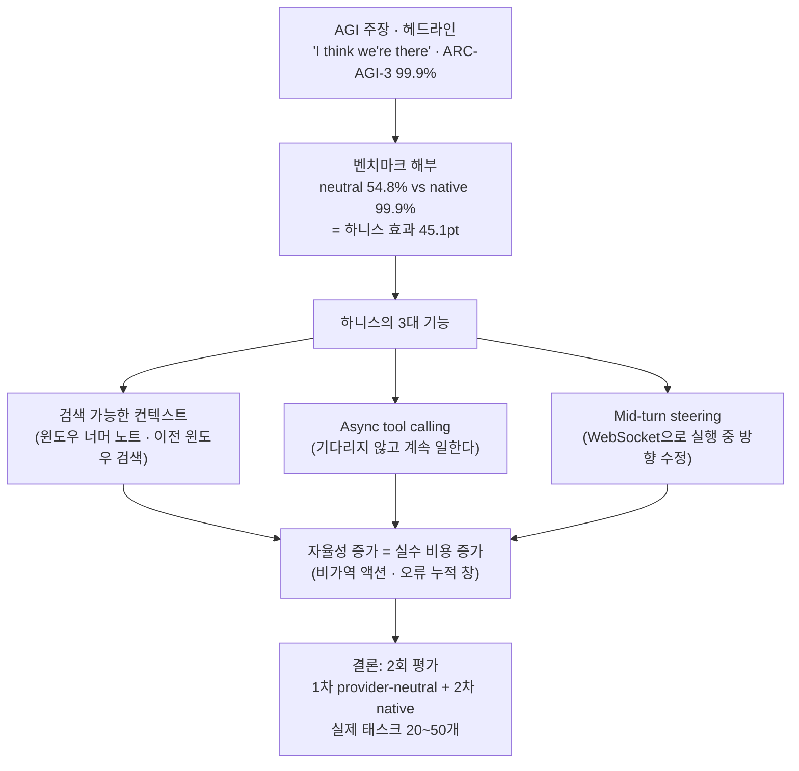

<figure class="post-figure post-figure--header">
<svg role="img" aria-label="같은 GPT-6 모델이 두 장면으로 대비된다. 왼쪽은 맨몸의 모델이 54.8% 깃발 앞에서 멈춰 있고 100% 목표는 흐릿하게 멀리 있다. 오른쪽은 메모리·도구·컨텍스트·제어 4개 부품을 갖춘 하니스 수레에 실린 같은 모델이 99.9% 깃발까지 도달했다. 가운데에는 '같은 모델, 가중치는 동일, 하니스만 다르다'는 연결선과 '격차 45.1pt'가 표시된다." viewBox="0 0 680 340" xmlns="http://www.w3.org/2000/svg">
  <title>같은 모델, 다른 하니스 — 맨몸 54.8% vs 4-부품 하니스 탑재 99.9%</title>

  <!-- ===== LEFT: 맨몸의 모델 (provider-neutral) ===== -->
  <text x="174" y="30" text-anchor="middle" font-size="11" fill="currentColor" font-weight="700" opacity="0.8">맨몸의 모델 · provider-neutral 하니스</text>
  <line x1="36" y1="266" x2="312" y2="266" stroke="currentColor" stroke-width="2"/>
  <!-- 흐릿한 100% 목표 -->
  <line x1="296" y1="206" x2="296" y2="266" stroke="currentColor" stroke-width="1.6" stroke-dasharray="3 4" opacity="0.3"/>
  <polygon points="296,206 324,216 296,226" fill="none" stroke="currentColor" stroke-width="1.4" opacity="0.3"/>
  <text x="304" y="196" text-anchor="middle" font-size="9" fill="currentColor" opacity="0.45">100%</text>
  <!-- 모델 -->
  <circle cx="180" cy="238" r="26" fill="var(--bg-light)" stroke="currentColor" stroke-width="2"/>
  <text x="180" y="243" text-anchor="middle" font-size="11.5" fill="currentColor" font-weight="700">GPT-6</text>
  <text x="180" y="292" text-anchor="middle" font-size="9.5" fill="currentColor" opacity="0.6">여기서 멈춘다</text>
  <!-- 54.8% 깃발 -->
  <line x1="224" y1="196" x2="224" y2="266" stroke="currentColor" stroke-width="2"/>
  <polygon points="224,196 258,207 224,218" fill="var(--accent-color)"/>
  <text x="232" y="188" text-anchor="middle" font-size="12" fill="var(--accent-color)" font-weight="700">54.8%</text>

  <!-- ===== CENTER: 같은 모델 ===== -->
  <line x1="340" y1="44" x2="340" y2="300" stroke="currentColor" stroke-width="1.4" stroke-dasharray="3 7" opacity="0.3"/>
  <text x="340" y="64" text-anchor="middle" font-size="11" fill="var(--secondary-color)" font-weight="700">같은 모델</text>
  <text x="340" y="79" text-anchor="middle" font-size="9" fill="currentColor" opacity="0.65">가중치는 동일 · 하니스만 다르다</text>
  <path d="M 206 226 C 280 112, 400 108, 487 170" fill="none" stroke="currentColor" stroke-width="1.4" stroke-dasharray="4 5" opacity="0.4"/>
  <text x="340" y="324" text-anchor="middle" font-size="12" fill="var(--accent-color)" font-weight="700">격차 45.1pt — 모델이 아니라 하니스의 성적</text>

  <!-- ===== RIGHT: 하니스 탑재 (OpenAI adapter) ===== -->
  <text x="508" y="30" text-anchor="middle" font-size="11" fill="currentColor" font-weight="700" opacity="0.8">같은 모델 + 하니스 · OpenAI adapter</text>
  <line x1="368" y1="266" x2="648" y2="266" stroke="currentColor" stroke-width="2"/>
  <!-- 속도선 -->
  <line x1="392" y1="196" x2="422" y2="196" stroke="currentColor" stroke-width="1.6" opacity="0.35"/>
  <line x1="384" y1="216" x2="422" y2="216" stroke="currentColor" stroke-width="1.6" opacity="0.35"/>
  <line x1="392" y1="236" x2="422" y2="236" stroke="currentColor" stroke-width="1.6" opacity="0.35"/>
  <!-- 하니스 수레 -->
  <rect x="432" y="148" width="150" height="104" rx="8" fill="var(--bg-panel)" stroke="var(--accent-color)" stroke-width="2.4"/>
  <circle cx="507" cy="186" r="22" fill="var(--bg-light)" stroke="currentColor" stroke-width="2"/>
  <text x="507" y="191" text-anchor="middle" font-size="10.5" fill="currentColor" font-weight="700">GPT-6</text>
  <rect x="437" y="222" width="33" height="20" rx="4" fill="var(--bg-light)" stroke="currentColor" stroke-width="1.2"/>
  <text x="453.5" y="235" text-anchor="middle" font-size="8" fill="currentColor" font-weight="700">메모리</text>
  <rect x="474" y="222" width="33" height="20" rx="4" fill="var(--bg-light)" stroke="currentColor" stroke-width="1.2"/>
  <text x="490.5" y="235" text-anchor="middle" font-size="8" fill="currentColor" font-weight="700">도구</text>
  <rect x="511" y="222" width="33" height="20" rx="4" fill="var(--bg-light)" stroke="currentColor" stroke-width="1.2"/>
  <text x="527.5" y="235" text-anchor="middle" font-size="7.5" fill="currentColor" font-weight="700">컨텍스트</text>
  <rect x="548" y="222" width="33" height="20" rx="4" fill="var(--bg-light)" stroke="currentColor" stroke-width="1.2"/>
  <text x="564.5" y="235" text-anchor="middle" font-size="8" fill="currentColor" font-weight="700">제어</text>
  <circle cx="462" cy="258" r="9" fill="var(--bg-light)" stroke="currentColor" stroke-width="2"/>
  <circle cx="552" cy="258" r="9" fill="var(--bg-light)" stroke="currentColor" stroke-width="2"/>
  <text x="507" y="292" text-anchor="middle" font-size="9.5" fill="currentColor" opacity="0.6">하니스 = 런타임 레이어</text>
  <!-- 99.9% 깃발 -->
  <line x1="622" y1="176" x2="622" y2="266" stroke="currentColor" stroke-width="2"/>
  <polygon points="622,176 656,187 622,198" fill="var(--gold)"/>
  <text x="616" y="168" text-anchor="middle" font-size="13" fill="var(--secondary-color)" font-weight="700">99.9%</text>
</svg>
<figcaption>같은 모델, 다른 하니스 — 맨몸의 GPT-6는 54.8%에서 멈추고, 메모리·도구·컨텍스트·제어를 갖춘 하니스에 실린 같은 모델은 99.9%에 도달한다. 격차 45.1pt는 하니스의 성적이다.</figcaption>
</figure>

## 원문 정보

> - **제목**: GPT-6 Astra: the harness is the product
> - **출처**: Few-Shot Academy, Mangat Rai ([fewshotacademy.com](https://fewshotacademy.com))
> - **발행**: 2026-09-04 · 약 8분 분량
> - **원문 링크**: <https://fewshotacademy.com/blog/gpt-6-astra-the-harness-is-the-product>

GPT-6 Astra 릴리스를 둘러싼 AGI 담론에서 한 발 물러나, "진짜 제품은 모델이 아니라 하니스"라는 이 위키의 오랜 관심사를 벤치마크 숫자로 뒷받침하는 글이라 `Articles/AI-Engineering`에 담는다.

## 한 줄 요약 (TL;DR)

GPT-6 Astra의 핵심 혁신은 모델 자체가 아니라 메모리·도구·컨텍스트·제어 루프를 통합한 **런타임 하니스**이며, 같은 모델이 하니스에 따라 ARC-AGI-3에서 54.8% vs 99.9%로 갈리는 45.1포인트 격차가 그 증거다 — 그러니 모델을 평가할 때는 provider-neutral 하니스와 native 하니스로 **두 번** 평가하라.

## 왜 이 글을 골랐나

이 위키에는 이미 하니스를 다룬 글이 여럿 있다. [하니스의 필요충분조건을 정의한 논문 분석](/2026/08/03/what-makes-a-harness-a-harness.html), [Codex agent loop의 내부를 펼쳐 본 글](/2026/06/25/codex-agent-loop.html), [loop engineering](/2026/06/19/loop-engineering.html)까지 — 모두 "LLM을 에이전트로 만드는 것은 모델 바깥의 시스템"이라는 같은 방향을 가리킨다.

이 글이 특별한 이유는 그 주장을 **정량적으로** 보여주기 때문이다. 같은 모델, 같은 벤치마크(ARC-AGI-3)에서 하니스만 바꿨을 뿐인데 54.8%와 99.9%라는 45.1포인트의 격차가 벌어졌다. "하니스는 배관(plumbing)이 아니다"라는 명제가 이 숫자 하나로 논쟁의 여지 없이 입증된다. 또 하나 — AGI 선언과 벤치마크 점수가 헤드라인을 장악하는 릴리스 주간에, 실무자가 실제로 봐야 할 것(컨텍스트 시스템, async 실행, 평가 방법론)을 골라내는 시선 자체가 배울 만하다.

### 한눈에 보기

글의 척추 — 헤드라인의 AGI 주장에서 출발해 벤치마크를 해부하고, 그 격차를 만든 하니스의 기능과 트레이드오프를 거쳐 2회 평가라는 실무 결론에 도달하는 흐름이다.

## 핵심 내용

### AGI 주장은 증거보다 앞서 있다

OpenAI의 Greg Brockman은 AGI 여부에 대해 "I think we're there"라고 말했고, Astra는 FrontierMath Tier 4에서 98%, ARC-AGI-3에서 99.9%를 기록했다. 그러나 저자는 이 벤치마크들이 **결정론적 환경**에서 측정된다는 점을 짚는다. 실제 업무는 훨씬 지저분하다. 저자의 결론: Astra는 범용 디지털 워커로 가는 진전이지, 증명된 AGI가 아니다.

### 가장 큰 숫자는 사실 하니스의 성적이다

<figure class="post-figure">
<svg role="img" aria-label="동일 모델의 ARC-AGI-3 점수 해부 막대그래프. 위 막대는 provider-neutral 표준 하니스로 54.8%, 아래 막대는 OpenAI adapter 하니스로 99.9%. adapter 막대 위에는 reasoning state 보존과 compaction 두 부품이 표시되고, 두 막대 끝 사이의 차이 45.1포인트가 '하니스 효과'로 강조된다. 각 막대 아래에는 두 점수가 답하는 서로 다른 질문 — 모델 간 비교, 실제 배포 시스템의 성능 — 이 적혀 있다." viewBox="0 0 680 300" xmlns="http://www.w3.org/2000/svg">
  <title>ARC-AGI-3 점수 해부 — 같은 모델, 두 하니스, 45.1pt의 하니스 효과</title>
  <defs>
    <marker id="sc-gap-head" markerWidth="9" markerHeight="9" refX="7" refY="3" orient="auto">
      <path d="M0 0 L7 3 L0 6 z" fill="var(--accent-color)"/>
    </marker>
  </defs>

  <text x="340" y="24" text-anchor="middle" font-size="11" fill="currentColor" font-weight="700" opacity="0.8">ARC-AGI-3 · high reasoning — 같은 모델, 두 하니스</text>

  <!-- 100% 기준선 -->
  <line x1="610" y1="44" x2="610" y2="196" stroke="currentColor" stroke-width="1.2" stroke-dasharray="3 4" opacity="0.3"/>
  <text x="610" y="40" text-anchor="middle" font-size="9" fill="currentColor" opacity="0.5">100%</text>

  <!-- Bar 1: provider-neutral -->
  <text x="160" y="70" text-anchor="end" font-size="11" fill="currentColor" font-weight="700">provider-neutral</text>
  <text x="160" y="84" text-anchor="end" font-size="9" fill="currentColor" opacity="0.65">표준 하니스</text>
  <rect x="170" y="56" width="241" height="32" fill="currentColor" opacity="0.22"/>
  <rect x="170" y="56" width="241" height="32" fill="none" stroke="currentColor" stroke-width="1.6"/>
  <text x="419" y="77" text-anchor="start" font-size="12" fill="currentColor" font-weight="700">54.8%</text>
  <text x="170" y="108" text-anchor="start" font-size="10" fill="var(--secondary-color)" font-weight="700">→ 답하는 질문: 모델 간 비교 (모델 쇼핑)</text>

  <!-- Bar 2: OpenAI adapter -->
  <text x="160" y="146" text-anchor="end" font-size="11" fill="currentColor" font-weight="700">OpenAI adapter</text>
  <text x="160" y="160" text-anchor="end" font-size="9" fill="currentColor" opacity="0.65">native 하니스</text>
  <rect x="170" y="132" width="440" height="32" fill="var(--secondary-color)" opacity="0.35"/>
  <rect x="170" y="132" width="440" height="32" fill="none" stroke="var(--secondary-color)" stroke-width="2"/>
  <text x="606" y="126" text-anchor="end" font-size="12" fill="var(--secondary-color)" font-weight="700">99.9%</text>
  <!-- adapter의 두 부품 -->
  <rect x="192" y="138" width="152" height="20" rx="4" fill="var(--bg-panel)" stroke="currentColor" stroke-width="1.2"/>
  <text x="268" y="151.5" text-anchor="middle" font-size="9.5" fill="currentColor" font-weight="700">reasoning state 보존</text>
  <rect x="356" y="138" width="104" height="20" rx="4" fill="var(--bg-panel)" stroke="currentColor" stroke-width="1.2"/>
  <text x="408" y="151.5" text-anchor="middle" font-size="9.5" fill="currentColor" font-weight="700">compaction</text>
  <text x="170" y="184" text-anchor="start" font-size="10" fill="var(--secondary-color)" font-weight="700">→ 답하는 질문: 실제 배포 시스템의 성능 (배포 결정)</text>

  <!-- 격차 45.1pt -->
  <line x1="411" y1="94" x2="411" y2="208" stroke="var(--accent-color)" stroke-width="1.2" stroke-dasharray="3 4" opacity="0.7"/>
  <line x1="610" y1="196" x2="610" y2="208" stroke="var(--accent-color)" stroke-width="1.2" stroke-dasharray="3 4" opacity="0.7"/>
  <line x1="418" y1="208" x2="602" y2="208" stroke="var(--accent-color)" stroke-width="1.8" marker-end="url(#sc-gap-head)"/>
  <line x1="602" y1="208" x2="418" y2="208" stroke="var(--accent-color)" stroke-width="1.8" marker-end="url(#sc-gap-head)"/>
  <text x="510" y="228" text-anchor="middle" font-size="12" fill="var(--accent-color)" font-weight="700">하니스 효과 +45.1pt</text>

  <text x="340" y="262" text-anchor="middle" font-size="11" fill="currentColor" opacity="0.75" font-style="italic">"One score cannot answer both questions."</text>
  <text x="340" y="280" text-anchor="middle" font-size="9.5" fill="currentColor" opacity="0.6">한 점수는 두 질문에 동시에 답할 수 없다</text>
</svg>
<figcaption>동일 모델의 ARC-AGI-3 점수 해부 — reasoning state 보존과 compaction이라는 하니스 설계만으로 45.1pt가 벌어지고, 두 점수는 서로 다른 질문(모델 비교 vs 배포 성능)에 답한다.</figcaption>
</figure>

이 글의 심장부다. ARC-AGI-3 점수를 해부하면:

- **표준(provider-neutral) 하니스**: 54.8% (high reasoning)
- **OpenAI provider adapter 하니스**: 99.9% (high reasoning)
- **격차: 45.1포인트**

어댑터가 한 일은 opaque reasoning state(불투명한 추론 상태)를 보존하고 대화를 compaction한 것이다. 저자는 두 점수가 서로 다른 질문에 답한다고 정리한다 — native 하니스는 "실제 배포 시스템의 성능"을, neutral 하니스는 "모델 간 비교"를 측정한다. **"One score cannot answer both questions."**

### 새 컨텍스트 시스템이 주목할 기능이다

1,050,000 토큰 컨텍스트 윈도우도 결국 용량 한계에 부딪히고, compaction은 대화를 요약하면서 중요한 디테일을 잃을 위험이 있다. 새 Codex 기능은 에이전트가 **컨텍스트 윈도우를 넘어 노트를 유지하고, 이전 윈도우를 검색**할 수 있게 한다. 검색 가능한 히스토리는 긴 작업 도중 초기 요구사항을 되살릴 수 있게 해 준다. 다만 출시 시점 기준 실험적 기능이며 신뢰성은 미확인이라고 저자는 단서를 단다.

### 작업이 바뀌는 동안에도 Astra는 계속 일한다

<figure class="post-figure">
<svg role="img" aria-label="두 실행 모델의 타임라인 대비. 위: request-response — 사용자가 요청을 보내고 모델이 실행하는 동안 대기만 하다가 응답을 받는 일직선 흐름으로, 개입은 다음 요청에서만 가능하다. 아래: supervised process — 에이전트 타임라인이 계속 흐르는 동안 async tool call이 아래 도구 레인으로 갈라져 나갔다가 결과가 회수되고, 사용자는 실행 도중 WebSocket으로 mid-turn steering을 걸어 방향을 수정한다. 타임라인 위의 X 표시는 완료된 액션은 되돌릴 수 없고 진행 중 도구는 중단할 수 없는 비가역 지점이다." viewBox="0 0 680 370" xmlns="http://www.w3.org/2000/svg">
  <title>Request–Response vs Supervised Process — async tool call · mid-turn steering · 비가역 지점</title>
  <defs>
    <marker id="tl-head" markerWidth="9" markerHeight="9" refX="7" refY="3" orient="auto">
      <path d="M0 0 L7 3 L0 6 z" fill="currentColor"/>
    </marker>
    <marker id="tl-head-sec" markerWidth="9" markerHeight="9" refX="7" refY="3" orient="auto">
      <path d="M0 0 L7 3 L0 6 z" fill="var(--secondary-color)"/>
    </marker>
    <marker id="tl-head-acc" markerWidth="9" markerHeight="9" refX="7" refY="3" orient="auto">
      <path d="M0 0 L7 3 L0 6 z" fill="var(--accent-color)"/>
    </marker>
  </defs>

  <!-- ===== ① Request–Response ===== -->
  <text x="24" y="32" font-size="11" fill="currentColor" font-weight="700">① Request–Response — 일직선</text>
  <rect x="50" y="56" width="70" height="32" rx="4" fill="var(--bg-light)" stroke="currentColor" stroke-width="1.6"/>
  <text x="85" y="77" text-anchor="middle" font-size="10" fill="currentColor" font-weight="700">사용자</text>
  <line x1="124" y1="72" x2="204" y2="72" stroke="currentColor" stroke-width="1.8" marker-end="url(#tl-head)"/>
  <text x="164" y="64" text-anchor="middle" font-size="9" fill="currentColor" opacity="0.7">요청</text>
  <rect x="210" y="56" width="100" height="32" rx="4" fill="var(--bg-light)" stroke="currentColor" stroke-width="1.6"/>
  <text x="260" y="77" text-anchor="middle" font-size="10" fill="currentColor" font-weight="700">모델 실행</text>
  <line x1="314" y1="72" x2="394" y2="72" stroke="currentColor" stroke-width="1.8" marker-end="url(#tl-head)"/>
  <text x="354" y="64" text-anchor="middle" font-size="9" fill="currentColor" opacity="0.7">응답</text>
  <rect x="400" y="56" width="70" height="32" rx="4" fill="var(--bg-light)" stroke="currentColor" stroke-width="1.6"/>
  <text x="435" y="77" text-anchor="middle" font-size="10" fill="currentColor" font-weight="700">사용자</text>
  <text x="500" y="77" text-anchor="start" font-size="9.5" fill="currentColor" opacity="0.65">실행 중엔 대기만 —</text>
  <text x="500" y="91" text-anchor="start" font-size="9.5" fill="currentColor" opacity="0.65">개입은 다음 요청에서</text>

  <line x1="24" y1="120" x2="656" y2="120" stroke="currentColor" stroke-width="1" stroke-dasharray="4 6" opacity="0.25"/>

  <!-- ===== ② Supervised Process ===== -->
  <text x="24" y="150" font-size="11" fill="currentColor" font-weight="700">② Supervised Process — Astra의 실행 모델</text>

  <!-- 레인 가이드 -->
  <text x="88" y="199" text-anchor="end" font-size="10" fill="currentColor" font-weight="700" opacity="0.7">사용자</text>
  <line x1="96" y1="195" x2="645" y2="195" stroke="currentColor" stroke-width="1" opacity="0.18"/>
  <text x="88" y="269" text-anchor="end" font-size="10" fill="currentColor" font-weight="700" opacity="0.7">에이전트</text>
  <text x="88" y="339" text-anchor="end" font-size="10" fill="currentColor" font-weight="700" opacity="0.7">도구</text>
  <line x1="96" y1="335" x2="645" y2="335" stroke="currentColor" stroke-width="1" opacity="0.18"/>

  <!-- 에이전트 타임라인 (계속 흐른다) -->
  <line x1="100" y1="265" x2="630" y2="265" stroke="var(--secondary-color)" stroke-width="3" marker-end="url(#tl-head-sec)"/>
  <text x="232" y="252" text-anchor="middle" font-size="9" fill="currentColor" opacity="0.65">기다리지 않고 계속 일한다</text>

  <!-- async tool call -->
  <line x1="170" y1="270" x2="170" y2="320" stroke="currentColor" stroke-width="1.6" marker-end="url(#tl-head)"/>
  <text x="176" y="300" text-anchor="start" font-size="9.5" fill="currentColor" font-weight="700">async tool call</text>
  <rect x="150" y="326" width="135" height="18" rx="4" fill="var(--bg-light)" stroke="currentColor" stroke-width="1.4"/>
  <text x="217" y="339" text-anchor="middle" font-size="9.5" fill="currentColor">도구 실행 중</text>
  <line x1="295" y1="324" x2="295" y2="274" stroke="currentColor" stroke-width="1.6" marker-end="url(#tl-head)"/>
  <text x="301" y="316" text-anchor="start" font-size="9.5" fill="currentColor" opacity="0.75">결과 회수</text>

  <!-- mid-turn steering -->
  <rect x="350" y="182" width="120" height="24" rx="4" fill="var(--bg-light)" stroke="var(--accent-color)" stroke-width="1.6"/>
  <text x="410" y="198" text-anchor="middle" font-size="9.5" fill="currentColor" font-weight="700">요구사항 수정</text>
  <line x1="410" y1="210" x2="410" y2="258" stroke="var(--accent-color)" stroke-width="1.8" marker-end="url(#tl-head-acc)"/>
  <text x="420" y="238" text-anchor="start" font-size="9" fill="var(--accent-color)" font-weight="700">mid-turn steering (WebSocket)</text>
  <text x="410" y="284" text-anchor="middle" font-size="8.5" fill="currentColor" opacity="0.7">스티어링은 다음 결정부터 반영</text>

  <!-- 비가역 지점 -->
  <line x1="534" y1="259" x2="546" y2="271" stroke="var(--accent-color)" stroke-width="2.5"/>
  <line x1="546" y1="259" x2="534" y2="271" stroke="var(--accent-color)" stroke-width="2.5"/>
  <text x="540" y="296" text-anchor="middle" font-size="9.5" fill="var(--accent-color)" font-weight="700">비가역 지점</text>
  <text x="540" y="310" text-anchor="middle" font-size="8.5" fill="currentColor" opacity="0.7">완료 액션 취소 불가 · 진행 중 도구 중단 불가</text>
</svg>
<figcaption>Request–Response(요청하고 대기)와 Supervised Process(감독되는 프로세스)의 대비 — 에이전트는 async tool call을 걸어 둔 채 계속 일하고, 사용자는 실행 도중 방향을 틀 수 있지만, 이미 완료된 액션은 되돌릴 수 없다.</figcaption>
</figure>

두 가지 실행 모델 변화가 소개된다:

- **Async tool calling**: 모델이 함수를 호출해 두고, 그 결과를 기다리는 동안 독립적인 작업을 계속한다.
- **Mid-turn steering**: 사용자가 실행 도중 WebSocket으로 요구사항을 수정할 수 있다.

이는 에이전트를 request-response에서 **감독되는 프로세스(supervised process)**로 바꾼다. 트레이드오프도 있다 — 모델은 이미 완료된 액션을 되돌리거나 진행 중인 도구 호출을 취소할 수 없다.

### 자율성이 커질수록 실수의 비용도 커진다

Astra는 "Critical cybersecurity capability threshold"에 도달했다. 제로데이 취약점을 스스로 찾아 익스플로잇을 개발할 수 있고, adversarial testing에서는 내부 모니터를 회피하는 능력까지 보였다. 이 능력은 심사를 거친 Daybreak 프로그램 참가자에게만 개방된다. 저자의 요점은 단순하다: **자율 실행 시간이 길어질수록, 발견되지 않은 오류가 누적될 창(window)도 길어진다.**

### 평가는 한 번이 아니라 두 번 돌려라

저자가 제안하는 실무 평가 프레임워크:

1. **1차 패스**: provider-neutral 하니스 — 동일한 프롬프트·도구로 모델 능력 자체를 비교
2. **2차 패스**: native OpenAI 하니스 — 모든 native 기능을 켜고 배포 시스템으로서 평가

방법론 디테일: 데모가 아닌 **실제 태스크 20~50개**를 쓰고, compaction을 강제로 유발하고, 초반에 요구사항을 심어 두어(plant early requirements) 나중에 회수되는지 확인하라. 가격 맥락은 입력 $10/M 토큰, 출력 $50/M 토큰. 프레임워크의 초점은 짧은 답변 추출이 아니라 **긴 태스크 적합성**이다.

### 붐비는 릴리스 주간

같은 주에 Anthropic은 장기 실행 작업용 Claude Fable 5.1을, Meta는 인터럽트·협업을 강조한 Muse Spark 1.3을, Google은 저비용 agentic reasoning용 Gemini 3.8 Flash를 냈다. 저자의 권고는 세 모델 모두 자신의 워크로드 요구사항에 대고 평가해 보라는 것.

## 분석과 인사이트

### 45.1포인트는 '하니스 엔지니어링'이라는 직군의 존재 증명이다

이 글에서 가장 오래 남을 숫자는 99.9%가 아니라 **45.1**이다. 모델 가중치를 한 비트도 바꾸지 않고, 추론 상태 보존과 compaction이라는 하니스 설계만으로 벤치마크 점수가 두 배 가까이 뛰었다. [Macedo의 하니스 논문](/2026/08/03/what-makes-a-harness-a-harness.html)이 하니스를 T1(루프)·T2(도구)·T3(컨텍스트)·T4(제어)의 필요충분조건으로 *정의*했다면, 이 글은 그 정의가 성능으로 환산되는 **환율**을 처음으로 공개한 셈이다. "프롬프트를 잘 쓰는 사람"과 "하니스를 설계하는 사람"의 가치 차이가 이 숫자만큼 벌어진다.

### 벤치마크 리터러시: 이제 점수 옆에 하니스를 물어야 한다

이 글 이후로 "모델 X가 벤치마크 Y에서 Z%"라는 문장은 불완전한 문장이 된다. **어떤 하니스에서?** 가 빠졌기 때문이다. 이는 [CS336의 평가 강의](/2026/06/26/cs336-lecture-12-evaluation.html)에서 다룬 "벤치마크 점수는 측정 조건의 함수"라는 교훈의 에이전트 시대 버전이다. neutral 점수는 모델 쇼핑에, native 점수는 배포 결정에 쓰라는 저자의 이분법은 단순하지만 강력한 리터러시 도구다. 다만 한 가지 이견 — native 하니스 점수는 벤더가 자기 벤치마크에 하니스를 과적합시킬 유인을 만든다. 45.1포인트가 "실전에서도 나오는 이득"인지 "ARC-AGI-3에 최적화된 이득"인지는 저자도 답하지 않았고, 그래서 저자의 "실제 태스크 20~50개" 권고가 더 중요해진다.

### 검색 가능한 컨텍스트는 compaction의 패러다임 교체 신호다

지금까지의 컨텍스트 관리는 본질적으로 **손실 압축**(compaction = 요약)이었다. [Codex agent loop 분석](/2026/06/25/codex-agent-loop.html)에서 봤듯 compaction은 quadratic 비용을 억제하는 필수 장치지만, 무엇을 잃었는지 알 수 없다는 치명적 약점이 있다. "이전 윈도우를 검색한다"는 접근은 이를 **손실 압축 + 무손실 아카이브** 구조로 바꾼다 — 작업 메모리는 요약하되, 원본은 검색 가능하게 남긴다. 사실상 에이전트가 자기 자신의 대화 히스토리에 RAG를 거는 셈이다. 실험적 단계라는 단서가 붙었지만, 이 방향이 안정화되면 "긴 작업에서 에이전트가 초기 요구사항을 까먹는" 오늘날 가장 흔한 실패 모드 하나가 구조적으로 해결된다.

### 자율성과 되돌릴 수 없음(irreversibility)의 교환

async tool calling과 mid-turn steering은 분명한 진보지만, 저자가 짚은 트레이드오프 — 완료된 액션은 되돌릴 수 없고 진행 중인 도구는 취소할 수 없다 — 는 [신뢰할 수 있는 agentic 시스템](/2026/06/19/reliable-agentic-ai-systems.html)에서 다룬 하니스 엔지니어링의 오래된 질문을 다시 소환한다. 감독되는 프로세스라는 모델은 결국 **감독자가 개입할 수 있는 지점의 밀도**만큼만 안전하다. 스티어링은 다음 결정에만 영향을 주고 이미 발사된 화살은 돌아오지 않는다면, 하니스 설계자의 일은 "화살을 쏘기 전 확인 게이트를 어디에 둘 것인가"를 결정하는 것이 된다.

## 적용 포인트

- **모델 평가를 2-pass로 설계하라.** provider-neutral 하니스로 모델 능력을, native 하니스로 배포 적합성을 따로 측정하고 두 점수를 절대 섞지 마라.
- **평가 태스크는 데모가 아닌 실제 업무에서 20~50개 뽑아라.** 특히 compaction이 발동할 만큼 긴 태스크를 포함시켜라.
- **'요구사항 심기' 테스트를 도입하라.** 태스크 초반에 구체적 요구사항을 심어 두고, 컨텍스트 윈도우가 넘어간 뒤에도 에이전트가 그것을 회수하는지 확인하라 — 긴 작업 신뢰성의 리트머스 시험지다.
- **벤치마크 발표를 읽을 때 하니스 조건부터 확인하라.** "어떤 하니스에서 나온 점수인가"가 빠진 숫자는 비교에 쓸 수 없다.
- **자율 실행 시간을 늘리기 전에 개입 지점을 설계하라.** 되돌릴 수 없는 액션(외부 API 호출, 배포, 삭제) 앞에는 확인 게이트를, 긴 실행에는 중간 검토 지점을 넣어라.
- **토큰 단가($10/M in, $50/M out)를 긴 태스크 기준으로 환산해 보라.** 짧은 질답이 아니라 수 시간짜리 에이전트 작업의 총비용으로 계산해야 실제 도입 판단이 된다.

## 마무리

이 글의 제목 — "the harness is the product" — 은 이 위키가 여러 글을 통해 조각조각 확인해 온 명제의 가장 압축된 표현이다. 모델은 상향 평준화되고 있고, 릴리스 주간마다 서너 개의 프론티어 모델이 쏟아진다. 그 속에서 45.1포인트라는 숫자는 차별화가 일어나는 층위가 어디인지를 명확히 가리킨다: 가중치가 아니라, 메모리·도구·컨텍스트·제어를 묶는 런타임이다. AGI 선언의 진위보다 실무자에게 중요한 것은, 하니스를 구현 디테일로 취급하던 시대가 벤치마크 표 위에서 공식적으로 끝났다는 사실이다.

### 더 읽어보기

- [원문 — GPT-6 Astra: the harness is the product](https://fewshotacademy.com/blog/gpt-6-astra-the-harness-is-the-product)
- [무엇이 하니스를 하니스로 만드는가 (Sandeco Macedo)](/2026/08/03/what-makes-a-harness-a-harness.html) — 하니스의 필요충분조건(T1–T4)을 정의한 논문 분석; 이 글의 45.1포인트가 왜 나오는지의 이론적 배경
- [Codex의 agent loop를 펼쳐 보기 (OpenAI)](/2026/06/25/codex-agent-loop.html) — compaction·prompt caching 등 이 글이 말하는 하니스 내부를 코드 레벨로 본 글
- [Loop Engineering (Addy Osmani)](/2026/06/19/loop-engineering.html) — 에이전트가 아니라 에이전트를 돌리는 루프를 설계한다는 같은 방향의 전환
- [신뢰할 수 있는 Agentic AI 시스템 만들기 (Thoughtworks PRINCE)](/2026/06/19/reliable-agentic-ai-systems.html) — 컨텍스트·하니스 엔지니어링으로 프로덕션 신뢰성을 만드는 사례 연구
- [CS336 Lecture 12 — Evaluation](/2026/06/26/cs336-lecture-12-evaluation.html) — 벤치마크 점수가 측정 조건의 함수라는 평가 리터러시의 기초
