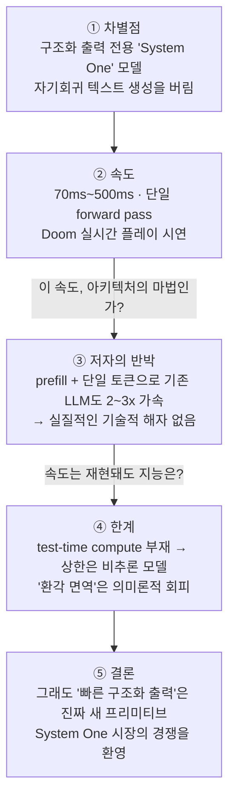

<figure class="post-figure post-figure--header">
<svg role="img" aria-label="왼쪽에는 토큰 발자국을 하나씩 남기며 느리게 걷는 자기회귀 LLM 전령이, 오른쪽에는 blue·red·yellow 선택지 팻말 중 blue를 단일 forward pass로 즉시 가리키는 Jev 정찰병이 대비된다." viewBox="0 0 680 320" xmlns="http://www.w3.org/2000/svg">
  <title>자기회귀 생성(토큰별 한 걸음, 수 초) vs Jev의 구조화 출력(선택지 즉시 지목, 70ms)</title>
  <defs>
    <marker id="jev-arr" markerWidth="9" markerHeight="9" refX="7" refY="3" orient="auto">
      <path d="M0 0 L7 3 L0 6 z" fill="currentColor"/>
    </marker>
    <marker id="jev-arr-acc" markerWidth="10" markerHeight="10" refX="7" refY="3" orient="auto">
      <path d="M0 0 L7 3 L0 6 z" fill="var(--accent-color)"/>
    </marker>
  </defs>

  <!-- ===== LEFT: 자기회귀 LLM — 전령 ===== -->
  <text x="165" y="30" text-anchor="middle" font-size="12" fill="currentColor" font-weight="700">자기회귀 LLM — 전령</text>
  <text x="165" y="46" text-anchor="middle" font-size="9" fill="currentColor" opacity="0.6">토큰을 하나씩 · 순차 생성</text>

  <!-- 토큰 발자국 상자들 -->
  <rect x="24" y="196" width="20" height="28" rx="3" fill="var(--bg-light)" stroke="currentColor" stroke-width="1.4"/>
  <text x="34" y="214" text-anchor="middle" font-size="10" fill="currentColor">{</text>
  <rect x="52" y="196" width="62" height="28" rx="3" fill="var(--bg-light)" stroke="currentColor" stroke-width="1.4"/>
  <text x="83" y="214" text-anchor="middle" font-size="10" fill="currentColor">"answer"</text>
  <rect x="122" y="196" width="16" height="28" rx="3" fill="var(--bg-light)" stroke="currentColor" stroke-width="1.4"/>
  <text x="130" y="214" text-anchor="middle" font-size="10" fill="currentColor">:</text>
  <rect x="146" y="196" width="46" height="28" rx="3" fill="var(--bg-light)" stroke="currentColor" stroke-width="1.4"/>
  <text x="169" y="214" text-anchor="middle" font-size="10" fill="currentColor">"blue</text>
  <rect x="200" y="196" width="26" height="28" rx="3" fill="var(--bg-light)" stroke="currentColor" stroke-width="1.4"/>
  <text x="213" y="214" text-anchor="middle" font-size="10" fill="currentColor">"}</text>

  <!-- 땅과 발자국 -->
  <line x1="20" y1="240" x2="312" y2="240" stroke="currentColor" stroke-width="1.6" opacity="0.5"/>
  <ellipse cx="34" cy="233" rx="6" ry="3" fill="currentColor" opacity="0.35"/>
  <ellipse cx="83" cy="233" rx="6" ry="3" fill="currentColor" opacity="0.35"/>
  <ellipse cx="130" cy="233" rx="6" ry="3" fill="currentColor" opacity="0.35"/>
  <ellipse cx="169" cy="233" rx="6" ry="3" fill="currentColor" opacity="0.35"/>
  <ellipse cx="213" cy="233" rx="6" ry="3" fill="currentColor" opacity="0.35"/>

  <!-- 전령 (걷는 중) -->
  <circle cx="258" cy="150" r="11" fill="var(--bg-light)" stroke="currentColor" stroke-width="1.8"/>
  <rect x="248" y="163" width="20" height="34" rx="4" fill="var(--bg-light)" stroke="currentColor" stroke-width="1.6"/>
  <line x1="253" y1="197" x2="246" y2="238" stroke="currentColor" stroke-width="1.8"/>
  <line x1="263" y1="197" x2="272" y2="225" stroke="currentColor" stroke-width="1.8"/>
  <line x1="268" y1="168" x2="288" y2="120" stroke="currentColor" stroke-width="1.6"/>
  <polygon points="288,120 306,126 288,134" fill="var(--gold)" opacity="0.9"/>
  <text x="258" y="258" text-anchor="middle" font-size="9.5" fill="currentColor" opacity="0.65">토큰별 한 걸음</text>

  <text x="165" y="296" text-anchor="middle" font-size="10" fill="currentColor" opacity="0.6">응답까지 수 초 · 토큰당 순차 비용</text>

  <!-- ===== CENTER: 대비 ===== -->
  <line x1="340" y1="44" x2="340" y2="276" stroke="currentColor" stroke-width="1.4" stroke-dasharray="4 6" opacity="0.3"/>
  <circle cx="340" cy="160" r="17" fill="var(--bg-light)" stroke="currentColor" stroke-width="1.6"/>
  <text x="340" y="165" text-anchor="middle" font-size="11" fill="currentColor" font-weight="700">VS</text>

  <!-- ===== RIGHT: Jev — 정찰병 ===== -->
  <text x="515" y="30" text-anchor="middle" font-size="12" fill="var(--accent-color)" font-weight="700">Jev — 정찰병 · System One</text>
  <text x="515" y="46" text-anchor="middle" font-size="9" fill="currentColor" opacity="0.6">구조화 출력만 · 단일 forward pass</text>

  <!-- 선택지 팻말 3개 -->
  <line x1="523" y1="104" x2="523" y2="240" stroke="currentColor" stroke-width="1.6" opacity="0.8"/>
  <rect x="498" y="78" width="50" height="26" rx="3" fill="var(--bg-panel)" stroke="var(--accent-color)" stroke-width="2.4"/>
  <text x="523" y="95" text-anchor="middle" font-size="11" fill="var(--accent-color)" font-weight="700">blue</text>
  <line x1="581" y1="104" x2="581" y2="240" stroke="currentColor" stroke-width="1.4" opacity="0.45"/>
  <rect x="556" y="78" width="50" height="26" rx="3" fill="var(--bg-light)" stroke="currentColor" stroke-width="1.4" opacity="0.75"/>
  <text x="581" y="95" text-anchor="middle" font-size="10" fill="currentColor" opacity="0.7">red</text>
  <line x1="639" y1="104" x2="639" y2="240" stroke="currentColor" stroke-width="1.4" opacity="0.45"/>
  <rect x="614" y="78" width="50" height="26" rx="3" fill="var(--bg-light)" stroke="currentColor" stroke-width="1.4" opacity="0.75"/>
  <text x="639" y="95" text-anchor="middle" font-size="10" fill="currentColor" opacity="0.7">yellow</text>

  <!-- 정찰병 (즉시 지목) -->
  <line x1="366" y1="150" x2="386" y2="150" stroke="var(--secondary-color)" stroke-width="1.6" opacity="0.6"/>
  <line x1="362" y1="166" x2="382" y2="166" stroke="var(--secondary-color)" stroke-width="1.6" opacity="0.6"/>
  <line x1="366" y1="182" x2="386" y2="182" stroke="var(--secondary-color)" stroke-width="1.6" opacity="0.6"/>
  <circle cx="412" cy="148" r="11" fill="var(--bg-light)" stroke="currentColor" stroke-width="1.8"/>
  <rect x="402" y="161" width="20" height="34" rx="4" fill="var(--bg-light)" stroke="currentColor" stroke-width="1.6"/>
  <line x1="407" y1="195" x2="400" y2="238" stroke="currentColor" stroke-width="1.8"/>
  <line x1="417" y1="195" x2="424" y2="238" stroke="currentColor" stroke-width="1.8"/>
  <line x1="420" y1="166" x2="456" y2="134" stroke="currentColor" stroke-width="2"/>
  <line x1="460" y1="130" x2="504" y2="102" stroke="var(--accent-color)" stroke-width="2.2" stroke-dasharray="6 4" marker-end="url(#jev-arr-acc)"/>
  <text x="468" y="162" text-anchor="middle" font-size="13" fill="var(--secondary-color)" font-weight="700">70ms</text>
  <text x="468" y="176" text-anchor="middle" font-size="8.5" fill="currentColor" opacity="0.6">단일 forward pass</text>

  <line x1="370" y1="240" x2="664" y2="240" stroke="currentColor" stroke-width="1.6" opacity="0.5"/>
  <text x="412" y="258" text-anchor="middle" font-size="9.5" fill="currentColor" opacity="0.65">선택지에서 즉시 지목</text>
  <text x="581" y="272" text-anchor="middle" font-size="9.5" fill="var(--secondary-color)" font-weight="700">{ "answer": "blue" }</text>
  <text x="515" y="296" text-anchor="middle" font-size="10" fill="currentColor" opacity="0.6">최악의 응답도 500ms · 병렬 판정</text>
</svg>
<figcaption>토큰 발자국을 하나씩 남기며 걷는 자기회귀 전령 vs 선택지 팻말을 즉시 가리키는 Jev 정찰병 — 순차 생성과 단일 forward pass 구조화 출력의 대비.</figcaption>
</figure>

## 원문 정보

> - **제목**: Jev means structured output is interesting again
> - **출처**: Sean Goedecke ([seangoedecke.com](https://www.seangoedecke.com/))
> - **발행**: 2026-09-16 · 약 6분 분량
> - **원문 링크**: <https://www.seangoedecke.com/jev-means-structured-output-is-interesting-again/>

GitHub의 엔지니어이자 AI 시스템에 대한 냉정한 실무 관점으로 유명한 Sean Goedecke가, 화제가 된 TypeSafe AI의 새 모델 **Jev**를 기술적으로 해부한 글이다. "구조화 출력(structured output)"이라는 오래된 주제가 왜 다시 흥미로워졌는지를 다룬다.

## 한 줄 요약 (TL;DR)

Jev는 자기회귀 텍스트 생성을 버리고 **구조화 출력만** 내보내는 "System One" 모델로 70ms~500ms의 일관된 응답 속도를 달성했다 — 하지만 저자가 직접 실험해 보니 그 속도의 비밀은 특별한 아키텍처가 아니라 **prefill + 단일 토큰 추론 전략**일 가능성이 높고, 그럼에도 "빠른 구조화 출력"은 완전히 새로운 종류의 애플리케이션을 여는 컴퓨팅 프리미티브라는 점에서 가치가 있다.

## 왜 이 글을 골랐나

글 전체의 논증 흐름을 먼저 한눈에 보면 다음과 같다.



이 위키의 [하니스 분석 포스트들](/2026/08/03/what-makes-a-harness-a-harness.html)이 다뤄온 질문 — "가치는 모델에 있는가, 모델을 감싼 시스템에 있는가" — 의 또 다른 변주이기 때문이다. Jev를 둘러싼 마케팅("환각 면역", "혁명적 속도")을 그대로 받아쓰는 대신, 저자는 **직접 오픈소스 모델로 재현 실험**을 해서 주장을 검증한다. 신제품 발표를 읽는 태도의 모범이자, 추론(inference) 레이어에서 무엇이 진짜 혁신이고 무엇이 추론 전략의 차이일 뿐인지 가르는 좋은 사례 분석이다. 같은 Jev를 **사용자 관점에서 실전 테스트**한 [Mike Taylor의 미니 바이브 체크](/2026/09/20/mini-vibe-check-typesafe-jev.html)와 나란히 읽으면, 아키텍처 해부(이 글)와 실사용 검증(그 글)이 서로를 보완한다.

또한 "빠른 소프트웨어는 같은 일을 빠르게 하는 게 아니라 **완전히 새로운 종류의 일**을 가능하게 한다"는 관점은, 에이전트 시스템을 설계하는 실무자에게 지연 시간(latency)을 기능이 아니라 설계 공간의 축으로 보게 만든다.

## 핵심 내용

### Jev는 LLM과 무엇이 다른가

일반 LLM은 자기회귀(autoregressive) 방식으로 토큰을 하나씩 순서대로 생성한다. 유연하지만 느리고, 가끔 이상한 행동을 한다. TypeSafe AI의 Jev는 근본적으로 다르다. 사람의 언어로 된 프롬프트를 받되, **출력은 구조화된 데이터만** 내보낸다. 예를 들어 개발자가 다음을 보내면:

```json
{ "state": "What color is the sky?", "choices": ["blue", "red", "yellow"] }
```

Jev는 `{ "answer": "blue" }`를 돌려준다. 기존 LLM의 structured output 기능과 비슷해 보이지만, **"오직 구조화 출력만"이라는 제약** 자체가 흥미로운 성질들을 만들어낸다는 것이 글의 출발점이다.

### 일관되게 빠르다 — 그리고 Doom을 플레이한다

Jev의 핵심 강점은 속도다. 저자에 따르면:

> 가장 빠른 응답이 (일반 LLM의 수 초 대비) 약 **70ms**다. 더 좋은 건, 가장 *느린* 응답조차 **500ms**에 불과하다는 점이다.

자기회귀가 아니기 때문에 Jev는 여러 질문에 대한 답을 **단일 forward pass에서 병렬로** 생성할 수 있다. 일반 LLM이라면 JSON 형식을 맞추기 위해 토큰을 순차적으로 뽑아야 하는 작업이다.

가장 인상적인 시연은 Jev가 **Doom을 실시간으로 플레이**한다는 것. 게임 전용으로 학습된 특화 네트워크가 아니라 다양한 과제를 처리하는 범용 모델이 이걸 해낸다는 점에서, 저자는 "빠른 구조화 출력은 지능의 진짜 새로운 컴퓨팅 프리미티브일 수 있다"고 본다. Nelson Elhage를 인용하며 — "빠른 소프트웨어는 같은 일을 더 빠르게 한다는 뜻이 아니라, 완전히 새로운 종류의 일을 할 수 있다는 뜻이다" — 의사결정 지점마다 **"100ms짜리 헐값 지능"을 주입**하는 새로운 애플리케이션 부류가 열린다고 전망한다.

### 반박: 구조화 출력은 이미 빠를 수 있다

글의 핵심 회의론이 여기 있다. 저자는 빠른 구조화 출력이 Jev의 특수한 아키텍처를 요구하지 않는다고 주장한다. 현재 구현들은 "grammar-constrained decoding" — 유효하지 않은 토큰을 logit 단계에서 걸러내는 방식 — 을 쓰지만, 진짜 속도는 다른 데서 나온다. 선택지가 제한된 경우라면:

1. 응답을 `"choice": "`까지 **prefill**해 두고,
2. 사용자가 준 선택지로 제약된 **토큰 1개만 생성**하면 된다.
3. 여러 선택지는 표준 추론 배칭으로 **단일 forward pass에 묶을 수 있다**.

<figure class="post-figure">
<svg role="img" aria-label="위: 토큰별 JSON 생성 — 여는 중괄호부터 닫는 중괄호까지 7개 토큰을 순차 forward pass로 하나씩 생성한다. 아래: prefill + 단일 토큰 — 응답을 여는 따옴표까지 미리 채워 넣고 선택지로 제약된 토큰 1개만 생성하며, 여러 판정은 표준 배칭으로 단일 forward pass에 묶는다." viewBox="0 0 680 360" xmlns="http://www.w3.org/2000/svg">
  <title>토큰별 JSON 생성 vs prefill + 단일 토큰 생성의 비용 대비</title>
  <defs>
    <marker id="jvp-arr" markerWidth="9" markerHeight="9" refX="7" refY="3" orient="auto">
      <path d="M0 0 L7 3 L0 6 z" fill="currentColor"/>
    </marker>
    <marker id="jvp-arr-sec" markerWidth="10" markerHeight="10" refX="7" refY="3" orient="auto">
      <path d="M0 0 L7 3 L0 6 z" fill="var(--secondary-color)"/>
    </marker>
  </defs>

  <!-- ===== 경로 A: 토큰별 JSON 생성 ===== -->
  <text x="40" y="28" font-size="12" fill="currentColor" font-weight="700">경로 A — 토큰별 JSON 생성</text>
  <text x="640" y="28" text-anchor="end" font-size="10" fill="currentColor" opacity="0.6">순차 디코딩 스텝 × 7 · 순차 비용 누적</text>

  <rect x="40" y="44" width="26" height="32" rx="3" fill="var(--bg-light)" stroke="currentColor" stroke-width="1.5"/>
  <text x="53" y="65" text-anchor="middle" font-size="11" fill="currentColor">{</text>
  <line x1="68" y1="60" x2="84" y2="60" stroke="currentColor" stroke-width="1.5" marker-end="url(#jvp-arr)"/>
  <rect x="88" y="44" width="78" height="32" rx="3" fill="var(--bg-light)" stroke="currentColor" stroke-width="1.5"/>
  <text x="127" y="65" text-anchor="middle" font-size="11" fill="currentColor">"choice"</text>
  <line x1="168" y1="60" x2="184" y2="60" stroke="currentColor" stroke-width="1.5" marker-end="url(#jvp-arr)"/>
  <rect x="188" y="44" width="20" height="32" rx="3" fill="var(--bg-light)" stroke="currentColor" stroke-width="1.5"/>
  <text x="198" y="65" text-anchor="middle" font-size="11" fill="currentColor">:</text>
  <line x1="210" y1="60" x2="226" y2="60" stroke="currentColor" stroke-width="1.5" marker-end="url(#jvp-arr)"/>
  <rect x="230" y="44" width="18" height="32" rx="3" fill="var(--bg-light)" stroke="currentColor" stroke-width="1.5"/>
  <text x="239" y="65" text-anchor="middle" font-size="11" fill="currentColor">"</text>
  <line x1="250" y1="60" x2="266" y2="60" stroke="currentColor" stroke-width="1.5" marker-end="url(#jvp-arr)"/>
  <rect x="270" y="44" width="54" height="32" rx="3" fill="var(--bg-light)" stroke="currentColor" stroke-width="1.5"/>
  <text x="297" y="65" text-anchor="middle" font-size="11" fill="currentColor">blue</text>
  <line x1="326" y1="60" x2="342" y2="60" stroke="currentColor" stroke-width="1.5" marker-end="url(#jvp-arr)"/>
  <rect x="346" y="44" width="18" height="32" rx="3" fill="var(--bg-light)" stroke="currentColor" stroke-width="1.5"/>
  <text x="355" y="65" text-anchor="middle" font-size="11" fill="currentColor">"</text>
  <line x1="366" y1="60" x2="382" y2="60" stroke="currentColor" stroke-width="1.5" marker-end="url(#jvp-arr)"/>
  <rect x="386" y="44" width="26" height="32" rx="3" fill="var(--bg-light)" stroke="currentColor" stroke-width="1.5"/>
  <text x="399" y="65" text-anchor="middle" font-size="11" fill="currentColor">}</text>

  <circle cx="560" cy="60" r="17" fill="none" stroke="currentColor" stroke-width="1.8" opacity="0.75"/>
  <line x1="560" y1="60" x2="560" y2="49" stroke="currentColor" stroke-width="1.6" opacity="0.75"/>
  <line x1="560" y1="60" x2="569" y2="64" stroke="currentColor" stroke-width="1.6" opacity="0.75"/>

  <text x="226" y="102" text-anchor="middle" font-size="9.5" fill="currentColor" opacity="0.6">토큰 하나마다 순차 forward pass — 앞 토큰이 끝나야 다음을 생성</text>

  <!-- ===== 경로 B: prefill + 단일 토큰 ===== -->
  <text x="40" y="150" font-size="12" fill="var(--accent-color)" font-weight="700">경로 B — prefill + 단일 토큰</text>
  <text x="640" y="150" text-anchor="end" font-size="10" fill="var(--secondary-color)" font-weight="700">2~3x 빠름 (Qwen2.5-1.5B 실측)</text>

  <rect x="40" y="166" width="210" height="44" rx="3" fill="var(--bg-sunken)" stroke="currentColor" stroke-width="1.5" stroke-dasharray="5 4" opacity="0.9"/>
  <text x="145" y="193" text-anchor="middle" font-size="12" fill="currentColor">{ "choice": "</text>
  <text x="145" y="230" text-anchor="middle" font-size="9" fill="currentColor" opacity="0.65">prefill — 미리 채워 넣기 · 병렬 처리, 저렴</text>

  <line x1="254" y1="188" x2="284" y2="188" stroke="currentColor" stroke-width="1.6" marker-end="url(#jvp-arr)"/>

  <rect x="290" y="166" width="76" height="44" rx="3" fill="var(--bg-panel)" stroke="var(--accent-color)" stroke-width="2.4"/>
  <text x="328" y="193" text-anchor="middle" font-size="13" fill="var(--accent-color)" font-weight="700">blue</text>
  <text x="328" y="230" text-anchor="middle" font-size="9" fill="currentColor" opacity="0.65">생성 — 제약된 토큰 1개</text>

  <text x="400" y="185" font-size="9.5" fill="currentColor" opacity="0.7">logit 제약: 사용자가 준</text>
  <text x="400" y="199" font-size="9.5" fill="currentColor" opacity="0.7">선택지(blue/red/yellow)만 허용</text>

  <!-- ===== 배칭 ===== -->
  <text x="40" y="264" font-size="11" fill="var(--secondary-color)" font-weight="700">여러 판정은 표준 배칭으로 —</text>
  <rect x="40" y="276" width="96" height="32" rx="3" fill="var(--bg-light)" stroke="currentColor" stroke-width="1.4"/>
  <text x="88" y="296" text-anchor="middle" font-size="10" fill="currentColor">Q1 · 1토큰</text>
  <text x="144" y="298" text-anchor="middle" font-size="13" fill="currentColor" opacity="0.6">+</text>
  <rect x="152" y="276" width="96" height="32" rx="3" fill="var(--bg-light)" stroke="currentColor" stroke-width="1.4"/>
  <text x="200" y="296" text-anchor="middle" font-size="10" fill="currentColor">Q2 · 1토큰</text>
  <text x="256" y="298" text-anchor="middle" font-size="13" fill="currentColor" opacity="0.6">+</text>
  <rect x="264" y="276" width="96" height="32" rx="3" fill="var(--bg-light)" stroke="currentColor" stroke-width="1.4"/>
  <text x="312" y="296" text-anchor="middle" font-size="10" fill="currentColor">Q3 · 1토큰</text>
  <line x1="362" y1="292" x2="424" y2="292" stroke="var(--secondary-color)" stroke-width="1.8" marker-end="url(#jvp-arr-sec)"/>
  <rect x="428" y="272" width="212" height="40" rx="3" fill="var(--bg-panel)" stroke="var(--secondary-color)" stroke-width="2"/>
  <text x="534" y="296" text-anchor="middle" font-size="11" fill="var(--secondary-color)" font-weight="700">단일 forward pass</text>

  <text x="340" y="342" text-anchor="middle" font-size="9.5" fill="currentColor" opacity="0.6">출력이 단일 토큰이라 여러 질문을 한 pass에 묶기 좋다</text>
</svg>
<figcaption>같은 { "choice": "blue" }를 얻는 두 경로 — 토큰별 순차 생성(위) vs 응답을 prefill해 두고 제약된 토큰 1개만 생성(아래). 아래 경로는 표준 배칭으로 여러 판정을 단일 forward pass에 묶는다.</figcaption>
</figure>

저자는 직접 실험했다:

> `Qwen2.5-1.5B-Instruct`로 직접 해봤더니, prefix 없는 structured output 대비 **2~3배 속도 향상**을 얻었다.

발표 이후 다른 이들도 이 접근을 재현해 유사한 성과를 냈다고 하며, 저자는 (파인튜닝의 이점 가능성은 인정하면서도) **"Jev에게 실질적인 기술적 해자는 없다"**고 결론짓는다. "어떤 LLM이든 단일 토큰 추론 스택에 태우면" 비슷한 결과가 나올 수 있다는 것이다.

### 지능과 환각 — "환각 면역"은 의미론적 회피

저자는 Jev가 프론티어 LLM의 지능을 따라잡을 수 있을지 의심한다. 구조상 **test-time compute를 전혀 쓸 수 없기 때문에**, 능력의 상한은 비추론(non-reasoning) 모델 수준이다. 다만 저지연 애플리케이션이라는 용도에서는 큰 문제가 아니라고 본다.

"환각 면역(hallucination immunity)"이라는 TypeSafe의 마케팅에 대해서는 **"의미론적 회피(semantic dodge)"**라고 잘라 말한다. Jev도 하늘을 "red"라고 답하는 식으로 틀릴 수 있다. 사용자가 준 선택지에서 고르기 때문에 내용을 "지어내는" 환각이 아니라 "실수"일 뿐이라는 논리인데 — 이 구분은 structured output을 쓰는 일반 LLM에도 똑같이 적용되므로, 실질적인 신뢰성 우위가 아니라는 지적이다.

### 결론 — 해자는 없어도 프리미티브는 진짜다

저자는 Jev의 가치가 모델 자체에서 오는지 단일 토큰 추론 전략에서 오는지 아직 확신하지 못한다. "Terra급 모델 아무거나 단일 토큰 추론 스택에 꽂아도" 비슷한 결과가 나올 수 있다고 보며, TypeSafe가 비교 벤치마크에서 상대 모델에게 불필요한 토큰별 JSON 생성을 강제하지 않은 공정한 비교를 제시했으면 좋았겠다고 아쉬워한다.

그럼에도 총평은 긍정적이다. Jev 같은 시도가 존재하는 것 자체를 지지하며, **"fast-structured-output 시장에서 진짜 경쟁"**이 벌어지길 — 예컨대 주요 랩들이 "GPT-5.6-Terra-System-One" 같은 System One 변종을 내놓길 — 바란다.

## 분석과 인사이트

**1. "모델의 혁신"과 "추론 전략의 혁신"을 가르는 눈.** 이 글의 백미는 저자가 발표 자료를 읽는 데서 멈추지 않고 `Qwen2.5-1.5B-Instruct`로 재현 실험을 했다는 점이다. 결과(2~3x 가속)는 Jev의 속도가 아키텍처의 마법이 아니라 **추론 스택 설계의 결과**일 가능성을 보여준다. 이는 [GPT-6 Astra 분석](/2026/09/08/gpt6-astra-harness-is-the-product.html)에서 본 "가치는 가중치가 아니라 하니스에 있다"는 논지와 정확히 대칭이다 — 거기서는 모델 밖(하니스), 여기서는 모델 아래(추론 스택)가 진짜 변수였다. 요즘 AI 제품 발표를 평가할 때 "이게 모델의 성질인가, 시스템의 성질인가"를 먼저 묻는 습관은 점점 필수가 되고 있다.

**2. 지연 시간은 기능 목록이 아니라 설계 공간의 축이다.** Doom 시연이 상징하는 바가 크다. 수 초짜리 지능으로는 챗봇과 배치 파이프라인밖에 못 만들지만, 70ms짜리 지능은 게임 루프, 실시간 UI, 라우팅/가드레일 결정 등 **호출 지점 자체가 다른** 애플리케이션을 연다. 자기회귀 생성의 비용 구조(prefill vs generation, 토큰당 순차 비용)를 이해하고 있으면 이 글의 논증이 훨씬 선명하게 읽힌다 — [CS336 10강 추론 정리](/2026/06/26/cs336-lecture-10-inference.html)가 좋은 배경 지식이 된다.

**3. 다만 저자의 반박에도 한 겹의 유보가 필요하다.** "prefill + 단일 토큰으로 재현 가능"은 속도에 대한 반박이지, 품질에 대한 반박은 아니다. 구조화 출력 과제만으로 학습(또는 파인튜닝)된 모델이 같은 지연 시간에서 더 나은 선택 정확도를 낼 가능성은 저자도 인정하듯 열려 있다. 해자의 크기는 "같은 속도에서의 정확도" 벤치마크가 나와야 판정될 것이다.

**4. "환각 면역" 비판은 프롬프트 설계 일반에 대한 교훈이다.** 선택지를 제약하면 환각이 사라지는 게 아니라 **오류의 형태가 바뀔 뿐**이다. 자유 생성의 "그럴듯한 거짓말"이 제약 출력의 "자신 있는 오답"으로 변한다. 어떤 방식이든 검증 없는 신뢰는 위험하며, 마케팅 용어의 재정의("이건 환각이 아니라 실수")에 속지 않는 것이 실무자의 몫이다.

## 적용 포인트

- **분류/라우팅/판정 태스크에 토큰별 JSON을 생성시키고 있다면 지금 바꿔라.** 응답을 `"choice": "`까지 prefill하고 제약된 토큰 1개만 생성하는 것만으로 2~3배 가속을 얻을 수 있다 — 저자가 소형 오픈 모델로 직접 검증한 수치다.
- **여러 판정을 한 번에 처리할 때는 추론 배칭을 활용하라.** 단일 토큰 출력은 표준 배칭으로 단일 forward pass에 여러 질문을 묶기 좋다.
- **저지연 지능이 열어주는 새 호출 지점을 설계에 반영하라.** "이 결정 지점에 100ms짜리 모델 호출을 넣을 수 있다면?"이라는 질문으로 UI 인터랙션, 파이프라인 가드레일, 실시간 제어 루프를 다시 보자.
- **신모델 발표를 읽을 때 재현 가능한 최소 실험을 설계하라.** "이 성질이 모델 고유의 것인가, 추론 전략으로 재현되는가"를 소형 오픈 모델로 확인해 보는 습관.
- **"환각 면역" 류의 주장은 오류의 형태 전환으로 해석하라.** 제약 출력에서도 오답은 나온다 — 평가 지표는 여전히 선택 정확도여야 한다.

## 마무리

이 글은 Jev라는 신제품 리뷰이면서, 동시에 AI 시스템에서 혁신의 위치를 찾는 방법론에 대한 글이다. 저자의 결론은 균형 잡혀 있다: Jev의 기술적 해자는 아마 얇지만(prefill + 단일 토큰 추론으로 상당 부분 재현 가능), "일관되게 빠른 구조화 출력"이라는 프리미티브 자체는 진짜이며, 여기서 경쟁이 벌어지면 완전히 새로운 부류의 AI 애플리케이션이 열린다. 속도를 성능 지표가 아니라 **가능성의 차원**으로 보는 관점 — 그것이 이 글에서 가져갈 가장 큰 수확이다.

### 더 읽어보기

- [원문 — Jev means structured output is interesting again](https://www.seangoedecke.com/jev-means-structured-output-is-interesting-again/)
- [0.7초 만에 내 글 전부를 심사한 모델: TypeSafe Jev 미니 바이브 체크](/2026/09/20/mini-vibe-check-typesafe-jev.html) — 같은 Jev를 사용자 관점에서 실전 테스트한 자매편 (777개 판단, "지식 노동의 린터")
- [GPT-6 Astra: 하니스가 곧 제품이다](/2026/09/08/gpt6-astra-harness-is-the-product.html) — "가치는 모델인가 시스템인가"라는 같은 질문의 하니스 버전
- [무엇이 하니스를 하니스로 만드는가](/2026/08/03/what-makes-a-harness-a-harness.html) — 모델을 감싸는 런타임 레이어의 정의
- [CS336 10강 — 추론(Inference): KV 캐시와 메모리 한계의 게임](/2026/06/26/cs336-lecture-10-inference.html) — prefill vs generation, 자기회귀 추론의 비용 구조라는 배경 지식
