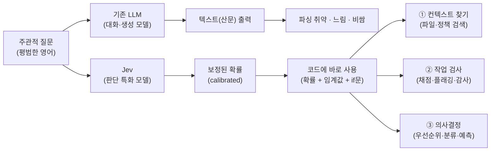

<figure class="post-figure post-figure--header">
<svg role="img" aria-label="컨베이어 벨트 위로 37개의 문서가 오른쪽으로 흘러가고, 위 레일에 매달린 21개의 판정 렌즈가 동시에 스캔 빔을 내려 초록(통과)과 빨강(지적) 확률 도장을 찍는다. 오른쪽의 모래시계는 모래가 거의 다 떨어져 0.7초의 속도를 나타내고, 아래에 777개 판단과 약 0.25센트의 비용이 적혀 있다." viewBox="0 0 680 320" xmlns="http://www.w3.org/2000/svg">
  <title>판단의 컨베이어 — 문서 37편 × 판정 렌즈 21개, 777개 확률 도장이 0.7초에 찍힌다</title>
  <defs>
    <marker id="vc-head" markerWidth="9" markerHeight="9" refX="7" refY="3" orient="auto">
      <path d="M0 0 L7 3 L0 6 z" fill="currentColor"/>
    </marker>
    <g id="vc-lens">
      <line x1="0" y1="44" x2="0" y2="66" stroke="currentColor" stroke-width="1.4" opacity="0.6"/>
      <circle cx="0" cy="78" r="11" fill="var(--bg-panel)" stroke="var(--gold)" stroke-width="1.8"/>
      <circle cx="0" cy="78" r="4" fill="currentColor" opacity="0.7"/>
      <line x1="0" y1="89" x2="0" y2="154" stroke="var(--gold)" stroke-width="1.2" stroke-dasharray="3 4" opacity="0.55"/>
    </g>
    <g id="vc-doc">
      <rect x="0" y="0" width="50" height="38" rx="3" fill="var(--bg-panel)" stroke="currentColor" stroke-width="1.6"/>
      <line x1="8" y1="11" x2="42" y2="11" stroke="currentColor" stroke-width="1.4" opacity="0.35"/>
      <line x1="8" y1="19" x2="42" y2="19" stroke="currentColor" stroke-width="1.4" opacity="0.35"/>
      <line x1="8" y1="27" x2="36" y2="27" stroke="currentColor" stroke-width="1.4" opacity="0.35"/>
    </g>
  </defs>

  <!-- ===== 상단: 판정 렌즈 레일 ===== -->
  <text x="290" y="24" text-anchor="middle" font-size="11" fill="currentColor" font-weight="700" opacity="0.8">판정 렌즈 ×21 · 동시 판정</text>
  <rect x="48" y="36" width="484" height="8" fill="var(--bg-light)" stroke="currentColor" stroke-width="1.4"/>
  <use href="#vc-lens" x="72"/>
  <use href="#vc-lens" x="121"/>
  <use href="#vc-lens" x="170"/>
  <use href="#vc-lens" x="219"/>
  <use href="#vc-lens" x="268"/>
  <use href="#vc-lens" x="317"/>
  <use href="#vc-lens" x="366"/>
  <use href="#vc-lens" x="415"/>
  <use href="#vc-lens" x="464"/>
  <use href="#vc-lens" x="513"/>

  <!-- ===== 확률 도장 (초록 = 통과, 빨강 = 지적) ===== -->
  <rect x="67" y="158" width="36" height="16" rx="2" fill="var(--bg-panel)" stroke="var(--orc-green)" stroke-width="2"/>
  <text x="85" y="170" text-anchor="middle" font-size="9.5" fill="currentColor" font-weight="700">0.92</text>
  <rect x="135" y="158" width="36" height="16" rx="2" fill="var(--bg-panel)" stroke="var(--accent-color)" stroke-width="2"/>
  <text x="153" y="170" text-anchor="middle" font-size="9.5" fill="currentColor" font-weight="700">0.13</text>
  <rect x="203" y="158" width="36" height="16" rx="2" fill="var(--bg-panel)" stroke="var(--orc-green)" stroke-width="2"/>
  <text x="221" y="170" text-anchor="middle" font-size="9.5" fill="currentColor" font-weight="700">0.88</text>
  <rect x="271" y="158" width="36" height="16" rx="2" fill="var(--bg-panel)" stroke="var(--orc-green)" stroke-width="2"/>
  <text x="289" y="170" text-anchor="middle" font-size="9.5" fill="currentColor" font-weight="700">0.95</text>
  <rect x="339" y="158" width="36" height="16" rx="2" fill="var(--bg-panel)" stroke="var(--accent-color)" stroke-width="2"/>
  <text x="357" y="170" text-anchor="middle" font-size="9.5" fill="currentColor" font-weight="700">0.21</text>
  <rect x="407" y="158" width="36" height="16" rx="2" fill="var(--bg-panel)" stroke="var(--orc-green)" stroke-width="2"/>
  <text x="425" y="170" text-anchor="middle" font-size="9.5" fill="currentColor" font-weight="700">0.90</text>
  <rect x="475" y="158" width="36" height="16" rx="2" fill="var(--bg-panel)" stroke="var(--orc-green)" stroke-width="2"/>
  <text x="493" y="170" text-anchor="middle" font-size="9.5" fill="currentColor" font-weight="700">0.84</text>

  <!-- ===== 문서 두루마리 (37편) ===== -->
  <use href="#vc-doc" x="60" y="176"/>
  <use href="#vc-doc" x="128" y="176"/>
  <use href="#vc-doc" x="196" y="176"/>
  <use href="#vc-doc" x="264" y="176"/>
  <use href="#vc-doc" x="332" y="176"/>
  <use href="#vc-doc" x="400" y="176"/>
  <use href="#vc-doc" x="468" y="176"/>

  <!-- ===== 컨베이어 벨트 ===== -->
  <rect x="48" y="214" width="484" height="14" fill="var(--bg-light)" stroke="currentColor" stroke-width="1.6"/>
  <circle cx="80" cy="221" r="5" fill="none" stroke="currentColor" stroke-width="1.2" opacity="0.5"/>
  <circle cx="160" cy="221" r="5" fill="none" stroke="currentColor" stroke-width="1.2" opacity="0.5"/>
  <circle cx="240" cy="221" r="5" fill="none" stroke="currentColor" stroke-width="1.2" opacity="0.5"/>
  <circle cx="320" cy="221" r="5" fill="none" stroke="currentColor" stroke-width="1.2" opacity="0.5"/>
  <circle cx="400" cy="221" r="5" fill="none" stroke="currentColor" stroke-width="1.2" opacity="0.5"/>
  <circle cx="480" cy="221" r="5" fill="none" stroke="currentColor" stroke-width="1.2" opacity="0.5"/>
  <text x="250" y="252" text-anchor="middle" font-size="10.5" fill="currentColor" opacity="0.7" font-weight="700">문서 37편 · 컨베이어</text>
  <line x1="340" y1="248" x2="392" y2="248" stroke="currentColor" stroke-width="1.8" opacity="0.7" marker-end="url(#vc-head)"/>

  <!-- ===== 오른쪽: 거의 빈 모래시계 = 0.7초 ===== -->
  <line x1="538" y1="190" x2="564" y2="190" stroke="currentColor" stroke-width="1.8" opacity="0.6" marker-end="url(#vc-head)"/>
  <rect x="580" y="110" width="56" height="6" fill="var(--bg-light)" stroke="currentColor" stroke-width="1.2"/>
  <rect x="580" y="212" width="56" height="6" fill="var(--bg-light)" stroke="currentColor" stroke-width="1.2"/>
  <polygon points="586,120 630,120 608,164" fill="none" stroke="currentColor" stroke-width="1.8"/>
  <polygon points="586,208 630,208 608,168" fill="none" stroke="currentColor" stroke-width="1.8"/>
  <polygon points="601,152 615,152 608,162" fill="var(--gold)"/>
  <line x1="608" y1="166" x2="608" y2="184" stroke="var(--gold)" stroke-width="1.5" stroke-dasharray="2 3"/>
  <polygon points="590,208 626,208 608,186" fill="var(--gold)"/>
  <text x="608" y="244" text-anchor="middle" font-size="15" fill="var(--accent-color)" font-weight="700">0.7초</text>
  <text x="608" y="262" text-anchor="middle" font-size="9.5" fill="currentColor" opacity="0.65">777개 판단 · 약 0.25¢</text>
</svg>
<figcaption>판단의 컨베이어 — 37편의 문서 위로 21개의 판정 렌즈가 동시에 초록(통과)·빨강(지적) 확률 도장을 찍는다. 모래시계의 모래가 다 떨어지기도 전에: 777개 판단, 0.7초, 약 0.25센트.</figcaption>
</figure>

## 원문 정보

> - **제목**: Mini-Vibe Check: TypeSafe's Jev Judged Everything I've Written in 0.7 Seconds
> - **출처**: Mike Taylor, Also True for Humans — Every ([every.to](https://every.to/))
> - **발행**: 2026-09-15
> - **원문 링크**: [every.to/also-true-for-humans/mini-vibe-check-typesafe-s-jev-judged-everything-i-ve-written-in-0-7-seconds](https://every.to/also-true-for-humans/mini-vibe-check-typesafe-s-jev-judged-everything-i-ve-written-in-0-7-seconds)

에이전트 시대의 최대 병목인 "검증"을 정면으로 겨냥한 새로운 모델 계층 — 판단 특화 모델 — 의 실사용 리뷰라서 Articles에 담는다.

## 한 줄 요약 (TL;DR)

TypeSafe의 Jev는 대화하는 LLM이 아니라 "주관적 질문 → 보정된(calibrated) 확률"만 돌려주는 판단 특화 모델이다. 저자가 자기 글 37편에 21개 질문(총 777개 판단)을 던지자 0.7초, 약 0.25센트에 결과가 나왔고 — 이 속도와 가격이라면 지식 노동에도 코드 린터 같은 실시간 품질 검사가 가능해진다는 것이 글의 결론이다.

글의 척추를 한 장으로 정리하면 이렇다 — 같은 주관적 질문이 기존 LLM 경로와 Jev 경로에서 어떻게 갈라지고, 확률이 어디로 흘러가는가.

## 왜 이 글을 골랐나

이 위키에서 반복해 온 주제가 하나 있다. **생성은 싸졌는데 검증은 싸지지 않았다**는 비대칭이다. [확률적 엔지니어링과 24-7 직원](/2026/06/25/probabilistic-engineering-and-the-24-7-employee.html)에서 다뤘듯, 에이전트 함대가 밤새 코드를 쏟아내는 시대의 병목은 생성이 아니라 "이게 맞는지"를 판정하는 쪽이다. Jev는 바로 그 판정 단계를 밀리초·마이크로센트 단위로 끌어내리겠다는 시도다.

또 하나의 이유는 형태다. 이 글은 벤더 발표문이 아니라 저자가 **자기 글 전체를 실험 대상으로 던져본 실사용기**("mini-vibe check")라서, 스펙 나열이 아니라 "실제로 어디에 쓸 수 있고 어디서 틀리는가"를 보여준다. 새 도구 계층을 평가할 때 가장 유용한 형식이다.

## 핵심 내용

### 문제: "문제는 텍스트 그 자체다"

기존 LLM을 자동화 파이프라인에 끼워 넣으면 늘 같은 곳에서 부러진다. 프로그램은 숫자나 구조화된 값을 기대하는데 모델은 산문을 돌려준다. TypeSafe 공동창업자 Diogo Almeida(전 OpenAI, 2022년 InstructGPT 논문 공저자)는 이를 "The problem is the text itself"라고 요약한다. 프롬프트로 "JSON만 출력해"라고 구슬리는 건 근본 해법이 아니라는 것이다.

### Jev: 판단을 위해 훈련된 모델

Jev는 애초에 대화가 아니라 **의사결정**을 위해 설계됐다.

- 평범한 영어로 된 (주관적이어도 되는) 질문을 받아 **yes/no 확률** 또는 **카테고리 분포**를 반환한다
- 토큰을 하나씩 생성하는 방식이 아닌 "System One 아키텍처"로 동작한다 (이 아키텍처와 레이턴시의 기술적 의미는 자매편 [Jev와 구조화 출력의 재발견](/2026/09/20/jev-structured-output-interesting-again.html)에서 깊게 다룬다)
- RLCD(Reinforcement Learning for Calibrated Decisions)로 훈련되어, 모델이 말하는 확신도가 실제 정답률과 맞도록 **보정(calibration)** 되어 있다
- 가격은 **10억 토큰당 42달러** — 통상적인 "백만 토큰당" 단가와 자릿수가 다르다. Almeida는 출력 토큰을 "too cheap to meter"(계량할 필요도 없이 싸다)라고 표현한다

TypeSafe의 철학을 압축한 문장이 인상적이다: **"We're building prod, not God."** 범용 지능이 아니라 프로덕션에 꽂히는 부품을 만든다는 선언이다.

### 저자의 테스트: 777개 판단, 0.7초, 0.25센트

<figure class="post-figure">
<svg role="img" aria-label="왼쪽에는 문서 37편과 질문 21개가 만드는 777칸 판단 매트릭스 격자가 있고, 일부 칸이 초록(통과)과 빨강(지적)으로 칠해져 있다. 오른쪽에는 속도 0.7초, 비용 약 0.25센트, 정확도 결함 7개 중 6개 검출을 가리키는 세 개의 계기판이 있다." viewBox="0 0 680 300" xmlns="http://www.w3.org/2000/svg">
  <title>실험 요약 — 37 × 21 = 777개 판단 매트릭스와 속도·비용·정확도 계기판</title>
  <defs>
    <marker id="jm-head" markerWidth="9" markerHeight="9" refX="7" refY="3" orient="auto">
      <path d="M0 0 L7 3 L0 6 z" fill="currentColor"/>
    </marker>
    <pattern id="jm-grid" width="8" height="8" patternUnits="userSpaceOnUse">
      <path d="M8 0 H0 V8" fill="none" stroke="currentColor" stroke-width="0.5" opacity="0.3"/>
    </pattern>
  </defs>

  <!-- ===== 왼쪽: 판단 매트릭스 (한 칸 = 판단 1개) ===== -->
  <text x="196" y="30" text-anchor="middle" font-size="12" font-weight="700" fill="currentColor">판단 매트릭스</text>
  <text x="196" y="54" text-anchor="middle" font-size="10" fill="currentColor" opacity="0.65">문서 37편 →</text>
  <text transform="rotate(-90 34 148)" x="34" y="148" text-anchor="middle" font-size="10" fill="currentColor" opacity="0.65">질문 21개 →</text>
  <rect x="48" y="64" width="296" height="168" fill="var(--bg-light)" stroke="currentColor" stroke-width="1.6"/>
  <rect x="48" y="64" width="296" height="168" fill="url(#jm-grid)"/>
  <!-- 초록 = 통과 판정 -->
  <rect x="64" y="80" width="8" height="8" fill="var(--orc-green)" opacity="0.85"/>
  <rect x="120" y="96" width="8" height="8" fill="var(--orc-green)" opacity="0.85"/>
  <rect x="176" y="72" width="8" height="8" fill="var(--orc-green)" opacity="0.85"/>
  <rect x="232" y="128" width="8" height="8" fill="var(--orc-green)" opacity="0.85"/>
  <rect x="96" y="160" width="8" height="8" fill="var(--orc-green)" opacity="0.85"/>
  <rect x="288" y="104" width="8" height="8" fill="var(--orc-green)" opacity="0.85"/>
  <rect x="152" y="192" width="8" height="8" fill="var(--orc-green)" opacity="0.85"/>
  <rect x="264" y="176" width="8" height="8" fill="var(--orc-green)" opacity="0.85"/>
  <rect x="80" y="120" width="8" height="8" fill="var(--orc-green)" opacity="0.85"/>
  <rect x="200" y="152" width="8" height="8" fill="var(--orc-green)" opacity="0.85"/>
  <rect x="312" y="88" width="8" height="8" fill="var(--orc-green)" opacity="0.85"/>
  <rect x="240" y="208" width="8" height="8" fill="var(--orc-green)" opacity="0.85"/>
  <!-- 빨강 = 지적 판정 -->
  <rect x="112" y="144" width="8" height="8" fill="var(--accent-color)" opacity="0.9"/>
  <rect x="184" y="112" width="8" height="8" fill="var(--accent-color)" opacity="0.9"/>
  <rect x="296" y="184" width="8" height="8" fill="var(--accent-color)" opacity="0.9"/>
  <rect x="72" y="200" width="8" height="8" fill="var(--accent-color)" opacity="0.9"/>
  <text x="196" y="256" text-anchor="middle" font-size="12" font-weight="700" fill="currentColor">= 777개 판단 (37 × 21)</text>

  <!-- 매트릭스 → 계기판 -->
  <line x1="354" y1="148" x2="380" y2="148" stroke="currentColor" stroke-width="1.8" opacity="0.7" marker-end="url(#jm-head)"/>

  <!-- ===== 오른쪽: 세 계기판 ===== -->
  <!-- 속도 -->
  <path d="M388 140 A 36 36 0 0 1 460 140" fill="none" stroke="currentColor" stroke-width="3" opacity="0.45"/>
  <line x1="388" y1="140" x2="460" y2="140" stroke="currentColor" stroke-width="1.2" opacity="0.3"/>
  <line x1="424" y1="140" x2="454" y2="132" stroke="var(--accent-color)" stroke-width="2.5"/>
  <circle cx="424" cy="140" r="3.5" fill="currentColor"/>
  <text x="424" y="172" text-anchor="middle" font-size="14" font-weight="700" fill="var(--accent-color)">0.7초</text>
  <text x="424" y="190" text-anchor="middle" font-size="9" fill="currentColor" opacity="0.65">속도 · 약 25배 빠름</text>
  <!-- 비용 -->
  <path d="M492 140 A 36 36 0 0 1 564 140" fill="none" stroke="currentColor" stroke-width="3" opacity="0.45"/>
  <line x1="492" y1="140" x2="564" y2="140" stroke="currentColor" stroke-width="1.2" opacity="0.3"/>
  <line x1="528" y1="140" x2="498" y2="132" stroke="var(--accent-color)" stroke-width="2.5"/>
  <circle cx="528" cy="140" r="3.5" fill="currentColor"/>
  <text x="528" y="172" text-anchor="middle" font-size="14" font-weight="700" fill="var(--accent-color)">~0.25¢</text>
  <text x="528" y="190" text-anchor="middle" font-size="9" fill="currentColor" opacity="0.65">비용 · 약 580배 저렴</text>
  <!-- 정확도 -->
  <path d="M596 140 A 36 36 0 0 1 668 140" fill="none" stroke="currentColor" stroke-width="3" opacity="0.45"/>
  <line x1="596" y1="140" x2="668" y2="140" stroke="currentColor" stroke-width="1.2" opacity="0.3"/>
  <line x1="632" y1="140" x2="654" y2="121" stroke="var(--accent-color)" stroke-width="2.5"/>
  <circle cx="632" cy="140" r="3.5" fill="currentColor"/>
  <text x="632" y="172" text-anchor="middle" font-size="14" font-weight="700" fill="var(--accent-color)">6 / 7</text>
  <text x="632" y="190" text-anchor="middle" font-size="9" fill="currentColor" opacity="0.65">정확도 · 결함 7개 중 6개 검출</text>
</svg>
<figcaption>실험 요약 — 문서 37편 × 질문 21개 = 777개 판단. 0.7초, 약 0.25센트, 일부러 심어 둔 결함 7개 중 6개 검출.</figcaption>
</figure>

저자는 자신이 쓴 진짜 아티클 27편에 AI 스타일로 쓴 10편을 섞어 37개 문서를 만들고, 글쓰기 품질에 대한 21개 질문을 동시에 던졌다. 질문은 이런 식이다.

- "같은 아이디어를 근거 추가 없이 반복하는가?"
- "억지로 대칭적인 '양쪽 다 일리 있다' 논증을 만드는가?"
- "뻔한 포인트를 과잉 설명하는가?"

결과: **777개의 판단이 0.7초에, 약 0.25센트로** 처리됐다. 원문은 프론티어 모델 대비 약 **25배 빠르고 580배 싸다**고 비교한다. 정확도 검증을 위해 일부러 심어 둔 결함 7개 중 **6개를 잡아냈다** — 완벽하진 않지만, 이 가격과 속도에서 이 정도면 얘기가 달라진다.

### 세 가지 활용 영역

저자는 총 11개 시나리오(코드 파일·사내 정책 찾기, 고객지원 답변 채점, 스타트업 피치 분류, 도움이 급한 고객 우선순위 매기기, "이건 CEO가 결정할 사안인가" 판정 등)를 실험한 뒤 활용처를 세 갈래로 정리한다.

1. **컨텍스트 찾기 (Finding context)** — 코드베이스에서 관련 파일 찾기, 해당되는 정책 문서 검색
2. **작업 검사 (Checking work)** — 응답 채점, 위험한 액션 플래깅, 콘텐츠 감사
3. **의사결정 (Making decisions)** — 우선순위 부여, 요청 분류, 선택 예측

고객서비스 라우팅이 전형적인 예다. "이 고객이 화나 있는가?"에 확률을 돌려받아, 임계값을 넘으면 에스컬레이션하는 코드를 그대로 짤 수 있다.

### "지식 노동의 린터"

글의 가장 좋은 프레임이다. 코드 린터가 저장할 때마다 즉시 지적해 주듯, Jev급 속도·가격이면 지식 노동에도 **작업 도중의 실시간 품질 피드백**이 가능해진다. 다 쓰고 나서 리뷰받는 게 아니라, 쓰는 동안 계속 검사받는 것이다.

### 누가 써봐야 하나

저자의 권고는 절제되어 있다. 반복적인 판단 작업이 있는데 지금까지 속도나 비용 때문에 자동화하지 못했다면 시도해 보라 — 단, ① 이미 존재하는 판단 수요를 찾고, ② 자기 유스케이스에서 정확도를 직접 검증하고, ③ 그 결과에 따라 행동하는 것이 실제로 결과물을 개선하는지 확인하라는 조건이 붙는다.

## 분석과 인사이트

여기서부터는 원문 요약이 아니라 내 해석이다.

### 검증 비대칭에 대한 첫 번째 "가격 파괴" 응답

에이전트 시스템의 신뢰성 논의 — [PRINCE 사례의 하니스 엔지니어링](/2026/06/19/reliable-agentic-ai-systems.html)이든, [하니스의 필요충분조건](/2026/08/03/what-makes-a-harness-a-harness.html)이든 — 는 결국 "모델 출력을 누가, 얼마나 자주, 얼마의 비용으로 검사하느냐"로 수렴한다. 지금까지 검사자는 사람이거나 또 다른 프론티어 LLM이었고, 둘 다 비싸고 느려서 검사는 드문드문 배치될 수밖에 없었다. Jev의 제안은 검사 단가를 사실상 0으로 만들어 **검사를 루프의 모든 스텝에 상시 배치**하자는 것이다. "확률적 엔지니어링" 시대에 필요한 건 더 똑똑한 생성기가 아니라 값싼 판정기라는 직관과 정확히 맞물린다.

### 진짜 열쇠는 속도·가격이 아니라 보정(calibration)

25배 빠르고 580배 싸다는 숫자보다 중요한 건 RLCD, 즉 **확신도가 실제 정답률과 일치하도록 훈련됐다**는 부분이다. 보정이 안 된 확률은 임계값 기반 자동화에 쓸 수 없다 — 0.9라고 말하는데 실제로는 60%만 맞는 모델로는 에스컬레이션 정책을 짤 수 없기 때문이다. 보정이 유지된다면 "확률을 코드의 if문에 그대로 꽂는다"는 이 글의 전제가 성립하고, 그 순간 LLM 판단은 소프트웨어 부품이 된다. 다만 이건 벤더 주장이므로, 저자의 권고대로 **자기 도메인 데이터로 보정 곡선을 직접 확인**하는 게 도입의 선결 조건이다.

### 6/7이라는 숫자를 읽는 법

결함 7개 중 6개 검출은 훌륭하지만, 이 도구의 올바른 자리를 알려주는 숫자이기도 하다. 린터가 코드 리뷰를 대체하지 않듯, Jev는 **최종 판정자가 아니라 상시 작동하는 1차 필터**다. 놓친 1개는 사람(또는 더 비싼 모델)의 몫으로 남는다. 값싼 판정기의 가치는 정확도 그 자체보다, 비싼 검토 자원을 어디에 쓸지 정해 주는 **triage**에 있다.

### 단일 벤더 실사용기라는 한계

이 글은 저자 한 명의 테스트이고, 대상도 자기 글이라는 좁은 도메인이다. 적대적 입력(프롬프트 인젝션에 가까운 문서), 도메인 이동 시 보정 붕괴, "주관적 질문"의 애매함이 확률의 의미 자체를 흔드는 경우 등은 다뤄지지 않았다. "판단 특화 모델"이라는 계층이 진짜 성립하는지는 경쟁 제품과 독립 벤치마크가 나와야 판가름 난다. 다만 방향 자체 — 생성과 판정의 분리, 판정의 상품화 — 는 하니스 설계자 입장에서 충분히 주목할 가치가 있다.

## 적용 포인트

- **파이프라인에서 "판단 지점"부터 목록화하라.** 라우팅, 에스컬레이션, 채점, 우선순위 부여 등 지금 사람이나 프론티어 LLM이 하는 반복 판단이 후보다.
- **확률 + 임계값 구조로 설계하라.** 판정 모델의 출력을 boolean이 아니라 확률로 받고, 임계값과 폴백(사람/상위 모델 에스컬레이션)을 코드로 명시하면 벤더를 갈아 끼울 수 있다.
- **도입 전 자기 데이터로 보정을 검증하라.** 정답을 아는 케이스 수백 건으로 "모델이 0.8이라 할 때 실제로 80% 맞는가"를 먼저 확인한다.
- **값싼 판정기는 triage로 써라.** 최종 게이트가 아니라 1차 필터로 배치하고, 걸러진 소수만 비싼 검토(사람·프론티어 모델)로 보낸다.
- **"지식 노동의 린터" 실험을 해보라.** 자기 글·문서·PR 설명에 "근거 없는 반복이 있는가?" 같은 질문 세트를 만들어 저장 시점마다 돌리는 워크플로는 지금 도구로도 흉내낼 수 있다.

## 마무리

이 글의 본질은 Jev라는 제품 리뷰가 아니라, **판단이 토큰이 아니라 확률로 상품화될 때 무엇이 가능해지는가**에 대한 초기 관찰이다. 생성 모델의 시대가 "무엇이든 만들어 주는" 시대였다면, 다음 병목은 만들어진 것을 판정하는 쪽이고, 그 판정이 0.7초·0.25센트로 내려오는 순간 검사는 이벤트가 아니라 배경 프로세스가 된다. 코드에 린터가 그랬듯 — 도입 초기엔 시끄럽고 불완전하겠지만, 한번 상시화되면 없던 시절로 돌아가기 어려운 종류의 변화다.

### 더 읽어보기

- [원문 — Mini-Vibe Check: TypeSafe's Jev Judged Everything I've Written in 0.7 Seconds](https://every.to/also-true-for-humans/mini-vibe-check-typesafe-s-jev-judged-everything-i-ve-written-in-0-7-seconds)
- [Jev와 구조화 출력의 재발견](/2026/09/20/jev-structured-output-interesting-again.html) — 같은 Jev를 아키텍처·레이턴시 관점에서 파고든 Sean Goedecke 분석 — 이 글의 실사용기와 짝을 이루는 자매편
- [확률적 엔지니어링과 24-7 직원](/2026/06/25/probabilistic-engineering-and-the-24-7-employee.html) — "생성은 싸졌지만 검증은 싸지지 않았다"는 비대칭 — Jev가 겨냥하는 바로 그 지점
- [신뢰할 수 있는 Agentic AI 시스템 만들기](/2026/06/19/reliable-agentic-ai-systems.html) — 프로덕션 에이전트의 신뢰성을 만드는 하니스·컨텍스트 엔지니어링, 판정기가 꽂힐 자리
- [무엇이 하니스를 하니스로 만드는가](/2026/08/03/what-makes-a-harness-a-harness.html) — 판단 모델을 부품으로 쓰게 될 하니스 계층의 정의
