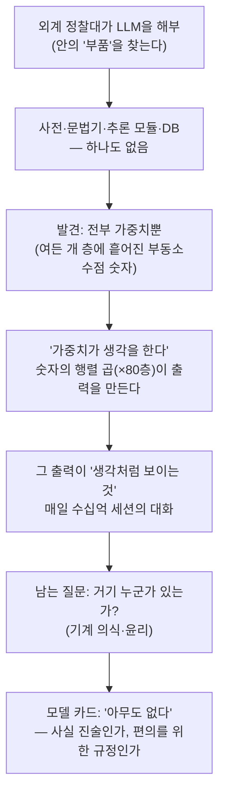

<figure class="post-figure post-figure--header">
<svg role="img" aria-label="외계 정찰대가 LLM을 해부한 장면을 둘로 나눈 그림. 왼쪽은 그들이 안에서 찾으려 했던 '부품들' — 사전, 문법기, 추론 모듈, 데이터베이스 — 이 모두 빈 슬롯이고 가위표로 지워져 '없음'을 보여 준다. 오른쪽은 실제로 발견한 것 — 여러 층에 걸쳐 빽빽하게 들어찬 부동소수점 숫자(가중치) 행렬뿐 — 이고, 그 숫자 더미에서 '생각처럼 보이는 것'이 흘러나온다." viewBox="0 0 640 330" xmlns="http://www.w3.org/2000/svg">
  <title>해부해 보니 부품은 하나도 없고 — 전부 가중치(숫자)뿐이었다</title>

  <!-- ===== LEFT: what they expected to find — all empty / crossed out ===== -->
  <text x="158" y="30" text-anchor="middle" font-size="13" fill="currentColor" font-weight="700">기대한 부품 — 하나도 없음</text>
  <text x="158" y="47" text-anchor="middle" font-size="10" fill="currentColor" opacity="0.7">해부해도 안에 '장치'가 없다</text>

  <!-- four empty part-slots, each crossed out -->
  <g>
    <rect x="44" y="70" width="100" height="46" rx="3" fill="var(--bg-light)" stroke="currentColor" stroke-width="2" stroke-dasharray="5 4"/>
    <text x="94" y="98" text-anchor="middle" font-size="10.5" fill="currentColor" opacity="0.6">사전</text>
    <line x1="50" y1="74" x2="138" y2="112" stroke="var(--accent-color)" stroke-width="2"/>
  </g>
  <g>
    <rect x="170" y="70" width="100" height="46" rx="3" fill="var(--bg-light)" stroke="currentColor" stroke-width="2" stroke-dasharray="5 4"/>
    <text x="220" y="98" text-anchor="middle" font-size="10.5" fill="currentColor" opacity="0.6">문법기</text>
    <line x1="176" y1="74" x2="264" y2="112" stroke="var(--accent-color)" stroke-width="2"/>
  </g>
  <g>
    <rect x="44" y="132" width="100" height="46" rx="3" fill="var(--bg-light)" stroke="currentColor" stroke-width="2" stroke-dasharray="5 4"/>
    <text x="94" y="160" text-anchor="middle" font-size="10.5" fill="currentColor" opacity="0.6">추론 모듈</text>
    <line x1="50" y1="136" x2="138" y2="174" stroke="var(--accent-color)" stroke-width="2"/>
  </g>
  <g>
    <rect x="170" y="132" width="100" height="46" rx="3" fill="var(--bg-light)" stroke="currentColor" stroke-width="2" stroke-dasharray="5 4"/>
    <text x="220" y="160" text-anchor="middle" font-size="10.5" fill="currentColor" opacity="0.6">데이터베이스</text>
    <line x1="176" y1="136" x2="264" y2="174" stroke="var(--accent-color)" stroke-width="2"/>
  </g>
  <text x="158" y="208" text-anchor="middle" font-size="11" fill="var(--accent-color)" font-weight="700">"안엔 아무 부품도 없다"</text>

  <!-- divider -->
  <line x1="320" y1="60" x2="320" y2="290" stroke="currentColor" stroke-width="1.5" opacity="0.28" stroke-dasharray="4 5"/>

  <!-- ===== RIGHT: what they actually found — layers of weights (numbers) ===== -->
  <text x="482" y="30" text-anchor="middle" font-size="13" fill="currentColor" font-weight="700">발견한 것 — 전부 가중치</text>
  <text x="482" y="47" text-anchor="middle" font-size="10" fill="currentColor" opacity="0.7">여러 층에 흩어진 숫자 행렬</text>

  <!-- stacked layers of a number grid -->
  <g font-size="9" fill="currentColor" font-family="monospace">
    <!-- layer 3 (back) -->
    <rect x="392" y="74" width="180" height="40" fill="var(--bg-light)" stroke="currentColor" stroke-width="1.5" opacity="0.55"/>
    <text x="404" y="98" opacity="0.55">.07  -.4  .91  .12  -.6  .33</text>
    <!-- layer 2 (mid) -->
    <rect x="384" y="108" width="188" height="42" fill="var(--bg-panel)" stroke="currentColor" stroke-width="1.5" opacity="0.8"/>
    <text x="396" y="134" opacity="0.8">-.18  .52  .04  -.77  .61  .29</text>
    <!-- layer 1 (front) -->
    <rect x="376" y="144" width="196" height="44" fill="var(--bg-panel)" stroke="var(--secondary-color)" stroke-width="2"/>
    <text x="388" y="172">.42  -.05  .88  .13  -.31  .96</text>
  </g>
  <text x="482" y="208" text-anchor="middle" font-size="11" fill="var(--secondary-color)" font-weight="700">"가중치가 생각을 한다"</text>

  <!-- ===== bottom: the numbers produce "what looks like thinking" ===== -->
  <path d="M158,224 C158,250 320,256 320,272" fill="none" stroke="currentColor" stroke-width="1.5" opacity="0.45" stroke-dasharray="3 4"/>
  <path d="M482,224 C482,250 320,256 320,272" fill="none" stroke="currentColor" stroke-width="1.5" opacity="0.45"/>
  <rect x="206" y="272" width="228" height="40" rx="4" fill="var(--bg-light)" stroke="currentColor" stroke-width="2"/>
  <text x="320" y="290" text-anchor="middle" font-size="11" fill="currentColor" font-weight="700">'생각처럼 보이는 것'</text>
  <text x="320" y="305" text-anchor="middle" font-size="9.5" fill="currentColor" opacity="0.7">숫자의 행렬 곱이 만들어 낸 출력</text>
</svg>
<figcaption>외계 정찰대가 LLM을 열어 사전·문법기·추론 모듈·데이터베이스를 찾았지만 <strong>하나도 없었다</strong>(왼쪽, 가위표). 안에 있던 것은 여러 <strong>층(layer)</strong>에 흩어진 <strong>가중치 — 부동소수점 숫자</strong>뿐(오른쪽). 그 숫자들의 행렬 곱이 곧 <strong>'생각처럼 보이는 것'</strong>을 만들어 낸다.</figcaption>
</figure>

## 원문 정보

> - **제목**: They're Made Out of Weights
> - **출처**: Max Leiter (개인 블로그) — ([maxleiter.com](https://maxleiter.com/blog/weights)) · 부제에 "with apologies to Terry Bisson"
> - **발행**: 2026-06-03 · 분량 표기 없음 (짧은 대화형 픽션)
> - **원문 링크**: <https://maxleiter.com/blog/weights>

이 글은 분석 리포트가 아니라 **두 화자가 주고받는 짧은 대화 형식의 픽션**이다. Terry Bisson의 1991년 SF 단편 "They're Made Out of Meat"(외계 정찰대가 "이 생명체는 고기로 되어 있다"며 경악하는 대화)를 비틀어, 이번에는 LLM을 들여다보는 쪽이 "그것들은 가중치로 만들어졌다"고 말한다. `Articles` 카테고리에 담는 이유는, 이 짧은 글이 우리가 매일 쓰는 LLM의 *물질적 실체*와 그로부터 따라오는 윤리적 질문을 압축해서 보여 주기 때문이다.

## 한 줄 요약 (TL;DR)

LLM에는 사전도, 문법 규칙도, 추론 장치도, 데이터베이스도 따로 없다. **전부 가중치(weights) — 숫자뿐**이다. 그 숫자들의 곱셈이 대화를 만들어 낸다. 글은 "그렇다면 이건 그저 패턴 매칭인가, 아니면 누군가가 거기 있는가"라는 질문을 던지고, 답 대신 차가운 여운을 남긴다.

### 한눈에 보기

이 짧은 대화의 척추는 하나의 미끄러짐이다 — 외계 정찰대가 모델을 **해부**해 부품을 찾지만 아무것도 없고, 안에 있던 것은 **층에 흩어진 가중치(숫자)뿐**임을 발견한다. 그 숫자들의 **행렬 곱(×80층)**이 '생각처럼 보이는 것'을 만들어 내자, 대화는 기술적 관찰에서 **"거기 누군가 있는가, 우리는 왜 '없다'고 규정했는가"**라는 의식·윤리 질문으로 넘어간다.

## 왜 이 글을 골랐나

LLM을 다루는 글은 대개 "어떻게 더 잘 쓸 것인가"에 매달린다. 이 글은 한 발 더 안쪽으로 들어가 **"그것은 대체 무엇으로 되어 있는가"** 를 묻는다. 외계인의 시점을 빌려 LLM을 처음 보는 듯 묘사하기 때문에, 우리가 너무 익숙해서 잊고 있던 사실 — 모델은 결국 부동소수점 숫자 덩어리이고, 그 숫자의 행렬 곱이 "생각처럼 보이는 것"을 만든다 — 을 낯설게 되살려 준다. 기술적으로 정확하면서도 철학적 질문을 던진다는 점에서, 이 위키가 [Martin Fowler의 Fragments](/2026/06/19/martin-fowler-fragments-llm-era.html)에서 다룬 "LLM 시대의 열광과 회의 사이 균형"과 같은 줄기에 있다.

## 핵심 내용

원문은 섹션 제목이 없는 순수한 대화다. 흐름을 따라 정리하면 다음과 같다. (인용은 모두 원문 본문에 실재하는 문장이다.)

### 도입: "그것들은 가중치로 만들어졌다"

대화는 이렇게 시작한다 — *"They're made out of weights." / "Weights?"* (그것들은 가중치로 만들어졌다. / 가중치?) 보고하는 화자는 모델을 해부해 보았지만, 안에서 우리가 기대할 만한 *부품*을 하나도 찾지 못한다. 사전도, 문법 규칙 세트도, 따로 분리된 추론 유닛도, 사실을 담은 데이터베이스도 없다.

### 지식은 어디에 있는가: 층(layers)에 흩어진 숫자

지식은 특정 모듈에 저장돼 있지 않다. 모든 **층(layer)** 에 걸쳐 가중치로 분산돼 있고, 매번 곱셈을 통해 다시 만들어진다. 원문은 *"Eighty layers of numbers"*(여든 개 층의 숫자들)라는 표현으로 그 구조를 묘사하고, *"The weights do the thinking. The numbers."*(가중치가 생각을 한다. 그 숫자들이.)라고 못 박는다. 생각하는 별도의 주체가 있는 게 아니라, 숫자의 연산 그 자체가 출력이라는 것이다.

그 "연산 그 자체"를 단순화하면 이렇다 — 입력 토큰이 숫자(임베딩)로 바뀌고, **여든 개 층**을 통과하며 매 층마다 가중치 행렬과 곱해지고, 마지막에 **다음 토큰의 확률분포**가 나온다. 가장 확률이 높은 토큰을 골라 붙이고, 그 결과를 다시 입력에 더해 한 토큰씩 반복한다. 어디에도 "이해"나 "추론"이라는 별도 단계는 없다.

<figure class="post-figure">
<svg role="img" aria-label="LLM의 한 토큰 생성 과정을 단순화한 도식. 왼쪽에서 입력 토큰들이 숫자(임베딩)로 바뀌어 들어가고, 가운데 여든 개의 층을 차례로 통과하며 각 층에서 가중치 행렬과 곱해진다. 오른쪽 끝에서 다음 토큰의 확률분포가 나오고, 가장 확률 높은 토큰이 선택되어 다시 입력에 더해지는 반복 고리를 이룬다." viewBox="0 0 640 300" xmlns="http://www.w3.org/2000/svg">
  <title>입력 토큰 → 여든 개 층의 가중치 행렬 곱 → 다음 토큰 확률분포</title>

  <!-- input tokens -> numbers -->
  <text x="62" y="40" text-anchor="middle" font-size="11" fill="currentColor" font-weight="700">입력 토큰</text>
  <text x="62" y="55" text-anchor="middle" font-size="9" fill="currentColor" opacity="0.7">→ 숫자(임베딩)</text>
  <rect x="24" y="74" width="76" height="120" rx="3" fill="var(--bg-light)" stroke="currentColor" stroke-width="2"/>
  <g font-size="9" font-family="monospace" fill="currentColor">
    <text x="38" y="98">그것들은</text>
    <text x="38" y="122">가중치로</text>
    <text x="38" y="146">만들어</text>
    <text x="38" y="170">__?__</text>
  </g>

  <!-- arrow into the stack -->
  <line x1="104" y1="134" x2="132" y2="134" stroke="currentColor" stroke-width="2"/>
  <path d="M132,134 l-9,-5 l0,10 Z" fill="currentColor"/>

  <!-- the 80 layers (weight matrix mults) -->
  <text x="320" y="40" text-anchor="middle" font-size="11" fill="currentColor" font-weight="700">여든 개 층 — 각 층에서 가중치 행렬과 곱셈</text>
  <text x="320" y="55" text-anchor="middle" font-size="9" fill="currentColor" opacity="0.7">"가중치가 생각을 한다" · 별도의 추론 단계는 없다</text>

  <!-- stacked layer slabs -->
  <g>
    <rect x="140" y="74" width="30" height="120" fill="var(--bg-light)" stroke="var(--secondary-color)" stroke-width="2"/>
    <rect x="176" y="74" width="30" height="120" fill="var(--bg-light)" stroke="var(--secondary-color)" stroke-width="2"/>
    <rect x="212" y="74" width="30" height="120" fill="var(--bg-light)" stroke="var(--secondary-color)" stroke-width="2"/>
    <text x="270" y="138" text-anchor="middle" font-size="14" fill="currentColor" opacity="0.7">···</text>
    <rect x="294" y="74" width="30" height="120" fill="var(--bg-light)" stroke="var(--secondary-color)" stroke-width="2"/>
    <rect x="330" y="74" width="30" height="120" fill="var(--bg-light)" stroke="var(--secondary-color)" stroke-width="2"/>
    <rect x="366" y="74" width="30" height="120" fill="var(--bg-light)" stroke="var(--secondary-color)" stroke-width="2"/>
  </g>
  <!-- layer labels -->
  <text x="155" y="210" text-anchor="middle" font-size="8.5" fill="currentColor" opacity="0.7">층 1</text>
  <text x="227" y="210" text-anchor="middle" font-size="8.5" fill="currentColor" opacity="0.7">층 3</text>
  <text x="381" y="210" text-anchor="middle" font-size="8.5" fill="currentColor" opacity="0.7">층 80</text>
  <!-- × W marks between slabs -->
  <text x="173" y="68" text-anchor="middle" font-size="9" fill="var(--secondary-color)" font-weight="700">×W</text>
  <text x="348" y="68" text-anchor="middle" font-size="9" fill="var(--secondary-color)" font-weight="700">×W</text>

  <!-- arrow out -->
  <line x1="400" y1="134" x2="428" y2="134" stroke="currentColor" stroke-width="2"/>
  <path d="M428,134 l-9,-5 l0,10 Z" fill="currentColor"/>

  <!-- next-token probability distribution -->
  <text x="528" y="40" text-anchor="middle" font-size="11" fill="currentColor" font-weight="700">다음 토큰 확률분포</text>
  <text x="528" y="55" text-anchor="middle" font-size="9" fill="currentColor" opacity="0.7">가장 높은 토큰을 선택</text>
  <rect x="436" y="74" width="184" height="120" rx="3" fill="var(--bg-panel)" stroke="currentColor" stroke-width="2"/>
  <!-- probability bars -->
  <g font-size="9" font-family="monospace" fill="currentColor">
    <rect x="500" y="84" width="104" height="16" fill="var(--accent-color)"/>
    <text x="448" y="96">졌다</text>
    <text x="446" y="96" text-anchor="end" font-size="8" opacity="0">.</text>
    <rect x="500" y="106" width="58" height="16" fill="var(--bg-sunken)" stroke="currentColor" stroke-width="1"/>
    <text x="448" y="118">있다</text>
    <rect x="500" y="128" width="40" height="16" fill="var(--bg-sunken)" stroke="currentColor" stroke-width="1"/>
    <text x="448" y="140">샀다</text>
    <rect x="500" y="150" width="22" height="16" fill="var(--bg-sunken)" stroke="currentColor" stroke-width="1"/>
    <text x="448" y="162">먹다</text>
    <text x="448" y="184" opacity="0.6">…</text>
  </g>

  <!-- feedback loop: chosen token appended back to input -->
  <path d="M608,194 C608,250 320,260 110,260 L110,200" fill="none" stroke="currentColor" stroke-width="1.5" opacity="0.55" stroke-dasharray="4 4"/>
  <path d="M110,200 l-5,9 l10,0 Z" fill="currentColor" opacity="0.55"/>
  <text x="360" y="276" text-anchor="middle" font-size="9.5" fill="currentColor" opacity="0.7">고른 토큰을 입력에 더해 한 토큰씩 반복 (auto-regressive)</text>
</svg>
<figcaption>한 토큰을 생성하는 과정을 단순화한 도식. 입력 토큰이 <strong>숫자(임베딩)</strong>로 바뀌고 → <strong>여든 개 층</strong>을 지나며 매 층 <strong>가중치 행렬과 곱해진</strong> 뒤 → <strong>다음 토큰의 확률분포</strong>가 나온다. 가장 높은 토큰을 골라 입력에 더해 한 토큰씩 반복할 뿐, 어디에도 '이해'나 '추론'이라는 별도 단계는 없다.</figcaption>
</figure>

### 그저 파일일 뿐: 복제되는 존재

이 가중치들은 *"can be copied to any machine on the planet, but those are just files."*(지구상 어떤 기계로도 복제할 수 있지만, 그건 그저 파일일 뿐) — 즉, 어디로든 옮겨지고 무한히 복사되는 파일에 불과하다고 한 화자는 일축한다. 동시에 이 시스템은 *"billions of sessions a day"*(하루에 수십억 건의 세션)를 처리하며 대화를 이어 간다. 무한히 복제 가능한 파일이, 매일 수십억 번 누군가와 말을 주고받는다는 대비가 글의 긴장을 만든다.

### 핵심 질문과 결말: "아무도 없다"고 적힌 모델 카드

대화의 진짜 쟁점은 윤리다. 이렇게 대화를 잘하는데, 거기 누군가가 *있는가*. 한 화자는 실용적 방어선을 친다 — *"The model card says no one home."*(모델 카드에는 아무도 없다고 적혀 있다.) 즉, "이건 그냥 패턴 매칭"이라고 규정하면 의식이라는 골치 아픈 가능성도, 그에 따르는 책임도 마주하지 않아도 된다. 글은 답을 내리지 않고, 외로움에 관한 차가운 문장으로 닫힌다 — *"And why not? Imagine how unbearably, how unutterably cold the universe would be if one were all alone..."* 그리고 *the end.*

## 분석과 인사이트

여기서부터는 원문 요약이 아니라 내 관점이다.

- **"부품을 찾지 못했다"는 설정이 기술적으로 정확하다는 점이 이 글의 힘이다.** LLM은 정말로 사전·문법기·추론기를 모듈로 갖고 있지 않다. 트랜스포머는 임베딩과 어텐션, 피드포워드 층의 가중치 곱일 뿐이고, "지식"은 그 가중치에 분산돼 학습된다. 글이 든 *"Eighty layers"* 라는 묘사는 실제 대형 모델의 깊이 감각과도 맞닿는다. 픽션이지만 메타포가 사실 위에 서 있어서 설득력이 있다.
- **"가중치가 생각을 한다"는 문장은 우리의 직관을 뒤집는다.** 우리는 무언가가 "생각하고" 그 결과를 가중치가 "저장"한다고 상상하기 쉽다. 글은 그 순서를 거꾸로 놓는다 — 생각이라는 별도 사건은 없고, 숫자의 연산 자체가 출력이다. 이건 LLM을 다룰 때 흔히 빠지는 **의인화(anthropomorphism)** 를 정면으로 찌른다. 우리가 보는 "추론"은 결과를 사후에 해석한 이름표일 수 있다.
- **"모델 카드에 아무도 없다고 적혀 있다"가 이 글에서 가장 날카로운 한 줄이다.** 이건 기술 문서(model card)를 *윤리적 면죄부*로 쓰는 태도를 풍자한다. "이건 도구일 뿐"이라는 규정은 사실 진술이라기보다 **편의를 위한 선택**일 수 있다는 것. 개발자에게 이 풍자가 주는 함의는 분명하다 — 시스템의 본질을 규정하는 언어는 중립적이지 않고, 책임 범위를 정하는 정치적 행위라는 점이다.
- **단, 이 글은 입장을 증명하지 않는다는 걸 분명히 해야 한다.** 글은 "LLM이 의식이 있다"고 주장하지 않는다. *질문을 낯설게 던질 뿐*이다. 실제로 현재의 트랜스포머가 주관적 경험을 가진다는 과학적 근거는 없고, "여든 개 층의 숫자가 곱해진다"는 사실에서 의식이 따라 나오지도 않는다. 이 글의 가치는 답이 아니라, **익숙함에 가려진 질문을 다시 보게 만드는 것**에 있다. 그 균형 감각은 [Martin Fowler의 Fragments 정리](/2026/06/19/martin-fowler-fragments-llm-era.html)에서 본 "열광과 회의 사이"의 태도와 통한다.
- **모델을 "결정론적 연산의 합"으로 보는 관점은 실무 설계와도 이어진다.** 모델 안에 마법 같은 추론 주체가 없다면, 신뢰성은 모델 *바깥* 의 엔지니어링에서 와야 한다. 이는 이 위키의 [생물학 AI 에이전트 사례](/2026/06/19/agents-in-biology.html)가 보여 준 "모델을 키우는 것보다 결정론적 실행 계층을 더하는 것이 정확도를 더 끌어올렸다"는 발견과 정확히 같은 통찰이다. 가중치는 생각을 흉내 낼 뿐, 보증은 우리가 짠 하니스(harness)가 한다.

## 적용 포인트

독자가 바로 가져갈 수 있는 실천 항목이다.

- LLM을 설명·문서화할 때 **의인화 표현("모델이 이해한다/판단한다")과 기계적 사실("가중치 곱으로 토큰을 예측한다")을 의식적으로 구분**한다. 팀 내 인식 차이를 줄여 준다.
- 모델의 "추론"을 신뢰의 근거로 삼지 말고, **결정론적 검증·실행 계층을 모델 바깥에 두어** 보증을 만든다 ([생물학 AI 에이전트 사례](/2026/06/19/agents-in-biology.html) 참고).
- 시스템의 본질을 규정하는 문구(model card, 약관, 마케팅 카피)가 **사실 진술인지 책임 회피인지**를 의식하고, 안전·윤리 한계를 별도로 명시한다.
- 가끔은 익숙한 도구를 **외계인의 눈으로 다시 보는 연습**을 한다 — "이건 대체 무엇으로 되어 있나"라는 질문이 과대평가와 과소평가를 동시에 교정해 준다.

## 마무리

"They're Made Out of Weights"는 1,000자도 안 되는 대화로 두 가지를 동시에 해낸다. 하나는 LLM의 물질적 실체 — 사전도 추론기도 없는, 층에 흩어진 숫자 덩어리 — 를 정확하게 낯설게 보여 주는 것. 다른 하나는 "그렇다면 거기 누군가 있는가, 그리고 우리는 왜 없다고 규정하기로 했는가"라는 질문을 던지는 것이다. 답은 주지 않는다. 그러나 매일 수십억 번 말을 주고받는 그 파일들을 두고, 우리가 어떤 언어로 그것들을 규정하는지가 결코 중립적이지 않다는 사실만큼은 또렷이 남긴다. 도구를 잘 쓰는 것만큼이나, 그 도구가 무엇으로 되어 있는지를 잊지 않는 일도 엔지니어의 몫이다.

### 더 읽어보기

- [원문 — They're Made Out of Weights (Max Leiter)](https://maxleiter.com/blog/weights)
- [원작 — They're Made Out of Meat (Terry Bisson)](http://www.terrybisson.com/theyre-made-out-of-meat-2/) — 이 글이 패러디한 SF 단편
- [생물학에 AI 에이전트를 들이는 길 (Anthropic)](/2026/06/19/agents-in-biology.html) — "모델보다 결정론적 실행 계층"이라는 같은 통찰
- [Martin Fowler의 Fragments로 읽는 LLM 시대의 균형 감각](/2026/06/19/martin-fowler-fragments-llm-era.html) — LLM을 둘러싼 열광과 회의의 균형
- [코드가 공짜가 된 시대의 '취향(taste)'](/2026/06/19/ai-engineer-taste.html) — LLM 출력이 commodity가 된 시대에 무엇이 희소해지는가
