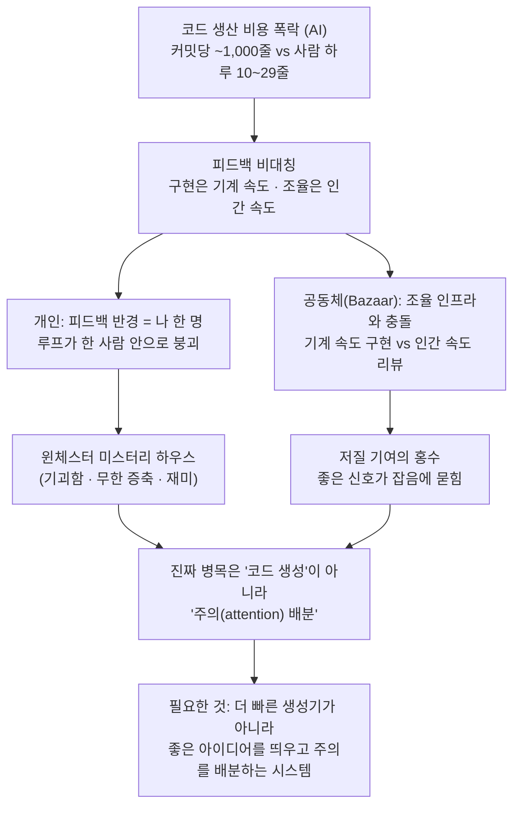

<figure class="post-figure post-figure--header">
<svg role="img" aria-label="세 가지 소프트웨어 개발 모델을 한 장에 나란히 둔 그림: 왼쪽은 좌우 대칭의 질서정연한 성당(Cathedral, 닫힌 소수 팀), 가운데는 여러 천막이 북적이는 시장(Bazaar, 열린 공동체), 오른쪽은 계단이 벽으로 이어지고 문이 허공으로 열린 기괴하게 증축된 윈체스터 미스터리 하우스(개인이 끝없이 증축하는 자작 도구)." viewBox="0 0 640 300" xmlns="http://www.w3.org/2000/svg">
  <title>성당 · 시장 · 윈체스터 미스터리 하우스 — 세 가지 개발 모델</title>
  <!-- ground line -->
  <line x1="20" y1="244" x2="620" y2="244" stroke="currentColor" stroke-width="2" opacity="0.4"/>

  <!-- ===== LEFT: CATHEDRAL — ordered, symmetric, closed ===== -->
  <text x="110" y="34" text-anchor="middle" font-size="13" fill="currentColor" font-weight="700">성당 · Cathedral</text>
  <text x="110" y="50" text-anchor="middle" font-size="10" fill="currentColor" opacity="0.7">닫힌 · 소수 팀</text>
  <!-- body -->
  <rect x="78" y="150" width="64" height="94" fill="var(--bg-light)" stroke="currentColor" stroke-width="2"/>
  <!-- symmetric gable roof -->
  <path d="M72,150 L110,108 L148,150 Z" fill="var(--bg-light)" stroke="currentColor" stroke-width="2" stroke-linejoin="round"/>
  <!-- central spire -->
  <path d="M110,108 L110,72 L110,108" stroke="currentColor" stroke-width="2"/>
  <path d="M104,86 L110,68 L116,86 Z" fill="var(--accent-color)" stroke="currentColor" stroke-width="1.5" stroke-linejoin="round"/>
  <!-- ordered arched windows (symmetric) -->
  <path d="M90,244 L90,182 a8,8 0 0 1 16,0 L106,244 Z" fill="var(--bg-panel)" stroke="currentColor" stroke-width="1.5"/>
  <path d="M114,244 L114,182 a8,8 0 0 1 16,0 L130,244 Z" fill="var(--bg-panel)" stroke="currentColor" stroke-width="1.5"/>
  <line x1="110" y1="150" x2="110" y2="244" stroke="currentColor" stroke-width="1" opacity="0.35"/>

  <!-- divider -->
  <line x1="200" y1="58" x2="200" y2="234" stroke="currentColor" stroke-width="1.5" opacity="0.28" stroke-dasharray="4 5"/>

  <!-- ===== CENTER: BAZAAR — many small stalls, busy, open ===== -->
  <text x="320" y="34" text-anchor="middle" font-size="13" fill="currentColor" font-weight="700">시장 · Bazaar</text>
  <text x="320" y="50" text-anchor="middle" font-size="10" fill="currentColor" opacity="0.7">열린 · 공동체 주도</text>
  <!-- stall 1 -->
  <rect x="246" y="196" width="44" height="48" fill="var(--bg-light)" stroke="currentColor" stroke-width="2"/>
  <path d="M242,196 L268,176 L294,196 Z" fill="var(--secondary-color)" stroke="currentColor" stroke-width="1.5" stroke-linejoin="round" opacity="0.85"/>
  <!-- stall 2 (taller) -->
  <rect x="298" y="180" width="46" height="64" fill="var(--bg-light)" stroke="currentColor" stroke-width="2"/>
  <path d="M294,180 L321,158 L348,180 Z" fill="var(--accent-color)" stroke="currentColor" stroke-width="1.5" stroke-linejoin="round" opacity="0.85"/>
  <!-- stall 3 -->
  <rect x="352" y="200" width="42" height="44" fill="var(--bg-light)" stroke="currentColor" stroke-width="2"/>
  <path d="M348,200 L373,182 L398,200 Z" fill="var(--secondary-color)" stroke="currentColor" stroke-width="1.5" stroke-linejoin="round" opacity="0.85"/>
  <!-- little market figures (the "eyeballs" / crowd) -->
  <circle cx="268" cy="226" r="5" fill="none" stroke="currentColor" stroke-width="1.5"/>
  <circle cx="321" cy="222" r="5" fill="none" stroke="currentColor" stroke-width="1.5"/>
  <circle cx="373" cy="228" r="5" fill="none" stroke="currentColor" stroke-width="1.5"/>
  <!-- exchange dots between stalls (feedback flowing) -->
  <circle cx="294" cy="170" r="2" fill="var(--gold)"/>
  <circle cx="348" cy="172" r="2" fill="var(--gold)"/>

  <!-- divider -->
  <line x1="440" y1="58" x2="440" y2="234" stroke="currentColor" stroke-width="1.5" opacity="0.28" stroke-dasharray="4 5"/>

  <!-- ===== RIGHT: WINCHESTER MYSTERY HOUSE — sprawling, idiosyncratic ===== -->
  <text x="540" y="34" text-anchor="middle" font-size="13" fill="currentColor" font-weight="700">미스터리 하우스</text>
  <text x="540" y="50" text-anchor="middle" font-size="10" fill="currentColor" opacity="0.7">개인 · 끝없는 증축</text>
  <!-- main mass -->
  <rect x="500" y="170" width="58" height="74" fill="var(--bg-light)" stroke="currentColor" stroke-width="2"/>
  <!-- bolted-on annex 1 (lower right, misaligned) -->
  <rect x="556" y="200" width="40" height="44" fill="var(--bg-light)" stroke="currentColor" stroke-width="2"/>
  <!-- bolted-on annex 2 (left, jutting, different height) -->
  <rect x="476" y="194" width="26" height="50" fill="var(--bg-light)" stroke="currentColor" stroke-width="2"/>
  <!-- crooked tower poking above -->
  <rect x="514" y="132" width="22" height="40" fill="var(--bg-light)" stroke="currentColor" stroke-width="2" transform="rotate(-7 525 152)"/>
  <path d="M510,134 L525,116 L540,134 Z" fill="var(--accent-color)" stroke="currentColor" stroke-width="1.5" stroke-linejoin="round" transform="rotate(-7 525 152)" opacity="0.85"/>
  <!-- STAIR that leads into a wall -->
  <path d="M566,242 l8,0 l0,-7 l8,0 l0,-7 l8,0 l0,-7 l6,0" fill="none" stroke="var(--secondary-color)" stroke-width="2"/>
  <line x1="596" y1="214" x2="596" y2="244" stroke="currentColor" stroke-width="2" opacity="0.5"/>
  <text x="600" y="234" font-size="9" fill="currentColor" opacity="0.7">벽으로</text>
  <!-- DOOR opening into mid-air -->
  <rect x="482" y="150" width="14" height="22" fill="var(--bg-panel)" stroke="var(--accent-color)" stroke-width="2"/>
  <path d="M482,172 l-10,8" stroke="currentColor" stroke-width="1.5" opacity="0.55" stroke-dasharray="2 3"/>
  <text x="470" y="148" text-anchor="middle" font-size="9" fill="currentColor" opacity="0.7">허공으로</text>
  <!-- mismatched windows scattered -->
  <rect x="510" y="186" width="9" height="11" fill="var(--bg-panel)" stroke="currentColor" stroke-width="1.2"/>
  <rect x="534" y="200" width="9" height="11" fill="var(--bg-panel)" stroke="currentColor" stroke-width="1.2"/>
  <rect x="566" y="214" width="9" height="11" fill="var(--bg-panel)" stroke="currentColor" stroke-width="1.2"/>
  <rect x="486" y="208" width="7" height="9" fill="var(--bg-panel)" stroke="currentColor" stroke-width="1.2"/>
</svg>
<figcaption>Raymond의 두 모델 — 좌우 대칭의 닫힌 <strong>성당</strong>과 북적이는 열린 <strong>시장</strong> — 옆에, Breunig이 더한 세 번째 모델: 계단이 벽으로 이어지고 문이 허공으로 열리는, 개인이 취향만으로 끝없이 증축하는 <strong>윈체스터 미스터리 하우스</strong>.</figcaption>
</figure>

## 원문 정보

> - **제목**: The Cathedral, the Bazaar, and the Winchester Mystery House
> - **출처**: Drew Breunig — O'Reilly Radar ([oreilly.com/radar](https://www.oreilly.com/radar/the-cathedral-the-bazaar-and-the-winchester-mystery-house/))
> - **발행**: 2026-04-03 · 약 12분 분량
> - **원문 링크**: <https://www.oreilly.com/radar/the-cathedral-the-bazaar-and-the-winchester-mystery-house/>

Eric Raymond의 고전 *The Cathedral and the Bazaar*(1998)에 한 개의 모델을 더 얹는 담론형 에세이라, Articles의 `AI-Essays`(AI 시대를 보는 관점·담론)에 담는다.

## 한 줄 요약 (TL;DR)

코드 생산 비용이 AI로 두 자릿수 배(order of magnitude) 떨어지면서, Raymond가 말한 '성당(closed)'과 '시장(open)'에 더해 세 번째 모델 — 개인이 자기 취향만으로 끝없이 증축하는 **윈체스터 미스터리 하우스** — 가 등장했다. 문제는 이 개인의 폭주가 인간 속도로 굴러가던 오픈소스 **시장(bazaar)**의 조율 인프라와 정면충돌한다는 것이다.

### 한눈에 보기

이 글의 척추는 하나의 인과 사슬이다 — AI로 코드 가격이 폭락하자 *구현은 기계 속도, 조율은 인간 속도*라는 피드백 비대칭이 생기고, 그 비대칭이 개인은 **미스터리 하우스**로, 공동체(bazaar)는 **기여의 홍수**로 갈라놓는다. 그래서 다음 시대에 필요한 것은 더 빠른 코드 생성기가 아니라 **주의(attention) 배분의 민주화**다.

## 왜 이 글을 골랐나

이 위키의 Articles에는 이미 "소프트웨어는 죽는가", "AI가 엔지니어를 대체하는가" 같은 *결론*을 다투는 글이 여럿 있다. 이 글은 그 윗단의 질문, **"AI가 소프트웨어를 만드는 방식의 모양 자체를 어떻게 바꾸는가"**를 1998년의 검증된 프레임 위에서 다시 묻는다. Raymond의 성당·시장은 25년간 오픈소스 담론의 기본 어휘였는데, Breunig은 그 어휘에 모델 하나를 *추가*함으로써 "vibe coding으로 쏟아지는 개인 도구들"과 "curl·오픈소스가 겪는 기여 홍수"를 같은 그림 안에 놓는다. 비유가 설명력을 갖는 드문 에세이다.

## 핵심 내용

원문은 Raymond의 두 모델을 복습한 뒤, 윈체스터 미스터리 하우스라는 세 번째 모델을 세우고, 그것이 시장(bazaar)에 무엇을 하는지를 따진다.

### 출발점: 성당과 시장

Eric Raymond는 1998년 두 가지 소프트웨어 개발 모델을 정식화했다.

- **성당(Cathedral)**: 닫힌 소스, 치밀하게 계획된 설계, 소수의 배타적 개발자 팀.
- **시장(Bazaar)**: 열려 있고 투명하며 커뮤니티가 주도하는, 인터넷 배포가 가능케 한 방식.

시장 모델의 동력은 분산된 피드백이었다. 흔히 **Linus의 법칙**이라 불리는 Raymond의 유명한 명제가 그 핵심을 압축한다.

> "Given enough eyeballs, all bugs are shallow."

보는 눈이 충분히 많으면 어떤 버그도 결국 얕아진다는 것. 사반세기 동안 오픈소스의 우세를 만든 것은 바로 이 분산된 피드백이었다.

### 윈체스터 미스터리 하우스라는 비유

Sarah Winchester는 Winchester 연발총 회사의 배당을 손에 쥔 채, 정식 건축 교육 없이 500개에 가까운 방을 가진 대저택을 끝없이 지었다. 원문이 드는 숫자들 — 약 160개의 방, 2,000개의 문, 10,000개의 창, 47개의 계단, 47개의 벽난로, 13개의 욕실, 6개의 주방. 푸시버튼 가스등, 초기 형태의 인터컴, 스팀 난방, 실내 정원 같은 당대의 혁신이 들어갔고, 동시에 **벽으로 이어지는 계단**이나 **허공으로 열리는 문** 같은 기이함도 함께 있었다.

저택의 본질은 *무제한 자원으로, 개인의 관심사를 끝까지 밀어붙인 끊임없는 반복*이다. 계획하고, 짓고, 버리고, 헐고, 다시 짓는다. Breunig은 이것을 세 번째 개발 모델의 은유로 삼는다.

### 코드가 공짜가 되면

원문이 제시하는 생산량 비대칭이 글 전체의 토대다.

- Claude Code는 커밋당 **순증 약 1,000줄**(7일 평균)의 코드를 만든다.
- 인간 벤치마크: 하루 **10~29줄**. 원문은 Fred Brooks의 고전적 수치와 함께, antirez(Redis의 Salvatore Sanfilippo)의 계산 `70000/(22 x 11 x 10) = ~29 LOC / day` 를 인용한다.

결국 커밋당 1,000줄이라는 숫자는 인간 프로그래머의 하루 생산량을 약 두 자릿수 배 웃돈다. 이 비용 폭락은 인터넷이 시장(bazaar)을 가능케 했던 사건과 닮았지만, 결정적으로 **피드백의 동역학을 뒤집어 놓는다.** 시장 모델에서는 기여자가 많아 피드백의 *처리량*은 높았지만 변경 하나가 반영되기까지의 *지연*은 길었다 — 이슈를 등록하고, 토론하고, PR을 리뷰하는 인간의 시간이 필요했기 때문이다. 그런데 AI 코딩에서는 *구현*만 기계 속도로 빨라졌을 뿐, *피드백과 조율*은 여전히 인간 속도에 묶여 있다.

여기서 글 전체를 떠받치는 결정적 문장이 나온다.

> "There is only one source of feedback that moves at the speed of AI-generated code: yourself."

AI가 만든 코드의 속도를 따라잡을 수 있는 피드백 소스는 단 하나, 바로 자기 자신뿐이라는 것. 그래서 설계 루프는 개인의 취향과 필요 안으로 붕괴(collapse)해 버린다.

<figure class="post-figure">
<svg role="img" aria-label="피드백 비대칭을 두 막대로 보여주는 그림: 위쪽 '구현 속도' 막대는 AI 코딩으로 약 100배 길어져 화면 끝까지 뻗어 있고, 아래쪽 '인간의 리뷰·조율 속도' 막대는 예전 그대로 짧다. 두 막대의 길이 차이로 생긴 빈 구간이 곧 한 사람의 취향만으로 채워지는 '미스터리 하우스'가 자라는 빈틈이다." viewBox="0 0 640 280" xmlns="http://www.w3.org/2000/svg">
  <title>피드백 비대칭 — 구현은 100배 빨라졌지만 리뷰·조율은 그대로</title>
  <!-- baseline marker (the old human pace, shared start) -->
  <line x1="150" y1="40" x2="150" y2="226" stroke="currentColor" stroke-width="1.5" opacity="0.35" stroke-dasharray="4 5"/>
  <text x="150" y="252" text-anchor="middle" font-size="10" fill="currentColor" opacity="0.7">출발점(인간 속도)</text>

  <!-- TOP BAR: implementation speed — stretched ~100x by AI -->
  <text x="142" y="78" text-anchor="end" font-size="12" fill="currentColor" font-weight="700">구현 속도</text>
  <text x="142" y="94" text-anchor="end" font-size="10" fill="currentColor" opacity="0.7">AI로 ~100배</text>
  <!-- the old short stub (what a human used to produce) -->
  <rect x="150" y="68" width="34" height="26" fill="var(--bg-light)" stroke="currentColor" stroke-width="1.5"/>
  <!-- the AI-amplified extension to the far edge -->
  <rect x="184" y="68" width="420" height="26" fill="var(--accent-color)" stroke="currentColor" stroke-width="1.5" opacity="0.9"/>
  <text x="396" y="86" text-anchor="middle" font-size="11" fill="var(--bg-panel)" font-weight="700">커밋당 ~1,000줄 / 7일</text>

  <!-- BOTTOM BAR: human review & coordination — unchanged -->
  <text x="142" y="166" text-anchor="end" font-size="12" fill="currentColor" font-weight="700">리뷰·조율 속도</text>
  <text x="142" y="182" text-anchor="end" font-size="10" fill="currentColor" opacity="0.7">그대로(인간)</text>
  <rect x="150" y="156" width="60" height="26" fill="var(--secondary-color)" stroke="currentColor" stroke-width="1.5" opacity="0.9"/>
  <text x="180" y="174" text-anchor="middle" font-size="10" fill="var(--bg-panel)" font-weight="700">하루 10~29줄</text>

  <!-- THE GAP — the span where the mystery house grows -->
  <line x1="210" y1="120" x2="210" y2="144" stroke="currentColor" stroke-width="1.5" opacity="0.5"/>
  <line x1="604" y1="120" x2="604" y2="144" stroke="currentColor" stroke-width="1.5" opacity="0.5"/>
  <line x1="210" y1="132" x2="604" y2="132" stroke="var(--gold)" stroke-width="2" stroke-dasharray="5 4"/>
  <path d="M210,132 l10,-4 l0,8 z" fill="var(--gold)"/>
  <path d="M604,132 l-10,-4 l0,8 z" fill="var(--gold)"/>
  <text x="407" y="124" text-anchor="middle" font-size="12" fill="currentColor" font-weight="700">이 빈틈 = 미스터리 하우스가 자라는 자리</text>

  <!-- punchline -->
  <text x="320" y="224" text-anchor="middle" font-size="11" fill="currentColor" opacity="0.85">조율이 못 따라가는 구간은 결국 '나 한 명'의 취향으로 채워진다</text>
</svg>
<figcaption>구현은 AI로 약 두 자릿수 배 빨라졌지만, 리뷰·조율은 여전히 인간 속도다. 두 막대의 길이 차이로 벌어진 빈틈은 조율로 채울 수 없어, 결국 *유일하게 기계 속도로 움직이는 피드백 소스* — 즉 자기 자신 — 의 취향으로 메워진다. 그곳이 미스터리 하우스가 자라는 자리다.</figcaption>
</figure>

### 미스터리 하우스에 오신 걸 환영합니다

원문은 동시대의 '윈체스터 미스터리 하우스'들을 줄지어 보여준다. Steve Yegge의 Gas Town은 지독하게 개인적이고 끝없이 뻗어 나가는 도구이고, Jeffrey Emanuel의 Agent Flywheel은 SQLite·Node.js·btrfs·Redis·pandas·NumPy·JAX·Torch를 Rust로 다시 쓴 'FrankenSuite'까지 끌어안는다. Gary Tan의 gstack은 대부분 Markdown으로 조립한 개인용 AI 위원회다. Philip Zeyliger의 관찰처럼, 이제 모두가 저마다의 소프트웨어 공장을 짓고 있는 셈이다.

이 도구들을 정의하는 세 기둥이 있다.

1. **기괴함(Idiosyncratic)**: 만든 사람의 욕구를 그대로 반영한, 문서 없고 외부인에겐 해독 불가한 도구.
2. **무한 증축(Sprawling)**: 끊임없이 새 기능·새 저장소를 합병한다. 작업은 거의 *덧붙이기*뿐 — 코드가 공짜이니 가지를 칠 동기가 없다.
3. **재미(Fun)**: 코딩 에이전트는 모든 것을 사이드 퀘스트로 바꾼다. 워크플로 최적화 자체가 열정의 대상이 된다.

### 그럼 시장(bazaar)은 어떻게 되나

핵심 역설: 코드가 너무 싸진 나머지, 개인의 미스터리 하우스도 *그리고* 오픈소스로의 기여도 둘 다 폭증한다.

- curl의 커밋은 에이전트 시대 들어 급증했고, "Show HN" 게시물은 280%, 신규 GitHub 저장소는 93% 늘었으며, Crates.io 패키지도 급증 중이다.
- 그러나 오픈소스 저장소는 **에이전트가 쓴 저질 기여의 홍수**를 맞는다. Daniel Stenberg는 형편없는 제출이 쏟아져 curl의 버그 바운티를 종료했고, GitHub은 풀 리퀘스트 기여를 끌 수 있는 기능을 추가했다.
- 좋은 신호가 잡음에 묻힌다. 이제 어려운 일은 *소프트웨어에서 버그를 찾는 것*이 아니라, **더 나은 리뷰 프로세스로 버그가 소프트웨어에 도달하지 못하게 막는 것**으로 옮겨간다.

문제의 핵심은 개인과 공동체가 같은 해법을 쓸 수 없다는 데 있다. 개인은 '자기 자신'이라는 유일한 기계 속도 피드백으로 루프를 닫아 버리는 편법을 쓸 수 있지만, 공동의 작업으로 정의되는 시장은 그 편법을 빌려 쓸 방법이 없다.

> "The bazaar, defined by communal work, can't adopt this hack. Coding agents in the bazaar create a mess: implementation at machine speed hitting coordination infrastructure built for human speed."

기계 속도로 쏟아지는 구현이 인간 속도로 지어진 조율 인프라에 정면으로 부딪히고, 그 충돌이 곧 시장을 엉망으로 만든다.

### 미스터리 하우스가 주는 세 가지 교훈

1. **공존할 수 있다.** 시장과 미스터리 하우스는 양립한다(원문은 OpenClaw를 예로 든다).
2. **재미있는 부분은 팔지 마라(Don't sell the fun stuff).** 개발자가 직접 만들고 싶어 하는 즐거운 부분을 협업 대상으로 끌어들이려 하지 말고, 오히려 그들이 피하거나 책임지기 싫어하는 부분을 함께 짊어지라는 것이다. 지루한 것, 어려운 부분, 실패의 대가가 재앙적인 것 — 그런 것들이야말로 commons에서 함께 만들어야 할 것이다. 공통의 핵심(core)과 개인의 커스터마이징을 분리해, 스테인드글라스 같은 개인 취향은 사용자에게 맡기고 배관(plumbing)은 공동의 몫으로 남긴다.
3. **코드의 한계는 결국 소통이다(The limits of code are communication).** 기계 속도에서 *주의(attention)를 관리하는 문제*는 여전히 풀리지 않은 채 남아 있다.

## 분석과 인사이트

여기서부터는 원문 요약이 아니라 내 관점이다.

**비유가 단순한 수사를 넘어 작동한다.** 성당·시장이 강력했던 이유는 *조직 구조*가 아니라 *피드백 위상(topology)*을 포착했기 때문이다. Breunig의 기여는 거기에 "피드백 루프가 한 사람 안으로 붕괴한 경우"를 추가한 것이다. 미스터리 하우스를 '나쁜 코드'의 비유로 읽으면 핵심을 놓친다. 그것은 **피드백 반경이 1명인 시스템**의 비유다. 이 관점은 [Addy Osmani의 'Intent Debt' 정리](/2026/06/21/intent-debt.html)와 정확히 맞물린다 — 코드는 공짜로 쏟아지지만, *왜 이렇게 만들었는가*라는 의도는 여전히 한 사람의 머릿속에만 있고 문서화되지 않는다. 미스터리 하우스의 '기괴함=문서 없음'은 곧 거대한 의도 부채다.

**진짜 병목이 옮겨갔다는 진단에 동의한다.** 구현이 100배 빨라졌다면, 시스템 전체의 처리량은 가장 느린 단계 — 리뷰·조율·합의 — 가 결정한다. 원문의 *"버그를 찾는 게 아니라 버그가 들어오지 못하게 막는 일"* 이라는 전환은, [소프트웨어는 죽는 게 아니라 재평가된다는 글](/2026/06/19/software-is-evolving-not-dead.html)이 말한 "해자(moat)의 이동"의 엔지니어링 버전이다. 코드 작성 능력이 흔해질수록, *무엇을 받아들이지 않을지 판단하는 능력*과 그 게이트를 운영하는 프로세스에 가치가 모인다. 같은 맥락에서 [AI 엔지니어의 '취향(taste)'](/2026/06/19/ai-engineer-taste.html)이 곧 미스터리 하우스 시대의 핵심 자산이 된다 — 무한 증축의 시대에 *가지를 칠 줄 아는 감각* 말이다.

**다만 '재미'를 마냥 긍정적으로만 둔 점은 경계하고 싶다.** 원문은 재미를 세 기둥의 하나로 담담하게 적지만, "모든 것이 사이드 퀘스트가 된다"는 것은 곧 *끝나지 않는 일*의 다른 이름이기도 하다. 코드가 공짜라 가지를 칠 동기가 없다는 관찰은, 거꾸로 **유지보수성이라는 미덕이 구조적으로 약해진다**는 경고로 읽어야 한다. 이 지점은 [Loris Cro의 '소프트웨어 북극성'](/2026/06/22/my-software-north-star.html)이 "기술적 탁월함이 아니라 사용자 효용·정확성·유지보수성이 먼저"라고 줄 세운 우선순위와 정면으로 만난다. 개인의 미스터리 하우스는 '사용자=나 한 명'이라 그 우선순위를 건너뛸 수 있지만, 그게 시장(bazaar)에 흘러들면 모두의 유지보수 비용으로 청구된다.

**"코드의 한계는 소통"이라는 마지막 교훈이 글 전체를 떠받친다.** Linus의 법칙은 "눈이 충분히 많으면"이라는 전제 위에 서 있었다 — 그 눈들이 *주의를 어디에 둘지* 조율되어 있다는 가정. AI는 코드 생성을 민주화했지만 **주의 배분은 민주화하지 못했다.** 그래서 원문의 통렬한 문장 — *"당신은 주의를 끌어 기여의 홍수에 빠지거나, 저장소의 바다에 빠져 아무 소식도 듣지 못한다."* 좋은 아이디어를 *수면 위로 띄우는* 메커니즘이 코드 생성 속도를 따라잡지 못하는 한, 시장은 *더 시끄러워질 뿐 더 똑똑해지지 않는다.* 이건 [Martin Fowler의 Fragments](/2026/06/19/martin-fowler-fragments-llm-era.html)가 말한 LLM 시대의 '플랫폼 중앙화'와도 통한다 — 주의를 배분하는 자가 권력을 갖는다.

## 적용 포인트

- **재미있는 것과 지루한 것을 분리하라.** 개인 도구로 즐겁게 증축하는 부분(스테인드글라스)과, 팀·오픈소스로 함께 책임져야 할 부분(배관)을 의식적으로 가른다. 실패의 대가가 재앙적인 것일수록 commons에서 협업하라.
- **에이전트 기여에는 게이트를 설계하라.** "버그를 잘 찾자"가 아니라 "저질 변경이 main에 닿지 못하게 하는 리뷰 프로세스"를 먼저 만든다. CI 게이트, 자동 검증, 변경 사유 명시 의무가 곧 시장의 면역계다.
- **무한 증축의 시대일수록 가지치기를 의례화하라.** 코드가 공짜라 삭제 동기가 사라진다는 점을 거꾸로 이용해, "이번 주에 무엇을 *지웠는가*"를 회고에 넣는다.
- **의도를 코드 옆에 남겨라.** 미스터리 하우스의 기괴함은 결국 문서 부재다. 에이전트가 1,000줄을 쓰게 두되, *왜*는 사람이 한 문단으로 남긴다(→ [Intent Debt](/2026/06/21/intent-debt.html)).
- **개인 도구를 공개하기 전에 '피드백 반경'을 점검하라.** 사용자가 나 하나일 때 통하던 결정(문서 없음, 무한 의존성, 취향 기반 설계)은 기여자가 둘만 되어도 비용으로 바뀐다.

## 마무리

Breunig의 메시지는 비관도 낙관도 아니다. 코드는 싸지만 *조율은 여전히 비싸다*는 비대칭이 이 시대의 모양을 결정한다는 것이다. 개인은 자기 안에서 루프를 닫아 즐겁게 미스터리 하우스를 짓고, 공동체는 같은 풍요 때문에 기여의 홍수에 시달린다. 다음 시대의 진짜 도구·관습·프로세스는 더 빠른 코드 생성기가 아니라 — *좋은 아이디어를 수면 위로 띄우고 주의를 배분하는 시스템*에서 나올 것이다. 그게 없으면, 개인의 미스터리 하우스에 갇힌 혁신은 그 집을 버리는 순간 함께 사라지고, 시장은 그저 더 소란해질 뿐이다.

### 더 읽어보기

- [원문 — The Cathedral, the Bazaar, and the Winchester Mystery House (Drew Breunig, O'Reilly Radar)](https://www.oreilly.com/radar/the-cathedral-the-bazaar-and-the-winchester-mystery-house/)
- [Intent Debt: 에이전트가 대신 갚아줄 수 없는 단 하나의 부채](/2026/06/21/intent-debt.html) — 미스터리 하우스의 '기괴함=문서 없음'이 곧 의도 부채
- [Loop Engineering: 에이전트를 프롬프트하는 시스템을 설계하라](/2026/06/19/loop-engineering.html) — 개인의 피드백 루프를 어떻게 구조화하나
- [소프트웨어는 죽는 게 아니라 재평가된다](/2026/06/19/software-is-evolving-not-dead.html) — 코드가 흔해질 때 해자(moat)가 이동하는 곳
- [AI 엔지니어의 '취향(taste)'](/2026/06/19/ai-engineer-taste.html) — 무한 증축의 시대에 '가지를 칠 줄 아는' 감각
- [내 소프트웨어의 북극성 (Loris Cro)](/2026/06/22/my-software-north-star.html) — 사용자 효용·정확성·유지보수성의 우선순위
- [Martin Fowler의 Fragments로 읽는 LLM 시대](/2026/06/19/martin-fowler-fragments-llm-era.html) — 플랫폼 중앙화와 주의의 권력
