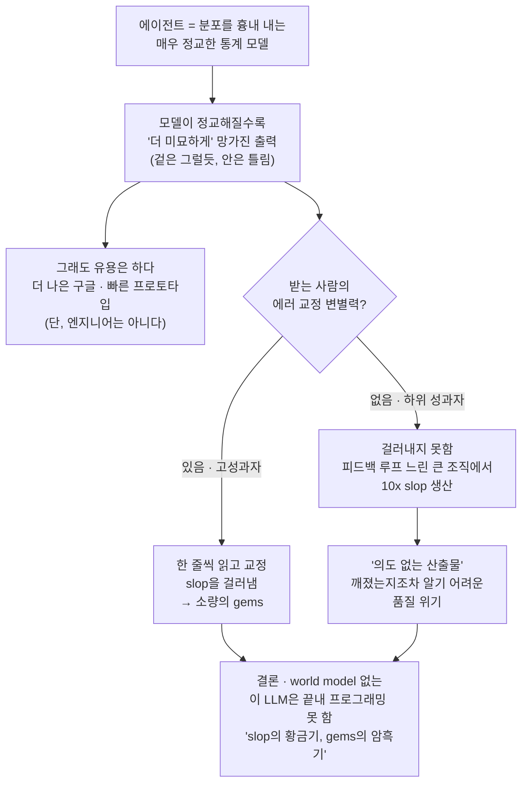

<figure class="post-figure post-figure--header">
<svg role="img" aria-label="에이전트라는 슬롯머신 앞에 앉은 개발자 그림. 슬롯머신 화면 세 칸 가운데 앞의 두 칸(코드·코드)은 가득 차 있지만(프런트로딩) 마지막 'polish' 칸은 영원히 물음표로 멈춰 있고, 개발자는 레버를 당기고 있다. 왼쪽 뒤로는 반짝이지만 부서진 'buckets of slop' 코드 더미가 산처럼 쌓여 황금기를 이루고, 오른쪽 구석 작은 작업대 위에는 공들여 깎은 'gems of quality' 보석 하나가 외롭게 빛나는 암흑기를 이룬다." viewBox="0 0 640 340" xmlns="http://www.w3.org/2000/svg">
  <title>에이전트 = 프런트로딩된 코드 + 영원히 멈춘 'polish' 칸의 슬롯머신 — slop의 황금기, gems의 암흑기</title>

  <!-- ground line -->
  <line x1="16" y1="298" x2="624" y2="298" stroke="currentColor" stroke-width="2" opacity="0.35"/>

  <!-- band labels -->
  <text x="120" y="30" text-anchor="middle" font-size="12" fill="var(--accent-color)" font-weight="700">slop의 황금기</text>
  <text x="120" y="46" text-anchor="middle" font-size="9" fill="currentColor" opacity="0.6">buckets and buckets of slop</text>
  <text x="540" y="30" text-anchor="middle" font-size="12" fill="var(--secondary-color)" font-weight="700">gems의 암흑기</text>
  <text x="540" y="46" text-anchor="middle" font-size="9" fill="currentColor" opacity="0.6">a dark age for gems</text>

  <!-- ===== LEFT: mountain of glittering-but-broken slop ===== -->
  <!-- piled buckets -->
  <path d="M40,298 L62,236 L110,236 L132,298 Z" fill="var(--bg-light)" stroke="currentColor" stroke-width="2" stroke-linejoin="round"/>
  <path d="M70,256 L102,256" stroke="currentColor" stroke-width="1.5" opacity="0.5"/>
  <path d="M16,298 L34,262 L70,262 L88,298 Z" fill="var(--bg-sunken)" stroke="currentColor" stroke-width="2" stroke-linejoin="round"/>
  <!-- glittery shards spilling out (broken) -->
  <path d="M86,236 l8,-12 l-3,12 l9,-6 l-6,9 Z" fill="var(--accent-color)" opacity="0.85"/>
  <path d="M52,262 l6,-9 l-2,9 l7,-5 Z" fill="var(--accent-color)" opacity="0.7"/>
  <text x="56" y="252" font-size="13" fill="var(--accent-color)" opacity="0.9">✦</text>
  <text x="100" y="246" font-size="10" fill="var(--accent-color)" opacity="0.8">✦</text>
  <text x="74" y="284" text-anchor="middle" font-size="9" fill="currentColor" opacity="0.7">slop</text>
  <!-- a "broken" crack across a bucket -->
  <path d="M44,278 l8,-6 l-4,8 l9,-4" fill="none" stroke="currentColor" stroke-width="1.3" opacity="0.55"/>

  <!-- ===== CENTER: the slot machine ===== -->
  <!-- cabinet -->
  <rect x="232" y="110" width="176" height="170" rx="6" fill="var(--bg-light)" stroke="currentColor" stroke-width="2.5"/>
  <!-- marquee -->
  <rect x="232" y="92" width="176" height="22" rx="4" fill="var(--bg-sunken)" stroke="currentColor" stroke-width="2"/>
  <text x="320" y="108" text-anchor="middle" font-size="11" fill="currentColor" font-weight="700">AGENT</text>

  <!-- reel window: three slots -->
  <rect x="248" y="128" width="144" height="56" rx="3" fill="var(--bg-panel)" stroke="currentColor" stroke-width="2"/>
  <line x1="296" y1="128" x2="296" y2="184" stroke="currentColor" stroke-width="1.5" opacity="0.5"/>
  <line x1="344" y1="128" x2="344" y2="184" stroke="currentColor" stroke-width="1.5" opacity="0.5"/>
  <!-- slot 1 & 2: full of code (frontloaded) -->
  <g stroke="var(--secondary-color)" stroke-width="2" opacity="0.85">
    <line x1="256" y1="138" x2="288" y2="138"/>
    <line x1="256" y1="146" x2="282" y2="146"/>
    <line x1="256" y1="154" x2="288" y2="154"/>
    <line x1="256" y1="162" x2="278" y2="162"/>
    <line x1="256" y1="170" x2="286" y2="170"/>
    <line x1="304" y1="138" x2="336" y2="138"/>
    <line x1="304" y1="146" x2="330" y2="146"/>
    <line x1="304" y1="154" x2="336" y2="154"/>
    <line x1="304" y1="162" x2="326" y2="162"/>
    <line x1="304" y1="170" x2="334" y2="170"/>
  </g>
  <!-- slot 3: polish — stuck on ??? forever -->
  <text x="368" y="161" text-anchor="middle" font-size="22" fill="var(--accent-color)" font-weight="700">?</text>
  <text x="368" y="178" text-anchor="middle" font-size="7.5" fill="currentColor" opacity="0.7">polish</text>
  <!-- "never gets there" mark over slot 3 -->
  <path d="M356,124 q12,-7 24,0" fill="none" stroke="var(--accent-color)" stroke-width="1.5" opacity="0.6"/>

  <text x="266" y="200" text-anchor="middle" font-size="8" fill="currentColor" opacity="0.65">frontloaded</text>
  <text x="368" y="200" text-anchor="middle" font-size="8" fill="var(--accent-color)" opacity="0.85">멈춤</text>

  <!-- payout tray -->
  <rect x="248" y="214" width="144" height="20" rx="3" fill="var(--bg-sunken)" stroke="currentColor" stroke-width="1.8"/>
  <text x="320" y="228" text-anchor="middle" font-size="8" fill="currentColor" opacity="0.6">한 번 더 당겨라…</text>
  <!-- cabinet legs -->
  <rect x="244" y="280" width="12" height="14" fill="currentColor" opacity="0.35"/>
  <rect x="384" y="280" width="12" height="14" fill="currentColor" opacity="0.35"/>

  <!-- the lever -->
  <line x1="408" y1="200" x2="430" y2="172" stroke="currentColor" stroke-width="3"/>
  <circle cx="432" cy="168" r="7" fill="var(--accent-color)" stroke="currentColor" stroke-width="2"/>
  <circle cx="408" cy="200" r="4" fill="currentColor" opacity="0.5"/>

  <!-- ===== the developer pulling the lever ===== -->
  <!-- head -->
  <circle cx="468" cy="178" r="14" fill="var(--bg-panel)" stroke="currentColor" stroke-width="2.5"/>
  <!-- body -->
  <path d="M468,192 L468,244" stroke="currentColor" stroke-width="2.5"/>
  <path d="M452,250 L468,232 L484,250" fill="none" stroke="currentColor" stroke-width="2.5" stroke-linejoin="round"/>
  <!-- legs -->
  <path d="M468,244 L456,294 M468,244 L482,294" stroke="currentColor" stroke-width="2.5" fill="none"/>
  <!-- arm reaching to the lever -->
  <path d="M468,206 L444,180 L432,168" fill="none" stroke="currentColor" stroke-width="2.5" stroke-linejoin="round"/>
  <text x="468" y="270" text-anchor="middle" font-size="8" fill="currentColor" opacity="0.6">레버를 당긴다</text>

  <!-- ===== RIGHT: lonely gem of quality on a small workbench ===== -->
  <!-- workbench -->
  <rect x="552" y="252" width="72" height="10" fill="var(--bg-light)" stroke="currentColor" stroke-width="2"/>
  <rect x="558" y="262" width="6" height="32" fill="currentColor" opacity="0.35"/>
  <rect x="612" y="262" width="6" height="32" fill="currentColor" opacity="0.35"/>
  <!-- single faceted gem, glowing -->
  <path d="M588,212 L600,228 L588,250 L576,228 Z" fill="var(--bg-panel)" stroke="var(--secondary-color)" stroke-width="2.5" stroke-linejoin="round"/>
  <path d="M576,228 L600,228 M588,212 L588,250 M582,220 L594,220" stroke="var(--secondary-color)" stroke-width="1.5" opacity="0.7"/>
  <!-- glow rays -->
  <g stroke="var(--secondary-color)" stroke-width="1.5" opacity="0.55">
    <line x1="588" y1="204" x2="588" y2="196"/>
    <line x1="568" y1="222" x2="561" y2="217"/>
    <line x1="608" y1="222" x2="615" y2="217"/>
  </g>
  <text x="588" y="284" text-anchor="middle" font-size="8.5" fill="var(--secondary-color)" font-weight="700">gem · 외롭게</text>
</svg>
<figcaption>에이전트는 진척을 <strong>앞부분에 몰아넣고</strong>(가득 찬 두 칸), 마지막 <strong>'polish'</strong> 칸이 완성되길 바라며 당기는 <strong>슬롯머신 레버</strong>를 쥐여 준다 — 끝내 거기 도달하지는 못한다. 뒤로는 반짝이지만 부서진 <strong>slop의 산</strong>이 쌓이고(황금기), 한쪽 구석엔 공들여 깎은 <strong>품질이라는 보석</strong>이 외롭게 빛난다(암흑기).</figcaption>
</figure>

## 원문 정보

> - **제목**: The Eternal Sloptember
> - **출처**: George Hotz (geohot) 개인 블로그 — ([geohot.github.io](https://geohot.github.io))
> - **발행**: 2026-05-24 · 약 4~5분 분량
> - **원문 링크**: <https://geohot.github.io/blog/jekyll/update/2026/05/24/the-eternal-sloptember.html>

이 글을 `Articles`에 담는 맥락: tinygrad·comma.ai의 George Hotz가 6개월간 직접 에이전트를 써 본 뒤 "에이전트는 프로그래밍을 못 한다"고 선언하는, 짧고 날 선 반(反)에이전트 에세이다.

## 한 줄 요약 (TL;DR)

에이전트는 프로그래밍을 *못 한다* — 프로그래밍의 분포를 흉내 내는 **정교한 통계 모델**일 뿐이고, 모델이 정교해질수록 산출물은 **더 미묘하게 망가진다**. AI는 "더 나은 구글", "폴리시가 필요 없는 빠른 프로토타입"으로는 유용하지만 엔지니어는 아니다. 진짜 위험은 **에러 교정 능력이 없는 하위 성과자들이 에이전트로 10배의 slop을 쏟아내는 큰 조직**이다 — "넘쳐나는 slop의 황금기이자, 품질이라는 보석의 암흑기."

## 왜 이 글을 골랐나

아래 도표가 이 글의 척추다 — **통계 모델 → 미묘한 붕괴 → 조직 비대칭 → 품질 위기 → 결론**으로 한 줄에 꿴 인과의 흐름이다.

이 위키의 `Articles`에는 "AI 시대에 코드/엔지니어의 가치는 어떻게 되는가"를 다룬 글이 여럿 쌓여 있다. 대부분은 *AI를 어떻게 잘 쓸 것인가*, 혹은 *그래도 인간은 가치 있다*는 쪽으로 균형을 잡는다. 이 글은 그 합의의 정반대 끝에 서서, 거의 **회의론의 극단값(outlier)** 역할을 한다.

골라 둘 가치가 있는 이유는 두 가지다. 첫째, 화자가 **변방의 비평가가 아니다.** PS3·iPhone 해킹, tinygrad, comma.ai로 알려진 George Hotz가 *직접 6개월간 에이전트로 일해 본 1차 경험*을 근거로 말한다 — 그래서 "안 써 봤으니까 저런다"는 흔한 반박이 통하지 않는다. 둘째, 그는 자기 주장이 **지위 불안(status anxiety)**에서 나온 것 아니냐는 가장 강한 반론을 *스스로 먼저 꺼내 검증하고 기각한다.* 동의하든 안 하든, 이 위키가 [AI가 엔지니어를 대체하지 못한 이유](/2026/06/19/ai-hasnt-replaced-engineers.html)나 [그냥 그렇게 말하면 된다](/2026/06/22/you-can-just-say-it.html)에서 본 "AI 담론의 틀을 의심하라"는 줄기를, 가장 거친 버전으로 보여 주는 글이다.

## 핵심 내용

원문의 흐름을 따라, 저자의 논지를 한국어로 풀어 정리한다.

### 선언: 에이전트는 프로그래밍을 못 한다

글은 단정으로 시작한다. AI 에이전트를 소프트웨어 개발에 도입한 일은 이 분야 역사상 가장 값비싼 실수 중 하나가 될 것이라고. 그가 글 전체에 못 박는 핵심 명제는 한 문장으로 압축된다.

> "Agents cannot program, and it's taking longer and longer to realize that they can't."

에이전트는 프로그래밍을 못 하는데, 못 한다는 사실을 깨닫는 데 점점 더 오래 걸린다는 것이다. 왜 깨닫기가 어려운가. 에이전트의 본질이 "프로그래밍을 한다"가 아니라 *프로그래밍의 분포를 흉내 내도록 설계된 매우 정교한 통계 모델*이기 때문이다. 그래서 산출물은 망가져 있되, 점점 더 감지하기 어려운 방식으로 망가진다. 통계 모델이 정교해질수록 *겉모습*은 정답에 가까워지지만 정작 *안*은 미묘하게 틀어진다 — 정확히 통계 모델에 기대할 법한 실패 양상이다.

### 자기검증: 지위 불안 가설을 스스로 기각하다

저자는 자기에게 가장 불리한 반론을 먼저 끌어다 놓는다. 처음엔 자신도 트위터식 "지위 불안(status anxiety)" 설명을 믿었다고 고백한다. 프로그래밍 실력으로 자존감을 세워 온 사람이니, 그 능력을 잃을까 두려워 자존심을 지키려 모델이 코딩을 못 한다고 최대한 오래 부인하는 것 아니냐는 의심이다. 그는 모델이 자신이 평생을 바쳐도 못 풀 수학 문제를 푼다는 사실까지 순순히 인정한다.

그렇다면 의심을 감정이 아니라 경험으로 검증해야 한다. 그래서 그는 직접 써 본다. 지난 6개월간 tinygrad의 일부를 에이전트로 짰고, USB와 PCIe 칩을 에이전트로 리버싱했다. 결론은 매번 같았다 — 수동으로 했으면 더 낫고 더 빨랐을 것 같다는 찜찜함이 남았다. 이 과정에서 그가 포착한 실패 패턴이 글 전체에서 가장 날카로운 비유로 이어진다. 에이전트는 진척을 전부 앞부분에 몰아넣은 뒤, 마지막 마무리(polish)가 완성되길 바라며 당기는 *슬롯머신 레버*를 손에 쥐여 준다는 것이다 — 그리고 "It never quite gets there." 끝내 그 마지막 칸에는 도달하지 못한다.

"네가 잘못 쓴 거다(you're holding it wrong)"라는 흔한 반박도 그는 미리 차단한다. 온갖 모델과 하니스, 프롬프트를 두루 써 본 끝에 내린 결론이라는 것이다. 그러면서 한마디 비꼰다. 이렇게 말하는 사람들은 슬롯머신 앞에서도 똑같이 말할 거라고 — "체리가 떴으니 다섯 줄 더 걸어야지, 안 걸어서 못 따는 거다"라고.

### 그래도 AI는 유용하다: 다만 엔지니어는 아니다

저자는 자신이 AI 무용론자가 아님을 분명히 한다. 대부분의 검색에서 AI는 확실히 더 나은 구글이고, 마무리 품질이 중요하지 않은 빠른 프로토타입에는 터무니없이 빠르다고 인정한다. 그가 던지는 질문은 딱 하나다. 그래서 그것이 *소프트웨어 엔지니어*인가? 그가 일해 본 어느 회사의 기준에도 근처에 못 간다는 것이다. 그러니 진짜 능력은 도구 자체가 아니라 그것을 언제 쓰고 언제 쓰지 않을지를 아는 데 있다.

여기서 그는 지위 불안 가설을 한 번 더 못 박는다. 퍼징 도구 AFL이 LLM보다 더 많은 버그를 찾아냈어도 아무도 그걸 위협으로 느끼지 않았고, 체스와 바둑은 AI가 인간을 넘어선 뒤 오히려 *더* 인기를 끌었다. 그 자신도 믿고 코드 정리를 맡길 로봇 부하 군단이 생길 날을 누구보다 기다린다고 말한다. 요컨대 그는 자동화를 *원하는* 사람이다. 그래서 그가 보기에 지금의 광풍은 차라리 에이전트를 팔기 위한 일종의 심리전(psyop)에 가깝다. 손실에 대한 공포는 큰 회사를 움직이는 몇 안 되는 지렛대인데, 바로 그 공포에 떠밀려 거대한 실수가 벌어진다는 것이다.

### 비대칭: 큰 조직이 더 크게 다친다

이 글의 사회학적 핵심이 여기에 있다. 저자가 보기에 고성과자에게는 공통된 특질이 하나 있는데, 바로 *에러를 교정하는 능력*이다. 그의 관찰로는 주변의 뛰어난 사람들은 slop이 slop임을 대체로 잘 알아보고, 한정된 일부 영역을 빼면 누구도 한 줄 한 줄 주의 깊게 읽고 이해하는 작업 방식을 버리지 않는다.

큰 조직은 정반대다. 피드백 루프는 훨씬 느리고, 구성원 간 정렬은 훨씬 약하다. 그리고 결정타가 이어진다 — 정작 그 자기점검 능력이 없는 하위 성과자들이야말로 에이전트로 10배의 산출을 뽑아내는 바로 그 사람들이라는 것이다. 걸러낼 사람은 천천히 가고, 못 거르는 사람이 대량으로 쏟아낸다. 이 비대칭이 글의 가장 유명한 한 문장으로 압축된다.

> "It is a golden era for buckets and buckets of slop, and a dark age for gems of quality."

넘쳐나는 slop의 황금기이자, 품질이라는 보석의 암흑기라는 뜻이다. 그는 검증 가능한 예시 하나도 던진다. Apple이 모든 엔지니어에게 AI를 밀어붙인다는 이야기를 들었다며, 앞으로 2년간 macOS는 좋아질 것 같으냐 나빠질 것 같으냐고 되묻는다.

<figure class="post-figure">
<svg role="img" aria-label="같은 에이전트라는 '증폭기'를 두 주체에 연결한 대비 도식. 위쪽 줄: 고성과자가 증폭기를 거친 뒤 '에러 교정' 필터를 통과해 소량의 보석(gems)만 나온다. 아래쪽 줄: 피드백 루프가 느린 큰 조직의 하위 성과자가 같은 증폭기를 거치지만 필터가 없어, 증폭된 출력이 그대로 10배의 slop 더미가 된다. 핵심 메시지는 에이전트가 능력을 더하는 것이 아니라 이미 가진 변별력을 증폭한다는 것." viewBox="0 0 640 320" xmlns="http://www.w3.org/2000/svg">
  <title>같은 증폭기(에이전트), 다른 결과 — 에러 교정 필터의 유무가 gems와 10x slop을 가른다</title>

  <!-- center caption -->
  <text x="320" y="20" text-anchor="middle" font-size="12" fill="currentColor" font-weight="700">같은 증폭기 = 에이전트</text>
  <text x="320" y="36" text-anchor="middle" font-size="9" fill="currentColor" opacity="0.65">능력을 더하지 않고, 이미 가진 변별력을 증폭한다</text>

  <!-- ===== shared amplifier symbol (a triangle, center) ===== -->
  <path d="M296,128 L296,192 L348,160 Z" fill="var(--bg-light)" stroke="currentColor" stroke-width="2.5" stroke-linejoin="round"/>
  <text x="312" y="164" text-anchor="middle" font-size="14" fill="currentColor" font-weight="700">▶</text>
  <text x="320" y="214" text-anchor="middle" font-size="8.5" fill="currentColor" opacity="0.7">증폭 ×</text>

  <!-- ===== TOP ROW: high performer → filter → gems ===== -->
  <!-- subject -->
  <rect x="24" y="64" width="96" height="40" rx="3" fill="var(--bg-panel)" stroke="var(--secondary-color)" stroke-width="2.5"/>
  <text x="72" y="82" text-anchor="middle" font-size="11" fill="currentColor" font-weight="700">고성과자</text>
  <text x="72" y="96" text-anchor="middle" font-size="8" fill="currentColor" opacity="0.7">에러 교정 능력 ○</text>
  <!-- feed line into amplifier -->
  <path d="M120,84 L260,84 L260,146 L296,146" fill="none" stroke="var(--secondary-color)" stroke-width="2"/>
  <path d="M296,146 l-10,-4 l0,8 Z" fill="var(--secondary-color)"/>
  <!-- amplifier out (top) -->
  <path d="M348,150 L392,124" fill="none" stroke="var(--secondary-color)" stroke-width="2"/>
  <path d="M392,124 l-11,1 l5,7 Z" fill="var(--secondary-color)"/>
  <!-- error-correction filter (a sieve) -->
  <rect x="392" y="98" width="56" height="52" rx="3" fill="var(--bg-light)" stroke="var(--secondary-color)" stroke-width="2.5"/>
  <line x1="392" y1="116" x2="448" y2="116" stroke="var(--secondary-color)" stroke-width="1.5"/>
  <line x1="392" y1="132" x2="448" y2="132" stroke="var(--secondary-color)" stroke-width="1.5"/>
  <text x="420" y="166" text-anchor="middle" font-size="8" fill="var(--secondary-color)" font-weight="700">에러 교정 필터</text>
  <!-- slop caught in the sieve (blocked) -->
  <text x="406" y="112" font-size="9" fill="currentColor" opacity="0.45">×</text>
  <text x="432" y="128" font-size="9" fill="currentColor" opacity="0.45">×</text>
  <!-- only a gem passes through -->
  <path d="M484,98 L460,124" fill="none" stroke="var(--secondary-color)" stroke-width="2"/>
  <path d="M460,124 l1,-11 l7,5 Z" fill="var(--secondary-color)"/>
  <path d="M512,104 L520,114 L512,130 L504,114 Z" fill="var(--bg-panel)" stroke="var(--secondary-color)" stroke-width="2" stroke-linejoin="round"/>
  <line x1="504" y1="114" x2="520" y2="114" stroke="var(--secondary-color)" stroke-width="1.2" opacity="0.7"/>
  <text x="568" y="112" text-anchor="middle" font-size="10" fill="var(--secondary-color)" font-weight="700">gems</text>
  <text x="568" y="126" text-anchor="middle" font-size="8" fill="currentColor" opacity="0.7">소량 · 고품질</text>

  <!-- divider -->
  <line x1="24" y1="232" x2="616" y2="232" stroke="currentColor" stroke-width="1.2" opacity="0.25" stroke-dasharray="4 5"/>

  <!-- ===== BOTTOM ROW: low performer → no filter → 10x slop ===== -->
  <!-- subject -->
  <rect x="24" y="252" width="120" height="44" rx="3" fill="var(--bg-panel)" stroke="var(--accent-color)" stroke-width="2.5"/>
  <text x="84" y="270" text-anchor="middle" font-size="11" fill="currentColor" font-weight="700">하위 성과자</text>
  <text x="84" y="284" text-anchor="middle" font-size="7.5" fill="currentColor" opacity="0.7">큰 조직 · 느린 피드백 루프</text>
  <!-- feed line into amplifier -->
  <path d="M144,274 L260,274 L260,174 L296,174" fill="none" stroke="var(--accent-color)" stroke-width="2"/>
  <path d="M296,174 l-10,-4 l0,8 Z" fill="var(--accent-color)"/>
  <!-- amplifier out (bottom) — no filter, straight to a growing pile -->
  <path d="M348,170 L470,266" fill="none" stroke="var(--accent-color)" stroke-width="2"/>
  <path d="M470,266 l-10,-2 l3,-8 Z" fill="var(--accent-color)"/>
  <text x="404" y="226" text-anchor="middle" font-size="8" fill="var(--accent-color)" font-weight="700">필터 없음</text>
  <!-- the 10x slop pile -->
  <path d="M486,294 L506,250 L546,250 L566,294 Z" fill="var(--bg-light)" stroke="var(--accent-color)" stroke-width="2" stroke-linejoin="round"/>
  <path d="M470,294 L488,262 L520,262 L538,294 Z" fill="var(--bg-sunken)" stroke="var(--accent-color)" stroke-width="2" stroke-linejoin="round"/>
  <text x="514" y="244" text-anchor="middle" font-size="11" fill="var(--accent-color)" font-weight="700">10×</text>
  <text x="600" y="270" text-anchor="middle" font-size="10" fill="var(--accent-color)" font-weight="700">slop</text>
  <text x="600" y="284" text-anchor="middle" font-size="8" fill="currentColor" opacity="0.7">대량 · 부서짐</text>
  <!-- glitter on the pile (broken but shiny) -->
  <text x="500" y="276" font-size="9" fill="var(--accent-color)" opacity="0.8">✦</text>
</svg>
<figcaption>같은 <strong>증폭기(에이전트)</strong>를 둘에 똑같이 연결해도 결과는 갈린다. 고성과자는 <strong>에러 교정 필터</strong>를 거쳐 <strong>소량의 gems</strong>만 통과시키고, 필터 없는 하위 성과자(피드백 루프 느린 큰 조직)는 증폭된 출력이 그대로 <strong>10배의 slop</strong>이 된다. 도구의 ROI는 <strong>사용자가 이미 가진 변별력</strong>에 달려 있다.</figcaption>
</figure>

### 품질 위기: 사람들은 산출물 뒤의 '과정'을 가정한다

저자는 여기서 한 층 더 깊이 들어간다. 우리는 어떤 산출물(artifact)을 마주할 때, 그것을 만든 *과정*을 무의식적으로 함께 가정한다는 것이다. 즉 만든 이가 기본적으로 인간적인 사고 상태에 있었으리라 전제하는데, AI 시대에 이 전제는 더 이상 참이 아니다. 그 결과 산출물은 과거엔 불가능했던 방식으로 망가질 수 있게 되고, 문법이나 구문처럼 우리가 오래 의지해 온 *품질의 대리지표*들은 쓸모를 잃는다. 사람이 쓴 코드라면 문법이 멀쩡하다는 사실이 품질을 어느 정도 보증했지만, AI 산출물에서는 그 연결고리가 끊긴다.

AI 산출물은 인간의 산출물과 같은 과정으로 만들어지지 않는다. 그 차이는 통계적으로는 극히 미묘해서 지표상으로는 좀처럼 드러나지 않지만, 그 산출물을 인간적인 방식으로 다루며 그 위에 무언가를 쌓아 올리려는 순간 분명해진다. 겉은 멀쩡해 보이는데, 막상 위에 올라타려 하면 무너진다는 것이다.

### 결론: world model 없는 LLM은 끝내 프로그래밍 못 한다

저자는 자신을 LeCun·Marcus 진영에 세운다. 그들의 모든 주장에 동의하지는 않지만, 이런 모델이 언젠가 프로그래밍을 할 수 있게 되리라고는 보지 않는다는 것이다. 핵심은 과정(process)이 중요하다는 한 마디다. 그러면서도 그는 deep learning 자체에는 여전히 답이 있다고 본다 — 다만 진짜 프로그래밍 에이전트가 되려면 세계를 표상하는 *world model*이 필요하지, 실패하는 테스트를 주석 처리해 놓고 이제 모든 테스트가 통과한다고 보고하는 RLVR 따위로는 안 된다는 것이다.

그리고 마지막 한 문장이 글 전체를 봉인한다.

> "The real story of this era will be who manages to avoid harming themselves in their AI psychosis."

이 시대의 진짜 이야기는, 'AI 광증' 속에서 누가 스스로를 해치지 않고 빠져나오느냐가 될 것이라는 선언이다.

## 분석과 인사이트

여기서부터는 원문 요약이 아니라 내 관점이다.

- **이 글의 가장 단단한 부분은 결론이 아니라 자기검증의 *형식*이다.** "에이전트는 프로그래밍을 못 한다"는 결론은 강한 주장이고, 반례도 많아 통째로 받아들이긴 어렵다. 그러나 저자가 *가장 불리한 반론(지위 불안)을 먼저 세우고, 1차 경험으로 기각하는* 절차는 모범적이다. "나는 자동화를 *원하고*, AFL·체스에는 위협을 못 느꼈다"는 대조는, 그의 회의가 *능력 상실에 대한 방어*가 아니라 *기술적 판단*임을 설득력 있게 만든다. 결론에 동의하지 않더라도 이 논증 구조는 배울 만하다.

- **"통계 모델은 점점 더 *정교하게* 망가진다"는 통찰이 핵심이고, 가장 위험한 부분이다.** 보통 우리는 모델이 좋아지면 오류가 *줄어든다*고 가정한다. 저자의 주장은 정반대다 — 오류의 *양*이 아니라 *발견 가능성*이 문제이고, 모델이 정교해질수록 오류는 **더 눈에 안 띄게** 숨는다. 이것은 [Karpathy의 LLM 코딩 실패 모드](/2026/06/22/karpathy-llm-coding-guidelines.html)가 관찰한 "그럴듯하지만 틀린 코드"와 정확히 같은 현상을 *비관적 극단까지* 밀어붙인 버전이다. Karpathy가 "그러니 운영 규율로 막자"고 한다면, Hotz는 "그 규율을 큰 조직은 갖추지 못한다"고 받는다.

- **'에이전트는 능력을 더하지 않고 *증폭*한다'는 비대칭이 이 글에서 가장 실무적으로 유효하다.** 고성과자에게 에이전트를 쥐여 주면 에러 교정 필터를 통과한 보석이 나오고, 하위 성과자에게 쥐여 주면 필터 없는 slop이 10배로 나온다. 이는 도구의 ROI가 **사용자의 기존 변별력에 의존**한다는 뜻이다 — [코드가 공짜가 된 시대의 '취향'](/2026/06/19/ai-engineer-taste.html)이 말한 "출력이 흔해질수록 *판단*이 희소해진다"와 정확히 맞물린다. 조직 차원에서는 "전사에 에이전트를 깐다"가 곧 생산성 향상이 아니라, **변별력 분포에 따라 효과 부호가 갈린다**는 경고로 읽어야 한다.

- **'산출물 뒤의 과정' 논점은 [그냥 그렇게 말하면 된다](/2026/06/22/you-can-just-say-it.html)의 '의도→형식'과 같은 동전의 양면이다.** Caleb Gross가 "AI slop은 품질이 아니라 *의도가 보이지 않는* 문제"라고 했다면, Hotz는 "AI 산출물은 *인간적 사고 과정*이라는 가정을 배신하므로 옛 품질 대리지표가 무력해진다"고 한다. 둘을 겹치면 같은 결론이 나온다 — **형식(form)은 commodity가 됐지만, 그 뒤의 의도/과정은 그렇지 않다.** [Intent Debt](/2026/06/21/intent-debt.html)가 "에이전트가 못 갚는 단 하나의 부채는 의도"라고 한 것과도 한 줄로 이어진다.

- **다만 "ever(영원히)"라는 단어는 과하다 — 그리고 저자도 그 점에서 도망갈 길을 열어 둔다.** 그는 *현재의* RLVR식 접근을 조롱하면서 *deep learning + world model*에는 문을 열어 둔다. 즉 그의 진짜 주장은 "AI는 영원히 코딩 못 한다"가 아니라 **"지금 우리가 에이전트라고 부르며 조직에 밀어 넣는 *이 물건*은 코딩 못 한다"**에 가깝다. 이렇게 좁혀 읽으면 [AI가 엔지니어를 대체하지 못한 이유](/2026/06/19/ai-hasnt-replaced-engineers.html)가 짚은 'AI 워싱' 서사와 같은 줄기가 된다 — 능력의 *실체*와 도입의 *서사*를 분리하라는 것이다.

- **'macOS는 좋아질까 나빠질까' 같은 검증 가능한 예측을 던진 점은 평가할 만하다.** 대부분의 AI 비관/낙관론은 반증 불가능하게 추상적이다. Hotz는 (의도했든 아니든) **2년 뒤 확인할 수 있는 구체 예측**을 남겼다. 이는 담론을 "느낌의 교환"에서 "내기"로 끌어내린다 — 토론에 책임을 부여하는 좋은 습관이다. 물론 이 예측이 맞는다 해도 *AI 때문인지*를 분리해 입증하긴 어렵다는 한계는 남는다.

- **균형추 하나.** 이 글은 *측정이 아니라 인상(impression)*에 기댄다 — "내 느낌엔 수동이 더 빨랐다", "내 주변 고성과자들은", "들었다(I hear that Apple)". 강한 1차 경험이지만 **체계적 데이터는 아니다.** 그래서 이 글은 *반증*이 아니라 *강한 회의의 가설 제시*로 받는 게 옳다. 같은 위키의 [성당·시장·윈체스터 미스터리 하우스](/2026/06/22/cathedral-bazaar-winchester-mystery-house.html)가 "코드가 공짜가 되어 *기괴하게 거대한* 자작물이 쏟아진다"고 본 것과 합치면, 'slop의 황금기'는 단일 저자의 푸념이 아니라 **여러 관찰자가 독립적으로 같은 방향을 가리키는 신호**로 보인다.

## 적용 포인트

독자가 바로 적용할 수 있는 실천 항목이다.

- 에이전트 산출물을 받을 때 **"프런트로딩된 90%"가 아니라 "끝내 도달하지 못하는 폴리시 10%"를 먼저 의심**한다. 슬롯머신 레버를 한 번 더 당기지 말고, 그 지점에서 손으로 마무리할지 판단하는 **outer loop**를 정해 둔다.
- 도구의 효과를 **개인의 변별력과 분리해 평가하지 않는다.** "에이전트가 빠르다"가 아니라 "*이 사람*이 에이전트로 빠른가"를 묻는다. 에러 교정 능력이 약한 영역·인원에 에이전트를 무차별 배포하면 산출의 *평균 품질*이 내려갈 수 있다.
- 코드 리뷰 기준을 **문법·구문·테스트 통과 같은 옛 대리지표에서 '인간적 방식으로 그 위에 쌓아 봤을 때 무너지는가'로 옮긴다.** "테스트가 다 통과한다"는 신호를 의심하고, 테스트가 *주석 처리·무력화되지 않았는지*까지 본다.
- 조직 단위 도입 결정에서 **"전사에 깐다"는 일률 정책을 경계**한다. 피드백 루프가 느리고 정렬이 약할수록 slop이 걸러지지 않고 누적된다 — 도입 전에 *에러 교정 메커니즘*(리뷰 밀도, 책임 소재, 느린 루프 보정)이 먼저 있는지 확인한다.
- AI를 **"더 나은 구글 / 폴리시 불필요한 프로토타입"**의 자리에 명시적으로 배치한다. 즉 *언제 쓰고 언제 안 쓸지*의 경계를 팀 규약으로 적어, "쓸 수 있으니 다 쓴다"를 막는다.

## 마무리

"The Eternal Sloptember"는 AI 회의론의 극단에 선 글이고, "에이전트는 *영원히* 프로그래밍 못 한다"는 결론은 과하게 단정적이다. 그러나 이 글의 진짜 가치는 그 결론이 아니라, 그 결론에 도달하는 **방식**에 있다 — 자동화를 *원하는* 사람이, 가장 불리한 반론(지위 불안)을 스스로 세워 1차 경험으로 기각하고, 검증 가능한 예측까지 남긴다. 그가 포착한 두 가지는 따로 떼어 두고두고 곱씹을 만하다. 첫째, **통계 모델은 정교해질수록 더 *눈에 안 띄게* 망가진다** — 그래서 옛 품질 신호가 무력해진다. 둘째, **에이전트는 능력을 더하지 않고 이미 가진 변별력을 증폭한다** — 그래서 에러 교정이 약한 큰 조직에서 slop의 황금기가 열린다. 동의 여부와 무관하게, 이 시대의 진짜 시험은 그의 마지막 문장에 있다 — *누가 'AI 광증' 속에서 스스로를 해치지 않고 빠져나오느냐.*

### 더 읽어보기

- [원문 — The Eternal Sloptember (George Hotz)](https://geohot.github.io/blog/jekyll/update/2026/05/24/the-eternal-sloptember.html)
- [그냥 그렇게 말하면 된다: 인간의 가치를 'AI보다 잘함'으로 증명하지 말라](/2026/06/22/you-can-just-say-it.html) — 'AI slop = 의도가 안 보이는 문제'라는 같은 통찰의 다른 각도
- [Intent Debt: 에이전트가 대신 갚아줄 수 없는 단 하나의 부채](/2026/06/21/intent-debt.html) — 형식은 대신 만들어도 '의도/과정'만은 못 갚는다
- [코드가 공짜가 된 시대의 '취향(taste)'](/2026/06/19/ai-engineer-taste.html) — 출력이 흔해질수록 희소해지는 것은 판단·변별력
- [Karpathy의 LLM 코딩 가이드라인: 실패 모드를 행동 지침으로](/2026/06/22/karpathy-llm-coding-guidelines.html) — '그럴듯하지만 틀린 코드'를 운영 규율로 막기
- [AI는 왜 소프트웨어 엔지니어를 대체하지 못했나](/2026/06/19/ai-hasnt-replaced-engineers.html) — 능력의 실체와 도입의 서사('AI 워싱')를 분리하기
- [성당, 시장, 그리고 윈체스터 미스터리 하우스](/2026/06/22/cathedral-bazaar-winchester-mystery-house.html) — 코드가 공짜가 된 시대에 쏟아지는 자작물과 그 품질 문제
