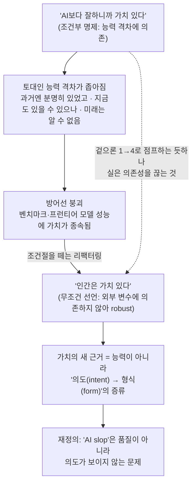

<figure class="post-figure post-figure--header">
<svg role="img" aria-label="인간의 가치를 떠받치는 두 가지 토대를 나란히 둔 그림. 왼쪽은 점점 좁아지는 쐐기 모양의 '인간–AI 능력 격차' 위에 위태롭게 올려놓은 '인간의 가치' 블록 — 격차가 줄어들수록 기울어 떨어지려 한다(조건부). 오른쪽은 격차와 무관하게 단단한 맨땅 받침대 위에 똑바로 선 '인간의 가치' 블록 — 흔들리지 않는다(무조건)." viewBox="0 0 640 320" xmlns="http://www.w3.org/2000/svg">
  <title>위태로운 조건부 토대 vs. 단단한 무조건적 토대 위의 '인간의 가치'</title>
  <!-- ground line -->
  <line x1="20" y1="270" x2="620" y2="270" stroke="currentColor" stroke-width="2" opacity="0.4"/>

  <!-- ===== LEFT: CONDITIONAL — value perched on a shrinking gap-wedge ===== -->
  <text x="160" y="34" text-anchor="middle" font-size="13" fill="currentColor" font-weight="700">조건부 · "AI보다 잘하니까"</text>
  <text x="160" y="51" text-anchor="middle" font-size="10" fill="currentColor" opacity="0.7">토대 = 좁아지는 능력 격차</text>

  <!-- shrinking wedge (the narrowing capability gap), tapering to the right -->
  <path d="M70,270 L260,270 L260,150 Z" fill="var(--bg-light)" stroke="currentColor" stroke-width="2" stroke-linejoin="round"/>
  <text x="150" y="252" text-anchor="middle" font-size="9.5" fill="currentColor" opacity="0.7">능력 격차</text>
  <!-- "narrowing" arrow eating into the wedge -->
  <line x1="92" y1="232" x2="150" y2="208" stroke="var(--accent-color)" stroke-width="2"/>
  <path d="M150,208 l-12,-1 l5,10 Z" fill="var(--accent-color)"/>
  <text x="92" y="226" font-size="9" fill="var(--accent-color)" font-weight="700">좁아짐</text>

  <!-- value block perched on the thin tip — tilting, about to slide off -->
  <g transform="rotate(13 248 132)">
    <rect x="216" y="106" width="64" height="42" fill="var(--bg-panel)" stroke="var(--accent-color)" stroke-width="2.5"/>
    <text x="248" y="132" text-anchor="middle" font-size="11" fill="currentColor" font-weight="700">인간의 가치</text>
  </g>
  <!-- wobble marks -->
  <path d="M286,104 q8,-4 6,-13" fill="none" stroke="currentColor" stroke-width="1.5" opacity="0.5"/>
  <path d="M294,116 q9,-3 9,-12" fill="none" stroke="currentColor" stroke-width="1.5" opacity="0.4"/>

  <!-- divider -->
  <line x1="320" y1="64" x2="320" y2="262" stroke="currentColor" stroke-width="1.5" opacity="0.28" stroke-dasharray="4 5"/>

  <!-- ===== RIGHT: UNCONDITIONAL — value upright on solid bedrock ===== -->
  <text x="480" y="34" text-anchor="middle" font-size="13" fill="currentColor" font-weight="700">무조건 · "그냥 가치 있다"</text>
  <text x="480" y="51" text-anchor="middle" font-size="10" fill="currentColor" opacity="0.7">토대 = 격차와 무관한 맨땅</text>

  <!-- solid bedrock pedestal -->
  <rect x="392" y="226" width="176" height="44" fill="var(--bg-light)" stroke="currentColor" stroke-width="2"/>
  <!-- bedrock hatch (solid ground) -->
  <line x1="404" y1="270" x2="416" y2="248" stroke="currentColor" stroke-width="1.2" opacity="0.4"/>
  <line x1="430" y1="270" x2="442" y2="248" stroke="currentColor" stroke-width="1.2" opacity="0.4"/>
  <line x1="456" y1="270" x2="468" y2="248" stroke="currentColor" stroke-width="1.2" opacity="0.4"/>
  <line x1="482" y1="270" x2="494" y2="248" stroke="currentColor" stroke-width="1.2" opacity="0.4"/>
  <line x1="508" y1="270" x2="520" y2="248" stroke="currentColor" stroke-width="1.2" opacity="0.4"/>
  <line x1="534" y1="270" x2="546" y2="248" stroke="currentColor" stroke-width="1.2" opacity="0.4"/>
  <text x="480" y="252" text-anchor="middle" font-size="9.5" fill="currentColor" opacity="0.7">단단한 받침대</text>

  <!-- value block upright, centered, stable -->
  <rect x="446" y="150" width="68" height="46" fill="var(--bg-panel)" stroke="var(--secondary-color)" stroke-width="2.5"/>
  <text x="480" y="178" text-anchor="middle" font-size="11" fill="currentColor" font-weight="700">인간의 가치</text>
  <!-- stability anchor -->
  <line x1="480" y1="196" x2="480" y2="226" stroke="var(--secondary-color)" stroke-width="2"/>
  <!-- steady base ticks (it is not going anywhere) -->
  <line x1="462" y1="214" x2="498" y2="214" stroke="var(--secondary-color)" stroke-width="1.5" opacity="0.6"/>
</svg>
<figcaption>같은 <strong>"인간의 가치"</strong> 블록이라도 토대가 다르다. 왼쪽은 좁아지는 <strong>능력 격차</strong>라는 쐐기 끝에 위태롭게 올라서 격차가 줄수록 기운다(조건부). 오른쪽은 격차와 무관한 <strong>맨땅</strong> 위에 똑바로 선다 — 외부 변수에 의존하지 않아 흔들리지 않는다(무조건).</figcaption>
</figure>

## 원문 정보

> - **제목**: You can just say it
> - **출처**: Caleb Gross (개인 블로그) — ([noperator.dev](https://noperator.dev))
> - **발행**: 2026-05-28 · 약 4~5분 분량
> - **원문 링크**: <https://noperator.dev/posts/you-can-just-say-it/>

이 글을 `Articles`에 담는 맥락: "AI 시대에 인간은 왜 가치 있는가"를 논증하는 흔한 방식 자체에 결함이 있다고 짚는 짧고 단단한 에세이다.

## 한 줄 요약 (TL;DR)

인간의 가치를 "AI보다 잘하니까"라는 **조건**으로 방어하면, 그 조건(능력 격차)이 좁아지는 순간 방어선도 무너진다. 저자는 조건을 떼고 **"인간은 가치 있다"**고 그냥 선언하라고 말한다. 그리고 인간 창작의 본질을 능력이 아니라 **의도(intent)를 형식(form)으로 증류하는 행위**로 다시 정의한다 — 'AI slop'은 품질 문제가 아니라 **의도가 보이지 않는** 문제다.

## 왜 이 글을 골랐나

이 위키의 `Articles`에는 "AI 시대에 엔지니어/인간이 어떻게 가치를 지킬 것인가"를 다룬 글이 여럿 있다. 대부분은 *무엇을 더 잘해야 하는가*(취향, 판단, 검증)에 답한다. 이 글은 그 질문의 한 층 **아래**를 찌른다 — 애초에 "더 잘하니까 가치 있다"는 **논증 형식 자체가 함정**이라는 것이다.

짧지만(1분이면 읽힌다) 칼끝이 분명하다. 우리가 "AI는 이건 절대 못 해", "사람이 더 잘해", "사람 손엔 미묘한 스타일이 있어" 같은 말로 안심할 때, 우리는 사실 **녹아내리는 얼음 위에 가치를 세우고 있다**는 점을 드러낸다. 코드가 commodity가 된 시대에 무엇이 희소해지는지 물었던 [코드가 공짜가 된 시대의 '취향'](/2026/06/19/ai-engineer-taste.html), 에이전트가 대신 갚아줄 수 없는 부채를 짚은 [Intent Debt](/2026/06/21/intent-debt.html)와 같은 줄기에 있으면서도, 그보다 더 **근본 전제**를 건드린다.

### 한눈에 보기

이 글의 척추는 하나의 논증 리팩터링이다 — 가치를 *능력 격차*라는 조건에 매단 명제가 격차가 좁아지면서 무너지자, 저자는 그 조건절을 떼어 **무조건적 선언**으로 바꾸고, 가치의 근거를 능력이 아니라 **'의도(intent)를 형식(form)으로 증류하는 행위'**라는 새 토대 위에 다시 세운다.

## 핵심 내용

원문의 흐름을 따라 정리한다. (남긴 영문 인용은 모두 원문 본문에 실재하는 문장을 옮긴 것이다.)

### 도입: "이상한 논법 묶음"을 의심하다

저자는 AI 시대에 인간의 가치를 옹호하려고 사람들이 들이미는 한 무더기의 논법부터 도마에 올린다. AI는 어떤 일은 결코 못 한다거나, 같은 일이라도 사람이 더 잘한다거나, 사람 손에서 나온 결과물에는 AI가 적어도 일관되게는 재현하지 못하는 미묘한 스타일적 차이가 있다는 식의 주장들이다. 저자가 보기에 이 논법들은 하나같이 *능력 격차*라는 같은 토대 위에 서 있고, 모델이 좋아질 때마다 방어선이 슬금슬금 뒤로 물러나는 골대 옮기기에 가깝다.

### 진단: 이 방어선은 조건부라서 위태롭다

이 논법들을 끝까지 밀어붙이면 결국 "인간은 고품질 결과물을 낼 때 가치 있다"는 한 문장으로 환원된다. 문제는 이 명제가 통째로 *존재하지만 좁아지고 있는* 인간–AI 능력 격차에 매달려 있다는 점이다. 그 격차는 2023년 무렵의 ChatGPT를 떠올리면 과거엔 분명히 있었고, 지금도 어느 정도 남아 있을 수 있지만, 미래에도 버틸지는 저자 스스로도 알 수 없다고 인정한다. 결국 이 방어선은 *지금 이 순간의 스냅숏* 위에 세워져 있어, 프런티어 모델이 한 칸 올라설 때마다 함께 흔들린다.

### 대안: "그냥 그렇게 말하면 된다"

그래서 저자가 내미는 대안은 조건절을 통째로 떼어 버리는 것이다.

> "Humans are valuable. You can just say it... You do not need to qualify it."

인간은 가치 있다 — 그냥 그렇게 말하면 되고, 단서를 붙일 필요가 없다는 것이다. 이 진술이 견고한 이유는 역설적으로 *아무것에도 기대지 않기* 때문이다. 벤치마크 점수나 최신 프런티어 모델의 성능 같은 외부 변수와 무관하므로, 능력 격차가 좁아지든 아예 사라지든 명제 자체는 끄떡없다. 가치를 능력에 묶어 두는 한 그 가치는 늘 인질로 잡혀 있지만, 묶음을 풀면 비로소 안전해진다.

### 새 근거: 창작은 '의도를 형식으로 증류하는 것'

그렇다면 인간 창작의 고유함은 대체 어디서 오는가. 저자는 결과물을 *의도(intent)*와 *물질적 형식(material form)*이라는 두 성분으로 나눈 뒤, 창작을 이렇게 정의한다.

> "Creation is the distillation of intent into form."

창작이란 머릿속의 의도를 형식으로 증류해 내는 일이라는 것이다. 인간은 보통 이 증류에 공을 들인다. 마음속 그림에 충분히 들어맞을 때까지 반복적으로, 때로는 고통스럽게 작품을 빚고 또 고쳐 빚는다. 그렇게 다듬는 동안 의도는 형식 곳곳에 스며들어, 완성된 형식 너머로 비쳐 보인다. 반면 생성형 AI는 *최소한의 의도만으로도 상당한 형식*을 만들어낸다 — 형식의 부피는 비슷하지만 그 뒤에 깔린 의도의 밀도는 비교가 되지 않는다.

<figure class="post-figure">
<svg role="img" aria-label="'의도→형식' 증류 파이프라인 두 줄의 대비. 위쪽(인간): 꽉 찬 의도 덩어리가 '반복' 화살표 고리를 여러 번 돌며 정밀하게 다듬어져 형식으로 증류된다 — 형식 뒤에 의도가 빽빽하다. 아래쪽(AI): 거의 빈 의도에서 화살표 하나로 곧장 풍성한 형식이 쏟아진다 — 같은 크기의 형식이지만 뒤에 깔린 의도는 희박하다." viewBox="0 0 640 330" xmlns="http://www.w3.org/2000/svg">
  <title>의도→형식 증류 — 인간의 반복 증류 vs. AI의 빈 의도→풍성한 형식</title>

  <!-- ===== TOP ROW: HUMAN — dense intent, painstaking iteration into form ===== -->
  <text x="20" y="30" font-size="13" fill="currentColor" font-weight="700">인간 · 반복적 증류</text>
  <text x="20" y="47" font-size="10" fill="currentColor" opacity="0.7">꽉 찬 의도를 반복해서 형식으로 빚는다 — 형식 뒤 의도 밀도가 높다</text>

  <!-- intent blob (dense / full) -->
  <rect x="28" y="78" width="104" height="64" rx="3" fill="var(--bg-light)" stroke="currentColor" stroke-width="2"/>
  <text x="80" y="70" text-anchor="middle" font-size="10" fill="currentColor" opacity="0.8">의도(intent)</text>
  <!-- dense fill dots = high intent density -->
  <circle cx="46" cy="96" r="2.6" fill="currentColor"/><circle cx="62" cy="96" r="2.6" fill="currentColor"/><circle cx="78" cy="96" r="2.6" fill="currentColor"/><circle cx="94" cy="96" r="2.6" fill="currentColor"/><circle cx="110" cy="96" r="2.6" fill="currentColor"/>
  <circle cx="46" cy="112" r="2.6" fill="currentColor"/><circle cx="62" cy="112" r="2.6" fill="currentColor"/><circle cx="78" cy="112" r="2.6" fill="currentColor"/><circle cx="94" cy="112" r="2.6" fill="currentColor"/><circle cx="110" cy="112" r="2.6" fill="currentColor"/>
  <circle cx="46" cy="128" r="2.6" fill="currentColor"/><circle cx="62" cy="128" r="2.6" fill="currentColor"/><circle cx="78" cy="128" r="2.6" fill="currentColor"/><circle cx="94" cy="128" r="2.6" fill="currentColor"/><circle cx="110" cy="128" r="2.6" fill="currentColor"/>

  <!-- iteration loop (shape and reshape, painstaking) -->
  <g transform="translate(0,0)">
    <path d="M168,90 a34,30 0 1 1 0,40" fill="none" stroke="var(--secondary-color)" stroke-width="2.5"/>
    <path d="M168,130 l-9,-3 l3,9 Z" fill="var(--secondary-color)"/>
    <text x="205" y="106" text-anchor="middle" font-size="10" fill="var(--secondary-color)" font-weight="700">반복</text>
    <text x="205" y="120" text-anchor="middle" font-size="9" fill="currentColor" opacity="0.7">iterate</text>
  </g>

  <!-- distill arrow into form -->
  <line x1="244" y1="110" x2="300" y2="110" stroke="currentColor" stroke-width="2.5"/>
  <path d="M300,110 l-11,-5 l0,10 Z" fill="currentColor"/>
  <text x="272" y="100" text-anchor="middle" font-size="9" fill="currentColor" opacity="0.7">증류</text>

  <!-- form (precise, intent shows through) -->
  <rect x="308" y="74" width="120" height="72" rx="3" fill="var(--bg-panel)" stroke="var(--secondary-color)" stroke-width="2.5"/>
  <text x="368" y="66" text-anchor="middle" font-size="10" fill="currentColor" opacity="0.8">형식(form)</text>
  <!-- crisp engraved lines = intent legible behind the form -->
  <line x1="320" y1="92" x2="416" y2="92" stroke="currentColor" stroke-width="2"/>
  <line x1="320" y1="104" x2="408" y2="104" stroke="currentColor" stroke-width="2"/>
  <line x1="320" y1="116" x2="416" y2="116" stroke="currentColor" stroke-width="2"/>
  <line x1="320" y1="128" x2="396" y2="128" stroke="currentColor" stroke-width="2"/>
  <!-- intent-visible badge -->
  <text x="500" y="106" text-anchor="middle" font-size="10" fill="var(--secondary-color)" font-weight="700">의도가</text>
  <text x="500" y="121" text-anchor="middle" font-size="10" fill="var(--secondary-color)" font-weight="700">보인다</text>

  <!-- divider between the two pipelines -->
  <line x1="28" y1="176" x2="612" y2="176" stroke="currentColor" stroke-width="1.5" opacity="0.28" stroke-dasharray="4 5"/>

  <!-- ===== BOTTOM ROW: AI — near-empty intent straight to substantial form ===== -->
  <text x="20" y="208" font-size="13" fill="currentColor" font-weight="700">생성형 AI · 빈 의도 → 풍성한 형식</text>
  <text x="20" y="225" font-size="10" fill="currentColor" opacity="0.7">최소한의 의도로 상당한 형식 — 같은 형식이지만 뒤에 의도가 거의 없다</text>

  <!-- intent blob (nearly empty) -->
  <rect x="28" y="252" width="104" height="64" rx="3" fill="var(--bg-light)" stroke="currentColor" stroke-width="2" stroke-dasharray="5 4"/>
  <text x="80" y="244" text-anchor="middle" font-size="10" fill="currentColor" opacity="0.8">의도(intent)</text>
  <!-- a single lonely dot = sparse intent -->
  <circle cx="80" cy="286" r="2.6" fill="currentColor" opacity="0.55"/>
  <text x="80" y="306" text-anchor="middle" font-size="9" fill="currentColor" opacity="0.55">거의 빔</text>

  <!-- one straight gush (no iteration loop) -->
  <line x1="138" y1="284" x2="300" y2="284" stroke="var(--accent-color)" stroke-width="3"/>
  <path d="M300,284 l-13,-6 l0,12 Z" fill="var(--accent-color)"/>
  <text x="219" y="274" text-anchor="middle" font-size="10" fill="var(--accent-color)" font-weight="700">곧장 쏟아짐</text>
  <text x="219" y="302" text-anchor="middle" font-size="9" fill="currentColor" opacity="0.6">반복 없음 · 진입 장벽 낮음</text>

  <!-- form (just as substantial, but intent NOT discernible behind it) -->
  <rect x="308" y="248" width="120" height="72" rx="3" fill="var(--bg-panel)" stroke="var(--accent-color)" stroke-width="2.5"/>
  <text x="368" y="240" text-anchor="middle" font-size="10" fill="currentColor" opacity="0.8">형식(form)</text>
  <!-- same-size form, but the lines are faint/blurred = intent illegible -->
  <line x1="320" y1="266" x2="416" y2="266" stroke="currentColor" stroke-width="2" opacity="0.3"/>
  <line x1="320" y1="278" x2="408" y2="278" stroke="currentColor" stroke-width="2" opacity="0.3"/>
  <line x1="320" y1="290" x2="416" y2="290" stroke="currentColor" stroke-width="2" opacity="0.3"/>
  <line x1="320" y1="302" x2="396" y2="302" stroke="currentColor" stroke-width="2" opacity="0.3"/>
  <!-- intent-hidden badge -->
  <text x="500" y="280" text-anchor="middle" font-size="10" fill="var(--accent-color)" font-weight="700">의도가</text>
  <text x="500" y="295" text-anchor="middle" font-size="10" fill="var(--accent-color)" font-weight="700">안 보인다</text>
</svg>
<figcaption>같은 크기의 <strong>형식(form)</strong>이라도 뒤에 깔린 <strong>의도(intent)</strong>의 밀도가 다르다. 인간은 꽉 찬 의도를 <strong>반복</strong>해 정밀하게 증류해 의도가 형식 너머로 비친다. 생성형 AI는 거의 빈 의도에서 곧장 풍성한 형식을 쏟아내 — 형식은 상당하지만 그 뒤의 의도를 알아보기 어렵다. 'AI slop'이 거슬리는 진짜 이유가 여기에 있다.</figcaption>
</figure>

### 재정의: 'AI slop'은 품질이 아니라 의도의 문제

이 렌즈를 손에 쥐면 'AI slop'이라는 말도 새로 풀린다. slop이 거슬리는 진짜 이유는 품질이 낮아서가 아니라, 형식 뒤의 의도를 도무지 알아보기 어렵기 때문이라는 것이다. 사람 역시 얼마든지 slop을 만든다. AI가 한 일은 *의도 없는 형식*을 찍어내는 진입 장벽을 한껏 낮춘 것뿐이다.

저자가 인용한 예가 신랄하다.

> "If you're going to use an LLM to write me an email, I'd much rather you just send me the prompt; at least then I'd have an idea of what you actually meant to say."

LLM으로 이메일을 써 보낼 거라면 차라리 그 프롬프트를 보내라 — 그래야 적어도 상대가 진짜 무슨 말을 하려 했는지 알 수 있다는 것이다. 사직서를 별 고민 없이 AI에 맡겨 받은 그대로 제출하는 장면도 같은 맥락이다. 형식은 멀쩡히 갖춰져 있지만, 그 안에서 분간할 만한 의도는 사라지고 없다.

### 결론: 생성형 AI의 병리

그래서 저자는 이렇게 글을 닫는다.

> "The pathology of generative AI is that it too easily allows substantial form without discernible intent. That mistake is harder to make when creating by hand."

생성형 AI의 병리는 분간 가능한 의도 없이도 상당한 형식을 너무 쉽게 허락한다는 데 있고, 손으로 직접 만들 때는 그런 실수를 저지르기가 훨씬 어렵다는 것이다. 형식과 의도가 한 몸으로 굳던 손작업과 달리, 생성형 AI는 둘을 손쉽게 떼어 놓을 수 있게 만들었다는 진단이다.

## 분석과 인사이트

여기서부터는 원문 요약이 아니라 내 관점이다.

- **이 글의 진짜 기여는 '논증의 형식'을 바꾼 것이다.** 대부분의 AI 시대 인간 옹호론은 `if (사람 > AI) then 가치 있음` 구조다. 저자는 이 조건문이 **반증 가능(falsifiable)하게 설계됐다는 게 문제**라고 본다. 우리가 옹호의 *근거*로 든 능력 격차가, 동시에 그 옹호를 **무너뜨릴 수 있는 단일 실패점(single point of failure)**이 된다. 조건절을 떼는 건 회피가 아니라, 의존성을 끊어 명제를 견고하게 만드는 **리팩터링**에 가깝다.

- **단, "그냥 선언하라"는 주장은 *증명*이 아니라는 점을 분명히 해야 한다.** 저자도 인간 가치를 *논증*하지 않는다 — 그것을 능력에 매단 조건절에서 *떼어내자*고 제안할 뿐이다. 이건 약점이 아니라 의도된 선택이다. 도덕적 가치를 성능 벤치마크에 종속시키는 순간, 우리는 이미 잘못된 게임판 위에 올라선 것이라는 지적이기 때문이다. 이 위키가 [Martin Fowler의 Fragments 정리](/2026/06/19/martin-fowler-fragments-llm-era.html)에서 본 "열광과 회의 사이의 균형"처럼, 여기서도 핵심은 **질문의 틀을 다시 짜는 것**이다.

- **'의도→형식' 렌즈는 [Intent Debt](/2026/06/21/intent-debt.html)와 정확히 맞물린다.** Addy Osmani가 "에이전트가 코드는 대신 짜줘도 *의도*라는 부채만은 대신 갚아줄 수 없다"고 했다면, Gross는 그 의도가 **창작 가치의 본질이자 희소 자원**임을 보여 준다. 두 글을 겹쳐 보면 결론이 또렷해진다 — AI가 풍성하게 만드는 것은 형식(form)이고, 인간이 책임지는 것은 의도(intent)다. 형식은 commodity가 됐고, 의도는 그렇지 않다. 이는 [코드가 공짜가 된 시대의 '취향'](/2026/06/19/ai-engineer-taste.html)이 말한 "출력이 흔해질수록 판단이 희소해진다"와 같은 결을 가진다.

- **'AI slop = 의도의 부재'라는 재정의가 실무적으로 가장 쓸모 있다.** slop을 "품질이 낮다"로 규정하면 해법은 "더 좋은 모델/프롬프트"가 된다. 하지만 Gross의 정의를 받아들이면 해법이 달라진다 — **형식을 다듬는 게 아니라 의도를 드러내는 것**이 된다. PR 설명, 커밋 메시지, 설계 문서에 "왜 이렇게 했는지"가 보이지 않으면, 그건 코드 품질과 무관하게 slop이다. 이 관점은 [내 소프트웨어의 북극성](/2026/06/22/my-software-north-star.html)이 말한 "기술적 탁월함보다 사용자 효용(=의도가 향하는 곳)이 먼저"와도 통한다.

- **"프롬프트를 차라리 보내달라"는 예시는 협업 규범에 대한 강한 시사점이다.** AI 출력을 *날것 그대로* 전달하는 행위는, 의도를 증류하는 단계를 상대에게 떠넘기는 것과 같다. 즉 slop은 종종 **누가 의도의 증류 비용을 치를 것인가**의 문제다. 잘 쓰인 협업이란, 내가 그 비용을 먼저 치르고 의도가 분명한 형식을 건네는 것이다.

- **반대편도 짚어 두자.** 이 논리를 과하게 밀면 "형식은 중요하지 않다"로 오독될 수 있다. 그렇지 않다. 저자의 주장은 형식을 폄하하는 게 아니라, **형식만으로는 부족하다**는 것이다. 의도 없는 형식이 위험한 만큼, 형식으로 구현되지 못한 의도 또한 결국 아무것도 아니다. 핵심은 둘의 *결합*이며, AI는 그 결합 중 형식 쪽만 값싸게 만들었다.

## 적용 포인트

독자가 바로 적용할 수 있는 실천 항목이다.

- 인간/엔지니어의 가치를 옹호할 때 **"AI보다 잘하니까"라는 조건절을 의식적으로 제거**한다. 능력 격차에 가치를 매다는 순간, 격차가 좁아지면 논거도 함께 무너진다.
- AI 산출물을 그대로 전달하지 말고, **의도를 증류하는 한 단계(검토·재구성·맥락 부여)를 내가 먼저 치른다.** 그 비용을 상대에게 떠넘기지 않는 것이 협업의 기본기다.
- 'slop'을 **품질이 아니라 '의도가 보이는가'로 판정**한다. PR·커밋·설계 문서에 "왜"가 드러나지 않으면, 코드가 동작해도 그것은 slop이다.
- LLM으로 글/코드를 만들 때 **"내가 실제로 무엇을 의도하는가"를 먼저 한 문장으로 적는다.** 의도가 비어 있다면, 그 산출물은 형식만 있는 빈 껍데기일 가능성이 높다 ([Intent Debt](/2026/06/21/intent-debt.html) 참고).
- 팀의 평가/채용 기준에서 **"무엇을 만들었나(form)"와 "무엇을 의도했고 왜 그렇게 했나(intent)"를 분리해 본다.** 후자가 AI 시대에 더 희소하고 더 변별력 있는 신호다.

## 마무리

"You can just say it"은 1분짜리 글로 한 가지를 분명히 한다 — 인간의 가치를 *능력 비교*로 방어하는 순간, 우리는 스스로 패배 조건을 함께 써넣는 셈이라는 것. 저자의 해법은 그 조건절을 떼고 가치를 그냥 선언하는 것, 그리고 인간 창작의 고유함을 **의도를 형식으로 증류하는 행위**에서 찾는 것이다. 이 렌즈로 보면 'AI slop'은 품질의 문제가 아니라 의도의 문제이고, 생성형 AI의 병리는 *의도 없는 형식을 너무 쉽게 허락한다*는 데 있다. AI가 형식을 값싸게 만들수록, 우리가 지켜야 할 것은 점점 더 분명해진다 — 형식이 아니라, 그 뒤의 의도다.

### 더 읽어보기

- [원문 — You can just say it (Caleb Gross)](https://noperator.dev/posts/you-can-just-say-it/)
- [Intent Debt: 에이전트가 대신 갚아줄 수 없는 단 하나의 부채](/2026/06/21/intent-debt.html) — AI가 형식은 대신 만들어도 '의도'만은 못 갚는다는 같은 통찰
- [코드가 공짜가 된 시대의 '취향(taste)'](/2026/06/19/ai-engineer-taste.html) — 출력(form)이 commodity가 된 시대에 무엇이 희소해지는가
- [그것들은 가중치로 만들어졌다](/2026/06/19/made-out-of-weights.html) — 무엇으로 '되어 있는가'를 묻는 또 다른 AI 본질 에세이
- [Martin Fowler의 Fragments로 읽는 LLM 시대의 균형 감각](/2026/06/19/martin-fowler-fragments-llm-era.html) — 질문의 틀을 다시 짜는 균형 감각
- [내 소프트웨어의 북극성](/2026/06/22/my-software-north-star.html) — 형식적 탁월함보다 '의도가 향하는 곳'이 먼저
