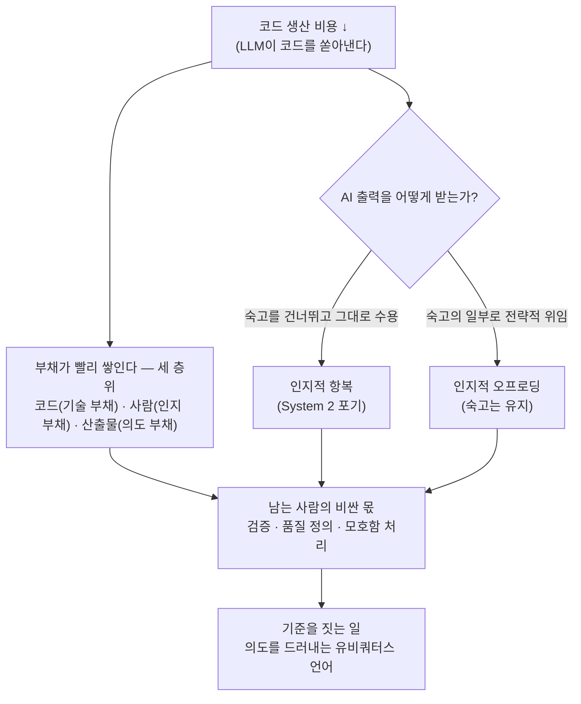

<figure class="post-figure post-figure--header">
<svg role="img" aria-label="오크 대장간을 둘로 나눈 그림. 왼쪽은 자동 망치 기계가 풀무 불 위에서 검(코드)을 끝없이 찍어내는 '생산' 구역으로, 완성된 검들이 컨베이어를 타고 줄지어 쏟아져 나오고 '값=0'이라는 가격표가 붙어 있다. 오른쪽은 대장장이 오크가 그 완성품 하나를 집어 들어 빛에 비춰 흠을 살피는 '검증' 구역으로, 돋보기 같은 검사선과 '값=비쌈'이라는 가격표가 붙어 있다 — 만드는 일은 공짜, 판단하는 일은 비싸다." viewBox="0 0 640 300" xmlns="http://www.w3.org/2000/svg">
  <title>만드는 일은 공짜, 판단하는 일은 비싸다 — 자동 생산 구역과 사람의 검증 구역</title>
  <!-- ground line -->
  <line x1="20" y1="262" x2="620" y2="262" stroke="currentColor" stroke-width="2" opacity="0.4"/>

  <!-- ===== LEFT: PRODUCTION — automatic forge stamping out blades for free ===== -->
  <text x="160" y="30" text-anchor="middle" font-size="13" fill="currentColor" font-weight="700">생산 · 자동 기계</text>

  <!-- forge furnace with fire -->
  <rect x="44" y="150" width="78" height="100" fill="var(--bg-light)" stroke="currentColor" stroke-width="2"/>
  <path d="M58,236 q10,-26 24,-30 q-6,16 8,18 q12,-8 8,-24 q16,12 12,36 Z" fill="var(--accent-color)" opacity="0.85"/>
  <text x="83" y="166" text-anchor="middle" font-size="9" fill="currentColor" opacity="0.7">풀무 불</text>

  <!-- automatic hammer arm -->
  <line x1="100" y1="92" x2="148" y2="92" stroke="currentColor" stroke-width="3"/>
  <line x1="124" y1="92" x2="124" y2="132" stroke="currentColor" stroke-width="3"/>
  <rect x="112" y="132" width="24" height="18" fill="var(--steel)" stroke="currentColor" stroke-width="2"/>
  <circle cx="100" cy="92" r="5" fill="var(--gold)" stroke="currentColor" stroke-width="1.5"/>
  <!-- motion lines = hammering by itself -->
  <line x1="136" y1="120" x2="146" y2="112" stroke="var(--secondary-color)" stroke-width="2"/>
  <line x1="113" y1="120" x2="103" y2="112" stroke="var(--secondary-color)" stroke-width="2"/>

  <!-- conveyor of finished blades pouring out, cheap -->
  <line x1="40" y1="250" x2="280" y2="250" stroke="currentColor" stroke-width="2.5"/>
  <g stroke="currentColor" stroke-width="2" fill="var(--bg-panel)">
    <path d="M168,250 l0,-30 l5,-7 l5,7 l0,30 Z"/>
    <path d="M198,250 l0,-30 l5,-7 l5,7 l0,30 Z"/>
    <path d="M228,250 l0,-30 l5,-7 l5,7 l0,30 Z"/>
    <path d="M258,250 l0,-30 l5,-7 l5,7 l0,30 Z"/>
  </g>
  <!-- pour arrows -->
  <line x1="150" y1="158" x2="172" y2="206" stroke="currentColor" stroke-width="1.5" opacity="0.5"/>
  <line x1="166" y1="158" x2="200" y2="206" stroke="currentColor" stroke-width="1.5" opacity="0.5"/>
  <text x="170" y="200" font-size="9.5" fill="currentColor" opacity="0.7">검(코드)을 찍어냄</text>

  <!-- price tag: 값 = 0 -->
  <g transform="rotate(-7 120 96)">
    <path d="M86,82 l52,0 l14,14 l-14,14 l-52,0 Z" fill="var(--bg-panel)" stroke="var(--secondary-color)" stroke-width="2"/>
    <circle cx="142" cy="96" r="2.6" fill="currentColor"/>
    <text x="106" y="100" text-anchor="middle" font-size="11" fill="currentColor" font-weight="700">값 = 0</text>
  </g>

  <!-- divider -->
  <line x1="318" y1="44" x2="318" y2="256" stroke="currentColor" stroke-width="1.5" opacity="0.28" stroke-dasharray="4 5"/>

  <!-- ===== RIGHT: VERIFICATION — the smith inspects one blade against the light ===== -->
  <text x="480" y="30" text-anchor="middle" font-size="13" fill="currentColor" font-weight="700">검증 · 사람의 눈</text>

  <!-- the orc smith (simple bust) -->
  <circle cx="430" cy="150" r="22" fill="var(--bg-light)" stroke="currentColor" stroke-width="2"/>
  <!-- tusks -->
  <path d="M423,162 q-2,7 2,9" fill="none" stroke="currentColor" stroke-width="1.8"/>
  <path d="M437,162 q2,7 -2,9" fill="none" stroke="currentColor" stroke-width="1.8"/>
  <!-- brow + eye trained upward at the blade -->
  <line x1="420" y1="143" x2="430" y2="147" stroke="currentColor" stroke-width="2"/>
  <circle cx="425" cy="150" r="2.4" fill="currentColor"/>
  <!-- topknot -->
  <path d="M430,128 q3,-12 -4,-16" fill="none" stroke="currentColor" stroke-width="2"/>
  <!-- shoulders + arm raising the blade -->
  <path d="M404,250 q4,-58 26,-72 q22,14 26,40" fill="var(--bg-light)" stroke="currentColor" stroke-width="2"/>
  <line x1="452" y1="166" x2="498" y2="120" stroke="currentColor" stroke-width="3"/>

  <!-- the single blade held up to the light -->
  <path d="M498,120 l8,-58 l8,58 Z" fill="var(--bg-panel)" stroke="var(--accent-color)" stroke-width="2.5"/>
  <line x1="498" y1="120" x2="514" y2="120" stroke="currentColor" stroke-width="3"/>

  <!-- inspection light beams from above -->
  <line x1="506" y1="20" x2="506" y2="56" stroke="var(--gold)" stroke-width="2"/>
  <line x1="488" y1="26" x2="498" y2="58" stroke="var(--gold)" stroke-width="1.6" opacity="0.8"/>
  <line x1="524" y1="26" x2="514" y2="58" stroke="var(--gold)" stroke-width="1.6" opacity="0.8"/>
  <!-- the flaw the eye is hunting for -->
  <circle cx="506" cy="92" r="9" fill="none" stroke="var(--accent-color)" stroke-width="2"/>
  <line x1="513" y1="99" x2="522" y2="108" stroke="var(--accent-color)" stroke-width="2.5"/>
  <text x="540" y="96" font-size="9.5" fill="currentColor" opacity="0.75">흠을 살핌</text>

  <!-- price tag: 값 = 비쌈 -->
  <g transform="rotate(6 470 226)">
    <path d="M430,212 l66,0 l14,14 l-14,14 l-66,0 Z" fill="var(--bg-panel)" stroke="var(--accent-color)" stroke-width="2"/>
    <circle cx="500" cy="226" r="2.6" fill="currentColor"/>
    <text x="457" y="230" text-anchor="middle" font-size="11" fill="currentColor" font-weight="700">값 = 비쌈</text>
  </g>
</svg>
<figcaption>생산은 자동 기계의 몫(값 0), 완성품을 빛에 비춰 검증하는 일은 사람의 몫(비쌈) — 비용은 사라지지 않고 판단으로 옮겨간다.</figcaption>
</figure>

## 원문 정보

> - **제목**: Fragments: April 2
> - **출처**: Martin Fowler ([martinfowler.com](https://martinfowler.com/fragments/2026-04-02.html))
> - **발행**: 2026-04-02 · 짧은 메모 묶음(fragment), 약 5~7분 분량
> - **형식**: 긴 아티클이 아니라, 최근 읽은 글 다섯 편에 짧은 논평을 단 메모 모음
> - **원문 링크**: <https://martinfowler.com/fragments/2026-04-02.html>

이 위키에는 이미 Fowler의 [6월 16일 fragment](/2026/06/19/martin-fowler-fragments-llm-era.html)를 다룬 글이 있는데, 이건 **다른 날짜(4월 2일)·다른 내용**의 별개 메모 묶음이다. 같은 형식이지만 주제가 겹치지 않아 신규로 정리한다.

## 한 줄 요약 (TL;DR)

LLM이 코드를 쏟아내는 시대에 진짜 비싸지는 건 **만드는 일이 아니라 판단하는 일** — 부채는 코드·사람·산출물 세 층위로 번지고, AI에 대한 무비판적 의존은 "인지적 항복"을 부르며, 코딩이 공짜가 되면 병목은 **검증(verification)**으로 옮겨간다. 그래서 남는 사람의 몫은 도메인의 의도를 드러내는 **언어를 짓는 일**이다.

## 왜 이 글을 골랐나

짧은 메모 묶음이지만 다섯 조각이 한 방향을 가리킨다. 코드를 찍어내는 비용이 0에 수렴할 때, **무엇이 여전히 비싸고 누구의 몫으로 남는가** — 이 위키가 반복해 온 질문에 Fowler가 다섯 개의 서로 다른 각도로 답을 모아 둔 셈이다. 특히 "검증이 비싸진다"와 "유비쿼터스 언어가 사람의 몫"이라는 두 메모는 이 위키가 아직 정면으로 다루지 않은 결을 채워 준다.

## 핵심 내용

원문은 눈송이(❄)로 구분된 다섯 개의 메모다. 각 메모는 다른 사람의 글을 인용·논평하는 형식이라, 아래는 원문이 전한 요지를 흐름대로 옮긴 것이다.

### 시스템 건강의 세 층위 — 부채는 코드를 넘는다

첫 메모는 Margaret-Anne Storey의 프레임을 소개한다. 시스템 건강을 갉아먹는 부채는 코드에만 있지 않고 **세 층위**에 산다. 코드에 사는 **기술 부채**(나중에 바꾸기 어렵게 만드는 구현 선택), 사람에게 사는 **인지 부채**(공유된 이해가 보충되는 속도보다 빠르게 침식될 때), 산출물에 사는 **의도 부채**(시스템을 이끌어야 할 목표와 제약이 제대로 기록·유지되지 않을 때). Fowler 자신은 "부채 비유가 너무 번식하는 것 같아 좀 어리둥절하다"면서도, 세 층위가 서로 맞물려 작동한다는 사고방식 자체는 꽤 말이 된다고 본다.

이 세 부채 모델은 이 위키에서 이미 두 번 깊게 다뤘으니 — [Intent Debt (Addy Osmani)](/2026/06/21/intent-debt.html)와 [AI 시대 전문성 재설계](/2026/06/22/ai-era-expertise-redesign.html) — 여기서는 다음 메모로 넘어간다. (이 4월 2일 fragment가 바로 그 두 글이 인용한 원천이다.)

### System 3, 그리고 "인지적 항복"

두 번째 메모는 Storey 글이 참조한 Wharton School의 Shaw & Nave 논문을 가리킨다. Kahneman의 *Thinking, Fast and Slow*는 인간 인지를 빠른 직관(System 1)과 의식적 숙고(System 2) 둘로 나눴는데, Shaw & Nave는 여기에 **AI를 System 3로** 더한다. Fowler가 끌어내는 핵심 개념은 **인지적 항복(cognitive surrender)**이다.

> "외부에서 생성된 인공적 추론에 무비판적으로 의존하며 System 2를 건너뛰는 것 — 이것이 인지적 항복이다. 우리는 이를, 숙고 중에 인지를 전략적으로 위임하는 인지적 오프로딩(cognitive offloading)과 구별한다."

도구에 계산이나 기억을 **전략적으로 위임**하는 것(오프로딩)과, AI의 결론을 **검토 없이 그냥 믿어 버리는 것**(항복)은 다르다. 전자는 숙고의 일부이고, 후자는 숙고의 포기다.

### 코드 아이콘의 `< >` — 작은 딴지

세 번째는 가벼운 관찰이다. 최근 디자인 아이콘들이 코드를 나타낼 때 `< >`(심지어 `</>`)를 쓰는데, Fowler는 이상하다고 짚는다. `< >`로 프로그램 요소를 감싸는 프로그래밍 언어는 없다 — 그건 HTML/XML이지 프로그래밍이 아니다. 짧지만, "코드를 상징하는 기호조차 실제 프로그래밍이 아닌 마크업을 가리킨다"는 가벼운 풍자로 읽힌다.

### 코딩이 공짜가 되면, 비싼 것은 검증이다

네 번째 메모가 이 fragment의 무게중심이다. Ajey Gore의 질문 — **코딩 에이전트가 코딩을 공짜로 만들면, 비싼 것은 무엇이 되는가?** — 에 대한 답은 **검증(verification)**이다. Gore는 분산 시스템에서 "정답(correct)"이 하나가 아님을 강조한다.

> "자카르타 교통에서의 ETA 알고리즘과 호치민시에서의 그것에 '정답'이 같은 뜻일까? 수익 공정성·고객 대기시간·차량 가동률을 동시에 저울질할 때 '성공적인' 배차란 무엇인가? 수백 명의 엔지니어가 ~900개 마이크로서비스에 24시간 코드를 밀어 넣을 때, '정답'은 하나의 정의가 아니라 수천 개의 정의 — 모두 움직이고, 모두 맥락 의존적이다. 이건 엣지 케이스가 아니다. 그게 일의 전부다."

그리고 이 판단이야말로 에이전트가 대신 해 줄 수 없는 부분이라고 Gore는 못 박는다. Fowler는 대체로 동의하면서, 에이전트는 **좋은(되도록 자동화된) 검증**이 있을 때 잘 작동하므로 이는 TDD 같은 실천을 장려한다고 덧붙인다. 다만 레거시 마이그레이션에 대한 Gore의 비관에는 토를 단다 — 에이전트가 레거시를 "마침내 해결"한다는 건 과장이 맞지만, LLM이 **레거시 코드가 무엇을 하는지 이해하는 데**는 크게 도움이 된다는 증거를 봤다는 것이다.

Gore가 끌어내는 조직적 결론은 도발적이다. 실행을 에이전트가 맡으면, 사람의 일은 **검증 시스템을 설계하고, 품질을 정의하고, 모호한 경우를 처리하는 것**으로 옮겨간다. 월요일 스탠드업의 질문도 "우리가 뭘 출시했나"에서 **"우리가 뭘 검증했나"**로 바뀐다.

> "기능을 만들던 열 명의 엔지니어 팀이, 이제는 세 명의 엔지니어와 인수 기준을 정의하고 테스트 하니스를 설계하고 결과를 모니터링하는 일곱 명으로 바뀐다. 그게 그 재편이다. 만드는 행위를 강등하고 판단하는 행위를 승격시키기 때문에 불편하다. 대부분의 엔지니어링 문화가 이에 저항한다. 저항하지 않는 쪽이 이긴다."

### 소스 코드의 미래, 그리고 사람의 몫

마지막 메모는 "LLM이 프로그래머가 되면 소스 코드에 미래가 있는가"를 묻는다. David Cassel(The New Stack)의 개관 글을 빌려, LLM을 염두에 둔 새 언어를 실험하는 쪽과 TypeScript·Rust 같은 **엄격한 타입 언어**가 LLM에 가장 잘 맞는다고 보는 쪽이 갈린다고 정리한다. 분석보다 인용이 많은 개관 글이지만 논의 지형을 잡기엔 좋다는 평이다.

Fowler 자신의 관심은 결론에 있다. 그는 LLM과 함께 일하는 사람의 역할이 **코드가 무엇을 하는지 이야기할 수 있는 유용한 추상 — 곧 DDD의 유비쿼터스 언어(Ubiquitous Language)를 짓는 것**에 남는다고 본다. 작년에 Unmesh와 나눈 대화를 인용하며 마무리한다.

> "프로그래밍은 컴퓨터가 이해하고 실행할 구문을 타이핑하는 것이 아니라, 해법을 빚는 일이다. 문제를 초점 잡힌 조각으로 자르고, 관련된 데이터와 행동을 묶고 — 결정적으로 — 의도를 드러내는 이름을 고른다. 좋은 이름은 복잡함을 꿰뚫어, 코드를 누구나 따라갈 수 있는 도면으로 바꾼다. 가장 창의적인 행위는, 해법의 구조를 드러내는 이름을 끊임없이 엮어 문제에 또렷이 대응시키는 일이다."

## 분석과 인사이트

여기서부터는 원문 요약이 아니라 내 관점이다.

- **다섯 조각의 진짜 척추는 "비용의 이동"이다.** 코드를 만드는 비용이 0에 가까워질수록, 비용은 사라지지 않고 **검증·이해·의도 보존**으로 옮겨간다. 세 부채(코드/사람/산출물)는 그 옮겨간 비용이 어디에 고이는지를 가리키고, 검증 메모는 그 비용을 누가 떠안는지를 말한다. 부채 메모와 검증 메모는 같은 동전의 양면이다.
- **"인지적 항복"과 "인지적 오프로딩"의 구분이 이 글에서 가장 실용적인 한 줄이다.** AI에게 일을 위임하는 것 자체는 죄가 아니다. 문제는 **숙고를 통째로 건너뛰느냐**다. 결론만 받아 그대로 다음 사람에게 넘기는 순간 오프로딩은 항복으로 변질된다. 이 경계선은 [AI 시대 전문성 재설계](/2026/06/22/ai-era-expertise-redesign.html)가 말한 "thinking은 아웃소스해도 understanding은 못 한다"와 정확히 같은 지점을 다른 어휘로 짚는다.
- **"무엇을 검증했나"라는 스탠드업 질문 전환은 구호 이상의 무게가 있다.** 출력(output)을 추적하던 팀이 출력이 **옳았는지**를 추적하는 팀으로 바뀐다는 건, 측정 지표와 직무 정의가 동시에 흔들린다는 뜻이다. 에이전트를 둘러싼 루프를 설계하라는 [Loop Engineering](/2026/06/19/loop-engineering.html), 검증 가능한 시스템을 강조하는 [신뢰할 수 있는 Agentic AI 시스템](/2026/06/19/reliable-agentic-ai-systems.html)과 같은 줄기다.
- **마지막 메모가 위안이자 처방이다.** 코드가 commodity가 되어도 "무엇을, 왜 만드는가"를 도메인의 언어로 또렷이 빚는 일은 사람의 몫으로 남는다. 이는 이 위키의 [Domain-Driven Design](/2026/06/19/domain-driven-design.html) 정리가 AI 시대에 오히려 더 읽을 가치를 갖는 이유다. 검증을 비싸게 만드는 것도, 그 검증의 기준(무엇이 '정답'인가)을 정의하는 것도 결국 **유비쿼터스 언어로 잡은 의도**다.
- **Fowler의 "부채 비유가 너무 번식한다"는 한마디를 흘리지 말자.** 새 부채 이름을 만드는 것보다 중요한 건, 그 이름이 **진단과 처방으로 이어지느냐**다. 세 층위 모델이 유효한 건 각 층위마다 다른 완화책이 붙기 때문이다.

## 적용 포인트

- AI 결과를 받을 때마다 스스로 묻는다 — 지금 나는 **오프로딩**(숙고의 일부로 위임)인가, **항복**(검토 없이 수용)인가. 결론만 보고 다음으로 넘기는 순간을 경계한다.
- 팀 스탠드업/회고에 **"이번 주에 무엇을 검증했나"**를 한 줄 추가한다. 만든 양이 아니라 옳았는지를 추적 항목으로 둔다.
- 에이전트에게 일을 맡기기 전에 **"이 맥락에서 '정답'의 정의"**를 먼저 적는다. 자동 검증(테스트)으로 박을 수 있는 부분과 사람 판단이 필요한 모호한 부분을 분리한다.
- 도메인이 복잡할수록 **유비쿼터스 언어**부터 정리한다. 의도를 드러내는 이름이 곧 검증의 기준이 된다.
- 레거시를 다룰 때, 에이전트에게 **마이그레이션**을 기대하기보다 **"이 코드가 무엇을 하는지 설명"**을 시키는 쪽이 더 현실적인 활용이다.

## 마무리

짧은 메모 다섯 개지만 결국 한 문장으로 모인다. 코드를 만드는 일이 싸질수록, **판단하고 검증하고 의도를 언어로 남기는 일**이 비싸지고 또 사람의 몫으로 남는다. AI를 System 3로 들이되 System 2를 항복하지 않는 것 — 그것이 이 fragment가 다섯 각도에서 반복해 가리키는 한 점이다.

### 더 읽어보기

- [원문 — Fragments: April 2 (Martin Fowler)](https://martinfowler.com/fragments/2026-04-02.html)
- [Martin Fowler의 Fragments로 읽는 LLM 시대의 균형 감각](/2026/06/19/martin-fowler-fragments-llm-era.html) — 같은 형식의 다른 날짜(6월 16일) fragment
- [Intent Debt: 에이전트가 대신 갚아줄 수 없는 단 하나의 부채](/2026/06/21/intent-debt.html) — 이 fragment가 소개한 세 부채 모델을 깊게 다룬 글
- [AI 시대 전문성 재설계](/2026/06/22/ai-era-expertise-redesign.html) — 이 fragment를 인용하며 Verification Tax와 3대 부채를 풀어낸 발표 정리
- [신뢰할 수 있는 Agentic AI 시스템 만들기](/2026/06/19/reliable-agentic-ai-systems.html) — "검증 가능한 시스템"이라는 같은 규율
- [Loop Engineering](/2026/06/19/loop-engineering.html) — 에이전트를 둘러싼 검증 루프 설계
- [Domain-Driven Design](/2026/06/19/domain-driven-design.html) — AI 시대에 더 중요해지는 유비쿼터스 언어
