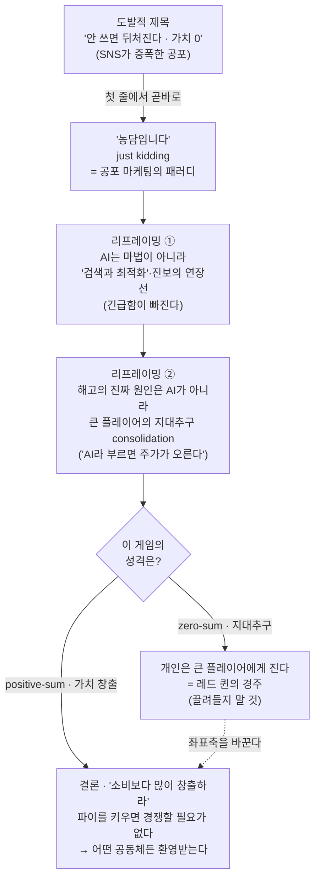

<figure class="post-figure post-figure--header">
<svg role="img" aria-label="한 개발자가 책상 앞에서 수십 개의 에이전트 터미널 창을 광적으로 돌리는 그림. 화면 더미는 'agent' 라벨이 붙은 창들이 화려하게 반짝이며 위로 쌓여 있고, 위쪽 SNS 말풍선은 '안 쓰면 뒤처진다 · 가치 0'이라는 공포 수사를 쏟아낸다. 그 모든 것 위로 비스듬히 '농담입니다 (just kidding)'라고 적힌 붉은 고무도장이 찍혀 공포 마케팅을 풍자한다. 반면 오른쪽 책상 구석의 작은 화분에서는 진짜 가치를 뜻하는 새싹 하나가 조용히 자라고 있다." viewBox="0 0 640 360" xmlns="http://www.w3.org/2000/svg">
  <title>69개 에이전트 창을 광적으로 돌리는 개발자 위에 찍힌 '농담입니다' 도장 — 화려한 화면 더미 vs 구석에서 자라는 진짜 가치(새싹)</title>

  <!-- ground / desk line -->
  <line x1="16" y1="312" x2="624" y2="312" stroke="currentColor" stroke-width="2" opacity="0.35"/>

  <!-- ===== TOP: SNS fear bubbles ===== -->
  <text x="120" y="26" text-anchor="middle" font-size="11" fill="var(--accent-color)" font-weight="700">타임라인의 공포</text>
  <!-- bubble 1 -->
  <rect x="44" y="34" width="170" height="34" rx="8" fill="var(--bg-light)" stroke="currentColor" stroke-width="2"/>
  <path d="M64,68 l-6,12 l18,-12 Z" fill="var(--bg-light)" stroke="currentColor" stroke-width="2" stroke-linejoin="round"/>
  <text x="129" y="49" text-anchor="middle" font-size="9.5" fill="currentColor" opacity="0.85">안 쓰면 뒤처진다</text>
  <text x="129" y="62" text-anchor="middle" font-size="9.5" fill="currentColor" opacity="0.85">너의 가치는 0이다</text>
  <!-- bubble 2 -->
  <rect x="232" y="44" width="150" height="30" rx="8" fill="var(--bg-light)" stroke="currentColor" stroke-width="2" opacity="0.9"/>
  <path d="M252,74 l-5,11 l16,-11 Z" fill="var(--bg-light)" stroke="currentColor" stroke-width="2" stroke-linejoin="round" opacity="0.9"/>
  <text x="307" y="63" text-anchor="middle" font-size="9.5" fill="currentColor" opacity="0.8">워크플로 통째로 갈아엎어!</text>

  <!-- ===== LEFT-CENTER: pile of glittering agent windows ===== -->
  <!-- stacked terminal windows, fanned -->
  <g stroke="currentColor" stroke-width="2" stroke-linejoin="round">
    <rect x="92" y="206" width="96" height="70" rx="3" fill="var(--bg-sunken)" transform="rotate(-9 140 241)"/>
    <rect x="150" y="178" width="96" height="72" rx="3" fill="var(--bg-light)" transform="rotate(6 198 214)"/>
    <rect x="118" y="150" width="98" height="74" rx="3" fill="var(--bg-panel)" transform="rotate(-4 167 187)"/>
  </g>
  <!-- title bars + code lines on the front window -->
  <g transform="rotate(-4 167 187)">
    <rect x="118" y="150" width="98" height="14" fill="var(--bg-sunken)" stroke="currentColor" stroke-width="2"/>
    <circle cx="126" cy="157" r="2.5" fill="var(--accent-color)"/>
    <circle cx="134" cy="157" r="2.5" fill="currentColor" opacity="0.4"/>
    <text x="195" y="161" text-anchor="end" font-size="7.5" fill="currentColor" opacity="0.7">agent</text>
    <g stroke="var(--secondary-color)" stroke-width="2" opacity="0.8">
      <line x1="126" y1="176" x2="200" y2="176"/>
      <line x1="126" y1="186" x2="190" y2="186"/>
      <line x1="126" y1="196" x2="204" y2="196"/>
      <line x1="126" y1="206" x2="184" y2="206"/>
    </g>
  </g>
  <!-- glittering sparkles spilling off the pile -->
  <text x="232" y="168" font-size="14" fill="var(--accent-color)" opacity="0.9">✦</text>
  <text x="108" y="138" font-size="11" fill="var(--accent-color)" opacity="0.8">✦</text>
  <text x="246" y="206" font-size="10" fill="var(--accent-color)" opacity="0.7">✦</text>
  <!-- "69" tally over the pile -->
  <text x="170" y="300" text-anchor="middle" font-size="11" fill="currentColor" opacity="0.7">69 agents 광적으로 돌리는 중…</text>

  <!-- ===== the developer, frantic at the desk ===== -->
  <!-- head -->
  <circle cx="338" cy="196" r="15" fill="var(--bg-panel)" stroke="currentColor" stroke-width="2.5"/>
  <!-- frazzled hair lines -->
  <g stroke="currentColor" stroke-width="1.6" opacity="0.7">
    <line x1="330" y1="182" x2="326" y2="174"/>
    <line x1="338" y1="181" x2="338" y2="172"/>
    <line x1="346" y1="182" x2="350" y2="174"/>
  </g>
  <!-- wide panic eyes -->
  <circle cx="333" cy="195" r="2" fill="currentColor"/>
  <circle cx="343" cy="195" r="2" fill="currentColor"/>
  <!-- body -->
  <path d="M338,211 L338,266" stroke="currentColor" stroke-width="2.5"/>
  <!-- two arms flailing toward the pile of windows -->
  <path d="M338,226 L312,206 L298,212" fill="none" stroke="currentColor" stroke-width="2.5" stroke-linejoin="round"/>
  <path d="M338,228 L366,210 L382,216" fill="none" stroke="currentColor" stroke-width="2.5" stroke-linejoin="round"/>
  <!-- legs -->
  <path d="M338,266 L326,308 M338,266 L352,308" stroke="currentColor" stroke-width="2.5" fill="none"/>
  <!-- sweat drops -->
  <path d="M356,186 q3,5 0,8 q-3,-3 0,-8 Z" fill="var(--secondary-color)" opacity="0.7"/>

  <!-- ===== the 'just kidding' rubber stamp, slapped across it all ===== -->
  <g transform="rotate(-12 300 250)">
    <rect x="176" y="226" width="248" height="48" rx="4" fill="none" stroke="var(--accent-color)" stroke-width="4" opacity="0.92"/>
    <rect x="184" y="234" width="232" height="32" rx="2" fill="none" stroke="var(--accent-color)" stroke-width="1.5" opacity="0.55"/>
    <text x="300" y="251" text-anchor="middle" font-size="20" fill="var(--accent-color)" font-weight="700" opacity="0.95">농담입니다</text>
    <text x="300" y="264" text-anchor="middle" font-size="9" fill="var(--accent-color)" font-weight="700" opacity="0.8" letter-spacing="2">JUST KIDDING</text>
  </g>

  <!-- ===== RIGHT: the real value — a seedling growing quietly in the corner ===== -->
  <text x="556" y="150" text-anchor="middle" font-size="11" fill="var(--secondary-color)" font-weight="700">진짜 가치</text>
  <!-- pot -->
  <path d="M534,288 L578,288 L572,312 L540,312 Z" fill="var(--bg-light)" stroke="currentColor" stroke-width="2.5" stroke-linejoin="round"/>
  <rect x="530" y="280" width="52" height="10" rx="2" fill="var(--bg-sunken)" stroke="currentColor" stroke-width="2"/>
  <!-- stem -->
  <path d="M556,280 L556,232" fill="none" stroke="var(--secondary-color)" stroke-width="2.5"/>
  <!-- two leaves -->
  <path d="M556,250 q-22,-6 -30,-22 q22,2 30,18 Z" fill="var(--bg-panel)" stroke="var(--secondary-color)" stroke-width="2.5" stroke-linejoin="round"/>
  <path d="M556,244 q22,-8 32,-24 q-22,1 -32,20 Z" fill="var(--bg-panel)" stroke="var(--secondary-color)" stroke-width="2.5" stroke-linejoin="round"/>
  <!-- a small bud / glow -->
  <circle cx="556" cy="228" r="5" fill="var(--secondary-color)" opacity="0.85"/>
  <g stroke="var(--secondary-color)" stroke-width="1.5" opacity="0.5">
    <line x1="556" y1="216" x2="556" y2="210"/>
    <line x1="542" y1="222" x2="537" y2="218"/>
    <line x1="570" y1="222" x2="575" y2="218"/>
  </g>
  <text x="556" y="334" text-anchor="middle" font-size="8.5" fill="var(--secondary-color)" font-weight="700">소비보다 많이 창출</text>
</svg>
<figcaption>제목의 협박 — <strong>"안 쓰면 뒤처진다, 너의 가치는 0이다"</strong> — 에 떠밀려 <strong>69개 에이전트 창</strong>을 광적으로 돌리는 풍경 위로, 첫 줄의 <strong>"농담입니다 (just kidding)"</strong> 도장이 찍힌다. 화려하게 반짝이는 화면 더미와 달리, <strong>진짜 가치</strong>는 책상 구석에서 조용히 자라는 <strong>새싹</strong> 한 그루다.</figcaption>
</figure>

## 원문 정보

> - **제목**: Every minute you aren't running 69 agents, you are falling behind
> - **출처**: George Hotz (geohot) 개인 블로그 — ([geohot.github.io](https://geohot.github.io))
> - **발행**: 2026-03-11 · 약 3~4분 분량
> - **원문 링크**: <https://geohot.github.io/blog/jekyll/update/2026/03/11/running-69-agents.html>

이 글을 `Articles`에 담는 맥락: tinygrad·comma.ai의 George Hotz가, 제목부터 도발적인 "69개 에이전트" 밈을 *스스로 비틀어* AI 공포 마케팅의 구조를 해부하는 짧은 에세이다. (같은 저자의 후속작 [영원한 Sloptember](/2026/06/22/the-eternal-sloptember.html)와 짝을 이루는, 더 차분한 전편 격 글이다.)

## 한 줄 요약 (TL;DR)

제목은 **농담**이다. "안 쓰면 뒤처진다"는 공포는 AI를 팔기 위한 수사일 뿐이고, AI는 마법적 전환점이 아니라 **오래 이어진 진보 곡선의 연장선**이자 본질적으로는 **"검색과 최적화"**다. 일자리를 줄이는 진짜 동력은 AI가 아니라 *더 큰 플레이어들이 지대(rent)를 빨아들이는 consolidation*인데, 그것에 "AI"라는 이름을 붙이면 주가가 오를 뿐이다. 그러니 zero-sum 비교 게임에 끌려다니지 말고, **소비하는 것보다 더 많은 가치를 창출하라.**

## 왜 이 글을 골랐나

아래 도표가 이 글의 척추다 — **도발적 제목(공포) → "농담" → 리프레이밍 → 진짜 원인 → 결론**으로, 공포에서 출발해 가치 창출로 끝나는 논증의 흐름이다.

이 위키의 `Articles`에는 "AI가 일과 커리어를 어떻게 바꾸는가"를 다룬 글이 여럿 쌓여 있다. 대부분은 *그래서 우리는 무엇을 어떻게 해야 하는가*를 진지하게 따진다. 이 글은 그 논의의 한 단계 **앞**에 선다 — "그 논의를 떠미는 *공포 자체*가 어디서 오고, 누구에게 이득인가"를 먼저 묻는다.

골라 둘 가치가 있는 이유는 두 가지다. 첫째, 화자가 **AI를 안 써 본 비관론자가 아니다.** PS3·iPhone 해킹, 자율주행 회사 comma.ai, 딥러닝 프레임워크 tinygrad를 만든 George Hotz가, *AI의 기술적 실체를 누구보다 잘 아는 위치에서* "그래도 이 공포는 과장됐다"고 말한다. 둘째, 이 글은 짧지만 **공포 마케팅을 한 문장으로 해체하는 리프레이밍**을 담고 있다 — "안 쓰면 0원이 된다"는 협박을 "그건 AI 마법이 아니라 지대추구 consolidation이고, AI라고 부르면 주가가 오를 뿐"이라고 받아친다. [AI가 엔지니어를 대체하지 못한 이유](/2026/06/19/ai-hasnt-replaced-engineers.html)가 짚은 'AI 워싱' 해고 서사와 정확히 같은 줄기를, 더 짧고 거친 버전으로 보여 준다.

## 핵심 내용

원문의 흐름을 따라 저자의 논지를 한국어로 풀어 정리한다. (직접 인용은 가장 상징적인 몇 줄만 남긴다.)

### 도발적 제목, 그리고 곧바로 "농담입니다"

글은 제목으로 사람을 낚은 뒤 첫 줄에서 바로 풀어 준다 — *just kidding.* "1분이라도 69개 에이전트를 안 돌리면 뒤처진다"는 말은 진지한 조언이 아니라, 요즘 타임라인을 도배한 공포 수사를 그대로 흉내 낸 패러디다. 저자는 지난 몇 달간 소셜 미디어가 극도로 독성이 강했다고 진단하며, 수사의 온도를 좀 낮추자고 제안한다.

그가 겨냥하는 공포의 문법은 단순하다 — *이 새로운 AI 도구를 안 쓰면 너는 뒤처진다, 워크플로를 통째로 갈아엎지 않으면 너의 가치는 0이다.* 저자는 이 협박을 한마디로 정리한다.

> "If you don't use this new stupid AI thing you will fall behind. If you haven't totally updated your workflow you are worth 0."

그리고 곧장 이를 *완전한 헛소리(complete nonsense)*라고 일축한다. 핵심은 도구가 아니라, 그 도구를 안 쓰면 사라진다는 **공포를 파는 구조**가 문제라는 것이다.

### 리프레이밍: AI는 마법이 아니라 "검색과 최적화"

저자가 공포를 해체하는 첫 번째 손잡이는 AI의 *실체*를 정확히 두는 것이다. 그의 표현으로, AI는 마법 같은 게임 체인저가 아니라 우리가 오랫동안 타고 온 **진보의 지수 곡선이 그대로 이어진 것**일 뿐이다. 본질을 더 벗겨내면 AI는 결국 *검색과 최적화(search and optimization)*다 — 새로운 우주의 법칙이 아니라, 익숙한 도구가 더 강력해진 것에 가깝다.

이 리프레이밍이 왜 중요한가. "AI는 차원이 다른 마법"이라는 전제를 받아들이는 순간, "그러니 안 쓰면 즉시 도태된다"는 결론이 자연스러워진다. 반대로 AI를 *연속적 진보의 한 점*으로 되돌려 놓으면, 공포의 긴급함도 함께 빠진다. 도구는 늘 좋아져 왔고, 사람들은 늘 적응해 왔다.

### 진짜 원인: 일자리를 줄이는 건 AI가 아니라 지대추구 consolidation

이 글에서 가장 날카로운 대목이다. 저자는 "그래도 해고는 실제로 일어나지 않느냐"는 반문을 정면으로 받는다. 그의 진단은, 일자리 손실의 진짜 동력이 *AI가 사람을 대체할 만큼 똑똑해져서*가 아니라는 것이다. 진짜 동력은 **더 큰 플레이어들이 지대(rent)를 더 크게 빨아들이는 consolidation**이다. 시장의 이득이 소수의 큰 회사로 빨려 들어가면서 일자리가 정리되는데, 그 정리에 "AI 때문"이라는 이름표를 붙이면 한 가지가 따라온다 — **주가가 오른다.**

여기서 저자는 지대추구 게임 자체의 성격을 짚는다. 지대추구는 본질적으로 **zero-sum 게임**이고, 그 판에서 개인은 더 큰 플레이어에게 결국 진다는 것이다. 즉 "AI를 더 빨리 도입해 그 경쟁에서 이기겠다"는 전략은, 애초에 이길 수 없는 판에 더 깊이 발을 담그는 일이다. 공포 마케팅은 바로 그 지지 않으려는 심리를 연료로 삼는다.

### 탈출구: zero-sum을 거부하고 "소비보다 많이 창출하라"

그렇다면 무엇을 해야 하나. 저자의 답은 의외로 고전적이고 담백하다 — *수익을 걱정하지 말고, 남에게 가치를 만들어 주라.* 그가 내거는 단순한 기준은 이것이다.

> "Go create value for others and don't worry about the returns. If you create more than you consume, you are welcome in any well operating community."

네가 소비하는 것보다 더 많은 가치를 창출한다면, 제대로 굴러가는 어떤 공동체에서든 너는 환영받는다는 것이다. 그리고 마지막으로 이 글의 세계관을 한 줄로 봉인한다 — **세상은 레드 퀸의 경주(Red Queen's race)가 아니다.** 제자리에 머무르기 위해 끝없이 더 빨리 달려야만 하는 판이 아니라는 뜻이다. (참고로 본문은 Karpathy의 autoresearch를 "기술적으로 흥미롭지만 마법은 아니다"라는 예시로 가볍게 스치며, AI의 발전을 인정하되 그것이 공포의 근거는 아니라는 일관된 톤을 유지한다.)

## 분석과 인사이트

여기서부터는 원문 요약이 아니라 내 관점이다.

- **이 글의 진짜 무기는 결론이 아니라 '리프레이밍'이다.** "가치를 창출하라"는 결론만 보면 흔한 자기계발 격언처럼 들린다. 그러나 이 글의 힘은 그 앞에서 **공포의 인과를 바꿔치기**하는 데 있다. 통념은 *AI → 능력 폭증 → 너의 대체*다. Hotz는 그 사슬을 *consolidation → 지대추구 → 해고 → 'AI 때문'이라는 라벨링*으로 갈아 끼운다. 같은 현상(해고)을 두고 *원인*을 AI에서 자본 집중으로 옮기면, 처방이 완전히 달라진다 — "더 빨리 AI를 도입하라"가 아니라 "이길 수 없는 zero-sum 판에서 빠져나오라"가 된다. 이는 [AI는 왜 엔지니어를 대체하지 못했나](/2026/06/19/ai-hasnt-replaced-engineers.html)가 말한 'AI 워싱' 서사와 정확히 같은 통찰의, 더 짧고 거친 판본이다.

- **"AI = 검색과 최적화"라는 환원은 강력하지만, 양날의 검이다.** 공포를 식히는 데는 탁월하다 — 마법이 아니라 도구라면 긴급함이 사라진다. 다만 이 환원은 *현재 한계*를 설명할 뿐, *변화 속도*까지 부정하진 못한다. "검색과 최적화의 연장선"이라는 말은 곧 *그 곡선이 여전히 가파르게 올라가고 있다*는 뜻이기도 하다. 그래서 이 글은 "AI는 별것 아니다"로 읽으면 오독이다. 저자의 주장은 "AI는 별것이 *맞지만*, 그 사실이 너를 협박할 근거는 아니다"에 가깝다 — 능력의 *실체*와 공포의 *마케팅*을 분리하라는 것.

- **'지대추구는 zero-sum, 가치 창출은 positive-sum'이라는 이분법이 이 글의 실무적 척추다.** 저자는 두 종류의 게임을 구분한다. 더 큰 플레이어와 파이를 빼앗는 zero-sum 게임에서 개인은 진다. 반대로 *남에게 순(純)가치를 만들어 주는* positive-sum 게임은 큰 플레이어와 경쟁할 필요가 없다 — 파이를 키우기 때문이다. 이는 [노동시장이라는 게임에서 살아남기](/2026/06/22/surviving-in-the-job-market.html)가 말한 "남들과 같은 자리를 두고 싸우지 말고 *대체 불가능한 가치*를 만들라"와 같은 결론으로 수렴한다. 커리어 전략의 언어로 옮기면 — *경쟁의 좌표축 자체를 바꾸라.*

<figure class="post-figure">
<svg role="img" aria-label="두 게임을 나란히 대비한 도식. 왼쪽 'zero-sum 게임'에서는 작은 개인 주자와 거대한 플레이어가 같은 크기의 고정된 파이 한 조각을 두고 양쪽에서 끌어당기며, 개인은 거대한 화살표에 밀려 제자리걸음을 하는 '레드 퀸의 경주'다 — 아무리 빨리 달려도 파이는 커지지 않고 결국 큰 쪽이 더 많이 가져간다. 오른쪽 'positive-sum 게임'에서는 같은 개인이 파이 자체를 키워, 자기 몫과 공동체의 몫이 함께 커진다 — 큰 플레이어와 같은 조각을 두고 다툴 필요가 없다." viewBox="0 0 640 320" xmlns="http://www.w3.org/2000/svg">
  <title>zero-sum 레드 퀸의 경주(고정된 파이를 끌어당기는 제자리걸음) vs positive-sum 가치 창출(파이 자체를 키운다)</title>

  <!-- divider -->
  <line x1="320" y1="36" x2="320" y2="296" stroke="currentColor" stroke-width="1.5" stroke-dasharray="4 5" opacity="0.4"/>

  <!-- ===== LEFT: zero-sum / Red Queen's race ===== -->
  <text x="160" y="28" text-anchor="middle" font-size="13" fill="var(--accent-color)" font-weight="700">zero-sum · 지대추구</text>
  <text x="160" y="44" text-anchor="middle" font-size="9" fill="currentColor" opacity="0.65">레드 퀸의 경주</text>

  <!-- the fixed pie, tugged from both sides -->
  <circle cx="160" cy="116" r="40" fill="var(--bg-light)" stroke="currentColor" stroke-width="2.5"/>
  <!-- slice split — small for the individual, large for the big player -->
  <path d="M160,116 L160,76 A40,40 0 0,1 196,134 Z" fill="var(--bg-sunken)" stroke="currentColor" stroke-width="2" stroke-linejoin="round"/>
  <line x1="160" y1="116" x2="160" y2="76" stroke="currentColor" stroke-width="2"/>
  <text x="160" y="120" text-anchor="middle" font-size="9" fill="currentColor" opacity="0.7">고정된 파이</text>

  <!-- small individual runner on the left, running in place -->
  <circle cx="74" cy="104" r="9" fill="var(--bg-panel)" stroke="currentColor" stroke-width="2"/>
  <path d="M74,113 L74,134 M74,120 L62,128 M74,120 L86,126 M74,134 L66,150 M74,134 L82,150" fill="none" stroke="currentColor" stroke-width="2"/>
  <!-- treadmill / in-place marks -->
  <g stroke="currentColor" stroke-width="1.5" opacity="0.45">
    <line x1="58" y1="158" x2="50" y2="158"/>
    <line x1="62" y1="164" x2="52" y2="164"/>
  </g>
  <text x="74" y="180" text-anchor="middle" font-size="8" fill="currentColor" opacity="0.7">개인 (작다)</text>
  <!-- tug arrow: individual pulls a little -->
  <path d="M92,116 L116,116" fill="none" stroke="currentColor" stroke-width="2" marker-end="url(#arrowInd)"/>

  <!-- huge player on the right, pulling hard -->
  <rect x="232" y="84" width="60" height="64" rx="3" fill="var(--bg-sunken)" stroke="currentColor" stroke-width="2.5"/>
  <text x="262" y="112" text-anchor="middle" font-size="9" fill="currentColor" opacity="0.85">큰</text>
  <text x="262" y="126" text-anchor="middle" font-size="9" fill="currentColor" opacity="0.85">플레이어</text>
  <!-- big tug arrow toward the big player -->
  <path d="M226,116 L204,116" fill="none" stroke="var(--accent-color)" stroke-width="3.5" marker-end="url(#arrowBig)"/>

  <text x="160" y="214" text-anchor="middle" font-size="9.5" fill="var(--accent-color)" opacity="0.9">아무리 빨리 달려도 제자리 —</text>
  <text x="160" y="230" text-anchor="middle" font-size="9.5" fill="var(--accent-color)" opacity="0.9">파이는 그대로, 큰 쪽이 더 가져간다</text>

  <!-- ===== RIGHT: positive-sum / value creation ===== -->
  <text x="480" y="28" text-anchor="middle" font-size="13" fill="var(--secondary-color)" font-weight="700">positive-sum · 가치 창출</text>
  <text x="480" y="44" text-anchor="middle" font-size="9" fill="currentColor" opacity="0.65">파이 자체를 키운다</text>

  <!-- small pie growing into a big pie -->
  <circle cx="420" cy="118" r="22" fill="var(--bg-light)" stroke="var(--secondary-color)" stroke-width="2" opacity="0.8"/>
  <text x="420" y="121" text-anchor="middle" font-size="7.5" fill="currentColor" opacity="0.6">작은 파이</text>
  <!-- growth arrow -->
  <path d="M448,118 L486,118" fill="none" stroke="var(--secondary-color)" stroke-width="2.5" marker-end="url(#arrowGrow)"/>
  <!-- big pie with two shares both larger -->
  <circle cx="536" cy="118" r="44" fill="var(--bg-panel)" stroke="var(--secondary-color)" stroke-width="2.5"/>
  <path d="M536,118 L536,74 A44,44 0 0,1 575,138 Z" fill="var(--bg-light)" stroke="var(--secondary-color)" stroke-width="2" stroke-linejoin="round"/>
  <line x1="536" y1="118" x2="536" y2="74" stroke="var(--secondary-color)" stroke-width="2"/>
  <text x="514" y="128" text-anchor="middle" font-size="8" fill="currentColor" opacity="0.75">내 몫 ↑</text>
  <text x="560" y="106" text-anchor="middle" font-size="8" fill="currentColor" opacity="0.75">공동체 ↑</text>
  <!-- glow on the bigger pie -->
  <g stroke="var(--secondary-color)" stroke-width="1.5" opacity="0.5">
    <line x1="536" y1="66" x2="536" y2="58"/>
    <line x1="572" y1="80" x2="578" y2="74"/>
    <line x1="500" y1="80" x2="494" y2="74"/>
  </g>

  <text x="480" y="222" text-anchor="middle" font-size="9.5" fill="var(--secondary-color)" opacity="0.9">소비보다 많이 창출하면 —</text>
  <text x="480" y="238" text-anchor="middle" font-size="9.5" fill="var(--secondary-color)" opacity="0.9">큰 플레이어와 다툴 필요가 없다</text>

  <!-- bottom takeaway -->
  <text x="320" y="282" text-anchor="middle" font-size="10.5" fill="currentColor" font-weight="700">경쟁의 좌표축 자체를 바꾸라</text>

  <!-- arrow markers -->
  <defs>
    <marker id="arrowInd" viewBox="0 0 10 10" refX="8" refY="5" markerWidth="6" markerHeight="6" orient="auto-start-reverse">
      <path d="M0,1 L9,5 L0,9 Z" fill="currentColor"/>
    </marker>
    <marker id="arrowBig" viewBox="0 0 10 10" refX="8" refY="5" markerWidth="6" markerHeight="6" orient="auto-start-reverse">
      <path d="M0,1 L9,5 L0,9 Z" fill="var(--accent-color)"/>
    </marker>
    <marker id="arrowGrow" viewBox="0 0 10 10" refX="8" refY="5" markerWidth="6" markerHeight="6" orient="auto-start-reverse">
      <path d="M0,1 L9,5 L0,9 Z" fill="var(--secondary-color)"/>
    </marker>
  </defs>
</svg>
<figcaption><strong>zero-sum 게임</strong>은 고정된 파이를 끌어당기는 <strong>레드 퀸의 경주</strong>다 — 아무리 빨리 달려도 파이는 그대로고, 결국 <strong>큰 플레이어</strong>가 더 가져간다. 반대로 <strong>positive-sum 게임</strong>은 <strong>파이 자체를 키워</strong> 내 몫과 공동체의 몫을 함께 늘린다. 답은 더 빨리 달리는 것이 아니라 <strong>경쟁의 좌표축을 바꾸는</strong> 것이다.</figcaption>
</figure>

- **다만 'just create value'는 처방으로는 다소 추상적이다.** 무엇이 "소비보다 많이 창출한 것"인지, 누가 그 측정을 하는지, consolidation이 *가치 창출조차* 큰 플레이어에게 빨아들이는 구조라면 개인의 positive-sum 노력이 충분한지 — 글은 거기까지 답하지 않는다. 같은 위키의 [죽은 경제 이론](/2026/06/22/the-dead-economy-theory.html)은 정확히 그 빈틈을 비관적으로 메운다 — "수요 자체가 죽고 지대의 지렛대가 소수에 집중되면, 개인의 가치 창출만으로는 막을 수 없다"는 시나리오다. 두 글을 나란히 읽으면, Hotz의 처방은 *개인 차원의 마음가짐*으로는 옳지만 *구조 차원의 해법*으로는 불완전하다는 균형이 잡힌다.

- **'레드 퀸의 경주를 거부하라'는 메타-조언이 이 시대에 가장 값지다.** AI 담론의 기본값은 "더 빨리, 더 많이, 더 일찍"이다. 69개 에이전트라는 제목 자체가 그 광기의 캐리커처다. 저자가 던지는 진짜 메시지는, 그 경주에 *참가할지 말지*를 고를 수 있다는 것이다. 이는 [그냥 그렇게 말하면 된다](/2026/06/22/you-can-just-say-it.html)가 "인간의 가치를 'AI보다 잘함'으로 증명하려 들지 말라"고 한 것과 한 줄로 이어진다 — *비교의 프레임에서 내려오라.* 후속작 [영원한 Sloptember](/2026/06/22/the-eternal-sloptember.html)가 같은 회의를 *기술적 디테일*로 밀어붙였다면, 이 글은 같은 회의를 *심리·구조의 차원*에서 식힌다. 짝으로 읽을 때 저자의 입장이 입체적으로 보인다.

## 적용 포인트

독자가 바로 적용할 수 있는 실천 항목이다.

- 새 AI 도구·워크플로를 마주할 때, **"안 쓰면 뒤처진다"는 *감정*과 "이게 내 가치를 실제로 키우나"라는 *판단*을 분리**한다. 공포가 도입 결정을 운전하게 두지 말 것. 제목이 협박하면, 일단 "농담입니다"라고 받아치고 실체를 보라.
- 해고·구조조정 뉴스에서 **"AI 때문"이라는 라벨을 의심**한다. 그 정리해고가 *능력 대체*인지 *지대추구 consolidation*인지 분리해 읽으면, "나도 더 빨리 AI를 익혀야 한다"는 자동 반응 대신 더 정확한 행동을 고를 수 있다.
- 커리어·프로젝트를 **zero-sum 게임인지 positive-sum 게임인지로 먼저 분류**한다. 더 큰 플레이어와 같은 파이를 두고 싸우는 일이라면, 같은 판에서 더 빨리 달리기보다 *판 자체를 바꿀* 방법을 먼저 찾는다.
- 자기 점검 질문을 하나 박아 둔다 — **"나는 소비하는 것보다 더 많은 가치를 만들고 있는가?"** 분기마다 이 한 줄로 활동을 검토하면, "AI 트렌드를 따라잡았는가"보다 훨씬 견고한 나침반이 된다.
- AI를 도구로 쓰되, **그것을 *경쟁 불안의 해소책*이 아니라 *가치 창출의 레버*로 명시적으로 위치**시킨다. "남들이 쓰니까"가 아니라 "이걸로 남에게 더 큰 가치를 줄 수 있으니까"를 도입 기준으로 적어 둔다.

## 마무리

"69개 에이전트" 글은 도발적 제목으로 낚아 놓고 첫 줄에서 풀어 주는, 짧지만 단단한 반(反)공포 에세이다. 핵심은 세 번의 리프레이밍에 있다 — AI는 마법이 아니라 *검색과 최적화의 연장선*이고, 해고의 진짜 동력은 AI가 아니라 *지대추구 consolidation에 AI라는 라벨을 붙인 것*이며, 그러니 답은 *더 빨리 달리는 것*이 아니라 *레드 퀸의 경주에서 내려와 positive-sum의 가치를 만드는 것*이다. 처방으로서 "가치를 창출하라"는 다소 추상적이고, 구조적 비관(죽은 경제 이론)이 그 빈틈을 찌른다. 그럼에도 이 글이 남기는 한 가지는 명확하다 — 이 시대의 진짜 과제는 *남보다 더 많은 에이전트를 돌리는 것*이 아니라, *공포에 운전대를 넘기지 않고 스스로를 해치지 않는 것*이다.

### 더 읽어보기

- [원문 — Every minute you aren't running 69 agents, you are falling behind (George Hotz)](https://geohot.github.io/blog/jekyll/update/2026/03/11/running-69-agents.html)
- [영원한 Sloptember: 에이전트는 프로그래밍을 못 한다 (George Hotz)](/2026/06/22/the-eternal-sloptember.html) — 같은 저자가 같은 회의를 *기술적 디테일*로 밀어붙인 후속작
- [AI는 왜 소프트웨어 엔지니어를 대체하지 못했나](/2026/06/19/ai-hasnt-replaced-engineers.html) — '해고는 AI가 아니라 AI 워싱'이라는 같은 통찰을 더 길게
- [죽은 경제 이론(The Dead Economy Theory)](/2026/06/22/the-dead-economy-theory.html) — 'just create value'의 빈틈을 구조적 비관으로 메우는 반대편 시나리오
- [노동시장이라는 게임에서 살아남기](/2026/06/22/surviving-in-the-job-market.html) — zero-sum 경쟁 대신 '대체 불가능한 가치'를 만들라는 커리어 판본
- [그냥 그렇게 말하면 된다](/2026/06/22/you-can-just-say-it.html) — 인간의 가치를 'AI보다 잘함'으로 증명하려는 비교 프레임에서 내려오기
