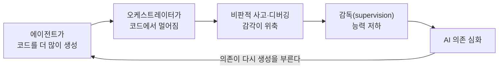

<figure class="post-figure post-figure--header">
<svg role="img" font-family="var(--font-body)" aria-label="에이전틱 코딩을 한 장면으로 요약한 그림. 위쪽에는 '에이전트=코드 생성기' 깔때기가 화려하게 코드 카드를 쏟아내고, 그 코드가 겉보기에는 안전해 보이는 바닥의 열린 트랩도어를 지나 아래에 감춰진 가시 구덩이(함정: 인지 부채·스킬 위축·벤더 락인)로 떨어진다. 왼쪽에는 오케스트레이터로 승진한 개발자가 코드에서 점점 멀어지고, 오른쪽에는 코드를 직접 다루던 '스킬 근육'이 위로 갈수록 흐릿하게 사라진다." viewBox="0 0 680 384" xmlns="http://www.w3.org/2000/svg">
  <title>에이전틱 코딩의 함정 — 화려한 코드 생성 아래 감춰진 덫</title>

  <!-- ===== top: shiny generation pipeline ===== -->
  <text x="340" y="24" text-anchor="middle" font-size="11" font-weight="700" fill="currentColor">화려한 자동화 파이프라인 — 코드를 쏟아낸다</text>
  <path d="M0,-6 L1.6,-1.6 L6,0 L1.6,1.6 L0,6 L-1.6,1.6 L-6,0 L-1.6,-1.6 Z" transform="translate(262,42)" fill="var(--gold)"/>
  <path d="M0,-5 L1.3,-1.3 L5,0 L1.3,1.3 L0,5 L-1.3,1.3 L-5,0 L-1.3,-1.3 Z" transform="translate(452,44)" fill="var(--gold)"/>
  <path d="M280,42 L440,42 L388,82 L332,82 Z" fill="var(--bg-light)" stroke="var(--gold)" stroke-width="2.5"/>
  <text x="360" y="66" text-anchor="middle" font-size="9.5" font-weight="700" fill="currentColor">에이전트 = 코드 생성기</text>
  <text x="470" y="149" text-anchor="middle" font-size="9" font-weight="600" fill="currentColor" opacity="0.8">생성량 ↑</text>
  <text x="470" y="163" text-anchor="middle" font-size="9" font-weight="600" fill="currentColor" opacity="0.8">속도 ↑</text>

  <!-- streaming code cards -->
  <g transform="translate(330,92)">
    <rect width="46" height="28" rx="3" fill="var(--bg-panel)" stroke="currentColor" stroke-width="1.4"/>
    <line x1="7" y1="10" x2="32" y2="10" stroke="currentColor" stroke-width="1.6" opacity="0.5"/>
    <line x1="7" y1="16" x2="39" y2="16" stroke="currentColor" stroke-width="1.6" opacity="0.5"/>
    <line x1="7" y1="22" x2="26" y2="22" stroke="var(--secondary-color)" stroke-width="1.8" opacity="0.75"/>
  </g>
  <g transform="translate(346,128)">
    <rect width="46" height="28" rx="3" fill="var(--bg-panel)" stroke="currentColor" stroke-width="1.4"/>
    <line x1="7" y1="10" x2="32" y2="10" stroke="currentColor" stroke-width="1.6" opacity="0.5"/>
    <line x1="7" y1="16" x2="39" y2="16" stroke="currentColor" stroke-width="1.6" opacity="0.5"/>
    <line x1="7" y1="22" x2="26" y2="22" stroke="var(--secondary-color)" stroke-width="1.8" opacity="0.75"/>
  </g>
  <g transform="translate(330,164)">
    <rect width="46" height="28" rx="3" fill="var(--bg-panel)" stroke="currentColor" stroke-width="1.4"/>
    <line x1="7" y1="10" x2="32" y2="10" stroke="currentColor" stroke-width="1.6" opacity="0.5"/>
    <line x1="7" y1="16" x2="39" y2="16" stroke="currentColor" stroke-width="1.6" opacity="0.5"/>
    <line x1="7" y1="22" x2="26" y2="22" stroke="var(--secondary-color)" stroke-width="1.8" opacity="0.75"/>
  </g>
  <g transform="translate(346,200)">
    <rect width="46" height="28" rx="3" fill="var(--bg-panel)" stroke="currentColor" stroke-width="1.4"/>
    <line x1="7" y1="10" x2="32" y2="10" stroke="currentColor" stroke-width="1.6" opacity="0.5"/>
    <line x1="7" y1="16" x2="39" y2="16" stroke="currentColor" stroke-width="1.6" opacity="0.5"/>
    <line x1="7" y1="22" x2="26" y2="22" stroke="var(--secondary-color)" stroke-width="1.8" opacity="0.75"/>
  </g>
  <g transform="translate(332,240)">
    <rect width="46" height="28" rx="3" fill="var(--bg-panel)" stroke="currentColor" stroke-width="1.4"/>
    <line x1="7" y1="10" x2="32" y2="10" stroke="currentColor" stroke-width="1.6" opacity="0.5"/>
    <line x1="7" y1="16" x2="39" y2="16" stroke="currentColor" stroke-width="1.6" opacity="0.5"/>
    <line x1="7" y1="22" x2="26" y2="22" stroke="var(--secondary-color)" stroke-width="1.8" opacity="0.75"/>
  </g>
  <g transform="translate(346,288)">
    <rect width="46" height="28" rx="3" fill="var(--bg-panel)" stroke="currentColor" stroke-width="1.4"/>
    <line x1="7" y1="10" x2="32" y2="10" stroke="currentColor" stroke-width="1.6" opacity="0.5"/>
    <line x1="7" y1="16" x2="39" y2="16" stroke="currentColor" stroke-width="1.6" opacity="0.5"/>
    <line x1="7" y1="22" x2="26" y2="22" stroke="var(--secondary-color)" stroke-width="1.8" opacity="0.75"/>
  </g>

  <!-- ===== deceptive floor + open trapdoor ===== -->
  <rect x="120" y="250" width="150" height="14" rx="2" fill="var(--bg-sunken)" stroke="currentColor" stroke-width="1.5"/>
  <rect x="410" y="250" width="150" height="14" rx="2" fill="var(--bg-sunken)" stroke="currentColor" stroke-width="1.5"/>
  <text x="195" y="243" text-anchor="middle" font-size="8.5" fill="currentColor" opacity="0.78">겉보기 표면 — 안전해 보인다</text>
  <line x1="270" y1="251" x2="256" y2="278" stroke="currentColor" stroke-width="2.4"/>
  <line x1="410" y1="251" x2="424" y2="278" stroke="currentColor" stroke-width="2.4"/>

  <!-- ===== hidden trap pit ===== -->
  <rect x="250" y="264" width="180" height="86" rx="2" fill="var(--bg-sunken)" stroke="currentColor" stroke-width="1.5"/>
  <path d="M256,348 L268,326 L280,348 Z" fill="var(--accent-color)"/>
  <path d="M280,348 L292,326 L304,348 Z" fill="var(--accent-color)"/>
  <path d="M304,348 L316,326 L328,348 Z" fill="var(--accent-color)"/>
  <path d="M328,348 L340,326 L352,348 Z" fill="var(--accent-color)"/>
  <path d="M352,348 L364,326 L376,348 Z" fill="var(--accent-color)"/>
  <path d="M376,348 L388,326 L400,348 Z" fill="var(--accent-color)"/>
  <path d="M400,348 L412,326 L424,348 Z" fill="var(--accent-color)"/>
  <text x="340" y="368" text-anchor="middle" font-size="9.5" font-weight="700" fill="currentColor">감춰진 덫 — 인지 부채 · 스킬 위축 · 벤더 락인</text>

  <!-- ===== orchestrator drifting away ===== -->
  <rect x="28" y="152" width="74" height="10" rx="2" fill="var(--bg-light)" stroke="currentColor" stroke-width="1.5"/>
  <circle cx="60" cy="120" r="8" fill="currentColor"/>
  <rect x="53" y="128" width="14" height="20" rx="4" fill="currentColor"/>
  <line x1="57" y1="148" x2="53" y2="161" stroke="currentColor" stroke-width="3"/>
  <line x1="64" y1="148" x2="68" y2="161" stroke="currentColor" stroke-width="3"/>
  <line x1="66" y1="132" x2="82" y2="123" stroke="currentColor" stroke-width="3"/>
  <path d="M215,150 Q160,150 108,120" fill="none" stroke="var(--accent-color)" stroke-width="2" stroke-dasharray="5 4" marker-end="url(#trap-arrow)"/>
  <text x="162" y="140" text-anchor="middle" font-size="8.5" font-weight="600" fill="currentColor">코드에서 멀어짐</text>
  <text x="65" y="182" text-anchor="middle" font-size="9.5" font-weight="700" fill="currentColor">오케스트레이터</text>

  <!-- ===== fading skill muscle ===== -->
  <rect x="560" y="132" width="52" height="20" rx="9" fill="url(#skill-fade)" stroke="currentColor" stroke-width="1.4"/>
  <ellipse cx="586" cy="130" rx="22" ry="14" fill="url(#skill-fade)" stroke="currentColor" stroke-width="1.4"/>
  <rect x="600" y="94" width="20" height="46" rx="9" fill="url(#skill-fade)" stroke="currentColor" stroke-width="1.4"/>
  <circle cx="610" cy="94" r="12" fill="url(#skill-fade)" stroke="currentColor" stroke-width="1.4"/>
  <circle cx="628" cy="82" r="3" fill="currentColor" opacity="0.4"/>
  <circle cx="640" cy="72" r="2.4" fill="currentColor" opacity="0.28"/>
  <circle cx="650" cy="64" r="1.8" fill="currentColor" opacity="0.16"/>
  <text x="600" y="176" text-anchor="middle" font-size="9.5" font-weight="700" fill="currentColor">스킬 근육 — 흐릿해짐</text>
  <text x="600" y="190" text-anchor="middle" font-size="7.6" fill="currentColor" opacity="0.72">코드를 직접 다루던 손의 감각</text>

  <defs>
    <marker id="trap-arrow" markerWidth="8" markerHeight="8" refX="6" refY="4" orient="auto">
      <path d="M0,0 L8,4 L0,8 Z" fill="var(--accent-color)"/>
    </marker>
    <linearGradient id="skill-fade" x1="0" y1="1" x2="1" y2="0">
      <stop offset="0" stop-color="currentColor" stop-opacity="0.82"/>
      <stop offset="1" stop-color="currentColor" stop-opacity="0.1"/>
    </linearGradient>
  </defs>
</svg>
<figcaption>화려한 자동화 파이프라인이 코드를 쏟아내지만, 그 아래에는 <strong>감춰진 덫</strong>—인지 부채·스킬 위축·벤더 락인—이 있다. <strong>오케스트레이터</strong>로 올라선 개발자는 코드에서 멀어지고, 그럴수록 감독에 필요한 <strong>코딩 감각(스킬 근육)</strong>은 흐릿해진다.</figcaption>
</figure>

## 원문 정보

> - **제목**: Agentic Coding is a Trap
> - **부제**: Remaining vigilant about cognitive debt and atrophy.
> - **출처**: Lars Faye ([larsfaye.com](https://larsfaye.com))
> - **발행**: 2026-04-26 · 약 9분 분량(글 길이 기준 추정)
> - **원문 링크**: <https://larsfaye.com/articles/agentic-coding-is-a-trap>

요즘 개발 커뮤니티를 가장 뜨겁게 달구는 서사 — "사람은 오케스트레이터로 올라서고, 코딩은 에이전트에게 넘긴다" — 를 정면으로 반박하는 에세이다. Cal Newport의 팟캐스트와 Theo Brown의 영상 리딩으로도 소개되며 여러 커뮤니티에서 반향을 일으킨 글이라, AI 코딩을 다루는 이 위키의 흐름 안에서 '반대 심문' 역할을 하는 텍스트로 골랐다.

## 한 줄 요약 (TL;DR)

에이전트에게 구현을 통째로 위임하는 '오케스트레이터' 워크플로는 개발자가 코드에서 멀어지게 만들고, 정작 그 오케스트레이션을 잘 해내는 데 필요한 비판적 사고·코딩 감각을 빠르게 위축시킨다. 저자는 AI를 주역이 아니라 '보조'로 강등해, 계획·브레인스토밍은 맡기되 구현에는 끝까지 손을 담그는 방식을 대안으로 제시한다.

## 왜 이 글을 골랐나

이 위키의 Articles에는 AI 코딩을 **어떻게 더 잘 굴릴까**를 다루는 글이 많다. 반면 이 에세이는 한 걸음 물러서서 "그 방향 자체가 우리를 어디로 데려가는가"를 묻는다. 특히 흥미로운 지점은, 저자가 러다이트식 거부론자가 아니라 **매일 LLM을 쓰는 실무자**라는 점이다. AI 도구의 생산성은 인정하면서도, 지금 산업이 밀어붙이는 사용 방식이 스스로에게 거는 실험이라고 경고한다. [AI가 우리의 실력을 망치고 있는가](/2026/06/23/is-ai-ruining-our-skills.html)에서 본 '탈숙련(deskilling)' 데이터, [코딩이 공짜가 되면 무엇이 비싸지는가](/2026/06/23/fowler-fragments-verification-cognitive-surrender.html)의 '인지적 항복'과 곧장 맞물리는 문제 제기여서, 세 글을 함께 읽으면 그림이 선명해진다.

## 한눈에 보기 — 감독의 역설(vicious loop)

이 글의 척추는 스스로의 전제를 갉아먹는 하나의 순환이다. 코드 생성을 늘릴수록 오케스트레이터는 코드에서 멀어지고, 그 거리만큼 감독에 필요한 감각이 위축되며, 감독이 약해질수록 다시 AI에 더 기대게 된다.

## 핵심 내용

### '오케스트레이터' 서사와 이미 드러난 대가

저자가 겨냥하는 건 요즘 유행하는 Spec Driven Development(SDD)식 워크플로다. 요구사항을 정의하고 계획을 세운 뒤, 구현은 에이전트에게 넘기고 사람은 '좋은 취향(good taste)'을 제공하는 전문가이자 검토자·조종자로 남는다는 그림이다. 저자는 이 과정을 냉소적으로 "슬롯머신 레버를 계속 당기는 일"에 비유한다 — 여러 에이전트 인스턴스를 돌리며 반복·재반복하는 동안, 오케스트레이터와 실제 커밋되는 코드 사이의 거리는 점점 벌어진다.

코딩 에이전트가 강력한 도구라는 사실은 인정하되, 저자는 이미 정량화 가능한 트레이드오프 네 가지를 나열한다.

- AI의 비결정성(non-determinism)이 만드는 모호함을 완충하기 위해, 주변 시스템의 복잡도가 늘어난다.
- 넓은 범위의 사람들에게서 **스킬이 위축**된다.
- 개인과 팀 전체가 **벤더에 종속**된다(이미 Claude Code 장애로 팀 전체가 멈춘 사례가 있다).
- 비용이 출렁이고 늘어난다. 직원의 비용은 고정이지만, **토큰은 계속 움직이는 표적**이다.

그리고 여기서 저자가 겨누는 핵심 모순이 나온다. 이 접근이 성공하려면 "비판적으로 사고하고 아키텍처 수준에서 편안하게 움직이는 숙련된 개발자"만이 수천 줄의 생성 코드에서 문제를 미리 잡아낼 수 있는데 — 아이러니하게도 그 **비판적 사고와 인지적 명료함**이야말로 AI 도구가 이미 부정적으로 갉아먹는다고 증명되고 있다는 것이다.

### 이건 그냥 또 하나의 '추상화'가 아니다

흔한 반론은 "프로그래머는 그저 스택 위로 올라가 다른 추상화를 다루는 것뿐"이라는 것이다. 저자는 두 가지로 받아친다. 첫째, 이게 애초에 추상화 계층인지부터 합의되지 않았다 — **"더 높은 모호함이 더 높은 추상화는 아니다"**. 둘째, 새 기술에 대한 프로그래머의 경계심은 역사적으로 반복돼 왔다. FORTRAN이 나왔을 때도, 컴파일러가 '마법'을 너무 많이 끼워 넣는다는 담론이 돌 때도 비슷한 두려움이 있었다.

그러나 결정적 차이가 있다. 과거의 두려움은 **사변적이고 이론적**이었지만, 지금의 영향은 이미 관측된다는 것이다. 그것도 주니어만이 아니라 10년 이상 경력자에게서도. 저자는 여기서 유명한 반례들을 무력화한다.

> C++ 개발자가 Java나 Python으로 옮겼을 때 '브레인 포그(brain fog)'를 호소하지 않았고, 시스템 관리자가 AWS로 옮겼을 때 네트워킹 이해력을 잃는다고 느끼지 않았다.

시니어가 관리자 역할로 가며 코딩이 '녹스는' 것은 새롭지 않다. 하지만 그건 수십 년의 마찰과 경험을 이미 축적한 사람이 더 높은 층위로 올라가는 **자연스러운 전문성의 진행**이었다. 지금 벌어지는 일은 정반대다 — 그 30년의 마찰을 겪은 적 없는 개발자들이, 시니어가 수십 년에 걸쳐 얻은 바로 그 감각을 요구하는 상위 워크플로로 곧장 떠밀린다. 주니어는 더 가파른 절벽 앞에 선다. 코드를 직접 다루는 대신 생성된 코드를 검토하게 되는데, 검토는 학습 과정의 잘해야 절반일 뿐이다. 근 30년 경력의 Simon Willison조차 "애플리케이션이 무엇을 할 수 있고 어떻게 동작하는지에 대한 확고한 멘탈 모델이 없다"고 토로했다고 저자는 인용한다.

### '숙련된 오케스트레이터'의 역설

이 글에서 가장 날카로운 대목이다. 저자는 최근 Anthropic 연구에 묻혀 있던 놀랍도록 정직한 문장을 끌어올린다 — **감독의 역설(paradox of supervision)**.

> Claude를 효과적으로 쓰려면 감독이 필요한데, Claude를 감독하려면 AI 과용으로 위축될 수 있는 바로 그 코딩 스킬이 필요하다.

즉, 코딩 에이전트를 쓰는 행위 자체가, 그 에이전트를 제대로 관리하는 데 필요한 스킬을 깎아낸다. 50명의 엔지니어를 총괄하는 LinkedIn의 엔지니어링 디렉터 Sandor Nyako는 조직 전반에 이 현상이 퍼지는 것을 보고, 팀에 "비판적 사고나 문제 해결이 필요한 작업에는 쓰지 말라"고 요청했다고 한다. 그의 말도 인용된다.

> 스킬을 키우려면 사람은 고난을 통과해야 한다. 문제를 끝까지 사고하는 근육을 길러야 한다. 비판적 사고가 없다면, AI가 정확한지 아닌지를 어떻게 의심할 수 있겠는가?

무엇이 '과용'인지도 여전히 열린 질문이다. 저자는 데이터와 일화 모두에서 이 스킬이 때로는 **수개월 안에** 빠르게 위축·소실될 수 있다는 증거가 이미 있다고 지적한다. 이것이 많은 AI 옹호론자가 양쪽 입으로 말하게 되는 모순이다 — 코딩 에이전트의 사용이, 그 에이전트를 관리하는 데 필요한 바로 그 스킬을 능동적으로 깎아내고 있다.

### LLM은 엉뚱한 부분을 가속한다

저자의 진단은 명료하다. 우리는 애초에 코드를 **더 빨리** 쓸 필요가 없었다 — 특히 우리가 온전히 이해하지 못한 코드, 그것도 합리적 시간 안에 검토할 수 없는 방대한 분량이라면 더더욱. 그는 AI 이전과 이후의 우선순위가 뒤집혔다고 정리한다.

<figure class="post-figure">
<svg role="img" font-family="var(--font-body)" aria-label="AI 이전과 에이전틱 코딩의 우선순위를 두 열로 나란히 비교한 그림. 왼쪽 'AI 이전' 열은 위에서부터 최우선이 ①코드·코드베이스 이해, ②표준·효율 정합성, ③최소한의 라인(가독성), 맨 아래가 ④처리 속도다. 오른쪽 '에이전틱 코딩' 열은 이 순서가 통째로 뒤집혀, 맨 위 최우선이 생성 속도·생성량이고 코드 이해가 맨 아래로 밀려난다. 가운데의 교차하는 두 화살표가, 속도는 맨 위로 올라오고 이해는 맨 아래로 내려가는 뒤집힘을 나타낸다." viewBox="0 0 680 352" xmlns="http://www.w3.org/2000/svg">
  <title>우선순위 뒤집힘 — AI 이전 vs 에이전틱 코딩</title>
  <text x="340" y="26" text-anchor="middle" font-size="12.5" font-weight="700" fill="currentColor">우선순위가 통째로 뒤집힌다</text>

  <!-- ===== left column: before AI ===== -->
  <rect x="40" y="44" width="250" height="280" rx="4" fill="var(--bg-panel)" stroke="currentColor" stroke-width="1.5"/>
  <rect x="40" y="44" width="250" height="28" rx="4" fill="var(--bg-light)" stroke="currentColor" stroke-width="1.2"/>
  <text x="165" y="63" text-anchor="middle" font-size="10.5" font-weight="700" fill="currentColor">AI 이전 (좋은 개발자)</text>
  <text x="54" y="88" text-anchor="start" font-size="8" fill="currentColor" opacity="0.7">최우선 ▲</text>
  <rect x="54" y="92" width="222" height="38" rx="3" fill="var(--bg-light)" stroke="var(--secondary-color)" stroke-width="2.2"/>
  <text x="165" y="116" text-anchor="middle" font-size="10" font-weight="700" fill="currentColor">① 코드·코드베이스 이해</text>
  <rect x="54" y="136" width="222" height="38" rx="3" fill="var(--bg-light)" stroke="currentColor" stroke-width="1.5"/>
  <text x="165" y="160" text-anchor="middle" font-size="10" font-weight="700" fill="currentColor">② 표준·효율 정합성</text>
  <rect x="54" y="180" width="222" height="38" rx="3" fill="var(--bg-light)" stroke="currentColor" stroke-width="1.5"/>
  <text x="165" y="204" text-anchor="middle" font-size="10" font-weight="700" fill="currentColor">③ 최소한의 라인 (가독성)</text>
  <rect x="54" y="224" width="222" height="38" rx="3" fill="var(--bg-light)" stroke="var(--accent-color)" stroke-width="2.2"/>
  <text x="165" y="248" text-anchor="middle" font-size="10" font-weight="700" fill="currentColor">④ 처리 속도</text>
  <text x="54" y="282" text-anchor="start" font-size="8" fill="currentColor" opacity="0.7">후순위 ▼</text>

  <!-- ===== right column: agentic (flipped) ===== -->
  <rect x="390" y="44" width="250" height="280" rx="4" fill="var(--bg-panel)" stroke="currentColor" stroke-width="1.5"/>
  <rect x="390" y="44" width="250" height="28" rx="4" fill="var(--bg-light)" stroke="currentColor" stroke-width="1.2"/>
  <text x="515" y="63" text-anchor="middle" font-size="10.5" font-weight="700" fill="currentColor">에이전틱 코딩 · LLM</text>
  <text x="402" y="88" text-anchor="start" font-size="8" fill="currentColor" opacity="0.7">최우선 ▲</text>
  <rect x="404" y="92" width="222" height="38" rx="3" fill="var(--bg-light)" stroke="var(--accent-color)" stroke-width="2.2"/>
  <text x="515" y="116" text-anchor="middle" font-size="10" font-weight="700" fill="currentColor">④ 생성 속도 · 생성량</text>
  <rect x="404" y="136" width="222" height="38" rx="3" fill="var(--bg-light)" stroke="currentColor" stroke-width="1.5"/>
  <text x="515" y="160" text-anchor="middle" font-size="10" font-weight="700" fill="currentColor">③ 최소한의 라인</text>
  <rect x="404" y="180" width="222" height="38" rx="3" fill="var(--bg-light)" stroke="currentColor" stroke-width="1.5"/>
  <text x="515" y="204" text-anchor="middle" font-size="10" font-weight="700" fill="currentColor">② 표준·효율</text>
  <rect x="404" y="224" width="222" height="38" rx="3" fill="var(--bg-light)" stroke="var(--secondary-color)" stroke-width="2.2"/>
  <text x="515" y="248" text-anchor="middle" font-size="10" font-weight="700" fill="currentColor">① 코드 이해</text>
  <text x="402" y="282" text-anchor="start" font-size="8" fill="currentColor" opacity="0.7">후순위 ▼</text>

  <!-- ===== crossing flip arrows ===== -->
  <path d="M276,243 C324,243 356,111 404,111" fill="none" stroke="var(--accent-color)" stroke-width="2.2" marker-end="url(#flip-up)"/>
  <path d="M276,111 C324,111 356,243 404,243" fill="none" stroke="var(--secondary-color)" stroke-width="2.2" marker-end="url(#flip-down)"/>
  <rect x="314" y="162" width="52" height="30" rx="4" fill="var(--bg-panel)" stroke="var(--gold)" stroke-width="2"/>
  <text x="340" y="181" text-anchor="middle" font-size="9.5" font-weight="700" fill="currentColor">뒤집힘</text>

  <text x="340" y="342" text-anchor="middle" font-size="9" font-weight="600" fill="currentColor" opacity="0.82">속도가 맨 위로 · 이해가 맨 아래로</text>

  <defs>
    <marker id="flip-up" markerWidth="8" markerHeight="8" refX="6" refY="4" orient="auto">
      <path d="M0,0 L8,4 L0,8 Z" fill="var(--accent-color)"/>
    </marker>
    <marker id="flip-down" markerWidth="8" markerHeight="8" refX="6" refY="4" orient="auto">
      <path d="M0,0 L8,4 L0,8 Z" fill="var(--secondary-color)"/>
    </marker>
  </defs>
</svg>
<figcaption>AI 이전 좋은 개발자의 최우선은 <strong>코드에 대한 이해</strong>였고 처리 속도는 맨 아래였다. 에이전틱 코딩·LLM은 이 목록을 <strong>통째로 뒤집어</strong> ‘단위 시간당 생성량=속도’를 맨 위로 올리고, 이해·간결함을 아래로 밀어낸다. 속도는 본래 숙련의 <em>부산물</em>이지 목표가 아니다.</figcaption>
</figure>

AI 이전, 좋은 개발자의 우선순위는 대략 이랬다.

1. 코드에 대한 이해와, 그것이 코드베이스와 맺는 관계
2. 문서화된 표준·효율 기준과의 정합성
3. 목표 달성에 필요한 **최소한의 라인**(가독성은 유지하면서)
4. 처리 속도(turnaround time)

에이전틱 코딩과 LLM은 이 목록을 통째로 뒤집는다. 이들의 초점은 '정해진 시간에 생성할 수 있는 코드의 양'을 늘리는 **속도**에 쏠린다. 저자의 지적이 예리하다 — 속도는 본래 높은 숙련도의 **부산물**이지, 강제하면 늘 정확도를 떨어뜨린다. 그럴 수 있느냐가 아니라 실제로 그렇게 쓰이느냐가 문제인데, 조직 전반의 강제 지침과 토큰 사용량을 둘러싼 과열이 '실제로는 아니다'를 보여준다는 것이다.

### 코딩은 곧 계획이다 (Coding === Planning)

잘 부각되지 않는 개발자 간의 분할선이 있다고 저자는 말한다 — **어떤 이들은 코드로 더 잘 계획하고 사고한다**. 코드로 생각하고 작업하는 건 무의미한 노역이 아니라, 보안부터 성능·UX·유지보수까지 기술적 층위에서 사고하도록 강제하는 과정이다. 저자는 오픈소스 코딩 에이전트 OpenCode의 제작자 Dax의 인터뷰를 인용하는데, SDD를 논하던 자리에서 나온 말이라 더 무게가 있다.

> 새롭거나 어려운 것을 다룰 때, 코드를 타이핑하는 행위 자체가 곧 '우리가 대체 뭘 해야 하는가'를 알아내는 과정이다. 거대한 스펙을 앉아서 써 내려가는 건 정말 힘들다. 나는 타입을 써 보고, 함수들이 어떻게 맞물릴지 써 보고, 폴더 구조를 만지작거리며 개념을 잡는다.

핵심은 여기다. 사람이 말하는 것과 실제 의도하는 것은 자주 어긋나고, LLM은 그 모호함을 **가정(또는 환각)**으로 메운다. 그 결과 검토가 늘고, 에이전트 수정이 늘고, 토큰이 더 타고, 만들어지는 것과의 단절이 커진다. 게다가 완벽하게 명료한 프롬프트를 썼다 해도 LLM은 환각된 메서드를 뱉을 수 있다 — 그것은 컴파일러가 아니라 **다음 토큰 예측 엔진**이기 때문이다. 저자의 문장이 이를 압축한다: **"결정론적 시스템을 확률론적 시스템으로 대체하면서 모호함이 0이길 기대할 수는 없다."**

### 벤더 락인과 예측 불가능한 토큰 비용

Claude 장애 당시 LinkedIn에는 특정 개발자·팀이 멈춰 섰다는 글이 넘쳤다. 키보드와 텍스트 에디터만으로 실행할 수 있던 스킬이, 어느새 AI 모델 제공자 구독을 요구하게 된 것이다. 저자는 이 패턴을 미래로 밀어본다 — 예전엔 자신의 비판적 사고·문제 해결의 산물이던 일을, 이제 토큰 소비 비용을 지불해야 해낼 수 있는 산업. 이것은 특정 벤더가 아니라 **산업 전체의 스킬셋에 걸린 일종의 '벤더 락인'**이며, 금전적·지적 '러그풀'은 언제든 올 수 있고 로컬 LLM은 그 사용량을 흡수할 만큼 성숙하지 못했다고 본다.

비용의 예측 불가능성도 짚는다. 모델 제공자는 크게 보조금을 받고 있고, 모델은 흔들리는 모래 위에 세워진다. 새 모델은 매번 높은 벤치마크 → 과열 → "너프됐다"는 불만 → 같은 일에 2~3배 토큰을 태우는 현실로 이어진다. 직원 비용은 알 수 있지만 토큰 비용은 하루·한 달·한 해 단위로 알 수 없다. 저자는 또 다른 Anthropic 연구가 보여준 **디버깅 스킬의 47% 급락**을 인용하며, Primeagen의 말을 덧붙인다 — "완전한 에이전틱 워크플로를 쓰면, 모델 제공자가 본질적으로 당신을 소유한다."

### 저자의 대안: AI의 역할을 강등하라

<figure class="post-figure">
<svg role="img" font-family="var(--font-body)" aria-label="두 가지 워크플로를 나란히 비교한 그림. 왼쪽 '오케스트레이터 모델'은 사람이 계획·스펙만 맡고 구현 전부를 AI 에이전트에게 위임해 코드가 쏟아지며, 사람과 실제 코드 사이의 거리가 벌어진다(AI를 스스로 판단·행동하는 'Data'로 취급). 오른쪽 'AI 강등 모델'은 AI가 계획·브레인스토밍·리서치 보조에 머물고, 사람이 구현을 20~100퍼센트 직접 하며 검토 가능한 만큼만 생성해 코드와의 거리가 짧게 유지된다(AI를 물으면 답하는 '함선 컴퓨터'로 취급). 아래 띠에 'Data가 아니라 함선 컴퓨터처럼 써라'가 강조된다." viewBox="0 0 680 372" xmlns="http://www.w3.org/2000/svg">
  <title>워크플로 역전 — 오케스트레이터 모델 vs AI 강등 모델</title>
  <text x="340" y="24" text-anchor="middle" font-size="12" font-weight="700" fill="currentColor">워크플로 역전 — AI의 역할을 강등하라</text>

  <!-- ===== left: orchestrator model ===== -->
  <rect x="36" y="40" width="280" height="270" rx="4" fill="var(--bg-panel)" stroke="currentColor" stroke-width="1.5"/>
  <rect x="36" y="40" width="280" height="26" rx="4" fill="var(--bg-light)" stroke="currentColor" stroke-width="1.2"/>
  <text x="176" y="58" text-anchor="middle" font-size="10.5" font-weight="700" fill="currentColor">오케스트레이터 모델</text>

  <rect x="106" y="78" width="140" height="40" rx="3" fill="var(--bg-light)" stroke="currentColor" stroke-width="1.8"/>
  <text x="176" y="102" text-anchor="middle" font-size="9.5" font-weight="700" fill="currentColor">사람 = 계획·스펙만</text>
  <line x1="176" y1="118" x2="176" y2="148" stroke="currentColor" stroke-width="2" marker-end="url(#wf-arrow)"/>
  <text x="182" y="137" text-anchor="start" font-size="8" fill="currentColor" opacity="0.8">구현 전부 위임</text>

  <rect x="86" y="150" width="180" height="48" rx="3" fill="var(--bg-light)" stroke="var(--accent-color)" stroke-width="2.2"/>
  <text x="176" y="171" text-anchor="middle" font-size="9.5" font-weight="700" fill="currentColor">AI 에이전트 = 구현 전부</text>
  <text x="176" y="187" text-anchor="middle" font-size="8" fill="currentColor" opacity="0.8">코드를 쏟아냄</text>
  <line x1="176" y1="198" x2="176" y2="222" stroke="currentColor" stroke-width="2" marker-end="url(#wf-arrow)"/>

  <rect x="106" y="224" width="140" height="38" rx="3" fill="var(--bg-sunken)" stroke="currentColor" stroke-width="1.6"/>
  <text x="176" y="247" text-anchor="middle" font-size="9.5" font-weight="700" fill="currentColor">코드 (커밋)</text>

  <line x1="64" y1="98" x2="64" y2="243" stroke="var(--accent-color)" stroke-width="1.6" stroke-dasharray="4 4"/>
  <line x1="60" y1="98" x2="68" y2="98" stroke="var(--accent-color)" stroke-width="1.6"/>
  <line x1="60" y1="243" x2="68" y2="243" stroke="var(--accent-color)" stroke-width="1.6"/>
  <text x="52" y="172" text-anchor="middle" font-size="8.5" font-weight="600" fill="var(--accent-color)" transform="rotate(-90 52 172)">코드와 멀어짐</text>

  <rect x="56" y="276" width="240" height="24" rx="3" fill="var(--bg-panel)" stroke="currentColor" stroke-width="1.2"/>
  <text x="176" y="292" text-anchor="middle" font-size="8.4" fill="currentColor">AI = ‘Data’ — 스스로 판단·행동</text>

  <!-- ===== right: demote-AI model ===== -->
  <rect x="364" y="40" width="280" height="270" rx="4" fill="var(--bg-panel)" stroke="currentColor" stroke-width="1.5"/>
  <rect x="364" y="40" width="280" height="26" rx="4" fill="var(--bg-light)" stroke="currentColor" stroke-width="1.2"/>
  <text x="504" y="58" text-anchor="middle" font-size="10.5" font-weight="700" fill="currentColor">AI 강등(Demote) 모델</text>

  <rect x="384" y="78" width="150" height="44" rx="3" fill="var(--bg-light)" stroke="currentColor" stroke-width="1.8"/>
  <text x="459" y="97" text-anchor="middle" font-size="8.8" font-weight="700" fill="currentColor">AI = 계획·브레인스토밍</text>
  <text x="459" y="111" text-anchor="middle" font-size="8" fill="currentColor" opacity="0.8">· 리서치 보조</text>
  <path d="M472,122 C500,138 512,142 522,150" fill="none" stroke="currentColor" stroke-width="2" marker-end="url(#wf-arrow)"/>
  <text x="470" y="140" text-anchor="start" font-size="8" fill="currentColor" opacity="0.8">계획 보조</text>

  <rect x="470" y="150" width="160" height="50" rx="3" fill="var(--bg-light)" stroke="var(--secondary-color)" stroke-width="2.6"/>
  <text x="550" y="171" text-anchor="middle" font-size="9.8" font-weight="700" fill="currentColor">사람 = 구현 직접</text>
  <text x="550" y="187" text-anchor="middle" font-size="8" fill="currentColor" opacity="0.85">작업당 20~100%</text>
  <line x1="550" y1="200" x2="550" y2="230" stroke="currentColor" stroke-width="2" marker-end="url(#wf-arrow)"/>
  <text x="586" y="219" text-anchor="start" font-size="8" fill="currentColor" opacity="0.8">직접 구현</text>

  <rect x="480" y="232" width="140" height="38" rx="3" fill="var(--bg-sunken)" stroke="currentColor" stroke-width="1.6"/>
  <text x="550" y="255" text-anchor="middle" font-size="8.6" font-weight="700" fill="currentColor">코드 (검토 가능한 만큼만)</text>

  <line x1="636" y1="150" x2="636" y2="270" stroke="var(--secondary-color)" stroke-width="1.6" stroke-dasharray="4 4"/>
  <line x1="632" y1="150" x2="640" y2="150" stroke="var(--secondary-color)" stroke-width="1.6"/>
  <line x1="632" y1="270" x2="640" y2="270" stroke="var(--secondary-color)" stroke-width="1.6"/>
  <text x="628" y="210" text-anchor="middle" font-size="8.5" font-weight="600" fill="var(--secondary-color)" transform="rotate(-90 628 210)">짧은 거리 · 이해 유지</text>

  <rect x="380" y="276" width="248" height="24" rx="3" fill="var(--bg-panel)" stroke="var(--secondary-color)" stroke-width="1.6"/>
  <text x="504" y="292" text-anchor="middle" font-size="8.4" fill="currentColor">AI = ‘Ship's Computer’ — 물으면 답하는 도구</text>

  <!-- center divider + flip marker -->
  <line x1="340" y1="46" x2="340" y2="306" stroke="currentColor" stroke-width="1.4" stroke-dasharray="3 5" opacity="0.4"/>
  <rect x="316" y="158" width="48" height="30" rx="4" fill="var(--bg-panel)" stroke="var(--gold)" stroke-width="2"/>
  <text x="340" y="177" text-anchor="middle" font-size="9" font-weight="700" fill="currentColor">역전</text>

  <!-- bottom banner -->
  <rect x="40" y="320" width="600" height="40" rx="4" fill="var(--bg-light)" stroke="var(--gold)" stroke-width="2.4"/>
  <text x="340" y="345" text-anchor="middle" font-size="11.5" font-weight="700" fill="currentColor">“Data가 아니라 함선 컴퓨터(Ship's Computer)처럼 써라”</text>

  <defs>
    <marker id="wf-arrow" markerWidth="8" markerHeight="8" refX="6" refY="4" orient="auto">
      <path d="M0,0 L8,4 L0,8 Z" fill="currentColor"/>
    </marker>
  </defs>
</svg>
<figcaption>저자의 처방은 <strong>워크플로의 역전</strong>이다. 왼쪽 오케스트레이터 모델은 구현을 통째로 위임해 코드와 멀어지지만, 오른쪽 ‘AI 강등’ 모델은 계획·리서치만 AI에 맡기고 <strong>구현에는 손을 담가</strong> 검토 가능한 만큼만 생성한다. 한 줄 요약: <strong>“Data가 아니라 함선 컴퓨터(Ship's Computer)처럼 써라.”</strong></figcaption>
</figure>

저자는 손으로 코드를 다 치라고 주장하지 않는다. Emmet, 자동완성, 스니펫, "write less, do more"를 내건 jQuery, 심지어 `MOVE`·`WRITE` 같은 영어식 단어로 더 적게 쓰려던 COBOL까지 — 프로그래머는 늘 '코드 없이 코드를 만드는' 방법을 찾아왔고 LLM도 그 계보의 하나다. 그가 주장하는 것은 LLM과 에이전트를 **부차적 과정(secondary process)**으로 다루는 것이다. 계획 부분을 브레인스토밍하는 데 기대되, 구현에는 능동적으로 관여하고 필요할 때만 위임하면 — 생산성 이득은 취하면서 **이해의 부채(comprehension debt)**는 줄일 수 있다는 것이다.

저자의 일상 워크플로는 이렇다.

- 스펙·계획 생성은 LLM에 맡기되 **구현은 내가 진행**한다. '오케스트레이션'의 역전이며, 작업에 따라 20~100%를 직접 코딩한다.
- 모델과 상호작용할 때는 **의사코드(pseudo-code)**를 자주 쓴다 — 요청과 생성 코드 사이의 거리를 좁히기 위해.
- 모델을 즉석 코드 생성, 인터랙티브 문서화, 리서치 유틸리티로 쓴다 — 계속 질문·반복·리팩터링하며 명료함을 얻는다.
- **한 번에 검토할 수 있는 것보다 많이 생성하지 않는다.** 검토가 벅차면 속도를 늦추고 작업을 쪼갠다.
- 내가 해본 적 없거나 스스로 못 하는 것을 구현시키지 않는다(교육·튜토리얼 목적이라면 예외로 두고, 대개 이후 폐기한다).

이 목록의 TL;DR을 저자는 스타트렉 은유로 압축한다 — **"Data가 아니라 함선 컴퓨터(Ship's Computer)처럼 써라."** 스스로 판단하고 행동하는 자율 존재가 아니라, 물으면 답하는 도구로 두라는 것이다. 그는 더 빨라지진 않았지만 더 나은 품질의 일을 하고 있다고 말하며, 반세기 넘게 반복된 교훈으로 글을 닫는다 — 코드는 그것과 씨름하지 않고는 이해할 수 없고, 계속 쓰지 않으면 그 이해와의 접점을 잃는다. 그리고 그 상실은 당신을 애초에 더 무능한 오케스트레이터로 만든다. 마지막 인용은 fast.ai의 Jeremy Howard다: **"지금 AI 에이전트에 올인하는 사람은 자신의 도태를 예약하는 것이다. 사고를 전부 컴퓨터에 외주 주면, 성장도 학습도 멈춘다."**

## 분석과 인사이트

이 글의 힘은 **AI 회의론이 아니라 AI 실무자의 자기 검열**이라는 위치에서 나온다. 저자는 생산성 이득을 부인하지 않는다. 그가 겨누는 건 도구가 아니라 **기본값(default)** — "오케스트레이터로 승진하고 구현은 통째로 위임한다"를 표준 작업 방식으로 삼는 흐름이다. 이 구분을 놓치면 글 전체가 러다이트로 오독되기 쉽다.

가장 설득력 있는 논증은 '감독의 역설'이다. 이건 순환 논리가 아니라 **피드백 루프의 방향**에 대한 지적이다. 좋은 오케스트레이션에는 코드 감각이 필요한데, 오케스트레이션만 하다 보면 그 감각이 마모된다 — 즉 시스템이 스스로의 전제를 갉아먹는 구조다. 이 통찰은 [Intent Debt: 에이전트가 대신 갚아줄 수 없는 부채](/2026/06/21/intent-debt.html)에서 본 '기술 부채·인지 부채·의도 부채' 프레임과 정확히 포개진다. 에이전트는 타이핑을 대신해 줄 수 있어도 **이해와 의도**는 대신 축적해 주지 못한다. [코딩이 공짜가 되면 무엇이 비싸지는가](/2026/06/23/fowler-fragments-verification-cognitive-surrender.html)가 말한 '검증이 비싸지는 시대'와도 한 몸인데, 검증할 사람의 근육이 위축되면 값이 오르는 게 아니라 아예 검증이 불가능해진다.

'속도는 숙련의 부산물'이라는 문장도 곱씹을 만하다. [YAGNI가 아낀 것은 타이핑이 아니었다](/2026/07/03/yagni-cost-was-never-typing.html)에서 코드 작성의 진짜 비용이 타이핑이 아니라 이해·유지·되돌리기였음을 봤듯, 여기서도 병목은 생성 속도가 아니라 **이해의 대역폭**이다. 그런데 에이전틱 워크플로는 하필 병목이 아닌 쪽(생성량)을 가속하고, 진짜 병목(검토·이해)에 압력을 몰아넣는다. "한 번에 검토할 수 있는 것보다 많이 생성하지 않는다"는 저자의 규칙이 사실상 이 글의 실천적 핵심인 이유다.

다만 균형을 위해 이견도 적어 둔다. 첫째, 저자가 든 반례들 — FORTRAN, AWS로의 이동 — 과 지금이 정말 **종류가 다른가**는 여전히 논쟁적이다. "이번엔 다르다(it actually is different this time)"는 기술사에서 가장 위험한 문장 중 하나이기도 하다. 저자는 '이미 관측된 영향'을 근거로 들지만, 인용된 연구들(Anthropic의 47% 감소, 폴란드 내시경 사례 등)은 아직 초기이고 표본·맥락의 한계가 있다. 둘째, '오케스트레이터'가 반드시 코드에서 멀어져야 하는 건 아니다 — 저자 자신의 대안이 이를 증명한다. 즉 문제는 에이전트가 아니라 **거리(distance)를 방치하는 사용법**이며, 이건 도구의 필연이 아니라 규율의 문제다. 그런 의미에서 이 글은 '에이전틱 코딩 반대'라기보다 '무규율 에이전틱 코딩 반대'로 읽는 편이 정확하다. SDD를 둘러싼 더 큰 방법론 논쟁은 [애자일에게 작별을](/2026/07/03/saying-goodbye-to-agile.html)과 함께 읽으면 입체적으로 잡힌다.

## 적용 포인트

- **검토 가능량을 상한선으로 삼는다.** 한 번의 세션에서 온전히 리뷰할 수 없는 분량은 생성하지 않는다. 벅차면 작업을 쪼개고 속도를 늦춘다.
- **거리를 좁히는 인터페이스를 쓴다.** 자연어 스펙만 던지지 말고 의사코드·타입 시그니처·함수 골격으로 요청해, 요청과 생성 코드 사이의 모호함을 줄인다.
- **역할을 역전한다.** 계획·브레인스토밍·리서치는 위임하되 구현에는 손을 담근다. AI는 'Data'가 아니라 '함선 컴퓨터'로 둔다.
- **모르는 것을 구현시키지 않는다.** 스스로 못 하는 것을 에이전트에게 맡기는 건 교육 목적이 아니라면 피한다 — 감독할 수 없는 것은 위임할 수 없다.
- **비판적 사고가 필요한 작업엔 기본값으로 쓰지 않는다.** LinkedIn 디렉터의 지침처럼, 문제 해결·설계 판단은 사람의 근육으로 남긴다.
- **의존도를 리스크로 관리한다.** 토큰 비용 변동성과 벤더 장애를 팀 리스크로 인식하고, 도구가 멈춰도 굴러가는 최소한의 손기술을 유지한다.

## 마무리

'에이전틱 코딩은 함정이다'라는 제목은 도발적이지만, 글의 본심은 그보다 신중하다. 저자가 경계하는 것은 AI 그 자체가 아니라, **인지 부채와 스킬 위축을 방치한 채 오케스트레이터로 올라서는 기본 경로**다. 도구의 생산성은 실재하고, 마찰에서 오는 이해도 실재한다 — 문제는 후자를 전자의 제단에 바치지 않는 규율을 우리가 갖고 있느냐다. AI를 '보조'로 강등하고 구현에 계속 손을 담그라는 저자의 처방은 화려하지 않지만, 지금의 과열 속에서 오래 살아남을 사람의 태도에 가깝다.

### 더 읽어보기

- [원문 — Agentic Coding is a Trap (Lars Faye)](https://larsfaye.com/articles/agentic-coding-is-a-trap)
- [AI가 우리의 실력을 망치고 있는가](/2026/06/23/is-ai-ruining-our-skills.html) — 이 글이 말하는 '스킬 위축'의 데이터 근거(탈숙련 연구)
- [코딩이 공짜가 되면 무엇이 비싸지는가 — Martin Fowler Fragments](/2026/06/23/fowler-fragments-verification-cognitive-surrender.html) — '인지적 항복'과 '검증이 비싸지는 시대'로 이어지는 문제의식
- [Intent Debt: 에이전트가 대신 갚아줄 수 없는 부채](/2026/06/21/intent-debt.html) — 에이전트가 대신 축적해 주지 못하는 '이해·의도'의 부채
- [YAGNI가 아낀 것은 타이핑이 아니었다](/2026/07/03/yagni-cost-was-never-typing.html) — 코드의 진짜 비용은 생성 속도가 아니라 이해라는 같은 통찰
- [애자일에게 작별을 — 스펙은 돌아오고 있다](/2026/07/03/saying-goodbye-to-agile.html) — 이 글이 겨누는 Spec Driven Development를 방법론사 관점에서 읽기
- [그냥 그렇게 말하면 된다: 인간의 가치를 'AI보다 잘함'으로 증명하지 말라](/2026/06/22/you-can-just-say-it.html) — 인간의 몫을 무엇으로 지킬 것인가라는 인접 질문
