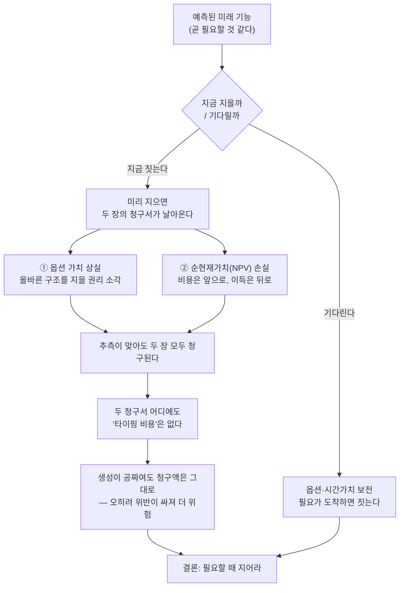

<figure class="post-figure post-figure--header">
<svg role="img" aria-label="왼쪽: 아직 오지 않은 적을 겨냥해 거대한 공성탑을 미리 지어 지쳐 버린 오크. 오른쪽: 도끼만 쥔 채 '옵션'이라는 자산을 지니고 때를 기다리는 오크. '미리 짓는 구조'의 유혹과 '기다림이라는 자산'의 대비." viewBox="0 0 640 340" xmlns="http://www.w3.org/2000/svg">
  <title>미리 짓는 구조의 유혹 vs. 기다림이라는 자산</title>

  <!-- ground -->
  <line x1="20" y1="300" x2="620" y2="300" stroke="currentColor" stroke-width="2" opacity="0.4"/>
  <!-- divider -->
  <line x1="320" y1="64" x2="320" y2="292" stroke="currentColor" stroke-width="1.5" opacity="0.28" stroke-dasharray="4 5"/>

  <!-- ===== LEFT: pre-building structure for an enemy that never came ===== -->
  <text x="160" y="32" text-anchor="middle" font-size="14" fill="currentColor" font-weight="700">미리 짓는 구조의 유혹</text>
  <text x="160" y="50" text-anchor="middle" font-size="10" fill="currentColor" opacity="0.7">적은 오지 않았는데 공성탑부터 짓다</text>

  <!-- siege tower -->
  <rect x="52" y="122" width="104" height="163" fill="var(--bg-light)" stroke="currentColor" stroke-width="2.5"/>
  <rect x="52" y="110" width="18" height="14" fill="var(--bg-light)" stroke="currentColor" stroke-width="2"/>
  <rect x="80" y="110" width="18" height="14" fill="var(--bg-light)" stroke="currentColor" stroke-width="2"/>
  <rect x="108" y="110" width="18" height="14" fill="var(--bg-light)" stroke="currentColor" stroke-width="2"/>
  <rect x="136" y="110" width="18" height="14" fill="var(--bg-light)" stroke="currentColor" stroke-width="2"/>
  <!-- timber cross-bracing -->
  <g stroke="currentColor" stroke-width="1.5" opacity="0.45">
    <line x1="52" y1="122" x2="156" y2="175"/><line x1="156" y1="122" x2="52" y2="175"/>
    <line x1="52" y1="175" x2="156" y2="230"/><line x1="156" y1="175" x2="52" y2="230"/>
    <line x1="52" y1="175" x2="156" y2="175"/><line x1="52" y1="230" x2="156" y2="230"/>
  </g>
  <!-- gate -->
  <rect x="90" y="247" width="28" height="38" fill="var(--bg-panel)" stroke="currentColor" stroke-width="2"/>
  <!-- wheels -->
  <circle cx="76" cy="290" r="12" fill="none" stroke="currentColor" stroke-width="2"/><circle cx="76" cy="290" r="3" fill="currentColor"/>
  <circle cx="132" cy="290" r="12" fill="none" stroke="currentColor" stroke-width="2"/><circle cx="132" cy="290" r="3" fill="currentColor"/>

  <!-- sightline to an absent enemy -->
  <line x1="160" y1="120" x2="290" y2="120" stroke="currentColor" stroke-width="1.8" opacity="0.6" stroke-dasharray="5 4"/>
  <path d="M290,120 l-9,-4 l0,8 Z" fill="currentColor" opacity="0.6"/>
  <text x="214" y="112" text-anchor="middle" font-size="9" fill="currentColor" opacity="0.65">적: 아직 안 옴</text>
  <rect x="294" y="108" width="20" height="22" fill="none" stroke="currentColor" stroke-width="1.6" opacity="0.5" stroke-dasharray="4 3"/>
  <text x="304" y="124" text-anchor="middle" font-size="14" fill="currentColor" font-weight="700" opacity="0.6">?</text>

  <!-- exhausted orc, hunched over, hands on knees -->
  <g stroke="currentColor" fill="none">
    <line x1="232" y1="296" x2="231" y2="276" stroke-width="3"/><line x1="231" y1="276" x2="241" y2="254" stroke-width="3"/>
    <line x1="256" y1="296" x2="257" y2="276" stroke-width="3"/><line x1="257" y1="276" x2="248" y2="254" stroke-width="3"/>
    <path d="M244,253 Q250,228 267,223" stroke-width="3"/>
    <line x1="263" y1="230" x2="240" y2="272" stroke-width="3"/>
    <line x1="265" y1="231" x2="256" y2="272" stroke-width="3"/>
  </g>
  <circle cx="276" cy="214" r="13" fill="var(--bg-light)" stroke="currentColor" stroke-width="2"/>
  <path d="M270,224 l-1,6 l4,-2 z" fill="var(--bg-light)" stroke="currentColor" stroke-width="1.3"/>
  <path d="M281,224 l1,6 l-4,-2 z" fill="var(--bg-light)" stroke="currentColor" stroke-width="1.3"/>
  <!-- dropped tool -->
  <line x1="206" y1="297" x2="222" y2="291" stroke="currentColor" stroke-width="2.5"/>
  <rect x="198" y="289" width="11" height="8" fill="var(--bg-light)" stroke="currentColor" stroke-width="1.6"/>
  <!-- sweat + sigh -->
  <path d="M292,200 q4,5 0,9 q-4,-4 0,-9 z" fill="var(--accent-color)"/>
  <path d="M300,210 q3,4 0,7 q-3,-3 0,-7 z" fill="var(--accent-color)"/>
  <text x="306" y="206" font-size="10" fill="var(--accent-color)" opacity="0.9" font-weight="700">후…</text>

  <!-- ===== RIGHT: waiting = holding an asset ===== -->
  <text x="480" y="32" text-anchor="middle" font-size="14" fill="currentColor" font-weight="700">기다림 = 자산 보유</text>
  <text x="480" y="50" text-anchor="middle" font-size="10" fill="currentColor" opacity="0.7">때가 오면 올바른 구조를 짓는다</text>

  <!-- upright orc, resting axe, calm -->
  <line x1="430" y1="190" x2="430" y2="178" stroke="currentColor" stroke-width="3"/>
  <circle cx="430" cy="176" r="3" fill="currentColor"/>
  <circle cx="430" cy="204" r="14" fill="var(--bg-light)" stroke="currentColor" stroke-width="2"/>
  <path d="M424,214 l-2,7 l5,-3 z" fill="var(--bg-light)" stroke="currentColor" stroke-width="1.3"/>
  <path d="M436,214 l2,7 l-5,-3 z" fill="var(--bg-light)" stroke="currentColor" stroke-width="1.3"/>
  <path d="M416,224 L444,224 L438,264 L422,264 Z" fill="var(--bg-light)" stroke="currentColor" stroke-width="2"/>
  <line x1="418" y1="230" x2="410" y2="262" stroke="currentColor" stroke-width="3"/>
  <line x1="442" y1="230" x2="462" y2="252" stroke="currentColor" stroke-width="3"/>
  <line x1="424" y1="264" x2="419" y2="296" stroke="currentColor" stroke-width="3"/>
  <line x1="436" y1="264" x2="441" y2="296" stroke="currentColor" stroke-width="3"/>
  <line x1="419" y1="296" x2="411" y2="296" stroke="currentColor" stroke-width="3"/>
  <line x1="441" y1="296" x2="449" y2="296" stroke="currentColor" stroke-width="3"/>
  <!-- resting axe (held, not raised) -->
  <line x1="466" y1="228" x2="466" y2="296" stroke="currentColor" stroke-width="3"/>
  <path d="M466,232 C482,229 493,240 490,251 C482,255 470,255 466,252 Z" fill="var(--bg-light)" stroke="currentColor" stroke-width="2"/>
  <circle cx="464" cy="251" r="3" fill="currentColor"/>

  <!-- unspent option = held asset -->
  <g stroke="var(--secondary-color)" stroke-width="2" opacity="0.5">
    <line x1="556" y1="132" x2="556" y2="140"/><line x1="520" y1="176" x2="528" y2="176"/><line x1="584" y1="176" x2="592" y2="176"/>
    <line x1="534" y1="152" x2="540" y2="158"/><line x1="578" y1="152" x2="572" y2="158"/>
  </g>
  <text x="556" y="126" text-anchor="middle" font-size="11" fill="var(--secondary-color)" font-weight="700">옵션 = 자산</text>
  <path d="M556,150 L576,176 L556,206 L536,176 Z" fill="var(--bg-light)" stroke="var(--secondary-color)" stroke-width="2.5" stroke-linejoin="round"/>
  <line x1="556" y1="150" x2="556" y2="206" stroke="var(--secondary-color)" stroke-width="1.3" opacity="0.55"/>
  <line x1="536" y1="176" x2="576" y2="176" stroke="var(--secondary-color)" stroke-width="1.3" opacity="0.55"/>
  <text x="556" y="226" text-anchor="middle" font-size="9" fill="currentColor" opacity="0.7">쓰지 않아 값이 남아 있음</text>
</svg>
<figcaption>거대한 <strong>공성탑</strong>을 오지 않은 적을 위해 미리 지어 지쳐 버린 오크(왼쪽)와, <strong>도끼만 쥔 채</strong> 때를 기다리는 오크(오른쪽). 미리 짓는 순간 <strong>최선의 구조를 나중에 지을 옵션</strong>이 소각된다 — 기다림은 게으름이 아니라 자산을 보유하는 일이다.</figcaption>
</figure>

## 원문 정보

> - **제목**: The Cost YAGNI Was Never About
> - **부제**: "If you think YAGNI is about saving effort, cheap generation should retire it. It doesn't. Here's why."
> - **출처**: Kent Beck — Tidy First? 뉴스레터 ([newsletter.kentbeck.com](https://newsletter.kentbeck.com))
> - **발행**: 2026-06-25 · 짧은 에세이, 약 5분 분량
> - **원문 링크**: <https://newsletter.kentbeck.com/p/the-cost-yagni-was-never-about>

`Articles` 카테고리는 읽을 만한 외부 글을 골라 핵심을 정리하고 내 관점으로 분석하는 공간이다. 이 글은 XP의 창시자이자 YAGNI라는 말을 세상에 퍼뜨린 당사자인 Kent Beck이, "AI가 코드를 공짜로 찍어내면 YAGNI는 은퇴하는가?"라는 질문에 직접 답하는 짧은 에세이다.

## 한 줄 요약 (TL;DR)

YAGNI("You Aren't Gonna Need It")의 진짜 비용은 코드를 **치는 수고**가 아니라, 미리 구조를 짓느라 잃는 **옵션 가치**와 비용을 앞당기고 이득을 미루는 **순현재가치(NPV) 손실**이다. 타이핑 비용은 애초에 청구서에 없던 항목이므로, 생성이 공짜가 되어도 YAGNI는 약해지지 않는다 — 오히려 위반이 싸지고 이해도가 떨어져 **더 위험해진다**.

## 왜 이 글을 골랐나

이 위키는 이미 XP·TDD·리팩터링 같은 Kent Beck 계열의 엔지니어링 고전들을 다뤄 왔고, 최근에는 "코드 작성이 공짜가 되면 무엇이 비싸지는가"라는 질문을 여러 각도에서 모아 왔다. 이 글은 그 두 흐름이 정확히 만나는 지점에 있다. YAGNI는 흔히 "쓸데없는 코드 그만 짜서 손 아끼자"는 절약의 격언으로 오해되는데, 그렇게 읽으면 AI 시대에 폐기 대상이 되기 딱 좋다. 타이핑이 공짜니까. Beck은 그 통념을 정면으로 부수고, YAGNI를 **경제학의 문제**로 다시 세운다. "생성 비용이 0에 수렴한다"는 사실이 무엇을 바꾸고 무엇을 바꾸지 못하는지를 가르는, 지금 꼭 필요한 균형 감각이다.

글 전체의 논증을 한 장으로 요약하면 이렇다. 예측된 미래 기능 앞에서 "지금 지을까"를 고르는 순간, 두 장의 청구서가 결정된다.

## 핵심 내용

### 여는 일화: "너는 그거 필요 없을 거야"

Beck은 오래전 Chet Hendrickson과의 대화를 기억으로 소환한다. Chet이 프로젝트 도중 다가와 이렇게 말했다고 한다. "지금은 단순하게 처리할 수 있지만 3주 뒤면 그걸로는 부족할 거예요. 어차피 더 복잡한 게 필요할 테니 지금 만들어 두고 싶어요." Beck의 대답은 한 문장이었다.

> "You aren't going to need it."

원문은 Chet이 정확히 무엇을 미리 지으려 했는지는 말하지 않는다. 중요한 건 대상이 아니라 **구조**다. 즉 "지금은 필요 없지만 곧 필요할 것 같으니 미리 지어두자"는 그 충동 자체가 YAGNI가 겨누는 표적이다.

### YAGNI는 게으름이 아니라 '타이밍에 대한 명상'

여기서 Beck은 흔한 오해를 먼저 걷어낸다. YAGNI는 **설계를 하지 말라는 핑계가 아니다.** 그가 내놓는 정의는 이렇다.

> "YAGNI is a meditation on timing. Building structure too soon is as risky as building structure too late."

구조를 **너무 일찍** 짓는 것은 **너무 늦게** 짓는 것만큼 위험하다. 그러니 YAGNI는 "구조를 짓지 마라"가 아니라 "**언제** 지을 것인가"의 문제다. 흥미로운 반론 하나 — "나중에 끼워 넣으려면 비싼 리팩터링이 필요하잖아?" — 을 Beck은 그 자체가 **또 하나의 예측**일 뿐이라고 처리한다. 값비싼 개조가 필요하리라는 것도 결국 오지 않을지 모를 미래에 대한 추측이라는 것이다.

### 첫 번째 청구서 — 옵션 가치 (Optionality)

Beck은 미리 구조를 지을 때 날아오는 비용을 **두 장의 청구서**로 나눈다. 첫 번째는 **옵션**이다.

금융에서 옵션은 "할 수 있는 권리"이지 "해야 하는 의무"가 아니다. 아무것도 확정하지 않고 기다리는 상태는, 바로 **최선의 구조를 나중에 지을 권리를 손에 쥔 채로** 있는 상태다. 그런데 기능이 도착하기 전에 구조부터 지으면, 당신은 하나의 추측에 스스로를 **묶어버린다(commit)**. 그리고 예측된 기능은 실제로 도착했을 때 예측과 거의 일치하지 않는다. 그러면 억지로 끼워 맞추거나(workaround) 다시 뜯어고쳐야(rework) 한다.

Beck의 핵심 통찰은 여기서 나온다. **추측이 맞았더라도** 당신은 아무것도 확정하지 않은 경우보다 더 나빠진다는 것이다.

> "The value was never in the structure. The value was in the option to build the right structure once you knew."

가치는 구조 자체에 있던 적이 없다. 가치는 **알게 된 뒤에 올바른 구조를 지을 수 있는 옵션**에 있었다. 미리 지어버리는 순간, 당신은 아직 값이 남아 있는 그 옵션을 스스로 소각한 것이다. 그래서 그는 기다림을 게으름과 분리한다.

> "Waiting is not laziness. Waiting is holding an asset."

기다림은 게으름이 아니다. 기다림은 **자산을 보유하는 일**이다.

<figure class="post-figure">
<svg role="img" aria-label="미리 구조를 지을 때 날아오는 두 장의 청구서를 나란히 그린 그림. 왼쪽 청구서는 '옵션 가치 상실', 오른쪽 청구서는 '순현재가치(NPV) 손실'이며 둘 다 '청구됨' 도장이 찍혀 있다. 두 청구서 아래에는 '타이핑 비용 — 청구되지 않음'이 회색으로 지워진 채 적혀 있다." viewBox="0 0 640 344" xmlns="http://www.w3.org/2000/svg">
  <title>두 장의 청구서 — 옵션 가치 상실과 NPV 손실, 그리고 청구되지 않는 타이핑 비용</title>

  <text x="320" y="34" text-anchor="middle" font-size="14" fill="currentColor" font-weight="700">미리 지으면 날아오는 두 장의 청구서</text>
  <text x="320" y="52" text-anchor="middle" font-size="10" fill="currentColor" opacity="0.7">추측이 맞든 틀리든, 두 장 모두 청구된다</text>

  <!-- ===== LEFT BILL: optionality loss ===== -->
  <rect x="40" y="64" width="250" height="196" fill="var(--bg-light)" stroke="currentColor" stroke-width="2"/>
  <text x="165" y="90" text-anchor="middle" font-size="11" fill="var(--accent-color)" font-weight="700">청구서 ①</text>
  <text x="165" y="112" text-anchor="middle" font-size="15" fill="currentColor" font-weight="700">옵션 가치 상실</text>
  <line x1="52" y1="122" x2="278" y2="122" stroke="currentColor" stroke-width="1.2" opacity="0.4"/>
  <text x="58" y="150" font-size="11" fill="currentColor">· 미리 확정 = 추측에 스스로를 묶음</text>
  <text x="58" y="176" font-size="11" fill="currentColor">· 올바른 구조를 지을 권리를 소각</text>
  <text x="58" y="202" font-size="11" fill="currentColor">· 추측이 맞아도 손해다</text>
  <g transform="rotate(-10 235 232)">
    <rect x="196" y="219" width="78" height="26" rx="3" fill="none" stroke="var(--accent-color)" stroke-width="2"/>
    <text x="235" y="237" text-anchor="middle" font-size="12" fill="var(--accent-color)" font-weight="700">청구됨</text>
  </g>

  <!-- plus -->
  <text x="320" y="168" text-anchor="middle" font-size="22" fill="currentColor" font-weight="700" opacity="0.5">＋</text>

  <!-- ===== RIGHT BILL: NPV loss ===== -->
  <rect x="350" y="64" width="250" height="196" fill="var(--bg-light)" stroke="currentColor" stroke-width="2"/>
  <text x="475" y="90" text-anchor="middle" font-size="11" fill="var(--accent-color)" font-weight="700">청구서 ②</text>
  <text x="475" y="112" text-anchor="middle" font-size="14" fill="currentColor" font-weight="700">순현재가치(NPV) 손실</text>
  <line x1="362" y1="122" x2="588" y2="122" stroke="currentColor" stroke-width="1.2" opacity="0.4"/>
  <text x="368" y="150" font-size="11" fill="currentColor">· 비용은 앞으로 당겨진다</text>
  <text x="368" y="176" font-size="11" fill="currentColor">· 이득은 뒤로 밀린다</text>
  <text x="368" y="202" font-size="11" fill="currentColor">· 타이밍만 어긋나도 청구된다</text>
  <g transform="rotate(-10 540 232)">
    <rect x="501" y="219" width="78" height="26" rx="3" fill="none" stroke="var(--accent-color)" stroke-width="2"/>
    <text x="540" y="237" text-anchor="middle" font-size="12" fill="var(--accent-color)" font-weight="700">청구됨</text>
  </g>

  <!-- ===== NOT ON EITHER BILL: typing cost, struck out ===== -->
  <rect x="40" y="284" width="560" height="48" fill="none" stroke="currentColor" stroke-width="1.6" stroke-opacity="0.4" stroke-dasharray="6 4"/>
  <text x="320" y="308" text-anchor="middle" font-size="13" fill="currentColor" opacity="0.5">타이핑 비용 — 청구되지 않음</text>
  <line x1="228" y1="304" x2="412" y2="304" stroke="currentColor" stroke-width="2" opacity="0.55"/>
  <text x="320" y="325" text-anchor="middle" font-size="9.5" fill="currentColor" opacity="0.6">AI가 타이핑을 0으로 만들어도 두 청구서 금액은 불변</text>
</svg>
<figcaption>미리 짓는 순간 날아오는 <strong>두 장의 청구서</strong> — 왼쪽 <strong>옵션 가치 상실</strong>, 오른쪽 <strong>순현재가치(NPV) 손실</strong>. 추측이 맞아도 둘 다 청구된다. 정작 <strong>타이핑 비용</strong>은 어느 청구서에도 없어, 생성이 공짜가 돼도 금액은 그대로다.</figcaption>
</figure>

### 두 번째 청구서 — 순현재가치 (NPV)

두 번째 청구서는 시간의 값이다. Beck은 이렇게 요약한다.

> "Money has time value. So do features. Structure you build now for a feature due in three months is cost pulled forward and revenue pushed back."

돈에 시간 가치가 있듯 기능에도 시간 가치가 있다. 석 달 뒤에나 필요한 기능을 위해 **지금** 구조를 지으면, 비용은 **앞으로 당겨지고(cost pulled forward)** 그 대가로 돌아올 이득은 **뒤로 밀린다(revenue pushed back)**. 지금 지불하고 나중에 회수하는 셈이니, 할인율을 적용한 순현재가치 관점에서는 손해다. 이 손해 역시 **예측이 정확했더라도** 발생한다. 타이밍이 어긋나 있다는 사실 하나만으로 청구서는 날아온다.

두 청구서를 나란히 놓으면 YAGNI의 진짜 얼굴이 드러난다. 그것은 손을 아끼는 절약술이 아니라, **확정을 미루어 옵션을 보전하고 지출을 미루어 시간 가치를 지키는** 재무적 규율이다.

### 어느 청구서에도 없는 항목: 타이핑 비용

이제 결정타. Beck은 두 청구서 어디를 봐도 **없는 항목** 하나를 가리킨다.

> "Notice what is _not_ on either bill: the cost of typing the code."

**코드를 치는 비용은 두 청구서 어디에도 적혀 있지 않다.** YAGNI가 지키려던 것은 처음부터 타이핑 수고가 아니었다. 그러니 AI가 타이핑 비용을 0으로 만들어도 두 청구서의 금액은 한 푼도 바뀌지 않는다. 오히려 Beck은 상황이 **더 나빠진다(which is worse)**고 본다. 생성이 공짜가 되면 위반의 문턱이 낮아져 투기적 구조를 훨씬 쉽게 저지르게 되고, 게다가 내가 직접 치지 않은 코드는 **이해도**가 떨어지므로, 두 장의 청구서는 그대로 남은 채 이해라는 세 번째 비용까지 쌓인다.

> "Free generation doesn't weaken YAGNI. It makes violation cheaper to commit."

### 지니(genie)는 YAGNI를 이해하지 못한다

이 글에는 AI에 대한 구체적인 계기가 깔려 있다. Beck은 최근 한 모델과의 대화에서 **"지니(genie)들은 YAGNI를 이해하지 못한다"**는 사실에 놀랐다고 한다. 여기서 '지니'는 코드를 소원대로 뚝딱 만들어 주는 AI 생성 모델을 가리킨다. 그래서 그는 이 글의 상당 부분을 사람이 아니라 **미래의 AI 세대를 위한 설명("Dear Genie")**으로 적었다고 밝힌다.

문제는 지니가 너무 순순하다는 데 있다. "지니는 당신을 위해 아름다운 투기적 프레임워크를 기꺼이 지어줄 것"이기 때문이다. 요청하면 만들어 준다. 저항이 없다. 예전에는 "이걸 언제 다 치나"라는 타이핑의 마찰이 투기적 설계를 어느 정도 눌러주는 브레이크였지만, 그 브레이크가 사라진 지금 YAGNI라는 **판단**은 인간이 명시적으로 붙들고 있어야 하는 규율이 된다.

Beck은 이렇게 글을 닫는다.

> "Build it when you need it. Not because the code is dear. Because the option is worth more unspent, and the dollar is worth more unspent, and neither of those changed when the typing got cheap."

필요할 때 지어라. 코드가 비싸서가 아니라, **쓰지 않은 옵션이 더 값지고 쓰지 않은 돈이 더 값지기 때문**이며, 타이핑이 싸졌다고 해서 그 둘 중 어느 것도 바뀌지 않았기 때문이다.

## 분석과 인사이트

가장 인상적인 것은 **비용을 재정의하는 방식**이다. YAGNI는 오래 "부지런한 미니멀리즘" 정도로 통용돼 왔고, 그 프레임에서는 AI가 타이핑을 대신하는 순간 근거를 잃는다. Beck은 논쟁의 축을 노동(effort)에서 **자본(option·time value)**으로 옮겨, "타이핑이 공짜여도 청구서 금액은 그대로"라는 결론을 깔끔하게 뽑아낸다. 이건 단순한 수사가 아니라, 반론을 미리 무력화하는 좋은 논증 설계다.

옵션 가치를 강조한 대목도 실무 감각과 잘 맞는다. 우리가 미리 지은 추상이 대개 후회로 남는 이유는 "예측이 틀려서"라고만 생각하기 쉽지만, Beck은 **예측이 맞아도 손해**라고 못 박는다. 확정 자체가 정보가 덜 쌓인 시점에 미래를 봉인하는 행위이기 때문이다. 이 관점은 이 위키에서 정리했던 [잘못된 추상화](/2026/06/22/the-wrong-abstraction.html)의 교훈과 정확히 포개진다. Sandi Metz가 "잘못된 추상화는 중복보다 비싸다"고 했던 것도, 결국 이른 확정이 옵션을 소각한 대가다.

다만 균형을 위해 짚자면, 이 글은 짧은 에세이인 만큼 **경계 사례를 거의 다루지 않는다.** 현실에는 되돌리기가 실제로 매우 비싼 결정들이 있다 — 데이터 스키마, 공개 API 계약, 보안 경계, 분산 시스템의 프로토콜 같은 것들. 이런 영역에서는 "일단 기다렸다가 나중에"가 옵션이 아니라 **자기기만**이 될 수 있다. Beck 자신도 "값비싼 개조 예측"을 반론으로 언급하며 그것도 예측일 뿐이라 처리하지만, 예측의 **비대칭성**(틀렸을 때의 손실 크기)까지 지우지는 못한다. 그래서 나는 이 글을 "미리 짓지 마라"가 아니라 "**되돌리기 비용이 낮은 결정은 최대한 미루고, 되돌리기 비용이 큰 결정만 신중히 앞당겨라**"로 읽는 편이 안전하다고 본다. YAGNI는 후자를 위한 판단력을 대체하지 않는다.

그럼에도 AI 시대에 대한 진단은 날카롭다. 생성 마찰이 사라지면서 **투기적 구조의 한계비용이 0에 수렴**한다는 관찰은, "지니는 아름다운 프레임워크를 기꺼이 지어준다"는 한 문장에 압축돼 있다. 문제는 코드가 늘어나는 게 아니라, 그 코드를 **아무도 필요로서 요청하지 않았고 아무도 온전히 이해하지 못한다는 점**이다. 이해도 저하라는 비용은 [Intent Debt](/2026/06/21/intent-debt.html)에서 다룬 "에이전트가 대신 갚아줄 수 없는 부채"와 같은 뿌리다. 코드는 공짜로 생성돼도, 그 코드가 왜 존재하는지에 대한 이해는 여전히 사람이 비싼 값을 치르고 벌어야 한다. Martin Fowler의 [코딩이 공짜가 되면 무엇이 비싸지는가](/2026/06/23/fowler-fragments-verification-cognitive-surrender.html)와 나란히 놓으면, 두 사람이 서로 다른 개념(검증·인지 vs 옵션·시간가치)으로 같은 결론에 도달하는 것을 볼 수 있다.

## 적용 포인트

- **YAGNI를 "손 아끼기"가 아니라 "확정 미루기"로 재정의하라.** 판단 기준은 "이거 짜기 귀찮은가"가 아니라 "지금 확정하면 나중에 알게 될 정보로 더 나은 선택을 할 옵션을 잃는가"다.
- **AI에게 시킬 때 '투기적 구조'를 명시적으로 금지하라.** "지금 요청한 기능만 구현하고, 미래를 위한 추상·확장 지점·설정 옵션은 만들지 마라"를 프롬프트/에이전트 지침에 못 박는다. 지니는 시키지 않으면 알아서 참지 않는다.
- **되돌리기 비용으로 결정을 분류하라.** 스키마·공개 API·보안 경계처럼 되돌리기 비싼 결정만 신중히 앞당기고, 나머지는 필요가 도착할 때까지 기다린다. YAGNI는 전자를 면제해 주지 않는다.
- **PR에서 "이건 지금 필요한가?"를 리뷰 항목으로 넣어라.** AI가 생성한 코드일수록 "요청되지 않은 일반화"가 슬며시 끼어들기 쉽다. 필요로서 요청되지 않은 구조는 리뷰에서 되돌린다.
- **기다림을 산출물로 인정하라.** "아직 안 지었음"을 방치가 아니라 **보유 중인 옵션**으로 기록해 두면(예: 결정 기록/ADR에 "의도적으로 미룸"으로 남기기), 나중에 게으름이 아니라 규율이었음이 드러난다.

## 마무리

Kent Beck의 이 짧은 글은, 기술이 바뀔 때 원칙을 어떻게 재검증해야 하는지를 보여주는 좋은 본보기다. 겉으로 드러난 이유("코드 짜기 귀찮으니까")를 벗겨내고 진짜 이유(옵션 가치와 시간 가치)를 찾아내면, 표면 조건(타이핑 비용)이 아무리 변해도 원칙이 왜 살아남는지가 선명해진다. AI가 생성 비용을 0으로 만든 지금, YAGNI는 폐기되기는커녕 **인간이 의식적으로 붙들어야 하는 판단**으로 격상됐다. 청구서는 그대로 날아오고, 이제 그 청구서를 읽어줄 사람은 지니가 아니라 우리다.

### 더 읽어보기

- [원문 — The Cost YAGNI Was Never About (Kent Beck)](https://newsletter.kentbeck.com/p/the-cost-yagni-was-never-about)
- [코딩이 공짜가 되면 무엇이 비싸지는가 — Martin Fowler의 Fragments](/2026/06/23/fowler-fragments-verification-cognitive-surrender.html) — 같은 질문에 검증·인지 비용으로 답하는 자매 글
- [Intent Debt: 에이전트가 대신 갚아줄 수 없는 단 하나의 부채](/2026/06/21/intent-debt.html) — 공짜 생성이 남기는 이해도라는 부채
- [잘못된 추상화: 중복보다 더 비싼 죄 (Sandi Metz)](/2026/06/22/the-wrong-abstraction.html) — 이른 확정이 옵션을 소각하는 또 다른 사례
- [바이브 코딩과 에이전틱 엔지니어링 (Simon Willison)](/2026/06/25/vibe-coding-and-agentic-engineering.html) — 생성 마찰이 사라진 시대의 작업 방식
- [XP Explained: 변화를 끌어안는 애자일](/2026/06/19/extreme-programming-explained.html) — Beck이 YAGNI를 처음 세운 XP의 가치·원칙
