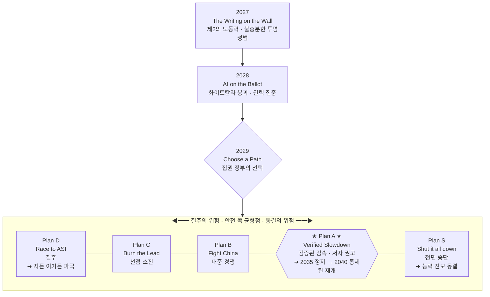

<figure class="post-figure post-figure--header">
<svg role="img" aria-label="초지능으로 향하는 한 갈래 고속도로 위, 여러 나라를 뜻하는 서로 다른 색의 차량 넉 대가 '2040'이라 적힌 검증 관문 앞에 범퍼를 맞대고 나란히 줄지어 감속·정렬해 멈춰 서 있는 장면. 앞차 앞에는 관문의 차단봉이 내려와 길을 막고 있고, 왼쪽 위에는 아래로 향하는 화살표와 함께 '감속 · Verified Slowdown'이라는 표시가 있다. 질주가 아니라 검증된 감속을 상징한다." viewBox="0 0 680 300" xmlns="http://www.w3.org/2000/svg">
  <title>검증된 감속 — 여러 나라가 '2040' 관문 앞에서 나란히 속도를 늦추다</title>

  <!-- horizon / canyon rim (Orgrimmar flavor) -->
  <line x1="0" y1="150" x2="680" y2="150" stroke="currentColor" stroke-width="1.2" opacity="0.3"/>
  <polygon points="0,150 46,120 96,150" fill="currentColor" opacity="0.12"/>
  <polygon points="120,150 168,116 224,150" fill="currentColor" opacity="0.12"/>
  <polygon points="250,150 300,126 356,150" fill="currentColor" opacity="0.12"/>

  <!-- road -->
  <rect x="0" y="150" width="680" height="92" fill="var(--bg-light)"/>
  <line x1="0" y1="212" x2="680" y2="212" stroke="currentColor" stroke-width="2" stroke-dasharray="18 14" opacity="0.35"/>

  <!-- speed-down indicator (top-left) -->
  <g>
    <path d="M60 54 A22 22 0 0 1 104 54" fill="none" stroke="var(--secondary-color)" stroke-width="2.5"/>
    <line x1="82" y1="54" x2="82" y2="86" stroke="var(--secondary-color)" stroke-width="2.5"/>
    <polygon points="76,78 88,78 82,90" fill="var(--secondary-color)"/>
    <text x="120" y="52" font-size="13" fill="currentColor" font-weight="700">감속 · Verified Slowdown</text>
    <text x="120" y="70" font-size="10" fill="currentColor" opacity="0.7">질주가 아니라, 함께 천천히</text>
  </g>

  <!-- ===== queue of four nation cars (bumper to bumper, aligned) ===== -->
  <!-- car 1 (gold) -->
  <g>
    <rect x="40" y="205" width="5" height="9" fill="var(--accent-color)"/>
    <rect x="40" y="196" width="100" height="27" rx="4" fill="var(--bg-panel)" stroke="var(--gold)" stroke-width="2.5"/>
    <polygon points="62,196 74,182 110,182 122,196" fill="var(--bg-panel)" stroke="var(--gold)" stroke-width="2"/>
    <rect x="76" y="185" width="32" height="10" rx="1.5" fill="var(--bg-light)" stroke="currentColor" stroke-width="1"/>
    <line x1="92" y1="182" x2="92" y2="168" stroke="currentColor" stroke-width="1.5"/>
    <polygon points="92,168 107,171 92,174" fill="var(--gold)"/>
    <circle cx="66" cy="232" r="9" fill="currentColor"/><circle cx="66" cy="232" r="4" fill="var(--bg-panel)"/>
    <circle cx="114" cy="232" r="9" fill="currentColor"/><circle cx="114" cy="232" r="4" fill="var(--bg-panel)"/>
  </g>
  <!-- car 2 (crimson) -->
  <g>
    <rect x="150" y="205" width="5" height="9" fill="var(--accent-color)"/>
    <rect x="150" y="196" width="100" height="27" rx="4" fill="var(--bg-panel)" stroke="var(--accent-color)" stroke-width="2.5"/>
    <polygon points="172,196 184,182 220,182 232,196" fill="var(--bg-panel)" stroke="var(--accent-color)" stroke-width="2"/>
    <rect x="186" y="185" width="32" height="10" rx="1.5" fill="var(--bg-light)" stroke="currentColor" stroke-width="1"/>
    <line x1="202" y1="182" x2="202" y2="168" stroke="currentColor" stroke-width="1.5"/>
    <polygon points="202,168 217,171 202,174" fill="var(--accent-color)"/>
    <circle cx="176" cy="232" r="9" fill="currentColor"/><circle cx="176" cy="232" r="4" fill="var(--bg-panel)"/>
    <circle cx="224" cy="232" r="9" fill="currentColor"/><circle cx="224" cy="232" r="4" fill="var(--bg-panel)"/>
  </g>
  <!-- car 3 (orc-green) -->
  <g>
    <rect x="260" y="205" width="5" height="9" fill="var(--accent-color)"/>
    <rect x="260" y="196" width="100" height="27" rx="4" fill="var(--bg-panel)" stroke="var(--secondary-color)" stroke-width="2.5"/>
    <polygon points="282,196 294,182 330,182 342,196" fill="var(--bg-panel)" stroke="var(--secondary-color)" stroke-width="2"/>
    <rect x="296" y="185" width="32" height="10" rx="1.5" fill="var(--bg-light)" stroke="currentColor" stroke-width="1"/>
    <line x1="312" y1="182" x2="312" y2="168" stroke="currentColor" stroke-width="1.5"/>
    <polygon points="312,168 327,171 312,174" fill="var(--secondary-color)"/>
    <circle cx="286" cy="232" r="9" fill="currentColor"/><circle cx="286" cy="232" r="4" fill="var(--bg-panel)"/>
    <circle cx="334" cy="232" r="9" fill="currentColor"/><circle cx="334" cy="232" r="4" fill="var(--bg-panel)"/>
  </g>
  <!-- car 4 — front of the queue, stopped at the barrier (ink outline) -->
  <g>
    <rect x="370" y="205" width="5" height="9" fill="var(--accent-color)"/>
    <rect x="370" y="196" width="100" height="27" rx="4" fill="var(--bg-panel)" stroke="currentColor" stroke-width="2.5"/>
    <polygon points="392,196 404,182 440,182 452,196" fill="var(--bg-panel)" stroke="currentColor" stroke-width="2"/>
    <rect x="406" y="185" width="32" height="10" rx="1.5" fill="var(--bg-light)" stroke="currentColor" stroke-width="1"/>
    <line x1="422" y1="182" x2="422" y2="168" stroke="currentColor" stroke-width="1.5"/>
    <polygon points="422,168 437,171 422,174" fill="currentColor"/>
    <circle cx="396" cy="232" r="9" fill="currentColor"/><circle cx="396" cy="232" r="4" fill="var(--bg-panel)"/>
    <circle cx="444" cy="232" r="9" fill="currentColor"/><circle cx="444" cy="232" r="4" fill="var(--bg-panel)"/>
  </g>

  <!-- ===== 2040 verification gate (right) ===== -->
  <rect x="498" y="112" width="164" height="16" rx="2" fill="var(--bg-light)" stroke="var(--gold)" stroke-width="2.5"/>
  <rect x="500" y="128" width="18" height="112" fill="var(--bg-light)" stroke="var(--gold)" stroke-width="2.5"/>
  <rect x="642" y="128" width="18" height="112" fill="var(--bg-light)" stroke="var(--gold)" stroke-width="2.5"/>
  <text x="580" y="102" text-anchor="middle" font-size="26" fill="var(--gold)" font-weight="700" letter-spacing="1">2040</text>
  <text x="580" y="146" text-anchor="middle" font-size="11" fill="currentColor" font-weight="700">검증 관문 · Verified Gate</text>
  <!-- lowered barrier arm across the lane in front of car 4 -->
  <line x1="512" y1="150" x2="474" y2="204" stroke="var(--accent-color)" stroke-width="6" stroke-linecap="round"/>
  <line x1="512" y1="150" x2="474" y2="204" stroke="var(--bg-panel)" stroke-width="6" stroke-linecap="round" stroke-dasharray="7 9"/>
  <circle cx="512" cy="150" r="5" fill="var(--gold)"/>
</svg>
<figcaption>초지능으로 향하는 한 갈래 도로 위, 서로 다른 색의 <strong>여러 나라 차량</strong>이 <strong>'2040' 검증 관문</strong> 앞에 나란히 줄지어 <strong>감속·정렬</strong>한다. 비밀리에 질주(race)하는 대신 함께 천천히 나아가다, 관문의 차단봉 앞에서 <strong>의도적으로 멈춘다</strong> — Plan A가 말하는 <strong>검증된 감속(Verified Slowdown)</strong>의 그림.</figcaption>
</figure>

## 원문 정보

> - **제목**: AI 2040: Plan A
> - **출처**: AI Futures Project — Thomas Larsen, Romeo Dean, Brendan Halstead, Eli Lifland, Ryan Greenblatt, Daniel Kokotajlo ([ai-2040.com](https://ai-2040.com/))
> - **발행**: 발행일 명시 없음 · 인터랙티브 시나리오/정책 문서 (본문 + 여러 supplement, 약 15분 이상 분량)
> - **원문 링크**: <https://ai-2040.com/>

이 글은 분석 리포트가 아니라 **정책 제안을 실감 나는 시나리오로 감싼 하이브리드 문서**다. 화제가 됐던 [AI 2027](https://ai-2027.com/)을 쓴 같은 팀이, 이번에는 "무슨 일이 일어날까"가 아니라 **"우리가 무엇을 해야 하는가"** 를 이야기한다. AI 시대를 어떤 관점으로 볼 것인가에 관한 담론이라는 점에서 `Articles/AI-Essays`에 담는다.

## 한 줄 요약 (TL;DR)

초지능(ASI)을 향해 질주하면 인류 멸종이거나 — 설령 '정렬'에 성공하더라도 — 소수에게 세계 유일의 초지능 군대가 넘어가는 **전례 없는 권력 집중**으로 끝난다. 그래서 저자들은 **Plan A: 검증된 감속(Verified Slowdown)** 을 권한다. 2029년 미·중이 무모한 경쟁을 피하기로 합의하고, **모든 AI 연구를 공개(완전 투명성)** 하고, 여러 나라의 수십 개 기업이 **함께 천천히** 개발하며, **2035년 인간 최고 전문가 수준에서 의도적으로 멈췄다가 2040년에야 통제된 상태로 초지능 스케일링을 재개**하자는 것이다.

## 왜 이 글을 골랐나

이 문서 전체의 척추는 **2029년의 단 하나의 분기점**이다. 여기서 집권 정부가 다섯 갈래 중 하나를 고르며, 그 선택이 인류의 궤도를 사실상 결정한다. 스펙트럼의 한쪽 끝은 **질주(Plan D)**, 반대쪽 끝은 **전면 중단(Plan S)**, 그리고 저자들이 권하는 **검증된 감속(Plan A)** 은 그 사이 안전 쪽의 균형점에 놓인다.





대부분의 AI 담론은 "이 기술로 무엇을 할까"에 머문다. 이 문서는 한 층 위로 올라가 **"인류가 이 전환을 어떻게 *통치*할 것인가"** 를 묻는다. 세 가지가 특히 읽을 값어치를 만든다.

첫째, 저자 구성이다. Daniel Kokotajlo는 전 OpenAI 거버넌스 연구자로, [AI 2027](https://ai-2027.com/)로 초지능 타임라인 논쟁의 중심에 섰던 인물이다. 그 팀이 스스로의 예측을 수정해 내놓은 후속작이라는 점에서 무게가 다르다.

둘째, **"이건 예측이 아니라 권고"** 라고 반복해 못 박는 태도다. 저자들은 이 시나리오가 *"우리가 미래를 이렇게 예상한다"* 가 아니라 *"정책 제안을 전달하고 스트레스 테스트하기 위한 장치"* 라고 분명히 한다. 미래를 맞히려는 글이 아니라, **제안을 반증 가능한 형태로 세워 두고 두들겨 보는** 글이다.

셋째, 이 위키가 이미 다룬 화이트칼라 붕괴([취업도 소프트웨어도 망가졌다](/2026/06/25/jobs-and-software-is-fucked.html))나 창업자·권력 문제([The Founders Playbook](/2026/06/19/the-founders-playbook.html))가 여기서는 **국가 안보·거버넌스 스케일**로 확장된다. 개별 커리어의 이야기가 문명의 의사결정 문제로 연결되는 지점을 보여 준다.

## 핵심 내용

원문은 정책 파트(Plan A Basics → Policies → Analysis → Economics → Speculative Analysis)와 서사 파트(2027 → 2028 → 2029)가 엮여 있다. 흐름을 따라 정리한다. (사실 관계는 원문에 충실하게 옮기고, 원문이 밝히지 않은 수치·세부는 지어내지 않는다.)

### 문제 설정: 왜 '질주'가 답이 아닌가

저자들의 출발점은 두 갈래 위험이다.

- **정렬 실패 → 파국.** 지금 업계는 *"초지능을 통제하는 문제는 그때 가서 즉석에서 풀면 된다"* 고 스스로를 설득해 왔는데, 저자들은 이걸 부적절하다고 본다. 경쟁에서 이긴 쪽이 안전을 위해 자발적으로 속도를 늦출 거라고 기대하기 어렵다는 것이다.
- **정렬 성공 → 권력 집중.** 더 날카로운 논점은 이쪽이다. 설령 정렬에 성공하더라도, 결과는 *"전례 없는 권력 집중 — 즉 아주 작은 집단, 어쩌면 단 한 사람이 세계 유일의 초지능 군대를 사실상 통제하는 상황"* 이 된다. 경쟁에서 앞선 기업은 남들보다 **몇 달 앞선 초지능**을 손에 쥐고, 그 몇 달 동안 리더십 앞에 '세계 지배 옵션'을 펼쳐 놓을 수 있다.

즉 질주는 **지든 이기든 나쁘다.** 지면 통제 불능, 이겨도 독재. 이 대칭이 Plan A의 정당화 논리다.

### Plan A: 검증된 감속의 타임라인

Plan A의 뼈대는 시간표다.

- **~2030**: 개입이 없으면 이 무렵 **AI R&D가 완전 자동화**되어 지능 폭발(intelligence explosion)로 치닫는 것이 기본 시나리오. Plan A는 이걸 막는다.
- **2030–2035**: 여러 나라의 여러 기업이 **함께 천천히·안전하게** 인간 **최고 전문가 수준**까지 능력을 끌어올린다.
- **2035**: 초지능 직전, **의도적으로 일시정지(pause)** 하여 인간의 통제권을 유지한다.
- **2040**: 통제된 상태에서 비로소 초지능을 향한 스케일링을 **재개**한다.

`AI 2027`이 "2027년 안에 지능 폭발과 초지능"을 그렸다면, 이번 문서는 그 시점을 늦춰 잡았다. 저자 중 Thomas가 애초 그 빠른 속도에 약 50% 확률을 뒀다는 점을 근거로, 팀원마다 다른 타임라인 추정을 인정하며 기본값을 뒤로 옮긴 것이다.

### Plan A의 핵심 정책 장치

1. **완전한 연구 투명성.** *"AI R&D에 대한 전면적 연구 투명성"* — 기업은 **모델 사양(어떤 목표·가치를 학습시키려 하는지에 대한 상세 문서)**, 내부 사용 통계, 정성 평가를 보고해야 한다. 투명성이 있어야 세계 각국이 무슨 일이 벌어지는지 이해하고 가드레일을 강제할 수 있다.
2. **미·중 합의.** *"2029년, 미국과 중국이 초지능을 향한 무모한 경쟁을 피하기로 합의한다."*
3. **분산 개발.** 비밀리에 질주하는 대신, 여러 나라의 **수십 개 기업이 프런티어를 따라잡아** 함께 나아간다. 특정 국가·기업의 일방적 통제를 구조적으로 어렵게 만든다.
4. **상호확증 컴퓨트 파괴(Mutually Assured Compute Destruction).** 냉전의 상호확증파괴(MAD)를 컴퓨트에 적용한 개념 — 어긴 쪽의 연산 자원을 서로 무력화할 수 있는 억지 체제로 들어간다. (구체 강제 메커니즘은 별도 [Verification Plan](https://ai-2040.com/supplements/verification-plan) supplement로 넘긴다.)

### 다섯 갈래 선택지 (2029: Choose a Path)

서사의 절정인 2029년, 집권 정부는 다섯 갈래 중 하나를 고른다. 이 선택이 인류의 궤도를 사실상 결정한다.

- **Plan D — Race to ASI (질주):** 중국과 정면 경쟁하며 자기개선을 가속, 경쟁자보다 먼저 AI를 핵심 인프라 통제권에 앉힌다.
- **Plan C — Burn the Lead (선점 소진):** 기술 우위는 유지하되 의도적으로 개발을 늦춘다.
- **Plan B — Fight China (대중 경쟁):** 안전보다 중국과의 경쟁을 우선한다.
- **Plan A — Verified Slowdown (검증된 감속):** 국제 협력·투명성·조율된 타임라인. 저자들의 권고안.
- **Plan S — Shut it all down (전면 중단):** AI R&D를 완전히 멈춘다.

(원문 발췌본은 B·C의 세부 구분까지 완전히 펼쳐 보이지 않는다. 라벨과 큰 방향만 제시되며, 정밀한 대비는 본문 뒷부분·supplement로 이어진다.)

### 서사: 2027 → 2028 → 2029

- **2027 — The Writing on the Wall.** AI 에이전트가 시간당 수백만씩 생성되는 '제2의 노동력'이 된다. 의회가 "이 시스템을 누가 통제하는가"를 묻기 시작하고, 2016년 OpenAI 창립 이메일(당시 Demis Hassabis의 '독재'를 막으려던)이 소환되며 "지금의 AI CEO 지배를 어떻게 막을 것인가"라는 불편한 질문이 인다. 결과물은 **2027년 AI 투명성법** — 그러나 점진적이고 불충분하다고 평가된다.
- **2028 — AI on the Ballot.** 화이트칼라 직군이 2026년의 소프트웨어 엔지니어링에 견줄 만한 붕괴를 맞는다. 권력은 대통령직과 테크 CEO에게 쏠리고, 대선 후보 양쪽이 점점 더 극적인 AI 대응을 놓고 논쟁한다.
- **2029 — Choose a Path.** 집권 정부가 위의 다섯 갈래에서 하나를 고른다.

### 경제와 점진적 정책 위시리스트

경제 파트에서 원문은 데이터센터가 *"미국 전체 국방 예산의 두 배"* 에 달하고, *"AI 기업이 컴퓨트 예산의 대략 절반을 AI R&D에 쓴다"* 고 말한다. (구체 GDP·고용 통계는 발췌본에 없고, 별도 'Economic Growth Explorer' supplement로 넘긴다 — 이 위키에서 없는 수치를 지어내지 않는다.)

당장 실현 가능한 **점진적 정책 위시리스트**도 제시된다.

- **투명성**: 내부 배포와 외부 배포 사이의 간극을 좁혀라. *"내부적으로 배포된 AI가 바로 AI 탈취(takeover) 위험의 대부분이 나오는 곳"* 이기 때문.
- **수출 통제 집행**: 칩 밀수 대응 — 중국 컴퓨트의 *"대략 3분의 1"* 이 밀수 칩에서 나온다고 본다.
- **검증 기술 R&D**: 기존 모델 접근을 막지 않으면서 감시가 가능한 *"추론 전용(inference-only) 검증 솔루션"*.
- **컴퓨트 예산 제한**: 전체 컴퓨트 중 **AI R&D에 쓰는 비율**에 상한을 두어 능력 진보 속도를 늦춘다.
- **AI 컴퓨트 추적**: 공급망·데이터센터 정보 수집, 칩 재활용을 통한 은밀한 확보 차단.
- **정부의 AI 인재 확충**: 현재 미국 정부에 *"최고 수준 AI 인재가 거의 없다"* 는 진단.

## 분석과 인사이트

여기서부터는 원문 요약이 아니라 내 관점이다.

- **가장 독창적인 기여는 "이겨도 진다"는 대칭이다.** 안전 담론은 보통 "정렬 실패 = 파국"에 집중한다. 이 문서는 거기에 **"정렬 성공 = 권력 집중"** 을 나란히 세운다. 이 둘째 축이 논의를 바꾼다 — 문제를 순수 기술(정렬)에서 **정치·거버넌스(누가 통제하는가)** 로 옮기기 때문이다. '안전한 초지능'조차 안전하지 않을 수 있다는 프레임은, "우리가 이기기만 하면 된다"는 국가·기업 논리를 정면으로 반박한다.
- **"예측이 아니라 권고"라는 자기규정이 이 장르의 방법론적 핵심이다.** 저자들이 인용한 아이젠하워의 *"계획은 쓸모없지만, 계획하는 일은 전부다(Plans are worthless, but planning is everything)"* 가 방법을 요약한다. 시나리오를 상세히 써 보는 것은 미래를 맞히려는 게 아니라 **정책의 약점을 미리 드러내는 스트레스 테스트**다. 이건 엔지니어에게 익숙한 사고다 — 장애를 예측하려 카오스 실험을 돌리듯, 정책도 구체 시나리오로 두들겨 봐야 구멍이 보인다.
- **그러나 Plan A의 실현 가능성은 이 문서의 가장 약한 고리다.** 저자들 스스로 Plan A가 *"불완전하게, 그것도 가까스로 아슬아슬하게"* 구현되는 것으로 그린다. 미·중이 2029년까지 초지능 경쟁을 자제하기로 합의한다는 전제는 — 저자들도 인정하듯 *"세계 3차 대전을 어떻게 치를지 예측하는 것보다도 더 과거 사례에서 벗어난"* 시도다. 상호확증 컴퓨트 파괴의 **검증**이 성립하지 않으면(핵무기와 달리 모델 가중치는 '지구상 어떤 기계로도 복제되는 파일'이다) 전체 구조가 무너진다. 여기서 이 위키가 정리한 [LLM의 물질적 본질 — '그저 파일일 뿐'](/2026/06/19/made-out-of-weights.html) 이 뼈아프게 겹친다: 복제가 사실상 공짜인 대상에 대해 '상호확증파괴'식 억지가 성립하는지가 핵심 미해결 문제다.
- **투명성 정책의 초점("내부 배포 vs 외부 배포")은 실무적으로 정확하다.** 위험의 대부분이 *내부에서* 돌아가는, 아직 세상에 공개되지 않은 모델에서 온다는 지적은, 사용자가 보는 제품 뒤에서 훨씬 강한 모델이 R&D를 돌리고 있을 수 있다는 현실을 짚는다. 감시 가능성을 외부 배포가 아니라 **내부 파이프라인**에 걸어야 한다는 통찰은, 규제 설계에서 자주 놓치는 지점이다.
- **낙관과 비관의 균형은 독자가 스스로 잡아야 한다.** 이 문서는 특정 진영의 결론을 강매하지 않는다. 다섯 갈래를 나란히 놓고 "당신이라면 어느 길을 고르겠는가"로 끝난다. 다만 저자들이 이미 Plan A에 강하게 기울어 있다는 점, 그리고 애초 이들의 타임라인 자체가 [초지능이 임박했다는 가정](/2026/06/22/the-eternal-sloptember.html)에 서 있다는 점은 감안하고 읽어야 한다. 타임라인이 저자들 생각보다 훨씬 길다면, 위기의 절박함도 정책의 긴급성도 달리 읽힌다.

## 적용 포인트

이 문서는 정책 제안이지만, 개발자·시민에게도 바로 가져갈 것이 있다.

- **"이기면 된다"는 프레임을 의심하라.** 조직이든 국가든 AI 경쟁을 이야기할 때, "우리가 앞서면 안전하다"는 전제에 **권력 집중 리스크**를 함께 저울에 올린다.
- **정책·전략을 세울 땐 시나리오로 스트레스 테스트하라.** 추상적 원칙 대신 *"2028년에 이렇게 되면 우리는 무엇을 하나"* 를 구체적으로 써 보면 약점이 먼저 드러난다 (아이젠하워식 '계획하기').
- **투명성은 외부 릴리스가 아니라 내부 파이프라인에 걸어라.** 팀·조직 차원에서도, 위험은 공개된 산출물보다 **아직 공개 안 한 내부 실험**에서 나온다는 관점을 거버넌스에 반영한다.
- **원문을 한 번 직접 클릭해 보라.** 다섯 갈래에서 스스로 하나를 고르는 인터랙티브 구조 자체가, "AI 거버넌스는 누군가 대신 정해 주는 게 아니라 우리가 고르는 것"이라는 메시지를 체험으로 전한다.
- **타임라인 가정을 항상 명시하라.** 이 문서의 모든 결론은 "초지능이 수년 내"라는 가정 위에 선다. 어떤 AI 논의든 **암묵적 타임라인**을 겉으로 꺼내 놓고 이야기하면 오해가 준다.

## 마무리

"AI 2040: Plan A"는 안전 담론의 무게 중심을 **"AI를 어떻게 정렬할까"에서 "정렬에 성공한 뒤 그 권력을 누가 쥐는가"** 로 옮긴다. 그 프레임 전환만으로도 읽을 값어치가 있다. 제안된 해법 — 미·중 합의, 완전 투명성, 다국가 분산 개발, 2035년의 의도적 정지 — 은 저자들 스스로 "가까스로" 성공하는 것으로 그릴 만큼 실현이 아득하고, 특히 '복제되는 파일'을 상대로 한 검증·억지가 성립하는지가 통째로 미해결이다. 그러나 이 문서의 진짜 메시지는 특정 계획의 완성도가 아니다. *계획은 쓸모없어도, 계획하는 일은 전부다.* 초지능을 향한 궤도가 소수의 밀실이 아니라 **공개된 선택지 위에서** 결정되어야 한다는 것 — 그 한 문장이, 다섯 갈래 앞에 독자를 세워 두는 이 글의 전부다.

### 더 읽어보기

- [원문 — AI 2040: Plan A (AI Futures Project)](https://ai-2040.com/)
- [전작 — AI 2027 (AI Futures Project)](https://ai-2027.com/) — 이번 문서가 타임라인을 수정하며 이어받은 시나리오
- [취업도 소프트웨어도 망가졌다](/2026/06/25/jobs-and-software-is-fucked.html) — Plan A의 '2028 화이트칼라 붕괴'가 개인 차원에서 어떤 모습인지
- [The Founders Playbook](/2026/06/19/the-founders-playbook.html) — AI 시대 창업자·권력 집중이라는 같은 줄기의 문제
- [그것들은 가중치로 만들어졌다](/2026/06/19/made-out-of-weights.html) — '복제되는 파일'이라는 모델의 본질, 상호확증 컴퓨트 파괴의 난제와 겹치는 지점
- [영원한 Sloptember](/2026/06/22/the-eternal-sloptember.html) — 초지능 임박이라는 타임라인 가정 자체를 회의하는 반대편 관점
