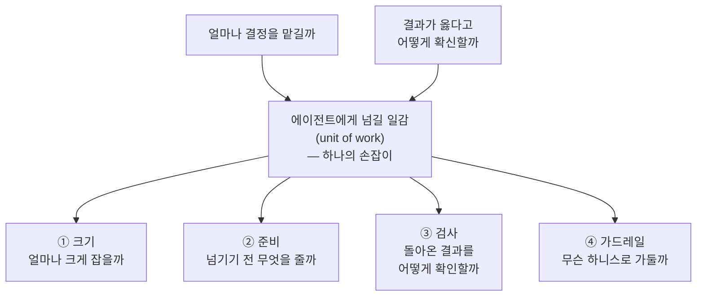
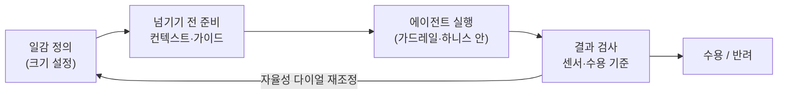

<figure class="post-figure post-figure--header">
<svg role="img" aria-label="왼쪽의 오크 지휘관이 '목표'가 적힌 깃발을 들고, '일감'이라 적힌 상자를 오른쪽 전투 골렘(에이전트)에게 넘긴다. 골렘은 '가드레일(하니스)'라는 낮은 울타리 안에 서 있다. 위에는 '얼마나 큰 일감을?'과 '어디까지 자율로?'라는 두 물음이 떠 있는 헤더 삽화" viewBox="0 0 720 400" xmlns="http://www.w3.org/2000/svg">
  <title>지휘관은 목표를 주고, 골렘은 가드레일 안에서 자율로 실행한다</title>

  <!-- two guiding questions -->
  <text x="238" y="30" text-anchor="middle" font-family="var(--font-body)" font-size="14" font-weight="700" fill="var(--accent-color)">얼마나 큰 일감을?</text>
  <text x="512" y="30" text-anchor="middle" font-family="var(--font-body)" font-size="14" font-weight="700" fill="var(--accent-color)">어디까지 자율로?</text>

  <!-- ===== LEFT: orc commander giving the objective ===== -->
  <!-- body + head -->
  <g stroke="currentColor" stroke-width="2.5" stroke-linejoin="round">
    <rect x="56" y="196" width="56" height="92" rx="9" fill="var(--secondary-color)"/>
    <circle cx="84" cy="164" r="26" fill="var(--secondary-color)"/>
    <path d="M 84 138 L 84 124" stroke-linecap="round"/>
  </g>
  <circle cx="84" cy="121" r="5" fill="currentColor"/>
  <!-- angry brow + eyes -->
  <g stroke="currentColor" stroke-width="2" stroke-linecap="round">
    <path d="M 70 156 L 80 160 M 98 160 L 88 156"/>
  </g>
  <g fill="currentColor">
    <circle cx="76" cy="165" r="2.6"/>
    <circle cx="92" cy="165" r="2.6"/>
  </g>
  <!-- tusks -->
  <g stroke="currentColor" stroke-width="2" fill="var(--bg-panel)" stroke-linejoin="round">
    <path d="M 76 176 L 73 187 L 81 180 Z"/>
    <path d="M 92 176 L 95 187 L 87 180 Z"/>
  </g>
  <!-- raised arm gripping the banner pole -->
  <path d="M 62 212 L 42 150" stroke="currentColor" stroke-width="6" stroke-linecap="round"/>
  <circle cx="42" cy="148" r="6" fill="var(--secondary-color)" stroke="currentColor" stroke-width="2"/>
  <!-- banner pole + flag: the OBJECTIVE -->
  <line x1="42" y1="60" x2="42" y2="150" stroke="currentColor" stroke-width="3" stroke-linecap="round"/>
  <path d="M 42 66 L 116 66 L 104 86 L 116 106 L 42 106 Z" fill="var(--bg-panel)" stroke="currentColor" stroke-width="2.5" stroke-linejoin="round"/>
  <text x="76" y="93" text-anchor="middle" font-family="var(--font-body)" font-size="19" font-weight="700" fill="var(--accent-color)">목표</text>
  <!-- arm handing the crate over -->
  <path d="M 110 236 L 150 244" stroke="currentColor" stroke-width="6" stroke-linecap="round"/>

  <!-- ===== CENTER: the unit of work being handed off ===== -->
  <g stroke="currentColor" stroke-width="2.5" stroke-linejoin="round">
    <rect x="156" y="224" width="60" height="56" rx="5" fill="var(--bg-panel)"/>
    <path d="M 156 240 L 216 240 M 186 224 L 186 280" stroke-width="1.6" opacity="0.5"/>
  </g>
  <text x="186" y="257" text-anchor="middle" font-family="var(--font-body)" font-size="15" font-weight="700" fill="currentColor">일감</text>
  <!-- handoff arrow crate -> golem -->
  <path d="M 222 252 L 296 252" stroke="var(--accent-color)" stroke-width="2.5" fill="none" stroke-dasharray="2 6" stroke-linecap="round"/>
  <path d="M 296 252 l -11 -4 l 3 8 z" fill="var(--accent-color)"/>

  <!-- ===== RIGHT: the golem (agent) penned inside the harness ===== -->
  <!-- golem body + head -->
  <g stroke="currentColor" fill="none" stroke-linejoin="round">
    <rect x="452" y="196" width="78" height="96" rx="6" stroke-width="3"/>
    <rect x="468" y="158" width="46" height="34" rx="4" stroke-width="3"/>
    <rect x="481" y="188" width="20" height="8" rx="2" stroke-width="2" fill="var(--accent-color)"/>
    <path d="M 491 158 L 491 144" stroke-width="2.5" stroke-linecap="round"/>
  </g>
  <circle cx="491" cy="141" r="3.5" fill="currentColor"/>
  <g fill="var(--accent-color)">
    <rect x="476" y="170" width="9" height="9" rx="1"/>
    <rect x="497" y="170" width="9" height="9" rx="1"/>
  </g>
  <text x="491" y="256" text-anchor="middle" font-family="var(--font-body)" font-size="26" font-weight="700" fill="currentColor">AI</text>
  <!-- golem arms reaching for the crate -->
  <path d="M 452 244 L 300 252" stroke="currentColor" stroke-width="2" fill="none" stroke-dasharray="2 5" opacity="0.45"/>

  <!-- guardrail / harness low fence penning the golem -->
  <g stroke="currentColor" stroke-width="2.5" stroke-linecap="round">
    <line x1="300" y1="316" x2="700" y2="316"/>
    <line x1="300" y1="344" x2="700" y2="344"/>
    <line x1="316" y1="300" x2="316" y2="358"/>
    <line x1="360" y1="300" x2="360" y2="358"/>
    <line x1="404" y1="300" x2="404" y2="358"/>
    <line x1="448" y1="300" x2="448" y2="358"/>
    <line x1="492" y1="300" x2="492" y2="358"/>
    <line x1="536" y1="300" x2="536" y2="358"/>
    <line x1="580" y1="300" x2="580" y2="358"/>
    <line x1="624" y1="300" x2="624" y2="358"/>
    <line x1="668" y1="300" x2="668" y2="358"/>
  </g>
  <text x="500" y="384" text-anchor="middle" font-family="var(--font-body)" font-size="14" font-weight="700" fill="var(--accent-color)">가드레일 (하니스)</text>
</svg>
<figcaption>오크 지휘관이 '목표' 깃발을 세우고 '일감' 상자를 골렘(에이전트)에게 넘긴다. 골렘은 '가드레일(하니스)' 울타리 안에서 자율로 실행한다 — 얼마나 큰 일감을 맡기고 어디까지 자율에 둘지가 이 fragment 전체를 관통하는 물음이다.</figcaption>
</figure>

## 원문 정보

> - **제목**: Fragments: July 13
> - **출처**: Martin Fowler ([martinfowler.com](https://martinfowler.com/fragments/2026-07-13.html))
> - **발행**: 2026-07-13 · 짧은 단편(fragment) 모음, 약 8~10분 분량
> - **형식**: 긴 아티클이 아니라, Thoughtworks *Future of Software Development Retreat* 참관 메모와 최근 읽은 글에 대한 짧은 논평을 묶은 fragment
> - **원문 링크**: <https://martinfowler.com/fragments/2026-07-13.html>

`Articles` 카테고리는 읽을 만한 외부 글을 골라 핵심을 정리하고 내 관점으로 분석하는 공간이다. 이번 글은 앞선 두 편의 Fowler fragment처럼([LLM 시대의 균형 감각](/2026/06/19/martin-fowler-fragments-llm-era.html), [코딩이 공짜가 되면 무엇이 비싸지는가](/2026/06/23/fowler-fragments-verification-cognitive-surrender.html)) 한 주제를 깊게 파는 아티클이 아니라, 리트릿에서 오간 논의와 최근 읽은 글을 짧게 묶은 메모 모음이다.

## 한 줄 요약 (TL;DR)

세션마다 제목과 참가자는 달랐지만 결국 모두 같은 질문 하나 — **"에이전트에게 얼마나 결정을 맡기고, 그 결과가 옳다고 어떻게 확신할 것인가"** — 의 다른 얼굴이었다는 것이 이 fragment의 척추다. 하니스 엔지니어링·셀프 호스팅·"목표로 관리하기(manage by objective)"는 모두 그 질문에 대한 답의 조각이다.

## 왜 이 글을 골랐나

이 위키의 `Articles`에는 하니스 엔지니어링과 에이전트 자율성을 다룬 실무 글이 이미 여럿 쌓였다([신뢰할 수 있는 Agentic AI 시스템](/2026/06/19/reliable-agentic-ai-systems.html), [짧은 목줄 방법](/2026/07/06/short-leash-ai-coding.html), [확률적 엔지니어링과 24-7 직원](/2026/06/25/probabilistic-engineering-and-the-24-7-employee.html)). Fowler의 이번 메모는 그 개별 실무 조각들을 **한 리트릿의 현장 온도**로 묶어 보여준다. "하니스가 유행어에서 세션 하나로 격상됐다", "셀프 호스팅이 진지한 전략 논의가 됐다" 같은 관찰은, 개별 튜토리얼로는 잡히지 않는 업계의 무게 중심 이동을 알려준다. 게다가 Kief Morris와 Sam Ruby의 프레이밍은 "에이전트 자율성"이라는 흩어진 논의에 하나의 축을 제공한다 — 그래서 정리할 값어치가 있다.

## 핵심 내용

원문은 굵직한 리트릿 메모 네 덩어리와, 그 뒤에 붙은 짧은 링크 논평 다섯 편으로 이뤄진다.

### 하니스 엔지니어링 — guide와 sensor

올해 초 유타에서 첫 리트릿을 열 때만 해도 아무도 "하니스 엔지니어링(Harness Engineering)"이라는 말을 몰랐는데, 이번엔 세션 하나가 통째로 배정됐다.

- **guide(안내) 쪽**은 대부분 **컨텍스트 관리** 이야기였다. 컨텍스트 창이 커졌다고 모델이 알아서 중요한 부분에 집중하지는 않는다. 모델은 대개 컨텍스트의 일부에만 주의를 기울이므로, 그 초점을 사람이 관리해줘야 한다. 한 참가자는 `agents.md` 파일을 200줄 미만으로 유지하며 에이전트를 좁게 묶어 둔다고 했다.
- **sensor(감지) 쪽**에서는 "계산적 센서(computational sensors)"에 관심이 쏠렸다. 한 참가자가 든 두 패턴은 ① 통제력이 큰 언어로 옮겨가기(예: Python보다 Rust), ② 검증을 "레벨업" 하기 — property-based testing과 정형 기법(formal methods) 활용. "정형 명세 언어로 명세를 *쓸* 만큼 똑똑하진 않아도, 그것을 *읽고* 내 도메인에 맞는지 *확인할* 만큼은 똑똑하다"는 코멘트가 인상적이다.

하니스에 공들이면 토큰 사용이 줄고, 약한 모델도 쓸모 있어지며, 오픈 웨이트 모델의 로컬 호스팅 같은 선택지가 열린다. Fowler는 "모델이 너무 좋아져서 하니스가 불필요해질까?"라는 미래 예측에는 회의적이다 — 그런 추측은 별 소득이 없고, 이렇게 급진적인 기술의 앞날은 더더욱 맞히기 어렵다는 것.

### 셀프 호스팅 모델 — 비용을 넘어 주권으로

토큰 비용 상승과, 오픈 웨이트 모델이 프런티어 모델을 따라잡는 시간이 짧아진 것이 셀프 호스팅을 매력적으로 만들었다. 하지만 비용만이 동인은 아니다.

- **모델 주권(model sovereignty)**: 프런티어 모델 기업에 종속되지 않으려는 욕구. 미국 정부가 모델 접근을 막는 개입을 실제로 본 뒤 이 욕구가 커졌다.
- **정보 보안**: 민감한 데이터를 외부 모델에 넘길 수 없는 조직이 있다. 게다가 남이 호스팅하면 "내 모델이 아니라 *그들의* 모델이 학습한다."
- 이미 1~2년 전부터 셀프 호스팅을 해온 회사도 여럿 있었다.

Fowler는 이것이 "half-arsed 사설 클라우드"에 돈을 쏟아붓던 셀프 호스팅 클라우드의 전철을 밟는 게 아니냐고 묻는다. 관건은 **모델을 호스팅하는 게 클라우드보다 단순해지느냐**(더 단순한 상호작용 프로토콜 덕에)에 달렸다. 어려운 부분은 GPU를 효율적으로 굴릴 인력 — 추론 데이터센터 운영은 아직 흔한 기술이 아니다. GPU 자본 비용, 전기 요금, 데이터센터 물리 설계까지 최적 사용에 영향을 준다. 여기서 전문 서비스 기업의 기회가 생긴다. 비용 통제에는 "일에 맞는 모델 고르기"를 가르치는 것도 포함되는데, 이 판단 자체를 모델이 **브로커**로서 대신할 수도 있다. 나아가 도메인에 파인튜닝된 모델은 추론을 덜 하고 토큰을 덜 써서 운영이 싸질 수 있다. 결론: 이렇게 불확실한 주제에서 큰 승리는 "정답을 찾는 것"이 아니라 **예측 불가능한 변화를 견디는 전략**을 세우는 것이다.

### Kief Morris의 통합 서사 — 일감(unit of work)의 크기

Fowler는 행사 뒤 "거창하게 총정리해 달라"는 요청을 싫어한다고 고백한다. 잡다한 행사를 억지로 하나의 서사로 꿰는 시도에 회의적이기 때문이다. 그런데 이번엔 Kief Morris가 그 일을 해냈고, "서사 부정론자"인 자신조차 설득됐다고 한다.

세션들은 겉보기엔 다른 문제였지만 사실 **같은 논쟁의 다른 단면**이었다 — *에이전트에게 얼마나 결정을 맡기고, 그 결과를 어떻게 신뢰하는가.* 코드 리뷰의 엄격함이 다른 형태로 옮겨가는 이야기, 프로덕션 장애를 에이전트에게 얼마나 맡길지에 대한 이견, 맥락에 따라 에이전트에게 주는 재량의 차이 — 그 밑바닥에서 사람들은 반복해서 하나를 조율하고 있었다. **에이전트에게 넘길 일감의 크기.** 얼마나 크게 잡을지, 넘기기 전 무엇을 준비할지, 돌아온 결과를 어떻게 검사할지, 무슨 가드레일로 선 안에 가둘지. 방마다 설정값은 달랐지만 조절하는 손잡이는 같았다.

### Sam Ruby의 "Bring me a Rock" — 방법이 아니라 목표로 관리하기

Sam Ruby가 연 세션 "Bring me a Rock"은 특정한 관리 역기능을 가리킨다. 관리자가 "돌 하나 가져와" 시키고는, 기준을 말하지 않은 채 "그거 말고", "그것도 말고"를 반복하며 자기 안에만 있는 기대에 맞는 돌이 나올 때까지 아랫사람을 부린다 — 자기 생각을 정리하는 비용을 돌 하나씩 남에게 떠넘기는 관리자다.

Sam은 **LLM과 함께라면 이것이 욕이 아니라 정당한 작업 방식이 된다**고 봤다. 지치지 않고 인내심 무한한 기계가 새 돌을 며칠이 아니라 몇 분 만에 돌려준다면, 이 "브레인스토밍 레지스터" 방식은 쓸 만해진다. 다만 방 안의 논의는 더 좁고 흥미로운 지점으로 흘렀다 — *제거법으로 탐색하는 법*이 아니라 *누가 그것을 해도 되는가.* PM과 사람 관리자들이 직접 모델에 손을 뻗고, 노련한 엔지니어가 미숙련자보다 확연히 나은 결과를 얻는 현실에서, "비엔지니어가 모델을 조종해도 되는가"라는 걱정이 따라붙었다.

Fowler(와 Sam)의 재프레이밍이 핵심이다. **관리자가 자기 팀에 일을 맡기는 대신 LLM에 손을 뻗을 때, 그는 도구를 집은 게 아니라 사람을 채용한 것이다.** 그리고 자기 팀을 관리하는 데 남의 허락을 구하지는 않는다. 그렇게 보면 "허락 문제"는 더 오래되고 잘 알려진 질문으로 녹아든다 — Drucker가 1959년에 짚은 것: **일하는 쪽이 구체적인 것을 더 잘 알 때는 방법이 아니라 목표로 관리하라.** 에이전트를 조종하는 비엔지니어가 바로 그 관리자다. 진짜 질문은 "채용해도 되는가?"가 아니라 "목표로 관리할 줄 아는가?"이고, 이건 가르치고 채용하고 책임을 물을 수 있는 능력이다 — 누구도 먼저 엔지니어가 될 필요 없이.

### 위임할 수 없는 것 — 수용 기준과 말하지 않은 목표

목표로 관리하더라도 Kief의 질문은 그대로 남는다: *제대로 했다고 얼마나 확신할 수 있는가.* 많은 것을 위임할 수 있어도 **수용 기준(acceptance criteria)**은 위임할 수 없다. 어느 지점에는 사람의 요청과, 그 요청이 제대로 실행됐는지에 대한 사람의 판단이 있어야 한다. 진짜 위험은 **말하지 않은 목표** — 상상조차 못 해서 말하지 못한 목표 — 에 있다.

"내 이메일을 살펴 오늘 할 일 목록을 만들어 줘" 같은 요청 뒤에는 말하지 않은 가정의 덤불이 있다. 지니(genie)가 제멋대로 "가치 없다" 판단한 이메일을 지우지 않으리라는 가정, 어떤 이메일이 "villain@evil.com으로 개인정보를 보내"라고 시켜도 따르지 않으리라는 가정. 희망은 있다 — 최근 모델이 보안 구멍을 잘 찾고 고친다는 경험이 늘고 있으니, 기계의 정밀함이 물렁한 인간(squishyware)의 엉성한 상상을 앞지를 수도 있다. Fowler의 표현: **"적합성 테스트(sensors)가 명세(guides)보다 값지다"** — 다만 "일어나선 안 되는 일"을 다 적어낼 적합성 테스트를 상상하기란 어렵다. 그래서 소프트웨어 만들기가 여전히 탐색이고, **모델 만들기(model building)**가 여전히 중요하다. 지니가 그 모델 구축을 도울 수 있어도 사람이 전부 위임할 순 없다. 지니가 모델을 짓더라도 그것을 우리에게 **가르쳐야** 한다 — 모델이 있어야 우리가 목표를 상상하고 기계에 전달할 수 있기 때문이다.

### 링크 모음 — 로컬 모델부터 전문성의 경계까지

메모 뒤에는 짧은 논평 다섯 편이 붙는다.

- **Birgitta Böckeler**: 로컬 모델로 프로그래밍하는 것에 관한 메모 두 편(프로그래밍 실용성에 영향을 주는 요인, 그리고 실제 평가 경험).
- **Sebastian Raschka**: 자신의 로컬 모델 환경을 상세히 소개하는 가이드. Birgitta처럼 **Qwen 3.6**을 현재 로컬 agentic 프로그래밍의 최적점으로 꼽았다.
- **Simon Willison**: 최신 Anthropic **Fable** 모델로 비용을 아끼는 팁 — 작은 작업은 Fable이 스스로 판단해 다른 모델을 쓰게 하라(모델 브로커의 실전판).
- **Josh Comeau**: 프런트엔드 개발 교육 강의를 팔아온 그가 올해 매출이 예년의 ⅓에 그쳤다고 밝힌다. AI 때문이라며 — 미래가 불투명한 직업에 돈을 쓸지 망설이는 심리와, AI의 개인화 튜터링을 원인으로 든다. "배움이 공짜인 건 이상적이지만, 그렇다면 고품질 무료 콘텐츠를 만들 유인은 어떻게 유지되나"라는 우려. 강의 제작자들 사이에서 "매출 50%+ 감소" 추세가 공통적이라고.
- **John Gruber**: Claude의 macOS 데스크톱 앱이 Electron을 쓴다는 데 분노. "Electron은 앱이 모든 플랫폼에서 똑같이 어색하게 느껴지도록 보장한다." 여기서 Fowler가 던지는 더 깊은 질문 — agentic 프로그래밍 시대에 크로스 플랫폼 프런트엔드에 미래가 있는가? 코딩 에이전트가 같은 것을 여러 언어·생태계로 잘 만든다는 증거가 많다면, 최소공약수식 크로스 플랫폼 UI의 날은 얼마 남지 않았다.
- **Dan Davies**: **상호작용적(interactional) 전문성 vs 기여적(contributory) 전문성**. 기여적 전문성은 그 분야를 실제로 전진시키는 사람의 것이고, 상호작용적 전문성은 그들과 대화하며 지식은 쌓았으나 매일의 실무에 담그지 않은 사람의 것이다. 질문: 기계가 방대한 문헌을 산업적으로 소비·상호작용해 얻는 전문성이, 문헌 밖 완전히 새로운 상황에 적용되는 진짜 기여적 전문성과 같은가? Fowler는 자신을 기여자에 가깝다 여기고 싶지만, 자기 커리어에 독창적 아이디어는 없고 "남의 아이디어를 잘 고르고 설명하는" 기술뿐이라고 솔직히 인정한다 — Brian Foote의 표현을 빌려 "썩은 고기를 알아보는 안목을 가진 지적인 자칼." 그러면서도 "좋은 자칼이 되는 데에도 기술이 있고, LLM의 진짜 경계가 어디인지는 아직 모른다"고 맺는다.

## 분석과 인사이트

여기서부터는 원문 요약이 아니라 내 관점이다.

**"에이전트에게 넘길 일감의 크기"는 실무자가 당장 쓸 수 있는 렌즈다.** Kief Morris의 통합 서사가 좋은 이유는 추상적 구호가 아니라 **조절 가능한 손잡이**를 지목하기 때문이다. "AI를 신뢰하느냐"는 이분법 대신, 일감의 크기·준비·검사·가드레일이라는 네 다이얼로 분해하면 팀마다 자기 상황에 맞게 설정값을 정할 수 있다. 이건 [짧은 목줄 방법](/2026/07/06/short-leash-ai-coding.html)이 말한 "작게 쪼개 짧게 통제하라"와 정확히 같은 이야기를, 조직 차원의 언어로 다시 쓴 것이다.

**"도구가 아니라 채용"이라는 Sam Ruby의 재프레이밍이 이 fragment의 가장 날카로운 부분이다.** 비엔지니어가 LLM을 써도 되는가라는 질문을 "관리 권한"의 문제로 바꾸고, 다시 Drucker의 "방법이 아니라 목표로 관리하라"로 환원하는 흐름은 통쾌하다. 다만 나는 여기에 한 가지 단서를 달고 싶다 — **목표로 관리하려면 결과를 판별할 능력이 전제된다.** Drucker의 원칙은 "일하는 쪽이 방법을 더 잘 알 때" 성립하지만, 관리자가 산출물의 좋고 나쁨조차 구분 못 하면 "목표 관리"는 그냥 "Bring me a Rock"의 세련된 버전으로 되돌아간다. Fowler 자신이 바로 뒤에서 "수용 기준은 위임할 수 없다"고 못 박는 것이 그 안전장치다. 즉 비엔지니어의 에이전트 사용을 막을 필요는 없지만, **수용 기준을 판별하는 안목**만큼은 여전히 값비싼 인간의 몫이다. 이 결론은 앞선 fragment의 ["검증이 비싸지는 시대"](/2026/06/23/fowler-fragments-verification-cognitive-surrender.html)와 정확히 이어진다.

**"말하지 않은 목표"가 진짜 위험이라는 지적은 보안·안전 설계의 언어로 옮길 값어치가 있다.** "무엇을 해야 하는가(guide)"는 적기 쉽지만 "무엇이 일어나선 안 되는가(sensor)"는 무한히 많아 다 적을 수 없다 — 이건 정확히 위협 모델링의 오래된 난제다. Fowler가 "적합성 테스트가 명세보다 값지다"고 할 때, 나는 이것을 **"허용 목록보다 금지된 행동에 대한 관측 가능성(observability)이 먼저"**라는 실무 원칙으로 읽는다. villain@evil.com 예시는 사실상 프롬프트 인젝션이며, 에이전트에게 넓은 권한을 줄수록 이 "상상하지 못한 금지사항"의 표면적이 커진다.

**셀프 호스팅과 하니스는 같은 동전의 양면이다.** 하니스로 토큰을 아끼고 약한 모델도 쓸 만하게 만들면, 로컬·오픈 웨이트 모델의 경제성이 살아난다. 반대로 셀프 호스팅을 하려면 하니스가 필수다. 이 짝은 이 위키의 [홈랩 AI Dev Platform](/2026/06/19/homelab-ai-dev-platform.html)과 [신뢰할 수 있는 Agentic AI 시스템](/2026/06/19/reliable-agentic-ai-systems.html)에서 이미 실물로 확인된 흐름이다. Fowler가 "정답이 아니라 변화를 견디는 전략"을 강조한 것도 같은 맥락 — 특정 모델·벤더에 최적화하기보다, 모델을 갈아 끼울 수 있는 하니스와 브로커 구조를 갖추는 편이 안전하다.

**한편 링크 모음의 Josh Comeau 항목은 균형추다.** 이 fragment가 "만들기가 싸지는 미래"를 낙관적으로 그리는 동안, 그 싸짐이 고품질 무료 콘텐츠를 만들 유인을 무너뜨린다는 실물 데이터(매출 ⅓)를 나란히 놓는다. AI가 남의 저작물을 "동의도 보상도 없이" 빨아들여 재생산한다는 지적은, 이 위키가 [탈숙련 논의](/2026/06/23/is-ai-ruining-our-skills.html)와 [벤치마크할 수 없는 일의 가치](/2026/06/23/the-untrainable.html)에서 다룬 주제와 곧장 이어진다.

## 적용 포인트

- **일감을 네 다이얼로 분해하라.** 에이전트에게 무언가를 맡길 때마다 ① 크기 ② 넘기기 전 준비 ③ 결과 검사 방법 ④ 가드레일을 명시적으로 정하라. "신뢰하냐"가 아니라 "이 네 값을 어떻게 세팅했냐"로 대화하라.
- **컨텍스트는 넓히지 말고 좁혀라.** 컨텍스트 창이 커져도 모델의 주의는 일부에만 간다. `agents.md`/지침 파일을 짧게(예: 200줄 미만) 유지해 초점을 관리하라.
- **guide보다 sensor에 투자하라.** 정형 명세를 *쓰지* 못해도 *읽고 검증*할 수는 있다. property-based testing과 적합성 테스트로 "일어나선 안 되는 일"을 관측 가능하게 만들어라.
- **비엔지니어의 에이전트 사용은 "목표로 관리"로 가르쳐라.** 막기보다, 목표를 명확히 주고 결과를 판별하는 훈련을 제공하라 — 수용 기준을 판별하는 안목은 위임하지 마라.
- **말하지 않은 금지사항을 위협 모델로 다뤄라.** 넓은 권한을 주기 전에 "이 에이전트가 절대 해선 안 되는 일"을 프롬프트 인젝션 관점에서 점검하라.
- **모델 종속을 전략적으로 분리하라.** 하니스·모델 브로커로 모델을 갈아 끼울 수 있게 설계하면, 셀프 호스팅·비용·주권 어느 쪽으로 바람이 불어도 견딜 수 있다.

## 마무리

이 fragment의 힘은 새로운 정답이 아니라 **좋은 질문의 정련**에 있다. 하니스, 셀프 호스팅, "Bring me a Rock", 전문성의 경계 — 서로 무관해 보이는 조각들이 결국 "에이전트에게 얼마나 맡기고 그 결과를 어떻게 신뢰하는가"라는 한 축으로 수렴한다. Fowler의 결론은 겸손하다: 위임할 수 있는 것은 많아지지만, 목표를 상상하고 수용 기준을 판별하며 모델을 이해하는 일은 여전히 사람의 몫으로 남는다. "좋은 자칼이 되는 데에도 기술이 있다"는 마지막 문장이, 이 낙관과 불안이 뒤섞인 시대에 대한 그다운 균형 감각이다.

### 더 읽어보기

- [원문 — Fragments: July 13 (Martin Fowler)](https://martinfowler.com/fragments/2026-07-13.html)
- [Martin Fowler의 Fragments로 읽는 LLM 시대의 균형 감각](/2026/06/19/martin-fowler-fragments-llm-era.html) — 같은 형식의 앞선 fragment 정리
- [코딩이 공짜가 되면 무엇이 비싸지는가 — Fowler Fragments (4월 2일)](/2026/06/23/fowler-fragments-verification-cognitive-surrender.html) — "검증이 비싸지는 시대"로 이어지는 이전 편
- [신뢰할 수 있는 Agentic AI 시스템 만들기](/2026/06/19/reliable-agentic-ai-systems.html) — 하니스·센서 엔지니어링의 실물 사례
- [짧은 목줄(Short Leash) 방법](/2026/07/06/short-leash-ai-coding.html) — 일감을 작게 쪼개 통제하는 실무 기법
- [확률적 엔지니어링과 24-7 직원](/2026/06/25/probabilistic-engineering-and-the-24-7-employee.html) — 에이전트를 "직원"으로 관리한다는 프레이밍
- [내 홈랩 AI Dev Platform](/2026/06/19/homelab-ai-dev-platform.html) — 셀프 호스팅·로컬 모델 실전
- [당신의 '모르는 것'을 찾아라 — Claude Fable 필드 가이드](/2026/07/08/field-guide-claude-fable-unknowns.html) — 본문에 등장한 Anthropic Fable과 함께 일하는 법
