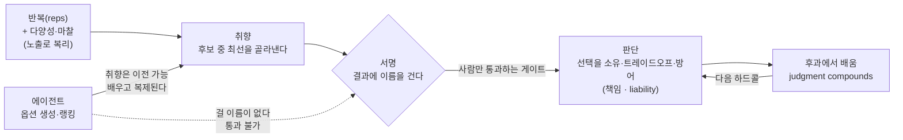

<figure class="post-figure post-figure--header">
<svg role="img" aria-label="가운데 저울이 취향과 판단을 양쪽 접시에 올려 견준다. 왼쪽은 '취향' — 여러 후보 카드가 깔때기 필터로 걸러져 최선 하나가 접시에 담기고, 그 옆 에이전트 로봇은 이름표가 빈칸이다. 오른쪽은 '판단' — 결과지에 사람의 손이 펜으로 이름을 서명하며, 그 서명이 접시에 놓인다. 취향은 에이전트가 함께 올라오지만 서명하는 손만은 사람의 것이라는 대비." viewBox="0 0 680 340" xmlns="http://www.w3.org/2000/svg">
  <title>취향 vs 판단 — 취향은 후보를 거르는 필터(에이전트도 배운다), 판단은 결과에 이름을 거는 서명(사람만)</title>
  <defs>
    <marker id="tj-head" markerWidth="9" markerHeight="9" refX="7" refY="3" orient="auto">
      <path d="M0 0 L7 3 L0 6 z" fill="currentColor"/>
    </marker>
    <marker id="tj-head-crim" markerWidth="9" markerHeight="9" refX="7" refY="3" orient="auto">
      <path d="M0 0 L7 3 L0 6 z" fill="var(--accent-color)"/>
    </marker>
  </defs>

  <!-- ===== SCALE FRAME: beam + fulcrum ===== -->
  <line x1="150" y1="150" x2="530" y2="150" stroke="currentColor" stroke-width="3"/>
  <circle cx="340" cy="150" r="5" fill="currentColor"/>
  <polygon points="340,150 322,200 358,200" fill="var(--bg-light)" stroke="currentColor" stroke-width="1.6"/>
  <rect x="300" y="300" width="80" height="8" rx="2" fill="var(--bg-light)" stroke="currentColor" stroke-width="1.6"/>
  <line x1="340" y1="200" x2="340" y2="300" stroke="currentColor" stroke-width="2.4"/>
  <!-- gate note at fulcrum -->
  <text x="340" y="228" text-anchor="middle" font-size="9.5" fill="var(--accent-color)" font-weight="700">서명란 = 사람만</text>
  <text x="340" y="242" text-anchor="middle" font-size="8.5" fill="currentColor" opacity="0.6">취향은 넘어가도 판단은 남는다</text>

  <!-- ===== LEFT SIDE: 취향 (filter) ===== -->
  <text x="230" y="30" text-anchor="middle" font-size="13" fill="currentColor" font-weight="700">취향 · TASTE</text>
  <text x="230" y="44" text-anchor="middle" font-size="9" fill="currentColor" opacity="0.65">후보를 거르는 필터</text>
  <!-- candidate cards feeding in -->
  <rect x="192" y="54" width="20" height="26" rx="2" fill="var(--bg-light)" stroke="currentColor" stroke-width="1.2"/>
  <rect x="220" y="54" width="20" height="26" rx="2" fill="var(--bg-light)" stroke="currentColor" stroke-width="1.2"/>
  <rect x="248" y="54" width="20" height="26" rx="2" fill="var(--bg-light)" stroke="currentColor" stroke-width="1.2"/>
  <!-- funnel / filter -->
  <polygon points="188,88 272,88 240,120 220,120" fill="var(--bg-panel)" stroke="currentColor" stroke-width="1.8"/>
  <text x="230" y="104" text-anchor="middle" font-size="8.5" fill="currentColor" opacity="0.6">필터</text>
  <line x1="230" y1="120" x2="230" y2="150" stroke="currentColor" stroke-width="1.8" marker-end="url(#tj-head)"/>
  <!-- left drop + pan -->
  <line x1="230" y1="150" x2="230" y2="214" stroke="currentColor" stroke-width="1.4"/>
  <path d="M180 214 Q230 250 280 214" fill="var(--bg-light)" stroke="currentColor" stroke-width="1.8"/>
  <!-- best pick card on left pan (crimson) -->
  <rect x="216" y="196" width="28" height="20" rx="2" fill="var(--bg-panel)" stroke="var(--accent-color)" stroke-width="2"/>
  <text x="230" y="210" text-anchor="middle" font-size="8.5" fill="var(--accent-color)" font-weight="700">최선</text>
  <!-- agent robot with blank name tag -->
  <g stroke="var(--steel)" fill="var(--bg-light)">
    <line x1="120" y1="72" x2="120" y2="64" stroke-width="1.4"/>
    <circle cx="120" cy="61" r="3" stroke-width="1.2"/>
    <rect x="104" y="72" width="32" height="26" rx="4" stroke-width="1.8"/>
  </g>
  <circle cx="113" cy="84" r="2.4" fill="var(--steel)"/>
  <circle cx="127" cy="84" r="2.4" fill="var(--steel)"/>
  <text x="120" y="112" text-anchor="middle" font-size="8.5" fill="currentColor" opacity="0.7" font-weight="700">에이전트</text>
  <text x="120" y="123" text-anchor="middle" font-size="8" fill="currentColor" opacity="0.55">후보를 랭킹</text>
  <!-- blank name tag -->
  <rect x="92" y="132" width="56" height="20" rx="3" fill="var(--bg-panel)" stroke="currentColor" stroke-width="1.4"/>
  <text x="103" y="145" font-size="8" fill="currentColor" opacity="0.7">이름</text>
  <line x1="119" y1="146" x2="142" y2="146" stroke="var(--accent-color)" stroke-width="1.4" stroke-dasharray="2 2"/>
  <!-- agent helps taste (dashed up to funnel) -->
  <path d="M140 96 Q170 96 186 100" fill="none" stroke="var(--steel)" stroke-width="1.2" stroke-dasharray="3 3"/>

  <!-- ===== RIGHT SIDE: 판단 (signature) ===== -->
  <text x="450" y="30" text-anchor="middle" font-size="13" fill="var(--secondary-color)" font-weight="700">판단 · JUDGMENT</text>
  <text x="450" y="44" text-anchor="middle" font-size="9" fill="currentColor" opacity="0.65">선택에 이름을 건다</text>
  <!-- result sheet -->
  <rect x="404" y="54" width="92" height="72" rx="4" fill="var(--bg-panel)" stroke="currentColor" stroke-width="1.8"/>
  <line x1="414" y1="68" x2="486" y2="68" stroke="currentColor" stroke-width="1.2" opacity="0.5"/>
  <line x1="414" y1="78" x2="486" y2="78" stroke="currentColor" stroke-width="1.2" opacity="0.5"/>
  <line x1="414" y1="88" x2="470" y2="88" stroke="currentColor" stroke-width="1.2" opacity="0.5"/>
  <text x="414" y="108" font-size="8" fill="currentColor" opacity="0.6">서명:</text>
  <!-- crimson signature squiggle -->
  <path d="M436 110 q6 -8 12 0 q6 8 12 0 q5 -6 12 2" fill="none" stroke="var(--accent-color)" stroke-width="2" stroke-linecap="round"/>
  <line x1="414" y1="118" x2="486" y2="118" stroke="currentColor" stroke-width="1" opacity="0.4"/>
  <!-- human hand + pen (green accent) -->
  <line x1="500" y1="86" x2="470" y2="112" stroke="var(--secondary-color)" stroke-width="3" stroke-linecap="round"/>
  <polygon points="466,116 470,112 476,118 472,122" fill="var(--secondary-color)"/>
  <text x="512" y="80" font-size="8" fill="var(--secondary-color)" font-weight="700">사람</text>
  <line x1="450" y1="126" x2="450" y2="150" stroke="var(--accent-color)" stroke-width="1.8" marker-end="url(#tj-head-crim)"/>
  <!-- right drop + pan -->
  <line x1="450" y1="150" x2="450" y2="214" stroke="currentColor" stroke-width="1.4"/>
  <path d="M400 214 Q450 250 500 214" fill="var(--bg-light)" stroke="currentColor" stroke-width="1.8"/>
  <!-- signed seal on right pan -->
  <circle cx="450" cy="206" r="12" fill="var(--bg-panel)" stroke="var(--accent-color)" stroke-width="2"/>
  <path d="M444 206 q6 -6 12 0" fill="none" stroke="var(--accent-color)" stroke-width="1.6"/>
  <text x="450" y="234" text-anchor="middle" font-size="8" fill="currentColor" opacity="0.6">서명 · 책임</text>
</svg>
<figcaption>취향은 여러 후보를 거르는 필터 — 에이전트도 함께 배우고 랭킹한다. 판단은 그 선택에 이름을 거는 서명 — 결과지에 손을 대는 건 사람뿐이고, 에이전트의 이름표는 빈칸이다.</figcaption>
</figure>

## 원문 정보

> - **제목**: Taste, Judgment and AI
> - **출처**: Addy Osmani (Google Chrome 엔지니어링 리더 · [x.com/addyosmani](https://x.com/addyosmani))
> - **발행**: 2026년 · 약 6분 분량
> - **원문 링크**: <https://x.com/addyosmani/status/2084354578196443351>

코드 생성이 사실상 공짜가 된 시대에 "그럼 사람은 무엇으로 값을 하는가"라는 질문이 반복해서 돌아온다. 이 글은 그 답을 **취향(taste)** 과 **판단(judgment)** 이라는 두 축으로 쪼개고, 둘 중 무엇이 AI에게 넘어가고 무엇이 끝까지 남는지를 선명하게 가른다. Articles의 AI-Essays에 담는 이유다.

## 한 줄 요약 (TL;DR)

**취향은 근거가 다 갖춰지지 않은 상태에서 품질을 알아보는 능력이고, 판단은 위험을 감수하며 그 선택에 이름을 거는 일이다.** 취향은 빌리고 복제하고 에이전트에게서 배울 수 있지만, 판단은 이전되지 않는다 — 판단은 능력(capability)이 아니라 **책임(liability)**, 즉 "결과에 내 이름을 붙이겠다"는 고집이기 때문이고, 에이전트에게는 아직 걸 이름이 없다.

이 글의 척추를 한 장으로 옮기면 이렇다. 취향까지는 에이전트가 함께 올라오지만, **'서명' 노드는 사람만 통과하는 게이트**다.

## 왜 이 글을 골랐나

AI가 옵션을 잘 만들고 잘 순위 매긴다는 건 이제 논쟁거리도 아니다. 진짜 질문은 **"에이전트가 취향까지 갖게 되면, 사람에게 남는 건 무엇인가"** 이다. Osmani의 대답이 좋은 이유는, 흔한 "인간은 창의성/공감이 있잖아" 같은 위안이 아니라 **구조적으로 이전 불가능한 것**을 짚기 때문이다. 판단은 잘해서 남는 게 아니라 **책임질 수 있어서** 남는다. 이 위키에서 여러 번 다룬 [취향(taste)이라는 내부 평가 함수](/2026/06/19/ai-engineer-taste.html), [측정할 수 없는 일에 가치가 남는다는 논증](/2026/06/23/the-untrainable.html), [인간의 몫을 'AI보다 잘함'으로 증명하지 말라](/2026/06/22/you-can-just-say-it.html)는 이야기들과 정확히 같은 골짜기를 다른 각도에서 비춘다.

## 핵심 내용

### 취향(taste): 근거 없이도 품질을 알아보는 능력

Osmani의 정의는 도발적이다. **"취향은 모든 증거가 없는 상태에서 품질과 위대함을 알아보는 것(recognizing quality and greatness in the absence of all the evidence)."** 웹페이지나 그림을 보고 "아름답다", "타협 없이 만들었다"고 느낄 때, 우리는 무언가를 측정한 게 아니다. 이유를 대지 못하는데도 확신하고, 그걸 보는 다른 사람들도 똑같이 확신한다. 누군가 **옳다고 증명할 수 없는 일련의 선택들**을 했고, 그 장인정신이 배어 나오는 것 — 그게 알아봐지는 것이다.

취향은 타고나는 게 아니라 **반복(reps)** 으로 쌓인다. 충분히 반복해서 열두 개의 선택지를 앞에 놓고 어느 게 최선인지 짚어낼 수 있을 때, 특히 "최선"이 모호할 때조차 짚어낼 수 있을 때 취향이 있다고 한다. 인류가 만든 최고의 것들에 자신을 노출시키고 그걸 자기 작업에 끌어오려 애쓴다면, 취향에 마음을 쓰게 된다.

### 취향은 필터다 — 그리고 다양성이 그 필터를 벼린다

Osmani는 취향을 **필터**에 비유한다. 역사의 대부분 동안 만드는 일은 비쌌기 때문에 걸러낼 후보 자체가 적었다. 대개 하나의 버전만 만들 수 있었고, 그 이상을 만들 수 있었다면 다행이었다. (AI가 옵션을 무한히 쏟아내는 지금과의 대비가 여기서 암시된다.)

중요한 건, **같은 것만 반복 소비하는 좁은 피드로는 취향을 얻을 수 없다**는 점이다. 질문하게 만들고 새로운 의견을 형성하게 하는 **다양성과 마찰(variety and friction)** 을 경험할 때 품질을 분간하는 능력이 날카로워진다. 본 적이 없으면 무엇을 놓치고 있는지도 모른다. 진짜 취향을 기르려면 **예상 밖의 것에 노출**되어야 한다.

### 판단(judgment): 선택에 이름을 걸고 책임지는 일

취향은 중요하지만 그다음 단계가 반드시 필요하다 — **판단**이다.

- **취향**은 여러 후보 중 **최선을 앞으로 내밀게** 해준다.
- **판단**은 그 선택을 **소유하고**, 필요한 트레이드오프를 받아들이고, 일이 잘못됐을 때 그 결정을 **설명하고 방어**하게 해준다.

판단이 진짜로 발동하는 순간은 **여러 나쁜 선택지 중에서 그나마 옳은 것을 골라야 할 때**, 그리고 나쁜 결정에서 그냥 걸어 나갈 수 없을 만큼 판돈이 클 때다. 판단은 "무엇을 출시할 것인가"에 대한 최선의 품질 판정을 내리고, **거기에 자기 이름을 서명하는 의지**다.

### 왜 취향은 넘어가고 판단은 안 넘어가는가

여기가 이 글의 핵심 논증이다.

- **취향은 이전 가능하다.** 빌리고, 복제하고, 남에게서 파생시키고, 에이전트에게서 배우고, 어시스턴트에게서 베낄 수 있다.
- **판단은 이전 불가능하다.** 판단은 **결과에 자기 이름이 붙는다고 고집하는 것**이고, **에이전트에게는 아직 이름이 없기** 때문이다.

에이전트는 점점 커지고 똑똑해지지만 동시에 천장에 부딪힌다. 옵션을 잘 제공하고 잘 순위 매긴다. 그러나 **계산이 끝나고 선택이 내려져야 하는 순간, 우리는 여전히 인간에게 손을 뻗는다 — 아직도 책임질 수 있는(answerable) 유일한 존재이기 때문이다.** 에이전트는 옵션을 평가하는 능력을 계속 키울 수 있다. 그러니 **다음 프론티어는 인간이 판단에서 에이전트보다 더 잘하도록 역량을 키우는 것**이다.

그래서 흥미로운 질문은 "에이전트가 취향을 가질 수 있는가"가 아니다 — **그건 가능하다고 가정해야 한다.** 진짜 질문은 **"에이전트가 취향을 갖게 됐을 때 무엇이 남는가"** 이고, 답은 판단이다. 판단은 쉽게 복제되지 않는다. **능력이 아니라 책임(liability)** 이기 때문이다.

덧붙여, 판단은 보편 기술이 아니다. 모든 실수를 다 겪어본 사람은 없다. **스킬은 우리가 많은 실수를 보고 살아남은 영역에서 자란다.**

### 사례: Apple, 그리고 Maps라는 서명

Apple의 디자인 취향은 자주 예외적이라고 인용된다. MacBook, iPhone을 떠올려 보면 사용자에게 얼마나 매끄럽게 작동하고 느껴지는지에 크게 마음 쓴다는 게 분명하다. 그러나 **취향과 판단의 책임을 동시에 건드리는** 다른 사례가 있다 — **Maps**다.

2012년 Apple은 iOS에서 Google Maps를 걷어내고 자체 버전을 냈다. **취향은 있었다** — 확대해도 선명하게 유지되는 벡터 렌더링, 훌륭한 타이포그래피. 그러나 더 큰 문제들이 있었다. 다리가 강으로 녹아내리고, "Berlin"을 검색하면 남극으로 데려가고, 호주의 한 마을이 사막 한복판 70km 밖에 잘못 찍혔다.

Osmani가 주목하는 건 그다음이다. **Tim Cook이 iOS Maps 팀을 탓하는 대신, apple.com에 1인칭으로 사과문을 올려** 여러 해에 걸쳐 큰 조직 전반에서 내려진 결정들에 대한 책임을 스스로 졌다. 당시 보도에 따르면 그가 서명을 요청받은 유일한 사람은 아니었을 수도 있지만, 사실이든 아니든 **이름이 올라간 건 그였다.** 취향도 실패도 그때 다 명백했다. **값을 치른 건 그 서명이었다.**

### 이것이 당신의 일에 적용되는 방식

많은 사람은 그렇게 공개적으로 무언가에 서명하고 책임을 지려 하지 않을 것이다. 하지만 이 구조는 우리 일에도 그대로 적용된다.

- 테스트가 그리 좋지 않다는 걸 알면서 승인하는 **pull request.**
- 충분한 테스트도, 사용자와의 대화도 없이 서둘러 내보낸 **새 UI.**

이런 것들은 공개 사과문까지 가지는 않지만, 그것들이 가르치는 교훈은 당신이 짊어진다. **취향은 노출을 통해 복리로 쌓이고(taste compounds through exposure), 판단은 후과를 통해 복리로 쌓인다(judgment compounds through the consequences).**

### 닫는 조언

- **취향을 다듬고 싶다면**: "좋다 / 싫다" 같은 말을 넘어서 **왜 무언가가 성공하거나 실패하는지**를 물어라. 같은 것의 여러 버전을 연구하고 그 미묘한 차이를 음미할 수 있는지 보라.
- **판단을 기르고 싶다면**: **어려운 결정을 직접 내려라(make the hard calls).** 무슨 일이 일어날 거라 예상했는지 적어두고, 결과에 충분히 가까이 머물러 내가 맞았는지 — 더 중요하게는 **틀렸는지** — 를 배워라. 시간이 지나면 내면의 목소리를, 무엇이 고품질인지에 대한 자신의 진짜 믿음을 신뢰하라.

(원문은 말미에 "Pangram 4가 이 글을 100% 사람이 쓴 것으로 판정했다"고 덧붙인다 — AI 글쓰기 시대에 저자가 남긴 반쯤 농담 같은 서명이다.)

## 분석과 인사이트

**1) "취향 vs 판단"은 "능력 vs 책임"의 프레임으로 바꿔 읽어야 한다.** 이 글의 진짜 통찰은 취향의 정의가 아니라, **판단을 능력의 스펙트럼에서 떼어내 책임(liability)의 영역으로 옮긴 것**이다. 우리는 흔히 "AI가 인간을 대체하느냐"를 능력 경쟁으로 본다. 누가 더 잘하나. 하지만 Osmani는 판단을 성능 게임 밖으로 끌어낸다. 판단이 남는 이유는 **더 똑똑해서가 아니라 서명할 수 있어서**다. 이건 AI가 아무리 좋아져도 원리적으로 닫히지 않는 격차다. 책임은 성능이 아니라 **주체성(who is answerable)** 의 문제이기 때문이다.

**2) 이 위키의 다른 논증들과 정확히 맞물린다.** [The Untrainable](/2026/06/23/the-untrainable.html)는 "측정할 수 있는 일은 학습 가능하고 따라서 commodity가 된다"고 말했다. Osmani의 언어로 옮기면 **취향은 벤치마크 가능해지는 쪽**이고 — 그래서 넘어가고 — **판단은 벤치마크 자체가 성립하지 않는 쪽**이다. 서명은 채점할 수 있는 산출물이 아니라 관계(누가 후과를 지는가)이기 때문이다. [Pratik Bhavsar의 taste 글](/2026/06/19/ai-engineer-taste.html)이 "취향 = 내부 평가 함수의 품질"을 강조했다면, Osmani는 거기서 한 발 더 나가 **그 평가 함수마저 에이전트가 가질 수 있다고 인정한 뒤, 그럼에도 남는 것**을 지목한다.

**3) 개발자에게 가장 아픈 구절은 "reps"와 "consequences"다.** 취향이 반복으로, 판단이 후과로 복리 성장한다면, **에이전트에게 반복과 후과를 다 위임하는 순간 둘 다 자라지 않는다.** 이건 [에이전틱 코딩의 함정](/2026/07/03/agentic-coding-is-a-trap.html)과 [탈숙련(deskilling) 연구](/2026/06/23/is-ai-ruining-our-skills.html)가 데이터로 보여준 것과 같은 경고다. 코드 생성을 넘기는 건 취향의 reps를 넘기는 것이고, "돌아가니 머지"를 반복하는 건 판단의 consequences를 회피하는 것이다. 둘 다 근육이라 안 쓰면 위축된다.

**4) 이견 — "취향은 완전히 넘어간다"는 낙관은 조금 이르다.** Osmani는 논지를 강하게 세우려고 "에이전트가 취향을 갖는다고 가정하라"고 못 박는다. 실무적으로는 **모델이 흉내 내는 건 취향의 산출물(평균적으로 그럴듯한 선택)이지 취향의 원천(예상 밖의 다양성에 노출되어 새 기준을 세우는 능력)이 아니다.** 오히려 모델은 훈련 분포의 중앙값으로 수렴하는 경향이 있어, 이 글이 강조한 "다양성과 마찰"의 반대편에 서기 쉽다. 그래서 "취향도 지켜야 할 인간의 자산"이라는 여지는 생각보다 크다. 판단이 방어선이라면, 취향은 아직 완전히 함락되지 않은 고지다.

**5) 조직적 함의 — 책임은 위임되지 않지만 취향은 표준화된다.** Maps 사례의 진짜 교훈은 "CEO가 사과했다"가 아니라, **결정이 조직 전반·수년에 걸쳐 분산되어 있어도 서명은 단수(單數)로 수렴한다**는 것이다. AI 파이프라인이 옵션을 대량 생산하는 조직일수록, 최종 서명이 누구 이름인지를 명시적으로 설계해야 한다. 취향은 도구·프롬프트·스타일 가이드로 팀 전체에 복제·표준화할 수 있지만, **"이게 나간다"에 이름을 거는 자리**는 자동화하면 안 된다. 그건 버그가 아니라 기능이다.

## 적용 포인트

- **취향의 reps를 아웃소싱하지 마라.** 에이전트가 코드를 쓰더라도, 여러 후보를 나란히 놓고 "왜 이게 더 나은가"를 직접 언어화하는 훈련은 스스로 하라. "좋다/싫다"를 "왜 성공/실패하는가"로 바꾸는 습관.
- **다양성과 마찰을 일부러 섭취하라.** 같은 피드·같은 스택만 보면 취향은 평균값으로 수렴한다. 낯설고 불편한, 질문을 강제하는 결과물에 의도적으로 노출되라.
- **판단에는 항상 이름을 붙여라.** 승인하는 PR, 내보내는 UI에 "테스트가 약하다는 걸 알면서 머지한다"를 명시하고 그 결정을 소유하라. 서명 없는 결정을 만들지 마라.
- **예측을 적어두고 후과에 가까이 머물러라.** 하드콜을 내릴 때 "무슨 일이 일어날 것 같다"를 기록하고, 실제 결과와 대조해 **틀린 경우를 특히** 복기하라. 판단은 후과에서만 복리로 자란다.
- **파이프라인에서 '서명 노드'를 명시적으로 설계하라.** AI가 옵션을 대량 생산하는 워크플로일수록, 최종 책임자가 누구인지를 조직도가 아니라 **결정 단위마다** 분명히 하라.
- **취향은 표준화하고, 판단은 자동화하지 마라.** 스타일 가이드·프롬프트·리뷰 체크리스트로 취향은 팀에 복제하되, "무엇을 출시하는가"의 서명은 사람에게 남겨라.

## 마무리

Osmani의 글이 값진 이유는 위안이 아니라 **경계선**을 그어주기 때문이다. AI 시대 인간의 몫을 "창의성"이나 "공감" 같은 흐릿한 단어로 방어하는 대신, 그는 **책임질 수 있는 유일한 존재**라는, 원리적으로 이전 불가능한 지점에 말뚝을 박는다. 취향은 어쩌면 넘어갈 것이다 — 그래도 좋다. 진짜 질문은 그다음에 남는 것이고, 남는 것은 **선택에 이름을 걸고 후과를 짊어지는 일**이다. 그러니 지금 해야 할 두 가지는 분명하다. 취향의 reps를 계속 쌓고, 판단의 하드콜을 계속 내려서 그 후과로부터 배우는 것. 에이전트가 아무리 좋아져도, 서명란은 여전히 비어 있다.

### 더 읽어보기

- [원문 — Taste, Judgment and AI (Addy Osmani)](https://x.com/addyosmani/status/2084354578196443351)
- [코드가 공짜가 된 시대의 '취향(taste)' — 30x AI 엔지니어가 되는 법](/2026/06/19/ai-engineer-taste.html) — '취향 = 내부 평가 함수의 품질'을 다룬 자매 논의. 이 글은 그 평가 함수마저 에이전트가 가질 때 남는 것을 묻는다
- [The Untrainable — 측정할 수 없는 일에 가치가 남는다](/2026/06/23/the-untrainable.html) — '벤치마크 가능한 것은 commodity가 된다'는 논증. 취향/판단 구분과 정확히 겹친다
- [그냥 그렇게 말하면 된다 — 인간의 가치를 'AI보다 잘함'으로 증명하지 말라](/2026/06/22/you-can-just-say-it.html) — 인간의 몫을 성능 경쟁 밖에 두는 인접 관점
- [에이전틱 코딩은 함정이다](/2026/07/03/agentic-coding-is-a-trap.html) — reps와 스킬 위축의 문제의식을 코딩 실무로 옮겨 읽기
- [AI가 우리의 실력을 망치고 있는가 — 탈숙련(deskilling) 연구](/2026/06/23/is-ai-ruining-our-skills.html) — 취향/판단의 reps·consequences를 위임할 때 실제로 실력이 준다는 데이터 근거
