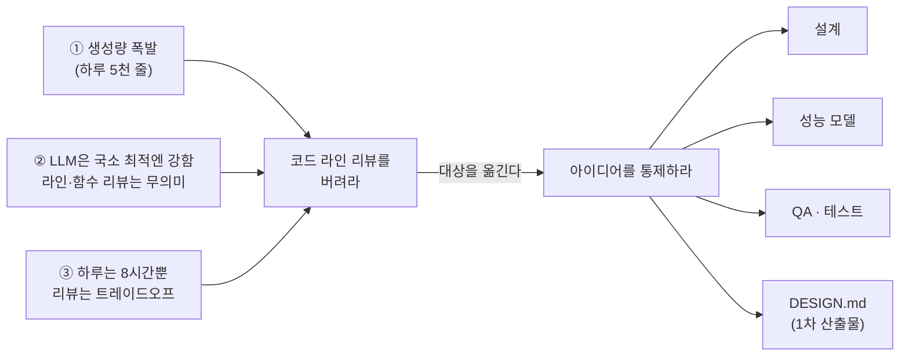

<figure class="post-figure post-figure--header">
<svg role="img" aria-label="오크 전쟁 지휘관이 언덕 위에 서서, 발밑으로 끝없이 흘러가는 코드 강물(하루 5천 줄의 로그)에는 등을 돌린 채 눈길도 주지 않는다. 대신 오른팔을 뻗어 언덕 위에 세워진 전술 지도 — 설계도이자 DESIGN.md — 를 손가락으로 짚으며 부대를 지휘한다. 지도에는 설계·성능 모델·QA·테스트가 적혀 있다. 코드가 아니라 아이디어를 통제한다는 한 컷 상징." viewBox="0 0 680 340" xmlns="http://www.w3.org/2000/svg">
  <title>코드가 아니라 아이디어를 통제하라 — 지휘관은 흘러가는 코드 강물에 등을 돌리고, 언덕 위 설계도(DESIGN.md)를 짚어 지휘한다</title>
  <defs>
    <marker id="ci-head" markerWidth="10" markerHeight="10" refX="7" refY="3" orient="auto">
      <path d="M0 0 L7 3 L0 6 z" fill="var(--accent-color)"/>
    </marker>
  </defs>

  <!-- ===== 언덕 능선 ===== -->
  <path d="M0 256 Q170 210 330 232 Q500 254 680 236" fill="none" stroke="currentColor" stroke-width="2" opacity="0.55"/>

  <!-- ===== 아래: 코드 강물 (하루 5천 줄) — 지휘관이 등 돌린 곳 ===== -->
  <text x="24" y="300" font-size="10" fill="currentColor" opacity="0.5" font-weight="700">코드 강물 · 하루 5천 줄 — 쳐다보지 않는다</text>
  <path d="M8 312 H672" fill="none" stroke="currentColor" stroke-width="1" opacity="0.25"/>
  <path d="M8 330 H672" fill="none" stroke="currentColor" stroke-width="1" opacity="0.25"/>
  <text x="20" y="325" font-size="10" fill="currentColor" opacity="0.32" font-family="monospace">for(i){ if(x) return; } &lt;/&gt; ; { } fn() =&gt; { } while(true) ++i; </text>
  <text x="330" y="337.5" font-size="10" fill="currentColor" opacity="0.3" font-family="monospace">};  await run();  { … }  // slop  { } ; return 0; </text>
  <!-- 흐름 화살표 (강물이 스쳐 지나감) -->
  <line x1="120" y1="322" x2="70" y2="322" stroke="currentColor" stroke-width="1.4" opacity="0.4" marker-end="url(#ci-head)"/>
  <line x1="560" y1="322" x2="510" y2="322" stroke="currentColor" stroke-width="1.4" opacity="0.4" marker-end="url(#ci-head)"/>

  <!-- ===== 왼쪽: 오크 전쟁 지휘관 (언덕 위, 강물에 등 돌림) ===== -->
  <!-- 상투(topknot) -->
  <path d="M182 96 Q190 76 198 96" fill="none" stroke="currentColor" stroke-width="2"/>
  <circle cx="190" cy="92" r="4" fill="var(--secondary-color)"/>
  <!-- 머리 -->
  <circle cx="190" cy="132" r="26" fill="var(--bg-light)" stroke="currentColor" stroke-width="2"/>
  <!-- 크림슨 전투 문양 -->
  <path d="M176 122 L204 130" stroke="var(--accent-color)" stroke-width="2.4" stroke-linecap="round"/>
  <!-- 눈 (지도를 향함) -->
  <circle cx="199" cy="130" r="2.4" fill="currentColor"/>
  <!-- 엄니(tusks) -->
  <polygon points="182,150 186,150 184,158" fill="currentColor"/>
  <polygon points="196,150 200,150 198,158" fill="currentColor"/>
  <!-- 몸통/갑옷 (능선까지) -->
  <path d="M158 172 L222 172 L236 250 L146 250 Z" fill="var(--bg-panel)" stroke="currentColor" stroke-width="2"/>
  <path d="M190 172 L190 250" stroke="currentColor" stroke-width="1.4" opacity="0.4"/>
  <!-- 어깨 견장 -->
  <path d="M158 172 Q150 164 162 160" fill="none" stroke="currentColor" stroke-width="2"/>
  <path d="M222 172 Q230 164 218 160" fill="none" stroke="currentColor" stroke-width="2"/>
  <!-- 뻗은 오른팔 (지도를 짚음) -->
  <path d="M220 182 L330 156" fill="none" stroke="currentColor" stroke-width="6" stroke-linecap="round"/>
  <circle cx="336" cy="155" r="6" fill="var(--bg-light)" stroke="currentColor" stroke-width="2"/>
  <text x="150" y="272" font-size="10" fill="currentColor" opacity="0.7" font-weight="700">전쟁 지휘관</text>

  <!-- ===== 오른쪽: 언덕 위 전술 지도 (설계도 · DESIGN.md) ===== -->
  <!-- 지시 화살표: 손 → 지도 -->
  <line x1="346" y1="153" x2="428" y2="150" stroke="var(--accent-color)" stroke-width="3" marker-end="url(#ci-head)"/>
  <!-- 지도 삼각대 -->
  <line x1="452" y1="230" x2="470" y2="252" stroke="currentColor" stroke-width="2"/>
  <line x1="600" y1="230" x2="582" y2="252" stroke="currentColor" stroke-width="2"/>
  <!-- 지도 패널 -->
  <rect x="434" y="112" width="184" height="122" rx="8" fill="var(--bg-panel)" stroke="var(--gold)" stroke-width="2.4"/>
  <text x="526" y="132" text-anchor="middle" font-size="12.5" fill="var(--gold)" font-weight="700">설계도 · DESIGN.md</text>
  <!-- 등고선 -->
  <path d="M448 158 Q486 142 524 158 T600 158" fill="none" stroke="currentColor" stroke-width="1.2" opacity="0.35"/>
  <path d="M448 172 Q486 158 524 172 T600 172" fill="none" stroke="currentColor" stroke-width="1.2" opacity="0.35"/>
  <!-- 표적 마크 (붉은 X) -->
  <path d="M470 148 l8 8 M478 148 l-8 8" stroke="var(--accent-color)" stroke-width="2" stroke-linecap="round"/>
  <path d="M568 166 l8 8 M576 166 l-8 8" stroke="var(--accent-color)" stroke-width="2" stroke-linecap="round"/>
  <!-- 첨탑 아이콘 -->
  <polygon points="524,150 532,168 516,168" fill="none" stroke="currentColor" stroke-width="1.4" opacity="0.6"/>
  <!-- 지도가 담은 아이디어 -->
  <text x="526" y="200" text-anchor="middle" font-size="10.5" fill="currentColor" font-weight="700">설계 · 성능 모델 · QA · 테스트</text>
  <text x="526" y="220" text-anchor="middle" font-size="9.5" fill="currentColor" opacity="0.6">아이디어를 통제한다</text>
</svg>
<figcaption>지휘관은 흘러가는 코드 강물(하루 5천 줄)에 등을 돌리고, 언덕 위 설계도(DESIGN.md) — 설계·성능·QA — 를 짚어 부대를 지휘한다. 통제할 것은 코드가 아니라 아이디어다.</figcaption>
</figure>

## 원문 정보

> - **제목**: Control the ideas, not the code
> - **출처**: antirez (Salvatore Sanfilippo, Redis 창시자) — [antirez.com](https://antirez.com/)
> - **발행**: 2026-07 (게시 시점 기준 약 29일 전) · 약 7분 분량
> - **원문 링크**: <https://antirez.com/news/169>

Redis를 만든 사람이자 오랫동안 "clean code"의 상징이었던 antirez가, AI 시대에 프로그래머가 코드 리뷰에 쏟는 시간이 대부분 무의미하다고 선언한 에세이다. 코드를 잘 짜는 사람의 입에서 나온 주장이라 무게가 다르다 — Articles에 담아 그 논지를 뜯어본다.

## 한 줄 요약 (TL;DR)

소프트웨어의 **아이디어(설계·성능 모델·데이터 구조·테스트)**를 통제한다면, **코드 그 자체를 한 줄씩 들여다보는 것은 대개 최적이 아니고 무의미하다**. 프로그래머의 진짜 산출물은 이제 코드가 아니라 "내가 만들려는 소프트웨어에 대한 명확한 그림"과 그것을 지키는 QA다.

이 글의 논지를 한 장으로 옮기면 이렇다 — 코드 라인 리뷰를 버려야 하는 **세 가지 이유**가 하나의 결론으로 모이고, 그 결론이 **아이디어 통제**(설계·성능·QA·DESIGN.md)로 이어진다.

## 왜 이 글을 골랐나

이 위키에는 AI 코딩을 다루는 아티클이 이미 여럿 있는데, 대부분 **"AI 산출물을 어떻게 통제할 것인가"**를 놓고 서로 다른 답을 낸다. 어떤 글은 [권한 프롬프트의 diff를 매번 직접 검토하라](/2026/07/06/short-leash-ai-coding.html)고 하고, 어떤 글은 [에이전틱 코딩이 인지 부채를 낳는 함정](/2026/07/03/agentic-coding-is-a-trap.html)이라고 경고한다.

antirez의 글은 그 스펙트럼에서 **가장 급진적인 한쪽 끝**에 선다. "코드를 보지 마라"는 도발이 흥미로운 이유는, 이 말을 하는 사람이 코드를 못 봐서가 아니라 **누구보다 잘 보는 사람**이기 때문이다. 그가 왜 자기 강점을 스스로 내려놓으라고 말하는지 — 그 논리 구조를 뜯어보면 AI 시대에 "사람의 몫"을 어디에 둘지에 대한 하나의 좌표가 나온다.

## 핵심 내용

### 이건 "vibe coding"이 아니다

antirez는 먼저 오해를 차단한다. "코드를 보지 마라"가 곧 **최종 결과물만 던져 주고 알아서 나오길 바라는 vibe coding을 뜻하지 않는다**. 핵심은 정반대다 — *아이디어를 통제한다면* 코드를 훑는 것이 비효율이라는 얘기다. 그는 자신을 "AI 뒤에 숨는 사람"이 아니라 코드를 직접 쓸 줄 아는 사람으로 세워 두고, 그럼에도 우리 분야가 "놀랍고 고통스럽지만 즐거운 방향"으로 진화하고 있음을 인정하라고 말한다. 지금 코드를 덜 보는 것은 "당신의 약함이 아니라 분야가 바뀐 것"이라는 위로가 이 글의 정서적 축이다.

### 코드 중심 리뷰를 버려야 하는 세 가지 이유

antirez가 든 근거는 명확한 세 가지다.

1. **생성량이 감당 불가능하다.** LLM의 장황함을 감안하지 않더라도, 이제 하루에 엄청난 양의 코드가 나온다. "매일 5천 줄을 어떻게 리뷰할 것인가?"
2. **LLM은 국소 최적(locally optimal)에는 강하고 큰 아이디어에는 약하다** (개선 중이지만). 함수 단위·라인 단위로 스캔하는 게 무슨 의미가 있나. 대신 **머릿속의 설계를 프롬프트로 주고**, "그 부분의 설계가 정확히 어떻게 되나? 어떻게 동작하나?"를 물어 **모델이 옳은지 평가**하라. 그게 훨씬 빠르다.
3. **하루는 8시간뿐이다.** 코드를 읽는 것은 트레이드오프다. 그 시간에 정작 오늘 가장 중요한 일 — "이 소프트웨어로 나는 무엇을 하려는가? 어떤 새 방향을 잡을 것인가?", 그리고 새 아이디어·기능·최적화 트릭을 고민하고 **QA를 많이 하는 것** — 을 덜 하게 된다.

### Mythical Man-Month, 그리고 이미 썩어 있던 소프트웨어

antirez는 "아이디어를 통제한다(controlling the ideas)"는 표현을 *The Mythical Man-Month*에서 끌어온다. 1970년대 책이 2000~2020년에 나온 많은 말보다 지금 소프트웨어 시대를 더 잘 설명한다는 것이다. 그리고 뼈아픈 반문을 던진다 — **AI에 반대하는 사람들은 왜 지난 10년간의 소프트웨어 상태에는 경악하지 않았나?** AI 이전에 우리가 도달한 "slop(엉망)"의 수준은 믿기 어려울 정도였다는 것이다.

### DwarfStar: AI가 오히려 빛나는 영역

그가 만드는 로컬 LLM 추론 소프트웨어 **DwarfStar**가 사례로 등장한다. DeepSeek v4와 GLM 5.2 두 모델의 추론을 "완전히 자동화된 방식으로" 구현했지만, 직접 해 보면 **"XYZ 구현해"라고만 해서는 동작하지 않는다**는 걸 알게 된다고 그는 말한다. 어떻게 동작하는지, 최선의 설계가 무엇인지, 어떤 성능 수준에 어떻게 도달하는지를 **이해해야** 한다.

흥미로운 대목은 그가 자기 구현을 다른 시스템과 **정확성(correctness) 기준으로 비교**했더니, 다른 구현들에 오히려 더 많은 오류가 있었다는 것이다. 로컬 추론 세계는 **누적되어 모델 출력을 망가뜨리는 미묘한 버그**로 가득했다 — 예를 들어 컨텍스트가 일정 한계를 넘으면 성능이 꺾이는 attention 구현 결함(indexed attention이 필요 이상으로 많은 일을 하는 식). 매일 조금씩 다른 추론 그래프를 가진 모델이 쏟아지는, 개발자에게 "불공정한 게임"인 영역이다. **바로 이런 곳에서 AI가 크게 돕는다** — GPU 커널을 손으로 짜거나 읽는 것보다, 설계 측면의 엄밀한 엔지니어링과 테스트가 훨씬 낫다. "그러니 저 저항의 상당 부분이 이념적인 것은 아닐까?"

### Matteo Collina의 반문, 그리고 DESIGN.md

Matteo Collina가 트위터에서 되물었다. "당신은 Redis의 AI 생성 코드를 다 확인한다고 하지 않았나?" antirez의 답이 이 글의 핵심 실무 처방이다.

- **그렇다, 나는 여전히 확인한다.** 하지만 이제 그것은 "필요해서 하는 일"이지 대체로 **무의미**하다고 믿는다. GPT 5.5 이후 부분적으로, Fable과 GPT 5.6 "Sol" 이후로는 더욱.
- 내가 마음에 안 드는 코딩 방식을 잡아내긴 한다. 하지만 다른 Redis 기여자가 쓴 파일을 열면 **훨씬 더 나쁜 것**들이 있다 — 그들이 못해서가 아니라 **취향(taste)의 문제**다.
- 내가 코드를 계속 보는 것은 **사용자에 대한 존중** 때문이다. Redis는 널리 쓰이고, 많은 프로그래머가 파일을 열어 손으로 고친다. 하지만 손이 자유롭다면, 그 리뷰 시간을 **더 많은 QA, 다음 최적화 아이디어, 그리고 LLM으로 DESIGN.md를 쓰는 데** 쓰겠다.

그가 그리는 미래의 워크플로가 여기서 나온다. 각 **데이터 구조를 인간의 언어로 설명한 `DESIGN.md`** — 담긴 아이디어, 구현 트릭, 설계. sorted set을 고치고 싶은가? 파일을 열어 **설계를 읽고, 그 아이디어를 당신 것으로 만든** 다음, 올바른 멘탈 모델을 가지고 에이전트에게 무엇을 할지 물어라. **코드를 리뷰하는 것보다 이게 훨씬 유용하다.**

### 남은 의문: 신입 프로그래머

antirez는 한 가지 유보를 남긴다. **경험이 부족해 멘탈 모델을 세우지 못하는 신입**은 어떻게 되나. 그들이 코드의 동작을 아주 잘 이해해야 하는지는 "아직 모른다". 다만 그는 **프로그래밍하는 법 자체는 배워야 한다**고 믿는다 — 그런데 그 방법이 LLM 출력을 검수하는 것은 아닐 것이다. 차라리 **작은 인터프리터, 작은 데이터베이스, 해시 테이블을 직접 구현**하는 편이 훨씬 유용하다. ("고객사 웹사이트의 자바스크립트를 리뷰하는 데 시간 쓰지 마라"는 특유의 독설로 끝맺는다.)

## 분석과 인사이트

**1. "코드를 보지 마라"의 진짜 주어는 "아이디어를 봐라"다.** 이 글의 제목은 도발적이지만 논지는 생략을 허용하지 않는다. antirez가 내려놓으라는 것은 *라인 단위 검수*이고, 대신 짊어지라는 것은 *설계·성능 모델·데이터 구조·테스트*다. 리뷰의 총량을 줄이자는 게 아니라 **리뷰의 대상을 코드에서 아이디어로 옮기자**는 것이다. 이 구분을 놓치면 그냥 vibe coding 옹호로 오독하기 쉽다 — 그리고 그는 그 오독을 첫 문단에서부터 막는다.

**2. 이 위키의 다른 글들과 정면으로 충돌한다 — 그게 유익하다.** [Short Leash 방법](/2026/07/06/short-leash-ai-coding.html)은 "권한 프롬프트의 diff를 매번 직접 검토하고 YOLO 모드를 끄라"고 한다. antirez는 정확히 그 리뷰가 "대체로 무의미"하다고 한다. 둘 다 틀리지 않았다 — 갈라지는 지점은 **"아이디어를 이미 통제하고 있는가"**라는 전제다. antirez는 Redis 내부 설계를 손바닥처럼 아는 사람이라 코드를 안 봐도 아이디어를 통제한다. Short Leash의 독자는 그 통제력이 아직 없기에 diff가 최후의 방어선이다. 즉 **"코드를 봐야 하는가"의 답은 스킬 수준의 함수**다. 이건 antirez 스스로 신입 프로그래머 대목에서 인정하는 바이기도 하다.

**3. taste와 QA로의 이동.** "다른 기여자의 코드가 더 나쁜 건 실력이 아니라 취향의 문제"라는 대목은, 이 위키의 [취향과 판단, 그리고 AI](/2026/08/04/taste-judgment-and-ai.html)와 곧장 이어진다. 코드가 값싸질수록 **무엇을 좋다고 느끼는 감각(taste)과 무엇을 출하할지 정하는 판단**이 병목이 된다. antirez의 처방(QA·테스트·DESIGN.md)은 결국 "코드를 짜는 노동"에서 "품질을 정의하고 지키는 노동"으로 인간의 몫을 옮기는 것이다.

**4. DESIGN.md는 이 글에서 가장 실행 가능한 유산이다.** "코드는 아무도 보지 말고, 코드가 담은 아이디어만 보라"는 주장을 현실에서 성립시키는 유일한 장치가 **인간 언어로 쓰인 설계 문서**다. 코드가 진실의 원천(source of truth)이던 시대에는 주석·문서가 "부차적"이었지만, 코드를 안 볼 거라면 **설계 문서가 1차 산출물로 승격**된다. 이건 [코딩이 공짜가 되면 무엇이 비싸지는가](/2026/06/23/fowler-fragments-verification-cognitive-surrender.html)에서 Fowler가 말한 "검증이 비싸진다"와 같은 동전의 양면이다 — 검증을 코드 리뷰가 아니라 설계 문서 + 테스트로 하겠다는 선언.

**5. 유보할 지점 — "코드를 안 보면 무엇으로 아이디어를 검증하나".** antirez의 논리에는 낙관적 도약이 하나 있다. 그는 "설계를 프롬프트로 주고 '어떻게 동작하나' 물어 평가하라"고 하지만, **모델이 설명하는 설계와 실제로 생성된 코드가 일치한다는 보장**은 어디서 오나. 그가 스스로 인정하듯, Fable·GPT 5.6의 리뷰는 그의 사람 리뷰가 못 잡는 race condition을 더 많이 잡아낸다 — 즉 **검증의 주체가 사람에서 다른 모델로 옮겨갈 뿐, 검증 자체는 사라지지 않는다**. "코드를 보지 마라"는 실은 "코드 검증을 자동화·위임하라"에 가깝고, 그 위임이 신뢰할 만한지는 도메인(그의 로컬 추론처럼 테스트 가능한 정답이 있는 영역인지)에 크게 의존한다.

## 적용 포인트

- **리뷰의 대상을 바꿔라.** 다음 PR에서 "라인이 맞나"가 아니라 "이 설계가 옳은 모델인가, 성능 특성이 내 의도와 맞나"를 먼저 물어라. 코드 대신 **"이 부분 설계를 설명해 봐"**를 에이전트에게 요구하고 그 설명을 평가하라.
- **`DESIGN.md`를 1차 산출물로 승격하라.** 핵심 모듈·데이터 구조마다 인간 언어로 아이디어·구현 트릭·설계 결정을 적어라. 다음에 그 부분을 고칠 때 코드가 아니라 이 문서를 읽고 멘탈 모델을 회복하도록.
- **리뷰에서 아낀 시간을 QA와 테스트에 재투자하라.** antirez의 처방은 "덜 검증"이 아니라 "검증의 형태를 바꿔라"다 — 라인 리뷰 대신 정답이 있는 비교 테스트, 성능 회귀 테스트, 경계 조건(그의 attention 사례처럼 컨텍스트 한계) 검증.
- **자신의 스킬 좌표를 정직하게 찍어라.** 해당 도메인의 아이디어를 이미 통제하고 있다면 코드 리뷰를 줄여도 된다. 아직 멘탈 모델이 없다면 antirez 본인 말대로 **작은 것(인터프리터·해시테이블·미니 DB)을 손으로 구현**하며 그 통제력부터 쌓아라.
- **정답이 흐린 도메인에서는 신중하라.** 비교 검증이 가능한 영역(추론 커널, 자료구조)일수록 "코드 안 보기"가 안전하고, 정답이 모호한 비즈니스 로직일수록 검증 위임의 위험이 크다.

## 마무리

antirez의 글은 "AI가 코딩을 대신한다"는 흔한 서사가 아니다. 그는 **코드를 짜는 능력을 부정하지 않으면서**, 그 능력의 무게중심을 "타이핑"에서 "설계와 품질의 통제"로 옮기라고 말한다. 코드가 값싸진 세계에서 사람이 붙들어야 할 것은 **소프트웨어가 무엇이어야 하는가에 대한 아이디어**이고, 그 아이디어를 지키는 도구는 라인 리뷰가 아니라 QA·테스트·설계 문서라는 것이다. 이 위키의 [Short Leash](/2026/07/06/short-leash-ai-coding.html)·[에이전틱 코딩은 함정](/2026/07/03/agentic-coding-is-a-trap.html) 진영과 나란히 놓고 읽으면, "AI 산출물을 어떻게 신뢰할 것인가"라는 질문의 두 극단을 모두 손에 쥐게 된다 — 그리고 그 답이 결국 **자신이 아이디어를 얼마나 통제하고 있는가**에 달려 있음을 보게 된다.

### 더 읽어보기

- [원문 — Control the ideas, not the code (antirez)](https://antirez.com/news/169)
- [짧은 목줄(Short Leash) 방법 — AI 코딩 에이전트를 통제하며 고품질 코드를 만드는 법](/2026/07/06/short-leash-ai-coding.html) — "매번 diff를 리뷰하라"는 정반대 처방, 대조해서 읽기
- [에이전틱 코딩은 함정이다 — 인지 부채와 스킬 위축을 경계하며](/2026/07/03/agentic-coding-is-a-trap.html) — antirez의 낙관에 대한 반대 축
- [취향과 판단, 그리고 AI — 에이전트가 못 가져가는 것](/2026/08/04/taste-judgment-and-ai.html) — "코드 품질은 취향의 문제"라는 antirez 발언과 이어지는 글
- [코딩이 공짜가 되면 무엇이 비싸지는가 — Fowler의 Fragments](/2026/06/23/fowler-fragments-verification-cognitive-surrender.html) — "검증이 비싸진다"는 같은 문제의 다른 얼굴
- [영원한 Sloptember: 에이전트는 프로그래밍을 못 한다 (George Hotz)](/2026/06/22/the-eternal-sloptember.html) — "이미 소프트웨어는 썩어 있었다"는 진단을 정반대 결론으로 끌고 가는 글
