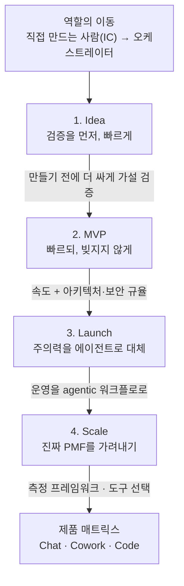

<figure class="post-figure post-figure--header">
<svg role="img" aria-label="역할의 이동 그림: 예전에는 창업자가 자기 손으로 직접 코드를 치고 제품을 만드는 개별 기여자(individual contributor)였지만, AI 네이티브 시대에는 의도를 설계하고 여러 에이전트를 지휘하는 오케스트레이터로 무게중심이 옮겨간다. 무게중심이 실행에서 판단과 설계로 이동한다." viewBox="0 0 640 320" xmlns="http://www.w3.org/2000/svg">
  <title>The Founder's Playbook — 직접 만드는 사람에서 에이전트를 지휘하는 오케스트레이터로</title>
  <!-- LEFT: before — the founder is an individual contributor at the bench -->
  <text x="118" y="34" text-anchor="middle" font-size="13" fill="currentColor" font-weight="700" opacity="0.7">예전: 직접 만드는 사람 (IC)</text>
  <!-- person at the workbench -->
  <circle cx="70" cy="150" r="14" fill="none" stroke="currentColor" stroke-width="2.5"/>
  <line x1="70" y1="164" x2="70" y2="202" stroke="currentColor" stroke-width="2.5"/>
  <text x="70" y="224" text-anchor="middle" font-size="12" fill="currentColor" font-weight="700">창업자</text>
  <!-- arrow: founder works directly on the one product -->
  <line x1="92" y1="150" x2="142" y2="150" stroke="var(--secondary-color)" stroke-width="2.5" marker-end="url(#fp-arrow)"/>
  <text x="117" y="138" text-anchor="middle" font-size="11" fill="currentColor" opacity="0.85">직접</text>
  <!-- the single product block -->
  <rect x="150" y="128" width="60" height="44" rx="3" fill="var(--bg-light)" stroke="currentColor" stroke-width="2"/>
  <text x="180" y="148" text-anchor="middle" font-size="11" fill="currentColor" font-weight="700">제품</text>
  <text x="180" y="162" text-anchor="middle" font-size="9" fill="currentColor" opacity="0.7">×1</text>
  <!-- divider -->
  <line x1="262" y1="38" x2="262" y2="276" stroke="currentColor" stroke-width="1.5" opacity="0.3" stroke-dasharray="4 5"/>
  <!-- RIGHT: after — the founder is an orchestrator directing agents -->
  <text x="448" y="34" text-anchor="middle" font-size="13" fill="currentColor" font-weight="700">지금: 지휘하는 사람 (오케스트레이터)</text>
  <!-- person stepping up to the podium -->
  <circle cx="320" cy="150" r="14" fill="none" stroke="currentColor" stroke-width="2.5"/>
  <line x1="320" y1="164" x2="320" y2="202" stroke="currentColor" stroke-width="2.5"/>
  <text x="320" y="224" text-anchor="middle" font-size="12" fill="currentColor" font-weight="700">창업자</text>
  <!-- baton: directs -->
  <line x1="342" y1="150" x2="382" y2="150" stroke="var(--secondary-color)" stroke-width="2.5" marker-end="url(#fp-arrow)"/>
  <text x="362" y="138" text-anchor="middle" font-size="11" fill="currentColor" opacity="0.85">지휘</text>
  <!-- the orchestration hub -->
  <circle cx="430" cy="150" r="22" fill="var(--bg-light)" stroke="var(--accent-color)" stroke-width="3"/>
  <text x="430" y="147" text-anchor="middle" font-size="10" fill="currentColor" font-weight="700">의도·</text>
  <text x="430" y="160" text-anchor="middle" font-size="10" fill="currentColor" font-weight="700">설계</text>
  <!-- three agents fanned out from the hub -->
  <line x1="452" y1="138" x2="540" y2="92" stroke="var(--secondary-color)" stroke-width="2" marker-end="url(#fp-arrow)"/>
  <line x1="454" y1="150" x2="540" y2="150" stroke="var(--secondary-color)" stroke-width="2" marker-end="url(#fp-arrow)"/>
  <line x1="452" y1="162" x2="540" y2="208" stroke="var(--secondary-color)" stroke-width="2" marker-end="url(#fp-arrow)"/>
  <rect x="548" y="74" width="68" height="34" rx="3" fill="var(--bg-light)" stroke="currentColor" stroke-width="2"/>
  <text x="582" y="95" text-anchor="middle" font-size="10" fill="currentColor" font-weight="700">에이전트</text>
  <rect x="548" y="133" width="68" height="34" rx="3" fill="var(--bg-light)" stroke="currentColor" stroke-width="2"/>
  <text x="582" y="154" text-anchor="middle" font-size="10" fill="currentColor" font-weight="700">에이전트</text>
  <rect x="548" y="192" width="68" height="34" rx="3" fill="var(--bg-light)" stroke="currentColor" stroke-width="2"/>
  <text x="582" y="213" text-anchor="middle" font-size="10" fill="currentColor" font-weight="700">에이전트</text>
  <!-- the shift caption (gold thread) -->
  <path d="M70,236 C70,272 320,272 320,238" fill="none" stroke="var(--gold)" stroke-width="2.5" stroke-dasharray="3 4"/>
  <text x="320" y="302" text-anchor="middle" font-size="12" fill="currentColor" font-weight="700">무게중심이 실행에서 판단·설계로 이동한다</text>
  <defs>
    <marker id="fp-arrow" markerWidth="8" markerHeight="8" refX="6" refY="4" orient="auto">
      <path d="M0,0 L8,4 L0,8 z" fill="var(--secondary-color)"/>
    </marker>
  </defs>
</svg>
<figcaption>창업자의 역할이 "자기 손으로 만드는 개별 기여자(IC)"에서 "의도를 설계하고 여러 에이전트를 지휘하는 오케스트레이터"로 이동한다 — 이 글이 4단계 내내 관통하는 변화의 축.</figcaption>
</figure>

## 원문 정보

> - **제목**: The Founder's Playbook — Building an AI-Native Startup
> - **출처**: Anthropic ([claude.com/blog](https://claude.com/blog/the-founders-playbook))
> - **발행**: 2026-05-14 · 약 5분 분량
> - **다루는 제품**: Claude (Chat) · Claude Cowork · Claude Code
> - **원문 링크**: <https://claude.com/blog/the-founders-playbook>

`Articles` 카테고리는 읽을 만한 외부 아티클을 골라 핵심을 정리하고 내 관점으로 분석하는 공간이다. 그 첫 글로, Anthropic이 펴낸 *The Founder's Playbook*을 골랐다.

## 한 줄 요약 (TL;DR)

AI는 창업의 4단계(**Idea → MVP → Launch → Scale**) 전부를 다시 쓰고 있다. 코드를 모르던 창업자가 프로덕션 애플리케이션을 만들고, 팀을 키우기 전에 매출을 내고, 반복 업무를 자동화한다. 창업자의 역할은 **직접 만드는 사람(individual contributor)에서 오케스트레이터(orchestrator)로** 이동한다.

### 한눈에 보기

이 글의 척추는 하나의 흐름이다 — **IC에서 오케스트레이터로의 이동**이라는 한 축을 따라, 창업 생애주기의 네 단계(Idea → MVP → Launch → Scale)마다 AI가 무엇을 바꾸는지를 짚는다. 그리고 그 위에 **"이 일에는 이 AI를"** 고르는 제품 매트릭스가 얹힌다.

## 왜 이 글을 골랐나

이 글은 표면적으로는 "스타트업 창업 가이드"지만, 본질은 **AI를 도구가 아니라 일하는 방식의 축으로 두면 무엇이 달라지는가**에 대한 이야기다. 이 질문은 창업자뿐 아니라 모든 엔지니어에게 그대로 적용된다. "개발자가 코드를 직접 치는 사람에서 의도를 설계하고 에이전트를 지휘하는 사람으로 이동한다"는 흐름은, 이 위키에서 이미 [바이브 코딩 너머 개발자 생존법](/2026/01/02/바이브-코딩-너머-개발자-생존법.html)을 통해 다뤘던 변화와 정확히 같은 줄기에 있다. 창업이라는 렌즈로 그 변화를 다시 보면 시야가 한 단계 넓어진다.

## 핵심 내용

원문은 창업 생애주기를 네 단계로 나누고, 각 단계에서 AI가 무엇을 바꾸는지를 짚는다. (구체적인 체크리스트와 사례의 디테일은 페이지에 연결된 다운로드용 플레이북 문서에 담겨 있고, 블로그 본문은 그 골격을 소개한다.)

### 1단계 — Idea: 검증을 먼저, 빠르게

- 문제 검증(problem validation), 경쟁 지형 매핑(competitive landscape mapping), 고객 발견(customer discovery)을 AI 워크플로로 압축한다.
- 핵심은 "만들기 전에 검증"이다. 리서치·인터뷰 정리·시장 조사 같은 초기 탐색을 AI가 가속하면, 아이디어를 코드로 옮기기 전에 더 많은 가설을 더 싸게 검증할 수 있다.

### 2단계 — MVP: 빠르되, 빚지지 않게

- 아키텍처(architecture), 범위 관리(scope), **보안(security)** 에 초점을 둔다.
- 주목할 표현은 "AI가 생성한 코드베이스에서 기술 부채를 예방한다"는 대목이다. 빠르게 만드는 능력이 보편화될수록, 차별점은 **빠르게 만들면서도 무너지지 않게 만드는 규율**로 옮겨간다. MVP 단계부터 구조와 보안을 챙기라는 조언은 엔지니어링의 고전적 원칙과 정확히 맞닿는다.

### 3단계 — Launch: 창업자의 주의력을 에이전트로 대체

- 출시 단계에서 "창업자의 주의력을 **에이전트 워크플로(agentic workflows)로 대체하는** 운영 체계"를 제안한다.
- 즉 사람이 일일이 붙어 있어야 굴러가던 운영 업무(고객 응대, 온보딩, 반복 작업)를 에이전트가 대신 돌리게 만들어, 창업자가 더 높은 레버리지의 일에 집중하게 한다.

### 4단계 — Scale: 진짜 PMF를 가려내기

- 확장 단계에서는 "초기의 열광"과 "진짜 제품-시장 적합성(product-market fit)"을 구분하는 **측정 프레임워크**를 강조한다.
- 도구 선택도 이 단계의 과제로 본다. Chat·Cowork·Code를 상황에 맞게 골라 쓰는 전략이 규모의 효율을 좌우한다.

### 제품 매트릭스 — 일에 맞는 도구 고르기

플레이북의 한 축은 **"언제 무엇을 쓸 것인가"의 제품 매트릭스**다. 같은 AI라도 쓰임이 다르다.

| 도구 | 결이 맞는 일 |
|------|--------------|
| **Claude (Chat)** | 생각을 정리하고, 리서치하고, 의사결정을 다듬는 사고의 파트너 |
| **Claude Cowork** | 운영·문서·크로스펑셔널 업무를 함께 처리하는 협업 워크스페이스 |
| **Claude Code** | 실제 제품을 만들고 코드베이스를 다루는 엔지니어링 |

핵심 메시지는 단순하다. **"AI를 쓴다"가 아니라 "이 일에는 이 AI를 쓴다"** 로 사고를 바꾸라는 것.

<figure class="post-figure">
<svg role="img" aria-label="제품 매트릭스 그림: 일을 시작하기 전에 일의 성격을 먼저 묻고, 사고·리서치·의사결정은 Claude Chat, 운영·문서·크로스펑셔널 협업은 Claude Cowork, 제품을 만들고 코드베이스를 다루는 엔지니어링은 Claude Code로 고른다." viewBox="0 0 640 290" xmlns="http://www.w3.org/2000/svg">
  <title>제품 매트릭스 — 일의 성격에 맞는 AI를 고른다</title>
  <!-- the question gate -->
  <rect x="218" y="20" width="204" height="46" rx="4" fill="var(--bg-light)" stroke="var(--accent-color)" stroke-width="2.5"/>
  <text x="320" y="40" text-anchor="middle" font-size="12" fill="currentColor" font-weight="700">이 일의 성격은?</text>
  <text x="320" y="56" text-anchor="middle" font-size="10" fill="currentColor" opacity="0.8">먼저 묻고 → 도구를 고른다</text>
  <!-- three branches -->
  <line x1="320" y1="66" x2="120" y2="118" stroke="var(--secondary-color)" stroke-width="2" marker-end="url(#fm-arrow)"/>
  <line x1="320" y1="66" x2="320" y2="118" stroke="var(--secondary-color)" stroke-width="2" marker-end="url(#fm-arrow)"/>
  <line x1="320" y1="66" x2="520" y2="118" stroke="var(--secondary-color)" stroke-width="2" marker-end="url(#fm-arrow)"/>
  <!-- column 1: Chat -->
  <rect x="24" y="124" width="192" height="48" rx="4" fill="var(--bg-light)" stroke="currentColor" stroke-width="2"/>
  <text x="120" y="146" text-anchor="middle" font-size="12" fill="currentColor" font-weight="700">Claude (Chat)</text>
  <text x="120" y="163" text-anchor="middle" font-size="10" fill="currentColor" opacity="0.85">사고의 파트너</text>
  <text x="120" y="200" text-anchor="middle" font-size="11" fill="currentColor">생각 정리 · 리서치</text>
  <text x="120" y="218" text-anchor="middle" font-size="11" fill="currentColor">· 의사결정 다듬기</text>
  <!-- column 2: Cowork -->
  <rect x="224" y="124" width="192" height="48" rx="4" fill="var(--bg-light)" stroke="currentColor" stroke-width="2"/>
  <text x="320" y="146" text-anchor="middle" font-size="12" fill="currentColor" font-weight="700">Claude Cowork</text>
  <text x="320" y="163" text-anchor="middle" font-size="10" fill="currentColor" opacity="0.85">협업 워크스페이스</text>
  <text x="320" y="200" text-anchor="middle" font-size="11" fill="currentColor">운영 · 문서</text>
  <text x="320" y="218" text-anchor="middle" font-size="11" fill="currentColor">· 크로스펑셔널 업무</text>
  <!-- column 3: Code -->
  <rect x="424" y="124" width="192" height="48" rx="4" fill="var(--bg-light)" stroke="currentColor" stroke-width="2"/>
  <text x="520" y="146" text-anchor="middle" font-size="12" fill="currentColor" font-weight="700">Claude Code</text>
  <text x="520" y="163" text-anchor="middle" font-size="10" fill="currentColor" opacity="0.85">엔지니어링</text>
  <text x="520" y="200" text-anchor="middle" font-size="11" fill="currentColor">제품 제작</text>
  <text x="520" y="218" text-anchor="middle" font-size="11" fill="currentColor">· 코드베이스 작업</text>
  <!-- bottom rule -->
  <text x="320" y="262" text-anchor="middle" font-size="12" fill="currentColor" font-weight="700">"AI를 쓴다" → "이 일에는 이 AI를 쓴다"</text>
  <defs>
    <marker id="fm-arrow" markerWidth="8" markerHeight="8" refX="6" refY="4" orient="auto">
      <path d="M0,0 L8,4 L0,8 z" fill="var(--secondary-color)"/>
    </marker>
  </defs>
</svg>
<figcaption>일을 시작하기 전에 일의 성격부터 묻고 도구를 고른다 — 사고·리서치는 Chat, 운영·협업은 Cowork, 제품·코드는 Code. 글이 말하는 "AI 리터러시의 다음 단계".</figcaption>
</figure>

### 사례 — 이미 그렇게 일하는 회사들

원문은 Ambral, Anything, Carta Healthcare, HumanLayer, Vulcan Technologies 등 실제 창업자 스토리로 각 단계를 예시한다. 추상적 조언이 아니라, AI 네이티브 방식으로 이미 제품을 만들고 운영하는 회사들의 구체적 사례로 뒷받침된다는 점이 이 글의 설득력을 만든다.

## 분석과 인사이트

- **"오케스트레이터로의 이동"은 창업만의 이야기가 아니다.** 창업자가 IC에서 오케스트레이터로 옮겨간다는 명제는, 개발자가 "코드를 치는 사람"에서 "의도를 설계하고 에이전트를 지휘하는 사람"으로 옮겨가는 흐름과 같은 구조다. 역할의 무게중심이 *실행*에서 *판단과 설계*로 옮겨간다.
- **속도가 보편화되면 차별점은 규율이 된다.** MVP 단계에서 보안과 아키텍처를 강조하는 대목이 가장 인상적이었다. 누구나 빠르게 만들 수 있게 되면, "빠르게 만들 수 있느냐"는 더 이상 경쟁력이 아니다. AI가 쏟아내는 코드 위에서 **기술 부채를 통제하는 엔지니어링 규율**이 진짜 해자가 된다. 이 위키의 [Engineering Essentials](/2026/06/19/architecture-essential-curriculum.html) 시리즈가 다루는 설계·아키텍처 원칙이 AI 시대에 오히려 더 중요해지는 이유다.
- **"운영을 에이전트로"는 양날의 검이다.** 창업자의 주의력을 에이전트로 대체한다는 비전은 매력적이지만, 잘못 위임하면 품질·신뢰·책임의 공백이 생긴다. 무엇을 자동화하고 무엇을 사람이 끝까지 쥐고 있을지를 가르는 판단이 결국 실력이 된다.
- **도구 매트릭스는 "AI 리터러시"의 다음 단계다.** "AI를 쓸 줄 안다"에서 "일의 성격에 맞는 AI를 고를 줄 안다"로 가는 것 — 이 분별이 생산성의 다음 격차를 만든다.

## 적용 포인트

- 새 아이디어가 떠오르면 코드부터 짜지 말고, **검증 가설을 먼저 AI로 빠르게 돌려본다.**
- AI로 MVP를 만들 때도 **아키텍처와 보안은 1일차부터** 챙긴다. 빠름과 견고함은 양자택일이 아니다.
- 반복되는 운영 업무를 목록화하고, **사람이 쥐어야 할 일과 에이전트에 위임할 일**을 명시적으로 가른다.
- 작업을 시작하기 전에 **"이 일에는 Chat인가, Cowork인가, Code인가"** 를 먼저 묻는 습관을 들인다.

## 마무리

*The Founder's Playbook*은 "AI로 창업하라"는 구호가 아니라, **AI를 전제로 일의 단계마다 무엇이 바뀌는지를 구조화한 지도**다. 창업자가 아니더라도, 실행에서 설계로 무게중심을 옮기고 일에 맞는 도구를 고르는 사고법은 모든 엔지니어가 지금 연습해야 할 근육이다. 빠르게 만드는 시대일수록, 무엇을 만들고 무엇을 견고하게 지킬지를 정하는 사람의 판단이 더 비싸진다.

### 더 읽어보기

- [원문 — The Founder's Playbook](https://claude.com/blog/the-founders-playbook)
- [바이브 코딩 너머 개발자 생존법](/2026/01/02/바이브-코딩-너머-개발자-생존법.html) — 같은 변화를 개발자 생존 전략의 관점에서
- [Architecture Essential Curriculum](/2026/06/19/architecture-essential-curriculum.html) — AI 시대에 더 중요해지는 설계·아키텍처 규율
