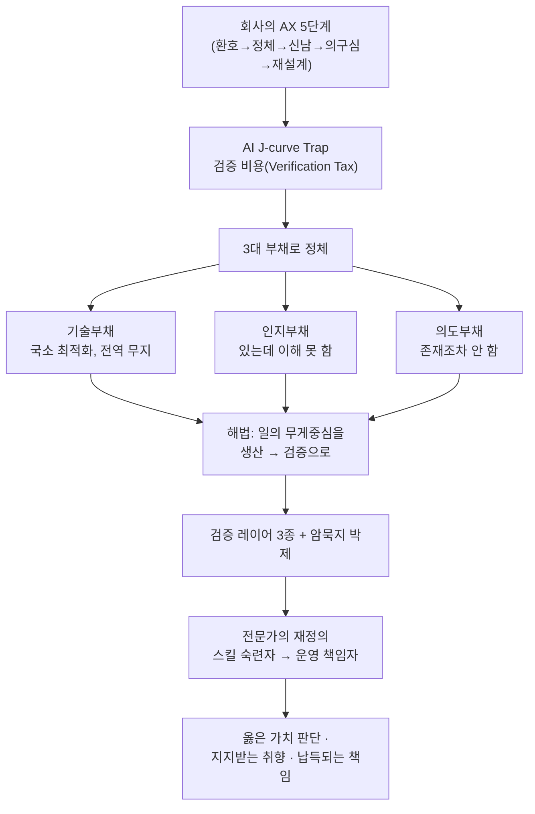

<figure class="post-figure post-figure--header">
<svg role="img" aria-label="AI 전환의 J-curve 지도: 환호로 출발해 검증 비용과 3대 부채의 구덩이를 지나 검증 중심의 전문가로 이륙하는 곡선" viewBox="0 0 640 300" xmlns="http://www.w3.org/2000/svg">
  <title>AX J-curve와 전문성 재설계의 지도</title>
  <!-- baseline -->
  <line x1="40" y1="250" x2="600" y2="250" stroke="currentColor" stroke-width="1.5" opacity="0.4"/>
  <!-- the J-curve path: 환호(높음) → 구덩이(검증 비용) → 이륙 -->
  <path d="M56,120 C120,90 150,150 200,210 C240,255 320,262 400,212 C470,170 540,96 596,60"
        fill="none" stroke="var(--accent-color)" stroke-width="4" stroke-linecap="round"/>
  <!-- start node: 환호 -->
  <circle cx="56" cy="120" r="9" fill="var(--secondary-color)" stroke="currentColor" stroke-width="1.5"/>
  <text x="56" y="104" text-anchor="middle" font-size="13" fill="currentColor" font-weight="700">환호</text>
  <!-- the pit: 검증 비용 / 3대 부채 -->
  <text x="300" y="288" text-anchor="middle" font-size="13" fill="currentColor" font-weight="700">검증 비용 · 3대 부채</text>
  <!-- three debt markers descending into the pit -->
  <g font-size="11" fill="currentColor" text-anchor="middle">
    <circle cx="232" cy="234" r="6" fill="var(--bg-panel)" stroke="var(--accent-color)" stroke-width="2.5"/>
    <text x="232" y="218" font-size="11">기술</text>
    <circle cx="300" cy="250" r="6" fill="var(--bg-panel)" stroke="var(--accent-color)" stroke-width="2.5"/>
    <text x="300" y="234" font-size="11">인지</text>
    <circle cx="368" cy="234" r="6" fill="var(--bg-panel)" stroke="var(--accent-color)" stroke-width="2.5"/>
    <text x="368" y="218" font-size="11">의도</text>
  </g>
  <!-- verification gate before takeoff -->
  <g stroke="var(--gold)" stroke-width="3" fill="none">
    <line x1="468" y1="116" x2="468" y2="178"/>
    <line x1="492" y1="100" x2="492" y2="166"/>
  </g>
  <text x="480" y="92" text-anchor="middle" font-size="12" fill="currentColor" font-weight="700">검증 레이어</text>
  <!-- takeoff node: 운영 책임자 -->
  <circle cx="596" cy="60" r="10" fill="var(--accent-color)" stroke="currentColor" stroke-width="1.5"/>
  <text x="588" y="44" text-anchor="end" font-size="13" fill="currentColor" font-weight="700">운영 책임자</text>
  <!-- axis hint -->
  <text x="40" y="245" text-anchor="start" font-size="10" fill="currentColor" opacity="0.6">생산</text>
  <text x="600" y="245" text-anchor="end" font-size="10" fill="currentColor" opacity="0.6">검증</text>
</svg>
<figcaption>AI 전환(AX)은 환호로 출발해 검증 비용과 기술·인지·의도 3대 부채의 구덩이를 지나며, 검증 레이어를 쌓아 건넌 사람이 "운영 책임자"로 이륙한다 — 이 글의 지도.</figcaption>
</figure>

<figure class="post-figure">
<picture>
  <source type="image/webp" srcset="/assets/images/articles/ai-era-expertise-redesign-640.webp 640w, /assets/images/articles/ai-era-expertise-redesign-1024.webp 1024w, /assets/images/articles/ai-era-expertise-redesign-1536.webp 1536w" sizes="(max-width: 800px) 100vw, 760px">
  
</picture>
<figcaption>도트 플랫포머 풍으로 그린 이 글의 한 장면 — 그롬 헬스크림이 AX의 구덩이를 넘어 "생산의 전사에서 검증의 운영 책임자로".</figcaption>
</figure>

## 원문 정보

> - **제목**: AI시대, 나의 전문성을 재설계하는 법
> - **출처**: 하용호 (Yongho Ha, yongho.ha@dataoven.ai) — 데이터사이언티스트, 창업·엑싯 경험, 현 CEO·CDO·CAIO, 국가AI전략위원회 위원
> - **형식**: 2026년 5~6월 인프런(Inflearn) 밋업 발표자료 (슬라이드 165장)
> - **발표일**: 2026-06-11 · 슬라이드 분량 기준 약 30분
> - **원문 링크**: <https://inf.run/twiQh> (실제 강의 영상과 주제 토론)

이 글은 외부 웹 아티클이 아니라 **165장짜리 슬라이드 발표자료**를 읽고 그 흐름을 정리·분석한 것이다. 위 링크는 발표 영상·토론 페이지이며, 다운로드 가능한 글 원문이 따로 있는 것은 아니다. 인용은 슬라이드에 적힌 표현을 정상 따옴표로 다듬어 옮겼고, 슬라이드에 없는 사실은 더하지 않았다.

## 한 줄 요약 (TL;DR)

AI 전환(AX)은 회사를 곧장 빠르게 만들지 않고 **검증 비용(Verification Tax)과 3대 부채(기술·인지·의도)**라는 구덩이를 지나게 하며, 그 구덩이를 건너고 나면 사람의 일은 *생산*에서 *검증*으로 옮겨간다. 그래서 살아남는 전문가는 "스킬의 숙련자"가 아니라 **"자신의 도메인 AI를 만들고 운영하며, 옳은 가치 판단·지지받는 취향·납득되는 책임을 지는 운영 책임자"**다.

### 한눈에 보기

발표 전체를 관통하는 인과 사슬은 하나다 — 회사의 AX 5단계가 J-curve의 구덩이를 만들고, 그 구덩이의 정체가 3대 부채이며, 부채는 검증 레이어로 풀리고, 그 결과 일의 무게중심과 전문가의 정의가 바뀐다.

## 왜 이 글을 골랐나

이 발표는 우리 위키가 그동안 따로따로 다뤄 온 조각들 — Addy Osmani의 [의도부채(Intent Debt)](/2026/06/21/intent-debt.html), Martin Fowler의 [LLM 시대 균형 감각](/2026/06/19/martin-fowler-fragments-llm-era.html), Hochstein의 [LLM이 써 줄 인시던트 리포트](/2026/06/19/llm-written-incident-report-future.html), [AI 워싱 해고 서사](/2026/06/19/ai-hasnt-replaced-engineers.html), Pratik Bhavsar의 [취향(taste)](/2026/06/19/ai-engineer-taste.html) — 을 **하나의 큰 서사로 꿰어 준다**. 영미권 블로그들이 각자 한 점을 찍었다면, 이 발표는 한국 현업에서 AX를 굴려 본 사람이 그 점들을 잇고 "그래서 개인은 무엇을 준비해야 하나"까지 내려놓았다. AI 시대 커리어를 고민하는 독자에게 지도(map) 한 장이 되는 발표라 골랐다.

## 핵심 내용

발표의 흐름을 슬라이드 순서대로 정리한다. (요약은 원문에 충실하게, 내 해석은 다음 섹션에서 분리한다.)

### 대 불안(FOMO)의 시대

발표자는 "라이터를 알아 버린 뒤에는 손으로 비벼 불을 켜라니 할 줄 알아도 못하겠다"는 비유로 시작한다. AI로 생산성을 크게 올릴 수 있음을 아는데 예전 방식만 쓰는 게 불안한 시대 — "매일 토큰 리셋 시간만 기다리며 사는 삶". 개인만 불안한 게 아니라 회사도 불안하다. 그래서 먼저 **우리가 몸담을 조직이 어떻게 변해 갈지**를 본다. 조직의 시행착오는 개인의 시행착오와 겹쳐 있기 때문이다.

### 회사의 AX 도입 5단계

발표는 회사들이 겪는 AX 여정이 퀴블러-로스의 수용 5단계(부정→분노→타협→우울→수용)처럼 패턴화되어 있다고 본다.

- **Stage 1 — 환호의 시기**: 신나게 계약·교육·독려. 큰 AI 제품(GPT, Claude) 전사 도입, 외부 강사 교육, 사내 AX팀 신설이라는 3종 세트가 일어난다.
- **Stage 2 — 정체의 시기**: 계정도 주고 교육도 했는데 안 쓴다. 개발자는 좀 쓰지만 **비개발자가 진짜 안 쓴다**. 원인은 **Input/Output 연결 문제** — 우리 팀 프로젝트의 세세한 맥락을 매번 입력으로 넣기 어렵고(Input), AI 결과를 사내 시스템에 다시 복붙해야 한다(Output).
- **Stage 3 — 신남의 시기**: 선구자들이 (보안팀과 싸워 가며) LLM을 사내 시스템과 연결한다. MCP·Skill이 잔뜩 만들어지고 지표 시스템·대시보드·레포·Slack·Notion·Jira가 붙는다. 사내 해커톤 1~2회를 거치며 "AI로 우리 일을 어떻게"가 멤버들 사이에 퍼지고 비개발자 사용량이 급증한다. 이 시기의 대표적 풍경이 **토큰 리더보드**와 **토큰 맥싱(token maxxing)** — 누가 토큰을 제일 많이 썼나로 경쟁한다. 초기엔 나쁘지 않지만(측정이 어려운 Output 대신 직관적·실시간인 Input을 보는 것), 후기에는 성과 없는 흥청망청 사용이 드러나 비용 통제로 넘어가게 된다.
- **Stage 4 — 의구심의 시기 ("오늘의 핵심")**: 뭔가 일어나는데 **기대만큼 빨라지지 않는다.** 체감 개발 속도는 10~20% 정도. 사내에 **AI Slops(못 쓸 물건)**가 넘쳐나고, 남의 결과물을 주의 깊게 보는 사람이 줄어든다. AI가 만든 코드로 시스템이 불안해지고, 그 코드를 "다" 이해하는 사람이 없다. 리뷰 안 된 AI 코드가 프로덕션 장애를 내고, 면밀히 검토 안 된 보고서로 잘못된 의사결정이 발견된다. 놀란 회사는 AI 정책을 강하게 롤백하기도 한다.
- **Stage 5 — 완전 AX까지의 마지막 고비**: 검증 비용을 지불했다 해도 **파이프라인 재설계(pipeline adaption)**가 남는다. 옛날 컴퓨터 도입처럼, 새 기술의 진짜 효과는 **업무의 틀을 유지한 채 도구만 넣는 게 아니라 일 체계를 재편할 때** 나온다.

### AI J-curve Trap과 Verification Tax

발표는 Google의 **DORA** 리포트를 들어 "우리 회사만 그런 게 아니다"라고 짚는다. AI를 붙인다고 바로 잘되는 게 아니라 개인·조직이 적응하는 구덩이(Learning Curve → Verification Tax → Pipeline adaption)를 지나야 이륙이 가능한 **AI J-curve Trap**이 있다는 것. 도입 전엔 "딸깍"이면 될 줄 알지만, 실제로는 **AI가 일을 제대로 했는지 검증하고 확신하는 데 막대한 시간**이 든다 — 이것이 Verification Tax다.

### AI 시대의 3대 부채

발표는 Verification Tax를 더 구체적으로 이해하려면 세 부채를 봐야 한다고 한다(martinfowler.com/fragments/2026-04-02.html 인용).

- **기술부채(Technical debt)**: 이미 익숙한 부채. 세심히 가이드되지 않은 AI 코드는 "당장의 프롬프트엔 충실하지만 회사 전역의 틀은 무시" — **국소 최적화, 전역 무지**. 게다가 **그럴싸하다**: 뻔한 버그는 안 만들어서 작은 모듈 테스트는 통과하지만 운영에서 전체를 연결하면 깨진다. 빠르게 코드가 생성된다 = 빠르게 부채가 쌓인다. jamesshore.com을 인용해 **"별도 대처가 없으면 5~19개월 안에 회사 속도가 오히려 나빠진다"**(시뮬레이션 기반의 경향성)고 경고한다. 시니어가 리뷰를 빡세게 봐도 안 되는데, 그 이유가 다음의 인지부채다.
- **인지부채(Cognitive debt)**: "팀이 지금 시스템을 얼마나 함께 이해하고 있는가." 과거엔 본인 손으로 절차적으로 만들어 맥락 파악이 자연스럽게 일어났지만, 이제 결과가 "와르륵" 나오면서 **파악은 의도적으로 따로 해야 하는 일**이 됐다. 그런데 회사는 그 시간을 확보해 주지 않는다. 그래서 **인지적 항복(cognitive surrender)**이 일어난다 — 결론 부분만 보고 전체 검토는 포기, 그대로 다음 사람에게 넘기고 다음 사람도 반복. Karpathy의 "thinking은 아웃소스해도 understanding은 못 한다"를 인용하며, 사람들이 understanding까지 항복해 버린다고 지적한다. 발표자가 받은 실제 사례: AI가 "뉴스 트래픽 증가 없음"이라 보고했지만, AI 기준 평균에선 급증이 아니어도 **이 회사 도메인에선 20~30% 증가가 매우 큰 유입**이었다. 인지부채는 특히 복잡한 **장애 상황**에서 대형사고로 이어진다 — AI가 내놓은 대안들의 맥락을 사람이 못 읽으면 무엇이 옳은지 판단할 수 없기 때문이다.
- **의도부채(Intent debt)**: "왜 이 상품은 24시간 유지해야 하나", "이 시간 제한이 왜 5초인가", "왜 A 고객사는 매출을 절반만 잡나" — "그거 아는 분 퇴사하셨는데요." 산출물도 있고 시스템도 도는데 **당시의 의도가 휘발**된 상태. 인지부채는 "있는데 이해 못 한 것", 의도부채는 "존재조차 안 하는 것". 예전엔 팀이 회의·메시지·코멘트로 맥락을 타인의 머릿속에 백업했지만, AX로 1인+에이전트 작업이 늘며 의도가 **"휘발될 프롬프트"에만** 남는다. 의도부채 관리 체계 없이 선제 해고했던 회사들(**Google, Salesforce, Duolingo, Klarna, CNET**)이 더 높은 연봉에 재채용한 사례를 들며, **"아직까지는 사람 머리가 암묵지의 제일 좋은 저장장치였다"**고 정리한다.

<figure class="post-figure">
<svg role="img" aria-label="3대 부채가 기술에서 인지, 의도로 갈수록 깊어지는 모델: 기술부채는 코드, 인지부채는 있는데 이해 못 함, 의도부채는 존재조차 안 함" viewBox="0 0 640 320" xmlns="http://www.w3.org/2000/svg">
  <title>AI 시대의 3대 부채 — 갈수록 깊어지는 부채</title>
  <!-- depth axis label -->
  <text x="20" y="40" font-size="12" fill="currentColor" opacity="0.7" font-weight="700">얕음</text>
  <text x="20" y="296" font-size="12" fill="currentColor" opacity="0.7" font-weight="700">깊음</text>
  <line x1="44" y1="52" x2="44" y2="284" stroke="currentColor" stroke-width="1.5" opacity="0.4" marker-end="none"/>
  <polygon points="44,290 40,278 48,278" fill="currentColor" opacity="0.4"/>
  <!-- tier 1: 기술부채 -->
  <rect x="80" y="48" width="540" height="68" rx="3" fill="var(--bg-panel)" stroke="currentColor" stroke-width="2"/>
  <text x="96" y="76" font-size="15" fill="currentColor" font-weight="700">기술부채</text>
  <text x="96" y="98" font-size="12.5" fill="currentColor">국소 최적화, 전역 무지 — 그럴싸한 코드가 운영에서 깨진다</text>
  <!-- tier 2: 인지부채 -->
  <rect x="80" y="126" width="540" height="68" rx="3" fill="var(--bg-panel)" stroke="var(--secondary-color)" stroke-width="2.5"/>
  <text x="96" y="154" font-size="15" fill="currentColor" font-weight="700">인지부채</text>
  <text x="96" y="176" font-size="12.5" fill="currentColor">"<tspan font-weight="700">있는데 이해 못 함</tspan>" — 결론만 보고 검토를 항복(cognitive surrender)</text>
  <!-- tier 3: 의도부채 -->
  <rect x="80" y="204" width="540" height="68" rx="3" fill="var(--bg-panel)" stroke="var(--accent-color)" stroke-width="3"/>
  <text x="96" y="232" font-size="15" fill="currentColor" font-weight="700">의도부채</text>
  <text x="96" y="254" font-size="12.5" fill="currentColor">"<tspan font-weight="700">존재조차 안 함</tspan>" — 왜 그랬는지가 휘발("그분 퇴사하셨는데요")</text>
  <!-- deepening arrow on the right edge -->
  <line x1="636" y1="60" x2="636" y2="262" stroke="var(--accent-color)" stroke-width="2.5"/>
  <polygon points="636,270 631,256 641,256" fill="var(--accent-color)"/>
</svg>
<figcaption>기술 → 인지 → 의도로 갈수록 부채는 깊어진다. 인지부채는 "있는데 이해 못 한 것", 의도부채는 "존재조차 안 하는 것" — 검증·리뷰로는 의도부채를 잡지 못하는 이유다.</figcaption>
</figure>

### 일의 무게중심: 생산 → 검증

부채는 하나씩이 아니라 복합적으로 풀린다. 그 흐름은 **사람의 역할 변화 + 시스템**이다. 과거 회사원은 "생산+검증"을 했지만, 미래 회사원은 **생산은 AI에 맡기고 검증에 집중**한다. 다만 AI가 쏟아내는 걸 다 검증하면 지치므로 **검증 대상을 나눠야** 한다 — 코드·중간 상태는 검증 안 하고 **결과물은 철저 검증**(인지 대상 자체를 줄여 인지부채도 줄인다). "오리처럼 생기고 헤엄치고 날고 울고 오리알을 낳으면 오리라 믿어라" — 사람이 세밀하게 만든 **수백 개의 검증 레이어**를 통과하면 세부 구현을 몰라도 믿을 수 있고, 그 레이어를 만드는 과정에서 더해지는 암묵지가 의도부채를 해결한다.

발표는 검증 레이어를 세 종류로 나눈다: **Binary Checks**(통과/실패, test case — 가장 많이 만든다), **Quantitative Metrics**(처리량·Latency 등 숫자), **Qualitative Rubrics**(정성적 기준 — LLM as a judge로 1~5 스케일 평가). 만드는 과정(build-time)뿐 아니라, 제품 자체가 비결정적 AI Agent라면 **run-time 검증**도 필요하다. 좋은 검증을 만들려면 **도메인 understanding**이 필요하고, 그래서 **전문가가 좋은 검증 레이어를 만든다**. 결과물을 만드는 스킬과 좋고 나쁨을 구분하는 안목은 다른 능력임을 착각하지 말라고 한다. 회사도 KPI를 초기 "생산량"에서 점차 **"당신이 추가한 검증량과 구조"**로 옮긴다. 검증 레이어가 믿을 만해지면 Karpathy의 auto research, 데이블의 auto research처럼 **사람이 잘 때도 AI가 24시간 돌며(Loop) 스스로를 개선**하게 만들 수 있다.

<figure class="post-figure">
<svg role="img" aria-label="일의 무게중심이 생산에서 검증으로 이동하고, 사람이 만드는 검증 레이어는 Binary Checks, Quantitative Metrics, Qualitative Rubrics 세 종류로 build-time과 run-time에 걸쳐 작동한다" viewBox="0 0 640 340" xmlns="http://www.w3.org/2000/svg">
  <title>무게중심 이동(생산→검증)과 검증 레이어 3종</title>
  <!-- top: role shift 과거 vs 미래 -->
  <text x="20" y="28" font-size="13" fill="currentColor" font-weight="700">일의 무게중심 이동</text>
  <!-- 과거 bar: 생산 큰 / 검증 작음 -->
  <text x="40" y="58" font-size="12" fill="currentColor">과거</text>
  <rect x="92" y="46" width="320" height="20" fill="var(--bg-sunken)" stroke="currentColor" stroke-width="1.5"/>
  <text x="252" y="61" text-anchor="middle" font-size="11.5" fill="currentColor">생산(사람)</text>
  <rect x="412" y="46" width="120" height="20" fill="var(--secondary-color)" opacity="0.5" stroke="currentColor" stroke-width="1.5"/>
  <text x="472" y="61" text-anchor="middle" font-size="11.5" fill="currentColor">검증</text>
  <!-- 미래 bar: 생산 AI / 검증 큼 사람 -->
  <text x="40" y="92" font-size="12" fill="currentColor">미래</text>
  <rect x="92" y="80" width="120" height="20" fill="var(--bg-sunken)" stroke="currentColor" stroke-width="1.5"/>
  <text x="152" y="95" text-anchor="middle" font-size="11.5" fill="currentColor">생산(AI)</text>
  <rect x="212" y="80" width="320" height="20" fill="var(--accent-color)" opacity="0.85" stroke="currentColor" stroke-width="1.5"/>
  <text x="372" y="95" text-anchor="middle" font-size="11.5" fill="var(--bg-panel)" font-weight="700">검증(사람의 집중)</text>
  <!-- divider -->
  <line x1="40" y1="124" x2="600" y2="124" stroke="currentColor" stroke-width="1" opacity="0.3"/>
  <!-- bottom: 검증 레이어 3종 -->
  <text x="20" y="152" font-size="13" fill="currentColor" font-weight="700">검증 레이어 3종 (도메인 understanding으로 쌓는다)</text>
  <!-- three layer cards -->
  <g>
    <rect x="40" y="166" width="172" height="96" rx="3" fill="var(--bg-panel)" stroke="currentColor" stroke-width="2"/>
    <text x="126" y="192" text-anchor="middle" font-size="13.5" fill="currentColor" font-weight="700">Binary Checks</text>
    <text x="126" y="214" text-anchor="middle" font-size="11.5" fill="currentColor">통과 / 실패</text>
    <text x="126" y="232" text-anchor="middle" font-size="11.5" fill="currentColor">test case</text>
    <text x="126" y="252" text-anchor="middle" font-size="11" fill="currentColor" opacity="0.7">(가장 많이)</text>
  </g>
  <g>
    <rect x="234" y="166" width="172" height="96" rx="3" fill="var(--bg-panel)" stroke="var(--secondary-color)" stroke-width="2.5"/>
    <text x="320" y="192" text-anchor="middle" font-size="13.5" fill="currentColor" font-weight="700">Quantitative</text>
    <text x="320" y="210" text-anchor="middle" font-size="13.5" fill="currentColor" font-weight="700">Metrics</text>
    <text x="320" y="232" text-anchor="middle" font-size="11.5" fill="currentColor">처리량 · Latency</text>
    <text x="320" y="250" text-anchor="middle" font-size="11.5" fill="currentColor">숫자 지표</text>
  </g>
  <g>
    <rect x="428" y="166" width="172" height="96" rx="3" fill="var(--bg-panel)" stroke="var(--accent-color)" stroke-width="3"/>
    <text x="514" y="192" text-anchor="middle" font-size="13.5" fill="currentColor" font-weight="700">Qualitative</text>
    <text x="514" y="210" text-anchor="middle" font-size="13.5" fill="currentColor" font-weight="700">Rubrics</text>
    <text x="514" y="232" text-anchor="middle" font-size="11.5" fill="currentColor">LLM as a judge</text>
    <text x="514" y="250" text-anchor="middle" font-size="11.5" fill="currentColor">1~5 정성 평가</text>
  </g>
  <!-- build-time / run-time span -->
  <line x1="40" y1="284" x2="600" y2="284" stroke="currentColor" stroke-width="1.5" opacity="0.5"/>
  <text x="160" y="306" text-anchor="middle" font-size="12" fill="currentColor" font-weight="700">build-time 검증</text>
  <text x="480" y="306" text-anchor="middle" font-size="12" fill="currentColor" font-weight="700">+ run-time 검증</text>
  <text x="480" y="324" text-anchor="middle" font-size="10.5" fill="currentColor" opacity="0.7">(비결정적 AI Agent 제품일 때)</text>
  <text x="160" y="324" text-anchor="middle" font-size="10.5" fill="currentColor" opacity="0.7">(만드는 과정)</text>
</svg>
<figcaption>사람의 일은 생산에서 검증으로 옮겨가고, 검증은 Binary → Quantitative → Qualitative 세 레이어로 build-time(만드는 과정)과 run-time(돌아가는 제품)에 걸쳐 설계된다. 결과물만 검증해 인지 대상 자체를 줄이는 것이 핵심.</figcaption>
</figure>

의도부채는 더 적극적으로 푼다. 문제의 근원은 **암묵지(tacit knowledge)** — "내가 아는데, 안다는 사실을 모르는 지식". 누가 물어봐 주고 문서화하면 된다. 발표는 Matt Pocock의 **grill-me** 스킬(계획의 모든 측면을 AI가 집요하게 질문해 내 암묵지를 끌어내는 것)과 **grill-with-docs**(그 과정을 MD 문서로 남겨 재활용)를 소개하며, 핵심은 세부 스킬이 아니라 **"질문자는 당신이 아니라 AI"라는 역할 역전의 관점**이라고 강조한다. 개인을 넘어 확장하려면 **Company-wide 메모리**(부서 간 중복 시행착오를 줄이는 공통 메모리, continuous learning)가 필요하다 — Harvey가 이런 체계로 기존 대비 6배 벤치마크 상승을 확보한 사례, Anthropic의 기업용 공용 메모리, memory.store, mem0, 한국 개발자가 만든 seCall 등을 든다. 발표자 본인도 N개의 잡을 감당하려 구독제 Claude Code 위에 레이어를 얹어 **자신의 페르소나·기억을 추출한 "가상의 나 Agent"**를 만들어 쓴다고 공유한다.

### 데이터 직군의 미래

데이터는 채용이 가장 많이 줄어든 직군 중 하나다("원본 소스에 Claude+MCP 붙이면 분석·대시보드까지 다 뽑는데 분석가가 필요한가"). 하지만 발표는 반전을 제시한다: AX의 토대는 **DX(SSOT Dataset)**이고, 대부분 회사가 AX는커녕 DX도 안 돼 있다. 기존 DX의 문제는 "목적 없는 DX"였는데, **AX라는 목적에 기반한, 현실과 괴리 적은 SSOT를 가장 잘 만들 수 있는 게 데이터 직군**이다. 그러니 **"AX 책임자로 승진해서 이직하자 — SSOT 그거 내가 할 수 있다."**

### 그럼에도 전문성은 필요한가? → 그렇다

발표는 **겔만 암네시아 효과(Gell-Mann Amnesia)**로 이 질문에 답한다 — 내 전문 분야 기사는 오류투성이로 보이는데 비전문 분야 기사는 정확할 거라 믿는 망각. 신문이 LLM으로 바뀌었을 뿐 같은 편향이 있고, **AI 결과가 그럴싸해 보였던 건 우리가 비전문가였기 때문**일 수 있다. 그럴듯한 가짜를 걸러 진짜를 확신하려면 전문성이 필요하다. 쉬운 결정은 AI가 다 하고 나면 사람에게 올라오는 건 **어려운 결정뿐** — "옳은 가치1 vs 옳은 가치2"의 트레이드오프, 전문가만이 빠르게 쟁점을 파악하는 효율성, 비전문가는 못 챙기는 **"부존재"의 발견**(있어야 할 게 없는 걸 눈치채는 것). 그리고 **책임이 따르는 결정은 인간이** 내려야 한다 — 자율 AI 식당이라도 길 가는 6살에게 책임을 못 맡기듯, 실패를 예측·수습할 수 있고 타인이 납득하는 적격자가 도장을 찍어야 한다. 현재 AI는 책임 주체가 아니다.

### 결론: 전문가의 재정의

발표는 AI 시대 인재상을 사장님 비유로 정리한다. 사장님은 나보다 마케팅·개발·디자인·회계를 잘하는 사람이 아닌데도 지시를 내리고 회사를 이끈다. 이제 우리는 우리보다 다 잘하는 AI에게 지시하는 **"사장님 같은 사람"**이 돼야 한다. 그 능력은 ① 문제를 잘게 쪼개고 ② 실패를 빠르게 판별하고 ③ 일이 되게 하는 구조를 찾는 것 — 한마디로 **"애매한 상황에서 답을 찾아가는 능력"**이다. 여기에 빠른 맥락 파악력, mind-sized bites로의 변환력(1시간짜리를 10분에 이해되게 rewrite), 어그로력(마케팅), 그리고 명확한 **취향(taste)**이 더해진다. 취향은 "무엇을 할 것인가"가 아니라 **"무엇을 덜 할 것인가"** — 만드는 비용이 0이 된 시대에 빼는 것이야말로 취향의 발현이고 기술부채를 피하는 길이다.

최종 정의: **전문가 = 스킬의 숙련자에서 운영의 책임자로 = 자신의 도메인 AI를 만들고 운영하는 사람.** 풀고 싶은 문제와 바라는 결과를 세심하게 정의하고, 만드는 단계·운영 단계의 검증 레이어를 만들고 유지보수하며, 도메인 taste로 선택하고, 책임이 따르는 어려운 결정을 내리는 사람. 핵심 세 구절은 **옳은 가치 판단 / 지지받는 취향 / 납득되는 책임**이다.

## 분석과 인사이트

여기서부터는 슬라이드 요약이 아니라 내 해석이다.

**가장 강한 기여는 "조각들을 하나의 곡선으로 이은 것"이다.** 영미권 담론은 각자 한 점을 찍었다. Fowler·jamesshore는 부채를, Hochstein은 검증을 안 읽는 [인지적 항복](/2026/06/19/llm-written-incident-report-future.html)을, Osmani는 [의도부채](/2026/06/21/intent-debt.html)를, Bhavsar는 [taste](/2026/06/19/ai-engineer-taste.html)를 말했다. 이 발표는 그것들을 **AX 5단계라는 시간축** 위에 배치해 "왜 Stage 4에서 무너지는가 → 부채 때문 → 그래서 검증으로 → 그래서 전문가의 재정의"라는 인과 사슬을 만들었다. 흩어진 논점을 한 장의 지도로 보고 싶은 독자에게 이 종합 자체가 가치다.

**3대 부채 프레임은 Osmani의 Triple Debt와 정확히 같은 구조다.** 우리 위키의 [Intent Debt 정리](/2026/06/21/intent-debt.html)가 기술→인지→의도로 부채가 깊어진다고 본 것과 발표의 3분류가 그대로 겹친다. 다만 발표는 거기에 **"부채는 하나씩이 아니라 복합적으로, 검증 레이어를 통해 함께 풀린다"**는 운영적 해법을 더했다. 검증 레이어를 쌓는 과정에서 암묵지가 코드(rubric)로 박제돼 의도부채까지 갚힌다는 연결은 특히 실무적으로 설득력 있다.

**"인지 대상 자체를 줄여라"는 부분이 가장 실용적이다.** 흔한 조언은 "AI 결과를 잘 리뷰하라"인데, 발표는 인간 리뷰의 총량이 한계이므로 **검증의 자동화 비율을 높이고 사람은 결과물 검증에만 집중**하라고 한다. 이는 [Hochstein이 경고한](/2026/06/19/llm-written-incident-report-future.html) "쓰기=사고하기를 건너뛰면 이해가 사라진다"는 문제에 대한 구조적 답이다 — 모든 걸 읽으려다 다 항복하느니, 읽을 대상을 줄이고 그 줄인 대상은 진짜로 읽는 것.

**동의하지만 단서가 필요한 지점들도 있다.** 첫째, "검증을 통과하면 세부 구현을 몰라도 된다"는 명제는 강력하지만 위험하다. 검증 레이어가 포착하지 못하는 실패 모드(있어야 할 게 없는 "부존재", 새 도메인의 엣지케이스)는 발표 스스로도 "전문가만 챙긴다"고 인정한다 — 즉 검증 레이어는 도메인 이해를 **대체**하는 게 아니라 도메인 이해를 **자본화**하는 도구다. 둘째, "AX 책임자로 이직하자"는 데이터 직군 처방은 매력적이지만, SSOT를 자동 빌드하는 체계는 발표 후반부가 인정하듯 만들기 극히 어렵고 번아웃·taste 수렴이라는 병목이 따라온다. 낙관적 결론과 발표 자신이 든 병목 사이의 긴장은 독자가 직접 안고 가야 한다.

**[AI 워싱 해고 서사](/2026/06/19/ai-hasnt-replaced-engineers.html)와의 연결도 분명하다.** 그 글이 "AI가 엔지니어를 대체했다는 해고는 대개 워싱"이라고 봤다면, 이 발표는 같은 현상을 **의도부채의 비용**으로 재해석한다 — 암묵지를 사람 머리에만 둔 채 해고하니 재채용이 일어난다는 것. 두 글을 겹쳐 읽으면 "사람의 가치 = 검증 능력 + 암묵지 저장소"라는 결론이 더 또렷해진다.

## 적용 포인트

- **우리 회사가 어느 Stage인지 진단하라.** 토큰 리더보드 단계(3)인지, AI Slops에 데이고 롤백을 고민하는 단계(4)인지로 다음 행동이 갈린다.
- **KPI를 "생산량"에서 "검증량·검증 구조"로 옮기는 실험을 제안하라.** 토큰 사용량은 초기 신호일 뿐, 오래 보면 Output 관리로 넘어가야 한다.
- **검증 레이어를 3종으로 설계하라.** Binary(test case) → Quantitative(metric) → Qualitative(LLM as a judge rubric). 가능하면 자동화하고, 사람의 Human-in-the-loop는 결과물에 집중시켜라.
- **검증은 별도 에이전트 인스턴스로 하라.** 작업하던 세션에 "검증도 해 봐"라고 시키면 자기 옹호 편향으로 일부만 잡는다. "서로 다른 관점에서 비판하는 서브에이전트 N개를 병렬로 띄워, 타당한 비판만 메인에서 재검증·수용, 2회 반복" 같은 프롬프트를 써라.
- **의도부채를 박제하라.** grill-me류로 계획 단계에서 AI가 나를 집요하게 인터뷰하게 하고, 그 결과를 레포의 MD 문서로 남겨라(grill-with-docs). 1회성 프롬프트에 의도를 휘발시키지 마라.
- **개인용 메모리 시스템을 가져라.** 한 작업이 끝날 때마다 배움·취향을 외부 메모리에 누적해, 새 문제에서 유사 과거를 인출하라.
- **"무엇을 덜 할 것인가"로 취향을 표현하라.** 만드는 비용이 0이라도 다 만들지 마라 — feature creep은 그 자체로 기술부채다.
- **데이터 직군이라면 AX의 토대인 SSOT/DX 역량으로 재포지셔닝하라.** "목적 없는 DX"가 아니라 "AX를 위한 DX"의 적임자임을 내세워라.

## 마무리

이 발표의 메시지는 "AI가 다 해 주니 전문성은 끝났다"의 정반대다. AI가 쉬운 일을 다 가져가면, 사람에게는 **검증을 설계하는 일, 암묵지를 자본으로 바꾸는 일, 책임이 따르는 어려운 가치 판단**만 남는다. 그래서 전문가는 스킬의 숙련자에서 **자신의 도메인 AI를 만들고 운영하는 책임자**로 재정의된다 — 옳은 가치 판단, 지지받는 취향, 납득되는 책임. AI 시대 커리어를 한 장의 지도로 보고 싶다면, 이 발표가 좋은 출발점이다.

### 더 읽어보기

- [원문 — AI시대, 나의 전문성을 재설계하는 법 (하용호, 인프런 밋업)](https://inf.run/twiQh) — 발표 영상과 주제 토론
- [Intent Debt: 에이전트가 대신 갚아줄 수 없는 단 하나의 부채 (Addy Osmani)](/2026/06/21/intent-debt.html) — 발표의 3대 부채와 정확히 같은 Triple Debt 프레임
- [Martin Fowler의 Fragments로 읽는 LLM 시대의 균형 감각](/2026/06/19/martin-fowler-fragments-llm-era.html) — 발표가 인용한 fragments 글의 맥락
- [LLM이 써 줄 인시던트 리포트의 미래가 두렵다 (Lorin Hochstein)](/2026/06/19/llm-written-incident-report-future.html) — "쓰기=사고하기", 검증을 안 읽는 인지적 항복과 장애 리포트
- [AI는 왜 소프트웨어 엔지니어를 대체하지 못했나](/2026/06/19/ai-hasnt-replaced-engineers.html) — AI 워싱 해고·재채용 서사를 의도부채 관점으로 다시 보기
- [코드가 공짜가 된 시대의 '취향(taste)' (Pratik Bhavsar)](/2026/06/19/ai-engineer-taste.html) — taste = 내부 평가 함수, 검증 레이어와 같은 발상
