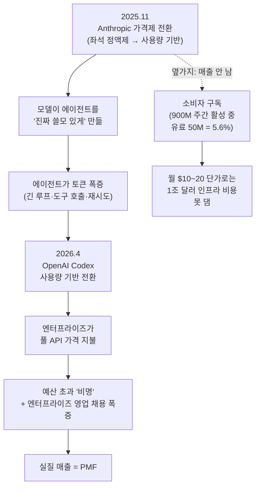

<figure class="post-figure post-figure--header">
  <svg role="img" aria-label="왼쪽은 월 20달러짜리 소비자 구독을 상징하는 작은 동전 더미, 오른쪽은 에이전트가 토큰을 태우는 거대한 모닥불에서 달러 청구서가 피어올라 AI 랩의 금고로 흘러드는 대비 그림" viewBox="0 0 640 300" shape-rendering="crispEdges" style="font-family:var(--font-body)">
    <!-- ── 왼쪽: 소비자 구독 = 작고 흔한 동전 더미 ($20) ── -->
    <g fill="currentColor">
      <!-- 동전 3개 (작은 더미) -->
      <ellipse cx="74" cy="232" rx="34" ry="11" fill="var(--badge-fill)" stroke="currentColor" stroke-width="2"/>
      <ellipse cx="74" cy="220" rx="30" ry="10" fill="var(--badge-fill)" stroke="currentColor" stroke-width="2"/>
      <ellipse cx="74" cy="209" rx="26" ry="9" fill="var(--badge-fill)" stroke="currentColor" stroke-width="2"/>
      <text x="74" y="213" text-anchor="middle" font-size="13" font-weight="700" fill="currentColor">$</text>
    </g>
    <text x="74" y="266" text-anchor="middle" font-size="16" font-weight="700" fill="currentColor">소비자 구독</text>
    <text x="74" y="286" text-anchor="middle" font-size="13" fill="var(--secondary-color)">월 $20 · 동전 더미</text>

    <!-- ── 가운데: 대비를 가르는 'VS' ── -->
    <line x1="160" y1="60" x2="160" y2="252" stroke="var(--border-color)" stroke-width="2" stroke-dasharray="3 6"/>
    <text x="160" y="150" text-anchor="middle" font-size="15" font-weight="700" fill="var(--accent-color)">VS</text>

    <!-- ── 오른쪽: 에이전트가 태우는 거대한 토큰 모닥불 ── -->
    <!-- 장작(태워지는 토큰들) -->
    <g fill="var(--bg-sunken)" stroke="currentColor" stroke-width="2">
      <rect x="252" y="238" width="120" height="12"/>
      <rect x="266" y="226" width="92" height="12"/>
    </g>
    <!-- 모닥불 화염 (크게 활활) -->
    <path d="M268 226 L284 176 L300 206 L312 150 L324 196 L336 168 L352 226 Z"
          fill="var(--accent-color)" stroke="currentColor" stroke-width="2" stroke-linejoin="round"/>
    <path d="M290 226 L304 188 L312 210 L322 184 L334 226 Z"
          fill="var(--secondary-color)" stroke="currentColor" stroke-width="2" stroke-linejoin="round"/>
    <!-- 불티(토큰 입자) -->
    <g fill="var(--accent-color)">
      <rect x="296" y="138" width="5" height="5"/>
      <rect x="332" y="146" width="4" height="4"/>
      <rect x="280" y="158" width="4" height="4"/>
    </g>
    <text x="312" y="270" text-anchor="middle" font-size="16" font-weight="700" fill="currentColor">에이전트의 토큰 모닥불</text>
    <text x="312" y="290" text-anchor="middle" font-size="13" fill="var(--accent-color)">$2,180어치를 활활</text>

    <!-- ── 불에서 피어오르는 달러 청구서 → 금고로 ── -->
    <g fill="var(--bg-panel)" stroke="currentColor" stroke-width="2">
      <rect x="396" y="120" width="34" height="22"/>
      <rect x="438" y="92" width="34" height="22"/>
      <rect x="480" y="70" width="34" height="22"/>
    </g>
    <g fill="var(--secondary-color)" font-size="13" font-weight="700" text-anchor="middle">
      <text x="413" y="136">$</text>
      <text x="455" y="108">$</text>
      <text x="497" y="86">$</text>
    </g>
    <!-- 흐름 화살표: 불 → 청구서 → 금고 -->
    <path d="M360 150 Q392 150 404 134" fill="none" stroke="var(--primary-color)" stroke-width="2"/>
    <path d="M512 78 Q548 84 556 132" fill="none" stroke="var(--primary-color)" stroke-width="2"/>
    <path d="M556 132 l-5 -8 l10 0 z" fill="var(--primary-color)" stroke="none"/>

    <!-- ── AI 랩의 금고 ── -->
    <g>
      <rect x="528" y="138" width="92" height="92" fill="var(--bg-light)" stroke="currentColor" stroke-width="3"/>
      <rect x="540" y="150" width="68" height="68" fill="none" stroke="var(--border-color)" stroke-width="2"/>
      <!-- 다이얼 -->
      <circle cx="574" cy="184" r="16" fill="var(--bg-sunken)" stroke="currentColor" stroke-width="2"/>
      <line x1="574" y1="184" x2="585" y2="174" stroke="currentColor" stroke-width="2"/>
      <line x1="574" y1="184" x2="574" y2="200" stroke="currentColor" stroke-width="2"/>
    </g>
    <text x="574" y="252" text-anchor="middle" font-size="16" font-weight="700" fill="var(--primary-color)">AI 랩 금고</text>
    <text x="574" y="272" text-anchor="middle" font-size="13" fill="currentColor">엔터프라이즈 풀가</text>
  </svg>
  <figcaption>매출은 구독 동전 더미가 아니라, 에이전트가 토큰을 태우는 곳에서 청구서가 되어 랩의 금고로 흘러든다.</figcaption>
</figure>

## 원문 정보

> - **제목**: I think Anthropic and OpenAI have found product-market fit
> - **출처**: Simon Willison ([simonwillison.net](https://simonwillison.net/2026/May/27/product-market-fit/))
> - **발행**: 2026-05-27 · 약 6분 분량
> - **원문 링크**: <https://simonwillison.net/2026/May/27/product-market-fit/>

AI 랩의 "수익화는 실패했다"는 서사가 끊이지 않는다. 이 글은 그 서사를 정면으로 반박하며, 진짜 제품-시장 적합성(PMF)이 어디서 나타났는지를 본인의 청구서와 공개 신호로 짚는다. AI가 산업·비즈니스를 바꾸는 방식을 다루므로 Articles의 `AI-Industry`에 담는다.

## 한 줄 요약 (TL;DR)

Anthropic과 OpenAI의 PMF는 9억 주간 활성 사용자의 소비자 구독이 아니라, **코딩 에이전트가 막대한 토큰을 태우고 그 비용을 엔터프라이즈가 풀 API 가격으로 지불하기 시작한 지점**에서 나타났다. 2025년 11월~2026년 4월의 가격제 전환(좌석 정액제 → 사용량 기반)이 그 변곡점이며, 기업들의 "AI 예산 초과" 비명과 엔터프라이즈 영업 채용 폭증이 그 증거다.

### 한눈에 보기

## 왜 이 글을 골랐나

이 위키의 Articles에는 "AI가 정말 가치를 만드는가, 그 가치는 어디에 귀속되는가"를 다투는 글이 여럿 있다. [소프트웨어 종말론을 해부한 글](/2026/06/19/software-is-evolving-not-dead.html)은 해자(moat)가 어디로 이동하는지를, [죽은 경제 이론](/2026/06/22/the-dead-economy-theory.html)은 AI가 만든 부가 어디로 집중되는지를 묻는다. Willison의 이 글은 그 한 단계 앞, **"랩들이 실제로 돈을 버는가, 번다면 어느 고객·어느 제품에서 버는가"**라는 가장 기초적인 질문에 본인의 청구서로 답한다.

특히 개발자에게 와닿는 이유는, 이 변곡점의 주인공이 추상적인 'AI'가 아니라 우리가 매일 쓰는 **코딩 에이전트(Claude Code, Codex)**라는 점이다. 우리의 `ccusage` 숫자가 곧 랩의 손익계산서다.

## 핵심 내용

### 1. 출발점: "수익화 실패"가 아니라 "첫 흑자 분기"

글은 두 가지 시중의 이야기에서 출발한다. 하나는 Anthropic이 **첫 흑자 분기**를 앞두고 있다는 소문(TechCrunch), 다른 하나는 여러 기업이 **직원들의 LLM 사용으로 청구서가 예상보다 비싸졌다며 놀라고 있다**는 이야기다. Willison은 이 두 신호를 하나로 묶는다 — OpenAI와 Anthropic이 PMF를 찾았기 때문이라고.

### 2. 본인 청구서: $200로 $2,180어치 토큰을 쓰고 있다

논증의 핵심 증거는 저자 자신의 사용량이다. 그는 Anthropic Max($100/월)와 OpenAI Pro($100/월), 합쳐 월 $200를 구독한다. 그런데 `ccusage` 도구로 지난 30일을 **API 토큰 가격으로 환산**해보니,

> - Claude Code: $1,199.79
> - OpenAI Codex: $980.37
> - 합계: **$2,180.16어치 토큰을 $200에** 쓰고 있었다.

핵심은 "구독이 싸서 좋다"가 아니다. **엔터프라이즈가 이 토큰을 풀 API 가격으로 지불하기 시작하면 랩이 포착하는 가치(value capture)가 10배 단위로 커진다**는 것이다. 파워 유저는 이미 벤더당 월 $1,000에 근접한다.

### 3. 변곡점: 좌석 정액제 → 사용량 기반 가격제

그 가치 포착을 현실로 만든 것이 **가격제 전환**이다.

- **Anthropic**: 2025년 11월부터 엔터프라이즈 플랜을 좌석 정액제에서 API 사용량 기반으로 전환(The Information).
- **OpenAI**: 2026년 4월 2일부터 Codex 가격을 메시지당 과금에서 **API 토큰 사용량 기반으로** 정렬(Codex rate card).

이전까지 엔터프라이즈는 좌석당 정액으로 토큰을 사실상 할인받아 썼다. 전환 이후엔 쓰는 만큼 낸다. 이것이 기업들의 "예산 초과" 비명의 직접 원인이자, 랩 매출의 변곡점이다.

### 4. 왜 지금인가: 에이전트가 "진짜 쓸모 있게" 됐기 때문

가격제만으로는 부족하다. 쓸 이유가 있어야 한다. 글은 **2025년 11월 즈음의 모델들이 에이전트를 비로소 진짜 쓸모 있게 만들었다**고 본다. 에이전트는

- 훨씬 더 많은 토큰을 태우고(긴 루프, 도구 호출, 재시도),
- 고연봉 전문직의 업무를 자동화하며,
- 그 적용 범위가 소프트웨어 엔지니어를 넘어 **훨씬 더 넓은 숙련 지식 노동자**로 확장된다.

토큰을 많이 태우는 것이 비용이 아니라 매출인 모델 — 이것이 소비자 챗봇과 결정적으로 다른 점이다.

### 5. 소비자 구독으로는 인프라 비용을 못 댄다

글은 "실패 서사"의 근거였던 소비자 숫자를 뒤집어 읽는다. OpenAI는 ChatGPT 주간 활성 사용자 **9억 명 이상**을 자랑하지만, 유료 소비자 구독자는 **5,000만 명, 즉 5.6%**뿐이다(Yahoo Finance). 월 $10~20짜리 구독 5,000만으로는 거론되는 **1조 달러 규모 인프라 투자**를 정당화할 수 없다.

> 하지만 사용자당 월 $200+를 쓰는 회사들은 그 지점에 훨씬 빨리 데려다준다.

즉 같은 사용자 수라도 **누가 어떤 단가로 쓰는가**가 손익을 가른다. ChatGPT가 "역사상 가장 빠르게 성장한 소비자 앱"(Reuters)이라는 사실은 PMF의 증거가 아니라, **매출이 나는 곳은 다른 데**라는 사실을 가린 착시였다는 것이다.

### 6. 채용이라는 누설 신호

마지막 증거는 **채용 공고**다. 진심으로 엔터프라이즈에 베팅하는 회사는 사람을 그쪽으로 뽑는다.

- **OpenAI**: 공개 채용 703건 중 229건(32.6%)이 엔터프라이즈 영업·지원.
- **Anthropic**: 390건 중 105건(26.9%)이 엔터프라이즈 중심.

이 "인간 노동에 대한 무거운 수요"가 엔터프라이즈 매출에 대한 진지한 커밋먼트를 드러낸다는 것이다.

### 7. 좋은 가격의 규칙: "이를 악물고, 그래도 예스"

글이 인용하는 가격 결정의 격언 하나.

> 내가 들은 최고의 가격 조언은, 고객이 (가격을 보고) **이를 악물며 숨을 들이켰다가, 그래도 '예스'라고 말하게** 하라는 것이었다.

엔터프라이즈가 Claude Code 청구서를 보고 비명을 지르면서도 **계속 결제한다**는 사실 — 그것이 바로 좋은 가격이자 PMF의 정의에 부합한다.

## 분석과 인사이트

여기서부터는 원문 요약이 아니라 내 관점이다.

**"PMF를 찾았다"의 진짜 의미는 '비용이 곧 매출인 제품'을 찾았다는 것이다.** 소비자 챗봇은 토큰을 많이 쓸수록 적자가 깊어지는 구조였다(정액 구독 + 추론 비용). 에이전트는 정반대다. 사용량 기반 과금에서는 **토큰을 많이 태우는 워크로드가 곧 고마진 매출**이 된다. Willison이 짚은 변곡점은 "모델이 좋아진 시점"이라기보다, **랩이 비용 센터를 매출 센터로 뒤집는 가격 구조를 장착한 시점**이라고 읽는 게 더 정확하다.

**그러나 "비명을 지르며 결제한다"가 영원히 지속될지는 이 글의 범위 밖이다.** 가격이 좋다는 것과 ROI가 증명됐다는 것은 다르다. Willison 본인도 인용하는 Uber 사례 — "지난 분기 코드 커밋의 25%가 Claude Code를 통했다"면서도 COO가 "실제로 출시한 유용한 기능과 직접 선을 긋지 못하면 그 거래는 정당화하기 어려워진다"고 인정한 대목 — 이 핵심이다. 이를 악물고 예스를 한 고객이, 다음 분기에 ROI를 못 찾으면 노(No)로 돌아설 수 있다. **PMF의 증거(지금 결제한다)와 지속가능성의 증거(가치를 회수한다)는 분리해서 봐야 한다.** 이 글은 전자를 설득력 있게 보였지만, 후자는 미해결로 남긴다.

**개발자에게 주는 함의는 두 가지다.** 첫째, **에이전트는 이제 명백한 비용 항목**이다. 내 `ccusage`가 회사 손익에 직접 잡히는 시대다. "토큰을 태운 만큼 가치를 돌려준다"를 증명하지 못하는 사용은 다음 예산 협상에서 잘린다 — 이는 [의도 부채(Intent Debt)](/2026/06/21/intent-debt.html)나 [agentic 분석의 검증 계층](/2026/06/22/self-service-data-analytics-with-claude.html) 같은 "결과 품질" 논의와 곧장 이어진다. 둘째, **랩의 인센티브가 어디 있는지 보인다.** 매출은 엔터프라이즈 에이전트 토큰에서 난다. 따라서 모델·도구·가격은 점점 더 "토큰을 많이, 그러나 정당화 가능하게 태우는 엔터프라이즈 워크로드"를 향해 최적화될 것이다.

**한계도 분명히 해두자.** 이 글은 본인 청구서 + 공개 보도 + 채용 통계에 기반한 **추론(thesis)**이지, 랩의 감사받은 재무제표가 아니다. "첫 흑자 분기"는 소문이고, 인프라 1조 달러도 거론되는 수치다. Willison 자신이 제목에 "I think"를 붙였다. 강한 정황이되 확정은 아니라는 톤을 유지해 읽는 게 맞다.

## 적용 포인트

- **`ccusage`(또는 동등 도구)로 본인 토큰 사용량을 API 가격으로 환산해보라.** 구독으로 가려진 진짜 단가를 알아야 회사 차원의 비용 대화가 가능하다.
- **에이전트 사용을 "출시한 가치"와 연결하는 지표를 만들어라.** "커밋의 N%가 에이전트"가 아니라 "출시한 기능 M개"로. ROI를 못 그으면 다음 예산에서 잘린다.
- **좌석 정액제가 끝났다고 가정하고 비용을 설계하라.** 사용량 기반에서는 무절제한 긴 루프·재시도가 곧 청구서다. 컨텍스트·루프 효율이 비용 최적화다.
- **벤더의 인센티브를 읽어라.** 매출이 엔터프라이즈 에이전트에서 나므로, 가격·기능·정책 변화는 그 방향으로 기운다. 소비자 플랜의 관대함을 영구적이라 믿지 말 것.
- **PMF 신호와 지속가능성 신호를 분리해 추적하라.** "지금 비명 지르며 결제한다"(가격 좋음)와 "다음 분기에도 결제한다"(ROI 증명됨)는 다른 데이터다.

## 마무리

Willison의 진단은 단순하면서 강하다 — AI 랩의 PMF는 9억 명의 무료 챗봇 사용자가 아니라, **코딩 에이전트가 태우는 토큰을 풀 가격에 지불하기 시작한 소수의 엔터프라이즈**에서 나타났다. 변곡점은 모델이 좋아진 것이 아니라, 비용이 매출로 뒤집히는 가격 구조가 장착된 것이다. 다만 "이를 악물고도 예스"가 "ROI를 회수했다"와 같지 않다는 점, 그리고 이 모든 게 감사받은 재무제표가 아닌 정황 추론이라는 점은 독자가 직접 보정해야 한다. 우리 개발자에게 남는 한 줄은 이것이다 — **이제 당신의 토큰 사용량은 누군가의 손익계산서에 적힌다.**

### 더 읽어보기

- [원문 — I think Anthropic and OpenAI have found product-market fit (Simon Willison)](https://simonwillison.net/2026/May/27/product-market-fit/)
- [소프트웨어는 죽는 게 아니라 재평가된다](/2026/06/19/software-is-evolving-not-dead.html) — AI 시대 해자(moat)가 어디로 이동하는지, 가치 귀속의 다른 면
- [죽은 경제 이론(The Dead Economy Theory)](/2026/06/22/the-dead-economy-theory.html) — AI가 만든 부가 어디로 집중되는가, 매크로 관점의 짝패
- [AI는 왜 소프트웨어 엔지니어를 대체하지 못했나](/2026/06/19/ai-hasnt-replaced-engineers.html) — "AI가 일을 한다"는 서사를 비용·결과 관점에서 검증
- [Intent Debt: 에이전트가 대신 갚아줄 수 없는 부채](/2026/06/21/intent-debt.html) — 토큰을 태운 만큼 가치를 돌려주려면 무엇이 필요한가
- [데이터는 소프트웨어가 아니다 — Anthropic의 셀프서비스 분석](/2026/06/22/self-service-data-analytics-with-claude.html) — 엔터프라이즈가 에이전트로 실제 가치를 뽑아내는 구조
