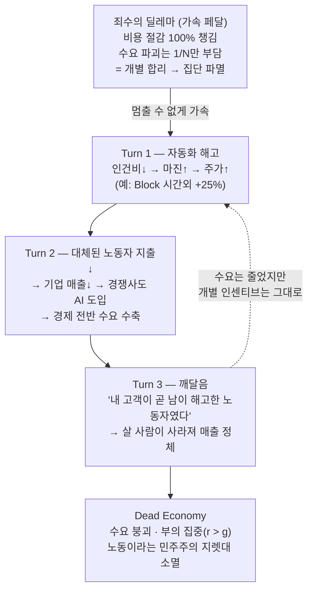

<figure class="post-figure post-figure--header">
<svg role="img" aria-label="죽은 경제: 톱니바퀴가 돌아가며 황금이 쌓이는 자동화 성채는 풍요롭지만, 그 아래 시장의 좌판은 텅 비고 소비자가 한 명도 없다 — 풍요롭게 돌아가지만 아무도 필요로 하지 않는 경제" viewBox="0 0 640 300" xmlns="http://www.w3.org/2000/svg" shape-rendering="crispEdges">
  <title>Dead Economy — 풍요롭게 자동화돼 돌아가지만 소비자만 사라진 텅 빈 시장</title>
  <!-- ground line dividing citadel (top) from empty market (bottom) -->
  <line x1="24" y1="196" x2="616" y2="196" stroke="currentColor" stroke-width="1.5" opacity="0.45"/>

  <!-- ===== TOP: the automated citadel — plenty, humming, no people ===== -->
  <!-- citadel wall / ramparts (pixel crenellations) -->
  <g fill="var(--secondary-color)" opacity="0.9">
    <rect x="40" y="92" width="220" height="104"/>
    <rect x="40" y="80" width="20" height="14"/>
    <rect x="76" y="80" width="20" height="14"/>
    <rect x="112" y="80" width="20" height="14"/>
    <rect x="148" y="80" width="20" height="14"/>
    <rect x="184" y="80" width="20" height="14"/>
    <rect x="220" y="80" width="20" height="14"/>
  </g>
  <!-- two automation gears turning inside the citadel -->
  <g fill="none" stroke="var(--gold)" stroke-width="6">
    <circle cx="100" cy="140" r="26"/>
    <circle cx="172" cy="158" r="18"/>
  </g>
  <g fill="var(--gold)">
    <!-- big gear teeth -->
    <rect x="96" y="106" width="8" height="10"/><rect x="96" y="164" width="8" height="10"/>
    <rect x="66" y="136" width="10" height="8"/><rect x="124" y="136" width="10" height="8"/>
    <!-- small gear teeth -->
    <rect x="168" y="132" width="8" height="9"/><rect x="168" y="175" width="8" height="9"/>
    <rect x="146" y="154" width="9" height="8"/><rect x="189" y="154" width="9" height="8"/>
  </g>
  <!-- piled-up gold coins on the rampart: wealth concentrates -->
  <g fill="var(--badge-fill)" stroke="currentColor" stroke-width="1">
    <ellipse cx="224" cy="184" rx="14" ry="5"/>
    <ellipse cx="224" cy="178" rx="14" ry="5"/>
    <ellipse cx="224" cy="172" rx="14" ry="5"/>
    <ellipse cx="208" cy="184" rx="11" ry="4"/>
    <ellipse cx="208" cy="179" rx="11" ry="4"/>
    <ellipse cx="242" cy="186" rx="11" ry="4"/>
  </g>
  <!-- Horde banner flying over the citadel -->
  <line x1="276" y1="58" x2="276" y2="120" stroke="currentColor" stroke-width="2.5"/>
  <path d="M276,60 L320,68 L312,82 L320,96 L276,90 Z" fill="var(--accent-color)" stroke="currentColor" stroke-width="1"/>
  <text x="150" y="216" text-anchor="middle" font-size="12" fill="currentColor" font-weight="700">자동화 성채 — 풍요·집중</text>

  <!-- warlord silhouette on the rampart, looking down at the empty market -->
  <g fill="currentColor">
    <rect x="296" y="150" width="14" height="30"/>           <!-- body -->
    <rect x="298" y="138" width="10" height="10"/>           <!-- head -->
    <rect x="292" y="138" width="4" height="4"/><rect x="310" y="138" width="4" height="4"/> <!-- tusks/topknot hint -->
    <rect x="308" y="148" width="18" height="3"/>            <!-- Gorehowl haft -->
    <rect x="322" y="142" width="8" height="9"/>             <!-- axe head -->
  </g>

  <!-- ===== BOTTOM: the market — stalls stand, nobody buys ===== -->
  <!-- empty market stalls (awnings on posts, no shoppers) -->
  <g stroke="currentColor" stroke-width="2" fill="none" opacity="0.85">
    <!-- stall 1 -->
    <line x1="80" y1="232" x2="80" y2="270"/><line x1="140" y1="232" x2="140" y2="270"/>
    <path d="M70,232 L150,232 L138,218 L82,218 Z" fill="var(--bg-sunken)"/>
    <line x1="80" y1="252" x2="140" y2="252"/>
    <!-- stall 2 -->
    <line x1="200" y1="232" x2="200" y2="270"/><line x1="260" y1="232" x2="260" y2="270"/>
    <path d="M190,232 L270,232 L258,218 L202,218 Z" fill="var(--bg-sunken)"/>
    <line x1="200" y1="252" x2="260" y2="252"/>
    <!-- stall 3 -->
    <line x1="320" y1="232" x2="320" y2="270"/><line x1="380" y1="232" x2="380" y2="270"/>
    <path d="M310,232 L390,232 L378,218 L322,218 Z" fill="var(--bg-sunken)"/>
    <line x1="320" y1="252" x2="380" y2="252"/>
    <!-- stall 4 -->
    <line x1="440" y1="232" x2="440" y2="270"/><line x1="500" y1="232" x2="500" y2="270"/>
    <path d="M430,232 L510,232 L498,218 L442,218 Z" fill="var(--bg-sunken)"/>
    <line x1="440" y1="252" x2="500" y2="252"/>
  </g>
  <!-- a tumbleweed-ish empty marker (no buyers) -->
  <circle cx="560" cy="262" r="10" fill="none" stroke="currentColor" stroke-width="1.5" stroke-dasharray="3 3" opacity="0.6"/>
  <text x="320" y="292" text-anchor="middle" font-size="13" fill="var(--accent-color)" font-weight="700">텅 빈 시장 — 살 사람이 없다</text>
</svg>
<figcaption>'Dead Internet'을 비튼 'Dead Economy' — 위의 성채는 톱니바퀴가 돌고 황금이 쌓여 풍요롭지만, 아래 좌판엔 살 사람이 한 명도 없다. 풍요롭게 돌아가지만 누구도 필요로 하지 않는 경제.</figcaption>
</figure>

## 원문 정보

> - **제목**: The Dead Economy Theory
> - **출처**: Owen McGrann — *The Palimpsest* (Substack, [owenmcgrann.com](https://www.owenmcgrann.com))
> - **발행**: 2026-05-01
> - **원문 링크**: <https://www.owenmcgrann.com/p/the-dead-economy-theory>

이 글을 `Articles`에 담는 맥락: AI 시대 *엔지니어/일의 미래*를 다룬 위키의 다른 글들이 대개 "개인은 무엇을 준비해야 하나"에 답한다면, 이 글은 그보다 한 층 위 — **AI가 노동을 대체할 때 경제와 민주주의라는 판 자체가 어떻게 무너지는가**를 거시적으로 논증한다.

## 한 줄 요약 (TL;DR)

AI 노동 대체는 *기술이 너무 똑똑해져서*가 아니라 **기업이 분기 실적을 좇는 합리적 인센티브** 때문에 일어나고, 그 합리적 선택들이 모여 소비 수요를 파괴하고 부를 (과세하기 어려운) AI 인프라에 집중시킨다. 노동이 경제적으로 불필요해지면 **피지배자가 지배자에게 쥐고 있던 지렛대(노동·세수·소비·병역)가 사라지고**, 민주주의는 협상력을 잃는다. 저자는 이것을 카뮈–사르트르 논쟁에 빗대 닫는다 — **"지금 살아 있는 사람을 가상의 미래를 위한 비용으로 취급해선 안 된다."**

## 왜 이 글을 골랐나

이 위키의 `Articles`에는 AI와 일의 미래를 다룬 글이 많다. [AI는 왜 엔지니어를 대체하지 못했나](/2026/06/19/ai-hasnt-replaced-engineers.html)는 "대체했다"는 해고 서사가 대개 워싱이라 봤고, [전문성 재설계](/2026/06/22/ai-era-expertise-redesign.html)는 개인이 검증·암묵지로 살아남는 법을 말했다. 그 글들이 **미시(개인·팀)** 차원의 적응을 다룬다면, 이 글은 **거시(경제·정치)** 차원에서 "설령 개인이 잘 적응해도, 그 적응이 모인 결과가 시스템을 무너뜨릴 수 있다"는 불편한 가능성을 정면으로 다룬다.

특히 이 글의 칼끝은 **"기술 결정론에 책임을 떠넘기지 말라"**는 데 있다. AI가 일자리를 없애는 게 자연법칙이 아니라 **기업의 인센티브 구조가 만든 죄수의 딜레마**라는 진단은, "어쩔 수 없는 흐름"이라는 흔한 체념을 정면으로 반박한다. 비관적이지만 게으른 비관이 아니라 — 경제학·역사·철학을 끌어와 논증을 세운다는 점에서 골랐다. (단, 저자의 결론에 동의할 필요는 없다. 아래 "분석과 인사이트"에서 이견도 함께 정리했다.)

### 한눈에 보기

이 글의 척추는 하나의 인과 순환이다 — 해고가 마진과 주가를 올리고(Turn 1), 그 해고가 소비를 줄여 매출을 깎고(Turn 2), 결국 "내 고객이 곧 남이 해고한 노동자였다"는 수요 붕괴로 돌아온다(Turn 3). 그런데도 멈추지 못하는 이유는 **죄수의 딜레마** — 비용 절감 이익은 100% 내 것이지만 수요 파괴 비용은 1/N만 부담하기에, 개별의 합리가 집단의 파멸로 달려가며 이 고리에 가속 페달을 밟는다.

## 핵심 내용

원문의 흐름을 따라 정리한다. (사실·인용은 원문에 충실하게 옮기고, 내 해석은 다음 섹션에서 분리한다. 일부 통계·인용은 저자가 본문에서 제시한 출처를 그대로 따른 것으로, 저자의 논증 안에서 인용한다.)

### 'Dead Internet Theory'의 더 나쁜 버전

저자는 인터넷 신규 콘텐츠의 절반 이상이 이미 AI 생성물이라는 'Dead Internet Theory'를 출발점으로 삼는다. 그리고 그보다 **더 나쁜 시나리오** — 경제 자체가 죽는 'Dead Economy' — 를 제시한다. 핵심 전제는 단순하다. **현재 AI 산업의 천문학적 밸류에이션을 정당화하려면, 대규모로 노동을 대체하는 길밖에 없다**는 것.

### AI 산업의 '숫자 문제'

저자에 따르면 AI 투자는 이미 수천억 달러 규모이고, 수조 달러가 예고돼 있다. OpenAI 같은 회사는 수익성 없이도 **8천억 달러 이상**으로 평가받는데, 이 밸류에이션을 떠받치려면 충분히 거대한 시장이 필요하다 — 그리고 *"그만큼 큰 시장은 하나뿐이다: 전 세계 노동 시장(The only market large enough: the global labor market)."*

그 증거로 저자는 AI 회사들이 발표하는 벤치마크(GDPVal, AI Productivity Index 등)가 **전문직 업무를 직접 겨냥**한다는 점을 든다. 일부 모델은 인간 전문가 대비 *"80퍼센트 이상의 승률(over an 80 percent win rate)"*을 보고한다.

### 3턴(Three-Turn) 경제 붕괴 모델

저자는 그 결과를 세 턴으로 모델링한다.

- **Turn 1 — 비용 절감 → 마진 확대 → 주가 상승.** 예시로 Block(Jack Dorsey)의 해고 발표가 시간외 거래에서 25% 급등을 부른 일을 든다. 자동화로 인건비를 줄이면 곧장 마진이 오르고 주가가 보상한다.
- **Turn 2 — 대체된 노동자가 지출을 줄인다 → 기업 매출이 감소한다 → 경쟁에서 살아남으려 더 많은 기업이 AI를 도입한다 → 수요가 경제 전반에서 수축한다.** 한 회사의 비용 절감이 다른 회사의 매출 감소로 번지는 연쇄.
- **Turn 3 — 기업들이 깨닫는다: 자기 고객이 사실은 *다른 회사가 해고한 노동자*였다.** 효율은 올랐는데 살 사람이 사라져 매출이 정체된다. 저자의 질문: *"고객이 곧 당신이 없앤 그것일 때, 고객은 누구인가(Who is the customer when the customer is the thing you've eliminated?)"*

### 죄수의 딜레마 프레임 (Wharton 연구)

그렇다면 왜 멈추지 못하는가. 저자는 Wharton 연구를 인용해 이를 **죄수의 딜레마**로 설명한다. 자동화하는 개별 기업은 **비용 절감의 이익을 전부(100%) 가져가지만**, 그로 인한 수요 파괴는 **일부만(예: 경쟁자가 20곳이면 1/20) 부담**한다. 그래서 각자 합리적으로 행동해도 전체는 *"집단적 파멸(collective ruin)"*로 달려간다. 그리고 **AI가 좋아질수록 이 동학은 더 격해진다** — 자동화의 유혹이 커지기 때문이다.

<figure class="post-figure">
<svg role="img" aria-label="죄수의 딜레마의 인센티브 비대칭: 자동화한 기업은 비용 절감 이익을 100% 다 가져가지만, 그로 인한 수요 파괴 비용은 경쟁자 N곳에 나뉘어 1/N만 부담한다. 그래서 개별로는 자동화가 늘 합리적이고, 전체는 집단 파멸로 달려간다" viewBox="0 0 640 300" xmlns="http://www.w3.org/2000/svg" shape-rendering="crispEdges">
  <title>죄수의 딜레마 — 비용 절감 이익은 100% 독차지, 수요 파괴 비용은 1/N만 부담</title>

  <!-- the deciding firm in the middle -->
  <rect x="270" y="128" width="100" height="44" fill="var(--bg-sunken)" stroke="currentColor" stroke-width="2"/>
  <text x="320" y="146" text-anchor="middle" font-size="12" fill="currentColor" font-weight="700">개별 기업</text>
  <text x="320" y="162" text-anchor="middle" font-size="11" fill="currentColor">"자동화할까?"</text>

  <!-- LEFT side: benefit captured 100% (one fat arrow back to self) -->
  <text x="150" y="60" text-anchor="middle" font-size="13" fill="var(--secondary-color)" font-weight="700">이익: 비용 절감</text>
  <rect x="86" y="78" width="128" height="34" fill="var(--secondary-color)" opacity="0.85"/>
  <text x="150" y="100" text-anchor="middle" font-size="14" fill="var(--bg-panel)" font-weight="700">100% 내 것</text>
  <!-- arrow from benefit straight to the firm (all of it) -->
  <line x1="214" y1="112" x2="276" y2="138" stroke="var(--secondary-color)" stroke-width="6" marker-end="url(#arrowGood)"/>

  <!-- RIGHT side: cost (demand destruction) split across N rivals → only 1/N lands on self -->
  <text x="490" y="60" text-anchor="middle" font-size="13" fill="var(--accent-color)" font-weight="700">비용: 수요 파괴</text>
  <!-- the cost bar split into N slices; only the first slice is "mine" -->
  <g stroke="currentColor" stroke-width="1">
    <rect x="426" y="78" width="16" height="34" fill="var(--accent-color)"/>
    <rect x="442" y="78" width="16" height="34" fill="var(--accent-color)" opacity="0.3"/>
    <rect x="458" y="78" width="16" height="34" fill="var(--accent-color)" opacity="0.3"/>
    <rect x="474" y="78" width="16" height="34" fill="var(--accent-color)" opacity="0.3"/>
    <rect x="490" y="78" width="16" height="34" fill="var(--accent-color)" opacity="0.3"/>
    <rect x="506" y="78" width="16" height="34" fill="var(--accent-color)" opacity="0.3"/>
    <rect x="522" y="78" width="16" height="34" fill="var(--accent-color)" opacity="0.3"/>
    <rect x="538" y="78" width="16" height="34" fill="var(--accent-color)" opacity="0.3"/>
  </g>
  <text x="434" y="128" text-anchor="middle" font-size="10" fill="currentColor" font-weight="700">1/N</text>
  <text x="490" y="128" text-anchor="middle" font-size="10" fill="currentColor" opacity="0.7">나머지는 경쟁사·사회로</text>
  <!-- thin arrow: only 1/N of the cost returns to the firm -->
  <line x1="434" y1="116" x2="368" y2="138" stroke="var(--accent-color)" stroke-width="2" stroke-dasharray="4 3" marker-end="url(#arrowBad)"/>

  <!-- bottom verdict -->
  <line x1="60" y1="206" x2="580" y2="206" stroke="currentColor" stroke-width="1" opacity="0.3"/>
  <text x="320" y="232" text-anchor="middle" font-size="13" fill="currentColor" font-weight="700">이익 100% &gt; 부담 1/N  →  자동화는 개별로 늘 합리적</text>
  <text x="320" y="262" text-anchor="middle" font-size="13" fill="var(--accent-color)" font-weight="700">모두가 그렇게 행동 → 집단 파멸(collective ruin)</text>
  <text x="320" y="284" text-anchor="middle" font-size="11" fill="currentColor" opacity="0.7">AI가 좋아질수록 유혹↑ → 동학은 더 격해진다</text>

  <defs>
    <marker id="arrowGood" markerWidth="8" markerHeight="8" refX="6" refY="4" orient="auto">
      <path d="M0,0 L8,4 L0,8 Z" fill="var(--secondary-color)"/>
    </marker>
    <marker id="arrowBad" markerWidth="8" markerHeight="8" refX="6" refY="4" orient="auto">
      <path d="M0,0 L8,4 L0,8 Z" fill="var(--accent-color)"/>
    </marker>
  </defs>
</svg>
<figcaption>인센티브의 비대칭이 죄수의 딜레마의 심장이다 — 비용 절감 이익은 <strong>100% 내 것</strong>이지만, 수요 파괴 비용은 경쟁자 N곳에 흩어져 <strong>1/N만</strong> 돌아온다. 그래서 개별로는 자동화가 늘 합리적이고, 그 합리들이 모여 집단 파멸로 달려간다.</figcaption>
</figure>

### 왜 과거의 자동화는 위안이 못 되나

"과거에도 기술이 일자리를 없앴지만 결국 더 좋아졌다"는 흔한 반론에 저자는 **세 가지 차이**로 답한다.

- **시간 척도.** 농업 전환은 140년, 산업혁명은 임금 회복까지 70년이 걸렸다. 그 중간기엔 임금 정체·이윤 급증·불평등 심화·사회 격변이 있었다. 저자는 Bharat Ramamurti를 인용해 이번엔 그 시간이 *"2년"*으로 압축됐다고 본다. 그리고 경제학자들이 인정하는 단서 — *"단기의 조정 비용은 누군가에겐 평생일 수 있다(the short run can be a lifetime)."*
- **범위.** 과거 자동화는 **특정 과업**(직조를 대체한 역직기 등)을 대체했지만, 범용 AI는 **인지 노동 전반**을 동시에 건드린다.
- **규모.** 여러 산업에서 동시에 일어난다. 저자는 Wassily Leontief의 *말(horse)* 비유를 든다 — 내연기관 등장 60년 만에 미국의 말 개체수는 88% 줄었다. 일부 과업에서 보완재였던 말이 결국 대체됐듯, 인간 노동도 그럴 수 있다는 경고다.

다만 저자는 반대 방향의 증거도 함께 적는다. Daron Acemoglu(2024 노벨상)는 1987–2017년 자동화의 **대체 효과가 생산성 이득을 크게 압도**했다고 봤고, *현재* 시점에선 자동화가 비용 대비 효율적인 과업이 **4.6%**에 불과해 향후 10년 생산성 영향이 **0.66%** 정도로 추정된다고도 적는다 — 즉 위기는 "지금 당장 다 대체된다"가 아니라 **인센티브가 그 방향을 가리킨다**는 데 있다.

### 민주주의 거버넌스의 위기

이 글의 정치적 핵심은 여기다. 저자는 민주주의가 **물질적 지렛대**에 기댄다고 본다 — *"피지배자는 지배자가 필요로 하는 무언가를 쥐고 있다: 노동, 세수, 병역, 소비(The governed have something the governors need: labor, tax revenue, military service, consumer spending)."*

여기서 **노동을 빼면** 어떻게 되는가(*"Remove labor from that equation and watch what happens."*). 세원이 무너지고, 단체교섭은 형해화되며, 소비가 수축하고, Piketty의 **r > g**(자본 수익률이 성장률을 앞섬)가 가속돼 *"결국 거의 모든 것이 전환기에 가장 부유했던 자들에게 귀속"*된다. 저자는 여기에 **공공 자금의 역설**을 더한다 — 트랜스포머 아키텍처, DARPA 자금처럼 **연구 위험은 공공이 졌는데 보상은 민간이 챙겼다**는 것.

### 권위주의의 이점과 정치적 재편

노동의 지렛대가 사라지면 **권위주의가 상대적으로 유리해진다**고 저자는 본다. 민주 정부는 대체로 인한 선거 후폭풍을 감당해야 하지만, 권위주의 정부는 **감시·통제라는 배당** 위에 경제 효율까지 얻는다. 사우디아라비아·UAE·싱가포르 같은 곳이 매력적인 고객이 되고, 기술 산업의 인센티브는 점점 자치권 없는 체제(autocracy) 쪽을 가리킨다는 진단이다.

### 분배 해법은 왜 부족한가 (UBI·재교육의 한계)

저자는 표준적 처방 — UBI, 재교육, '여가 경제' — 이 문제를 **단순한 분배 문제**로 오인한다고 본다. 그리고 반례를 쌓는다.

- Anne Case & Angus Deaton의 *"절망의 죽음(deaths of despair)"* — 실직과 함께 늘어나며, 메커니즘은 단지 빈곤이 아니라 **경제적 목적의 상실**이다.
- Guy Standing의 *"프레카리아트(precariat)"* — 영구적 경제 불안정이 주는 심리적 손상.
- Piketty는 UBI가 교육 접근성·저생산성 일자리·부패·역진세 같은 **구조적 문제를 비껴간다**고 본다.
- 저자는 Anthropic 자신의 연구도 인용한다 — AI 코딩 에이전트를 쓴 주니어 엔지니어가 **속도 이득 없이 이해도만 떨어졌다**는 결과.
- 그리고 미국 유권자들은 UBI 수표보다 **일자리 보장**을 선호한다는 점.

### 지적 부정직과 '빈약한 철학'

저자는 실리콘밸리의 철학 인용이 **피상적**이라고 신랄하게 비판한다. 니체의 위버멘쉬를 "창업자는 윤리에서 면제된다"는 식으로 오독하지만 정작 니체라면 그들을 *"마지막 인간(last men)"*이라 불렀을 것이고, 효과적 이타주의(EA)는 Bernard Williams·Derek Parfit의 경고를 건너뛰어 SBF 사태로 걸어 들어갔으며, 롱터미즘은 *"엄밀함 빠진 Parfit의 재탕"*으로 가상의 미래를 위해 현재의 고통을 정당화한다는 것. 합리주의는 베이즈 인식론을 계시처럼 다루며 20세기 과학철학(Kuhn·Lakatos·Feyerabend)을 무시한다고 본다.

여기에 **경제적 비문해(illiteracy)**도 더한다 — Goldman Sachs는 7% 생산성 효과를 전망했지만 현실의 추정은 0.5–3.5%(McKinsey)에 그치고, 4분의 1조 달러를 투자하고도 **기업의 90%가 측정 가능한 효과가 없다**고 보고한다는 것.

### 공적 메시지와 사적 메시지의 모순

저자는 OpenAI의 이중성을 든다. 공개 백서(4월)에서는 **주 32시간 노동·증세·공공 부유 기금**을 제안하면서, 동시에 AI 규제와 노동세를 발의한 정치인(Alex Bores)을 겨냥해 **2백만 달러 이상을 쓰는 슈퍼팩**에 자금을 댔고, 투자자 수익을 100배로 제한하던 이익 상한(profit cap)을 제거했다는 것. 로비스트 Chris Lehane이 AI의 부정적 측면을 보인 연구를 억눌렀다는 주장과, 이를 *"이론 물리가 아니라 응용 물리"*로 프레이밍했다는 대목도 인용한다.

### 카뮈–사르트르 프레임

저자가 글의 도덕적 척추로 삼는 건 **카뮈와 사르트르의 분기**다. 마르크스주의적 논변("역사엔 방향이 있고, 혁명엔 희생이 필요하다")이나 사르트르적 구조(궁극의 이익이 현재의 혼란을 정당화한다)는, AI 가속론의 *"우리가 직접 이 혁명을 앞당길지 말지가 유일한 선택"*(Mechanize 창업자들)이라는 논리와 같은 형태라는 것. 저자는 이를 굴라크의 논리 — **기술 결정론을 도덕적 면죄부로 쓰는 것** — 에 빗댄다. 그리고 카뮈의 반론을 들이댄다: *"지금 살아 있는 사람을 가상의 미래 이익을 위한 허용 가능한 사상자로 취급하는 모든 시스템은 근본적 도덕적 오류를 범한다."* 핵심 한 줄 — *"당신 앞에 서 있는 사람은 효용 함수의 입력값이 아니다(The person standing in front of you is not an input to a utility function)."*

### 지식의 소멸 메커니즘

자동화는 **소비력만이 아니라 축적된 노동자의 이해**도 함께 지운다. 저자는 Boeing이 은퇴자를 재고용하고 TSMC가 지식 격차에 직면한 사례를 든다. *"80% 역량"*의 AI라도 인간이 인지적으로 쥐고 있던 **나머지 20%**를 제거해 버린다는 것.

### 이미 진행된 규제 포획

저자는 AI 투자가 2025년 1–3분기 미국 경제 성장의 **39%**를 차지했다고 적으며, 연방 정부가 이 붐을 떠받치는 데 이해관계를 갖게 됐다고 본다. 규제자–피규제자가 수렴하고, 전문성 비대칭은 극복하기 어렵고, **AI 시스템이 AI 거버넌스를 자문하는** 피드백 루프가 닫혀 간다는 진단이다.

### 알려진 개입책 — 그러나 실행되지 않은

마지막으로 저자는 **기술적으론 가능하지만 정치적으론 실현되지 못한** 개입들을 나열한다 — AI 인프라에 대한 공적 지분, 강력한 반독점 집행, 자동화 노동에 대한 과세, 그리고 Branko Milanovic이 제안한 **자본 소유의 광범한 분산 + 최고 자본 소득에 대한 공격적 과세**. 전부 실행 가능하지만, 그것을 발의하는 정치인을 무너뜨리는 데 수백만 달러가 쓰이는 한 **정치적으로 불가능**하다는 게 저자의 비관이다.

## 분석과 인사이트

여기서부터는 원문 요약이 아니라 내 관점이다.

- **이 글의 진짜 기여는 "기술 결정론에서 인센티브 구조로" 책임을 옮긴 것이다.** 흔한 AI 종말론은 "모델이 너무 강해져서 어쩔 수 없다"는 *능력*의 이야기다. 저자는 그 프레임을 거부한다 — 현재 효율적으로 자동화 가능한 과업이 4.6%뿐이라는 통계까지 인용하면서도 위기를 주장하는 이유가 바로 이것이다. 문제는 **AI의 똑똑함이 아니라 "충분히 쓸 만하면서 싼" 자동화를 분기 실적이 강제한다는 것**이다. 죄수의 딜레마는 이 논증의 심장이다: 개별 합리성이 집단 파멸을 낳는 구조에선, "각자 알아서 잘하면 된다"는 처방이 작동하지 않는다.

- **이 글은 우리 위키의 미시 서사들에 대한 거시적 반례로 읽힌다.** [전문성 재설계](/2026/06/22/ai-era-expertise-redesign.html)와 [노동시장에서 살아남기](/2026/06/22/surviving-in-the-job-market.html)는 "개인이 검증 능력·암묵지·포지셔닝으로 살아남으라"고 말한다. 옳은 처방이다. 하지만 이 글은 **합성의 오류(fallacy of composition)**를 찌른다 — 모두가 잘 적응해도, 그 적응이 *수요를 떠받치던 임금*을 같이 없애면 시장 자체가 줄어든다. 두 관점은 모순이 아니라 **층위가 다르다**. 개인은 여전히 적응해야 하지만, "내가 적응하면 끝"이라는 안도는 시스템 차원에선 보장되지 않는다.

- **이 글은 [AI 워싱 해고 서사](/2026/06/19/ai-hasnt-replaced-engineers.html)와 정면으로 긴장한다 — 그리고 그 긴장이 흥미롭다.** 그 글은 "AI가 해고했다"는 서사 대부분이 워싱이고 실제 대체는 과장됐다고 봤다. 이 글의 "지식 소멸 → 은퇴자 재고용"(Boeing) 사례는 *그 진단을 보강*한다(섣부른 해고는 되돌려진다). 하지만 동시에 이 글은 **"워싱이든 아니든, 주가가 해고에 25% 보상하는 인센티브 자체가 동력"**이라고 본다 — 즉 실제 대체 여부와 무관하게 *해고를 부추기는 시장 신호*가 문제다. 두 글을 겹쳐 읽으면 "대체는 과장됐지만 대체하려는 인센티브는 진짜"라는, 더 정교한 그림이 나온다.

- **'r > g'와 과세 불가능성의 결합이 가장 날카로운 통찰이다.** 부가 노동(과세하기 쉬움)에서 **자동화 인프라(과세하기 어려움)**로 옮겨가면, 재분배의 *손잡이*가 손에서 빠져나간다. UBI 비판이 설득력 있는 이유도 여기다 — UBI는 **재원**(누구에게 무엇으로 과세할 것인가)을 전제하는데, 그 재원이 구조적으로 빠져나가는 중이라면 UBI는 출발선에서부터 흔들린다. 저자가 분배 해법을 일축한 건 "나눠 줄 필요 없다"가 아니라 "**나눠 줄 손잡이가 사라진다**"는 더 무서운 주장이다.

- **다만 이 글은 *논증*이지 *예측*이 아니라는 점을 분명히 해야 한다.** 저자도 Acemoglu·McKinsey를 인용하며 *현재의* 생산성 효과가 미미함을 인정한다. 즉 "Dead Economy"는 **확정된 미래가 아니라 인센티브가 가리키는 방향**이다. 글의 비관은 강력하지만, 같은 인센티브 분석은 *반대 방향*으로도 작동할 수 있다 — 수요 붕괴가 기업에 손해라면(Turn 3), 기업·국가에는 **수요를 지킬 인센티브**도 생긴다(저자의 OpenAI 백서 인용이 역설적으로 이를 보여 준다). 저자는 그 가능성을 "공적 메시지와 사적 행동의 모순"으로 일축하지만, 나는 그 모순이 *아직 결판나지 않은 줄다리기*의 증거라고 본다. 죄수의 딜레마는 **반복 게임(iterated game)**이 되면 협력 균형도 가능하다 — 저자가 덜 다룬 출구다.

- **'80% AI가 나머지 20%를 지운다'는 지식 소멸 논리는 실무자에게 가장 직접적이다.** 이는 [전문성 재설계](/2026/06/22/ai-era-expertise-redesign.html)의 *인지부채·의도부채*와 정확히 같은 메커니즘을 **경제 전체 규모로** 확대한 것이다 — 개인·팀 차원의 "이해의 소멸"이, 거시 차원에선 "산업 전체의 암묵지 소멸"이 된다. 우리가 팀에서 본 패턴이 사회 규모로 반복될 수 있다는 경고로 읽으면, 개인 처방("암묵지를 박제하라")의 **사회적 버전**(지식의 공적 보존)이 왜 필요한지가 보인다.

## 적용 포인트

이 글은 거시 담론이라 "오늘 당장 코드에 적용"할 항목은 적다. 대신 **사고의 프레임**으로 가져갈 것들이다.

- **"AI가 어쩔 수 없이 한다"는 표현을 들으면 "누구의 어떤 인센티브가 그렇게 만드나"로 되물어라.** 기술 결정론은 종종 책임 회피의 수사다. 의사결정의 주체와 보상 구조를 드러내는 것이 분석의 시작이다.
- **자동화 ROI를 볼 때 '합성의 오류'를 의식하라.** 우리 팀/회사의 비용 절감이 합리적이어도, 그것이 모이면 *우리 고객의 구매력*을 깎을 수 있다(Turn 2→3). 특히 B2B에서 "내 고객이 다른 회사가 줄인 인력"인지 점검할 가치가 있다.
- **재분배·사회 정책 논의에서 "재원의 과세 가능성"을 먼저 보라.** UBI 같은 처방의 실현 가능성은 분배 의지가 아니라 **무엇에 과세할 수 있는가**(노동 vs. 과세 어려운 자본·인프라)에 달려 있다.
- **개인 차원에선 여전히 [검증 능력·암묵지·포지셔닝](/2026/06/22/ai-era-expertise-redesign.html)으로 적응하라 — 단, 그것을 '시스템이 괜찮다'는 보증으로 착각하지 마라.** 미시 적응과 거시 위험은 별개 층위다.
- **'지식의 공적 보존'을 한 단계 위 과제로 인식하라.** 팀에서 암묵지를 박제하듯(grill-with-docs류), 조직·산업 차원에서도 사람만이 쥔 20%의 이해가 통째로 사라지지 않게 문서화·승계 체계를 둘 가치가 있다.

## 마무리

"The Dead Economy Theory"의 메시지는 *AI가 너무 똑똑해서 우리가 진다*가 아니다. 정반대다 — **충분히 쓸 만한, 싸구려 자동화가 분기 실적을 좇는 기업들에 의해 배치되면서, 소비 수요를 죽이고 부를 과세하기 어려운 곳에 모은다**는 것. 그 동력은 기술의 능력이 아니라 **죄수의 딜레마라는 인센티브 구조**이고, 그 구조가 노동이라는 민주주의의 지렛대를 거둬 버린다. 저자의 결론은 비관적이지만, 그 비관의 진짜 표적은 *체념*이다 — "어쩔 수 없다"는 말이야말로 이 글이 가장 경계하는 면죄부다. 동의하든 이견을 갖든, *"지금 살아 있는 사람은 효용 함수의 입력값이 아니다"*라는 카뮈의 한 줄은, AI 시대의 모든 ROI 계산 옆에 놓아 볼 만한 질문이다.

### 더 읽어보기

- [원문 — The Dead Economy Theory (Owen McGrann, The Palimpsest)](https://www.owenmcgrann.com/p/the-dead-economy-theory)
- [AI는 왜 소프트웨어 엔지니어를 대체하지 못했나](/2026/06/19/ai-hasnt-replaced-engineers.html) — "AI 워싱" 해고 서사. 이 글과 겹쳐 읽으면 "대체는 과장됐지만 대체 인센티브는 진짜"라는 그림이 나온다
- [AI 시대, 나의 전문성을 재설계하는 법](/2026/06/22/ai-era-expertise-redesign.html) — 개인·팀의 미시 적응(검증·암묵지). 이 글의 거시 위험과 층위가 다른 짝
- [노동시장이라는 게임에서 살아남기 (Evan Moon)](/2026/06/22/surviving-in-the-job-market.html) — 개인을 '벤더'로 포지셔닝하는 미시 전략
- [소프트웨어는 죽는 게 아니라 재평가된다](/2026/06/19/software-is-evolving-not-dead.html) — AI 시대 해자(moat)의 이동. "죽음" 서사를 다른 각도에서 해부
- [그냥 그렇게 말하면 된다 (Caleb Gross)](/2026/06/22/you-can-just-say-it.html) — 인간의 가치를 'AI보다 잘함'에 매달지 말라는 짝패 논증
