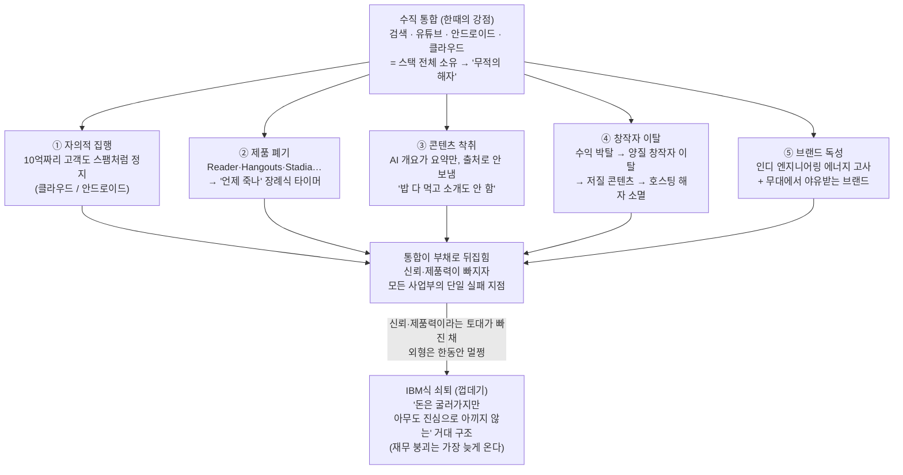

<figure class="post-figure post-figure--header">
<svg role="img" aria-label="수직 통합이라는 거탑: 꼭대기 층(검색·유튜브·안드로이드·클라우드)은 여전히 황금을 찍어내며 돌아가지만, 토대를 이루던 벽돌(사용자 신뢰·창작자·제품력)이 하나씩 빠져나가 균열이 위로 번진다 — 외부의 적이 아니라 제 무게에 부서지는 탑" viewBox="0 0 640 320" xmlns="http://www.w3.org/2000/svg" shape-rendering="crispEdges">
  <!-- ground line -->
  <line x1="40" y1="286" x2="600" y2="286" stroke="currentColor" stroke-width="1.5" opacity="0.4"/>

  <!-- ===== TOP: golden crown floor — still minting money ===== -->
  <!-- crenellated top rampart -->
  <g fill="var(--gold)">
    <rect x="232" y="40" width="176" height="14"/>
    <rect x="232" y="34" width="20" height="8"/>
    <rect x="272" y="34" width="20" height="8"/>
    <rect x="312" y="34" width="20" height="8"/>
    <rect x="352" y="34" width="20" height="8"/>
    <rect x="388" y="34" width="20" height="8"/>
  </g>
  <!-- gold mint floor -->
  <rect x="232" y="54" width="176" height="44" fill="var(--gold)" opacity="0.85" stroke="currentColor" stroke-width="1.5"/>
  <text x="320" y="81" text-anchor="middle" font-size="12" fill="var(--bg-panel)" font-weight="700">검색 · 유튜브 · 안드로이드 · 클라우드</text>
  <!-- piled coins on the crown floor: still printing money -->
  <g fill="var(--badge-fill)" stroke="currentColor" stroke-width="1">
    <ellipse cx="258" cy="32" rx="11" ry="4"/>
    <ellipse cx="258" cy="28" rx="11" ry="4"/>
    <ellipse cx="382" cy="32" rx="11" ry="4"/>
    <ellipse cx="382" cy="28" rx="11" ry="4"/>
    <ellipse cx="382" cy="24" rx="11" ry="4"/>
  </g>

  <!-- ===== MIDDLE & LOWER: the integrated stack, cracking ===== -->
  <!-- floor 2 (intact-ish) -->
  <rect x="246" y="98" width="148" height="40" fill="var(--bg-sunken)" stroke="currentColor" stroke-width="1.5"/>
  <!-- floor 3 — a crack starts -->
  <rect x="246" y="138" width="148" height="42" fill="var(--bg-sunken)" stroke="currentColor" stroke-width="1.5"/>
  <!-- foundation course (floor 4) where the bricks are leaving -->
  <rect x="246" y="180" width="148" height="44" fill="var(--bg-sunken)" stroke="currentColor" stroke-width="1.5"/>
  <!-- base plinth -->
  <rect x="234" y="224" width="172" height="20" fill="var(--bg-sunken)" stroke="currentColor" stroke-width="1.5"/>

  <!-- mortar lines (brick courses) -->
  <g stroke="currentColor" stroke-width="1" opacity="0.45">
    <line x1="296" y1="98" x2="296" y2="138"/>
    <line x1="344" y1="98" x2="344" y2="138"/>
    <line x1="270" y1="138" x2="270" y2="180"/>
    <line x1="320" y1="138" x2="320" y2="180"/>
    <line x1="370" y1="138" x2="370" y2="180"/>
  </g>

  <!-- the lightning crack running down from the top floor through the body -->
  <path d="M320,98 L308,124 L330,150 L312,180 L334,210 L318,224"
        fill="none" stroke="var(--accent-color)" stroke-width="3.5" stroke-linejoin="round"/>
  <path d="M308,124 L292,140 M330,150 L350,166 M334,210 L356,222"
        fill="none" stroke="var(--accent-color)" stroke-width="2"/>

  <!-- foundation bricks falling OUT to the left (the toppling supports) -->
  <g fill="var(--bg-sunken)" stroke="currentColor" stroke-width="1.5">
    <rect x="150" y="232" width="44" height="20" transform="rotate(-18 172 242)"/>
    <rect x="106" y="252" width="42" height="19" transform="rotate(-30 127 261)"/>
    <rect x="196" y="206" width="40" height="18" transform="rotate(-10 216 215)"/>
  </g>
  <!-- gap in the foundation where they left -->
  <rect x="246" y="206" width="34" height="18" fill="none" stroke="currentColor" stroke-width="1.5" stroke-dasharray="4 3" opacity="0.7"/>
  <rect x="246" y="224" width="40" height="20" fill="none" stroke="currentColor" stroke-width="1.5" stroke-dasharray="4 3" opacity="0.7"/>

  <!-- labels for the lost foundation bricks -->
  <text x="127" y="296" text-anchor="middle" font-size="11" fill="var(--accent-color)" font-weight="700">사용자 신뢰</text>
  <text x="214" y="200" text-anchor="middle" font-size="11" fill="var(--accent-color)" font-weight="700">창작자</text>
  <text x="172" y="226" text-anchor="middle" font-size="11" fill="var(--accent-color)" font-weight="700" opacity="0.85">제품력</text>

  <!-- caption-ish labels on the structure -->
  <text x="320" y="122" text-anchor="middle" font-size="11" fill="currentColor" opacity="0.8">수직 통합</text>
  <text x="320" y="164" text-anchor="middle" font-size="11" fill="currentColor" opacity="0.6">(스택 전체 소유)</text>

  <!-- right-side annotations -->
  <text x="470" y="74" text-anchor="middle" font-size="12" fill="var(--secondary-color)" font-weight="700">위층: 여전히</text>
  <text x="470" y="90" text-anchor="middle" font-size="12" fill="var(--secondary-color)" font-weight="700">황금을 찍는다</text>
  <line x1="412" y1="76" x2="436" y2="76" stroke="var(--secondary-color)" stroke-width="2"/>

  <text x="470" y="214" text-anchor="middle" font-size="12" fill="var(--accent-color)" font-weight="700">아래: 토대 벽돌이</text>
  <text x="470" y="230" text-anchor="middle" font-size="12" fill="var(--accent-color)" font-weight="700">빠져나간다</text>
  <line x1="408" y1="216" x2="430" y2="216" stroke="var(--accent-color)" stroke-width="2" stroke-dasharray="4 3"/>

  <text x="320" y="276" text-anchor="middle" font-size="13" fill="currentColor" font-weight="700">제 무게에 부서지는 거탑</text>
</svg>
<figcaption>한때 무적의 성채이던 '수직 통합' 거탑 — 꼭대기 층(검색·유튜브·안드로이드·클라우드)은 여전히 황금을 찍어내며 돌아가지만, 토대를 받치던 벽돌(<strong>사용자 신뢰·창작자·제품력</strong>)이 하나씩 빠져나가 균열이 위로 번진다. 외부의 적이 아니라 제 무게에 부서진다.</figcaption>
</figure>

## 원문 정보

> - **제목**: Google is shattering under its own weight: the IBM-ification of Google
> - **출처**: zeroshot — 개인 블로그 (zeroshot.bearblog.dev, Bear 호스팅)
> - **발행**: 2026-05-21 · 약 4~5분 분량
> - **원문 링크**: <https://zeroshot.bearblog.dev/google-is-shattering-under-its-own-weight-the-ibm-ification-of-google/>

빅테크의 "수직 통합 = 무적의 해자"라는 통념을, 한 개발자가 자기 입장 번복("내가 완전히 틀렸다")에서 출발해 정면으로 반박하는 글이다. 산업 역학과 비즈니스 전략의 관점에서 읽을 가치가 있어 Articles의 `AI-Industry`에 담는다.

## 한 줄 요약 (TL;DR)

검색·유튜브·안드로이드·클라우드까지 스택 전체를 소유한 구글의 수직 통합은 한때 무적의 해자처럼 보였지만, **신뢰와 제품력이 빠진 통합은 해자가 아니라 부채**다. 자의적 계정 정지, 끝없는 제품 폐기, 창작자 생태계 착취가 쌓이면서 구글은 "돈은 계속 굴리지만 아무도 진심으로 아끼지 않는 거대한 껍데기" — 즉 IBM식 쇠퇴의 길로 들어섰다는 진단이다.

## 왜 이 글을 골랐나

이 글이 흥미로운 건 결론보다 **저자의 입장 번복**에서 출발하기 때문이다. 저자는 원래 "스택 전체를 소유하는 회사는 절대 못 이긴다"고 믿었고, 그게 틀렸다고 인정하면서 글을 연다. 즉 "구글 까기"가 아니라 **자기가 신봉하던 해자 이론의 반례를 해부하는 글**이다.

이 위키에서 우리는 이미 [소프트웨어는 죽는 게 아니라 재평가된다](/2026/06/19/software-is-evolving-not-dead.html)에서 "AI 시대에 해자(moat)가 어디로 이동하는가"를 다뤘다. 이 글은 그 질문의 반대편 — **이미 가장 두꺼운 해자(수직 통합)를 가진 회사조차, 신뢰와 제품력이라는 토대가 빠지면 그 해자가 무력해진다**는 사례 연구다. "owning the whole stack only matters if you can still build something people actually want"라는 한 문장이 두 글을 잇는다.

### 한눈에 보기

이 글의 척추는 하나의 변환이다 — **수직 통합(스택 전체 소유)**이라는 한때의 강점이, 다섯 가지 균열(①자의적 집행 ②제품 폐기 ③콘텐츠 착취 ④창작자 이탈 ⑤브랜드 독성)을 거치면서 강점이 아니라 부채로 뒤집힌다. 통합이 그대로이기에 그 균열들은 사업부를 하나하나가 아니라 한꺼번에 같은 방식으로 갉아먹고, 그 끝에 "돈은 굴러가지만 아무도 진심으로 아끼지 않는 껍데기" — IBM식 쇠퇴 — 가 놓인다.

## 핵심 내용

글은 구글의 사업 영역을 하나씩 훑으며, 같은 진단 — *통합은 그대로인데 신뢰가 빠졌다* — 을 반복해서 누적시킨다.

### 1. 클라우드: 10억짜리 고객도 스팸 계정처럼 다룬다

저자가 드는 상징적 사례는 한 스타트업(Railway)의 GCP 계정이 경고도, 전화할 번호도, 담당자도 없이 정지된 일이다. 거대 매출 고객을 스팸 계정과 동일한 자동화 잣대로 처리하는 운영 방식은, B2B 신뢰의 핵심인 "사람이 사람을 응대한다"는 약속을 정면으로 깬다.

> "Your B2B business is completely cooked if that is how you treat people."

그 결과 구글 클라우드는 **개인에게는 너무 비싸고 복잡하고, 기업에는 너무 못 미더운** 어정쩡한 한가운데 — 저자의 표현으로 "weird, dead middle ground" — 에 끼어, 어느 시장에서도 또렷한 경쟁 포지션을 잡지 못한다.

<figure class="post-figure">
<svg role="img" aria-label="구글 클라우드의 dead middle ground: 왼쪽 끝의 개인·소비자 시장은 더 단순하고 저렴한 대안이 가져가고, 오른쪽 끝의 기업·엔터프라이즈 시장은 더 미더운 사업자가 가져가는데, 구글 클라우드는 개인에게는 너무 비싸고 복잡하고 기업에는 너무 못 미더워 어느 쪽도 자기 것으로 만들지 못한 채 죽은 한가운데에 끼어 있다" viewBox="0 0 640 280" xmlns="http://www.w3.org/2000/svg" shape-rendering="crispEdges">
  <!-- the positioning axis -->
  <line x1="60" y1="150" x2="580" y2="150" stroke="currentColor" stroke-width="2"/>
  <path d="M60,150 L74,143 L74,157 Z" fill="currentColor"/>
  <path d="M580,150 L566,143 L566,157 Z" fill="currentColor"/>

  <!-- LEFT pole: individuals / consumers (won by simpler & cheaper) -->
  <rect x="58" y="80" width="150" height="48" fill="var(--bg-sunken)" stroke="currentColor" stroke-width="1.5"/>
  <text x="133" y="100" text-anchor="middle" font-size="13" fill="currentColor" font-weight="700">개인 · 소비자</text>
  <text x="133" y="118" text-anchor="middle" font-size="11" fill="var(--secondary-color)" font-weight="700">더 단순·저렴한 대안</text>
  <line x1="133" y1="128" x2="133" y2="148" stroke="currentColor" stroke-width="1.5"/>
  <text x="133" y="178" text-anchor="middle" font-size="11" fill="var(--accent-color)">→ GCP는 너무 비싸고 복잡</text>

  <!-- RIGHT pole: enterprise (won by the more trusted) -->
  <rect x="432" y="80" width="150" height="48" fill="var(--bg-sunken)" stroke="currentColor" stroke-width="1.5"/>
  <text x="507" y="100" text-anchor="middle" font-size="13" fill="currentColor" font-weight="700">기업 · 엔터프라이즈</text>
  <text x="507" y="118" text-anchor="middle" font-size="11" fill="var(--secondary-color)" font-weight="700">더 미더운 사업자</text>
  <line x1="507" y1="128" x2="507" y2="148" stroke="currentColor" stroke-width="1.5"/>
  <text x="507" y="178" text-anchor="middle" font-size="11" fill="var(--accent-color)">→ GCP는 너무 못 미더움</text>

  <!-- MIDDLE: the dead zone where Google Cloud is stuck -->
  <rect x="252" y="118" width="136" height="64" fill="none" stroke="var(--accent-color)" stroke-width="2.5" stroke-dasharray="6 4"/>
  <text x="320" y="142" text-anchor="middle" font-size="13" fill="var(--accent-color)" font-weight="700">구글 클라우드</text>
  <text x="320" y="160" text-anchor="middle" font-size="11" fill="currentColor" opacity="0.85">어정쩡한 한가운데</text>
  <text x="320" y="174" text-anchor="middle" font-size="10" fill="currentColor" opacity="0.6">"weird, dead middle ground"</text>

  <!-- both markets pull away from the middle -->
  <line x1="252" y1="150" x2="212" y2="150" stroke="var(--accent-color)" stroke-width="2" stroke-dasharray="4 3"/>
  <line x1="388" y1="150" x2="428" y2="150" stroke="var(--accent-color)" stroke-width="2" stroke-dasharray="4 3"/>

  <text x="320" y="232" text-anchor="middle" font-size="13" fill="currentColor" font-weight="700">어느 시장도 자기 것으로 만들지 못한다</text>
  <text x="320" y="256" text-anchor="middle" font-size="11" fill="currentColor" opacity="0.7">양 끝은 각각 더 나은 사업자가 가져가고, 가운데는 죽어 있다</text>
</svg>
<figcaption>클라우드의 'dead middle ground' — 양 끝(개인/소비자, 기업/엔터프라이즈)은 각각 <strong>더 단순·저렴한</strong> 또는 <strong>더 미더운</strong> 사업자가 가져가는데, 구글 클라우드는 개인에겐 너무 비싸고 복잡하고 기업에겐 너무 못 미더워 어느 쪽도 잡지 못한 채 죽은 한가운데에 끼어 있다.</figcaption>
</figure>

### 2. 제품 폐기: 모두가 장례식 타이머를 켠다

Reader, Hangouts, Stadia, Inbox, Google Plus로 이어지는 "거대한 묘지(graveyard)"가 만든 진짜 비용은 **신뢰의 소멸**이다. 이제 구글이 새 제품을 발표해도 사람들은 설레는 대신 "언제 죽을까"를 센다.

> "Literally everyone just starts a countdown timer for the funeral announcement."

신제품이 실패를 기본값으로 깔고 시작한다는 것 — 이것이 폐기 습관이 누적시킨 무형의 부채다.

### 3. 검색: 남의 집에 들어와 밥까지 먹고

AI 개요(AI Overviews)는 웹의 콘텐츠를 요약해 보여주면서 출처로 보내지 않는다. 저자는 이를 "남의 집에 들어와 밥을 다 먹어 치우고는, 자기 친구들에게 우리를 소개조차 안 해준다"는 비유로 꼬집는다. 사용자 생성 콘텐츠 위에 세운 제국이, 정작 그 공급자에게 돌려주는 가치(트래픽·귀속)를 거둬들이며 생태계의 토대를 갉아먹는다는 지적이다.

### 4. 유튜브: 공급자를 쫓아내면 해자도 사라진다

수익 박탈(demonetization)이 질 좋은 창작자를 밀어내고, 그 빈자리를 AI가 찍어내는 저노력 콘텐츠가 채운다. 저자의 논리는 명쾌하다 — **콘텐츠 자체가 평준화되면, 그 콘텐츠를 호스팅하는 일에는 더 이상 해자가 없다.**

> "If you keep kicking off the actual suppliers and replacing them with low effort garbage, literally anyone can host that garbage."

이미 TikTok이 "유튜브가 콘텐츠를 독점하지 않는다"를 증명했다는 게 그의 보강 근거다.

### 5. 안드로이드: 개방성이라는 정체성의 배신

사이드로딩 제약이 해마다 늘고, reCAPTCHA가 전화번호를 요구하고, 구독 해지 버튼은 UI 깊숙이 숨는다. 안드로이드의 원래 매력이던 "개방성"이 야금야금 닫히면서, 저자는 그것을 "iOS의 더 나쁜 버전, 게다가 분위기까지 별로(a worse version of iOS but with terrible vibes)"라고 부른다.

### 6. IBM 패럴렐: 재무 붕괴보다 먼저 오는 공동화

여기서 IBM 비유가 들어온다. 거대한 기업 구조가 "인디 엔지니어링 에너지"를 죽이고, 브랜드는 독성을 띤다(저자는 에릭 슈미트가 무대에서 야유받은 일을 신호로 든다). 핵심 통찰은 **재무 붕괴는 가장 늦게 온다**는 것이다. 회사가 속에서부터 공동화(hollowing)되는 동안에도 수익 기계는 한동안 잘 돌아가기 때문에, 외형의 건강함이 내부의 쇠퇴를 가린다. IBM이 그랬듯이.

### 7. 애플과의 대비: '반짝이는 것'을 쫓는 전략적 무능

마지막으로 저자는 애플과 대비한다. 애플은 자사주 매입과 절제를 택하고 사용자가 원하는 것에 집중하는 반면, 구글은 매번 새로 "반짝이는 것(shiny object)"을 쫓으며 죽어가는 제품에서 마지막 한 방울까지 수익을 짜낸다. 그래서 나오는 마무리 문장이 글 전체의 톤을 압축한다.

> "Google builds things like a digital slumlord. Functional, extractive, cold."

기능은 하되, 착취적이고 차갑다 — 디지털 '슬럼 집주인(slumlord)'처럼 짓는다는 것이다.

## 분석과 인사이트

여기부터는 원문 요약이 아니라 내 관점이다.

**1. 이 글의 진짜 주장은 "수직 통합 무용론"이 아니라 "해자의 분모는 신뢰"라는 것이다.** 글을 "구글이 망한다"는 예언으로 읽으면 핵심을 놓친다. 저자 자신도 인정하듯 구글은 여전히 막대한 돈을 번다. 그가 말하는 건 *해자의 성질*이다. 스택 전체를 소유하는 건 분명한 강점이지만, 그것이 해자로 작동하려면 그 위에 **신뢰**와 **사람들이 실제로 원하는 제품**이 얹혀 있어야 한다. 그 두 토대가 빠지면 통합은 강점이 아니라, 모든 사업부를 동시에 같은 방식으로 망가뜨리는 **단일 실패 지점**이 된다. 이건 우리가 [해자가 어디로 이동하는가](/2026/06/19/software-is-evolving-not-dead.html)에서 본 결론 — 해자는 "무엇을 소유했나"가 아니라 "무엇을 계속 잘 만드나"로 이동한다 — 와 정확히 같은 자리에 도착한다.

**2. 가장 설득력 있는 대목은 유튜브 논증이고, 가장 약한 대목은 IBM 비유다.** "공급자를 쫓아내고 저질로 채우면 호스팅에는 더 이상 해자가 없다"는 논리는 양면 시장(two-sided market)의 동학을 정확히 짚는다 — 플랫폼의 가치는 공급 측 품질에서 나오는데, 그 공급을 스스로 망가뜨리고 있다는 것이다. 반면 IBM 비유는 수사적으로 강렬하지만 정밀하진 않다. IBM의 쇠퇴는 메인프레임이라는 단일 시장의 패러다임 전환(PC·클라우드)에 적응하지 못한 사건이었고, 구글은 여러 시장에서 동시에 *자초한* 신뢰 훼손이라는 점에서 메커니즘이 다르다. 비유의 진짜 가치는 "재무 지표가 멀쩡한 동안에도 내부 공동화는 진행된다"는 **시차(lag)의 통찰**에 있지, 두 회사가 같은 길을 간다는 데 있지 않다.

**3. 출처의 성격을 정직하게 밝혀야 한다.** 이 글은 학술 분석이나 업계 리포트가 아니라 **익명에 가까운 개인의 의견 글(opinion piece)**이다. Railway·에릭 슈미트 일화 같은 사례는 인용되지만, 폐기율·매출·이탈률 같은 정량 근거로 뒷받침되진 않는다. 그래서 이 글은 "데이터로 입증된 진단"이 아니라 **"한 사용자가 빅테크에 대해 느끼는 신뢰 붕괴의 정서를, 해자 이론의 언어로 구조화한 글"**로 읽는 게 옳다. 그 정서가 널리 공유된다면, 그 자체가 브랜드 독성이라는 실재하는 자산 손상의 신호이기도 하다.

**4. 한쪽 면만 보는 글이라는 점도 짚어둔다.** 글은 구글의 약점만 모아 한 방향으로 누적시킨다. 반대편 — 검색 광고의 압도적 수익성, Gemini를 통한 AI 전환, TPU 같은 인프라 자산 — 은 다루지 않는다. 균형 잡힌 판단을 위해선, 이 글을 "구글이 끝났다"가 아니라 **"신뢰라는 무형 자산이 어떻게 천천히 새는가에 대한 사례 모음"**으로 받아들이는 절제가 필요하다.

## 적용 포인트

빅테크 비판을 넘어, 제품·플랫폼을 만드는 사람이 바로 가져갈 교훈으로 정리한다.

- **해자를 "소유한 것"이 아니라 "계속 잘 만드는 것"으로 정의하라.** 인프라·데이터·유통을 다 가져도, 사람들이 원하는 제품을 못 만들면 그 자산은 부채가 된다.
- **자동화된 집행에는 '사람 탈출구'를 남겨라.** 매출 규모와 무관하게 모두를 스팸처럼 처리하는 운영은 B2B 신뢰를 가장 빠르게 태운다. 고가치 고객일수록 사람이 응대하는 경로를 설계하라.
- **제품을 죽이는 방식이 다음 제품의 평판을 결정한다.** 폐기가 습관이 되면 신제품은 "곧 죽을 것"이라는 디폴트를 안고 출발한다. 종료(sunset) 정책과 마이그레이션 경로를 제품 출시만큼 진지하게 다뤄라.
- **양면 플랫폼이라면 공급 측을 먼저 지켜라.** 창작자·공급자·기여자 생태계가 무너지면, 그걸 호스팅하던 해자도 함께 사라진다.
- **재무 지표를 건강의 증거로 오해하지 마라.** 매출이 잘 나오는 동안에도 신뢰·인재·창작자 같은 무형 자산은 새고 있을 수 있다. 시차를 의심하라.

## 마무리

이 글의 가치는 "구글이 망한다"는 예언이 아니라, **수직 통합이라는 가장 두꺼운 해자조차 신뢰와 제품력이라는 토대 위에서만 작동한다**는 재정의에 있다. 출처는 익명 개인 블로그이고 정량 근거보다 정서와 일화에 기댄 의견 글이지만, 바로 그 "널리 공유되는 정서"가 곧 브랜드 독성이라는 실재하는 손상의 신호라는 점에서 한 번 읽어둘 만하다. 무언가를 소유하는 것과 무언가를 계속 잘 만드는 것은 다르다 — 그 둘 사이의 간격이 벌어질 때, 거탑은 외부의 적이 아니라 제 무게에 부서진다.

### 더 읽어보기

- [원문 — Google is shattering under its own weight: the IBM-ification of Google (zeroshot)](https://zeroshot.bearblog.dev/google-is-shattering-under-its-own-weight-the-ibm-ification-of-google/)
- [소프트웨어는 죽는 게 아니라 재평가된다: '소프트웨어 종말론' 4가지 논거 해부](/2026/06/19/software-is-evolving-not-dead.html) — 해자(moat)가 "소유"에서 "계속 잘 만드는 능력"으로 이동한다는 같은 결론의 반대편 사례
- [죽은 경제 이론(The Dead Economy Theory)](/2026/06/22/the-dead-economy-theory.html) — 기업의 합리적 인센티브가 장기적으로 자기 토대(수요·생태계)를 갉아먹는 또 다른 구조적 시나리오
- [The Founder's Playbook: AI 네이티브 스타트업을 만드는 4단계](/2026/06/19/the-founders-playbook.html) — "속도가 보편화되면 진짜 해자는 규율이 된다"는 해자 논의의 연장선
