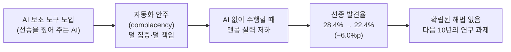

<figure class="post-figure post-figure--header">
<svg role="img" aria-label="왼쪽에는 AI 보조 화면(HUD)이 선명한 조준 표적·보조선으로 또렷하게 빛나고, 오른쪽에는 그 도구를 내려놓은 사람의 맨손이 흐릿하게 위축되어 가는 대비 — '도구는 선명해지고 사람은 흐려진다'는 탈숙련(deskilling)을 한 장으로 그린 헤더 삽화" viewBox="0 0 640 300" xmlns="http://www.w3.org/2000/svg">
  <title>도구는 선명해지고 사람은 흐려진다 — 탈숙련(deskilling)</title>
  <defs>
    <!-- the human hand fades to nothing on the right -->
    <linearGradient id="deskill-fade" x1="0" y1="0" x2="1" y2="0">
      <stop offset="0" stop-color="currentColor" stop-opacity="0.85"/>
      <stop offset="0.55" stop-color="currentColor" stop-opacity="0.4"/>
      <stop offset="1" stop-color="currentColor" stop-opacity="0.08"/>
    </linearGradient>
  </defs>

  <!-- header caption strip -->
  <text x="320" y="28" text-anchor="middle" font-size="15" fill="currentColor" font-weight="700">도구는 선명해지고, 사람은 흐려진다</text>
  <text x="320" y="48" text-anchor="middle" font-size="11.5" fill="currentColor" opacity="0.6">AI 보조 화면은 또렷해지고 ← → 도구를 내려놓은 맨손은 둔해진다</text>

  <!-- divider between the two worlds -->
  <line x1="320" y1="70" x2="320" y2="270" stroke="currentColor" stroke-width="1.5" stroke-dasharray="4 6" opacity="0.35"/>

  <!-- LEFT: the AI assist screen / HUD — crisp, glowing, in focus -->
  <g>
    <rect x="40" y="92" width="232" height="150" rx="6" fill="var(--bg-light)" stroke="var(--secondary-color)" stroke-width="3"/>
    <!-- crisp targeting reticle on the lesion -->
    <circle cx="156" cy="167" r="30" fill="none" stroke="var(--accent-color)" stroke-width="2.5"/>
    <line x1="156" y1="127" x2="156" y2="149" stroke="var(--accent-color)" stroke-width="2.5"/>
    <line x1="156" y1="185" x2="156" y2="207" stroke="var(--accent-color)" stroke-width="2.5"/>
    <line x1="116" y1="167" x2="138" y2="167" stroke="var(--accent-color)" stroke-width="2.5"/>
    <line x1="174" y1="167" x2="196" y2="167" stroke="var(--accent-color)" stroke-width="2.5"/>
    <!-- the detected polyp, boxed -->
    <rect x="146" y="157" width="20" height="20" rx="2" fill="var(--accent-color)" opacity="0.9"/>
    <!-- HUD detection label -->
    <rect x="56" y="104" width="86" height="18" rx="2" fill="var(--secondary-color)"/>
    <text x="99" y="117" text-anchor="middle" font-size="10" fill="var(--bg-panel)" font-weight="700" font-family="ui-monospace, monospace">AI · DETECT</text>
    <text x="156" y="228" text-anchor="middle" font-size="10.5" fill="currentColor" opacity="0.8">선종을 짚어 주는 보조선</text>
  </g>

  <!-- RIGHT: the bare human hand — once it lets go of the tool, it fades and withers -->
  <g transform="translate(372,96)" stroke="url(#deskill-fade)" stroke-width="2.5" fill="none" stroke-linecap="round" stroke-linejoin="round">
    <!-- forearm -->
    <path d="M6,150 L70,110"/>
    <!-- palm -->
    <path d="M70,110 q22,-10 42,2 q12,8 8,26 q-4,16 -24,20 l-30,4 q-16,-2 -18,-22 q-2,-18 22,-30 Z"/>
    <!-- fingers losing their grip, trailing off into the faded edge -->
    <path d="M112,112 q22,-8 40,-2"/>
    <path d="M118,128 q26,-4 46,2"/>
    <path d="M118,146 q26,0 46,8"/>
    <path d="M110,162 q22,4 40,14"/>
  </g>
  <!-- the dropped tool handle the hand no longer holds firmly -->
  <g transform="translate(372,96)">
    <rect x="84" y="120" width="48" height="12" rx="5" fill="var(--steel)" stroke="currentColor" stroke-width="1.5" opacity="0.45"/>
  </g>
  <text x="476" y="252" text-anchor="middle" font-size="10.5" fill="currentColor" opacity="0.5">도구를 내려놓은 맨손 — 둔해진다</text>
</svg>
<figcaption>AI 보조 화면은 선종을 또렷이 짚어 주며 점점 선명해지지만, 정작 그 도구를 내려놓은 사람의 맨손 감각은 흐려지고 위축된다. 탈숙련(deskilling)은 손상이 도구가 사라진 순간에만 드러난다.</figcaption>
</figure>

## 원문 정보

> - **제목**: Is AI ruining our skills? Early results are in — and they're not good
> - **출처**: Nature (News feature) · Mariana Lenharo ([nature.com](https://www.nature.com/))
> - **발행**: 2026-06-18
> - **원문 링크**: <https://www.nature.com/articles/d41586-026-01947-1>

이 글을 Articles에 담는 맥락: 지금까지 이 위키의 AI 글들이 대체로 "AI가 일을 어떻게 바꾸는가"를 다뤘다면, 이 Nature 기사는 한 단계 더 안쪽 — "AI에 기댄 사람의 **실력 자체**가 어떻게 되는가"를 **측정된 증거**로 묻는다.

> **읽기 전 주의 — 접근 범위 고지.** 이 포스트는 원문의 **접근 가능한 부분**만을 근거로 쓰였다. Nature의 d41586 뉴스 기사는 도입부와 의료 연구 사례까지는 읽혔지만, **Anthropic의 소프트웨어 엔지니어 실험 '결과'부터는 페이월**("Log in or create an account to continue")로 가려져 있었다. 그래서 아래 "핵심 내용"의 의료 파트는 원문에 충실하고, 소프트웨어 파트는 **실험 설계까지만** 사실로 적고 결과는 비워 둔다. 가려진 숫자나 결론을 지어내지 않는다.

## 한 줄 요약 (TL;DR)

AI 보조 도구에 익숙해진 전문가는, 그 도구를 **끄고** 일할 때 실력이 떨어진다 — 폴란드 내시경 전문의들의 선종 발견율이 AI 도입 후 28.4%에서 22.4%로 내려갔다. "탈숙련(deskilling)"은 미래의 걱정이 아니라 이미 측정되는 현상이며, 아직 검증된 해법이 없다는 것이 기사의 골자다.

### 한눈에 보기 — 탈숙련이 진행되는 경로

이 글의 척추는 위 한 줄이다 — 도구가 좋아질수록(A) 스스로 훑는 긴장을 놓고(B), 도구를 껐을 때 기본기가 깎이며(C), 폴란드 내시경 연구에서 그 낙폭이 6.0%포인트로 측정됐다(D). 그리고 아직 검증된 해법은 없다(E).

## 왜 이 글을 골랐나

이 위키에는 "AI 시대에 사람의 가치는 어디에 남는가"를 다룬 글이 이미 여럿 있다. [하용호의 '전문성 재설계'](/2026/06/22/ai-era-expertise-redesign.html)는 "스킬 숙련자에서 운영 책임자로" 전문가를 다시 정의했고, [Sarah Guo의 'The Untrainable'](/2026/06/23/the-untrainable.html)은 "측정 가능한 일은 학습되어 commodity가 된다"고 했으며, ['AI는 왜 엔지니어를 대체하지 못했나'](/2026/06/19/ai-hasnt-replaced-engineers.html)는 해고 서사의 실체를 해부했다.

이 글들은 대체로 **낙관 혹은 재배치**의 논리다 — "스킬은 옮겨갈 뿐 사라지지 않는다." Nature 기사는 그 낙관에 **반대 방향의 데이터**를 던진다. AI를 쓰면 생산성이 오르는 건 맞지만, **그 대가로 AI 없이 일할 때의 기본기가 깎인다**면 이야기가 다르다. 이건 의견이 아니라 무작위 대조와 전후 비교로 측정된 수치다. 그래서 균형을 위해 읽을 값어치가 있다.

## 핵심 내용

### 의료 현장에서 측정된 탈숙련 — 폴란드 내시경 연구

기사가 드는 가장 또렷한 증거는 폴란드의 내시경 전문의 연구다. 모두 경력 동안 **최소 2,000건 이상의 대장내시경**을 수행한, 충분히 숙련된 의사들이었다. 이들에게 선종(adenoma, 대장암으로 발전할 수 있는 용종)을 잡아내는 AI 시스템을 도입했다.

<figure class="post-figure">
<svg role="img" aria-label="폴란드 내시경 연구의 3구간 가로 타임라인. ① AI 도입 전 맨몸 선종 발견율 28.4% ② AI 도입 후 AI를 켜고 보조받을 때는 향상(↑, 원문 미확인이라 화살표만) ③ AI 도입 후 AI 없이 다시 측정한 맨몸 발견율 22.4%로 하락. 측정 대상은 도구를 켰을 때가 아니라 도구를 껐을 때의 맨몸 실력임을 강조하는 막대 도식" viewBox="0 0 640 360" xmlns="http://www.w3.org/2000/svg">
  <title>폴란드 내시경 연구 — 측정 대상은 '도구를 껐을 때'의 맨몸 실력 (28.4% → 22.4%)</title>

  <text x="320" y="26" text-anchor="middle" font-size="14.5" fill="currentColor" font-weight="700">측정 대상은 '도구를 껐을 때'의 맨몸 실력</text>
  <text x="320" y="45" text-anchor="middle" font-size="11" fill="currentColor" opacity="0.6">선종 발견율 · AI를 켰을 때가 아니라 껐을 때를 잰다</text>

  <!-- baseline timeline axis -->
  <line x1="40" y1="300" x2="600" y2="300" stroke="currentColor" stroke-width="1.5" opacity="0.4"/>
  <text x="40" y="322" font-size="9.5" fill="currentColor" opacity="0.55">AI 도입 전</text>
  <text x="320" y="322" text-anchor="middle" font-size="9.5" fill="currentColor" opacity="0.55">AI 도입 후 · 보조 시</text>
  <text x="600" y="322" text-anchor="end" font-size="9.5" fill="currentColor" opacity="0.55">AI 도입 후 · AI 없이</text>

  <!-- chart frame: 0% at y=300, scale 5px per % (28.4% -> ~142px tall) -->
  <!-- (1) BARE, before AI: 28.4% — the tool is OFF -->
  <g>
    <rect x="64" y="158" width="120" height="142" rx="2" fill="var(--bg-light)" stroke="currentColor" stroke-width="2.5"/>
    <text x="124" y="148" text-anchor="middle" font-size="20" fill="currentColor" font-weight="700">28.4%</text>
    <text x="124" y="183" text-anchor="middle" font-size="11" fill="currentColor" font-weight="700">① 맨몸</text>
    <text x="124" y="201" text-anchor="middle" font-size="9.5" fill="currentColor" opacity="0.65">도구 OFF</text>
  </g>

  <!-- (2) AI ON, assisted: improved — but the number is paywalled, so arrow only -->
  <g>
    <!-- dashed/open bar = not the measured value of interest; only direction known -->
    <rect x="264" y="96" width="120" height="204" rx="2" fill="var(--bg-panel)" stroke="var(--secondary-color)" stroke-width="2.5" stroke-dasharray="5 5"/>
    <text x="324" y="86" text-anchor="middle" font-size="20" fill="var(--secondary-color)" font-weight="700">↑</text>
    <text x="324" y="135" text-anchor="middle" font-size="11" fill="currentColor" font-weight="700">② AI 켜고</text>
    <text x="324" y="153" text-anchor="middle" font-size="9.5" fill="currentColor" opacity="0.65">도구 ON · 향상</text>
    <text x="324" y="171" text-anchor="middle" font-size="9" fill="currentColor" opacity="0.5">(수치는 측정 대상 아님)</text>
  </g>

  <!-- (3) BARE again, after AI: 22.4% — tool OFF, re-measured, dropped -->
  <g>
    <rect x="464" y="188" width="120" height="112" rx="2" fill="var(--bg-light)" stroke="var(--accent-color)" stroke-width="2.5"/>
    <text x="524" y="178" text-anchor="middle" font-size="20" fill="var(--accent-color)" font-weight="700">22.4%</text>
    <text x="524" y="213" text-anchor="middle" font-size="11" fill="currentColor" font-weight="700">③ 다시 맨몸</text>
    <text x="524" y="231" text-anchor="middle" font-size="9.5" fill="currentColor" opacity="0.65">도구 OFF</text>
  </g>

  <!-- the drop callout connecting bar ① top to bar ③ top -->
  <line x1="184" y1="158" x2="464" y2="188" stroke="var(--accent-color)" stroke-width="2" stroke-dasharray="4 4" opacity="0.8"/>
  <g transform="translate(320,236)">
    <rect x="-44" y="-15" width="88" height="30" rx="4" fill="var(--bg-panel)" stroke="var(--accent-color)" stroke-width="2"/>
    <text x="0" y="5" text-anchor="middle" font-size="13" fill="var(--accent-color)" font-weight="700">−6.0%p</text>
  </g>
</svg>
<figcaption>핵심 반전: 측정한 것은 AI를 ‘켰을 때’가 아니라 ‘껐을 때’의 맨몸 실력이다. AI 도입 전 28.4%(①), AI를 켜면 향상(②, 다만 그 수치는 이 연구의 측정 대상이 아니다), 그러나 도입 후 AI 없이 다시 재면 22.4%(③) — 6.0%포인트 낙폭이다.</figcaption>
</figure>

핵심은 **AI를 켰을 때가 아니라 껐을 때** 무슨 일이 벌어지는가다. AI 도구 도입 **이전** 3개월 동안, 전문의들은 대장내시경의 28.4%에서 선종을 적어도 하나 발견했다. 도구 도입 **이후**, 같은 의사들이 **AI 없이** 수행한 대장내시경의 선종 발견율은 **22.4%로 떨어졌다.** 6%포인트의 낙폭이다. 도구를 쥐어 줬더니, 그 도구를 내려놓은 손이 둔해진 것이다.

이 결과는 2025년 10월 *The Lancet Gastroenterology and Hepatology*에 발표됐다. 공저자인 오슬로 대학교의 의사이자 연구자 Yuichi Mori는 이 현상을 확정하려면 더 많은 연구가 필요하다고 신중하게 덧붙이면서도, 문제의 무게를 분명히 했다.

> "There is no established solution against deskilling right now. It should be a very hot research topic in the next decade."
>
> (지금으로선 탈숙련에 대한 확립된 해법이 없다. 다음 10년간 매우 뜨거운 연구 주제가 되어야 한다.)

### 왜 깎이는가 — '자동화 안주'

기사는 그 메커니즘을 한 문장으로 요약한다. 이런 도구에 **지속적으로 노출되면** 임상의가 "AI 보조 없이 인지적 결정을 내릴 때 **덜 동기부여되고, 덜 집중하며, 덜 책임감 있게**" 된다는 것이다. 보조선이 늘 화면에 떠 있으면 스스로 구석구석을 훑는 긴장을 놓게 된다 — GPS만 보고 다니다 길눈이 어두워지는 것과 같은 결의 현상이다.

이게 단지 의사 개인의 자각에 그치지 않는다는 점도 짚힌다. 간호사의 70%, 의사의 77%가 AI 과의존으로 인한 실력 상실을 우려한다. 의료에서 AI 도구의 변화를 다룬 책의 저자이자 UCSF 의사인 Robert Wachter, 그리고 시러큐스 대학교의 Kevin Crowston 같은 연구자들이 이 우려에 목소리를 보탠다. Crowston은 처방보다 자각을 먼저 말한다.

> "Just being aware that this phenomenon exists hopefully provokes some self-reflection about which skills people want to maintain."
>
> (이 현상이 존재한다는 것을 인지하는 것만으로도, 사람들이 어떤 실력을 유지하고 싶은지 스스로 돌아보게 되기를 바란다.)

### 소프트웨어 엔지니어링으로 — 여기서부터는 페이월

기사는 같은 질문을 **소프트웨어 개발**로 옮긴다. 컴퓨터 과학 분야에서도 실력이 깎이는지 보기 위해, 샌프란시스코의 AI 기업 Anthropic의 연구진이 무작위 대조 실험(randomized controlled trial)을 설계했다. **52명의 소프트웨어 엔지니어**에게 기본적인 코딩 과제를 시켰고, 참가자 전원은 웹 검색과 과제 수행 방법 안내에 접근할 수 있었다. 그중 **절반에게만 AI 어시스턴트를 함께 쓰도록** 했다.

**원문에서 읽을 수 있는 것은 여기까지다.** 이 실험의 결과 — AI를 쓴 절반이 이후 AI 없이 일할 때 어떻게 됐는지 — 는 페이월 너머에 있어 확인하지 못했다. 의료 사례와의 대구로 보아 비슷한 방향의 결과가 예상되지만, 이는 어디까지나 **추측**이며 본문은 이를 사실로 적지 않는다. 정확한 수치와 결론이 궁금하다면 Nature 원문 구독 또는 Anthropic의 원자료를 확인해야 한다.

## 분석과 인사이트

여기서부터는 원문 요약이 아니라 내 해석이다.

**1) "생산성 향상"과 "실력 향상"은 같은 말이 아니다.** AI 글에서 가장 흔히 뭉뚱그려지는 지점이다. AI를 쓰면 같은 시간에 더 많이, 더 빨리 한다 — 이건 대체로 사실이다. 하지만 이 연구가 측정한 건 다른 축이다. **도구를 뺀 상태의 맨몸 실력.** 폴란드 의사들은 AI를 켜면 더 잘 잡았겠지만, 껐을 때 도입 전보다 못해졌다. 생산성 곡선이 올라가는 동안 역량 곡선이 내려가고 있었다면, 우리는 지금까지 한 축만 보고 있었던 셈이다.

**2) 이건 '취향'·'운영'으로의 재배치 서사에 대한 반례다.** 이 위키의 여러 글 — [코드가 공짜가 된 시대의 '취향'](/2026/06/19/ai-engineer-taste.html), [전문성 재설계](/2026/06/22/ai-era-expertise-redesign.html) — 은 "생산은 AI가, 사람은 판단·검증·운영으로 옮겨간다"고 봤다. 그런데 **판단과 검증은 생산을 직접 해 본 실력에서 나온다.** 선종을 스스로 찾아내 본 눈이 있어야 AI가 놓친 것을 의심할 수 있다. 맨몸 실력이 깎이면, 정작 사람에게 남겨두려던 '검증' 능력도 함께 깎인다. 탈숙련은 재배치 서사의 토대를 갉는다.

**3) 가장 무서운 건 손상이 보이지 않는다는 점이다.** AI를 켜고 일하는 동안에는 지표가 좋아 보인다. 손상은 **AI가 없는 순간** — 도구가 다운됐거나, 도구가 틀렸거나, 도구가 다루지 못하는 희귀 케이스 — 에만 드러난다. 즉 가장 실력이 필요한 순간에 가장 크게 깎여 있다. 이 비대칭은 [LLM이 써 줄 인시던트 리포트의 미래](/2026/06/19/llm-written-incident-report-future.html)가 말한 "쓰기는 곧 사고하기 — 도구가 사고를 대신하면 사고하는 근육이 빠진다"와 정확히 같은 형태다.

**4) 다만 데이터는 아직 초기다.** Mori 본인이 "더 많은 연구가 필요하다"고 했고, 한 편의 의료 연구와(읽지 못한) 한 편의 소프트웨어 실험으로 일반화하기엔 이르다. 6%포인트 낙폭이 영구적인지, 의식적 훈련으로 회복되는지, 분야마다 다른지 — 전부 열린 질문이다. 이 글의 가치는 "AI가 실력을 망친다"는 단정이 아니라, **그 질문을 측정 가능한 가설로 올려놓았다**는 데 있다.

## 적용 포인트

- **'AI 없는 날'을 의도적으로 만들어라.** 비행기 조종사가 자동조종을 끄고 손으로 착륙을 연습하듯, 주기적으로 도구를 끄고 맨몸으로 같은 일을 해 보며 기본기를 측정·유지한다.
- **유지할 핵심 실력을 골라 명시하라.** Crowston의 조언대로 "나는 어떤 실력을 끝까지 유지할 것인가"를 먼저 정한다. 모든 걸 유지할 순 없으니, **AI가 틀렸을 때 그것을 알아챌 수 있어야 하는 능력**을 우선순위에 둔다.
- **AI 산출물을 '검토'가 아니라 '재현'으로 검증하라.** 답을 받아 끄덕이는 대신, 핵심 케이스만이라도 스스로 풀어 보고 대조한다 — 이것이 검증 근육을 살려 두는 가장 싼 운동이다.
- **팀 차원에서 '맨몸 지표'를 따로 본다.** 생산성(AI 포함)만 보지 말고, AI 없이 수행했을 때의 품질을 별도로 추적해 역량 곡선이 내려가고 있지 않은지 본다.
- **주니어 교육에 특히 경계한다.** 처음부터 AI로 일을 배운 세대는 '깎일 맨몸 실력'을 애초에 쌓지 못할 위험이 있다. 기본기는 도구 없이 먼저 길러 둔 뒤 도구를 얹는 순서가 안전하다.

## 마무리

Nature 기사는 AI 도구를 버리라고 말하지 않는다. 말하는 건 더 불편한 사실이다 — **도구가 좋아지는 동안 우리 자신은 조용히 둔해질 수 있고, 그 손상은 도구가 사라진 순간에만 드러난다.** 폴란드 내시경 사례의 6%포인트는 작아 보이지만, "충분히 숙련된 전문가조차 몇 달 만에 깎인다"는 점에서 무겁다. 아직 해법은 없고, Mori의 말처럼 다음 10년의 숙제로 남았다. 그때까지 우리가 할 수 있는 건, Crowston의 처방대로 **무엇을 끝까지 내 손으로 할지 스스로 정해 두는 일**이다. (소프트웨어 엔지니어 실험의 결과는 페이월 너머에 있으니, 그 숫자가 궁금하다면 원문을 직접 확인하길 권한다.)

### 더 읽어보기

- [원문 — Is AI ruining our skills? Early results are in — and they're not good (Nature, Mariana Lenharo)](https://www.nature.com/articles/d41586-026-01947-1)
- [AI 시대, 나의 전문성을 재설계하는 법 (하용호)](/2026/06/22/ai-era-expertise-redesign.html) — "스킬 숙련자에서 운영 책임자로"라는 재배치 서사. 이 글의 탈숙련 데이터와 정면으로 대조해 읽으면 좋다.
- [The Untrainable: 벤치마크할 수 없는 일에 가치가 남는다 (Sarah Guo)](/2026/06/23/the-untrainable.html) — "측정 가능한 일은 학습되어 commodity가 된다"는 명제. 측정 가능한 실력이 깎이는 현상과 같은 동전의 양면.
- [AI는 왜 소프트웨어 엔지니어를 대체하지 못했나](/2026/06/19/ai-hasnt-replaced-engineers.html) — 대체 서사의 실체. 대체가 아니라 '탈숙련'이 진짜 위협일 수 있다는 보완 관점.
- [LLM이 써 줄 인시던트 리포트의 미래가 두렵다 (Lorin Hochstein)](/2026/06/19/llm-written-incident-report-future.html) — "쓰기는 곧 사고하기" — 도구가 사고를 대신하면 사고하는 근육이 빠진다는, 탈숙련과 같은 형태의 경고.
- [노동시장이라는 게임에서 살아남기 (Evan Moon)](/2026/06/22/surviving-in-the-job-market.html) — 실력이 곧 시장 가치라면, 그 실력을 지키는 일은 커리어 방어 그 자체다.
