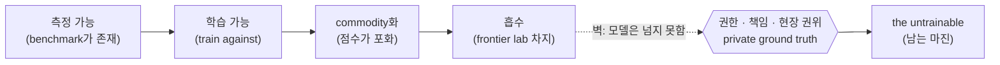

<figure class="post-figure post-figure--header">
<svg role="img" aria-label="바다를 가르는 거대한 파도가 '측정 가능한 땅'을 삼키는 장면. 왼쪽 낮은 평지에는 '벤치마크', '포화된 토큰', '공개된 정답'이라 적힌 측정 가능 영역이 프런티어 랩이라는 파도에 잠겨 사라지고 있다. 오른쪽에는 파도가 끝내 닿지 못하는 높은 바위섬이 물 위에 솟아 있고, 그 위에 '권한', '책임', '현장 권위'를 떠받친 'private ground truth — the untrainable' 깃발이 꽂혀 있다." viewBox="0 0 640 320" xmlns="http://www.w3.org/2000/svg">
  <title>측정 가능한 땅을 삼키는 프런티어 랩의 파도와, 끝내 잠기지 않는 private ground truth의 섬</title>

  <!-- sea line -->
  <line x1="16" y1="244" x2="624" y2="244" stroke="currentColor" stroke-width="2" opacity="0.35"/>

  <!-- ===== LEFT: the measurable land being submerged by the frontier-lab wave ===== -->
  <text x="150" y="30" text-anchor="middle" font-size="13" fill="currentColor" font-weight="700">측정 가능 영역</text>
  <text x="150" y="47" text-anchor="middle" font-size="10" fill="currentColor" opacity="0.7">벤치마크 = 학습 가능 = commodity</text>

  <!-- low, flat, sinking land (pixel-stepped flat shelf) -->
  <path d="M40,244 L40,212 L74,212 L74,200 L150,200 L150,210 L214,210 L214,228 L256,228 L256,244 Z"
        fill="var(--bg-light)" stroke="currentColor" stroke-width="2" stroke-linejoin="round" opacity="0.85"/>
  <!-- partly-drowned labels on the shelf -->
  <text x="106" y="194" text-anchor="middle" font-size="9.5" fill="currentColor" opacity="0.75">벤치마크</text>
  <text x="106" y="224" text-anchor="middle" font-size="8.5" fill="currentColor" opacity="0.55">공개된 정답</text>
  <text x="190" y="224" text-anchor="middle" font-size="8.5" fill="currentColor" opacity="0.5">포화 토큰</text>

  <!-- the frontier-lab wave crashing over the left land (pixel-stepped crest) -->
  <path d="M16,244 L16,150 L40,150 L40,128 L70,128 L70,110 L104,110 L104,128 L132,128 L132,150 L160,150 L160,176 L196,176 L196,204 L232,204 L232,232 L264,232 L264,244 Z"
        fill="var(--accent-color)" opacity="0.18" stroke="var(--accent-color)" stroke-width="2" stroke-linejoin="round"/>
  <text x="86" y="98" text-anchor="middle" font-size="11" fill="var(--accent-color)" font-weight="700">프런티어 랩</text>
  <!-- curl arrow: the wave swallowing the land -->
  <path d="M150,138 q40,6 56,44" fill="none" stroke="var(--accent-color)" stroke-width="2"/>
  <path d="M206,182 l-2,-13 l-10,8 Z" fill="var(--accent-color)"/>
  <text x="178" y="130" font-size="9" fill="var(--accent-color)" font-weight="700" opacity="0.9">흡수</text>

  <!-- ===== RIGHT: the island the wave can't reach ===== -->
  <!-- tall bedrock island rising well above the wave line -->
  <path d="M396,244 L396,196 L412,196 L412,150 L440,150 L440,108 L470,108 L470,86 L506,86 L506,116 L536,116 L536,162 L560,162 L560,210 L588,210 L588,244 Z"
        fill="var(--bg-light)" stroke="currentColor" stroke-width="2.5" stroke-linejoin="round"/>
  <!-- bedrock hatch (solid, slow-built ground) -->
  <line x1="430" y1="244" x2="446" y2="214" stroke="currentColor" stroke-width="1.2" opacity="0.4"/>
  <line x1="466" y1="244" x2="482" y2="214" stroke="currentColor" stroke-width="1.2" opacity="0.4"/>
  <line x1="502" y1="244" x2="518" y2="214" stroke="currentColor" stroke-width="1.2" opacity="0.4"/>
  <line x1="538" y1="244" x2="554" y2="220" stroke="currentColor" stroke-width="1.2" opacity="0.4"/>

  <!-- the three untouchable pillars stacked on the peak -->
  <rect x="448" y="60" width="78" height="17" fill="var(--bg-panel)" stroke="var(--secondary-color)" stroke-width="2"/>
  <text x="487" y="72" text-anchor="middle" font-size="9.5" fill="currentColor" font-weight="700">권한</text>
  <rect x="448" y="42" width="78" height="17" fill="var(--bg-panel)" stroke="var(--secondary-color)" stroke-width="2"/>
  <text x="487" y="54" text-anchor="middle" font-size="9.5" fill="currentColor" font-weight="700">책임</text>
  <rect x="448" y="24" width="78" height="17" fill="var(--bg-panel)" stroke="var(--secondary-color)" stroke-width="2"/>
  <text x="487" y="36" text-anchor="middle" font-size="9.5" fill="currentColor" font-weight="700">현장 권위</text>

  <!-- banner planted on the summit -->
  <line x1="540" y1="22" x2="540" y2="86" stroke="currentColor" stroke-width="2"/>
  <path d="M540,24 L596,30 L588,42 L596,54 L540,50 Z" fill="var(--secondary-color)" opacity="0.85" stroke="currentColor" stroke-width="1.5" stroke-linejoin="round"/>
  <text x="563" y="42" text-anchor="middle" font-size="8" fill="var(--bg-panel)" font-weight="700">the untrainable</text>

  <!-- small failed wave-spray reaching the island base but not the peak -->
  <path d="M388,244 q14,-18 30,-12 q-10,10 4,18" fill="none" stroke="var(--accent-color)" stroke-width="1.6" opacity="0.55"/>
  <text x="492" y="300" text-anchor="middle" font-size="11" fill="currentColor" font-weight="700">private ground truth</text>
  <text x="492" y="316" text-anchor="middle" font-size="9.5" fill="currentColor" opacity="0.7">파도가 닿지 못하는 자리</text>
</svg>
<figcaption>측정할 수 있는 땅(<strong>벤치마크·공개된 정답·포화 토큰</strong>)은 <strong>프런티어 랩</strong>이라는 파도에 잠겨 흡수된다. 끝까지 물 위에 남는 것은 파도가 닿지 못하는 높은 섬 — <strong>권한·책임·현장 권위</strong>가 떠받친 <strong>private ground truth</strong>, 곧 <em>the untrainable</em>이다.</figcaption>
</figure>

## 원문 정보

> - **제목**: The Untrainable
> - **출처**: Sarah Guo — Conviction (saranormous.substack.com)
> - **발행**: 2026-06-10 · 약 13분 분량
> - **원문 링크**: <https://saranormous.substack.com/p/the-untrainable>

VC인 Sarah Guo가 "AI 모델 위에 세운 회사는 전부 흡수당한다"는 투자자들의 비관론을 정면으로 반박하면서, **어디에 방어 가능한 가치(해자)가 남는가**를 정의한 글이다. AI가 바꾸는 산업·비즈니스 구조의 논의이므로 Articles의 `AI-Industry`로 분류했다.

## 한 줄 요약 (TL;DR)

측정할 수 있는 일은 학습할 수 있고, 학습할 수 있는 일은 결국 commodity가 된다. 따라서 진짜 해자는 **벤치마크할 수 없는 영역** — 정답이 공개되어 있지 않고, 권한·책임·현장 권위가 사람과 조직을 통해서만 흐르는 "private ground truth"에 있다. Guo는 이것을 *the untrainable*이라 부른다.

아래는 글 전체를 관통하는 한 줄의 인과다. **측정 가능**에서 출발한 사슬은 한 방향으로만 흐르다 **흡수**에 닿고, 그 흐름이 끝내 넘지 못하는 벽 뒤에 **권한·책임·현장 권위**가 남는다.

병목은 능력이 아니라 **소유권**이다. 더 똑똑한 모델도 라이선스를 쥐거나, 책임에 서명하거나, 회사의 파일을 소유하지 못해 이 벽을 넘지 못한다.

## 왜 이 글을 골랐나

지난 몇 달 사이 이 위키에 정리한 글들은 거의 같은 불안을 다른 각도에서 건드린다. 코드 생성이 공짜가 되면 [엔지니어의 '취향(taste)'](/2026/06/19/ai-engineer-taste.html)이 값져진다는 이야기, [AI가 엔지니어를 대체하지 못한 이유](/2026/06/19/ai-hasnt-replaced-engineers.html), [전문성을 '스킬 숙련자'에서 '운영 책임자'로 재설계하라](/2026/06/22/ai-era-expertise-redesign.html)는 주장까지. 이 글은 그 모든 논의에 **자본·시장 관점의 뼈대**를 제공한다.

핵심은 한 문장으로 압축된다. **"측정할 수 있는 것은 학습할 수 있다(A thing you can measure is a thing you can train against)."** 벤치마크 점수가 오른다는 것은 곧 그 일이 commodity로 향하고 있다는 신호다. 그렇다면 개발자도, 스타트업도, 투자자도 같은 질문을 던지게 된다 — *나의 일 중 무엇이 측정 불가능하고, 따라서 학습 불가능한가?*

## 핵심 내용

### 비관론: "전부 thin wrapper다"

글은 투자자들 사이에 퍼진 절망에서 출발한다. 모델이 모든 것을 점점 더 잘하게 된다면, 그 위에 세운 회사는 전부 가중치(weights)와 컴퓨트를 쥔 프런티어 랩에 흡수되기를 기다리는 얇은 껍데기일 뿐이라는 두려움이다.

> "The despair runs: if the model keeps getting better at everything, then every company built on top of one is a thin wrapper waiting to be absorbed."

Guo는 이 두려움이 부분적으로는 옳다고 인정한다. 흡수당할 층은 실제로 흡수당한다. 하지만 그 결론을 "그러므로 가치가 사라진다"로 확장하는 것이 잘못이라고 본다. 가치는 사라지는 게 아니라 **이동**한다.

### 벤치마크는 무엇을 놓치는가

코딩 에이전트의 벤치마크 점수는 13%에서 80%대 후반까지 치솟았다. 그런데 실제로 출하된 코드는 약 30% 늘었을 뿐이다. 이 간극이 글의 출발점이다. 벤치마크가 측정하는 것은 "측정 가능하도록 잘라낸 조각"이고, 실제로 가치를 만드는 일의 상당 부분은 그 조각 바깥에 있다.

엔지니어링 조직은 프런티어 코딩 모델을 한 분기 만에 도입했지만, 그 모델을 중심으로 워크플로를 다시 짜는 데는 몇 년이 걸리고 있다. 도입을 좌우하는 요인 중 셋은 **조직의 속도**로 움직인다. 모델 성능은 분기 단위로 뛰지만, 신뢰·권한·책임의 재배치는 연 단위로 기어간다.

Google의 프로덕션 인프라처럼 수년간 부하 테스트를 거쳐 쌓인 신뢰성을 예로 든다. 그런 종류의 정확성은 사적(private)일 뿐 아니라, **자본으로 단번에 무너뜨릴 수 없는 느린 종류의 해자**라는 것이다.

> "Correctness like that isn't only private, it's the slow kind of moat capital can't collapse."

### 2x2 프레임워크: 무엇이 흡수되고 무엇이 남는가

글의 척추는 두 축으로 일을 나누는 사분면이다.

- **축 1**: 정답(correctness)이 **공개**되어 있는가, 아니면 **사적이고 확립 비용이 비싼가**
- **축 2**: 그 일이 이미 **포화(saturated)**되었는가, 아니면 **프런티어** 수준인가

네 칸은 이렇게 갈린다.

| | 공개된 정답 | 사적인 정답 |
| --- | --- | --- |
| **포화된 일** | commodity 토큰 — 오픈 모델이 차지 | 방어 가능한 틈새 |
| **프런티어 일** | 랩이 차지 (평가가 공짜) | **the untrainable — 상금이 걸린 자리** |

포화 + 공개 정답은 commodity 토큰이라 누구의 모델이든 답할 수 있고, 프런티어 + 공개 정답은 평가(eval)가 공짜로 굴러다니므로 랩이 가져간다. 진짜 자리는 **프런티어이면서 정답이 사적인 곳에만 존재하는** 마지막 칸 — 학습 불가능한 칸이다.

### 왜 private ground truth는 흡수되지 않나

더 똑똑한 모델이 나와도 사적 정답을 공개 정답으로 바꾸지는 못한다. 모델은 라이선스를 쥐거나, 책임에 서명하거나, 회사의 파일을 소유하지 못하기 때문이다.

> "A better model does not make private ground truth public. It does not hold the license, sign off on the liability, or own the firm's files."

병목은 **권한(permission)**이고 동시에 **책임(accountability)**이다. 임상 판단의 최종 권한은 의사에게, 직무상 책임(liability)은 변호사에게, 데이터 거버넌스는 그 회사에 있다. 모델은 이 셋 중 어느 것도 대신 짊어질 수 없다. 글의 표현대로, 일반적 질문에 답하는 토큰은 거의 무가치하지만(누구의 모델이든 답하니까), **회사의 데이터 위에서 추론하는 토큰**은 훨씬 비싸다.

### 현장의 권위는 채택의 고통을 통해 쌓인다

한 분야에서 "무엇이 좋은가"를 정의할 권리는, 그 분야가 이미 쓰고 있는 도구가 됨으로써 얻어진다. Guo는 실제 회사들을 든다.

- **OpenEvidence**(임상)는 의사들의 일상적 사용 습관 자체가 lock-in이다. 컴퓨트로는 살 수 없는 자산이다.
- **Harvey**(법률)는 법률 분야의 벤치마크를 직접 발표하며, 실제 현장 채택을 통해 "무엇이 좋은 답인가"를 정의할 권위를 쌓는다.
- **Sierra**(음성 에이전트)는 문제가 *해결됐을 때만* 과금한다. 입력이 아니라 결과에 값을 매김으로써 "resolved의 정의" 자체를 소유한다.
- **Devin**(Cognition)은 소프트웨어 작업에 성능 보증을 건다. 이는 신뢰받는 시스템 안쪽에 들어가 있어야만 가능한 일이다.

가격제(pricing)가 곧 평가(evaluation)를 코드화한 것이라는 통찰이 여기에 깔려 있다. 결과에 과금하려면 "성공"의 정의를 그 회사가 쥐고 있어야 한다.

### 흡수 경계(absorption frontier)와 공격 vs 수비

측정 가능한 일이 학습 가능해지면서, **흡수 경계는 계속 위로 올라간다**. 어제는 방어선이던 자리가 오늘은 가중치 안으로 빨려 들어간다.

수비 전략은 둘이다. 사적 데이터로 좁게 특화하거나, 일반 능력 경쟁에 뛰어들거나. 후자는 자본 전쟁이고, 랩을 상대로는 지는 싸움이다. 사적 데이터와 사적 eval로 학습한 특화 모델은 일반 모델을 "중요한 지점에서" 이기면서도 그 자본 전쟁을 피한다.

공격 전략은 더 근본적이다. 무엇을 겨눌지 결정하는 일 — 즉 **의도(intent)** — 앞에서 모델은 무력하다.

> "The model is no help there. It will do whatever you point it at and can't tell you what's worth pointing it at, and you can't benchmark that, so you can't train it."

<figure class="post-figure">
<svg role="img" aria-label="시간이 지날수록 위로 올라가는 '흡수 경계'를 계단 모양으로 그린 도식. 가로축은 시간, 세로축은 일의 난도다. 계단이 한 칸씩 올라갈 때마다 그 아래에 있던 측정 가능한 일들(코드 자동완성, 보일러플레이트, 단순 분류, 요약·번역)이 차례로 경계 아래로 빨려 들어가 commodity가 된다. 계단이 끝내 닿지 못하는 꼭대기에는 '의도(intent) — 무엇을 겨눌지 고르는 일'이 남아 있다. 아래쪽에는 두 갈래 화살표로 수비(사적 데이터로 좁게 특화 vs 일반 능력 경쟁 — 자본 전쟁, 지는 싸움)와 공격(의도)의 분기를 표시했다." viewBox="0 0 640 360" xmlns="http://www.w3.org/2000/svg">
  <title>위로 올라가는 흡수 경계: 측정 가능해진 일은 삼켜지고, 꼭대기엔 '의도'가 남는다</title>

  <!-- axes -->
  <line x1="64" y1="40" x2="64" y2="258" stroke="currentColor" stroke-width="2" opacity="0.5"/>
  <line x1="64" y1="258" x2="560" y2="258" stroke="currentColor" stroke-width="2" opacity="0.5"/>
  <text x="40" y="50" font-size="10" fill="currentColor" opacity="0.7" transform="rotate(-90 40 150)" text-anchor="middle">일의 난도 →</text>
  <text x="312" y="280" text-anchor="middle" font-size="10" fill="currentColor" opacity="0.7">시간 →</text>

  <!-- the rising absorption frontier as an ascending staircase -->
  <path d="M64,234 L168,234 L168,196 L272,196 L272,150 L376,150 L376,100 L480,100 L480,58 L560,58"
        fill="none" stroke="var(--accent-color)" stroke-width="3" stroke-linejoin="round"/>
  <!-- shaded "already absorbed" region under the staircase -->
  <path d="M64,234 L168,234 L168,196 L272,196 L272,150 L376,150 L376,100 L480,100 L480,58 L560,58 L560,258 L64,258 Z"
        fill="var(--accent-color)" opacity="0.10"/>
  <text x="112" y="222" font-size="9.5" fill="var(--accent-color)" font-weight="700" opacity="0.85">흡수 경계 ↑</text>

  <!-- tasks getting swallowed under the rising frontier (each below the step that just passed over it) -->
  <text x="116" y="250" text-anchor="middle" font-size="8.5" fill="currentColor" opacity="0.55">코드 자동완성</text>
  <text x="220" y="250" text-anchor="middle" font-size="8.5" fill="currentColor" opacity="0.55">보일러플레이트</text>
  <text x="324" y="250" text-anchor="middle" font-size="8.5" fill="currentColor" opacity="0.55">단순 분류</text>
  <text x="428" y="250" text-anchor="middle" font-size="8.5" fill="currentColor" opacity="0.55">요약 · 번역</text>
  <!-- down-arrows: pulled below the boundary -->
  <path d="M116,236 l0,8 m-4,-5 l4,5 l4,-5" fill="none" stroke="var(--accent-color)" stroke-width="1.4" opacity="0.6"/>
  <path d="M220,236 l0,8 m-4,-5 l4,5 l4,-5" fill="none" stroke="var(--accent-color)" stroke-width="1.4" opacity="0.6"/>
  <path d="M324,236 l0,8 m-4,-5 l4,5 l4,-5" fill="none" stroke="var(--accent-color)" stroke-width="1.4" opacity="0.6"/>

  <!-- the peak the staircase never reaches: intent -->
  <rect x="486" y="20" width="118" height="30" fill="var(--bg-panel)" stroke="var(--secondary-color)" stroke-width="2.5"/>
  <text x="545" y="33" text-anchor="middle" font-size="11" fill="currentColor" font-weight="700">의도(intent)</text>
  <text x="545" y="45" text-anchor="middle" font-size="8" fill="currentColor" opacity="0.7">무엇을 겨눌지 고르는 일</text>
  <!-- a gap showing the staircase can't reach it -->
  <path d="M520,58 q14,-4 22,5" fill="none" stroke="currentColor" stroke-width="1.4" opacity="0.4" stroke-dasharray="3 3"/>
  <text x="540" y="72" text-anchor="middle" font-size="8" fill="currentColor" opacity="0.55">닿지 못함</text>

  <!-- divider before the strategy split -->
  <line x1="64" y1="300" x2="560" y2="300" stroke="currentColor" stroke-width="1" opacity="0.2" stroke-dasharray="4 5"/>

  <!-- DEFENSE vs OFFENSE split -->
  <text x="64" y="320" font-size="11" fill="currentColor" font-weight="700">수비 ⛨</text>
  <!-- branch a: narrow specialization (survives) -->
  <line x1="120" y1="316" x2="158" y2="316" stroke="var(--secondary-color)" stroke-width="2"/>
  <path d="M158,316 l-9,-3 l0,6 Z" fill="var(--secondary-color)"/>
  <text x="166" y="320" font-size="9.5" fill="currentColor"><tspan fill="var(--secondary-color)" font-weight="700">사적 데이터로 좁게 특화</tspan> — 자본 전쟁 회피</text>
  <!-- branch b: general race (loses) -->
  <line x1="120" y1="338" x2="158" y2="338" stroke="var(--accent-color)" stroke-width="2"/>
  <path d="M158,338 l-9,-3 l0,6 Z" fill="var(--accent-color)"/>
  <text x="166" y="342" font-size="9.5" fill="currentColor"><tspan fill="var(--accent-color)" font-weight="700">일반 능력 경쟁</tspan> — 자본 전쟁, 랩 상대로 지는 싸움</text>

  <!-- OFFENSE -->
  <text x="406" y="320" font-size="11" fill="currentColor" font-weight="700">공격 ⚔</text>
  <line x1="460" y1="316" x2="498" y2="316" stroke="var(--secondary-color)" stroke-width="2"/>
  <path d="M498,316 l-9,-3 l0,6 Z" fill="var(--secondary-color)"/>
  <text x="506" y="320" font-size="9.5" fill="currentColor"><tspan fill="var(--secondary-color)" font-weight="700">의도</tspan></text>
  <text x="406" y="342" font-size="8.5" fill="currentColor" opacity="0.7">모델은 무엇이 겨눌 가치가 있는지 알려주지 못한다</text>
</svg>
<figcaption>흡수 경계는 시간이 지날수록 <strong>계단처럼 위로</strong> 올라가며, 어제의 방어선이던 일(코드 자동완성·보일러플레이트·단순 분류·요약)을 차례로 경계 아래로 삼킨다. 계단이 끝내 닿지 못하는 꼭대기에 <strong>의도(intent)</strong>가 남는다. 수비는 <strong>사적 데이터로 좁게 특화</strong>(자본 전쟁 회피)와 <strong>일반 능력 경쟁</strong>(지는 싸움)으로 갈리고, 공격은 <strong>의도</strong> 하나다.</figcaption>
</figure>

### 결론: 가장 많이 인용된 벤치마크 점수의 역설

글은 비관론을 뒤집으며 닫힌다. thin wrapper 층은 실제로 흡수당하지만, 그렇다고 가치가 사라지는 것은 아니다. 가치는 **모델이 닿을 수 없는 몇 안 되는 자리로 이동**한다. 그리고 가장 자주 인용되는 벤치마크 점수일수록, 그 영역은 곧 무가치해질 땅의 지도다.

> "The most cited benchmark score of the year is a map of territory about to be worthless, and a notice of who is about to lose the right to say what counts as good."

## 분석과 인사이트

여기서부터는 원문 요약이 아니라 내 관점이다.

**1) 이 글의 진짜 기여는 "측정 가능성 = 죽음의 입맞춤"이라는 프레임이다.** 우리는 보통 벤치마크 상승을 진보의 신호로 읽는다. Guo는 이걸 뒤집어, *벤치마크가 존재한다는 사실 자체가 그 일이 commodity로 향하는 카운트다운*이라고 본다. 벤치마크는 "이 일은 측정 가능하다 = 학습 가능하다 = 곧 공짜가 된다"는 선언이다. 이건 [엔지니어의 '취향'](/2026/06/19/ai-engineer-taste.html)이 값져진다는 주장의 시장 측 설명이기도 하다. 취향(내부 평가 함수)이 값진 이유는, 그것이 정확히 외부에서 벤치마크할 수 없는 사적 판단이기 때문이다.

**2) "권한·책임은 양도 불가능하다"는 논점은 일·노동 담론과 정확히 맞물린다.** [AI가 엔지니어를 대체하지 못한 이유](/2026/06/19/ai-hasnt-replaced-engineers.html)에서 일을 decide-execute-deliver 세 층으로 나눴을 때, AI가 잘하는 것은 가운데(execute)뿐이고 결정과 책임 있는 인도는 사람에게 남는다는 분석과 같은 구조다. Guo는 이 "사람에게 남는 부분"이 단순히 *아직* 자동화되지 않은 게 아니라, **모델이 라이선스·책임·소유권을 가질 수 없기에 구조적으로 흡수 불가능하다**고 한 단계 더 못 박는다. 이 차이가 중요하다. "아직 못 한다"는 시간이 풀어줄 문제지만, "원리상 못 한다"는 해자다.

**3) "가격제 = 평가의 코드화"는 비즈니스 모델 설계의 칼날 같은 통찰이다.** Sierra가 *resolved*에만 과금하고 Devin이 성능을 보증할 수 있는 이유는 그들이 "좋음의 정의"를 쥐고 있기 때문이다. 이는 [AI 랩들이 구독이 아니라 '에이전트 토큰'에서 PMF를 찾았다](/2026/06/22/anthropic-openai-product-market-fit.html)는 논의와 짝을 이룬다 — 토큰 단가가 아니라 *어떤 결과에 값을 매기느냐*가 해자를 가른다. 결과 기반 과금은 그 회사가 도메인의 ground truth를 소유하고 있다는 증거다.

**4) 다만 조심할 지점도 있다.** "private ground truth가 해자"라는 논리는 한편으로 기존 강자(이미 데이터·관계·현장 권위를 쥔 쪽)에게 유리한 서사다. 신규 진입자에게 이 글은 양날이다 — *어디에 들어가야 하는지*는 알려주지만, *어떻게 처음 권한을 얻는지*에 대해서는 "현장에서 실제로 쓰이는 도구가 되라"는 동어반복에 가깝다. OpenEvidence·Harvey·Sierra가 그 권위를 어떻게 처음 뚫었는지는, 글의 프레임이 가장 약한 곳이다. 또한 "느린 해자"는 거꾸로 말하면 *느리게 쌓아야 하는 비용*이고, 자본이 무한한 랩이 그 시간을 단축하기 위해 인수합병을 택할 가능성을 글은 충분히 다루지 않는다.

요컨대 이 글은 **"AI 시대에 무엇이 안전한가"가 아니라 "무엇이 측정 불가능한가"를 먼저 묻게 만드는** 사고 도구다. 그 질문의 답이 곧 해자의 좌표다.

## 적용 포인트

- **자신의 일에 2x2를 그어보라.** 내가 매일 하는 일을 (공개/사적 정답) × (포화/프런티어)로 분류하라. "공개된 정답 + 포화" 칸에 있는 일은 이미 카운트다운이 시작됐다고 보고, 사적 정답 쪽으로 무게중심을 옮길 방법을 찾아라.
- **"이 일에 벤치마크가 존재하는가?"를 위험 신호로 읽어라.** 공개 벤치마크가 빠르게 오르는 영역에 커리어·제품을 묶어두지 마라. 벤치마크가 없는(만들기 어려운) 판단 영역이 더 오래 값진다.
- **사적 컨텍스트 안으로 들어가라.** 범용 질문에 답하는 것이 아니라, *특정 조직의 데이터·규정·관계 위에서* 추론하는 위치를 확보하라. 토큰의 가치는 그 위에서 올라간다.
- **결과로 값을 매길 수 있는 구조를 설계하라.** 입력(시간·시트·토큰)이 아니라 결과(해결·통과·보증)에 과금할 수 있다면, 그건 당신이 "좋음의 정의"를 쥐고 있다는 뜻이다. 그 정의가 곧 해자다.
- **의도를 단련하라.** 모델은 무엇을 겨눌지 알려주지 못한다. 무엇이 중요한지를 고르는 판단 — [의도 부채(intent debt)](/2026/06/21/intent-debt.html)를 만들지 않는 능력 — 은 벤치마크할 수 없고, 그래서 학습되지 않는다.

## 마무리

"The Untrainable"은 AI 비관론의 결론("전부 흡수당한다")을 받아들이되 그 함의("그러므로 가치가 사라진다")를 부순다. 가치는 사라지지 않고, 모델이 닿을 수 없는 좁은 자리 — 정답이 사적이고, 권한과 책임이 사람과 조직을 통해서만 흐르며, "무엇이 좋은가"를 현장에서 정의하는 자리 — 로 이동한다. 측정할 수 있는 것은 학습되어 공짜가 되고, 학습되지 않는 것에 미래의 마진이 남는다. 개발자에게도 스타트업에게도, 다음 질문은 하나다. *내 일에서 벤치마크할 수 없는 부분은 어디인가.*

### 더 읽어보기

- [원문 — The Untrainable (Sarah Guo, Conviction)](https://saranormous.substack.com/p/the-untrainable)
- [코드가 공짜가 된 시대의 '취향(taste)'](/2026/06/19/ai-engineer-taste.html) — "측정 불가능한 사적 판단이 값지다"의 엔지니어 버전
- [AI는 왜 소프트웨어 엔지니어를 대체하지 못했나](/2026/06/19/ai-hasnt-replaced-engineers.html) — decide-execute-deliver: 권한·책임은 사람에게 남는다
- [AI 시대, 나의 전문성을 재설계하는 법 (하용호)](/2026/06/22/ai-era-expertise-redesign.html) — '스킬 숙련자'에서 '운영 책임자'로, 일의 무게중심 이동
- [Anthropic과 OpenAI는 PMF를 찾았다 (Simon Willison)](/2026/06/22/anthropic-openai-product-market-fit.html) — 어떤 결과에 과금하느냐가 해자를 가른다
- [Intent Debt: 에이전트가 대신 갚아줄 수 없는 단 하나의 부채 (Addy Osmani)](/2026/06/21/intent-debt.html) — 모델이 대신할 수 없는 '의도'라는 공격 전략
