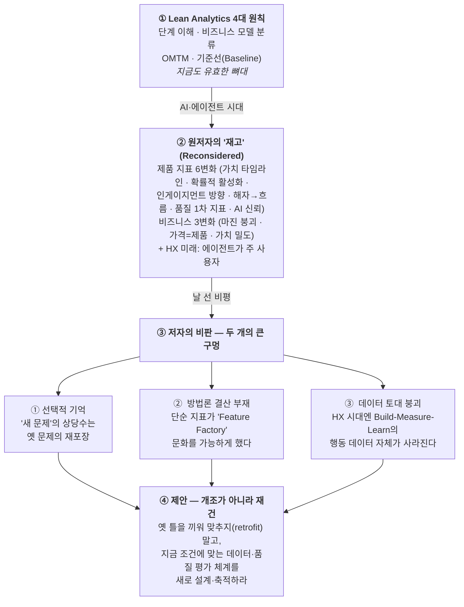

<figure class="post-figure post-figure--header">
<svg role="img" aria-label="단단한 돌탑으로 그려진 'Lean Analytics'가, 발밑의 모래(행동 데이터)가 에이전트의 손가락 사이로 빠져나가는 바람에 한쪽으로 기우는 헤더 삽화. 탑의 층은 아래부터 행동 데이터·OMTM·비즈니스 모델·단계 이해이고, 사람은 루프 밖으로 물러나며(HX) 에이전트가 토대의 모래를 API 호출로 갉아먹는다." viewBox="0 0 640 320" xmlns="http://www.w3.org/2000/svg">
  <title>측정 토대의 붕괴: 행동 데이터라는 모래가 에이전트의 손으로 빠져나가 Lean Analytics 돌탑이 기운다</title>

  <!-- caption strip -->
  <text x="320" y="28" text-anchor="middle" font-size="15" fill="currentColor" font-weight="700">기우는 측정의 돌탑</text>
  <text x="320" y="47" text-anchor="middle" font-size="11.5" fill="currentColor" opacity="0.6">토대의 모래(행동 데이터)가 에이전트의 손으로 빠져나간다</text>

  <!-- ground baseline -->
  <line x1="24" y1="284" x2="616" y2="284" stroke="currentColor" stroke-width="1.5" opacity="0.4"/>

  <!-- LEFT: the Lean Analytics stone tower, tilted because its sand footing slips -->
  <g transform="rotate(-9 250 280)">
    <!-- four stacked stone tiers, smallest on top -->
    <g fill="var(--bg-panel)" stroke="currentColor" stroke-width="2.5">
      <rect x="186" y="244" width="128" height="34"/>
      <rect x="194" y="206" width="112" height="34"/>
      <rect x="202" y="168" width="96"  height="34"/>
      <rect x="210" y="130" width="80"  height="34"/>
    </g>
    <!-- battlement crenellations on the top tier -->
    <g fill="var(--bg-panel)" stroke="currentColor" stroke-width="2.5">
      <rect x="210" y="118" width="14" height="14"/>
      <rect x="234" y="118" width="14" height="14"/>
      <rect x="258" y="118" width="14" height="14"/>
      <rect x="276" y="118" width="14" height="14"/>
    </g>
    <!-- tier labels (the 4 pillars, bottom = the foundation that is failing) -->
    <g font-size="10.5" text-anchor="middle" fill="currentColor">
      <text x="250" y="266" fill="var(--accent-color)" font-weight="700">행동 데이터</text>
      <text x="250" y="228">OMTM</text>
      <text x="250" y="190">비즈니스 모델</text>
      <text x="250" y="152" font-size="9.5">단계 이해</text>
    </g>
  </g>

  <!-- the eroding sand footing under the tower (a slumping pile draining to the right) -->
  <path d="M150,284 q60,-30 150,-22 q70,4 120,18 q-50,8 -130,6 q-90,-2 -140,-2 Z"
        fill="var(--secondary-color)" opacity="0.28" stroke="var(--secondary-color)" stroke-width="1.5"/>
  <!-- falling grains streaming out from under the foundation toward the agent's hand -->
  <g fill="var(--accent-color)" opacity="0.85">
    <rect x="392" y="262" width="4" height="4"/>
    <rect x="408" y="270" width="4" height="4"/>
    <rect x="424" y="258" width="4" height="4"/>
    <rect x="440" y="272" width="4" height="4"/>
    <rect x="416" y="282" width="3" height="3"/>
    <rect x="452" y="264" width="3" height="3"/>
  </g>

  <!-- RIGHT: the agent — a steel mechanical hand letting the data-sand run through its fingers -->
  <g stroke="currentColor" stroke-width="2.5" fill="var(--steel)" stroke-linecap="round" stroke-linejoin="round">
    <!-- palm -->
    <path d="M470,232 q-6,18 4,34 q22,14 50,6 q14,-6 14,-22 l0,-20 q-34,8 -68,2 Z"/>
    <!-- four fingers spread, sand slipping between them -->
    <path d="M476,234 l-10,30" fill="none"/>
    <path d="M494,238 l-6,32" fill="none"/>
    <path d="M512,238 l0,32"  fill="none"/>
    <path d="M530,234 l8,30"  fill="none"/>
    <!-- wrist / forearm reaching in from the right edge (the agent, outside the human loop) -->
    <path d="M538,236 l66,-22" fill="none" stroke-width="3"/>
    <rect x="592" y="200" width="22" height="22" rx="2"/>
  </g>
  <!-- grains escaping between the agent's fingers -->
  <g fill="var(--accent-color)" opacity="0.9">
    <rect x="482" y="276" width="4" height="4"/>
    <rect x="498" y="284" width="4" height="4"/>
    <rect x="516" y="280" width="4" height="4"/>
  </g>
  <!-- "API 호출" — what the agent does instead of leaving human behavior traces -->
  <text x="560" y="196" text-anchor="middle" font-size="10" fill="var(--secondary-color)" font-weight="700">API 호출</text>

  <!-- the human stepping OUT of the loop (HX), small and walking away at far right -->
  <g stroke="currentColor" stroke-width="2.2" fill="none" stroke-linecap="round" stroke-linejoin="round" opacity="0.55">
    <circle cx="600" cy="262" r="8"/>
    <path d="M600,270 l0,20"/>
    <path d="M600,278 l-10,8 M600,278 l10,8"/>
    <path d="M600,290 l-9,14 M600,290 l9,14"/>
  </g>
  <text x="600" y="318" text-anchor="middle" font-size="9.5" fill="currentColor" opacity="0.55">사람은 루프 밖으로 (HX)</text>
</svg>
<figcaption>Lean Analytics의 돌탑은 '행동 데이터'라는 모래 위에 서 있다. 사람이 루프에서 물러나고(HX) 에이전트가 그 모래를 손가락 사이로 흘려보내면, 탑이 아니라 토대가 먼저 무너진다.</figcaption>
</figure>

## 원문 정보

> - **제목**: Lean Analytics, Revisited (in AI and Agent era)
> - **출처**: Cojette (권정민, *Cojette의 Data Wonderland*) ([cojette.github.io](https://cojette.github.io/posts/leananalyticsrevisited/))
> - **발행**: 2026-05-12 · 약 34분 분량
> - **원문 링크**: <https://cojette.github.io/posts/leananalyticsrevisited/>

AI가 코드만 바꾸는 게 아니다. **무엇을, 어떻게 측정하는가** — 제품의 성패를 판단하는 지표 체계 자체를 흔든다. 이 글은 10여 년간 제품 분석의 표준 교과서였던 *Lean Analytics*가 AI·에이전트 시대에 어디서 균열이 가는지를, 원저자들의 최신 '재고' 논의와 그에 대한 날 선 비판을 통해 짚는다. AI가 산업·비즈니스의 측정 방식을 바꾸는 문제이므로 Articles의 `AI-Industry`에 담는다.

## 한 줄 요약 (TL;DR)

*Lean Analytics*의 핵심 원칙(단계·비즈니스 모델·OMTM·기준선)은 여전히 유효하지만, **측정 방법은 근본부터 다시 짜야 한다**. 원저자들의 '재고' 논의는 가치 창출 타임라인 붕괴·확률적 활성화·품질 지표·마진 붕괴 같은 변화를 짚지만, 저자는 두 가지를 더 정직하게 마주해야 한다고 본다 — (1) 그 변화의 상당수는 **AI 이전에도 존재했던 문제**를 새 용어로 포장한 것이고, (2) 사람이 루프에서 물러나는 **HX(Harness Experience) 시대**는 Lean Analytics가 전제한 **행동 데이터 수집 토대 자체**를 무너뜨린다는 사실이다.

아래 한 장이 이 글의 척추다 — *Lean Analytics*의 뼈대에서 출발해, 원저자들의 '재고', 저자의 비판, 그리고 재건 제안까지 한 흐름으로 이어진다.

## 왜 이 글을 골랐나

이 위키의 Articles에는 "AI 시대에 가치가 어디서 나고, 어떻게 측정되는가"를 다투는 글이 여럿 있다. [Anthropic·OpenAI의 PMF가 에이전트 토큰에서 나타났다는 글](/2026/06/22/anthropic-openai-product-market-fit.html)은 **매출이 나는 지점**을, [The Founder's Playbook](/2026/06/19/the-founders-playbook.html)은 **AI 네이티브 제품의 단계**를 짚는다. 이 글은 그 기반에 깔린 질문 — **"우리가 제품을 판단하는 지표 체계가 아직 유효한가"** — 를 정면으로 다룬다.

특히 데이터·제품에 가까운 개발자에게 의미가 큰 이유는, 저자가 외부 평론가가 아니라 **2013–14년부터 여러 제품에 Lean Analytics를 직접 적용해온 실무 데이터 사이언티스트**라는 점이다. 프레임워크를 사랑하면서도 그것이 어떻게 오용됐는지, "Feature Factory"로 굳어졌는지를 안에서 본 사람의 비판이라 추상적이지 않다. 그리고 핵심 통찰 하나 — **에이전트가 주 사용자가 되면 우리가 늘 분석하던 '인간 행동 데이터'가 사라진다** — 는 단순한 제품론을 넘어, agentic 시스템의 관측·평가 문제와 곧장 이어진다.

## 핵심 내용

원문은 크게 세 덩어리다 — (1) *Lean Analytics*가 원래 무엇이었나, (2) 원저자들이 내놓은 '재고' 논의, (3) 그에 대한 저자의 비판과 제안. 순서대로 정리한다.

### 1. Lean Analytics, 원래의 네 가지 뼈대

저자가 요약하는 *Lean Analytics*의 핵심은 네 가지다.

- **비즈니스 단계의 이해**: 제품은 공감(Empathy) → 점착(Stickiness) → 확산(Virality) → 매출(Revenue) → 확장(Scale)의 단계를 밟고, 각 단계마다 봐야 할 지표가 다르다.
- **비즈니스 모델 분류**: SaaS, 이커머스, 양면 시장, UGC·커뮤니티, 모바일 앱, 미디어 등 모델마다 핵심 지표가 다르다.
- **OMTM (One Metric That Matters)**: 지금 이 단계에서 가장 중요한 단 하나의 지표에 집중하라.
- **기준선(Baseline) 목표**: 단계 진입·통과의 벤치마크를 세워라.

저자는 이 틀이 한때 "모래성들 사이에서 결코 무너지지 않을 것 같은 돌탑"처럼 보였다고 회고한다. 동시에, 많은 조직이 이를 교과서적 이론으로 치부하거나 거꾸로 **기초 공사는 비어 있는데 데이터로 복잡한 것만 하고 싶어 하는** 식으로 오용하는 것도 지켜봤다.

### 2. 원저자들의 '재고': 무엇이 바뀐다고 하는가

원저자들의 최근 논의("Lean Analytics Reconsidered")는 **프레임워크의 골격은 유지하되 측정 방법은 근본적으로 바뀐다**고 말한다. 저자가 정리한 변화는 세 묶음이다.

#### 제품 지표의 여섯 가지 변화

1. **가치 창출 타임라인의 붕괴** — 사용자는 즉시 고품질 결과를 기대한다. 전통적 온보딩 지표 대신 "첫 유용한 출력까지의 시간(time to first useful output)"이 중요해진다.
2. **활성화(activation)가 확률적이 된다** — 절차를 다 밟아도 결과가 보장되지 않는다. 단순 이벤트가 아니라 **품질로 가중된 이벤트**가 필요하다.
3. **인게이지먼트의 '방향'이 중요해진다** — 사용자가 프롬프트와 씨름하며 보낸 시간은 나쁜 신호고, AI가 알아서 일을 처리하는 것은 좋은 신호다. 체류 시간이 곧 참여라는 등식이 깨진다.
4. **해자에서 흐름으로(Moat → Flow)** — 점착의 본질이 락인(lock-in)에서 **통합 깊이와 워크플로 연결성**으로 이동한다.
5. **품질이 1차 지표가 된다** — 비결정적 출력 탓에 지속적인 품질 평가 체계가 필수가 된다.
6. **AI 신뢰가 선행 지표가 된다** — AI 네이티브 사용자와 AI 회의 사용자를 별도 코호트로 나눠 채택·승인율을 따로 추적해야 한다.

#### 비즈니스 모델의 세 가지 변화

1. **파워 유저의 역설과 마진 붕괴** — 토큰 소비가 변동비를 만든다. 헤비 유저가 구독 마진을 갉아먹으므로 "활성 사용자당 마진", "성공한 작업당 비용"을 봐야 한다.
2. **가격제가 곧 제품 결정** — 과금 모델이 "사용자 성공"의 정의 자체를 규정한다.
3. **실험의 의무와 'vibe stuffing' 위험** — AI 기능의 한계비용이 0에 가깝다 보니 근거 없이 기능을 들이붓기 쉽다. "가치 밀도(value density, 컴퓨트 1달러당 뽑아낸 가치)"를 측정해야 한다.

#### 미래: 사람이 루프에서 물러난다 (HX 시대)

원저자들은 더 나아가, **에이전트가 주 사용자**가 되는 미래를 말한다. 그때는 전통적 UX 대신 "Harness Experience(HX)"가 필요하고, 에이전트가 어떤 API를 호출할지 스스로 고르므로 **발견 가능성(discoverability)과 재사용성**이 플랫폼 리스크가 된다. 즉각적 행동 항목으로는 — 피상적 인게이지먼트 지표 버리기, 코호트별 품질 뷰 만들기, 활성 사용자당 마진 측정, 에이전트 트래픽 분리, 무절제한 기능 추가 멈추기 등을 제시한다.

### 3. 저자의 비판: 두 개의 큰 구멍

여기서 글은 단순 소개에서 비평으로 넘어간다. 저자는 원저자들의 '재고'가 **두 가지를 정직하게 마주하지 못했다**고 본다.

**첫째, 선택적 기억(selective memory).** "새 문제"로 제시된 것의 상당수가 AI 이전부터 있던 문제라는 것이다.

- **체류 시간 비판**: *Lean Analytics* 원전에서 이미 허영 지표(vanity metric)로 분류했던 것을 이제 와 버리자는 건, 과거의 일관성 부재를 드러낼 뿐이다.
- **온보딩이 결과를 보장한다는 환상**: 원래도 보장한 적 없다. 퍼널을 다 통과해도 목표를 못 이루면 사용자는 늘 이탈했다.
- **워크플로 통합**: SaaS는 언제나 통합과 워크플로 연결을 우선했다. AI 시대의 발명이 아니다.
- **기능 비대(feature bloat)**: 'vibe stuffing'은 수년 전부터 논의된 "Feature Factory" 문제의 재판이다. 새 통찰 없는 새 용어다.
- **근거 없는 기능 추가**: 예전엔 자원을 낭비했고 지금은 토큰을 낭비할 뿐, 뿌리는 그대로다.

**둘째, 방법론 자체에 대한 결산 부재.** 저자가 더 무겁게 짚는 지점이다.

- 단순화된 지표가 **게으른 분석과 "Feature Factory" 문화를 가능하게 했다**는 점을 원저자들은 인정하지 않는다.
- 핵심 엔진인 **Build-Measure-Learn 사이클 자체가 약해진다** — 에이전트 트래픽이 지배하면 행동 데이터의 해석 가능성이 무너지기 때문이다.
- **HX 시대는 Lean Analytics가 전제한 '행동 추적' 토대와 근본적으로 다른 데이터 아키텍처**를 요구한다. 원저자들은 프레임워크가 작동하던 조건이 무너지는 와중에 프레임워크를 보존하려 한다.

저자는 몇몇 개념의 모호함도 지적한다 — "사용자 성공(user success)"은 정의되지 않은 채 지나치게 막연하고, "발견 가능성"은 옛 "확산(virality)" 논의의 재포장이며, **AI로 강화된 제품 / AI로 만드는 개발 / 에이전트가 소비하는 제품**이라는 세 가지 서로 다른 개념이 뒤섞여 있다는 것이다.

### 4. 저자의 제안: 개조가 아니라 재건

결론에서 저자는 옛 틀을 AI 시대에 끼워 맞추는(retrofit) 대신 이렇게 하라고 말한다.

- 가치 추정에서 우리가 **역사적으로 얼마나 부주의했는지**를 먼저 이해할 것.
- 지금 조건에 맞는 데이터를 **새로 설계하고 축적**할 것.
- "평가 공장(evaluation factory)"으로 빠지지 않는 **품질 평가 체계**를 세울 것.
- 인간 행동 분석에 상응하는, **시스템 출력의 결과를 분석하는 프레임워크**를 개발할 것.

## 분석과 인사이트

여기서부터는 원문 요약이 아니라 내 관점이다.

**이 글의 진짜 메시지는 "Lean Analytics가 틀렸다"가 아니라 "도구가 아니라 우리의 규율이 문제였다"이다.** 원저자들의 '재고'는 변화를 잘 짚는다. 하지만 저자의 통찰은 한 단계 깊다 — OMTM·허영 지표 구분 같은 원칙은 처음부터 옳았는데, 조직들이 그걸 **체크리스트로 납작하게** 만들어 "지표 하나만 올리면 된다"는 핑계로 써왔다는 것이다. AI가 이 게으름을 드러냈을 뿐, 만든 건 아니다. 이 진단은 [의도 부채(Intent Debt)](/2026/06/21/intent-debt.html)의 논리와 정확히 같은 형태다 — 도구가 빨라질수록, 사람이 건너뛴 사고(왜 이걸 측정하는가)의 비용이 더 커진다.

**가장 날카로운 통찰은 'HX 시대에 행동 데이터가 사라진다'는 한 문장이다.** Lean Analytics를 포함한 모든 제품 분석은 **"인간이 클릭하고 머물고 이탈하는 흔적"**을 읽어 가치를 추정해왔다. 그런데 에이전트가 주 사용자가 되면 그 흔적의 의미가 무너진다 — 에이전트의 "체류 시간"은 인게이지먼트가 아니라 그냥 루프 길이고, 에이전트의 "재방문"은 충성도가 아니라 워크플로 설정값이다. 우리가 측정의 기준으로 삼던 **행동 신호 자체가 해석 불가능해진다.** 이건 제품 매니저만의 문제가 아니다. agentic 시스템을 만드는 개발자에게 곧장 "에이전트가 만든 결과를 무엇으로 평가할 것인가"라는 [품질·검증 계층](/2026/06/22/self-service-data-analytics-with-claude.html)의 문제로 떨어진다.

**다만 비판에 살짝 균형을 더하고 싶다.** "옛 문제의 재포장"이라는 지적은 대체로 정당하지만, **정도(degree)의 변화가 종류(kind)의 변화가 되는 지점**도 있다고 본다. 예컨대 토큰의 변동비는 — 과거 인프라 비용이 사실상 고정비처럼 다뤄지던 것과 달리 — 사용자 한 명의 행동이 **실시간으로 손익을 가르는** 구조를 만든다. 이건 "예전에도 자원을 낭비했다"는 말로 다 담기 어려운, 단위경제(unit economics)의 질적 전환에 가깝다. 실제로 [에이전트 토큰에서 PMF가 나타났다는 분석](/2026/06/22/anthropic-openai-product-market-fit.html)이 보여주듯, "활성 사용자당 마진"은 이제 회계 항목이 아니라 제품 설계 변수다. 저자의 "재포장" 프레임은 원저자의 자기과시는 잘 폭로하지만, 일부 변화의 **새로움까지 과소평가**할 위험이 있다.

<figure class="post-figure">
<svg role="img" aria-label="구독 매출이 사용량과 무관하게 평평한 두 그래프 비교 삽화. 왼쪽 '고정비 시대'에서는 비용선이 거의 평평해 매출선 아래 마진이 일정하게 유지된다. 오른쪽 '토큰 변동비 시대'에서는 사용량이 늘수록 비용선이 가파르게 올라 매출선을 넘어서고, 헤비 유저 구간에서 마진이 0 아래로 떨어진다 — 정도의 변화가 종류의 변화가 되는 지점." viewBox="0 0 640 300" xmlns="http://www.w3.org/2000/svg">
  <title>고정비 vs 토큰 변동비: 헤비 유저가 마진을 0 아래로 끌어내리는 단위경제의 질적 전환</title>

  <!-- ===== LEFT PANEL: fixed-cost era — margin stays flat ===== -->
  <text x="150" y="26" text-anchor="middle" font-size="13" fill="currentColor" font-weight="700">고정비 시대</text>
  <text x="150" y="44" text-anchor="middle" font-size="10" fill="currentColor" opacity="0.6">비용이 평평 → 마진 일정</text>
  <!-- axes -->
  <line x1="40" y1="220" x2="40" y2="70" stroke="currentColor" stroke-width="1.5" opacity="0.5"/>
  <line x1="40" y1="220" x2="262" y2="220" stroke="currentColor" stroke-width="1.5" opacity="0.5"/>
  <text x="34" y="78" text-anchor="end" font-size="9" fill="currentColor" opacity="0.6">₩</text>
  <text x="262" y="236" text-anchor="end" font-size="9" fill="currentColor" opacity="0.6">사용량 →</text>
  <!-- revenue (subscription, flat) -->
  <line x1="40" y1="108" x2="252" y2="108" stroke="var(--secondary-color)" stroke-width="2.5"/>
  <text x="248" y="102" text-anchor="end" font-size="9" fill="var(--secondary-color)" font-weight="700">매출(구독)</text>
  <!-- cost (nearly flat, fixed) -->
  <line x1="40" y1="184" x2="252" y2="172" stroke="currentColor" stroke-width="2.5" stroke-dasharray="5 4" opacity="0.75"/>
  <text x="248" y="190" text-anchor="end" font-size="9" fill="currentColor" opacity="0.7">비용(고정)</text>
  <!-- margin band (steady, positive) -->
  <path d="M40,108 L252,108 L252,172 L40,184 Z" fill="var(--secondary-color)" opacity="0.16"/>
  <text x="146" y="148" text-anchor="middle" font-size="10" fill="var(--secondary-color)" font-weight="700">+ 마진</text>

  <!-- divider -->
  <line x1="320" y1="60" x2="320" y2="244" stroke="currentColor" stroke-width="1" opacity="0.25"/>

  <!-- ===== RIGHT PANEL: token variable-cost era — margin collapses past zero ===== -->
  <text x="478" y="26" text-anchor="middle" font-size="13" fill="currentColor" font-weight="700">토큰 변동비 시대</text>
  <text x="478" y="44" text-anchor="middle" font-size="10" fill="currentColor" opacity="0.6">비용이 매출을 추월 → 마진 붕괴</text>
  <!-- axes -->
  <line x1="368" y1="220" x2="368" y2="70" stroke="currentColor" stroke-width="1.5" opacity="0.5"/>
  <line x1="368" y1="220" x2="600" y2="220" stroke="currentColor" stroke-width="1.5" opacity="0.5"/>
  <text x="362" y="78" text-anchor="end" font-size="9" fill="currentColor" opacity="0.6">₩</text>
  <text x="600" y="236" text-anchor="end" font-size="9" fill="currentColor" opacity="0.6">사용량 →</text>
  <!-- revenue (subscription, still flat) -->
  <line x1="368" y1="108" x2="590" y2="108" stroke="var(--secondary-color)" stroke-width="2.5"/>
  <text x="586" y="102" text-anchor="end" font-size="9" fill="var(--secondary-color)" font-weight="700">매출(구독)</text>
  <!-- cost (climbs steeply with usage, crosses revenue) -->
  <path d="M368,196 Q470,150 590,72" fill="none" stroke="var(--accent-color)" stroke-width="2.5"/>
  <text x="556" y="70" text-anchor="end" font-size="9" fill="var(--accent-color)" font-weight="700">비용(토큰)</text>
  <!-- positive-margin band up to the crossover -->
  <path d="M368,108 L478,108 L478,131 Q420,165 368,196 Z" fill="var(--secondary-color)" opacity="0.16"/>
  <!-- crossover point: margin = 0 -->
  <circle cx="478" cy="108" r="4.5" fill="var(--accent-color)"/>
  <line x1="478" y1="108" x2="478" y2="220" stroke="currentColor" stroke-width="1" stroke-dasharray="3 3" opacity="0.45"/>
  <text x="478" y="234" text-anchor="middle" font-size="8.5" fill="currentColor" opacity="0.6">마진 = 0</text>
  <!-- negative-margin band beyond the crossover (cost above revenue) -->
  <path d="M478,108 L590,108 L590,72 Q536,98 478,108 Z" fill="var(--accent-color)" opacity="0.20"/>
  <text x="548" y="98" text-anchor="middle" font-size="10" fill="var(--accent-color)" font-weight="700">− 손실</text>
  <!-- heavy-user marker -->
  <text x="556" y="206" text-anchor="middle" font-size="8.5" fill="currentColor" opacity="0.65">헤비 유저</text>
</svg>
<figcaption>같은 구독 매출이라도, 비용이 고정비일 때는 마진이 평평하게 유지되지만(왼쪽) 토큰 변동비 시대엔 사용량이 많은 헤비 유저 한 명이 비용선을 매출선 위로 끌어올려 마진을 0 아래로 떨어뜨린다(오른쪽). "활성 사용자당 마진"이 회계가 아니라 제품 설계 변수가 되는 이유다.</figcaption>
</figure>

**개발자·데이터 실무자에게 주는 함의는 분명하다.** Lean Analytics의 교훈은 폐기 대상이 아니라 **"한 번도 제대로 못 한 기초"**다. 새 프레임워크를 찾아 헤매기 전에, (1) 우리가 정말 가치를 측정하고 있었는지, (2) 에이전트 트래픽과 인간 트래픽을 분리해 보고 있는지, (3) 결과 품질을 평가하는 체계가 "평가 공장"이 아닌지를 먼저 물어야 한다. **"기초 공사는 비어 있는데 데이터로 복잡한 것만 하고 싶어 한다"** — 이 한 문장이 AI 시대에 더 아프게 들린다.

**한계도 적어둔다.** 이 글은 본인의 오랜 실무 경험과 원저자 논의에 대한 비평으로, 특정 회사의 지표나 수치를 제시하는 사례 연구가 아니다. "행동 데이터가 무너진다"는 강한 주장은 설득력 있는 방향 제시이되, **에이전트 시대의 새 데이터 아키텍처가 구체적으로 무엇인지**는 — 저자 본인도 인정하듯 — 열린 과제로 남는다. 진단은 날카롭지만 처방은 원칙 수준이라는 점을 감안해 읽는 게 맞다.

## 적용 포인트

- **에이전트 트래픽과 인간 트래픽을 별도 코호트로 분리해 보라.** 둘을 섞은 "평균 체류 시간"은 이제 거짓말이다. 에이전트의 행동 신호는 충성도가 아니라 설정값으로 읽어야 한다.
- **"첫 유용한 출력까지의 시간 + 그 출력의 품질"을 활성화 지표로 삼아라.** 절차 완료(funnel completion)는 더 이상 성공을 보장하지 않는다. 품질로 가중하지 않은 이벤트는 허영 지표다.
- **"활성 사용자당 마진"과 "성공한 작업당 비용"을 손익이 아닌 제품 지표로 추적하라.** 토큰 변동비 시대에 헤비 유저는 매출이자 손실일 수 있다.
- **기능을 추가하기 전에 "가치 밀도"를 물어라.** 한계비용이 0에 가깝다는 이유로 들이붓는 'vibe stuffing'은 옛 Feature Factory의 새 이름일 뿐이다.
- **품질 평가 체계를 만들되 "평가 공장"을 경계하라.** 비결정적 출력엔 지속적 평가가 필요하지만, 평가 자체가 목적이 된 또 다른 의식(ritual)으로 굳지 않게 하라.
- **새 프레임워크를 찾기 전에 기초를 점검하라.** OMTM·허영 지표 구분 같은 원칙을 체크리스트가 아니라 규율로 다시 세우는 것이 먼저다.

## 마무리

저자의 결론은 단단하다 — *Lean Analytics*는 여전히 가치 있지만, 원저자들의 '재고'는 두 가지를 정직하게 마주하지 못한다. **하나는 그 단순한 지표들이 수년간 게으른 제품 문화를 가능하게 했다는 결산이고, 다른 하나는 사람이 루프에서 물러나는 미래가 프레임워크의 데이터 토대 자체를 무너뜨린다는 사실이다.** 화장 같은 업데이트로 옛 틀을 보존할 게 아니라, 인간의 상호작용이 선택사항이 되는 시대에 제품 가치를 어떻게 측정할지를 정직하게 재건해야 한다. 우리 개발자·데이터 실무자에게 남는 한 줄은 이것이다 — **새 지표를 찾기 전에, 한 번도 제대로 못 한 기초부터 다시 깔아라.**

### 더 읽어보기

- [원문 — Lean Analytics, Revisited (in AI and Agent era) (Cojette)](https://cojette.github.io/posts/leananalyticsrevisited/)
- [Anthropic과 OpenAI는 PMF를 찾았다: 구독이 아니라 '에이전트 토큰'에서](/2026/06/22/anthropic-openai-product-market-fit.html) — 매출이 나는 지점에서 본 단위경제, 마진 붕괴 논의의 짝패
- [The Founder's Playbook: AI 네이티브 스타트업을 만드는 4단계](/2026/06/19/the-founders-playbook.html) — Empathy→Scale 단계론을 AI 제품에 적용한 다른 시각
- [Intent Debt: 에이전트가 대신 갚아줄 수 없는 단 하나의 부채](/2026/06/21/intent-debt.html) — 도구가 빨라질수록 건너뛴 사고의 비용이 커진다는 같은 형태의 논리
- [소프트웨어는 죽는 게 아니라 재평가된다](/2026/06/19/software-is-evolving-not-dead.html) — 해자(moat)가 흐름(flow)으로 이동한다는 논의와 맞닿는 지점
- [데이터는 소프트웨어가 아니다 — Anthropic의 셀프서비스 분석](/2026/06/22/self-service-data-analytics-with-claude.html) — 에이전트 결과의 품질·검증을 어떻게 체계화하는가
