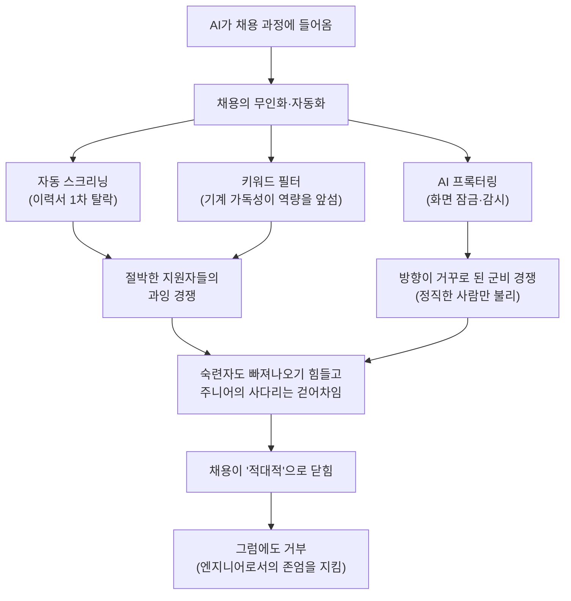

<figure class="post-figure post-figure--header">
<svg role="img" aria-label="채용이라는 관문 앞 장면: 맨발의 엔지니어가 'AUTO-SCREEN', 'AI 검열', '키워드 필터'라고 적힌 흩뿌려진 블록 위를 맨발로 건너 '면접'이라는 관문을 향한다. 관문 위에는 AI 프록터링을 상징하는 감시의 눈이 떠 있고, 그 시선 빔이 엔지니어를 비춘다 — 원문의 핵심 비유." viewBox="0 0 640 320" xmlns="http://www.w3.org/2000/svg">
  <title>채용이라는 적대적 관문 — 흩뿌려진 필터 블록 위를 맨발로 건너는 엔지니어</title>

  <!-- ground line -->
  <line x1="20" y1="262" x2="620" y2="262" stroke="currentColor" stroke-width="2" opacity="0.35"/>

  <!-- AI proctoring eye, floating over the gate -->
  <g>
    <ellipse cx="512" cy="58" rx="46" ry="26" fill="var(--bg-light)" stroke="currentColor" stroke-width="2.5"/>
    <circle cx="512" cy="58" r="15" fill="none" stroke="var(--accent-color)" stroke-width="3"/>
    <circle cx="512" cy="58" r="5" fill="var(--accent-color)"/>
    <text x="512" y="103" text-anchor="middle" font-size="11" fill="currentColor" font-weight="700" opacity="0.85">AI 프록터링</text>
    <!-- surveillance beam toward the engineer -->
    <path d="M488,74 L300,250 L344,256 L508,72 Z" fill="var(--accent-color)" opacity="0.14"/>
  </g>

  <!-- the gate ('면접') the engineer must reach -->
  <g>
    <rect x="556" y="150" width="14" height="112" fill="var(--bg-light)" stroke="currentColor" stroke-width="2.5"/>
    <rect x="462" y="150" width="14" height="112" fill="var(--bg-light)" stroke="currentColor" stroke-width="2.5"/>
    <rect x="452" y="132" width="128" height="22" fill="var(--bg-light)" stroke="currentColor" stroke-width="2.5"/>
    <text x="516" y="148" text-anchor="middle" font-size="12" fill="currentColor" font-weight="700">면 접</text>
    <text x="516" y="252" text-anchor="middle" font-size="9" fill="currentColor" opacity="0.6">GATE</text>
  </g>

  <!-- scattered filter blocks the engineer must cross (barefoot) -->
  <!-- block 1: AUTO-SCREEN -->
  <g>
    <rect x="96" y="232" width="92" height="30" fill="var(--bg-light)" stroke="currentColor" stroke-width="2.5"/>
    <rect x="96" y="232" width="6" height="30" fill="var(--secondary-color)"/>
    <text x="146" y="251" text-anchor="middle" font-size="10" fill="currentColor" font-weight="700">AUTO-SCREEN</text>
  </g>
  <!-- block 2: AI 검열 (tilted, unstable footing) -->
  <g transform="rotate(-9 252 214)">
    <rect x="210" y="200" width="84" height="28" fill="var(--bg-light)" stroke="currentColor" stroke-width="2.5"/>
    <rect x="210" y="200" width="6" height="28" fill="var(--accent-color)"/>
    <text x="254" y="218" text-anchor="middle" font-size="10" fill="currentColor" font-weight="700">AI 검열</text>
  </g>
  <!-- block 3: 키워드 필터 (higher, a wobbly step) -->
  <g transform="rotate(7 372 178)">
    <rect x="324" y="164" width="98" height="28" fill="var(--bg-light)" stroke="currentColor" stroke-width="2.5"/>
    <rect x="324" y="164" width="6" height="28" fill="var(--gold)"/>
    <text x="373" y="182" text-anchor="middle" font-size="10" fill="currentColor" font-weight="700">키워드 필터</text>
  </g>
  <!-- a couple of loose scattered cubes underfoot (instability) -->
  <rect x="190" y="244" width="18" height="18" fill="var(--bg-light)" stroke="currentColor" stroke-width="2" transform="rotate(14 199 253)"/>
  <rect x="430" y="226" width="16" height="16" fill="var(--bg-light)" stroke="currentColor" stroke-width="2" transform="rotate(-12 438 234)"/>

  <!-- the barefoot engineer — mid-stride, arms out for balance, on the tilted block -->
  <g>
    <!-- head -->
    <circle cx="250" cy="150" r="13" fill="none" stroke="currentColor" stroke-width="2.5"/>
    <!-- torso -->
    <line x1="250" y1="163" x2="250" y2="196" stroke="currentColor" stroke-width="2.5"/>
    <!-- balancing arms -->
    <line x1="250" y1="172" x2="224" y2="158" stroke="currentColor" stroke-width="2.5"/>
    <line x1="250" y1="172" x2="280" y2="160" stroke="currentColor" stroke-width="2.5"/>
    <!-- striding legs -->
    <line x1="250" y1="196" x2="236" y2="226" stroke="currentColor" stroke-width="2.5"/>
    <line x1="250" y1="196" x2="266" y2="222" stroke="currentColor" stroke-width="2.5"/>
    <!-- bare feet emphasis (small marks at foot tips) -->
    <circle cx="236" cy="226" r="2.5" fill="var(--accent-color)"/>
    <circle cx="266" cy="222" r="2.5" fill="var(--accent-color)"/>
    <text x="250" y="124" text-anchor="middle" font-size="11" fill="currentColor" font-weight="700">엔지니어</text>
    <text x="250" y="112" text-anchor="middle" font-size="9" fill="currentColor" opacity="0.65">맨발</text>
  </g>

  <!-- forward dotted path hint toward the gate -->
  <path d="M286,210 C360,210 420,200 452,196" fill="none" stroke="var(--secondary-color)" stroke-width="2.5" stroke-dasharray="2 7" stroke-linecap="round" opacity="0.85"/>
</svg>
<figcaption>능력을 증명하라면서, 정작 흩뿌려 놓은 블록(자동 스크리닝·AI 검열·키워드 필터) 위를 맨발로 건너게 하는 채용 — AI 프록터링의 눈이 그 위를 내려다본다. 원문의 핵심 비유.</figcaption>
</figure>

## 원문 정보

> - **제목**: Jobs and Software is Fucked
> - **출처**: 익명의 소프트웨어 엔지니어 — On Games And Design (개인 블로그, [urflow.bearblog.dev](https://urflow.bearblog.dev))
> - **발행**: 2026-06-19 · 약 3~4분 분량
> - **원문 링크**: <https://urflow.bearblog.dev/jobs-and-software-is-fucked/>

`Articles` 카테고리는 읽을 만한 외부 글을 골라 핵심을 정리하고 내 관점으로 분석하는 공간이다. 이 글은 통계나 프레임워크를 내세운 분석문이 아니라, 6개월째 일자리를 못 구한 한 베테랑 엔지니어가 쏟아낸 **현장의 1인칭 기록**이다. 그래서 더 솔직하고, AI가 채용 시장을 어떻게 망가뜨렸는지를 데이터가 아니라 체감으로 보여 준다.

## 한 줄 요약 (TL;DR)

10년 차, Blizzard에서 7년 일하다 정리해고된 엔지니어가 본 지금의 채용 시장은 단순히 "힘든" 게 아니라 **적대적**이다. AI는 채용을 개선하기는커녕 그 안의 가장 나쁜 면들 — 무인 자동 스크리닝, 절박한 지원자들의 과잉 경쟁, 키워드 필터링된 이력서 심사 — 을 한꺼번에 증폭시켰다. 그럼에도 저자는 코드 품질과 보안을 포기해 가며 AI에 영합하는 것은 "엔지니어로서의 존엄을 버리는 일"이라며 거부한다.

## 왜 이 글을 골랐나

이 위키에는 "AI로 어떻게 더 잘 만들 것인가"를 다룬 글이 많다. 한 발 물러서 "AI가 노동시장을 어떻게 바꿨는가"를 데이터로 따진 [AI는 왜 소프트웨어 엔지니어를 대체하지 못했나](/2026/06/19/ai-hasnt-replaced-engineers.html)나 [죽은 경제 이론](/2026/06/22/the-dead-economy-theory.html) 같은 글도 있다. 이 글은 그 **데이터의 반대편, 즉 한 사람의 몸으로 통과한 시장의 질감**을 채운다.

데이터는 "엔지니어 고용은 둔화됐을 뿐 무너지지 않았다"고 말하지만, 그 통계 안에는 final round까지 가서 떨어지고 리크루터에게 잠수당하는 개개인의 6개월이 보이지 않는다. 이 글은 그 6개월을 보여 준다. 거시 통계와 미시 체험을 나란히 놓고 읽으면, "AI가 일자리를 없앴다"는 단순한 명제 대신 **"AI가 채용이라는 절차를 어떻게 적대적으로 만들었나"** 라는 더 정확한 질문이 떠오른다. 그게 이 글을 고른 이유다.

이 글이 그리는 인과 사슬을 한눈에 보면 이렇다.

## 핵심 내용

원문은 짧은 1인칭 에세이다. 아래 정리는 모두 본문에 실제로 등장하는 내용이며, 사실과 저자의 감정 토로를 구분해 옮겼다.

### 저자가 선 자리

저자는 10년 차 소프트웨어 엔지니어다. 작은 외주 업체를 거쳐 Blizzard에서 7년을 일했고, 2025년 6월에 정리해고됐다. 글을 쓰는 시점은 실직 6개월째. 그는 지금의 시장을 "최근 기억 중 최악"이라고 부른다. 베테랑의 이력서를 들고도 빠져나오기 힘든 시장이라는 점이 글 전체의 전제다.

### 면접이라는 고문

저자가 먼저 토로하는 건 면접 경험이다. 좋은 신호를 받으며 최종 라운드까지 갔는데도 거듭 떨어지고, 떨어진 뒤에는 리크루터들이 그대로 침묵에 들어간다. 역량이 명백히 맞아떨어지는 자리였는데도 그렇다. 그는 응답 없는 리크루터들을 LinkedIn에서 하나씩 끊어 낸다고 적는다.

이 단락의 정서를 가장 잘 압축한 문장이 글에서 가장 많이 인용되는 비유다. 지원할 때마다 마치 회사가 눈앞에 레고 블록을 흩뿌려 놓고는, 네 가치를 증명하려면 그 위에서 맨발로 춤춰 보라고 시키는 것 같다는 것. 능력을 보여 달라면서 정작 능력과 무관한 고통을 통과 의례로 요구하는 구조에 대한 냉소다.

### 자동 스크리닝의 모순

기술적으로 가장 날카로운 비판은 자동 코딩 테스트 플랫폼을 향한다. 저자는 Coderpad, HackerRank 같은 도구가 깔아 놓은 장벽을 이렇게 짚는다.

- **전체 화면 잠금(full-screen lockout)** — 레퍼런스 문서를 띄워 볼 수 없게 막는다.
- **AI 프록터링(AI proctoring)** — 시험 중 응시자를 감시한다.
- **현업 개발자가 아닌 사람이 설계** — 실무 감각이 없는 사람들이 만든 절차라는 것.

그가 찌르는 핵심 모순은 이렇다. 회사들은 이런 도구를 부정행위를 막는 필터로 쓰지만, 그 모든 장치는 결국 **"옆에서 휴대폰을 든 어떤 작자(some asshole on their phone)"가 지금의 AI 도구로 손쉽게 우회**해 버린다는 것. 진지하게 정직하게 푸는 사람만 화면에 갇혀 불리해지고, 속이려는 사람은 오히려 자유롭다. 검열은 점점 빡빡해지는데 정작 막으려던 부정행위는 못 막는, 방향이 거꾸로 된 군비 경쟁이다.

### AI가 증폭시킨 것들

저자는 AI가 상황을 개선하기는커녕 "최악의 면들을 모조리 증폭(supercharged)"시켰다고 본다. 두 가지가 겹친다.

하나는 **경쟁의 과열**이다. 절박한 지원자들이 AI로 무장하면서, 한 자리를 두고 사실상 이길 수 없는 경쟁이 벌어진다. 다른 하나는 **이력서 심사의 무인화**다. 이제 이력서는 키워드 매칭과 AI에 최적화된 표현으로 1차 걸러진다. 사람이 읽기 전에 기계가 먼저 떨어뜨리는 구조에서는, 실제 역량보다 "기계가 통과시키는 문장"을 쓰는 능력이 앞서게 된다.

### 사다리를 걷어차는 사람들

저자는 이 고통이 자신만의 것이 아님을 분명히 한다. 아티스트, QA 테스터, 작가, 그리고 주니어 개발자 모두가 같은 충격을 받고 있다. 특히 그는 회사들이 **사다리를 완전히 걷어차고(pulling up the ladder completely)** Anthropic이 주니어의 필요 자체를 없애 주기를 기대하는 분위기를 지적한다. 당장의 효율을 위해 다음 세대가 올라올 발판을 치워 버리는 선택이다.

그리고 마지막 거부. AI를 받아들이지 않는 것이 곧 손해라는 압박 속에서도, 그는 코드 품질과 보안을 포기하면서까지 AI에 영합하는 것은 **"엔지니어로서의 존엄(dignity as a software engineer)"을 내주는 일**이라고 못 박는다. 그러면서도 "나는 이 일이 내가 가진, 괴짜 컴퓨터 너드로서의 기쁨을 앗아 가게 두지 않을 것이다. 그럴 수 없다. 하지만 이 모든 게 너무 지친다"는 문장으로 글을 닫는다. 분노가 아니라 피로로 끝나는 글이다.

## 분석과 인사이트

여기서부터는 원문 요약이 아니라 내 관점이다.

**이 글의 가치는 "데이터의 빈칸"을 메우는 데 있다.** [AI는 왜 소프트웨어 엔지니어를 대체하지 못했나](/2026/06/19/ai-hasnt-replaced-engineers.html)는 해고 공시·고용 통계·로그 데이터로 "엔지니어 고용은 무너지지 않았다"를 보여 줬다. 그 말은 맞다. 하지만 거시 통계가 평평해 보여도, 그 안에서 **채용이라는 절차 자체의 품질은 급격히 나빠질 수 있다**. 일자리 총량과 그 일자리에 닿는 경로의 고통은 별개의 문제다. 이 글은 후자, 즉 "취업 과정의 적대성"을 증언한다. 두 글을 같이 읽어야 시장의 그림이 입체가 된다.

**자동 스크리닝의 모순은 보안 문제로 읽으면 더 분명해진다.** 저자의 비판 — 정직한 사람만 화면에 갇히고 부정행위자는 자유롭다 — 은 전형적인 **위협 모델의 실패**다. 이 위키의 [사기의 미래는 이미 와 있다](/2026/06/20/the-future-of-the-con-is-already-here.html)가 다룬 구도와 똑같다. 방어자는 비용을 치르는데 공격자는 AI로 그 비용을 우회해 버린다. AI 프록터링은 "통제하고 있다는 감각"을 회사에 팔지만, 실제로는 부정행위를 막지 못하면서 선량한 지원자에게만 마찰을 가중한다. **검증 비용을 엉뚱한 쪽에 부과하는 설계**는 보안에서든 채용에서든 같은 방식으로 실패한다.

**"이력서가 키워드로 1차 걸러진다"는 대목이 가장 실무적으로 중요하다.** 기계가 사람보다 먼저 떨어뜨린다면, 게임의 1차전은 "역량"이 아니라 "기계 가독성"에서 벌어진다. 이건 부당하지만 현실이고, [노동시장이라는 게임에서 살아남기](/2026/06/22/surviving-in-the-job-market.html)가 말한 "자신을 벤더로 포지셔닝하라"는 조언과 정확히 맞물린다. 좋은 제품도 유통 채널(여기서는 ATS와 AI 필터)을 통과하지 못하면 고객(채용 담당자) 앞에 서지조차 못한다.

**다만 한쪽으로 기운 글이라는 점은 짚어 둬야 한다.** 이건 분석이 아니라 토로다. 표본은 한 사람, 게다가 6개월간 거절을 누적한 사람의 시점이다. final round 거절이 반드시 "시스템의 부조리" 때문만은 아닐 수 있고, 자동 스크리닝이 모두 무용한 것도 아니다(대량 지원 환경에서 1차 필터는 회사 입장에선 합리적이다). 저자도 이를 모르지 않을 것이다. 글의 힘은 객관성이 아니라 **솔직함**에 있다. 그래서 나는 이 글을 "시장의 진단"이 아니라 "시장이 한 숙련자에게 남긴 흉터의 기록"으로 읽는다.

**가장 오래 남는 건 마지막의 거부다.** 효율의 이름으로 코드 품질과 보안을 내주는 것이 곧 "존엄을 버리는 일"이라는 선언은, 이 위키가 [그냥 그렇게 말하면 된다](/2026/06/22/you-can-just-say-it.html)나 [내 소프트웨어의 북극성](/2026/06/22/my-software-north-star.html)에서 이어 온 주제 — 인간의 가치를 'AI보다 잘함'으로 증명하려 하지 말라 — 와 연결된다. 시장이 적대적일수록 자신이 무엇을 포기하지 않을지를 정해 두는 것이 오히려 방향타가 된다. 분노가 아니라 피로로 끝나는 결말이 더 현실적이라서, 더 오래 곱씹게 된다.

## 적용 포인트

- **거시 통계와 미시 체험을 함께 본다.** "엔지니어 고용은 무너지지 않았다"는 통계가 맞아도, 채용 절차의 적대성은 별개로 나빠질 수 있다. 둘을 분리해서 판단하라.
- **이력서를 두 독자에게 쓴다.** 기계(ATS·AI 필터)가 1차 독자, 사람이 2차 독자다. 직무 공고의 핵심 키워드를 정직하게 반영하되, 통과 후 사람이 읽을 서사도 함께 갖춰라.
- **자동 코딩 테스트는 도구로 연습한다.** 화면 잠금·시간 제한·레퍼런스 차단 같은 제약 자체에 익숙해지는 것이 실력과 별개의 통과 변수다. 불공정하지만 게임의 규칙이다.
- **리크루터의 침묵을 자신의 결함으로 해석하지 않는다.** 잠수는 시스템의 디폴트 동작에 가깝다. 거절을 자기 가치의 측정값으로 받아들이지 말고, 다음 시도로 빠르게 넘어가라.
- **포기하지 않을 선을 미리 정해 둔다.** 시장 압박 속에서 무엇(코드 품질·보안·정직)을 내주지 않을지를 정해 두면, 영합과 번아웃 사이에서 흔들리지 않는 기준이 된다.
- **주니어라면 사다리가 걷어차인 현실을 직시하고 우회로를 설계한다.** 첫 칸이 막혔다면 오픈소스 기여·실제 산출물·사이드 프로젝트로 "경험 없음" 필터를 넘어설 증거를 만들어라.

## 마무리

이 글은 답을 주지 않는다. 해결책도, 5단계 프레임워크도 없다. 대신 지금 시장을 통과하는 한 사람의 몸이 어떤 마찰을 느끼는지를 정직하게 보여 준다. AI가 일자리 총량을 얼마나 줄였는지를 따지는 논쟁이 뜨겁지만, 정작 많은 사람이 매일 부딪히는 건 "취업이라는 절차 자체가 적대적으로 변했다"는 더 즉물적인 현실이다. 데이터가 그리지 못하는 그 질감을 증언했다는 점에서, 그리고 그 한가운데서도 무엇을 포기하지 않을지를 분명히 했다는 점에서, 이 짧은 글은 오래 읽힐 만하다.

### 더 읽어보기

- [원문 — Jobs and Software is Fucked (On Games And Design)](https://urflow.bearblog.dev/jobs-and-software-is-fucked/)
- [AI는 왜 소프트웨어 엔지니어를 대체하지 못했나](/2026/06/19/ai-hasnt-replaced-engineers.html) — 같은 질문의 데이터 편: 거시 통계가 보여 주는 "고용은 무너지지 않았다"
- [죽은 경제 이론](/2026/06/22/the-dead-economy-theory.html) — AI가 노동을 대체할 인센티브와 그 사회적 귀결
- [노동시장이라는 게임에서 살아남기](/2026/06/22/surviving-in-the-job-market.html) — 자신을 '벤더'로 포지셔닝하는 시장 생존 전략
- [사기의 미래는 이미 와 있다](/2026/06/20/the-future-of-the-con-is-already-here.html) — 방어자만 비용을 치르고 공격자는 AI로 우회하는 위협 모델의 실패
- [그냥 그렇게 말하면 된다](/2026/06/22/you-can-just-say-it.html) — 인간의 가치를 'AI보다 잘함'으로 증명하려 하지 말라
- [Atlassian에서 해고된 엔지니어의 8년 회고](/2026/06/24/laid-off-by-atlassian-platform-engineering.html) — 정리해고를 마주한 또 다른 엔지니어의 시선
