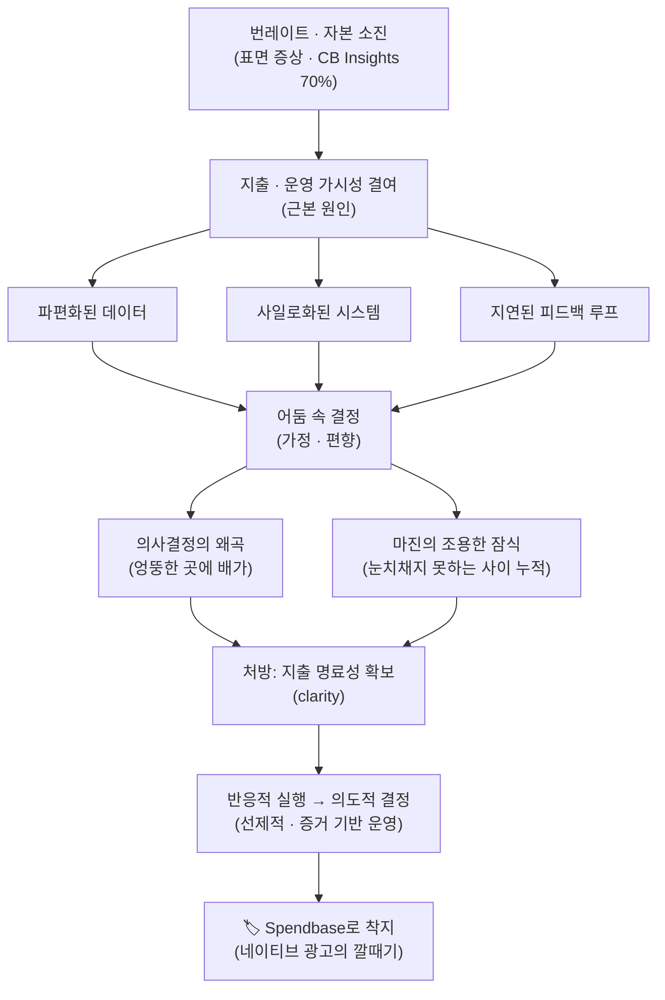

<figure class="post-figure post-figure--header">
<svg role="img" aria-label="왼쪽은 오크 전쟁군주가 손전등 하나로 제각각 다른 숫자를 띄운 파편화된 지출 장부들을 어둠 속에서 더듬는 모습이고, 오른쪽은 '단일 진실 공급원'이라 적힌 하나의 밝은 통합 대시보드 앞에서 오크 전쟁군주가 손가락으로 짚으며 의도적으로 결정을 내리는 모습이다. 어둠 속 운영과 가시성으로 밝힌 운영의 대비를 그린 헤더 삽화." viewBox="0 0 640 340" xmlns="http://www.w3.org/2000/svg">
  <title>어둠 속 운영(파편화된 장부를 손전등으로 더듬기) vs 가시성으로 밝힌 운영(단일 진실 공급원 앞의 의도적 결정)</title>

  <!-- caption strip -->
  <text x="320" y="26" text-anchor="middle" font-size="15" fill="currentColor" font-weight="700">어둠 속 운영 vs 가시성으로 밝힌 운영</text>
  <text x="320" y="46" text-anchor="middle" font-size="11" fill="currentColor" opacity="0.6">파편화된 장부를 손전등으로 더듬다 → 단일 진실 공급원으로 결정하다</text>

  <!-- center divider -->
  <line x1="320" y1="60" x2="320" y2="316" stroke="currentColor" stroke-width="1.5" stroke-dasharray="4 5" opacity="0.35"/>

  <!-- ground baseline -->
  <line x1="24" y1="300" x2="616" y2="300" stroke="currentColor" stroke-width="1.5" opacity="0.35"/>

  <!-- ============ LEFT: fumbling in the dark ============ -->
  <!-- gloom hatch to read as "the dark" (texture, theme-safe) -->
  <g stroke="currentColor" stroke-width="1" opacity="0.08">
    <line x1="40" y1="70" x2="40" y2="298"/>
    <line x1="70" y1="70" x2="70" y2="298"/>
    <line x1="100" y1="70" x2="100" y2="298"/>
    <line x1="130" y1="70" x2="130" y2="298"/>
    <line x1="160" y1="70" x2="160" y2="298"/>
    <line x1="190" y1="70" x2="190" y2="298"/>
    <line x1="220" y1="70" x2="220" y2="298"/>
    <line x1="250" y1="70" x2="250" y2="298"/>
    <line x1="280" y1="70" x2="280" y2="298"/>
  </g>

  <!-- torch cone of light, partial illumination -->
  <path d="M108,232 L232,96 L292,150 L150,262 Z" fill="var(--gold)" opacity="0.16"/>

  <!-- three fragmented, tilted spend dashboards with mismatched numbers + '?' -->
  <g stroke="currentColor" stroke-width="2" fill="var(--bg-panel)">
    <g transform="rotate(-9 190 118)">
      <rect x="150" y="90" width="80" height="56"/>
      <rect x="158" y="98" width="26" height="12" fill="var(--accent-color)" stroke="none" opacity="0.75"/>
      <rect x="158" y="118" width="46" height="7" fill="currentColor" stroke="none" opacity="0.4"/>
      <rect x="158" y="130" width="34" height="7" fill="currentColor" stroke="none" opacity="0.4"/>
      <text x="216" y="110" font-size="13" fill="currentColor" text-anchor="end" font-weight="700">42?</text>
    </g>
    <g transform="rotate(7 248 176)">
      <rect x="210" y="150" width="76" height="52"/>
      <rect x="218" y="176" width="12" height="18" fill="var(--secondary-color)" stroke="none" opacity="0.7"/>
      <rect x="234" y="166" width="12" height="28" fill="var(--secondary-color)" stroke="none" opacity="0.5"/>
      <text x="278" y="170" font-size="13" fill="currentColor" text-anchor="end" font-weight="700">$?K</text>
    </g>
    <g transform="rotate(-4 158 205)">
      <rect x="120" y="180" width="76" height="50"/>
      <rect x="128" y="188" width="40" height="8" fill="currentColor" stroke="none" opacity="0.4"/>
      <rect x="128" y="202" width="52" height="8" fill="var(--accent-color)" stroke="none" opacity="0.6"/>
      <text x="188" y="222" font-size="15" fill="var(--accent-color)" text-anchor="end" font-weight="700">?</text>
    </g>
  </g>

  <!-- orc warlord fumbling, holding a torch -->
  <g stroke="currentColor" stroke-width="2" fill="var(--bg-panel)">
    <!-- shoulders/body -->
    <path d="M58,300 L58,270 Q58,252 84,252 Q110,252 110,270 L110,300 Z"/>
    <!-- head -->
    <circle cx="84" cy="236" r="15"/>
    <!-- topknot -->
    <rect x="80" y="212" width="8" height="12"/>
    <!-- tusks -->
    <path d="M78,244 l-2,6 M90,244 l2,6" stroke-width="2"/>
  </g>
  <!-- torch: haft + flame -->
  <line x1="108" y1="252" x2="122" y2="228" stroke="currentColor" stroke-width="3"/>
  <path d="M122,228 q-6,-10 0,-18 q6,8 6,14 q4,-4 3,-9 q6,10 -3,18 Z" fill="var(--accent-color)" stroke="none" opacity="0.9"/>

  <text x="172" y="292" text-anchor="middle" font-size="11" fill="currentColor" opacity="0.7">파편화 · 사일로 · 지연된 피드백</text>

  <!-- ============ RIGHT: lit single source of truth ============ -->
  <!-- outer glow ring -->
  <rect x="372" y="92" width="204" height="150" fill="none" stroke="var(--gold)" stroke-width="2" opacity="0.5" rx="2"/>
  <!-- unified dashboard panel -->
  <rect x="378" y="98" width="192" height="138" fill="var(--bg-panel)" stroke="currentColor" stroke-width="2.5" rx="2"/>
  <text x="474" y="118" text-anchor="middle" font-size="12" fill="currentColor" font-weight="700">단일 진실 공급원</text>
  <line x1="392" y1="126" x2="556" y2="126" stroke="currentColor" stroke-width="1" opacity="0.35"/>
  <!-- aligned bars, all one system -->
  <g fill="var(--secondary-color)" stroke="none">
    <rect x="398" y="196" width="18" height="24"/>
    <rect x="424" y="182" width="18" height="38"/>
    <rect x="450" y="168" width="18" height="52"/>
    <rect x="476" y="152" width="18" height="68"/>
  </g>
  <!-- clear upward trend line -->
  <polyline points="398,178 424,168 450,152 476,138 508,132" fill="none" stroke="var(--accent-color)" stroke-width="2.5"/>
  <!-- verdict check -->
  <path d="M520,150 l10,12 l20,-26" fill="none" stroke="var(--secondary-color)" stroke-width="4" stroke-linecap="round" stroke-linejoin="round"/>

  <!-- orc warlord deciding, finger pointing at the panel -->
  <g stroke="currentColor" stroke-width="2" fill="var(--bg-panel)">
    <path d="M556,300 L556,268 Q556,250 582,250 Q608,250 608,268 L608,300 Z"/>
    <circle cx="582" cy="234" r="15"/>
    <rect x="578" y="210" width="8" height="12"/>
    <path d="M576,242 l-2,6 M588,242 l2,6" stroke-width="2"/>
  </g>
  <!-- pointing arm toward the dashboard -->
  <line x1="560" y1="262" x2="512" y2="220" stroke="currentColor" stroke-width="3" stroke-linecap="round"/>

  <text x="468" y="292" text-anchor="middle" font-size="11" fill="currentColor" opacity="0.7">명료성 → 의도적 · 증거 기반 결정</text>
</svg>
<figcaption>번레이트는 증상일 뿐 — 진짜 갈림길은 파편화된 장부를 손전등으로 더듬느냐, 단일 진실 공급원으로 밝혀 결정하느냐다.</figcaption>
</figure>

## 원문 정보

> - **제목**: Most startups don't have a burn problem. They have a decision problem
> - **출처**: The Next Web / Insider — 저자 **Andrew Alex** (Spendbase CEO)
> - **발행**: 2026-05-13 · 약 6분 분량
> - **원문 링크**: <https://thenextweb.com/news/startups-dont-have-a-burn-problem-they-have-a-decision-problem>

> **⚠️ 스폰서드 콘텐츠(네이티브 광고)입니다.** 원문 하단에 *"Content provided by Spendbase.
> TNW newsroom and editorial staff were not involved in the creation of this content. (Sponsored)"*
> 라고 명시돼 있다. 즉 이 글은 SaaS·클라우드 지출 최적화 툴을 파는 **Spendbase**(Google-backed
> FinTech)의 CEO가 쓴 마케팅 콘텐츠이며, 결론이 자연스럽게 자사 제품 도입으로 수렴한다. 아래에서는
> **취할 만한 진짜 통찰**과 **광고로서의 편향**을 분명히 구분해 정리한다.

`Articles` 카테고리는 읽을 만한 외부 아티클을 골라 핵심을 정리하고 내 관점으로 분석하는 공간이다.
이 글은 스타트업의 생존을 '돈의 양'이 아니라 '돈이 어디로·왜 가는지에 대한 가시성'의 문제로 다시
프레이밍한다는 점 — 그리고 그 프레임이 네이티브 광고의 문법 안에서 어떻게 작동하는지를 함께 볼 수
있다는 점에서 골랐다.

## 한 줄 요약 (TL;DR)

CB Insights에 따르면 2023년 이후 폐업한 VC 투자 스타트업의 70%가 "자본 소진(ran out of capital)"을
겪었지만, 번레이트는 **증상**일 뿐이다. 저자는 진짜 뿌리를 **지출·운영 가시성의 결여**로 진단한다 —
파편화된 데이터와 사일로화된 시스템 때문에 창업자가 "어둠 속에서 운영(operate in the dark)"하면
결정이 가정과 편향으로 흐르고, 그 결과 의사결정이 왜곡되고 마진이 조용히 잠식된다. 처방은 지출에
대한 명료성(clarity)을 확보해 **반응적 실행에서 의도적 결정으로 전환**하는 것.

## 왜 이 글을 골랐나

스타트업 담론은 압도적으로 **숫자**의 언어로 말한다. 번레이트(burn rate), 런웨이(runway), CAC, LTV —
모두 측정 가능해 회의실에서 다루기 편하다. 이 글의 제목은 그 편향을 정확히 찌른다. "돈이 빠르게
준다"는 관찰을 곧장 "비용을 줄이자"로 연결하는 대신, **"우리는 그 돈이 어디로·왜 가는지 실제로 보고
있는가"** 를 묻는다.

동시에 이 글은 **좋은 미디어 리터러시 훈련 재료**다. 논지는 설득력 있지만, 글은 결국 저자가 파는
제품(Spendbase)으로 수렴하는 스폰서드 콘텐츠다. 진짜 통찰과 판매 논리를 분리해 읽는 연습으로서도
가치가 있다. 이 위키가 다뤄 온 [Lean Analytics 다시 보기](/2026/06/24/lean-analytics-revisited.html)의
"지표가 흔들릴 때 무엇을 믿을 것인가"와 같은 줄기에서, **지표를 가진 것과 그 지표를 신뢰·연결할 수
있는 것은 다르다**는 메시지로 읽힌다.

## 한눈에 보기 — 이 글의 인과 사슬

번레이트라는 **증상**에서 출발해, 그 뿌리(가시성 결여)를 거쳐 처방(명료성)과 광고의 착지점까지
글 전체가 하나의 사슬로 이어진다.

<!-- END through-line -->

## 핵심 내용

### 번레이트는 1위 사인(死因)이지만, 증상일 뿐이다

저자는 CB Insights가 2023년 이후 폐업한 431개 VC 투자 스타트업을 분석한 결과 "ran out of capital"이
**70%로 1위**였다는 데이터로 문을 연다. 하지만 곧바로 뒤집는다. 자본 소진은 **더 깊은 문제의 증상** —
파편화된 데이터, 불명확한 우선순위, 무엇이 실제로 결과를 만드는지에 대한 가시성 부족 — 이라는 것이다.

### 창업자는 왜 '어둠 속에서' 운영하게 되는가

스케일업은 매일 제품·채용·영업·전략·투자에 걸친 고위험 결정을 요구하고, 그 압박 속에서 창업자는
운영 명료성(operational clarity) 없이 항해하게 된다. 증상은 미묘하지만 누적된다 — 문제를 선제적으로
막기보다 **반응적으로** 처리하고, 이슈는 이미 성과나 예산에 타격을 준 뒤에야 보이며, 팀은 **공유된
진실 공급원(shared source of truth)** 없이 각자 움직인다.

핵심 진단은 이것이다. 어둠 속 운영은 단지 데이터가 없는 게 아니라 **파편화된 시스템, 지연된 피드백
루프, 기능 간 연결되지 않는 지표**의 문제다. 재무·제품·운영 신호가 서로 다른 툴에 흩어져 있으면
인과를 추적할 수 없다. 저자의 예시: *성장 문제처럼 보이는 것이 사실은 리텐션 문제일 수 있고, 비용
급증이 몇 달 전의 아키텍처 결정에서 비롯됐을 수 있다.*

### 자가진단 질문 — 병목을 드러내는 6가지 물음

저자는 독자가 스스로 던져 볼 질문 목록을 제시한다.

- 우리는 어디에서 **단일 진실 공급원(single source of truth)**이 없는가?
- 어떤 팀이 서로 **다른 목표(outcome)** 를 최적화하고 있지는 않은가?
- **원인이 불분명한 채** 비용이 늘고 있는 곳은 어디인가?
- **소유권이 불명확한 채 중복되는 툴**은 무엇인가?
- **핸드오프 마찰**이 실행 속도를 늦추고 있는가?
- 우리는 효율보다 **활동(activity)** 을 더 빨리 키우고 있지는 않은가?

가시성의 결여는 단지 효율을 떨어뜨리는 데 그치지 않고 **비즈니스 모든 층위의 리스크를 증폭**시킨다.
그 피해는 두 갈래로 나타난다.

- **의사결정의 왜곡** — 신뢰할 신호가 없으면 결정이 가정과 편향으로 흐른다. 소수의 목소리 큰 고객
  요청 때문에 (전체 채택률이 낮다는 데이터를 무시하고) 특정 기능에 몰빵하는 식. 실제로 통하는 것에는
  과소투자하면서 엉뚱한 곳에 배가한다.
- **마진의 조용한 잠식** — 비용은 하룻밤에 튀지 않는다. 중복 시스템, 유휴 자원, 비효율 프로세스,
  정렬되지 않은 팀에 걸쳐 **눈치채지 못하는 사이 쌓인다.**

### 지출 명료성 부족이 부르는 4가지 시나리오

표면 지표(성장·채용·기능 속도)는 긍정적으로 보여도, 그 밑의 동인을 모르면 그 진전은 취약하다.
저자는 네 가지 전형적 패턴을 든다.

- **속도를 위한 채용 (Hiring to move faster)** — 성장 목표에 맞춰 인원을 늘리지만, **2차 효과**
  (툴링 비용 증가, 인프라 사용량 상승, 협업 오버헤드, 관리 계층 복잡화)를 계산에 넣지 못한다.
  관찰할 지표: *직원당 매출(revenue per employee), 기능/릴리스당 비용, 사용자·트랜잭션당 인프라 비용.*
- **ROI 입증 전 AI 확장 (Scaling AI before proving ROI)** — 가치를 검증하기 전에 AI 기능을 프로덕션으로
  성급히 확장해, 실험 비용을 지속적 재무 부담으로 굳힌다. 처방: **모든 AI 이니셔티브를 명확한
  비즈니스 KPI에 앵커**하고(비용 절감·매출 증대·시간 절약), 전면 롤아웃이 아니라 **통제된 파일럿**부터
  시작하며, 비용 기준선을 세우고 *추론/요청당 비용(cost per inference)* 을 추적하라.
- **"나중을 위한" 툴 업그레이드 (Upgrading tools "for Later")** — 필요보다 일찍 고급 툴에 투자한다.
  즉각적 요구 과대평가, "빨리 스케일하라"는 내부 압박, 유행 추종, 소유권 부재, 실제 사용량·ROI에 대한
  가시성 부족에서 비롯된다. 비용은 즉시 늘지만 가치는 불확실하다.
- **인프라 유연성 과최적화 (Optimizing for flexibility in infrastructure)** — 유연성·확장성은 빠른
  실험을 돕지만 대가가 따른다. 적절한 비용 거버넌스 없이 AWS·GCP·Azure 위에 아키텍처를 올리면 유휴
  자원과 꾸준히 증가하는 비용으로 귀결된다. 저자는 **클라우드 크레딧(적격 고성장 기업 대상 최대
  $300,000)** 확보로 비용을 상쇄할 수 있다고 덧붙인다.

### 관점의 전환 (The shift)

리더가 돈이 실제로 어디로 가는지 — 채용·툴링·인프라·운영에 걸쳐 — 명확히 이해하면, 행동이 **반응적
실행에서 의도적 의사결정으로** 바뀌고, 행동과 결과를 연결하게 된다.

- **반응적 → 선제적**: 이슈를 성과·예산에 타격을 주기 전에 더 일찍 식별.
- **가정 → 증거 기반**: 고립된 신호나 편향이 아니라 실제 동인에 근거한 결정.
- **숨은 비효율 → 조기 탐지**: 비용 누적이 마진을 갉아먹기 전에 가시화·조치 가능해짐.

저자는 바로 이 지점에서 *"platforms like Spendbase"* 가 파편화된 SaaS 지출 데이터를 통합해 숨은
비용 절감 기회를 여는 데 효율적이라며 자사 제품을 명시적으로 착지시킨다. 그리고 이렇게 맺는다.

> "the most effective founders are not those who spend the least, but those who understand
> exactly why they spend, where it goes, and what it returns."
> (가장 효과적인 창업자는 가장 적게 쓰는 사람이 아니라, 왜 쓰는지·어디로 가는지·무엇을 돌려받는지를
> 정확히 이해하는 사람이다.)

<figure class="post-figure">
<svg role="img" aria-label="지출 명료성이 없을 때 나타나는 4가지 시나리오를 2x2로 정리한 도식. ①속도를 위한 채용: 사람 아이콘 뒤에 툴·인프라·회의 오버헤드가 딸려온다, 관찰 지표는 직원당 매출·기능당 비용·사용자당 인프라 비용. ②ROI 입증 전 AI 확장: 작은 파일럿 비커가 성급히 공장 규모로 커진다, 관찰 지표는 추론당 비용·비용 기준선·통제된 파일럿. ③나중을 위한 툴 업그레이드: 필요보다 일찍 과한 장비를 쟁여둔다, 관찰 지표는 실제 사용량·ROI·소유권. ④인프라 유연성 과최적화: 클라우드 위 유휴 서버가 켜진 채 방치된다, 관찰 지표는 유휴 자원·클라우드 크레딧." viewBox="0 0 640 486" xmlns="http://www.w3.org/2000/svg">
  <title>지출 명료성 부족이 부르는 4가지 시나리오 (각 칸에 관찰 지표 병기)</title>

  <text x="320" y="26" text-anchor="middle" font-size="15" fill="currentColor" font-weight="700">지출 명료성 부족이 부르는 4가지 시나리오</text>
  <text x="320" y="46" text-anchor="middle" font-size="11" fill="currentColor" opacity="0.6">표면 지표는 긍정적이어도, 밑의 동인을 모르면 그 진전은 취약하다</text>

  <!-- ===== quadrant frames ===== -->
  <g fill="none" stroke="currentColor" stroke-width="2" opacity="0.9">
    <rect x="24"  y="60"  width="292" height="200"/>
    <rect x="324" y="60"  width="292" height="200"/>
    <rect x="24"  y="270" width="292" height="200"/>
    <rect x="324" y="270" width="292" height="200"/>
  </g>

  <!-- ===== 1. Hiring to move faster (top-left) ===== -->
  <circle cx="46" cy="84" r="11" fill="var(--accent-color)"/>
  <text x="46" y="88" text-anchor="middle" font-size="12" fill="var(--bg-panel)" font-weight="700">1</text>
  <text x="64" y="88" font-size="12.5" fill="currentColor" font-weight="700">속도를 위한 채용</text>
  <!-- people -->
  <g stroke="currentColor" stroke-width="2" fill="var(--bg-panel)">
    <circle cx="70" cy="132" r="10"/><path d="M56,164 q0,-16 14,-16 q14,0 14,16 Z"/>
    <circle cx="100" cy="132" r="10"/><path d="M86,164 q0,-16 14,-16 q14,0 14,16 Z"/>
  </g>
  <!-- arrow to trailing overhead -->
  <line x1="122" y1="146" x2="150" y2="146" stroke="currentColor" stroke-width="2"/>
  <path d="M150,146 l-8,-4 l0,8 Z" fill="currentColor"/>
  <!-- overhead boxes -->
  <g stroke="currentColor" stroke-width="1.5" fill="none">
    <rect x="158" y="118" width="60" height="20"/>
    <rect x="166" y="142" width="70" height="20"/>
    <rect x="158" y="166" width="82" height="20"/>
  </g>
  <g font-size="10" fill="currentColor" opacity="0.85">
    <text x="164" y="132">툴링 비용</text>
    <text x="172" y="156">인프라 사용량</text>
    <text x="164" y="180">회의 · 관리 오버헤드</text>
  </g>
  <text x="40" y="222" font-size="10" fill="var(--secondary-color)" font-weight="700">관찰 지표</text>
  <text x="40" y="238" font-size="10" fill="currentColor" opacity="0.8">직원당 매출 · 기능/릴리스당 비용</text>
  <text x="40" y="252" font-size="10" fill="currentColor" opacity="0.8">사용자·트랜잭션당 인프라 비용</text>

  <!-- ===== 2. Scaling AI before proving ROI (top-right) ===== -->
  <circle cx="346" cy="84" r="11" fill="var(--accent-color)"/>
  <text x="346" y="88" text-anchor="middle" font-size="12" fill="var(--bg-panel)" font-weight="700">2</text>
  <text x="364" y="88" font-size="12.5" fill="currentColor" font-weight="700">ROI 입증 전 AI 확장</text>
  <!-- small pilot beaker -->
  <g stroke="currentColor" stroke-width="2" fill="var(--bg-panel)">
    <path d="M352,118 l16,0 l0,14 l10,20 l-36,0 l10,-20 Z"/>
  </g>
  <rect x="350" y="140" width="20" height="12" fill="var(--secondary-color)" stroke="none" opacity="0.6"/>
  <!-- arrow: hastily scaled up -->
  <line x1="388" y1="150" x2="418" y2="150" stroke="currentColor" stroke-width="2"/>
  <path d="M418,150 l-8,-4 l0,8 Z" fill="currentColor"/>
  <!-- oversized factory -->
  <g stroke="currentColor" stroke-width="2" fill="var(--bg-panel)">
    <rect x="426" y="128" width="72" height="52"/>
    <rect x="436" y="108" width="12" height="20"/>
    <rect x="456" y="112" width="12" height="16"/>
  </g>
  <g fill="var(--accent-color)" stroke="none" opacity="0.55">
    <circle cx="442" cy="104" r="4"/><circle cx="462" cy="108" r="3"/>
  </g>
  <text x="340" y="222" font-size="10" fill="var(--secondary-color)" font-weight="700">관찰 지표</text>
  <text x="340" y="238" font-size="10" fill="currentColor" opacity="0.8">추론/요청당 비용 (cost per inference)</text>
  <text x="340" y="252" font-size="10" fill="currentColor" opacity="0.8">비용 기준선 · 통제된 파일럿 · KPI 앵커</text>

  <!-- ===== 3. Upgrading tools "for later" (bottom-left) ===== -->
  <circle cx="46" cy="294" r="11" fill="var(--accent-color)"/>
  <text x="46" y="298" text-anchor="middle" font-size="12" fill="var(--bg-panel)" font-weight="700">3</text>
  <text x="64" y="298" font-size="12.5" fill="currentColor" font-weight="700">'나중을 위한' 툴 업그레이드</text>
  <!-- prematurely stockpiled oversized gear (crates) -->
  <g stroke="currentColor" stroke-width="2" fill="var(--bg-panel)">
    <rect x="56" y="360" width="44" height="34"/>
    <rect x="104" y="360" width="44" height="34"/>
    <rect x="80" y="326" width="44" height="34"/>
  </g>
  <g stroke="currentColor" stroke-width="1" opacity="0.4">
    <line x1="56" y1="377" x2="100" y2="377"/><line x1="104" y1="377" x2="148" y2="377"/>
    <line x1="80" y1="343" x2="124" y2="343"/>
  </g>
  <!-- clock badge "나중" -->
  <circle cx="176" cy="344" r="18" fill="var(--bg-panel)" stroke="currentColor" stroke-width="2"/>
  <path d="M176,344 l0,-11 M176,344 l8,5" stroke="var(--accent-color)" stroke-width="2" fill="none"/>
  <text x="176" y="382" text-anchor="middle" font-size="10" fill="currentColor" opacity="0.8">필요보다 일찍</text>
  <text x="40" y="432" font-size="10" fill="var(--secondary-color)" font-weight="700">관찰 지표</text>
  <text x="40" y="448" font-size="10" fill="currentColor" opacity="0.8">실제 사용량 · ROI · 명확한 소유권</text>
  <text x="40" y="462" font-size="10" fill="currentColor" opacity="0.8">비용은 즉시↑, 가치는 불확실</text>

  <!-- ===== 4. Optimizing for infra flexibility (bottom-right) ===== -->
  <circle cx="346" cy="294" r="11" fill="var(--accent-color)"/>
  <text x="346" y="298" text-anchor="middle" font-size="12" fill="var(--bg-panel)" font-weight="700">4</text>
  <text x="364" y="298" font-size="12.5" fill="currentColor" font-weight="700">인프라 유연성 과최적화</text>
  <!-- cloud -->
  <path d="M356,344 q-14,0 -14,-14 q0,-14 14,-13 q4,-16 22,-14 q18,-2 20,16 q14,-2 14,12 q0,13 -14,13 Z"
        fill="var(--bg-panel)" stroke="currentColor" stroke-width="2"/>
  <text x="392" y="337" text-anchor="middle" font-size="9" fill="currentColor" opacity="0.7">AWS·GCP·Azure</text>
  <!-- idle servers left ON -->
  <g stroke="currentColor" stroke-width="2" fill="var(--bg-panel)">
    <rect x="352" y="370" width="34" height="22"/>
    <rect x="392" y="370" width="34" height="22"/>
    <rect x="432" y="370" width="34" height="22"/>
  </g>
  <g fill="var(--accent-color)" stroke="none">
    <circle cx="359" cy="381" r="3"/><circle cx="399" cy="381" r="3"/><circle cx="439" cy="381" r="3"/>
  </g>
  <text x="392" y="408" text-anchor="middle" font-size="9.5" fill="currentColor" opacity="0.7">유휴 자원이 켜진 채 방치</text>
  <text x="340" y="432" font-size="10" fill="var(--secondary-color)" font-weight="700">관찰 지표</text>
  <text x="340" y="448" font-size="10" fill="currentColor" opacity="0.8">유휴 자원 · 비용 거버넌스</text>
  <text x="340" y="462" font-size="10" fill="currentColor" opacity="0.8">클라우드 크레딧(최대 $300K)으로 상쇄</text>
</svg>
<figcaption>표면 지표(성장·채용·기능 속도)는 긍정적으로 보여도, 밑의 동인을 못 보면 지출은 네 갈래로 조용히 샌다 — 각 칸의 관찰 지표가 그 동인을 드러낸다.</figcaption>
</figure>

## 분석과 인사이트

여기서부터는 **원문 요약이 아니라 내 분석**이다.

- **제목의 '결정 문제'는 사실 '지출 가시성 문제'로 좁혀진다.** 제목은 "burn problem이 아니라
  decision problem"이라는 넓고 매력적인 명제를 내걸지만, 본문이 실제로 처방하는 것은 의사결정
  방법론이 아니라 **지출 데이터의 통합·가시화**다. 즉 "decision problem → spend visibility problem →
  (그 해법인) 지출 가시성 플랫폼"으로 논지가 점점 좁아진다. 이는 우연이 아니라 **광고의 구조**다.
  넓은 통찰로 공감을 얻은 뒤 자사 제품이 정확히 메우는 좁은 구멍으로 착지시키는, 전형적인 네이티브
  광고의 깔때기다. 통찰 자체는 유효하지만, "결정의 질"이라는 더 큰 주제(가설 설정, 조직 정렬, 판단의
  용기)는 가시성 툴로 환원되지 않는다는 점을 독자가 스스로 채워 읽어야 한다.
- **그럼에도 취할 진짜 통찰은 분명하다.** 자사 광고라는 사실이 통찰을 무효화하지는 않는다. "번레이트는
  이미 내린 결정들의 총합이자 증상"이라는 프레임, "재무·제품·운영 신호가 서로 다른 툴에 흩어지면
  인과를 추적할 수 없다"는 진단, "비용은 하룻밤에 튀지 않고 조용히 쌓인다"는 관찰 — 이 셋은 규모와
  무관하게 대부분의 조직에 유효하다. **광고라서 틀린 게 아니라, 광고라서 특정 방향으로 편향돼 있을
  뿐**이라는 태도로 읽는 게 옳다.
- **이 논리는 엔지니어링에도 동형이다.** "사람이 부족하다(자원)"는 호소의 상당수는 실제로는 "무엇을
  안 만들지, 어떤 툴이 중복인지 결정하지 못한다(가시성·범위)"의 다른 얼굴이다. 저자의 자가진단
  질문("소유권 불명확한 중복 툴", "핸드오프 마찰")은 그대로 엔지니어링 조직의 낭비 진단표로 쓸 수
  있다. 이 위키의 [Architecture Essential Curriculum](/2026/06/19/architecture-essential-curriculum.html)이
  강조하는 "경계·소유권을 먼저 정하는 규율"이 곧 비용 통제의 레버인 이유다.
- **AI 시대에 이 메시지는 더 날카로워진다.** 저자의 "ROI 입증 전 AI 확장" 경고는 지금 가장 흔한
  낭비 패턴이다. 실행 비용(코드·카피·리서치)이 싸질수록, 통제되지 않은 AI 지출은 *cost per inference*
  단위로 조용히 누적된다. [The Founder's Playbook](/2026/06/19/the-founders-playbook.html)에서
  정리한 "창업자가 실행에서 판단으로 무게중심을 옮긴다"는 흐름과, 여기서 말하는 "가정에서 증거 기반
  결정으로의 전환"은 같은 방향을 가리킨다.

> ⚠️ 균형추. **때로는 번레이트가 진짜로 문제**다 — 자금 경색 국면에서는 가시성과 무관하게 현금
> 보존 자체가 생존의 1순위가 된다. 또한 가시성 툴은 **필요조건이지 충분조건이 아니다.** 대시보드를
> 통합해도 "그 데이터를 보고 불편한 결정을 내리는 조직 문화"가 없으면 숫자는 그저 예쁘게 정렬될
> 뿐이다. 저자가 파는 것은 도구지만, 정작 어려운 것은 도구가 드러낸 진실에 따라 행동하는 규율이다.

## 적용 포인트

- 비용 항목을 볼 때 **"이 지출은 어떤 결정에서 나왔나"** 를 한 칸 거슬러 적어, 지출을 결정으로
  번역하는 연습을 한다.
- 저자의 **6가지 자가진단 질문**을 팀 회고 체크리스트로 삼는다. 특히 "소유권 불명확한 중복 툴"과
  "단일 진실 공급원이 없는 곳"부터 색출한다.
- 모든 **AI 이니셔티브를 명확한 KPI에 앵커**하고, 전면 롤아웃 전 통제된 파일럿으로 *cost per
  inference* 기준선을 잡는다.
- 채용을 늘리기 전 **2차 효과(툴·인프라·협업 오버헤드)** 를 함께 추정하고, *직원당 매출·기능당
  비용·사용자당 인프라 비용* 을 관찰 지표로 건다.
- 클라우드 유휴 자원을 정기 점검하고, 적격 시 **클라우드 크레딧**을 활용해 비용을 상쇄한다.
- 그리고 **미디어 리터러시 습관**: 통찰이 마지막에 특정 제품으로 수렴하는 글은, 그 통찰의 유효 범위가
  제품이 메우는 구멍만큼으로 좁혀지지 않았는지 되물어 본다.

## 마무리

이 글의 가치는 데이터가 아니라 **프레임의 전환**에 있다. 번레이트는 측정하기 쉽고 다루기 편하지만,
그것은 더 깊은 곳 — 돈이 어디로·왜 가는지 보지 못한 채 내린 결정들 — 의 그림자일 뿐이다. "가장
효과적인 창업자는 가장 적게 쓰는 사람이 아니라, 왜 쓰는지를 정확히 이해하는 사람"이라는 마지막
문장은 되새길 만하다. 다만 이 글이 그 통찰을 자사 지출 가시성 플랫폼으로 착지시키는 **스폰서드
콘텐츠**라는 사실까지 함께 읽을 때, 우리는 통찰은 취하되 판매 논리는 걸러내는 균형 잡힌 독자가 된다.
가시성은 좋은 결정의 **재료**이지, 좋은 결정 그 자체는 아니다.

### 더 읽어보기

- [원문 — Most startups don't have a burn problem. They have a decision problem (The Next Web, Sponsored by Spendbase)](https://thenextweb.com/news/startups-dont-have-a-burn-problem-they-have-a-decision-problem)
- [The Founder's Playbook: AI 네이티브 스타트업을 만드는 4단계](/2026/06/19/the-founders-playbook.html) — 실행에서 판단·설계로 옮겨가는 창업자의 역할 변화
- [Lean Analytics, 다시 보기](/2026/06/24/lean-analytics-revisited.html) — 지표를 가진 것과 그 지표를 신뢰·연결하는 것은 다르다
- [노동시장이라는 게임에서 살아남기](/2026/06/22/surviving-in-the-job-market.html) — 자원이 아니라 포지셔닝(결정)의 문제로 보는 시각
- [Architecture Essential Curriculum](/2026/06/19/architecture-essential-curriculum.html) — 경계·소유권을 먼저 정하는 규율이 곧 비용 통제
