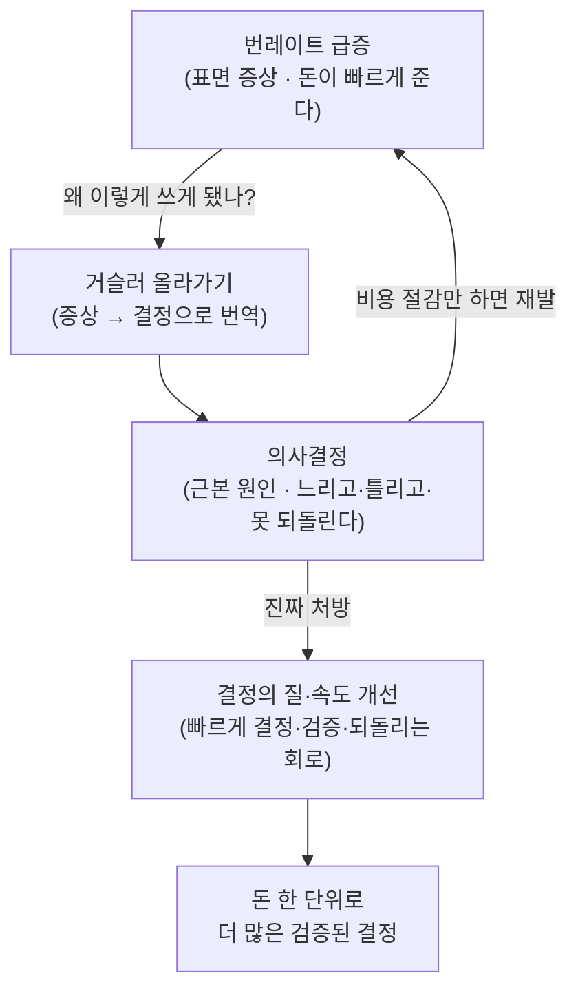

<figure class="post-figure post-figure--header">
<svg role="img" aria-label="번레이트 하강 그래프를 들여다보는 오크 전쟁군주와, 그 뒤에 흔들리는 결정의 갈림길 — 표면 증상(돈이 빠르게 준다)과 근본 원인(결정이 느리고 틀리다)의 대비" viewBox="0 0 640 320" xmlns="http://www.w3.org/2000/svg" shape-rendering="crispEdges">
  <!-- ===== 배경: 갈림길 (근본 원인 = 결정) ===== -->
  <!-- 갈림길 표지판 기둥 -->
  <rect x="446" y="120" width="8" height="150" fill="currentColor" opacity="0.45"/>
  <!-- 왼쪽 화살표 표지판 (빠르고/옳음 방향) -->
  <g opacity="0.7">
    <polygon points="356,128 444,128 444,160 356,160 340,144" fill="var(--bg-sunken)" stroke="currentColor" stroke-width="3"/>
    <polygon points="372,140 392,140 392,136 402,144 392,152 392,148 372,148" fill="var(--secondary-color)"/>
  </g>
  <!-- 오른쪽 화살표 표지판 (느리고/틀림 방향) -->
  <g opacity="0.7">
    <polygon points="456,176 544,176 560,192 544,208 456,208 456,176" fill="var(--bg-sunken)" stroke="currentColor" stroke-width="3"/>
    <polygon points="528,188 508,188 508,184 498,192 508,200 508,196 528,196" fill="var(--accent-color)"/>
  </g>
  <!-- 갈림길 노면 (두 갈래로 갈라지는 길) -->
  <polygon points="300,300 360,300 470,150 446,150" fill="currentColor" opacity="0.12"/>
  <polygon points="360,300 420,300 540,150 470,150" fill="currentColor" opacity="0.06"/>

  <!-- ===== 전경: 번레이트 그래프 패널 (표면 증상) ===== -->
  <rect x="40" y="60" width="250" height="180" fill="var(--bg-sunken)" stroke="currentColor" stroke-width="3"/>
  <!-- 그래프 격자 축 -->
  <line x1="64" y1="80" x2="64" y2="216" stroke="currentColor" stroke-width="2" opacity="0.5"/>
  <line x1="64" y1="216" x2="270" y2="216" stroke="currentColor" stroke-width="2" opacity="0.5"/>
  <!-- 급격히 떨어지는 번레이트(현금) 선 -->
  <polyline points="68,92 110,108 150,140 190,180 230,206 266,214" fill="none" stroke="var(--accent-color)" stroke-width="4"/>
  <!-- 잔고가 줄어든 영역 채움 -->
  <polygon points="68,92 110,108 150,140 190,180 230,206 266,214 266,216 68,216" fill="var(--accent-color)" opacity="0.15"/>
  <!-- 하강 화살표 점 -->
  <rect x="262" y="210" width="8" height="8" fill="var(--accent-color)"/>
  <!-- 통장에서 빠지는 코인 (떨어지는 동전) -->
  <circle cx="120" cy="58" r="7" fill="var(--badge-fill)" stroke="currentColor" stroke-width="2"/>
  <circle cx="150" cy="44" r="6" fill="var(--badge-fill)" stroke="currentColor" stroke-width="2"/>
  <circle cx="178" cy="56" r="5" fill="var(--badge-fill)" stroke="currentColor" stroke-width="2"/>

  <!-- ===== 들여다보는 오크 전쟁군주 (Grom Hellscream 톤) ===== -->
  <g>
    <!-- 어깨/몸통 -->
    <rect x="300" y="246" width="96" height="60" fill="var(--orc-green)" stroke="currentColor" stroke-width="3"/>
    <!-- 머리 (올리브 그린 오크 두상) -->
    <rect x="318" y="180" width="60" height="60" fill="var(--orc-green)" stroke="currentColor" stroke-width="3"/>
    <!-- 검은 상투(topknot) -->
    <rect x="338" y="160" width="20" height="24" fill="currentColor"/>
    <rect x="344" y="146" width="8" height="16" fill="currentColor"/>
    <!-- 진홍 전투 문양 (war paint) -->
    <rect x="326" y="196" width="14" height="4" fill="var(--accent-color)"/>
    <rect x="356" y="196" width="14" height="4" fill="var(--accent-color)"/>
    <!-- 눈 (그래프를 응시) -->
    <rect x="330" y="206" width="8" height="8" fill="currentColor"/>
    <rect x="358" y="206" width="8" height="8" fill="currentColor"/>
    <!-- 아래 송곳니(tusk) -->
    <rect x="332" y="232" width="6" height="10" fill="var(--bone)" stroke="currentColor" stroke-width="1"/>
    <rect x="358" y="232" width="6" height="10" fill="var(--bone)" stroke="currentColor" stroke-width="1"/>
    <!-- 그래프를 가리키는 팔 -->
    <rect x="288" y="250" width="34" height="12" fill="var(--orc-green)" stroke="currentColor" stroke-width="3"/>
  </g>

  <!-- 표면 vs 근본을 가르는 흔들리는 경계 점선 -->
  <line x1="312" y1="40" x2="312" y2="300" stroke="currentColor" stroke-width="2" stroke-dasharray="6 8" opacity="0.4"/>
</svg>
<figcaption>표면에선 번레이트 그래프가 곤두박질치지만, 진짜로 흔들리는 것은 그 뒤의 '결정의 갈림길'이다 — 돈은 증상, 결정은 병.</figcaption>
</figure>

## 원문 정보

> - **제목**: Startups don't have a burn problem, they have a decision problem
> - **출처**: The Next Web (<https://thenextweb.com>)
> - **발행**: 미상 (원문 페이지 직접 수집 실패)
> - **원문 링크**: <https://thenextweb.com/news/startups-dont-have-a-burn-problem-they-have-a-decision-problem>

> **수집 안내.** 이 글을 정리하는 시점에 발행처(The Next Web)가 자동 접근을 차단(HTTP 403)해
> **원문 본문·저자·발행일·구체 수치·직접 인용을 확보하지 못했다.** 아래 내용은 **제목이 명시하는
> 핵심 주장**("스타트업의 문제는 번레이트가 아니라 의사결정이다")을 토대로, 위키 독자에게 도움이
> 될 맥락과 분석을 신중하게 재구성한 것이다. 원문이 제시했을 법한 사례·통계·인물은 **지어내지
> 않았다.** 정확한 논거와 데이터는 위 원문 링크에서 직접 확인하길 권한다.

`Articles` 카테고리는 읽을 만한 외부 아티클을 골라 핵심을 정리하고 내 관점으로 분석하는 공간이다.
이 글은 스타트업의 생존을 '돈'이 아니라 '판단'의 문제로 다시 프레이밍한다는 점에서 골랐다.

## 한 줄 요약 (TL;DR)

스타트업이 무너지는 표면적 이유는 대개 "현금이 떨어져서(번레이트)"지만, 그 **현금이 빠르게 줄도록
만든 진짜 원인은 느리고·미루고·틀린 의사결정**이다. 돈은 증상이고, 결정은 병이다. 런웨이를 늘리는
일보다 **결정의 질과 속도를 높이는 일**이 먼저다.

## 왜 이 글을 골랐나

스타트업 담론은 압도적으로 **숫자**의 언어로 말한다. 번레이트(burn rate), 런웨이(runway), CAC,
LTV — 모두 측정 가능하고, 그래서 회의실에서 다루기 편하다. 하지만 측정하기 쉬운 것이 가장 중요한
것은 아니다. 이 글의 제목은 그 편향을 정확히 찌른다. **"돈이 빠르게 준다"는 관찰을 곧장 "비용을
줄이자"로 연결하는 대신, "왜 우리는 이렇게 돈을 쓰는 결정을 내렸는가"로 거슬러 올라가라**는 것이다.

이 관점은 창업자만의 것이 아니다. 엔지니어링 조직도, 한 명의 개발자의 커리어도 같은 함정에 빠진다.
"리소스가 부족하다"는 증상을 자원 추가로 덮으려 하지만, 정작 병목은 **무엇을 만들지·무엇을 버릴지를
정하는 결정**인 경우가 많다. 이 위키가 다뤄 온 다른 글들 —
[Lean Analytics 다시 보기](/2026/06/24/lean-analytics-revisited.html)의 "지표가 흔들릴 때 무엇을
믿을 것인가", [노동시장에서 살아남기](/2026/06/22/surviving-in-the-job-market.html)의 "자신을
어떻게 포지셔닝할 것인가" — 와 같은 줄기에서, **결정을 자원 문제로 착각하지 말라**는 메시지로 읽힌다.

### 한눈에 보기

이 글의 척추는 표면 지표에서 근본 원인으로 거슬러 내려가는 한 줄기 인과 사슬이다.

## 핵심 내용

> 아래는 **제목이 함축하는 논지를 풀어낸 재구성**이며, 원문의 절 구성·소제목·구체 사례를 그대로
> 옮긴 것이 아니다. (원문 본문 미수집)

### 증상과 원인을 구분하라 — 번레이트는 결과지표다

번레이트는 **이미 내린 결정들의 총합**이다. 채용을 몇 명 했는지, 어떤 시장에 얼마나 베팅했는지,
어떤 기능을 만들기로 했는지 — 이 모든 결정의 비용이 한 달 단위로 통장에서 빠져나가는 것이 곧
번레이트다. 따라서 번레이트가 너무 높다는 진단은 **틀린 진단이 아니라 얕은 진단**이다. 비용 절감으로
대응하면 증상은 잠시 가라앉지만, 같은 품질의 의사결정 구조가 그대로면 곧 같은 문제가 재발한다.

### 결정의 세 가지 실패 양식

<figure class="post-figure">
<svg role="img" aria-label="의사결정 실패의 세 양식 3분할 도식 — 느린 결정(지연)·틀린 결정(방향)·번복 못함(집착)이 각각 런웨이를 갉아먹는 방식" viewBox="0 0 660 280" xmlns="http://www.w3.org/2000/svg" shape-rendering="crispEdges">
  <!-- ============ 패널 1: 느린 결정 (지연) ============ -->
  <g>
    <rect x="14" y="16" width="196" height="248" fill="var(--bg-sunken)" stroke="currentColor" stroke-width="3"/>
    <!-- 제목 -->
    <rect x="14" y="16" width="196" height="34" fill="currentColor" opacity="0.12"/>
    <text x="112" y="39" text-anchor="middle" font-family="inherit" font-size="17" font-weight="700" fill="currentColor">느린 결정 · 지연</text>
    <!-- 시계 (멈춰서 미룬다) -->
    <circle cx="112" cy="118" r="38" fill="none" stroke="currentColor" stroke-width="4"/>
    <line x1="112" y1="118" x2="112" y2="92" stroke="var(--accent-color)" stroke-width="4"/>
    <line x1="112" y1="118" x2="134" y2="124" stroke="var(--accent-color)" stroke-width="4"/>
    <circle cx="112" cy="118" r="4" fill="currentColor"/>
    <!-- 런웨이 막대 (시간이 그냥 줄어듦) -->
    <rect x="40" y="200" width="144" height="16" fill="var(--bg-light)" stroke="currentColor" stroke-width="2"/>
    <rect x="40" y="200" width="60" height="16" fill="var(--accent-color)" opacity="0.55"/>
    <text x="112" y="245" text-anchor="middle" font-family="inherit" font-size="13" fill="currentColor">미루는 동안 런웨이가 샌다</text>
  </g>

  <!-- ============ 패널 2: 틀린 결정 (방향) ============ -->
  <g>
    <rect x="232" y="16" width="196" height="248" fill="var(--bg-sunken)" stroke="currentColor" stroke-width="3"/>
    <rect x="232" y="16" width="196" height="34" fill="currentColor" opacity="0.12"/>
    <text x="330" y="39" text-anchor="middle" font-family="inherit" font-size="17" font-weight="700" fill="currentColor">틀린 결정 · 방향</text>
    <!-- 나침반 / 엇나간 화살표 (잘못된 방향으로 빠르게) -->
    <circle cx="330" cy="118" r="38" fill="none" stroke="currentColor" stroke-width="4"/>
    <!-- 정답 방향(흐릿) -->
    <line x1="330" y1="118" x2="330" y2="84" stroke="currentColor" stroke-width="3" stroke-dasharray="4 5" opacity="0.45"/>
    <!-- 실제로 달린 엉뚱한 방향 -->
    <polygon points="330,118 360,96 352,112 366,110" fill="var(--accent-color)"/>
    <line x1="330" y1="118" x2="360" y2="96" stroke="var(--accent-color)" stroke-width="4"/>
    <text x="330" y="174" text-anchor="middle" font-family="inherit" font-size="12" fill="currentColor" opacity="0.7">잘 만들수록 더 빨리 벽</text>
    <!-- 런웨이 막대 -->
    <rect x="258" y="200" width="144" height="16" fill="var(--bg-light)" stroke="currentColor" stroke-width="2"/>
    <rect x="258" y="200" width="92" height="16" fill="var(--accent-color)" opacity="0.55"/>
    <text x="330" y="245" text-anchor="middle" font-family="inherit" font-size="13" fill="currentColor">엉뚱한 곳에 자원을 쏟는다</text>
  </g>

  <!-- ============ 패널 3: 번복 못함 (집착) ============ -->
  <g>
    <rect x="450" y="16" width="196" height="248" fill="var(--bg-sunken)" stroke="currentColor" stroke-width="3"/>
    <rect x="450" y="16" width="196" height="34" fill="currentColor" opacity="0.12"/>
    <text x="548" y="39" text-anchor="middle" font-family="inherit" font-size="17" font-weight="700" fill="currentColor">번복 못함 · 집착</text>
    <!-- 닻 / 매몰비용에 묶임 -->
    <line x1="548" y1="86" x2="548" y2="140" stroke="currentColor" stroke-width="4"/>
    <circle cx="548" cy="82" r="8" fill="none" stroke="currentColor" stroke-width="4"/>
    <path d="M520 132 Q548 168 576 132" fill="none" stroke="currentColor" stroke-width="4"/>
    <line x1="520" y1="132" x2="514" y2="122" stroke="currentColor" stroke-width="4"/>
    <line x1="576" y1="132" x2="582" y2="122" stroke="currentColor" stroke-width="4"/>
    <line x1="528" y1="108" x2="568" y2="108" stroke="currentColor" stroke-width="4"/>
    <!-- 틀렸다는 신호(붉은 X) 무시 -->
    <line x1="588" y1="70" x2="606" y2="88" stroke="var(--accent-color)" stroke-width="4"/>
    <line x1="606" y1="70" x2="588" y2="88" stroke="var(--accent-color)" stroke-width="4"/>
    <!-- 런웨이 막대 -->
    <rect x="476" y="200" width="144" height="16" fill="var(--bg-light)" stroke="currentColor" stroke-width="2"/>
    <rect x="476" y="200" width="36" height="16" fill="var(--accent-color)" opacity="0.55"/>
    <text x="548" y="245" text-anchor="middle" font-family="inherit" font-size="13" fill="currentColor">"조금만 더"가 갉아먹는다</text>
  </g>
</svg>
<figcaption>의사결정이 실패하는 세 양식 — 지연·방향·집착. 셋 다 런웨이(붉은 막대)를 서로 다른 방식으로 갉아먹는다.</figcaption>
</figure>

"의사결정 문제"는 보통 다음 중 하나로 나타난다.

- **느린 결정 (지연)** — 정보가 충분해진 뒤에도 결정을 미룬다. 미루는 동안에도 런웨이는 줄고,
  시장의 기회 창은 닫힌다. 결정하지 않은 것 역시 하나의 결정이며, 대개 더 비싼 결정이다.
- **틀린 결정 (방향)** — 잘못된 시장·잘못된 고객·잘못된 기능에 자원을 쏟는다. 실행은 훌륭한데
  방향이 틀리면, 잘 만들수록 더 빨리 벽에 부딪힌다.
- **번복하지 못하는 결정 (집착)** — 틀렸다는 신호가 와도 매몰비용 때문에 방향을 못 바꾼다.
  "조금만 더 해보면"이 런웨이를 갉아먹는다.

### 좋은 결정은 '정답'이 아니라 '과정과 속도'다

스타트업의 불확실성에서는 매번 정답을 맞히는 것이 불가능하다. 그래서 핵심은 **개별 결정의 정오(正誤)**
가 아니라, **결정을 빠르게 내리고·빠르게 검증하고·틀리면 빠르게 되돌리는 회로의 속도**다. 같은
런웨이라도 이 회로가 빠른 팀은 더 많은 시도를 할 수 있고, 그만큼 정답에 도달할 확률이 높아진다.
결국 "돈을 아끼는 것"보다 "돈 한 단위로 더 많은 검증된 결정을 뽑아내는 것"이 본질이다.

## 분석과 인사이트

여기서부터는 **원문 요약이 아니라 내 분석**이다.

- **번레이트는 회계가 아니라 거울이다.** 비용 구조를 보면 그 조직이 무엇을 중요하게 여기는지,
  어떤 결정을 미뤄 왔는지가 드러난다. 지출을 줄이는 회의보다, **"이 지출은 어떤 결정에서 나왔고,
  그 결정은 여전히 유효한가"** 를 묻는 회의가 더 깊은 처방이다.
- **'결정 문제'는 측정 가능한 '돈 문제'로 위장하기 쉽다.** 숫자는 책임을 분산시키고 토론을
  편하게 만든다. "런웨이가 8개월 남았다"는 말은 누구의 잘못도 아닌 객관적 사실처럼 들리지만,
  "우리는 6개월째 핵심 가설을 검증할 결정을 못 내리고 있다"는 말은 불편하고 구체적이다. 후자를
  꺼내는 조직이 살아남는다.
- **이 논리는 엔지니어링에도 동형이다.** "사람이 부족하다(자원)"는 호소의 상당수는 실제로는
  "무엇을 안 만들지 결정하지 못한다(범위)"의 다른 얼굴이다. 자원 추가는 결정 회피의 가장 비싼
  형태일 수 있다. 이 위키의
  [Architecture Essential Curriculum](/2026/06/19/architecture-essential-curriculum.html)이
  강조하는 "범위·경계를 먼저 정하는 규율"이 비용 통제의 진짜 레버인 이유다.
- **AI 시대에 이 메시지는 더 날카로워진다.** 실행 비용(코드를 만들고, 카피를 쓰고, 리서치하는
  비용)이 급격히 싸지면, 스타트업의 차별점은 점점 더 **무엇을 만들지·무엇을 버릴지 정하는 판단**
  으로 옮겨간다. 실행이 공짜에 가까워질수록, 잘못된 방향으로 빠르게 달리는 비용이 오히려 커진다.
  [The Founder's Playbook](/2026/06/19/the-founders-playbook.html)에서 정리한 "창업자가 실행에서
  설계·판단으로 무게중심을 옮긴다"는 흐름과 정확히 맞물린다.

> ⚠️ 다만 이 프레이밍에는 균형추가 필요하다. **때로는 번레이트가 진짜로 문제**다 — 시장 침체나
> 자금 경색 국면에서는 결정의 질과 무관하게 현금 보존 자체가 생존의 1순위가 된다. "의사결정이
> 본질"이라는 통찰을 "비용은 신경 쓰지 마라"로 오독하면 위험하다. 정확한 명제는 *돈을 보지 말라*가
> 아니라, *돈을 보되 그 돈을 쓰게 만든 결정까지 거슬러 보라*이다.

## 적용 포인트

- 번레이트를 볼 때 **"이 지출은 어떤 결정에서 나왔나"** 를 한 칸 더 거슬러 적어 본다. 비용 항목을
  결정 항목으로 번역하는 연습.
- **미뤄 둔 결정 목록**을 명시적으로 관리한다. "아직 안 정한 것"이 무엇이고, 그것이 매달 얼마의
  런웨이를 갉아먹는지 추정해 본다.
- 결정마다 **되돌릴 수 있는 결정(가역)인지, 되돌릴 수 없는 결정(비가역)인지**를 먼저 분류한다.
  가역이면 빠르게 지르고, 비가역이면 더 신중히. (속도와 신중함의 배분 기준)
- 틀린 신호가 왔을 때 **"언제·무엇을 보면 이 방향을 접을 것인가"** 를 결정 시점에 미리 적어 둔다
  (사전 부검, pre-mortem). 매몰비용 집착을 구조적으로 줄이는 장치.
- 엔지니어링 조직이라면 "사람을 더 뽑자" 전에 **"무엇을 안 만들 것인가"** 를 먼저 결정한다.
  범위 결정이 가장 싼 비용 절감이다.

## 마무리

이 글의 가치는 데이터가 아니라 **프레임의 전환**에 있다. 번레이트는 측정하기 쉽고 다루기 편하지만,
그것은 더 깊은 곳에서 벌어진 일의 그림자일 뿐이다. 돈이 빠르게 준다는 사실에 놀라기보다, **그 돈을
쓰게 만든 결정들이 충분히 빠르고·옳고·되돌릴 수 있었는가**를 묻는 조직이 오래 간다. 실행 비용이
바닥으로 수렴하는 시대일수록, 스타트업의 운명을 가르는 것은 통장 잔고가 아니라 **판단의 회로**다.

> 이 정리는 원문 본문을 직접 확보하지 못한 상태에서 제목의 논지를 재구성한 것이다. 원문의 구체적
> 논거·사례·데이터는 반드시 [원문](https://thenextweb.com/news/startups-dont-have-a-burn-problem-they-have-a-decision-problem)에서 확인하길 권한다.

### 더 읽어보기

- [원문 — Startups don't have a burn problem, they have a decision problem (The Next Web)](https://thenextweb.com/news/startups-dont-have-a-burn-problem-they-have-a-decision-problem)
- [The Founder's Playbook: AI 네이티브 스타트업을 만드는 4단계](/2026/06/19/the-founders-playbook.html) — 실행에서 판단·설계로 옮겨가는 창업자의 역할 변화
- [Lean Analytics, 다시 보기](/2026/06/24/lean-analytics-revisited.html) — 지표가 흔들릴 때 무엇을 믿고 결정할 것인가
- [노동시장이라는 게임에서 살아남기](/2026/06/22/surviving-in-the-job-market.html) — 자원이 아니라 포지셔닝(결정)의 문제로 보는 시각
- [Architecture Essential Curriculum](/2026/06/19/architecture-essential-curriculum.html) — 범위·경계를 먼저 정하는 규율이 곧 비용 통제
