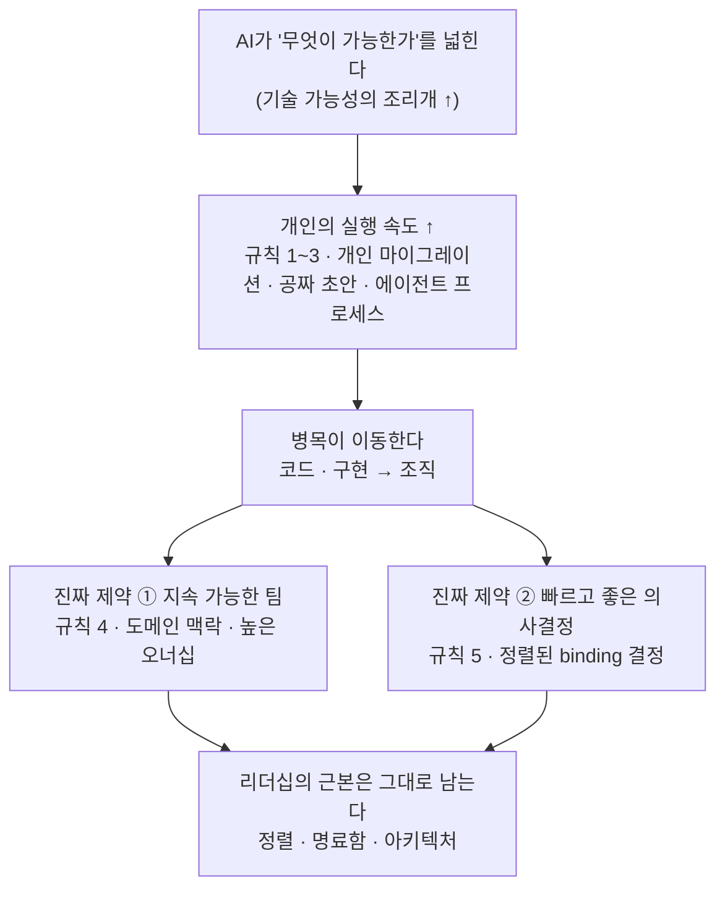

<figure class="post-figure post-figure--header">
<svg role="img" aria-label="워 테이블 앞의 오크 지휘관이 오른팔로 방향을 가리킨다. 테이블 위에는 AI가 날카롭게 벼린 도구들 — 반짝이는 도끼, 톱니바퀴, 붉은 표적 — 이 놓여 있고 그 아래 'AI가 벼린 도구'라는 글이 있다. 지휘관의 손끝에서 점선 화살표가 테이블 위를 지나 오른쪽 언덕 위 깃대로 이어지고, 화살표에는 '어디로 갈지 — 여전히 사람이 정한다'가 적혀 있다. 깃대에는 정렬·명료함·아키텍처·지속 팀·빠른 결정 다섯 개의 깃발이 걸려 있다." viewBox="0 0 640 320" xmlns="http://www.w3.org/2000/svg">
  <title>날카로워진 도구, 그대로인 레버 — 도구는 AI가 벼렸고, 어디로 갈지는 여전히 사람이 정한다</title>

  <!-- header caption strip -->
  <text x="320" y="26" text-anchor="middle" font-size="15" fill="currentColor" font-weight="700">날카로워진 도구, 그대로인 레버</text>
  <text x="320" y="46" text-anchor="middle" font-size="11.5" fill="currentColor" opacity="0.6">도구는 AI가 벼렸다 — 어디로 갈지는 여전히 사람이 정한다</text>

  <!-- faint ground line -->
  <line x1="36" y1="270" x2="430" y2="270" stroke="currentColor" stroke-width="1.5" opacity="0.12"/>

  <!-- ===== LEFT: the orc commander, pointing ===== -->
  <g stroke="currentColor" stroke-width="2.5" fill="none" stroke-linecap="round" stroke-linejoin="round">
    <!-- topknot -->
    <path d="M74,138 q7,-15 -4,-19 q13,3 13,16" fill="var(--orc-green)"/>
    <!-- head -->
    <ellipse cx="74" cy="150" rx="15" ry="13" fill="var(--orc-green)"/>
    <!-- tusks -->
    <path d="M68,159 l-2,5" stroke-width="2"/>
    <path d="M80,159 l2,5" stroke-width="2"/>
    <!-- torso -->
    <path d="M60,214 L88,214 L84,172 q-11,-8 -22,0 Z" fill="var(--bg-light)"/>
    <!-- pointing arm + finger -->
    <path d="M83,181 L120,166"/>
    <path d="M120,166 l11,-3"/>
    <!-- resting arm -->
    <path d="M62,186 L52,202"/>
    <!-- legs -->
    <path d="M68,214 L64,268"/>
    <path d="M82,214 L86,268"/>
  </g>

  <!-- ===== CENTER: the war table with AI-sharpened tools ===== -->
  <g stroke="currentColor" stroke-width="2.5" fill="none" stroke-linejoin="round">
    <rect x="140" y="206" width="152" height="12" fill="var(--bg-light)"/>
    <path d="M156,218 L150,268"/>
    <path d="M276,218 L282,268"/>
  </g>
  <!-- battle-map target on the table -->
  <g>
    <circle cx="180" cy="192" r="9" fill="none" stroke="var(--accent-color)" stroke-width="2"/>
    <line x1="174" y1="186" x2="186" y2="198" stroke="var(--accent-color)" stroke-width="2"/>
    <line x1="186" y1="186" x2="174" y2="198" stroke="var(--accent-color)" stroke-width="2"/>
  </g>
  <!-- gear (dev harness / tooling) -->
  <g stroke="currentColor" stroke-width="1.8" fill="var(--bg-panel)">
    <circle cx="214" cy="193" r="9"/>
    <circle cx="214" cy="193" r="3" fill="currentColor" stroke="none"/>
    <g stroke-width="2">
      <line x1="214" y1="181" x2="214" y2="177"/>
      <line x1="214" y1="205" x2="214" y2="209"/>
      <line x1="202" y1="193" x2="198" y2="193"/>
      <line x1="226" y1="193" x2="230" y2="193"/>
    </g>
  </g>
  <!-- sharpened axe -->
  <g>
    <line x1="248" y1="206" x2="259" y2="176" stroke="currentColor" stroke-width="3" stroke-linecap="round"/>
    <path d="M256,178 q16,-6 22,6 q-14,4 -22,-1 Z" fill="var(--steel)" stroke="currentColor" stroke-width="2" stroke-linejoin="round"/>
    <!-- sharpen glints -->
    <g stroke="var(--gold)" stroke-width="1.6" stroke-linecap="round">
      <line x1="280" y1="170" x2="286" y2="164"/>
      <line x1="284" y1="180" x2="291" y2="180"/>
      <line x1="278" y1="188" x2="283" y2="193"/>
    </g>
  </g>
  <text x="216" y="238" text-anchor="middle" font-size="11" fill="currentColor" opacity="0.8">AI가 벼린 도구</text>

  <!-- ===== decision arrow: the commander's call, arcing to the summit ===== -->
  <path d="M130,162 C 240,86 380,78 484,190" fill="none" stroke="var(--secondary-color)" stroke-width="2.5" stroke-dasharray="7 6" stroke-linecap="round"/>
  <path d="M484,192 l-13,-2 l6,-11 Z" fill="var(--secondary-color)"/>
  <text x="300" y="90" text-anchor="middle" font-size="12" font-weight="700" fill="currentColor">어디로 갈지 — 여전히 사람의 결정</text>

  <!-- ===== RIGHT: the summit mast of the five real levers ===== -->
  <path d="M444,272 Q500,238 560,272 Z" fill="var(--bg-light)" stroke="currentColor" stroke-width="2" stroke-linejoin="round"/>
  <line x1="500" y1="248" x2="500" y2="104" stroke="currentColor" stroke-width="3" stroke-linecap="round"/>
  <circle cx="500" cy="103" r="3.5" fill="var(--gold)"/>
  <!-- five lever pennants -->
  <g stroke="currentColor" stroke-width="1.5" stroke-linejoin="round">
    <path d="M500,116 L536,123 L500,130 Z" fill="var(--accent-color)"/>
    <path d="M500,140 L536,147 L500,154 Z" fill="var(--gold)"/>
    <path d="M500,164 L536,171 L500,178 Z" fill="var(--orc-green)"/>
    <path d="M500,188 L536,195 L500,202 Z" fill="var(--secondary-color)"/>
    <path d="M500,212 L536,219 L500,226 Z" fill="var(--accent-color)"/>
  </g>
  <g font-size="11.5" fill="currentColor" font-weight="600">
    <text x="544" y="127">정렬</text>
    <text x="544" y="151">명료함</text>
    <text x="544" y="175">아키텍처</text>
    <text x="544" y="199">지속 팀</text>
    <text x="544" y="223">빠른 결정</text>
  </g>
</svg>
<figcaption>워 테이블 위 도구는 AI가 날카롭게 벼렸다(왼쪽·가운데). 그러나 승패를 가르는 레버는 지휘관이 가리키는 '어디로 갈지'의 결정 — 정렬·명료함·아키텍처·지속 팀·빠른 결정이라는 다섯 깃발이다.</figcaption>
</figure>

## 원문 정보

> - **제목**: Revised rules of engineering leadership
> - **출처**: Will Larson ([lethain.com](https://lethain.com))
> - **발행**: 2026-06-15
> - **원문 링크**: <https://lethain.com/revised-rules-of-engineering-leadership/>

Will Larson은 *An Elegant Puzzle*, *Staff Engineer*, *The Engineering Executive's Primer*를 쓴 엔지니어링 리더십 저술가이자, 현재 핀테크 스타트업 Imprint의 엔지니어링을 이끄는 리더다. 이 글은 그가 지난 1년간 겪은 급성장과 AI 도구의 확산을 지나며, 자신의 리더십 원칙을 다시 정리한 기록이다. `Articles`의 `AI-Industry`에 담는 이유는 분명하다 — 이 글은 "리더십을 어떻게 할까"가 아니라 "AI가 일하는 속도를 바꾼 뒤, 조직을 이끄는 규칙이 어떻게 달라졌는가"에 대한 이야기이기 때문이다.

## 한 줄 요약 (TL;DR)

AI 도구는 "한 사람이 할 수 있는 일"의 조리개를 극적으로 넓혔다. 그래서 마이그레이션은 개인이 주도하고, 초안 코드는 거의 공짜가 되며, 프로세스의 기본 케이스는 에이전트가 돌린다. 그러나 넓어진 가능성만큼 병목은 **코드에서 조직으로** 옮겨간다. 결국 진짜 레버는 두 가지 — **도메인 맥락을 쌓는 지속 가능한 팀**과 **빠르고 좋은 의사결정**이다. Larson의 결론은 한 문장으로 압축된다: 기술적 가능성의 조리개는 매달 넓어지지만, 조직의 병목(정렬 부재·명료함 부족·나쁜 아키텍처)은 그대로다.

이 글의 척추를 한 장으로 먼저 본다 — AI가 '가능성'을 넓히면 개인의 실행이 빨라지고(규칙 1~3), 그 결과 병목이 코드에서 조직으로 옮겨가며, 진짜 제약은 지속 팀과 빠른 의사결정(규칙 4~5)이 된다. 그리고 그 모든 흐름은 리더십의 근본으로 되돌아온다.

## 왜 이 글을 골랐나

AI가 개발을 바꾼다는 이야기는 흔하다. 대부분은 "코딩이 빨라진다" 혹은 "엔지니어가 대체된다"는 두 극단 사이 어딘가에 있다. 이 글이 특별한 건, **개인 기여자의 시점이 아니라 조직을 이끄는 리더의 시점**에서 그 변화를 정리했다는 점이다. Larson은 추상적 예언 대신, 지난 1년간 Imprint에서 실제로 벌어진 프로젝트들을 증거로 삼아 규칙을 세운다. "AI 때문에 무엇이 싸졌는가"만 말하는 게 아니라, "그래서 무엇이 오히려 더 비싸졌는가"를 함께 짚는다는 점에서, 이 위키가 앞서 다룬 [스타트업의 진짜 문제는 의사결정이다](/2026/06/26/startups-decision-problem.html)나 [AI는 왜 엔지니어를 대체하지 못했나](/2026/06/19/ai-hasnt-replaced-engineers.html)의 논의와 정확히 같은 줄기에 있다.

## 핵심 내용

Larson은 2014년 초부터 2020년 말까지 하이퍼그로스 환경에서 일했다. 그가 말하는 하이퍼그로스의 가장 값진 특징은 "실수가 내년이 아니라 다음 달에 드러난다"는 것 — 빠르게 움직이면 잘못된 판단이 요란하게, 그리고 금방 표면화된다. 최근 그가 다시 이 주제를 붙든 건 세 가지 이유 때문이다. Imprint의 사업이 빠르게 성장하고 있고, 지난해 대규모 채용을 했으며, 무엇보다 **AI 도구의 전환이 일할 수 있는 속도 자체를 바꿔 놓았기** 때문이다. 아래 다섯 규칙은 그가 이 변화 위에서 리더십 접근을 다시 세운 결과다.

### 규칙 1 — 마이그레이션은 팀이 아니라 개인이 할 수 있다

과거 대규모 아키텍처 변경은 팀 단위의 장기 프로젝트였다. 이제는 한 명 혹은 소수의 엔지니어가 큰 마이그레이션의 95%를 극적으로 짧아진 기간에 소유할 수 있다. 마이그레이션 비용이 낮아진다는 건 반가운 일이지만, Larson은 여기에 역설적인 경고를 붙인다. **마이그레이션이 싸질수록 코드 품질은 더 중요해진다.** 결함 있는 변경이 빠르게 퍼지면 팀이 공유하던 멘탈 모델과 지식을 오히려 교란하기 때문이다. 개인이 더 많이 할 수 있게 되었다는 사실은, 역할의 무게중심이 [직접 만드는 사람에서 지휘하는 사람으로 옮겨간다](/2026/06/19/the-founders-playbook.html)는 흐름의 리더십판 증거다.

### 규칙 2 — 초안 코드는 거의 공짜지만, '작동하는 코드'의 비용은 개발 하니스에 달렸다

첫 번째 초안(1st-pass)을 뽑아내는 일은 이제 거의 공짜다. 그러나 **신뢰할 수 있고 유지보수 가능한 코드**의 비용은 여전히 공짜가 아니며, 그 비용은 조직의 개발 하니스(development harness)에 달려 있다 — 테스트 프레임워크, CI/CD, 검증 환경, 변경을 미리 볼 수 있는 프리뷰 능력. 생성은 싸졌지만 검증은 싸지지 않았다는 이 비대칭은, 이 위키가 앞서 다룬 [확률적 엔지니어링](/2026/06/25/probabilistic-engineering-and-the-24-7-employee.html)의 문제의식과 정확히 겹친다.

Larson은 여기에 흥미로운 관찰을 덧붙인다. 조직에서 "모두가 코딩한다(everyone codes)"를 둘러싼 논쟁은 대개 **능력의 한계가 아니라 '어디까지 안전하게 참여할 수 있는가'에 대한 소통의 실패**에서 비롯된다는 것이다. 담을 넘겨 던지는 식(over-the-wall)의 설계 문서와 PR은 일관되게 실패하지만, 매니저가 배포 후 대시보드로 결과를 검증하며 기여할 때는 성공한다. 반면 대충 만든 기여(slop)는 LLM의 컨텍스트를 오염시켜 결과 전체를 무너뜨린다.

### 규칙 3 — 프로세스의 기본 케이스는 에이전트에 맞춰 최적화하라

대부분의 프로세스는 그 표준 워크플로(base-case)를 안전하게 완전 자동화할 수 있다. 코드 리뷰, 이슈 분류(triage), 계획 수립 모두 **위험 영역만 제대로 식별하면** 에이전트가 효과적으로 처리할 수 있다. Larson이 붙이는 따끔한 따름정리(corollary)는, 만약 계획 프로세스를 에이전트에 넘길 수 없다면 그건 곧 **현재의 계획 수립이 충분히 높은 전략적 고도에서 이뤄지지 않고 있다는 신호**라는 것이다.

### 규칙 4 — 도메인 맥락을 가진 지속 가능한, 높은 오너십의 팀이 더 중요해진다

자동화가 아무리 발전해도, 맥락과 오너십을 축적하는 **지속적인 팀**은 오히려 더 없어서는 안 될 존재가 된다. Larson은 팀 구조를 대체하는 '고독한 천재 엔지니어'라는 비전을 명확히 거부한다. 개인 기여자를 결국 가로막는 것은 도메인 맥락의 공백이기 때문이다. 이는 [AI가 엔지니어를 대체하지 못한 이유](/2026/06/19/ai-hasnt-replaced-engineers.html)와 같은 결론이자, 뛰어난 개인들을 계속 순환 배치하는 대신 도메인마다 전담 소규모 팀을 두는 편이 대응성을 높인다는 그의 실제 경험과 맞닿는다.

### 규칙 5 — 빠르고, 좋고, 지속 가능한 의사결정은 AI의 혜택을 누리기 위한 전제 조건이다

조직은 **구속력 있는(binding) 결정을 빠르고 잘** 내려야 한다. Larson은 이것이 더 기술적이고 덜 관료적인 임원 역할을 요구한다고 본다. 그가 남긴 문장이 핵심을 찌른다 — "구속력 있는 임원의 결정이 유독 강력한 것은, 임원들 자신이 정렬되어 있는 딱 그만큼이다." 즉 결정의 힘은 직책이 아니라 정렬에서 나온다. 이는 [스타트업의 진짜 문제는 의사결정이다](/2026/06/26/startups-decision-problem.html)와 같은 통찰의 리더십판이며, 조직의 인센티브 구조가 결국 아키텍처를 결정한다는 [소프트웨어 아키텍처 학습법](/2026/06/25/learning-software-architecture.html)의 콘웨이 법칙과도 연결된다.

### 실전에서 무엇을 했나 (What have we done in practice)

Larson은 각 규칙을 Imprint에서의 구체적 프로젝트로 뒷받침한다. (아래 수치는 모두 원문이 밝힌 Imprint의 사례다.)

- **마이그레이션(규칙 1)**: 인프라 개편으로 배포 빈도가 주당 6회에서 200~400회로 뛰었는데, 이를 두 명의 엔지니어가 해냈다. 2월 말까지 Claude Code/Cursor 도입률이 100%에 도달했고, 설정 통합은 여러 엔지니어가 한 분기에, 프론트엔드 모노레포 마이그레이션은 한 명이 한 달에, 전면 정적 타이핑은 몇 주에, 패키지 매니저 마이그레이션은 며칠에 끝냈다.
- **개발 하니스(규칙 2)**: 담을 넘겨 던지는 설계 문서와 PR은 일관되게 실패했고, 배포 후 대시보드로 검증하며 기여한 매니저들은 성공했다. slop 기여는 LLM 컨텍스트를 오염시켜 결과를 해쳤다.
- **에이전트 최적화 프로세스(규칙 3)**: 고객 이슈 분류를 사람의 워크플로를 보존한 채 자동화했고, 코드 리뷰의 첫 패스는 코드를 작성한 바로 그 에이전트가 처리하게 했다. 전사에 Claude Code/Cowork를 배포했고, 에이전트 우선 워크플로와 더 나은 MCP 통합을 위해 Linear로 이관했다.
- **지속 팀(규칙 4)**: 뛰어난 개인을 순환시키던 방식에서 도메인별 전담 소규모 팀으로 옮기자 대응성이 좋아졌다. SierraAI 도입은 개인 기여자가 지속하기 어려운 끈질긴 반복을 요구했다.
- **의사결정(규칙 5)**: 설정 접근 방식 변경, CI/CD 파이프라인 재작업, 웹 모노레포 통합, SierraAI 도입은 모두 크로스펑셔널한 이견을 넘기 위해 임원의 명료함과 구속력 있는 결정을 필요로 했다.

<figure class="post-figure">
<svg role="img" aria-label="다섯 규칙을 두 열로 대비한 매트릭스. 왼쪽 초록 열은 'AI가 싸게 만든 것', 오른쪽 붉은 열은 '여전히·더 비싸진 것'. 규칙 1: 마이그레이션 비용은 싸졌지만(개인이 95% 소유) 코드 품질·신뢰성은 더 중요해졌다(결함이 더 빨리 전파). 규칙 2: 1st-pass 초안 생성은 거의 공짜지만 '작동하는 코드'는 개발 하니스에 달렸다. 규칙 3: 표준 워크플로 자동화는 싸졌지만 위험 영역 식별은 사람이 끝까지 쥔다. 규칙 4: 개인 실행력은 올랐지만 도메인 맥락·지속 팀이 오히려 더 중요해졌다. 규칙 5: 실행 속도는 올랐지만 빠르고 좋은 의사결정은 정렬돼야 힘을 갖는다." viewBox="0 0 640 400" xmlns="http://www.w3.org/2000/svg">
  <title>규칙별 대비 — AI가 싸게 만든 것 vs 그래서 여전히·더 비싸진 것</title>

  <text x="320" y="26" text-anchor="middle" font-size="15" fill="currentColor" font-weight="700">규칙별 대비 — 무엇이 싸졌고, 무엇이 비싸졌나</text>
  <text x="320" y="46" text-anchor="middle" font-size="11.5" fill="currentColor" opacity="0.6">왼쪽(초록) = AI가 싸게 만든 것 · 오른쪽(붉은색) = 여전히·더 비싼 것</text>

  <!-- column tints (decorative, low-opacity, token-based) -->
  <rect x="96" y="62" width="266" height="326" fill="var(--secondary-color)" opacity="0.06"/>
  <rect x="362" y="62" width="266" height="326" fill="var(--accent-color)" opacity="0.06"/>

  <!-- frame + dividers -->
  <rect x="14" y="62" width="614" height="326" fill="none" stroke="currentColor" stroke-width="1" opacity="0.2"/>
  <line x1="96" y1="62" x2="96" y2="388" stroke="currentColor" stroke-width="1" opacity="0.25"/>
  <line x1="362" y1="62" x2="362" y2="388" stroke="currentColor" stroke-width="1" opacity="0.25"/>

  <!-- column headers -->
  <text x="55" y="84" text-anchor="middle" font-size="11" fill="currentColor" opacity="0.6">규칙</text>
  <text x="229" y="84" text-anchor="middle" font-size="12.5" font-weight="700" fill="var(--secondary-color)">AI가 싸게 만든 것 ▾</text>
  <text x="495" y="84" text-anchor="middle" font-size="12.5" font-weight="700" fill="var(--accent-color)">여전히 · 더 비싸진 것 ▴</text>
  <line x1="14" y1="92" x2="628" y2="92" stroke="currentColor" stroke-width="1" opacity="0.3"/>

  <!-- row separators -->
  <g stroke="currentColor" stroke-width="1" opacity="0.15">
    <line x1="14" y1="151" x2="628" y2="151"/>
    <line x1="14" y1="210" x2="628" y2="210"/>
    <line x1="14" y1="269" x2="628" y2="269"/>
    <line x1="14" y1="328" x2="628" y2="328"/>
  </g>

  <!-- rule pills -->
  <g font-size="11" text-anchor="middle">
    <rect x="22" y="110" width="66" height="22" rx="4" fill="var(--bg-light)" stroke="var(--border-color)" stroke-width="1.5"/>
    <text x="55" y="125" fill="currentColor">규칙 1</text>
    <rect x="22" y="169" width="66" height="22" rx="4" fill="var(--bg-light)" stroke="var(--border-color)" stroke-width="1.5"/>
    <text x="55" y="184" fill="currentColor">규칙 2</text>
    <rect x="22" y="228" width="66" height="22" rx="4" fill="var(--bg-light)" stroke="var(--border-color)" stroke-width="1.5"/>
    <text x="55" y="243" fill="currentColor">규칙 3</text>
    <rect x="22" y="287" width="66" height="22" rx="4" fill="var(--bg-light)" stroke="var(--border-color)" stroke-width="1.5"/>
    <text x="55" y="302" fill="currentColor">규칙 4</text>
    <rect x="22" y="346" width="66" height="22" rx="4" fill="var(--bg-light)" stroke="var(--border-color)" stroke-width="1.5"/>
    <text x="55" y="361" fill="currentColor">규칙 5</text>
  </g>

  <!-- cheap-column bullets -->
  <g fill="var(--secondary-color)">
    <rect x="105" y="109" width="7" height="7"/>
    <rect x="105" y="168" width="7" height="7"/>
    <rect x="105" y="227" width="7" height="7"/>
    <rect x="105" y="286" width="7" height="7"/>
    <rect x="105" y="345" width="7" height="7"/>
  </g>
  <!-- expensive-column bullets -->
  <g fill="var(--accent-color)">
    <rect x="369" y="109" width="7" height="7"/>
    <rect x="369" y="168" width="7" height="7"/>
    <rect x="369" y="227" width="7" height="7"/>
    <rect x="369" y="286" width="7" height="7"/>
    <rect x="369" y="345" width="7" height="7"/>
  </g>

  <!-- cheap-column text -->
  <g font-size="12" font-weight="600" fill="var(--secondary-color)">
    <text x="120" y="118">마이그레이션 비용 ↓</text>
    <text x="120" y="177">1st-pass 초안 생성</text>
    <text x="120" y="236">표준 워크플로 자동화</text>
    <text x="120" y="295">개인 실행력 ↑</text>
    <text x="120" y="354">실행 속도 ↑</text>
  </g>
  <g font-size="10.5" fill="currentColor" opacity="0.6">
    <text x="120" y="135">개인이 95%를 소유</text>
    <text x="120" y="194">거의 공짜가 됐다</text>
    <text x="120" y="253">코드리뷰 · 분류 · 계획</text>
    <text x="120" y="312">한 명이 더 많이 한다</text>
    <text x="120" y="371">도구가 날카로워졌다</text>
  </g>

  <!-- expensive-column text -->
  <g font-size="12" font-weight="600" fill="var(--accent-color)">
    <text x="386" y="118">코드 품질 · 신뢰성</text>
    <text x="386" y="177">'작동하는 코드'</text>
    <text x="386" y="236">위험 영역 식별</text>
    <text x="386" y="295">도메인 맥락 · 지속 팀</text>
    <text x="386" y="354">빠르고 좋은 의사결정</text>
  </g>
  <g font-size="10.5" fill="currentColor" opacity="0.6">
    <text x="386" y="135">결함이 더 빨리 전파된다</text>
    <text x="386" y="194">개발 하니스에 달렸다</text>
    <text x="386" y="253">사람이 끝까지 쥔다</text>
    <text x="386" y="312">오히려 더 중요해진다</text>
    <text x="386" y="371">정렬돼야 힘을 갖는다</text>
  </g>
</svg>
<figcaption>다섯 규칙을 하나의 축으로 읽으면 — 왼쪽 열(AI가 싸게 만든 것)은 규칙 1~3, 오른쪽 열(여전히·더 비싸진 것)은 규칙 4~5로 무게가 옮겨간다. '싸진 것'이 곧 '병목이 사라진 것'은 아니다.</figcaption>
</figure>

<figure class="post-figure">
<svg role="img" aria-label="Imprint의 실제 수치를 시각화한 두 부분. ① 배포 빈도: 이전 주당 6회의 짧은 막대에서 이후 주당 200~400회의 긴 막대로, 엔지니어 2명이 약 33~66배로 늘렸다. ② 개인·소수가 소유한 마이그레이션의 소요 시간을 막대 길이로 표현 — 설정 통합은 여러 명이 한 분기, 프론트 모노레포는 한 명이 한 달, 전면 정적 타이핑은 몇 주, 패키지 매니저는 며칠. 막대가 짧을수록 더 빨리 끝냈다." viewBox="0 0 640 400" xmlns="http://www.w3.org/2000/svg">
  <title>실전에서 무엇을 했나 — Imprint의 실제 수치(배포 빈도 6→200~400회/주, 마이그레이션 소요 시간)</title>

  <text x="320" y="26" text-anchor="middle" font-size="15" fill="currentColor" font-weight="700">실전에서 무엇을 했나 — Imprint의 실제 수치</text>
  <text x="320" y="46" text-anchor="middle" font-size="11.5" fill="currentColor" opacity="0.6">개인·소수가 짧은 시간에 소유한 변화</text>

  <!-- ===== Part A: deploy frequency ===== -->
  <text x="20" y="76" font-size="13" font-weight="700" fill="currentColor">① 배포 빈도 — 엔지니어 2명이 해냈다</text>

  <!-- before -->
  <text x="20" y="106" font-size="11.5" fill="currentColor" opacity="0.8">이전</text>
  <rect x="70" y="94" width="24" height="16" fill="var(--bg-sunken)" stroke="currentColor" stroke-width="1.5"/>
  <text x="104" y="106" font-size="11" fill="currentColor">6회 / 주</text>

  <!-- after -->
  <text x="20" y="142" font-size="11.5" fill="currentColor" opacity="0.8">이후</text>
  <rect x="70" y="130" width="290" height="16" fill="var(--secondary-color)" stroke="currentColor" stroke-width="1.5"/>
  <text x="80" y="142" font-size="11" font-weight="700" fill="var(--bg-panel)">200~400회 / 주</text>
  <!-- multiplier badge -->
  <rect x="372" y="128" width="98" height="20" rx="10" fill="var(--accent-color)"/>
  <text x="421" y="142" text-anchor="middle" font-size="10.5" font-weight="700" fill="var(--bg-panel)">약 ×33~66배</text>

  <line x1="14" y1="166" x2="628" y2="166" stroke="currentColor" stroke-width="1" opacity="0.2"/>

  <!-- ===== Part B: migrations owned in short time ===== -->
  <text x="20" y="192" font-size="13" font-weight="700" fill="currentColor">② 개인·소수가 소유한 마이그레이션 — 걸린 시간</text>
  <text x="20" y="210" font-size="10.5" fill="currentColor" opacity="0.6">막대가 짧을수록 더 빨리 끝냈다</text>

  <!-- row 1: 설정 통합 -->
  <text x="20" y="232" font-size="11.5" fill="currentColor">설정 통합</text>
  <text x="20" y="247" font-size="10" fill="currentColor" opacity="0.6">여러 명</text>
  <rect x="170" y="224" width="300" height="15" fill="var(--secondary-color)" stroke="currentColor" stroke-width="1.2"/>
  <text x="478" y="236" font-size="11" font-weight="600" fill="currentColor">한 분기</text>

  <!-- row 2: 프론트 모노레포 -->
  <text x="20" y="270" font-size="11.5" fill="currentColor">프론트 모노레포</text>
  <text x="20" y="285" font-size="10" fill="currentColor" opacity="0.6">한 명</text>
  <rect x="170" y="262" width="150" height="15" fill="var(--secondary-color)" stroke="currentColor" stroke-width="1.2"/>
  <text x="328" y="274" font-size="11" font-weight="600" fill="currentColor">한 달</text>

  <!-- row 3: 전면 정적 타이핑 -->
  <text x="20" y="308" font-size="11.5" fill="currentColor">전면 정적 타이핑</text>
  <rect x="170" y="300" width="95" height="15" fill="var(--secondary-color)" stroke="currentColor" stroke-width="1.2"/>
  <text x="273" y="312" font-size="11" font-weight="600" fill="currentColor">몇 주</text>

  <!-- row 4: 패키지 매니저 -->
  <text x="20" y="346" font-size="11.5" fill="currentColor">패키지 매니저</text>
  <rect x="170" y="338" width="36" height="15" fill="var(--secondary-color)" stroke="currentColor" stroke-width="1.2"/>
  <text x="214" y="350" font-size="11" font-weight="600" fill="currentColor">며칠</text>

  <text x="20" y="384" font-size="10" fill="currentColor" opacity="0.6">· 2월 말 Claude Code / Cursor 도입률 100% 달성</text>
</svg>
<figcaption>배포 빈도는 엔지니어 2명이 주당 6회에서 200~400회로(약 33~66배) 끌어올렸고, 큰 마이그레이션들도 한 명·소수가 분기 → 한 달 → 몇 주 → 며칠로 짧게 소유했다 — 규칙 1~3이 말한 '개인이 넓어진 실행 반경'의 실제 크기다.</figcaption>
</figure>

## 분석과 인사이트

여기서부터는 원문 요약이 아니라 내 관점이다.

- **이 글의 진짜 주제는 '병목의 이동'이다.** 다섯 규칙을 관통하는 하나의 축을 뽑으면, AI가 넓힌 것은 "무엇이 기술적으로 가능한가"이고, 그 결과 병목이 *구현*에서 *조직*으로 옮겨갔다는 것이다. 규칙 1~3이 "무엇이 싸졌나"를 말한다면, 규칙 4~5는 "그래서 무엇이 진짜 제약이 되었나"를 말한다. 도구가 아무리 날카로워져도 정렬·명료함·아키텍처라는 근본이 병목이면 그 도구는 놀지 않는다.
- **가장 설득력 있는 대목은 규칙 2다.** "초안은 공짜지만 작동하는 코드는 하니스에 달렸다"는 명제는, 많은 팀이 지금 겪는 혼란의 정확한 진단이다. AI로 생성 속도가 오르면 오를수록, 진짜 병목은 **검증·통합·배포를 감당하는 인프라의 성숙도**로 옮겨간다. 하니스가 약한 조직은 AI를 도입할수록 오히려 더 빨리 무너진다. "생성은 싸지고 검증은 그대로"라는 비대칭을 조직 인프라의 언어로 번역했다는 점에서, 이 규칙은 이 글에서 가장 실용적이다.
- **"binding decisions는 임원들이 정렬된 딱 그만큼 강력하다"가 이 글의 급소다.** 흔히 의사결정 속도를 '권한을 누가 쥐었나'의 문제로 보지만, Larson은 그것을 '얼마나 정렬되어 있나'의 문제로 되돌린다. 직책이 아니라 정렬이 결정의 힘을 만든다는 것. 이 통찰은 [토스에서 배운 성장과 리더십](/2026/06/23/toss-retrospective-growth-leadership.html)이 말한 DRI·오너십 문화와, 조직의 인센티브가 아키텍처를 낳는다는 콘웨이 법칙 위에 정확히 겹쳐 놓인다.
- **가장 논쟁적인 부분은 규칙 3의 '고도' 주장이다.** "계획을 에이전트에 넘길 수 없다면 계획의 고도가 낮은 것"이라는 따름정리는 도발적이지만, 반은 옳고 반은 위험하다. 위험 영역 식별이 곧 사람이 감당해야 할 판단의 핵심인데, "고도가 낮아서"로 뭉뚱그리면 자동화하면 안 될 것을 자동화하는 명분이 되기 쉽다. 어디까지가 안전한 기본 케이스이고 어디부터가 사람의 판단인지를 가르는 선 긋기 자체가 리더의 실력이다.
- **개인 시점의 담론과 리더 시점의 담론은 결론이 다르다.** "AI로 개인이 더 강해졌다"는 이야기는 흔히 팀 무용론으로 흐르지만, Larson은 오히려 반대로 간다. 개인이 강해질수록 개인을 가로막는 도메인 맥락의 공백이 도드라지고, 그래서 지속 팀이 *더* 중요해진다. 이는 개인 생산성 서사에 대한 균형추로서 값지다.

## 적용 포인트

- AI로 실행 속도를 올리기 전에, **개발 하니스(테스트·CI/CD·프리뷰·검증 대시보드)부터 점검하라.** 하니스가 약하면 생성 속도의 증가가 곧 사고의 증가가 된다.
- 프로세스를 자동화할 때는 "무엇을 자동화할까"보다 **"어디가 위험 영역인가, 사람이 무엇을 끝까지 쥐어야 하나"를 먼저 명시적으로 정의하라.** 그 경계가 곧 안전한 기본 케이스의 범위다.
- "모두가 코딩한다"를 밀어붙이기 전에, **누가 어디까지 안전하게 기여할 수 있는지의 경계를 말로 합의하라.** 대부분의 갈등은 능력이 아니라 이 경계에 대한 소통 실패다.
- 뛰어난 개인을 여기저기 순환시키는 대신, **도메인마다 맥락을 축적하는 전담 소규모 팀**을 남겨라. 개인의 속도가 아니라 팀의 맥락이 대응성을 만든다.
- 의사결정을 늦추는 진짜 원인이 '권한'인지 '정렬'인지 구분하라. 대개는 후자다 — **임원·리더들이 먼저 정렬되어야** 구속력 있는 결정이 힘을 갖는다.

## 마무리

Larson의 결론은 위안이자 경고다. 기술적 가능성의 조리개는 매달 넓어지지만, 조직의 병목 — 정렬의 부재, 명료함의 부족, 나쁜 기술 아키텍처 — 은 그대로 남는다. 기술 역량이 몇 배로 늘어난다고 리더십의 근본이 저절로 풀리지는 않는다는 것이다. AI가 "무엇이 가능한가"를 계속 넓혀 줄수록, 그 넓어진 공간에서 무엇을 만들고 무엇을 견고하게 지킬지를 빠르고 명료하게 정하는 사람의 판단이 더 비싸진다. 도구는 답을 대신 실행해 주지만, **어디로 갈지는 여전히 사람이 정한다.**

### 더 읽어보기

- [원문 — Revised rules of engineering leadership (Will Larson)](https://lethain.com/revised-rules-of-engineering-leadership/)
- [스타트업의 진짜 문제는 의사결정이다](/2026/06/26/startups-decision-problem.html) — 규칙 5(빠르고 좋은 결정)와 같은 통찰의 스타트업판
- [AI는 왜 엔지니어를 대체하지 못했나](/2026/06/19/ai-hasnt-replaced-engineers.html) — 규칙 4(지속 팀·엔지니어의 가치)와 맞닿는 논의
- [확률적 엔지니어링과 24-7 직원](/2026/06/25/probabilistic-engineering-and-the-24-7-employee.html) — 규칙 2(생성은 싸도 검증·하니스는 비싸다)의 비대칭
- [소프트웨어 아키텍처는 어떻게 배우나](/2026/06/25/learning-software-architecture.html) — 조직 인센티브가 아키텍처를 낳는다는 콘웨이 법칙
- [권한을 위임받은 개발자는 어떻게 성장하는가 (토스)](/2026/06/23/toss-retrospective-growth-leadership.html) — DRI·오너십·정렬의 리더십 문화
