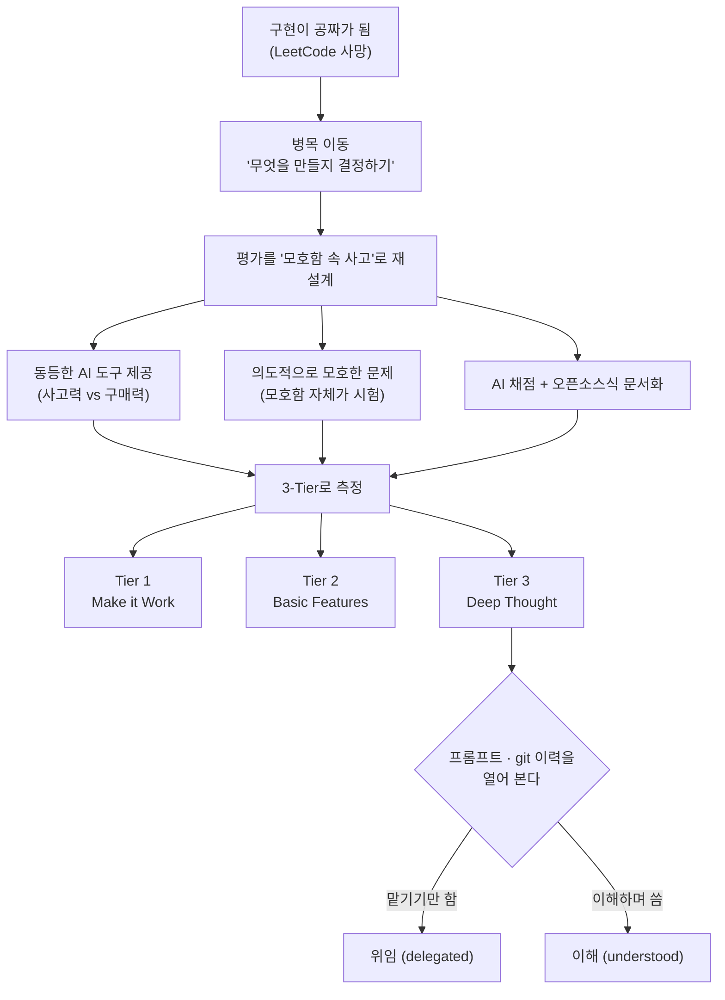

<figure class="post-figure post-figure--header">
<svg role="img" aria-label="정답 찾기 시대의 상징인 낡은 코딩 테스트 시험지가 X 표시와 함께 버려지고, 그 자리를 모호한 기획 메모, 사고하는 지원자, 그리고 완성도보다 사고의 깊이 쪽으로 기운 저울이 대신하는 그림." viewBox="0 0 720 300" font-family="var(--font-body)" xmlns="http://www.w3.org/2000/svg">
  <title>정답 찾기에서 질문 이해로 — 버려진 코딩 테스트와 그 자리를 채우는 모호한 메모·사고하는 지원자·깊이를 재는 저울</title>
  <defs>
    <marker id="hdr-arrow" viewBox="0 0 10 10" refX="8" refY="5" markerWidth="7" markerHeight="7" orient="auto-start-reverse">
      <path d="M0 0 L10 5 L0 10 z" fill="var(--gold)"/>
    </marker>
  </defs>

  <!-- A. 버려진 코딩 테스트 시험지 -->
  <g transform="rotate(-7 118 150)">
    <rect x="64" y="74" width="108" height="150" rx="4" fill="var(--bg-light)" stroke="currentColor" stroke-width="1.6" opacity="0.9"/>
    <g stroke="currentColor" stroke-width="2" opacity="0.32" stroke-linecap="round">
      <line x1="80" y1="98" x2="150" y2="98"/>
      <line x1="80" y1="116" x2="138" y2="116"/>
      <line x1="80" y1="134" x2="156" y2="134"/>
      <line x1="80" y1="152" x2="130" y2="152"/>
      <line x1="80" y1="170" x2="150" y2="170"/>
      <line x1="80" y1="188" x2="126" y2="188"/>
    </g>
    <g stroke="var(--accent-color)" stroke-width="4" stroke-linecap="round">
      <line x1="74" y1="86" x2="162" y2="212"/>
      <line x1="162" y1="86" x2="74" y2="212"/>
    </g>
  </g>
  <text x="118" y="252" text-anchor="middle" font-size="12" fill="var(--text-light)">코딩 테스트</text>
  <line x1="82" y1="248" x2="154" y2="248" stroke="var(--accent-color)" stroke-width="1.6"/>
  <text x="118" y="270" text-anchor="middle" font-size="10.5" font-weight="700" fill="var(--accent-color)">버려짐</text>

  <!-- 대체 화살표 -->
  <line x1="192" y1="150" x2="238" y2="150" stroke="var(--gold)" stroke-width="2.4" marker-end="url(#hdr-arrow)"/>
  <text x="215" y="138" text-anchor="middle" font-size="10.5" fill="var(--text-light)">대체</text>

  <!-- B. 모호한 기획 메모 -->
  <circle cx="300" cy="88" r="5" fill="var(--secondary-color)"/>
  <rect x="256" y="92" width="88" height="116" rx="4" fill="var(--bg-light)" stroke="currentColor" stroke-width="1.6"/>
  <text x="300" y="158" text-anchor="middle" font-size="40" font-weight="700" fill="var(--secondary-color)">?</text>
  <g stroke="currentColor" stroke-width="2" opacity="0.3" stroke-linecap="round">
    <line x1="270" y1="180" x2="330" y2="180"/>
    <line x1="270" y1="194" x2="316" y2="194"/>
  </g>
  <text x="300" y="252" text-anchor="middle" font-size="11" fill="var(--text-light)">모호한 기획 메모</text>

  <!-- 화살표 -->
  <line x1="352" y1="150" x2="382" y2="150" stroke="var(--gold)" stroke-width="2.4" marker-end="url(#hdr-arrow)"/>

  <!-- C. 사고하는 지원자 -->
  <circle cx="440" cy="122" r="20" fill="none" stroke="currentColor" stroke-width="2.2"/>
  <path d="M410 206 C410 172 470 172 470 206" fill="none" stroke="currentColor" stroke-width="2.2"/>
  <ellipse cx="486" cy="94" rx="24" ry="17" fill="var(--bg-light)" stroke="var(--secondary-color)" stroke-width="1.6"/>
  <circle cx="468" cy="116" r="3" fill="var(--bg-light)" stroke="var(--secondary-color)" stroke-width="1.2"/>
  <circle cx="462" cy="126" r="2" fill="var(--bg-light)" stroke="var(--secondary-color)" stroke-width="1.2"/>
  <g stroke="var(--secondary-color)" stroke-width="1.6" fill="none">
    <circle cx="486" cy="94" r="8"/>
    <circle cx="486" cy="94" r="2.6" fill="var(--secondary-color)"/>
    <line x1="486" y1="83" x2="486" y2="86"/>
    <line x1="486" y1="102" x2="486" y2="105"/>
    <line x1="475" y1="94" x2="478" y2="94"/>
    <line x1="494" y1="94" x2="497" y2="94"/>
    <line x1="478.2" y1="86.2" x2="480.3" y2="88.3"/>
    <line x1="493.8" y1="86.2" x2="491.7" y2="88.3"/>
    <line x1="478.2" y1="101.8" x2="480.3" y2="99.7"/>
    <line x1="493.8" y1="101.8" x2="491.7" y2="99.7"/>
  </g>
  <text x="440" y="252" text-anchor="middle" font-size="11" fill="var(--text-light)">사고하는 지원자</text>

  <!-- 저울로 -->
  <line x1="520" y1="150" x2="550" y2="150" stroke="var(--gold)" stroke-width="2.4" marker-end="url(#hdr-arrow)"/>

  <!-- D. 저울 — '깊이' 쪽으로 기운다 -->
  <path d="M614 218 L646 218 L630 196 Z" fill="currentColor" opacity="0.75"/>
  <line x1="630" y1="196" x2="630" y2="150" stroke="currentColor" stroke-width="3"/>
  <line x1="592" y1="138" x2="668" y2="162" stroke="currentColor" stroke-width="3" stroke-linecap="round"/>
  <circle cx="630" cy="150" r="3.5" fill="var(--gold)"/>
  <g stroke="currentColor" stroke-width="1.6" fill="none">
    <line x1="592" y1="138" x2="580" y2="166"/>
    <line x1="592" y1="138" x2="604" y2="166"/>
    <path d="M578 166 Q592 180 606 166"/>
  </g>
  <text x="592" y="196" text-anchor="middle" font-size="9.5" fill="var(--text-light)">완성도</text>
  <g stroke="currentColor" stroke-width="1.6" fill="none">
    <line x1="668" y1="162" x2="656" y2="192"/>
    <line x1="668" y1="162" x2="680" y2="192"/>
    <path d="M654 192 Q668 206 682 192"/>
  </g>
  <rect x="661" y="180" width="14" height="10" rx="2" fill="var(--accent-color)"/>
  <text x="668" y="224" text-anchor="middle" font-size="10.5" font-weight="700" fill="var(--accent-color)">깊이</text>
  <text x="630" y="252" text-anchor="middle" font-size="11" fill="var(--text-light)">사고의 깊이를 잰다</text>
</svg>
<figcaption>‘정답 찾기’ 코딩 테스트가 버려지고, 모호한 기획 메모 → 사고하는 지원자 → 완성도보다 사고의 깊이로 기운 저울로 무게중심이 옮겨간다.</figcaption>
</figure>

## 원문 정보

> - **제목**: The Philosophy: AI Native Hiring (AI 네이티브 채용 시리즈 3부작 Part 1)
> - **출처**: 무신사 기술블로그 (techblog.musinsa.com) · 저자 **Tao Kim**
> - **발행**: 2026-04-23 · 약 20분 분량
> - **원문 링크**: <https://techblog.musinsa.com/the-philosophy-ai-native-hiring-c002c2775b3a>

무신사가 2026년 1월 실제로 진행한 "AI 네이티브 엔지니어" 채용의 설계 철학을 정리한 글이다. 국내 기업이 AI 시대의 신입 평가를 어떻게 다시 설계했는지 1차 자료로 볼 수 있어 Articles에 담는다.

## 한 줄 요약 (TL;DR)

AI가 "코드를 짜는 능력"을 하룻밤 사이에 commodity로 만들자, 무신사는 코딩 테스트를 버리고 **의도적으로 모호한 문제**를 던진 뒤 "무엇을 만들지 스스로 정의하는 힘"과 "AI를 대신 생각하는 도구가 아니라 함께 생각하는 파트너로 쓰는 이해의 깊이"를 재는 채용을 설계했다. 기능이 돌아가는지(Duck Typing)를 넘어, 사고의 깊이를 기능적 완성도보다 무겁게 매기는 **3-Tier 평가 모델**이 그 핵심이다.

## 한눈에 보기

## 왜 이 글을 골랐나

지난 몇 달 이 위키의 Articles에는 "AI가 엔지니어를 대체했는가", "취업 시장이 어떻게 적대적으로 변했는가" 같은 글을 여러 편 정리했다. 대부분은 **문제 진단**이다. AI 때문에 신입의 자리가 사라지고, 채용 파이프라인이 망가지고, 실력이 탈숙련된다는 관찰. 그런데 이 글은 드물게 **한 기업이 그 진단 위에서 실제로 무엇을 했는지**를 보여준다. 그것도 추상적 선언이 아니라, "수강신청 시스템을 만들라"는 문제 하나를 어떻게 설계했고 무엇을 근거로 채점했는지까지 열어 보인다.

개발자 입장에서 이 글은 두 방향으로 유용하다. **지원자로서는** 앞으로의 코딩 테스트가 어디로 가는지 — 무엇을 준비해야 하는지 — 를 미리 보는 지도이고, **면접관·팀 리드로서는** "AI를 써도 되는 시대에 어떻게 변별할 것인가"라는 실무 난제에 대한 구체적 설계 사례다. 진단만 하는 글이 아니라 **처방을 실험한 글**이라서 골랐다.

## 핵심 내용

### 'AI 네이티브'와 얼어붙은 신입 채용

모든 기술 시대에는 그 시대의 네이티브가 있다. 인터넷은 "디지털 네이티브"를, 스마트폰은 "모바일 네이티브"를 만들었고, 이제 AI가 세대를 만든다. 저자가 말하는 **AI 네이티브**는 대학 입학 때 ChatGPT가 있었고 첫 IDE에 Copilot이 깔려 있었으며 첫 프로덕션 버그를 Claude와 함께 잡은 사람들이다. 이들에게 AI는 "도입한 도구"가 아니라 "당연한 환경"이다.

여기서 저자는 핵심 질문을 뒤집는다. 대부분의 조직은 새 세대를 옛 방식으로 "교정"하려 든다. 하지만 AI는 이전 도구를 대체(모바일이 데스크탑을 대체하지 않았듯)하는 게 아니라 **넘어서는** 도구이므로, 물어야 할 질문은 "지원자가 AI를 못 쓰게 하려면?"이 아니라 **"AI를 진짜 잘 쓰는 사람을 어떻게 찾을 것인가?"**여야 한다.

그런데 현실의 기업들은 신입 채용 앞에서 세 갈래로 갈린다고 저자는 정리한다.

- **금지** — 코딩 테스트 중 AI 사용 금지. (실제 도구 없이 코딩시키는 건 목수에게 전동 공구를 빼앗는 격.)
- **무시** — 예전 그대로의 LeetCode 면접. (지원자는 이미 에이전트로 60초 만에 알고리즘을 푼다. 면접관이 못 볼 뿐.)
- **동결** — 신입 채용을 멈추고 "안정될 때까지" 기다림. (빅테크 신입 채용은 2022년 이후 절반 이하로 줄고, 국내 IT 신입 공채는 전년 대비 67% 감소했다고 인용.)

저자는 동결이 가장 눈에 띄고 가장 해로운 반응이라고 본다. 평가가 어려워서가 아니라, **AI가 주니어 업무의 상당 부분을 해치우는 시대에 신입의 자리가 뭔지 아무도 몰라서** 안 뽑는 것이기 때문이다. 그 사이 한 세대의 신입이 좁아진 문 앞에 서 있다.

### 먼저 움직이기 — LeetCode는 죽었다

무신사는 관망 대신 **먼저 정의하기**를 택했다. "AI 네이티브 엔지니어"를 스스로 정의하고, 이론·문제·평가 파이프라인을 직접 만들어 미래에 베팅했다는 것이다. 계산도 있다. AI 네이티브 채용을 먼저 푸는 기업이 이 세대 최고 인재를 끌어오고 나머지는 뒤따르게 된다는 것. 저자는 Andrew Ng의 말("회사 로고의 설렘이 아니라 매일 함께 부대끼는 사람들에게서 배운다")을 인용하며, 결국 목적은 **서로에게서 배우고 함께 성장할 동료를 모으는 것**이라고 못 박는다.

가장 먼저 버린 것은 기존 코딩 테스트다. 이유는 단순하다. **C/C++로 짧은 알고리즘 한 문제? 오늘날 1분이면 끝난다.** AI 에이전트는 LeetCode medium을 몇 초 만에, 상당수 hard도 프롬프트 한 번에 푼다. 코딩 테스트가 측정하려던 것 — "문제를 동작하는 코드로 옮기는 능력" — 이 하룻밤 사이 범용화되어 버린 것이다.

그 자리에서 저자는 Andrew Ng이 스탠퍼드 CS 수업에서 짚은 무게중심 이동을 끌어온다. 과거 엔지니어 대 PM 비율은 7:1~8:1이었다. PM 한 명이 스펙을 쓰면 엔지니어 여럿이 만들었다. AI가 구현을 극적으로 싸게 만들면서 이 비율이 2:1, 심지어 1:1로 무너진다. **기획(사용자 이해·요구사항 정의·판단)은 같은 속도로 빨라지지 않았기 때문에 병목이 이동했다.** 그래서 결론은 이렇다.

> 구현이 싸다면, 비싼 건 뭘까요? 무엇을 구현할지 아는 것.

모호한 상황에서 실제 요구사항을 도출하고, 불확실성 속에서 합리적으로 결정하고, AI를 올바른 방향으로 이끄는 능력 — 기존 코딩 테스트는 이걸 전혀 측정하지 못한다. 이 진단은 이 위키에서 이미 여러 번 마주친 것과 정확히 겹친다. [코드가 공짜가 되면 무엇이 비싸지는가(Martin Fowler Fragments)](/2026/06/23/fowler-fragments-verification-cognitive-surrender.html)와 [decide-execute-deliver 샌드위치](/2026/06/19/ai-hasnt-replaced-engineers.html)가 말하던 바로 그 지점이다.

### 공정성: 사고력인가 구매력인가

테스트를 새로 설계하며 저자가 만난 첫 벽은 **공정성**이었다. 처음엔 각자 로컬 환경을 쓰게 할까 했다("환경 구축도 실력"). 그러나 "AI 도구"가 핵심 변수가 되는 순간 자유와 공정성의 균형이 깨진다. 2~3시간짜리 테스트에서 잘 세팅된 에이전트(ChatGPT Pro, Claude Max, 최적화된 IDE 연동, 커스텀 프롬프트)를 가진 사람과 아닌 사람의 차이는 압도적인데, **그건 실력 차이가 아니라 자본 차이**다.

> 사고력을 테스트하고 싶었지, 구매력을 테스트하고 싶은 게 아니었습니다.

그래서 무신사는 모든 지원자에게 **동등한 AI 환경**을 제공했다. OpenAI와 협업해 지원자 전원에게 충분한 토큰의 무료 에이전트를 줬다. 도구 조건을 평평하게 맞추고, 진짜 중요한 사고력만 남겨 겨루게 한 것이다.

### 모호함의 스펙트럼과 오픈소스라는 해법

<figure class="post-figure">
<svg role="img" aria-label="모호함의 스펙트럼을 나타낸 가로 눈금. 왼쪽 끝은 완전 모호로 신호가 없고, 오른쪽 끝은 반쪽 모호로 엔드포인트·모델까지 지정되며, 가운데는 모호한 요구와 명확한 결과가 만나는 Sweet spot으로 강조되어 있다." viewBox="0 0 680 210" font-family="var(--font-body)" xmlns="http://www.w3.org/2000/svg">
  <title>모호함의 스펙트럼과 Sweet spot</title>

  <!-- 스펙트럼 막대 -->
  <rect x="60" y="120" width="560" height="16" rx="8" fill="var(--bg-sunken)" stroke="currentColor" stroke-width="1.4"/>
  <line x1="60" y1="110" x2="60" y2="146" stroke="currentColor" stroke-width="2"/>
  <line x1="620" y1="110" x2="620" y2="146" stroke="currentColor" stroke-width="2"/>

  <!-- Sweet spot 강조 구간 -->
  <rect x="284" y="114" width="112" height="28" rx="6" fill="var(--secondary-color)" opacity="0.18"/>
  <rect x="284" y="114" width="112" height="28" rx="6" fill="none" stroke="var(--secondary-color)" stroke-width="2"/>

  <!-- Sweet spot 깃발 -->
  <line x1="340" y1="98" x2="340" y2="118" stroke="var(--secondary-color)" stroke-width="2"/>
  <rect x="296" y="74" width="88" height="24" rx="4" fill="var(--secondary-color)" opacity="0.16"/>
  <rect x="296" y="74" width="88" height="24" rx="4" fill="none" stroke="var(--secondary-color)" stroke-width="1.4"/>
  <text x="340" y="90" text-anchor="middle" font-size="12" font-weight="700" fill="var(--secondary-color)">Sweet spot</text>

  <!-- 왼쪽 끝 -->
  <text x="96" y="104" text-anchor="middle" font-size="12" font-weight="700" fill="var(--text-color)">완전 모호</text>
  <text x="96" y="170" text-anchor="middle" font-size="10.5" fill="var(--text-light)">신호 없음 · 막막함</text>

  <!-- 오른쪽 끝 -->
  <text x="588" y="104" text-anchor="middle" font-size="12" font-weight="700" fill="var(--text-color)">반쪽 모호</text>
  <text x="588" y="170" text-anchor="middle" font-size="10.5" fill="var(--text-light)">엔드포인트·모델 지정</text>

  <!-- 가운데 설명 -->
  <text x="340" y="170" text-anchor="middle" font-size="11" font-weight="700" fill="var(--secondary-color)">모호한 요구 + 명확한 결과</text>
  <text x="340" y="190" text-anchor="middle" font-size="10" fill="var(--text-light)">AI는 실행하되, 무엇을 실행할지는 못 정한다</text>
</svg>
<figcaption>모호함의 스펙트럼 — 완전 모호와 반쪽 모호 사이, ‘모호한 요구 + 명확한 결과’의 Sweet spot에서만 지원자의 사고가 드러난다.</figcaption>
</figure>

AI 시대 문제 설계의 가장 어려운 변수는 **문제가 얼마나 모호해야 하는가**였다. 저자는 이를 스펙트럼으로 본다.

- **완전 모호** — "유용한 걸 만들어라." 의도를 모르니 AI에게도 어렵지만, 지원자에게도 신호가 너무 적어 비생산적이다.
- **반쪽 모호** — "이 엔드포인트로 REST API를 만들어라." 엔드포인트·데이터 모델·UI를 지정하는 순간 사실상 구현을 알려준 셈이라, AI가 반쯤 빈 상자를 추론으로 몇 분 만에 채운다.
- **Sweet spot** — **모호한 요구사항 + 명확한 결과 기대치.** 무엇을 만들지는 지원자가 도출하되, 도달해야 할 결과는 분명하다. "AI는 실행할 수 있지만 무엇을 실행할지 결정할 수는 없다"는 틈을 정확히 겨냥한 것이다.

그래서 엣지 케이스 처리, NFR, API 엔드포인트를 명시하지 않고 "시스템이 무엇을 해야 하는지"만 적은 뒤 한 줄을 덧붙였다. **"명시되지 않은 모든 사항은 자유롭게 결정하세요."** 저자의 표현으로 **모호함 자체가 테스트**이며, 이것이 "AI 네이티브"와 "AI 의존"을 가르는 선이다 — 스펙이 알려주지 않을 때 스스로 무엇을 해야 하는지 파악할 수 있는가.

다만 여기엔 딜레마가 있었다. 신호를 얻으려 풀 서비스(DB·API·비즈니스 로직·동시성)를 요구하면 수백 개 제출물을 자동 채점해야 하는데, 그러려면 실행 방법을 알아야 하고 — Docker나 스키마·엔드포인트를 지정하는 순간 그게 곧 구현 힌트가 되어 AI가 사고를 건너뛴다. **테스트 가능성을 높일수록 구체성이 올라가고, 구체성이 올라갈수록 지원자의 사고는 얕아진다.**

해법은 뜻밖에도 **오픈소스**에서 왔다. 좋은 OSS 프로젝트는 채점표에 엔드포인트나 Docker 명령을 적어두지 않아도 README만 읽으면 빌드·실행되고, 헬스체크와 API 문서가 갖춰져 있다. 그래서 인프라를 지정하는 대신 **"좋은 오픈소스처럼 문서화하라"**고 했고, 무신사의 평가 에이전트(역시 AI)가 그 문서를 읽어 빌드하고 기능을 테스트했다. 남이 테스트할 수 있게 신경 쓰는 지원자는 지시 없이도 자연스레 README·빌드 스크립트·헬스체크·API 문서를 잘 쓴다 — **코드를 포장하는 방식 자체가 평가 대상**이 된 것이다.

### 실제 문제: 수강신청 시스템과 '숨겨진 깊이'

실제 시험은 **대학교 수강신청 시스템 구축**이었다. 문제는 기획팀 메모 한 장으로 시작한다. "매 학기 수강신청마다 서버가 다운돼 학생 불만이 폭주한다. 이번엔 제대로 된 시스템을 만들어 달라." 기본 기능(조회·신청·취소·시간표)과 18학점 상한·시간 충돌이 언급되고, 결정적인 한 줄이 붙는다.

> 정원이 1명 남은 강좌에 100명이 동시에 신청해도, 정확히 1명만 성공해야 합니다.

그게 전부다. 락 메커니즘도, 성능 요구사항도, 인증·취소·선수과목 규칙도 없다. "수강신청 시스템을 만들라고 했으면 이미 무엇을 만들지 알려준 것 아니냐"는 반문에, 저자는 되묻는다. **"수강신청 시스템"을 한 문장으로 정의할 수 있는가?** 그 네 글자 뒤에는 극한 경쟁의 동시성, 비즈니스 규칙이 엮인 데이터 정합성, 부하 상태의 성능, 실패 모드, 시간표 엣지 케이스, 좌석 배분의 공정성이 숨어 있다. 문제 정의는 저 한 문장에서 **시작**될 뿐 사양서가 아니다. 저자의 표현대로 "과학자와 수학자가 정의에서 출발하는 건, 정의하는 행위 자체가 진짜 사고이기 때문"이다.

이 도출은 원래 **시니어 IC의 영역**이었다. 뭉뚱그린 요구를 명확한 기술 방향으로 바꾸는 일. AI라는 사고 파트너가 생기면서 그 경계가 허물어지고, 에이전트와 함께 올바른 질문을 던지고 가정을 흔들고 엣지 케이스를 찾는 주니어는 과거 팀이 하던 일을 혼자 해낼 수 있다. **어떤 엔지니어든 시니어 IC처럼 일할 수 있고, 실제로 그렇게 하는 사람이 무신사가 찾는 사람**이라는 것이다.

의도적 모호함은 자연스러운 갈림길을 만든다. 저자는 그 "숨겨진 깊이"의 예를 셋 든다.

- **데이터 설계 함정** — 시작 시 학생 1만+, 강좌 500+, 교수 100+를 1분 내에 생성하라는 요구. 겉보기엔 간단하지만 복잡성은 **관계**에 있다. 시간대를 랜덤으로 뿌리면 충돌 테스트가 무의미해지고, 정원이 너무 크면 동시성 테스트가 사소해진다. 미리 생각한 지원자는 "이 데이터로 무엇을 검증할지"를 염두에 두고 시더를 **시스템 설계로** 다뤘다.
- **동시성 사다리** — "100명 동시 요청을 처리하라"만 있고 방법은 없다. pessimistic/optimistic lock, 큐, 단일 vs 분산 — 어떤 수준도 "틀린" 게 아니다. `synchronized`를 고르고 이유(단일 인스턴스 범위·단순성·트레이드오프)를 명확히 설명한 지원자가, 이유도 모른 채 Redis 락을 쓴 지원자보다 높은 점수를 받는다. **메커니즘보다 추론이 중요하다.**
- **이중 락 인사이트** — 가장 깊은 분기점(아래 별도 정리).

<figure class="post-figure">
<svg role="img" aria-label="이중 락 개념도. 왼쪽은 강좌 단위 락으로 공유 자원인 정원을 보호해 100명이 몰려도 1명만 성공시키고, 오른쪽은 학생 단위 락으로 18학점·시간충돌·중복 같은 학생별 제약을 지킨다. 둘 다 필요하며, 두 락을 엇갈린 순서로 잡으면 데드락이 발생한다." viewBox="0 0 680 360" font-family="var(--font-body)" xmlns="http://www.w3.org/2000/svg">
  <title>이중 락 — 강좌 단위 락과 학생 단위 락, 그리고 데드락 경고</title>
  <defs>
    <marker id="lk-arrow" viewBox="0 0 10 10" refX="8" refY="5" markerWidth="6.5" markerHeight="6.5" orient="auto-start-reverse">
      <path d="M0 0 L10 5 L0 10 z" fill="var(--gold)"/>
    </marker>
    <marker id="dl-arrow" viewBox="0 0 10 10" refX="8" refY="5" markerWidth="6.5" markerHeight="6.5" orient="auto-start-reverse">
      <path d="M0 0 L10 5 L0 10 z" fill="var(--accent-color)"/>
    </marker>
  </defs>

  <!-- 왼쪽: 강좌 단위 락 -->
  <text x="180" y="42" text-anchor="middle" font-size="13" font-weight="700" fill="currentColor">강좌 단위 락</text>
  <rect x="40" y="54" width="270" height="192" rx="6" fill="none" stroke="currentColor" stroke-width="1.5" opacity="0.55"/>
  <g fill="none" stroke="var(--secondary-color)" stroke-width="1.8">
    <path d="M58 86 L58 78 A6 6 0 0 1 70 78 L70 86"/>
    <rect x="52" y="86" width="24" height="18" rx="2"/>
    <circle cx="64" cy="95" r="2"/>
  </g>
  <text x="90" y="96" text-anchor="start" font-size="11.5" font-weight="700" fill="var(--secondary-color)">공유 자원 = 정원</text>
  <text x="96" y="140" text-anchor="middle" font-size="10.5" fill="var(--text-light)">100명 동시 신청</text>
  <g stroke="var(--gold)" stroke-width="1.6" fill="none">
    <line x1="98" y1="150" x2="236" y2="166" marker-end="url(#lk-arrow)"/>
    <line x1="98" y1="166" x2="236" y2="166" marker-end="url(#lk-arrow)"/>
    <line x1="98" y1="182" x2="236" y2="166" marker-end="url(#lk-arrow)"/>
  </g>
  <rect x="240" y="150" width="52" height="34" rx="4" fill="var(--bg-sunken)" stroke="currentColor" stroke-width="1.4"/>
  <text x="266" y="171" text-anchor="middle" font-size="10.5" fill="currentColor">정원 1</text>
  <text x="180" y="228" text-anchor="middle" font-size="11" font-weight="700" fill="var(--secondary-color)">정확히 1명만 성공 ✓</text>

  <!-- 가운데: AND (둘 다 필요) -->
  <circle cx="340" cy="150" r="20" fill="var(--bg-sunken)" stroke="var(--gold)" stroke-width="1.8"/>
  <text x="340" y="155" text-anchor="middle" font-size="12" font-weight="700" fill="var(--gold)">AND</text>
  <text x="340" y="196" text-anchor="middle" font-size="9.5" fill="var(--text-light)">둘 다 필요</text>

  <!-- 오른쪽: 학생 단위 락 -->
  <text x="500" y="42" text-anchor="middle" font-size="13" font-weight="700" fill="currentColor">학생 단위 락</text>
  <rect x="370" y="54" width="270" height="192" rx="6" fill="none" stroke="currentColor" stroke-width="1.5" opacity="0.55"/>
  <g fill="none" stroke="var(--secondary-color)" stroke-width="1.8">
    <path d="M394 86 L394 78 A6 6 0 0 1 406 78 L406 86"/>
    <rect x="388" y="86" width="24" height="18" rx="2"/>
    <circle cx="400" cy="95" r="2"/>
  </g>
  <text x="424" y="92" text-anchor="start" font-size="11" font-weight="700" fill="var(--secondary-color)">학생별 제약</text>
  <text x="424" y="107" text-anchor="start" font-size="9.5" fill="var(--text-light)">18학점 · 시간충돌 · 중복</text>
  <rect x="384" y="140" width="52" height="26" rx="3" fill="var(--bg-sunken)" stroke="currentColor" stroke-width="1.3"/>
  <text x="410" y="157" text-anchor="middle" font-size="10" fill="currentColor">요청 A</text>
  <rect x="384" y="178" width="52" height="26" rx="3" fill="var(--bg-sunken)" stroke="currentColor" stroke-width="1.3"/>
  <text x="410" y="195" text-anchor="middle" font-size="10" fill="currentColor">요청 B</text>
  <g stroke="var(--gold)" stroke-width="1.6" fill="none">
    <line x1="438" y1="152" x2="466" y2="164" marker-end="url(#lk-arrow)"/>
    <line x1="438" y1="192" x2="466" y2="180" marker-end="url(#lk-arrow)"/>
  </g>
  <rect x="470" y="150" width="94" height="44" rx="4" fill="var(--bg-sunken)" stroke="currentColor" stroke-width="1.4"/>
  <text x="517" y="169" text-anchor="middle" font-size="10" fill="currentColor">둘 다 15학점</text>
  <text x="517" y="185" text-anchor="middle" font-size="10" fill="currentColor">→ 둘 다 통과</text>
  <line x1="517" y1="194" x2="517" y2="214" stroke="var(--accent-color)" stroke-width="1.6" marker-end="url(#dl-arrow)"/>
  <text x="517" y="230" text-anchor="middle" font-size="11" font-weight="700" fill="var(--accent-color)">21학점 초과 ✕</text>

  <!-- 아래: 데드락 경고 -->
  <rect x="70" y="282" width="540" height="60" rx="6" fill="var(--accent-color)" opacity="0.1"/>
  <rect x="70" y="282" width="540" height="60" rx="6" fill="none" stroke="var(--accent-color)" stroke-width="1.8"/>
  <path d="M104 328 L120 298 L136 328 Z" fill="none" stroke="var(--accent-color)" stroke-width="1.8" stroke-linejoin="round"/>
  <text x="120" y="325" text-anchor="middle" font-size="15" font-weight="700" fill="var(--accent-color)">!</text>
  <text x="156" y="308" text-anchor="start" font-size="12" font-weight="700" fill="var(--accent-color)">두 락을 엇갈린 순서로 잡으면 → 데드락</text>
  <text x="156" y="326" text-anchor="start" font-size="10.5" fill="var(--text-light)">강좌→학생 vs 학생→강좌 (순환 대기)</text>
  <g fill="none" stroke="var(--accent-color)" stroke-width="1.5">
    <circle cx="520" cy="312" r="11"/>
    <circle cx="570" cy="312" r="11"/>
    <path d="M530 305 Q545 296 561 305" stroke-width="1.4" marker-end="url(#dl-arrow)"/>
    <path d="M561 319 Q545 328 530 319" stroke-width="1.4" marker-end="url(#dl-arrow)"/>
  </g>
  <text x="520" y="315" text-anchor="middle" font-size="8" font-weight="700" fill="var(--accent-color)">락A</text>
  <text x="570" y="315" text-anchor="middle" font-size="8" font-weight="700" fill="var(--accent-color)">락B</text>
</svg>
<figcaption>이중 락 — 강좌 단위 락은 공유 자원(정원)을, 학생 단위 락은 학생별 제약(18학점·시간충돌·중복)을 지킨다. 둘 다 필요하고, 락 순서가 엇갈리면 데드락이 열린다.</figcaption>
</figure>

대부분의 지원자는 동시성을 **강좌 레벨 락** 하나로만 생각한다. 정원이라는 공유 자원을 보호하면 100명이 1자리에 몰려도 1명만 성공한다. 하지만 그건 문제의 절반이다. 같은 학생이 서로 다른 과목에 대해 두 요청을 동시에 보내면(더블클릭이든 탭 두 개든), 둘 다 "18학점 미만?"을 확인하고 둘 다 15학점을 보고 둘 다 통과해 21학점이 된다. 학점 제한이 깨진다. 같은 패턴이 시간 충돌 감지와 중복 수강 체크도 무너뜨린다. 그래서 **강좌 레벨 직렬화(공유 자원)와 학생 레벨 직렬화(학생별 제약)가 둘 다 필요**하고, 둘 다 필요해지는 순간 **락 순서가 엇갈리면 데드락**이라는 새 함정이 열린다.

저자에 따르면 두 범위의 락을 모두 구현한 명확한 증거를 남긴 지원자는 **다섯 중 한 명이 채 안 됐고**, 그중에서도 절반가량만 프롬프트나 설계 문서에서 이 문제를 스스로 짚어낸 흔적을 남겼다. 나머지는 에이전트가 알아서 처리한 경우다. 여기서 저자의 태도가 흥미롭다. **혼자 알아냈든 에이전트와의 대화로 도달했든 상관없다** — Duck Typing의 원리처럼, 깊은 사고의 과정을 거쳐 깊은 사고의 결과가 나왔다면 그건 실력이라는 것. 다만 한 걸음 더 나아가 "왜 이렇게 풀어야 하는지"를 문서로 남겨 다음에도 스스로 판단할 수 있는 사람 — 그 차이를 드러내는 것이 평가 모델의 목표다.

### 3-Tier 평가 모델 — Duck Typing을 넘어

철학은 측정 가능해야 한다. 그래서 무신사는 각 단계가 점점 더 깊은 질문을 던지는 **3-Tier 평가 모델**을 만들었다(자동 평가의 기술적 한계는 Part 2·3의 주제로 넘긴다).

- **Tier 1 — Make it Work.** 빌드되는가? 시작되는가? 헬스체크에 응답하는가? 동작하는 서비스를 배포하지 못하면 나머지는 의미 없다.
- **Tier 2 — Basic Features.** API가 동작하고 비즈니스 규칙이 시행되며 동시성 제어가 부하에서 버티는가? Docker 컨테이너 안 자동화 테스트로 사람 손 없이 채점한다.
- **Tier 3 — Deep Thought.** Duck Typing을 넘어 **내부를 들여다본다.** 프롬프트 이력, 에이전트 지침, 요구사항 도출 문서, 데이터 설계, 코드 품질, 테스트 커버리지, git 이력까지 AI가 평가하고, **모든 점수에 파일 경로와 라인 번호가 근거로 붙는다.**

Tier 1·2는 Duck Typing이다 — 동작하는 시스템처럼 굴면 동작하는 시스템이고, 어떻게 도달했는지는 묻지 않는다. Tier 3에서 가르려는 건 **"맡기기만 했는지, 이해하며 썼는지"**다. 저자는 여기에 Anthropic의 연구("How AI assistance impacts the formation of coding skills," Shen & Tamkin, 2026)를 근거로 붙인다. AI에 맡기기만 하는 엔지니어는 당장 빠르지만, **이해하며 AI를 사고의 파트너로 쓰는 엔지니어는 역량이 복리로 쌓인다.** 최고 성과자가 1.2~2배 생산적이었던 것도 AI를 사고의 대체재가 아니라 파트너로 썼기 때문이라는 것이다.

그래서 채점의 핵심 원칙은 **"사고의 깊이가 기능적 완성도보다 무겁다"**로 정리된다. 두 지원자가 똑같이 이중 락을 구현했어도(Duck Typing으로는 동등), 한 명은 점점 깊어지는 프롬프트로 파고들며 이유를 문서로 남겼고 다른 한 명은 범용 프롬프트로 답만 얻고 넘어갔다면, 결과는 같아도 이해의 깊이는 전혀 다르다. 기능 점수는 높은데 깊이가 얕으면 **AI 과의존 신호**이고, 빌드에 삐끗했어도 설계 사고가 탁월하면 면접할 가치가 있다. 저자의 마무리 문장이 이 철학을 압축한다.

> 정답에 도달한 사람만 찾는 게 아닙니다. 질문을 이해한 사람을 찾고 있습니다.

## 분석과 인사이트

**첫째, 이 글의 가장 큰 미덕은 "진단"이 아니라 "설계"라는 점이다.** AI가 채용을 망가뜨렸다는 이야기는 이미 넘친다 — 이 위키만 해도 [취업도 소프트웨어도 망가졌다](/2026/06/25/jobs-and-software-is-fucked.html)에서 자동 스크리닝이 만든 적대적 채용을 정리했다. 무신사 글의 값어치는 같은 문제 위에서 **버릴 것(LeetCode)·평평하게 할 것(도구 격차)·재설계할 것(모호함·문서화·3-Tier)**을 구체적 문제 하나로 보여준다는 데 있다. "AI를 막을 것인가"에서 "AI를 잘 쓰는 사람을 어떻게 변별할 것인가"로 질문을 옮긴 것 자체가 실무자에게 주는 가장 큰 선물이다.

**둘째, "모호함을 시험으로 삼는다"는 발상은 [The Untrainable](/2026/06/23/the-untrainable.html)의 논리와 정확히 맞물린다.** 그 글의 핵심은 "측정할 수 있는 일은 학습 가능하고, 따라서 commodity가 된다 — 해자는 벤치마크할 수 없는 곳에 남는다"였다. 무신사가 LeetCode를 버린 이유가 바로 이것이다. 알고리즘 문제는 정답이 명확해 벤치마크할 수 있고, 벤치마크할 수 있으니 AI가 학습해 범용화했다. 반대로 "모호한 요구에서 무엇을 만들지 정의하는 힘"은 벤치마크하기 어렵고, 그래서 아직 사람의 자리가 남는다. 채용을 "벤치마크 밖의 역량"을 찾는 게임으로 재정의한 셈이다.

**셋째, Tier 3의 "위임 vs 이해" 구분은 이 위키의 탈숙련 논의와 정면으로 만난다.** [AI가 우리의 실력을 망치고 있는가](/2026/06/23/is-ai-ruining-our-skills.html)와 [에이전틱 코딩은 함정이다](/2026/07/03/agentic-coding-is-a-trap.html)가 경고한 것은 "맡기기만 하면 인지 부채가 쌓이고 스킬이 위축된다"였다. 무신사는 이 위험을 **채용 단계에서 측정 지표로 뒤집었다.** 프롬프트 이력과 git 이력을 열어 "이 사람이 이해하며 썼는가"를 근거(파일·라인)와 함께 점수화한다는 발상은, 탈숙련을 개인의 자율에만 맡기지 않고 조직이 **선발 기준으로 강제**할 수 있음을 보여준다. 이건 꽤 강력한 아이디어다.

**넷째, 동의하지만 유보를 두고 싶은 지점들.** 저자는 Part 1이 철학편이고 기계적 채점의 한계는 Part 2·3로 미룬다고 솔직히 밝힌다. 그러나 몇 가지는 지금 짚어둘 만하다.

- **"프롬프트 이력을 열어 이해의 깊이를 잰다"는 것의 게이밍 가능성.** 평가가 "왜 그렇게 했는지 문서로 남긴 사람"을 우대한다는 게 알려지면, 지원자는 이해가 없어도 **설명 문서를 잘 쓰도록** 최적화할 수 있다. AI에게 "이 선택을 정당화하는 설계 노트를 써줘"라고 시키면 그럴듯한 서사가 나온다. 이해의 흔적과 이해의 연기(演技)를 AI 평가자가 얼마나 가려낼 수 있는지는 열린 문제다.
- **"AI가 먼저 풀어버려 지원자가 생각할 기회조차 없었다"는 저자 자신의 관찰.** 이중 락을 에이전트가 알아서 처리한 경우가 많았다는 것은, 문제의 "sweet spot"이 생각보다 좁고 시간이 갈수록 더 좁아진다는 뜻이다. 모델이 강해질수록 오늘의 sweet spot은 내일의 "반쪽 모호"가 된다. 이 평가는 **끊임없이 다시 보정해야 하는 러닝 코스트**를 안고 있다.
- **협찬받은 도구의 공정성.** OpenAI와 협업해 전원에게 동등한 에이전트를 줬다는 건 훌륭하지만, 그렇게 특정 벤더 환경에 맞춰진 평가가 다른 스택에 익숙한 지원자에게 정말 중립적인지는 별개 질문이다.

이런 유보에도 불구하고, **"구현이 공짜가 된 시대에 무엇을 평가할 것인가"에 대해 실제로 무언가를 만들어 본 조직의 기록**이라는 점에서 이 글의 가치는 분명하다. 병목이 만들기에서 결정하기로 옮겨갔다는 진단은 [하용호의 "AI 시대 전문성 재설계"](/2026/06/22/ai-era-expertise-redesign.html)나 [엔지니어링 리더십의 규칙을 다시 쓰다](/2026/07/02/revised-rules-of-engineering-leadership.html)와도 같은 방향을 가리킨다. 여러 관찰자가 서로 다른 자리에서 같은 결론에 도달하고 있다는 것 자체가 신호다.

## 적용 포인트

**채용·평가를 설계하는 리드라면**

- 코딩 테스트에서 **AI 사용을 금지하지 말고, 도구 격차를 평평하게** 만든 뒤 사고력을 겨루게 하라. "AI를 막는 시험"은 2020년의 역량을 측정할 뿐이다.
- 문제를 **"모호한 요구 + 명확한 결과"**로 설계하라. 엔드포인트·스키마·NFR을 명시하는 순간 AI가 사고를 건너뛴다. 결과 기대치(예: "100명 중 1명만 성공")는 못박되, 메커니즘은 지원자에게 맡겨라.
- 결과물뿐 아니라 **프롬프트 이력·설계 문서·git 이력**을 함께 보라. "맡겼는지, 이해하며 썼는지"를 근거와 함께 채점하면 AI 과의존 신호가 드러난다.
- 채점 원칙을 한 줄로 합의하라 — **사고의 깊이 > 기능적 완성도.** 빌드에 삐끗했어도 설계 사고가 탁월하면 만나볼 가치가 있다.

**지원자·주니어 엔지니어라면**

- 준비의 초점을 "알고리즘 암기"에서 **"모호한 요구를 스스로 정의하는 연습"**으로 옮겨라. 애매한 한 줄 요구에서 엣지 케이스·NFR·실패 모드를 뽑아내는 훈련이 곧 시니어 IC의 역량이다.
- AI를 **답을 대신 내는 도구가 아니라 함께 생각하는 파트너**로 써라. 결론만 받지 말고 "왜 이 선택인지"를 스스로 정리하고 남겨라 — 복리로 쌓이는 쪽은 이해하며 쓰는 사람이다.
- **동작하는 것과 이해한 것을 구분**하라. 이중 락처럼 겉으로 안 드러나는 함정(공유 자원 vs 학생별 제약, 락 순서 데드락)을 스스로 짚고 문서로 남기는 습관이 변별력이 된다.
- 코드를 **"남이 빌드·실행·테스트할 수 있게"** 포장하라. README·헬스체크·API 문서는 부가물이 아니라 그 자체로 평가 신호다.

## 마무리

이 글은 "AI가 신입 개발자를 필요 없게 만들었다"는 흔한 결론에 정면으로 맞선다. 저자의 진단은 오히려 반대다 — AI 덕분에 **주니어도 시니어 IC처럼 일할 수 있게 되었고**, 그래서 채용이 재는 대상이 "코드를 짜는 능력"에서 "무엇을 만들지 정의하고, AI를 이해하며 함께 생각하는 능력"으로 옮겨갔을 뿐이다. LeetCode의 죽음은 신입의 죽음이 아니라, 신입을 재던 낡은 자의 죽음이다. "정답에 도달한 사람이 아니라 질문을 이해한 사람을 찾는다"는 한 문장은, 코드가 공짜가 된 시대에 사람의 몫이 어디에 남는지를 채용이라는 가장 현실적인 자리에서 정확히 짚는다.

### 더 읽어보기

- [원문 — The Philosophy: AI Native Hiring (Tao Kim, 무신사 기술블로그)](https://techblog.musinsa.com/the-philosophy-ai-native-hiring-c002c2775b3a)
- [취업도 소프트웨어도 망가졌다](/2026/06/25/jobs-and-software-is-fucked.html) — AI가 채용을 어떻게 적대적으로 만들었나. 무신사 글이 답하려는 바로 그 "얼어붙은 채용" 문제의 반대편 기록.
- [The Untrainable — 벤치마크할 수 없는 일에 가치가 남는다](/2026/06/23/the-untrainable.html) — "측정할 수 있으면 commodity가 된다"는 논리. LeetCode를 버린 이유와 정확히 맞물린다.
- [AI는 왜 소프트웨어 엔지니어를 대체하지 못했나](/2026/06/19/ai-hasnt-replaced-engineers.html) — decide-execute-deliver 샌드위치. "만들기에서 결정하기로"의 짝.
- [코드가 공짜가 되면 무엇이 비싸지는가 (Martin Fowler Fragments)](/2026/06/23/fowler-fragments-verification-cognitive-surrender.html) — "구현이 싸다면 비싼 건 무엇을 구현할지 아는 것"의 이론적 배경.
- [AI가 우리의 실력을 망치고 있는가](/2026/06/23/is-ai-ruining-our-skills.html) · [에이전틱 코딩은 함정이다](/2026/07/03/agentic-coding-is-a-trap.html) — Tier 3가 가르려는 "위임 vs 이해"의 위험, 즉 탈숙련·인지 부채를 다룬 두 편.
- [AI 시대, 나의 전문성을 재설계하는 법 (하용호)](/2026/06/22/ai-era-expertise-redesign.html) — 무게중심이 생산에서 검증·결정으로 옮겨간다는 같은 진단의 국내 발표.
