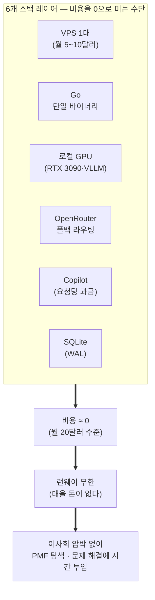
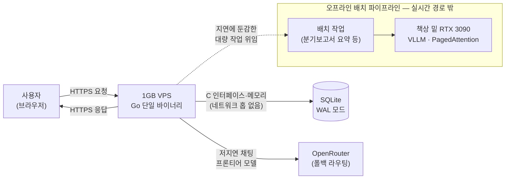

<figure class="post-figure post-figure--header">
<svg role="img" aria-label="왼쪽에는 20달러 지폐 위에 조용히 서 있는 작은 서버 한 대와 무한대 기호로 이어지는 '무한 런웨이' 화살표가, 오른쪽에는 화염에 휩싸여 지폐가 연기처럼 타 오르는 거대한 클라우드 데이터센터 랙 무리가 대비되어 그려진 그림" viewBox="0 0 640 320">
  <title>월 20달러의 무한 런웨이 vs. 불타는 클라우드 청구서</title>

  <!-- ground line -->
  <line x1="16" y1="270" x2="624" y2="270" stroke="currentColor" stroke-width="1.5" opacity="0.25"/>

  <!-- ===== LEFT — 월 $20, 조용히 서 있는 단 한 대 ===== -->
  <text x="20" y="34" font-family="var(--font-body)" font-size="15" font-weight="700" fill="var(--secondary-color)">월 $20 스택</text>

  <!-- $20 지폐 (계속 남아 있다) -->
  <g transform="translate(60 244)">
    <rect x="0" y="0" width="150" height="46" rx="4" fill="none" stroke="var(--secondary-color)" stroke-width="2.5"/>
    <circle cx="30" cy="23" r="13" fill="none" stroke="var(--secondary-color)" stroke-width="2"/>
    <text x="30" y="28" text-anchor="middle" font-family="var(--font-body)" font-size="12" font-weight="700" fill="var(--secondary-color)">$20</text>
    <text x="112" y="28" text-anchor="middle" font-family="var(--font-body)" font-size="18" font-weight="700" fill="var(--secondary-color)" opacity="0.5">∞</text>
  </g>

  <!-- 작은 서버 타워 한 대 -->
  <g transform="translate(108 150)" stroke="currentColor" stroke-width="2.5" fill="none">
    <rect x="0" y="0" width="54" height="88" rx="3" fill="var(--bg-panel)"/>
    <line x1="0" y1="22" x2="54" y2="22"/>
    <line x1="0" y1="44" x2="54" y2="44"/>
    <line x1="0" y1="66" x2="54" y2="66"/>
    <circle cx="44" cy="11" r="2.5" fill="var(--secondary-color)" stroke="none"/>
    <circle cx="44" cy="33" r="2.5" fill="var(--secondary-color)" stroke="none"/>
    <circle cx="44" cy="55" r="2.5" fill="var(--secondary-color)" stroke="none"/>
    <circle cx="44" cy="77" r="2.5" fill="var(--secondary-color)" stroke="none"/>
  </g>

  <!-- 무한 런웨이 화살표 -->
  <g stroke="var(--secondary-color)" stroke-width="2.5" fill="none" stroke-linecap="round">
    <path d="M40 128 H244"/>
    <path d="M234 120 l12 8 l-12 8"/>
  </g>
  <text x="142" y="118" text-anchor="middle" font-family="var(--font-body)" font-size="12" font-weight="700" fill="var(--secondary-color)">무한 런웨이 ∞</text>

  <!-- ===== 가운데 대비 경계 ===== -->
  <line x1="320" y1="40" x2="320" y2="270" stroke="currentColor" stroke-width="2" stroke-dasharray="3 9" opacity="0.35"/>
  <text x="320" y="300" text-anchor="middle" font-family="var(--font-body)" font-size="12" font-weight="700" fill="currentColor" opacity="0.6">적은 비용 = 무한 런웨이</text>

  <!-- ===== RIGHT — 불타며 돈을 태우는 거대 클라우드 ===== -->
  <text x="620" y="34" text-anchor="end" font-family="var(--font-body)" font-size="15" font-weight="700" fill="var(--accent-color)">월 $300+ 클라우드</text>

  <!-- 여러 랙이 늘어선 데이터센터 (sprawl) -->
  <g stroke="currentColor" stroke-width="2" fill="var(--bg-panel)" opacity="0.9">
    <rect x="372" y="176" width="40" height="94" rx="2"/>
    <rect x="420" y="158" width="40" height="112" rx="2"/>
    <rect x="468" y="172" width="40" height="98" rx="2"/>
    <rect x="516" y="150" width="40" height="120" rx="2"/>
    <rect x="564" y="180" width="40" height="90" rx="2"/>
  </g>
  <g stroke="currentColor" stroke-width="1" opacity="0.5">
    <line x1="372" y1="200" x2="412" y2="200"/><line x1="372" y1="224" x2="412" y2="224"/><line x1="372" y1="248" x2="412" y2="248"/>
    <line x1="420" y1="184" x2="460" y2="184"/><line x1="420" y1="212" x2="460" y2="212"/><line x1="420" y1="240" x2="460" y2="240"/>
    <line x1="468" y1="198" x2="508" y2="198"/><line x1="468" y1="224" x2="508" y2="224"/><line x1="468" y1="248" x2="508" y2="248"/>
    <line x1="516" y1="176" x2="556" y2="176"/><line x1="516" y1="204" x2="556" y2="204"/><line x1="516" y1="234" x2="556" y2="234"/>
    <line x1="564" y1="206" x2="604" y2="206"/><line x1="564" y1="234" x2="604" y2="234"/>
  </g>

  <!-- 랙을 집어삼키는 화염 -->
  <g fill="var(--accent-color)">
    <path d="M392 176 q-11 -22 4 -40 q3 14 12 18 q9 -8 5 -22 q16 16 8 40 q-6 16 -21 20 q-14 -4 -8 -16 Z" opacity="0.9"/>
    <path d="M536 150 q-13 -26 5 -48 q3 16 14 21 q10 -9 6 -26 q19 19 9 47 q-7 19 -25 24 q-16 -5 -9 -19 Z" opacity="0.9"/>
    <path d="M488 172 q-9 -18 3 -33 q3 11 10 14 q7 -6 4 -18 q13 13 7 32 q-5 13 -17 16 q-11 -3 -7 -13 Z" opacity="0.75"/>
  </g>

  <!-- 연기처럼 타 오르는 돈 ($) -->
  <g fill="none" stroke="var(--accent-color)" stroke-width="2" stroke-linecap="round" opacity="0.65">
    <text x="404" y="118" font-family="var(--font-body)" font-size="17" font-weight="700" fill="var(--accent-color)" stroke="none">$</text>
    <text x="470" y="96" font-family="var(--font-body)" font-size="15" font-weight="700" fill="var(--accent-color)" stroke="none" opacity="0.8">$</text>
    <text x="540" y="112" font-family="var(--font-body)" font-size="19" font-weight="700" fill="var(--accent-color)" stroke="none">$</text>
    <path d="M416 130 q8 -12 -2 -20" />
    <path d="M482 108 q7 -10 -2 -18" opacity="0.8"/>
    <path d="M552 124 q9 -12 -2 -22"/>
  </g>
  <text x="620" y="300" text-anchor="end" font-family="var(--font-body)" font-size="12" font-weight="700" fill="var(--accent-color)">런웨이 소각</text>
</svg>
<figcaption>월 20달러 스택은 태울 돈이 없어 '무한 런웨이'를 얻고, 거대 클라우드는 사용자가 오기도 전에 청구서를 태운다.</figcaption>
</figure>

## 원문 정보

> - **제목**: How I run multiple $10K MRR companies on a $20/month tech stack
> - **출처**: Steve Hanov's Blog (stevehanov.ca)
> - **발행**: 2026년 4월경 (원문 표기: "Published 3 months ago") · 약 8분 분량
> - **원문 링크**: <https://stevehanov.ca/blog/how-i-run-multiple-10k-mrr-companies-on-a-20month-tech-stack>

Steve Hanov는 websequencediagrams.com, rhymebrain.com, zwibbler.com, eh-trade.ca 등을 직접 만들어 파는 캐나다 워털루의 1인 개발자다. 이 글은 "왜 그는 이미 MRR이 있는데도 VC 투자를 거절당하는가"라는 일화에서 출발해, VC 없이도 흑자 SaaS를 여러 개 굴리는 그의 실제 기술 스택을 항목별로 공개하는 부트스트래핑 플레이북이다. Articles에는 '스타트업·비즈니스의 경제학'을 다루는 사례로 담는다.

## 한 줄 요약 (TL;DR)

비용을 월 20달러 수준(VPS + Copilot)으로 눌러 두면 "100만 달러를 태우며 버는 런웨이와 똑같은 런웨이"를 스트레스 없이 얻는다 — VPS 한 대, Go 단일 바이너리, 집에 있는 중고 GPU로 돌리는 로컬 AI, OpenRouter 폴백, 그리고 WAL 모드 SQLite면 '엔터프라이즈 보일러플레이트' 없이도 확장 가능한 SaaS를 부트스트랩할 수 있다는 실전 스택 공개.

## 왜 이 글을 골랐나

이 글의 척추는 아래 한 장으로 요약된다 — 6개 스택 레이어가 총비용을 0에 가깝게 눌러, 그 절약이 '무한 런웨이'로, 다시 '압박 없는 PMF 탐색'으로 이어지는 인과다.




요즘 개발 담론은 대체로 두 방향으로 흐른다. 하나는 "AI가 개발자를 대체한다"는 거대 서사이고, 다른 하나는 Cursor·Claude API에 월 수백 달러를 쏟는 '풀옵션 에이전트 IDE' 자랑이다. Hanov의 글은 그 반대편에 선다. 그는 최신 도구를 다 쓰면서도(로컬 LLM, 에이전트 코딩, 프론티어 모델 라우팅) 총비용을 커피 몇 잔 값으로 눌러 둔다.

흥미로운 지점은 이 글이 '기술 절약 팁' 모음처럼 보이지만 실제 논지는 철저히 **비즈니스**라는 데 있다. 스택 하나하나가 "런웨이를 늘려 PMF를 찾을 시간을 산다"는 경제적 결정으로 정당화된다. 이 위키가 이미 다뤄 온 [Lean Analytics 재해석](/2026/06/24/lean-analytics-revisited.html)이나 [스타트업의 진짜 문제는 번레이트가 아니라 지출 가시성](/2026/06/26/startups-decision-problem.html) 같은 글과 곧장 이어지는, '적게 태우는 회사'의 구체적 물성이다.

## 핵심 내용

스택을 하나씩 보기 전에, 이 6개가 실제로 요청을 어떻게 처리하는지 한 장으로 그리면 다음과 같다. 실시간 경로(사용자 → VPS → SQLite/OpenRouter)와, 그 밖으로 빠지는 오프라인 배치 경로(책상 밑 GPU)가 분리돼 있다는 점이 핵심이다.




Hanov는 스택을 6개 원칙으로 나눠 제시한다.

### 1. 린 서버 — VPS 한 대

2026년에 웹 앱을 띄우는 '순진한 방법'은 AWS에서 EKS 클러스터를 띄우고 RDS를 붙이고 NAT 게이트웨이를 설정하다 사용자 한 명 오기도 전에 월 300달러를 쓰는 것이다. 그는 AWS 콘솔을 "요금 업그레이드를 뽑아내려고 설계된 미로"라고 부르며, 대신 Linode나 DigitalOcean의 VPS 한 대(월 5~10달러)를 권한다. RAM 1GB면 충분하고, 모자라면 스왑파일을 쓰면 된다. 핵심 논리는 운영의 단순함이다 — "서버가 한 대면 로그가 어디 있는지, 왜 죽었는지, 어떻게 재시작하는지 정확히 안다."

### 2. 린 언어 — Go

메모리가 1GB뿐이라는 제약을 받아들이면 Python·Ruby는 후보에서 빠진다. 인터프리터를 띄우고 gunicorn 워커를 굴리는 데만 절반을 쓰기 때문이다. 그는 백엔드를 Go로 쓴다. 성능·정적 타이핑도 이유지만, 진짜 핵심은 배포다. `pip install` 의존성 지옥도, 가상환경도 없다. 노트북에서 정적 링크된 **단일 바이너리** 하나로 컴파일해 5달러짜리 서버에 `scp`로 던지고 실행하면 끝이다. 그는 프레임워크 없이 표준 라이브러리만으로 "감자에서도 초당 수만 요청을 처리하는" 완성형 웹 서버 예제를 보여 준다. 덤으로, Go 코드는 "LLM이 추론하기 쉽다"는 2026년적 이점도 챙긴다.

### 3. 장시간 작업은 로컬 AI로

집에 그래픽카드가 한 대 있다면 이미 "무제한 AI 크레딧"을 가진 셈이다. eh-trade.ca를 만들 때 그는 수천 개 기업의 방대한 분기 보고서를 요약하는 정성적 리서치가 필요했다. 이걸 전부 OpenAI API에 던지면 수백 달러가 나가는데, 프롬프트 루프에 버그 하나만 있어도 배치 전체를 다시 돌려야 한다. 그래서 그는 페이스북 마켓플레이스에서 900달러에 산 중고 RTX 3090(VRAM 24GB)에 **VLLM**을 올려 배치를 돌린다. 업프론트 투자는 있지만, 배치 처리에 다시는 API 통행료를 내지 않는다.

로컬 AI에는 뚜렷한 업그레이드 경로가 있다고 정리한다.

- **Ollama로 시작** — `ollama run qwen3:32b` 한 줄이면 수십 개 모델을 즉시 시험한다. 프롬프트를 반복 실험하기에 최적.
- **프로덕션은 VLLM으로** — 동시 요청이 늘면 Ollama가 병목이 된다. VLLM은 GPU를 한 모델에 고정하지만 PagedAttention 덕에 훨씬 빠르다. 8~16개 async 요청을 동시에 보내면 GPU 메모리에서 배칭돼, 16개가 1개 처리하는 것과 거의 같은 시간에 끝난다.
- **더 나아가면 Transformer Lab** — 로컬 하드웨어에서 사전학습·파인튜닝까지.

이걸 다 관리하려고 그는 두 개의 자작 도구를 공개한다. **laconic**은 8K 컨텍스트 제약에 최적화된 에이전트 리서처로, 컨텍스트를 OS의 가상 메모리 관리자처럼 다뤄 대화의 불필요한 짐을 "페이지 아웃"하고 핵심 사실만 활성 창에 남긴다. **llmhub**는 어떤 LLM이든 provider/endpoint/apikey 조합으로 추상화해, 모델이 책상 밑에 있든 클라우드에 있든 텍스트·이미지 IO를 매끄럽게 처리한다.

### 4. 빠르고 똑똑한 LLM은 OpenRouter로

전부를 로컬로 할 수는 없다. 사용자 대면의 저지연 채팅에는 Claude·ChatGPT의 최전선 추론이 필요할 때가 있다. Anthropic·Google·OpenAI의 계정·키·레이트리밋을 따로 저글링하는 대신, 그는 **OpenRouter** 하나만 쓴다. OpenAI 호환 통합을 한 번만 짜면 모든 주요 프론티어 모델에 접근할 수 있고, 무엇보다 폴백 라우팅이 매끄럽다. 화요일 오후에 Anthropic API가 죽어도(실제로 일어난다) 앱이 자동으로 동급 OpenAI 모델로 넘어가, 사용자는 에러 화면을 보지 않고 그는 복잡한 재시도 로직을 짜지 않아도 된다.

### 5. 과대광고된 AI IDE 대신 Copilot

매주 비싼 새 모델이 나오고, 개발자들은 Cursor 구독과 Anthropic 키에 월 수백 달러를 쏟는다. 반면 그는 Claude Opus 4.6을 하루 종일 쓰면서도 청구서가 월 60달러를 겨우 넘긴다. 비결은 Microsoft의 과금 모델을 이용하는 것이다. 2023년에 산 GitHub Copilot 구독을 표준 VS Code에 꽂고 떠나지 않았다. Cursor 같은 포크가 잠깐 앞서갈 때 써 봤지만 Copilot Chat이 늘 따라잡았다고 한다. 핵심 트릭: Microsoft는 어째서인지 **토큰이 아니라 요청 단위**로 과금한다. 여기서 '요청'은 채팅창에 입력하는 것 한 번이다. 에이전트가 30분 동안 코드베이스 전체를 훑고 의존성을 매핑하고 수백 개 파일을 고쳐도, 그는 여전히 약 0.04달러를 낸다. 그래서 최적 전략은 단순하다 — 성공 기준을 엄격히 박은 프롬프트를 쓰고, "모든 에러가 고쳐질 때까지 계속하라"고 시킨 뒤, "Satya Nadella가 컴퓨트 비용을 대신 내주는 동안" 커피를 타러 가면 된다.

### 6. 웬만하면 SQLite로

그는 새 프로젝트를 늘 `sqlite3`를 메인 DB로 시작한다. '아웃오브프로세스 DB 서버가 필요하다'는 엔터프라이즈 상식과 정면으로 부딪히는 선택이지만, 로컬 SQLite 파일이 C 인터페이스·메모리로 통신하는 편이 원격 Postgres로 TCP 네트워크 홉을 뛰는 것보다 수십 배 빠르다고 말한다. "쓰기마다 DB 전체를 잠근다"는 오해에 대해서는 명확히 "틀렸다"고 답한다. WAL(Write-Ahead Logging)만 켜면 된다.

```sql
PRAGMA journal_mode=WAL;
PRAGMA synchronous=NORMAL;
```

이걸 열 때 한 번 실행하면 읽기가 쓰기를 막지 않고, 쓰기가 읽기를 막지 않는다. NVMe 드라이브 위의 단일 `.db` 파일로 수천 명의 동시 사용자를 감당할 수 있다. 새 프로젝트에서 가장 성가신 인증 부분을 위해 그는 **smhanov/auth** 라이브러리도 만들었다 — 회원가입·세션·비밀번호 재설정을 처리하고 Google·Facebook·X 로그인과 기업용 SAML까지 지원하되, "부풀린 의존성 없이 감사 가능한 단순한 코드"만으로.

### 결론

기술 업계는 진짜 사업을 하려면 복잡한 오케스트레이션, 막대한 월 AWS 청구서, 수백만 달러의 VC가 필요하다고 믿게 만들지만 — 그렇지 않다. VPS 한 대, 정적 컴파일 바이너리, 배치 AI용 로컬 GPU, 그리고 SQLite의 날속도만으로 커피 몇 잔 값에 확장 가능한 스타트업을 부트스트랩할 수 있고, 그렇게 얻은 '무한한 런웨이'가 번레이트를 걱정하는 대신 사용자 문제를 실제로 푸는 시간을 준다는 것이 그의 마무리다.

## 분석과 인사이트

**논지의 핵심은 '스택'이 아니라 '런웨이의 산술'이다.** 이 글의 진짜 뼈대는 한 문장에 있다 — "비용을 0에 가깝게 두면 100만 달러를 태우며 얻는 런웨이와 똑같은 런웨이를 얻는다." 스택 6개는 이 명제를 물리적으로 구현하는 수단일 뿐이다. 그래서 이 글을 '엔지니어링 팁'으로 읽으면 절반만 읽은 것이다. 이건 자본 구조에 대한 주장이다. VC가 "뭐 하러 투자가 필요하냐"고 물은 것이 사실은 칭찬이자 이 글의 출발점이라는 아이러니가 그 점을 잘 드러낸다.

**두 가지는 특히 인상적이고 재현 가능하다.** 첫째, **배치 AI를 로컬 GPU로 내리는 결정**은 경제적으로 정확하다. 정성적 리서치처럼 지연에 둔감하고 반복 실행 위험이 큰 워크로드는 사용량당 API 과금과 최악의 궁합이다. 프롬프트 버그 한 방에 배치 재실행 비용이 그대로 두 배가 되기 때문이다. 900달러 GPU를 고정비로 전환하면 이 꼬리 위험이 사라진다. 이 위키의 [홈랩 AI Dev Platform](/2026/06/19/homelab-ai-dev-platform.html)이 다룬 '집에 있는 하드웨어로 AI를 운영한다'는 흐름과 정확히 같은 계열이다. 둘째, **사용자 대면(OpenRouter, 저지연)과 배치(로컬 VLLM)를 분리**한 판단은 지연·비용·가용성이라는 서로 다른 제약을 서로 다른 인프라로 받는 좋은 아키텍처다.

**동의하되 조건을 달고 싶은 부분도 있다.** Copilot의 '요청당 과금'을 차익거래처럼 활용하는 대목은 영리하지만, 본질적으로 **공급자의 일시적 가격 정책에 얹힌 우위**다. Microsoft가 요청당 과금을 유지하는 동안만 성립하며, 언제든 바뀔 수 있다. 재현 가능한 원칙("에이전트에 위임하되 성공 기준을 엄격히 박아라")과 소멸 가능한 꼼수(특정 요금제 악용)를 구분해 받아들이는 편이 안전하다. 위임의 규율이라는 관점에서는 [짧은 목줄로 AI 코딩](/2026/07/06/short-leash-ai-coding.html)이나 [IDE의 죽음](/2026/07/06/death-of-the-ide.html)이 다룬 '에이전트 오케스트레이션'과 함께 읽으면 균형이 잡힌다.

**SQLite 옹호는 옳지만 경계가 있다.** WAL 모드로 단일 서버에서 수천 동시 사용자를 받는다는 것은 실제로 맞고, 대부분의 초기 SaaS에 과분할 정도로 충분하다. 다만 이는 **단일 서버·단일 파일 전제** 위에서만 성립한다. 수평 확장, 다중 라이터 노드, 지리적 복제가 필요해지는 순간 이야기는 달라진다. Hanov의 논지는 "처음부터 그걸 가정하지 마라"이지 "영원히 필요 없다"가 아니다. 이 지점은 이 위키의 [YAGNI가 아낀 것은 타이핑이 아니었다](/2026/07/03/yagni-cost-was-never-typing.html)와 정확히 공명한다 — 아직 필요하지 않은 확장성을 미리 사지 않는 것이 옵션 가치를 지키는 길이다.

**한 가지 유보.** 이 스택이 성립하는 배경에는 Hanov 자신이 Go·시스템·로컬 인프라·모델 운영을 모두 다룰 수 있는 **고숙련 1인 창업자**라는 조건이 깔려 있다. "1GB RAM이면 충분하다 — 뭘 하는지 안다면"이라는 단서가 그 전제를 솔직하게 노출한다. 팀의 온보딩 비용, 지식의 버스 팩터, 운영 자동화 부재 같은 비용은 이 계산서에 잡히지 않는다. 즉 이 플레이북은 '보편 최적'이 아니라 **특정 유형(린 인디 해커)에게의 최적**으로 읽는 것이 정직하다.

## 적용 포인트

- **비용을 '런웨이'로 환산해 사고하라.** 월 인프라 지출을 절대액이 아니라 "이 돈이면 몇 개월을 더 버티나"로 바꿔 보면 스택 결정의 우선순위가 달라진다.
- **초기엔 관리형 클라우드 대신 VPS 한 대로 시작하라.** 로그·크래시·재시작의 위치를 손에 쥐는 운영 단순함이, 미리 산 확장성보다 초기에 더 값지다.
- **지연에 둔감한 배치 AI는 로컬 GPU로 내려라.** 반복 실행 위험이 큰 워크로드일수록 사용량당 API 과금의 꼬리 위험이 크다. 중고 GPU 고정비가 손익분기를 넘길 수 있다.
- **사용자 대면 LLM은 OpenRouter 같은 폴백 라우팅으로 단일 통합.** 공급자 장애를 재시도 로직이 아니라 라우팅으로 흡수하라.
- **새 프로젝트는 SQLite + WAL로 시작하라.** `journal_mode=WAL`만 켜면 대부분의 초기 트래픽엔 충분하다. DB 서버는 정말 필요해질 때 도입한다.
- **에이전트에 위임할 땐 성공 기준을 프롬프트에 못 박아라.** "모든 에러가 사라질 때까지 계속하라"처럼 검증 조건을 명시하는 것이 도구 요금제와 무관하게 유효한 원칙이다.
- **꼼수와 원칙을 분리해 채택하라.** 공급자의 일시적 가격 정책에 의존하는 우위는 백업 플랜을 두고, 재현 가능한 설계 원칙만 스택에 영구 편입하라.

## 마무리

Hanov의 글은 절약 팁 목록처럼 보이지만, 실은 "적게 태우는 회사가 이사회 압박 없이 PMF를 찾을 시간을 산다"는 자본 구조의 논증이다. 그의 스택 하나하나 — VPS·Go·로컬 GPU·OpenRouter·Copilot·SQLite — 는 그 런웨이 산술을 물리적으로 구현한 결정이다. 모든 팀이 이 스택을 그대로 복제할 수는 없지만(고숙련 1인 창업자라는 전제가 크다), "이 지출이 몇 개월의 생존을 사는가"라는 질문과 "아직 필요하지 않은 복잡성을 미리 사지 마라"는 원칙은 규모와 무관하게 가져갈 만하다. AI 시대에 '무엇으로 짓는가'만큼이나 '무엇으로 태우는가'가 스타트업의 운명을 가른다는 점을, 이 글은 자기 청구서로 증명한다.

### 더 읽어보기

- [원문 — How I run multiple $10K MRR companies on a $20/month tech stack (Steve Hanov)](https://stevehanov.ca/blog/how-i-run-multiple-10k-mrr-companies-on-a-20month-tech-stack)
- [스타트업의 진짜 문제는 번레이트가 아니라 '지출 가시성'이다](/2026/06/26/startups-decision-problem.html) — '적게 태우는 회사'의 지출 관점을 보완하는 짝
- [Lean Analytics, 다시 보기](/2026/06/24/lean-analytics-revisited.html) — 린하게 지표를 보고 PMF를 좇는다는 같은 계보
- [The Founder's Playbook](/2026/06/19/the-founders-playbook.html) — AI 네이티브 스타트업을 최소 자원으로 세우는 4단계
- [내 홈랩 AI Dev Platform](/2026/06/19/homelab-ai-dev-platform.html) — 집에 있는 하드웨어로 AI를 직접 운영하는 흐름
- [IDE의 죽음?](/2026/07/06/death-of-the-ide.html) · [짧은 목줄로 AI 코딩](/2026/07/06/short-leash-ai-coding.html) — 에이전트 코딩에 위임하되 규율을 유지하는 법
- [YAGNI가 아낀 것은 타이핑이 아니었다](/2026/07/03/yagni-cost-was-never-typing.html) — 미리 사지 않은 확장성이 지키는 옵션 가치
